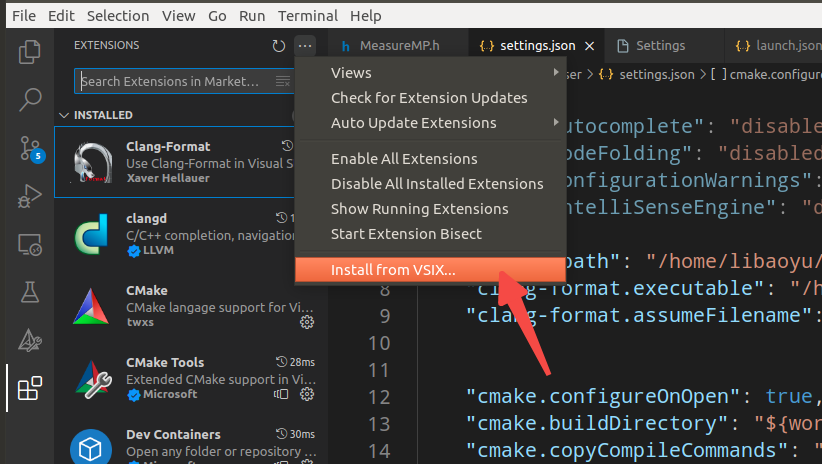
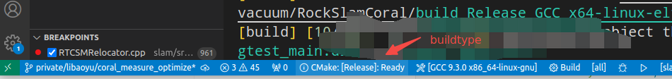
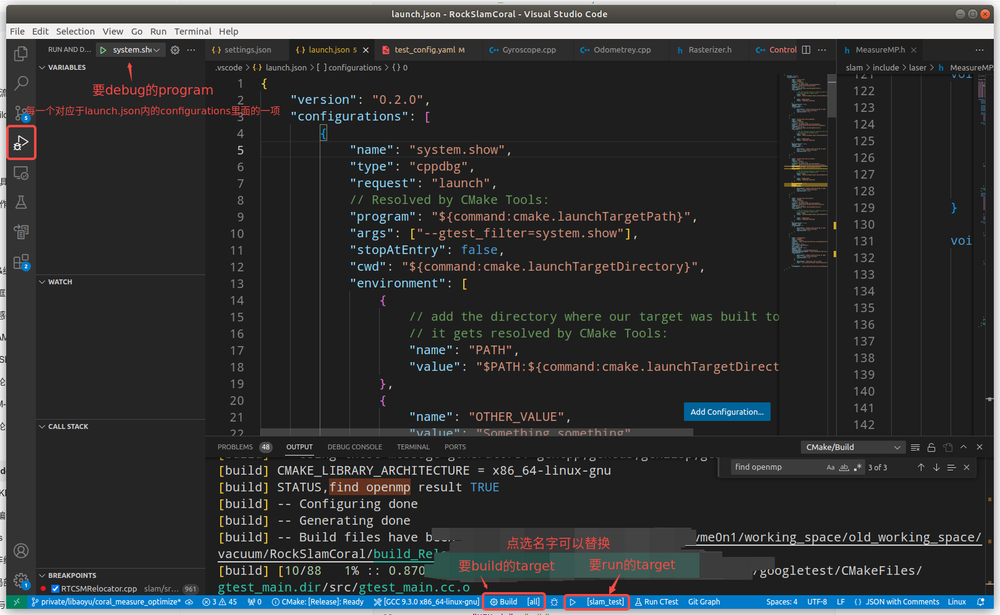

# VSCode配置

# C/C++

## 代码跳转

* clangd

  * vscode自带c/c++自动补全、跳转的替代，clangd速度更快，语法更准，是clion里面用的技术

  * client\&server架构，扩展本身只是个client，需要在本机安装clangd才可进行代码补全和跳转

  * 需要clangd版本比较高，经过测试clangd16及以上可以正常运行，而Ubuntu18.04的clang默认是14版本，所以需要手动安装llvm来更新clang、clangd

    * 下载源代码[Getting Started with the LLVM System — LLVM 18.0.0git documentation](https://llvm.org/docs/GettingStarted.html#getting-the-source-code-and-building-llvm)

    * 编译并安装llvm

```yaml
  cd /path/to/llvm/code
  mkdir build && cd build
  cmake -DCMAKE_BUILD_TYPE=Release -DCMAKE_INSTALL_PREFIX=<path/to/dist> -DLLVM_ENABLE_PROJECTS="clang;lld;clang-tools-extra;lldb;polly;flang;mlir;openmp" ../llvm
```

### 扩展文件下载

* [Visual Studio Marketplace](https://marketplace.visualstudio.com/vscode)

  * 这里提供已下载好的，方便使用

  * [📎extensions.tar.gz](https://cinderella.yuque.com/attachments/yuque/0/2024/gz/2869141/1705311348636-442359fc-806a-438a-b8c2-4a7b4165a83a.gz)

* 下载完成，通过网关传进内网机

  * 在vscode的扩展界面安装




## 格式化

* clang-format配置文件(by 明理)，注意clang-format要求的

* vscode配置项

```yaml
{
          # clangd的自动补全和跳转，与C/CPP冲突，C/CPP的效果不行，关闭
          # 如果cmake和cmake tools不是从c/c++ extension pack安装的，则没有c/cpp这个扩展，也就不用设置这几项
    "C_Cpp.autocomplete": "disabled",
    "C_Cpp.codeFolding": "disabled",
    "C_Cpp.configurationWarnings": "disabled",
    "C_Cpp.intelliSenseEngine": "disabled",
          
          # clangd的可执行程序路径
    "clangd.path": "/home/libaoyu/depdist/clang_dist/bin/clangd",
    # clang-format的可执行程序以及配置文件的路径
    "clang-format.executable": "/home/libaoyu/depdist/clang_dist/bin/clang-format",
    "clang-format.assumeFilename": "/home/libaoyu/working_space/.clang-format",

          # cmake扩展的一些配置
    "cmake.configureOnOpen": true,
    "cmake.options.statusBarVisibility": "visible",
    "cmake.buildDirectory": "${workspaceFolder}/build_${buildType}_${buildKitVendor}_${buildKitTriple}_${buildKitVersion}",
    "cmake.copyCompileCommands": "${workspaceFolder}/build/compile_commands.json",
    "cmake.buildToolArgs": [
        "-j10"
    ],
    "cmake.options.statusBarVisibility": "visible",
    "cmake.showOptionsMovedNotification": false,
          
         


          # 打开自动保存
    "files.autoSave": "afterDelay"
    
    # 指定使用clang-format来格式化
    "[cpp]": {
        "editor.defaultFormatter": "xaver.clang-format"
    },
}
```

## Debug打断点

有关vscode的debug，在界面中有两大块相关的地方

* 一是在左侧状态栏里面和扩展放在一起的的run and debug

  * 配置好launch.json文件，可以在这里启动debug

  * debug要想断点准，得将buildtype设置成debug



* 另一个是底部状态栏里，装了cmake扩展后会出现的要run的target

  * 如果底部只有小三角，可以点击小三角，vscode会让选择哪个target



```yaml
{
    "version": "0.2.0",
    "configurations": [
        {
            # debug那里显示的名字，可以自由选择
            "name": "current",
            # 不用改
            "type": "cppdbg",
            "request": "launch",
            # debug的程序，建议用cmake扩展自动生成，选哪个target就debug哪个
            "program": "${command:cmake.launchTargetPath}",
            # debug程序时的参数
            "args": ["--gtest_filter=system.show"],
            "stopAtEntry": false,
            "cwd": "${command:cmake.launchTargetDirectory}",
            "environment": [
                {
                    // add the directory where our target was built to the PATHs
                    // it gets resolved by CMake Tools:
                    "name": "PATH",
                    "value": "$PATH:${command:cmake.launchTargetDirectory}"
                },
                {
                    "name": "OTHER_VALUE",
                    "value": "Something something"
                }
            ],
            "externalConsole": false,
            "MIMode": "gdb",
            "setupCommands": [
                {
                    "description": "Enable pretty-printing for gdb",
                    "text": "-enable-pretty-printing",
                    "ignoreFailures": true
                }
            ]
        }
    ]
}
```

