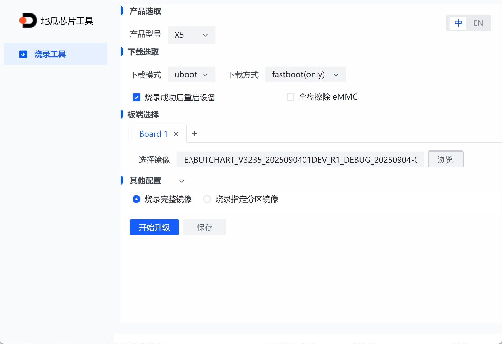
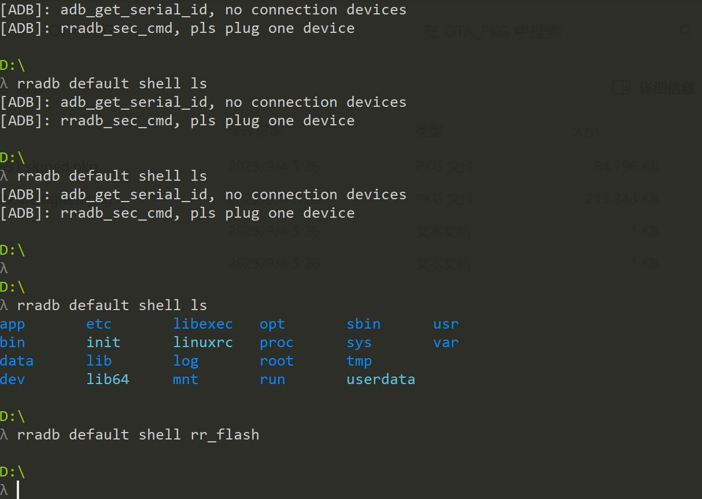
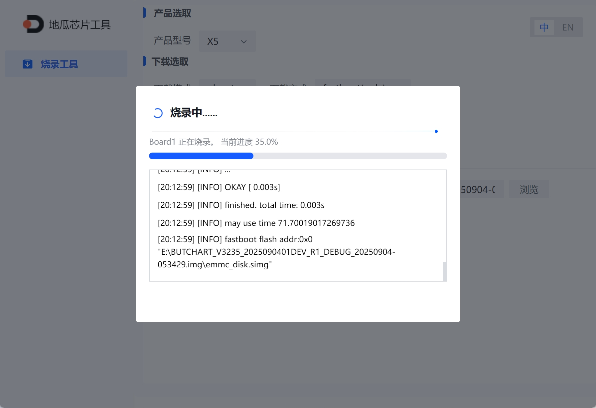
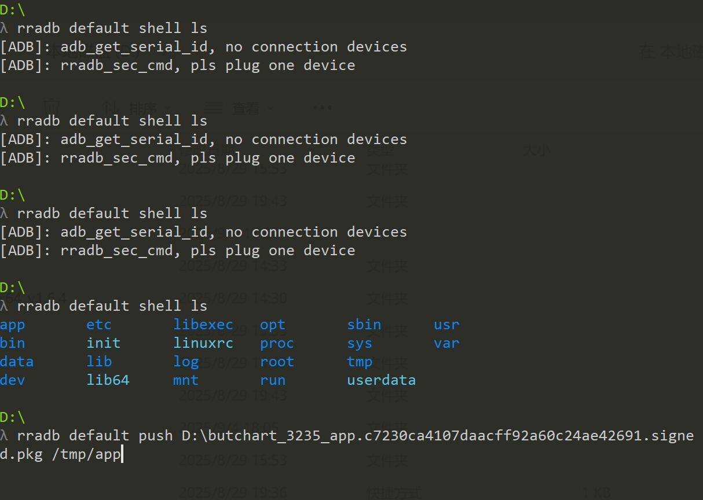
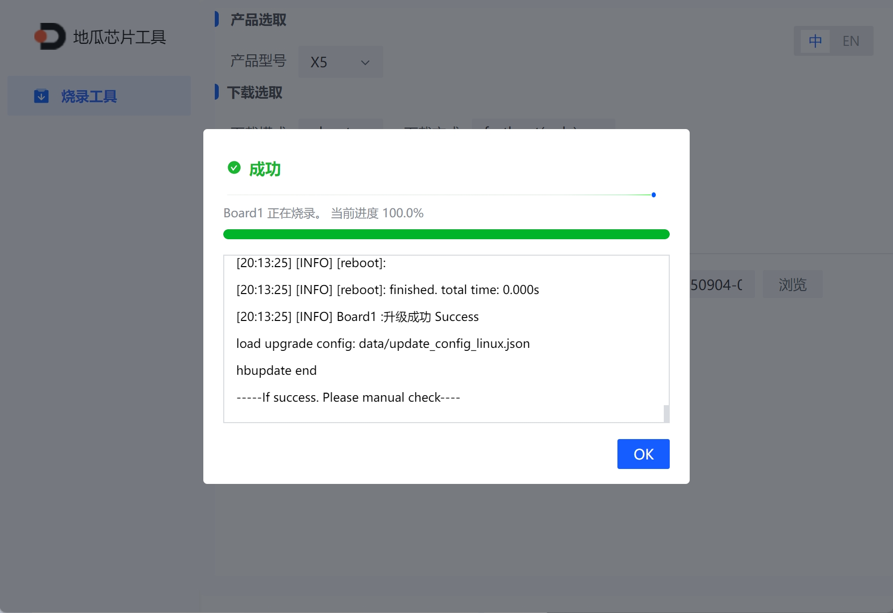
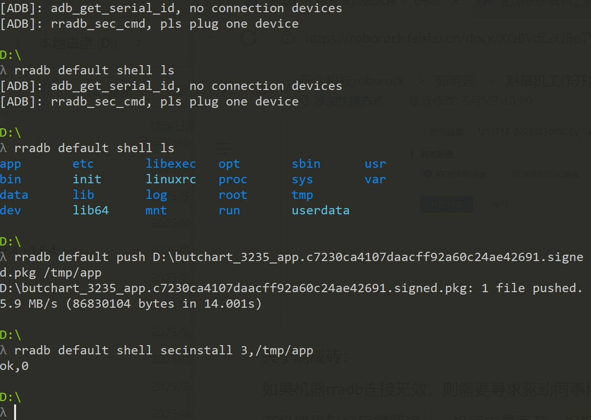
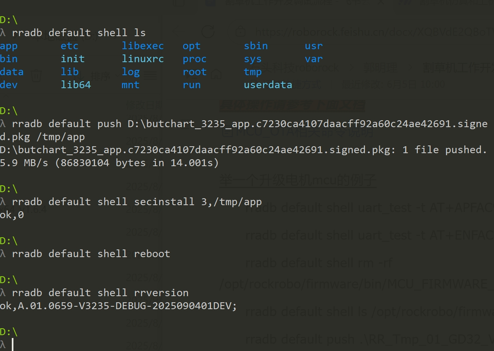
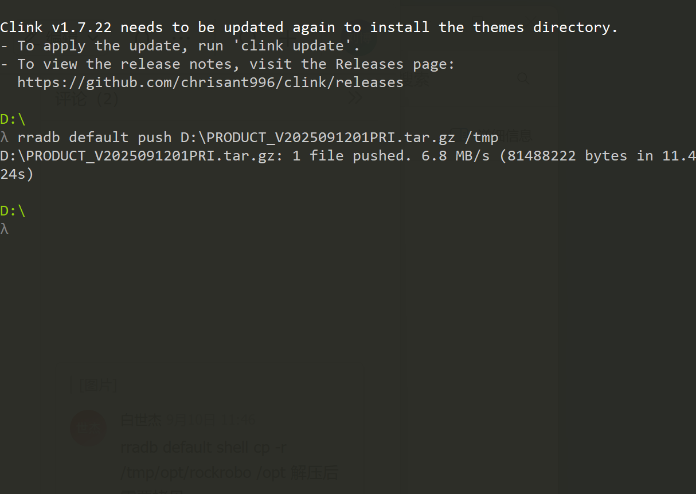
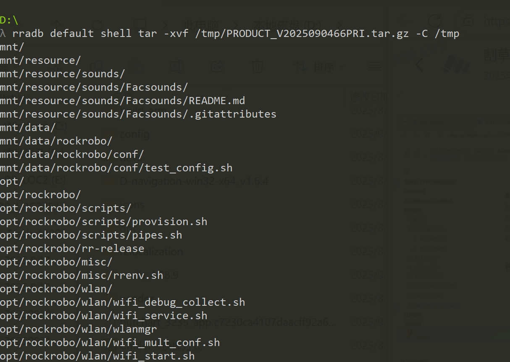
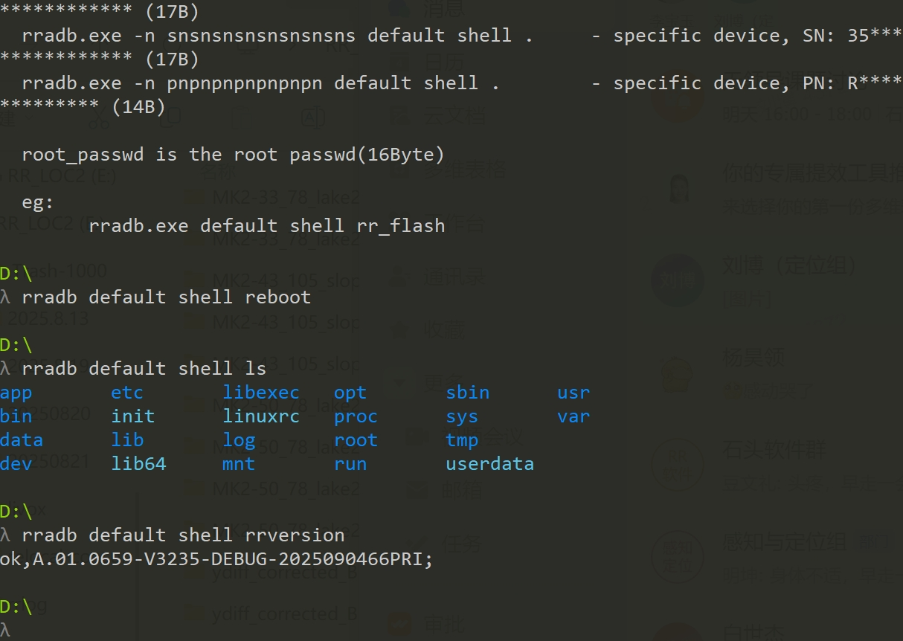

# 上层软件包编译与割草机上机流程

#### 1. 内网机准备

1. 在外网完成 Ubuntu 重装与基础配置。参考：[ 办公 - 重装Ubuntu后的装机List](https://roborock.feishu.cn/wiki/JcQfwDRFei3668kWMuMc8u8HnJd)

2. 通知 IT 锁机箱。

3. 连接内网后，第一步换源（参考：[ Ubuntu更换本地软件源APT文档](https://roborock.feishu.cn/docx/WuEUdTQQSoiN5Mx9lRGcMt8rnlb)）

#### 2. 权限申请

1. OA 发起「代码权限申请流程」。参考：[ 割草机SLAM代码、工具权限整理](https://roborock.feishu.cn/wiki/DKZbwZEECiUefykVn4Qcwgxknkc)

2. 如果部分代码仍无权限，联系 **李琳** 开通。

3. 同时申请 **share 文件夹访问权限**。

#### 3. 编译 slamworks

1. 在内网下编译 **slamworks**，参考 slamworks 编译流程 1-4。参考：[ slamworks编译流程](https://roborock.feishu.cn/wiki/QGYCwrSA4iZdslkKBsTcQAi6nxc)

2. Vslam 模块注意：

   1. 修改配置文件在 `gitlab3/vslam/resources/ro/configs_butchart/okvis.yaml`。

   2. 仿真修改 `vslam/resources/ro/debug_config.yaml`。

   3. 算法优先读数据集的 `sensor.yaml`，如不存在才读 Vslam 内部 yaml（避免报错）。

3. 编译完成：

```plain&#x20;text
source build/devel/setup.bash
roslaunch slam_module_ros_bridge slam_ros_bridge_okvis.launch
```

#### 4. Prebuild

* 走通仿真/上机流程中的 **上机 1-2 步**，进行 prebuild。参考：[ 割草机仿真和上机流程](https://roborock.feishu.cn/wiki/J3wyw6uiviGUeUkD4X6ceCXAnCd)

#### 5. 内网下 Jenkins 编译上层软件包

* **权限**：联系 **@李琳** 开通 Jenkins 权限。

* **网址**：`http://192.168.140.45:8080`

* **操作**：

  1. 选择 **Butchart\_Debug** 任务；

  2. 将 **PREBUILD** 改为自己的私分支；

  3. 地址改为 **北京**；

  4. 日志本地保存需要按照消息修改宏；

  &#x20;

  * 编译成功后会有邮件通知。

* **下载结果**：

  * 打开 share 文件夹（Ubuntu 下 `CTRL+L` 输入：`smb://192.168.111.103/`）

    * 账户：用户名

    * 域：`rockrobo`

    * 密码：OA 密码

  * 如果无法访问 → 权限未开通。

  * 软件包路径：
    `smb://192.168.111.103/mowerbuild/Butchart/Debug/BuildRelease/<你的分支>`

  * 镜像路径：
    `smb://192.168.111.103/mowerbuild/Butchart/DEVELOPER/Daily_build`

***

#### 6. 烧录镜像与上层软件包

* **流程**：

  1. 按顺序执行割草机工作开发调试流程步骤：连接机&#x5668;**→ 1 → 2 → 3 → 4 → 8 → 4**；参考：[ 割草机工作开发调试流程](https://roborock.feishu.cn/docx/XQBVdE2QBoTWBZxO17DclBpKnqf)

  2. 确认镜像与软件包成功烧录。





















