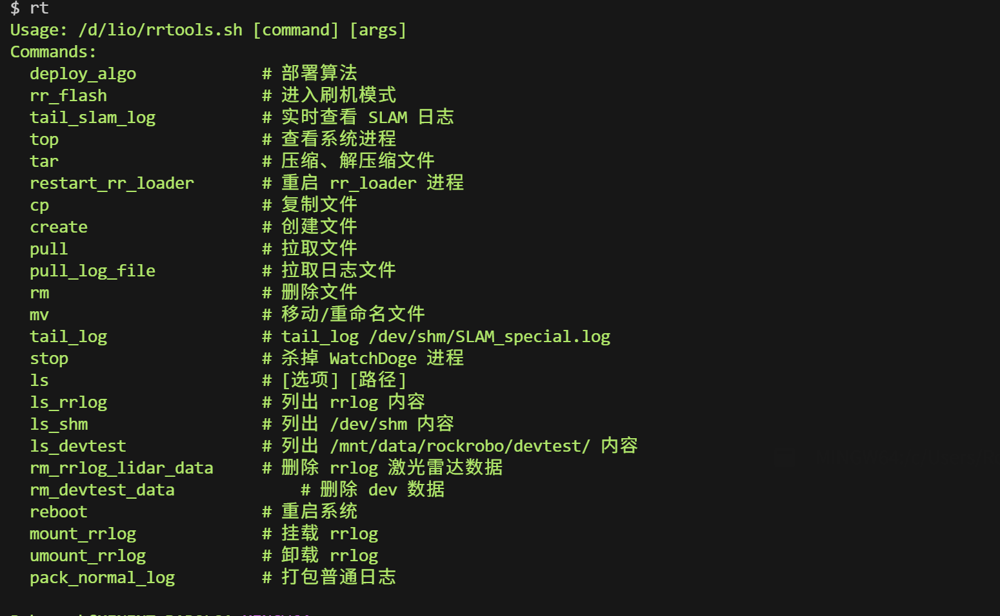
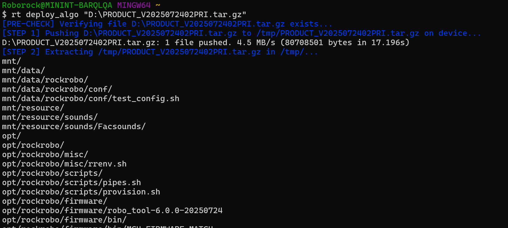
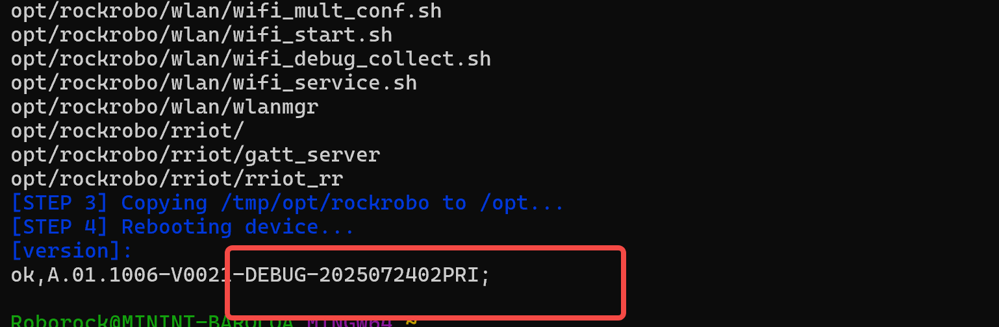
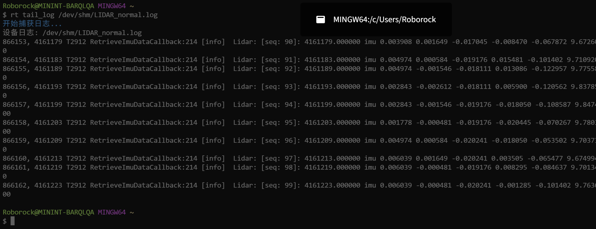
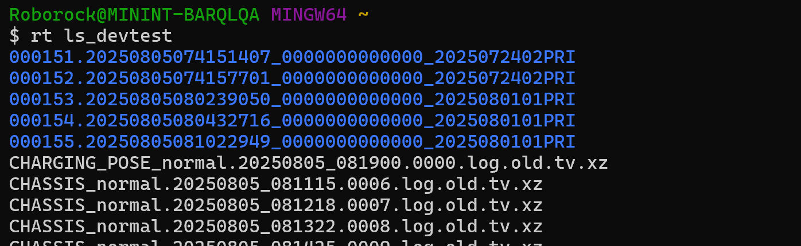
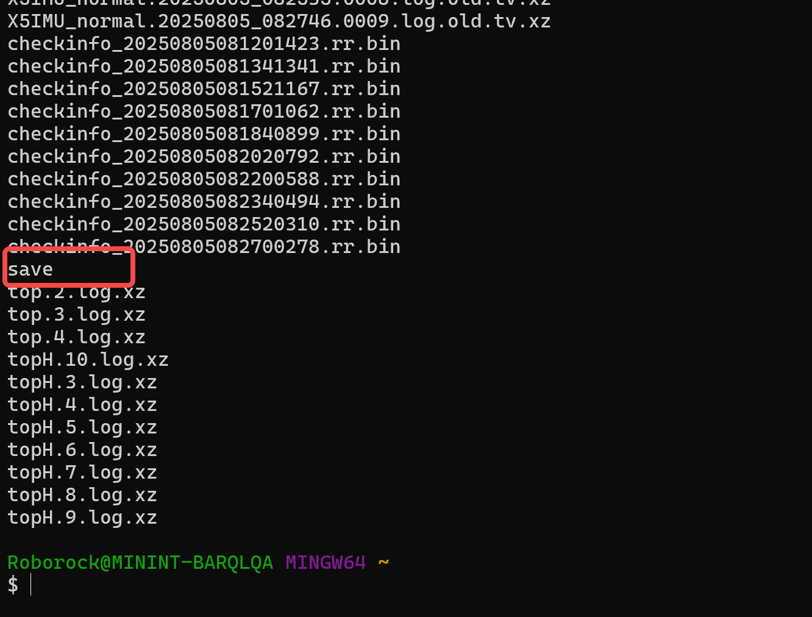
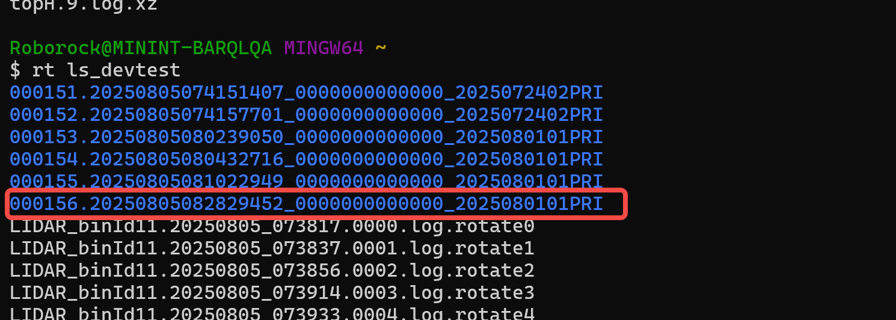
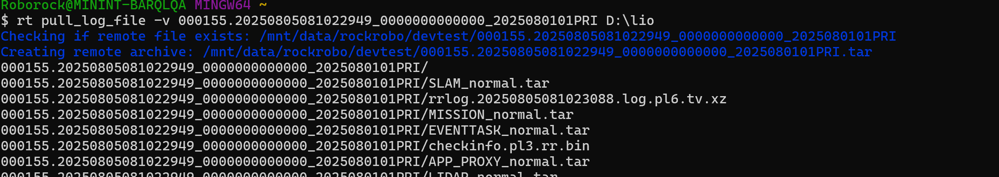

# 上机常用指令脚本

# 1. 脚本文件

# 2. Windows配置 （用于tab提示指令）

1. 在git bash中配置

```plain&#x20;text
vi ~/.bashrc 
```

在bashrc中加入：

```plain&#x20;text
alias rt="/d/lio/rrtools.sh"
complete -W "deploy_algo pull_log_file rr_flash tail_slam_log top tar restart_rr_loader cp create pull rm mv tail_log stop ls ls_rrlog ls_shm ls_devtest rm_rrlog_lidar_data rm_devtest_data reboot mount_rrlog umount_rrlog pack_normal_log" rt
```

```plain&#x20;text
source ~/.bashrc 
```

# 3. 指令介绍

## 3.1 所有指令：

Git bash终端运行rt 提示相关指令  （rt 为bashrc中配置）



## 3.2 算法部署：

注意：算法包地址需要 引号包裹&#x20;

&#x20; 部署成功后会显示部署版本（注意确认）

```plain&#x20;text
 rt deploy_algo "D:\PRODUCT_V2025072402PRI.tar.gz"
```





算法包部署后会执行reboot，注意机器reboot状态：


&#x20;                                                    reboot中

## 3.3 日志相关

### 3.3.1 日志查看：

```plain&#x20;text
rt tail_log /dev/shm/SLAM_normal.log   #待查看文件名
rt tail_slam_log  #直接查看slam日志
```



所有日志可以通过下面指令查看：

```plain&#x20;text
rt ls /dev/shm
```

### 3.3.2 日志拉取：

算法日志会保存/mnt/data/rockrobo/devtest/ 并且只有该路径有拉取权限



步骤1：通过下面指令，将所有算法日志打包到文件夹

```plain&#x20;text
rt pack_normal_log
```

生成save文件，进行数据打包，当新日志包出现后save会自动删除。



&#x20;      步骤2：通过下面指令查看/mnt/data/rockrobo/devtest/新打包的文件夹（可按照序号查看最新打包的文件夹）

&#x20;确认新的日志包是否生成：

```plain&#x20;text
rt ls_devtest
```

日志打包前：


&#x20;     日志打包后：



步骤3：拉取日志到本地

```plain&#x20;text
rt pull_log_file -v 000153.20250805080239050_0000000000000_2025080101PRI "D:\lio"
```



## 3.4 其他指令

### 3.4.1 进入刷机模式：

```plain&#x20;text
rr_flash
```

### 3.4.2 reboot：

```plain&#x20;text
rt reboot
```

### 3.4.3 拉取：（win/linux 文件地址需确认？）

```plain&#x20;text
#只有mnt/data/rockrobo/devtest下的文件可拉取，所以默认拉取此路径下的文件
rt pull 000138.20250804095521008_0000000000000_2025072402PRI.tar 
```

### 3.4.4 复制：

```plain&#x20;text
rt cp /mnt/data/rockrobo/devtest/000138.20250804095521008_0000000000000_2025072402PRI.tar /tmp/
```

### 3.4.5 删除：

```plain&#x20;text
rt rm /mnt/data/rockrobo/devtest/*.log.rotate* 
```


### 3.4.6 挂载/卸载：（确认u盘分区）

u盘挂载远程地址：/mnt/data/rockrobo/usb\_storage/rrlog/&#x20;

u盘分区：通常为`/dev/sda` （需确认）


挂载：

```plain&#x20;text
rt mount_rrlog

#确认挂载地址内容是否与U盘内容一致
rt ls_rrlog
```

卸载：

```plain&#x20;text
rt umount_rrlog
```


如果分区非`/dev/sda`，运行下面指令挂载：

```plain&#x20;text
rradb default shell mount /dev/sdb /mnt/data/rockrobo/usb_storage/rrlog/
```

