# 内存踩踏分析

| 285 | 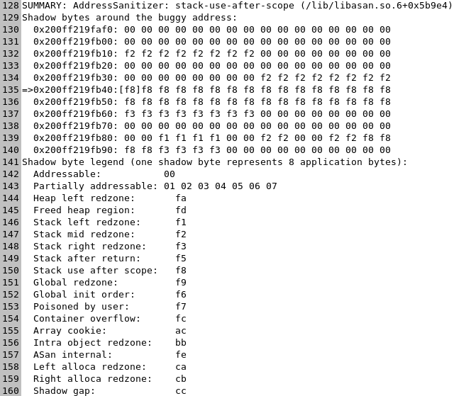stack-use-after-scope                       |                                                                                                                                |                                                                                                                                 |                                                                                                                                 |                                                                                                                                |                                                                                                                                          |
| --- | ------------------------------------------------------------------------------------------------------------------------------ | ------------------------------------------------------------------------------------------------------------------------------ | ------------------------------------------------------------------------------------------------------------------------------- | ------------------------------------------------------------------------------------------------------------------------------- | ------------------------------------------------------------------------------------------------------------------------------ | ---------------------------------------------------------------------------------------------------------------------------------------- |
| 287 | 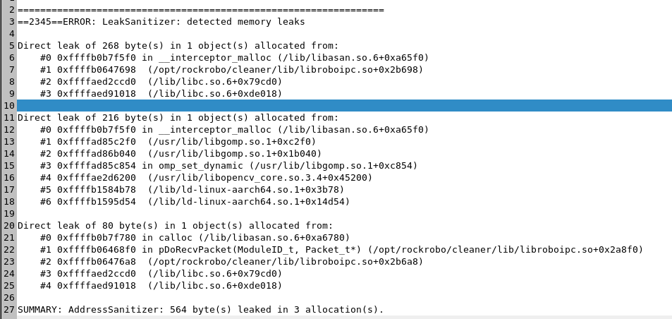detected memory leaks                       | 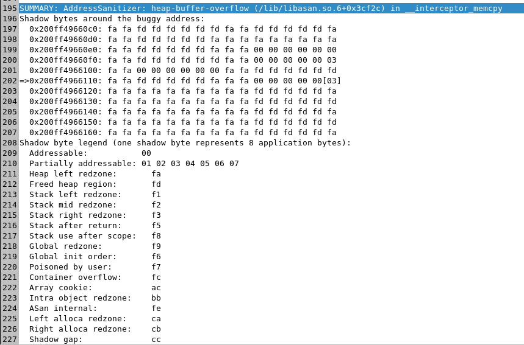 heap-buffer-overflow                       |                                                                                                                                 |                                                                                                                                 |                                                                                                                                |                                                                                                                                          |
| 291 | 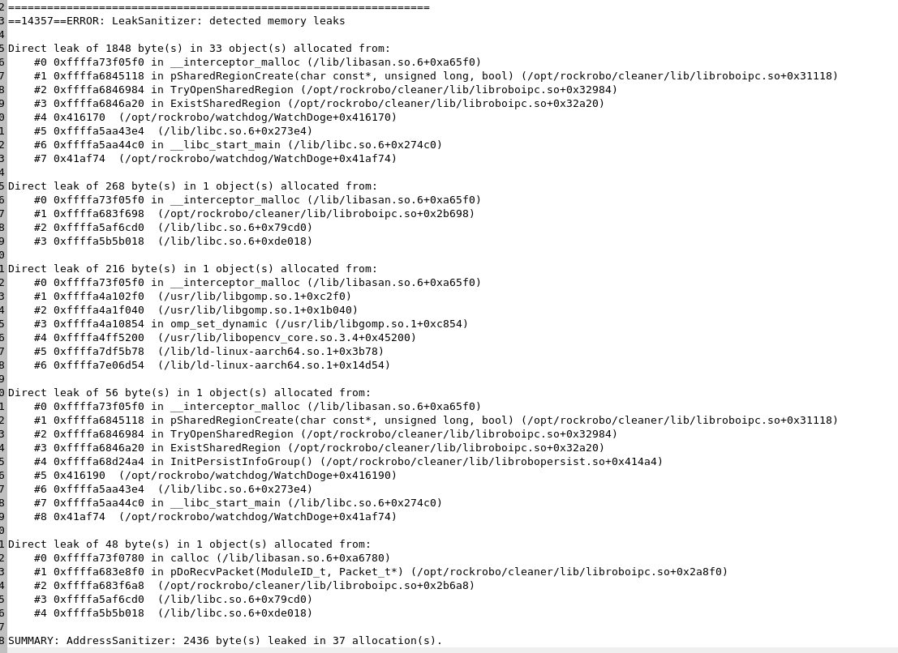detected memory leaksdrivers\_mem.log.14357 | 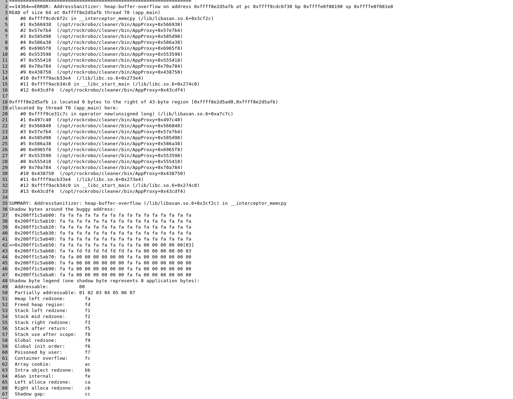heap-buffer-overflow drivers\_mem.log.14364 | 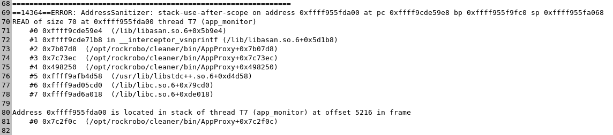 stack-use-after-scopedrivers\_mem.log.14364 | 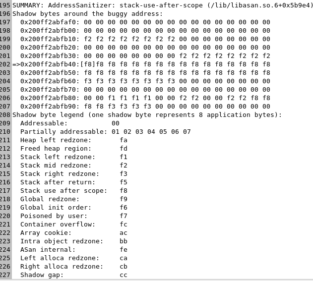 stack-use-after-scopedrivers\_mem.log.14364 | 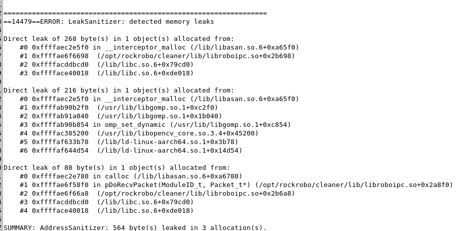detected memory leaksdrivers\_mem.log.14479 | 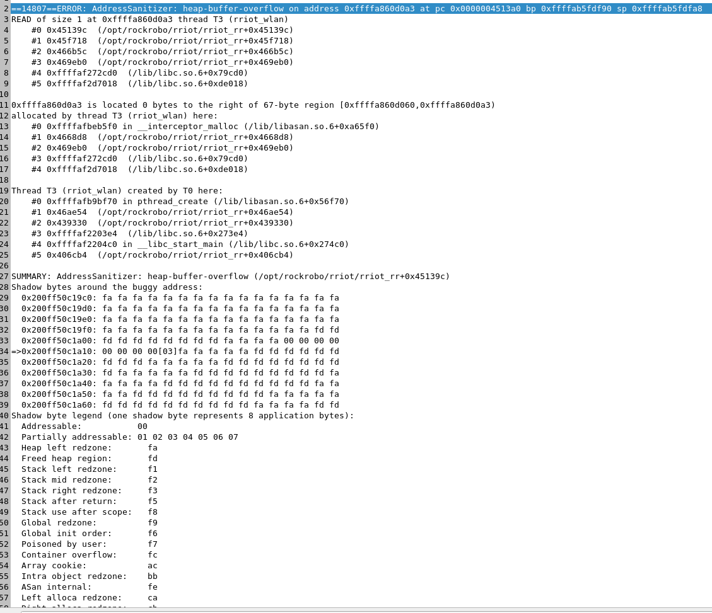heap-buffer-overflow on addressdrivers\_mem.log.14807 |
| 292 | 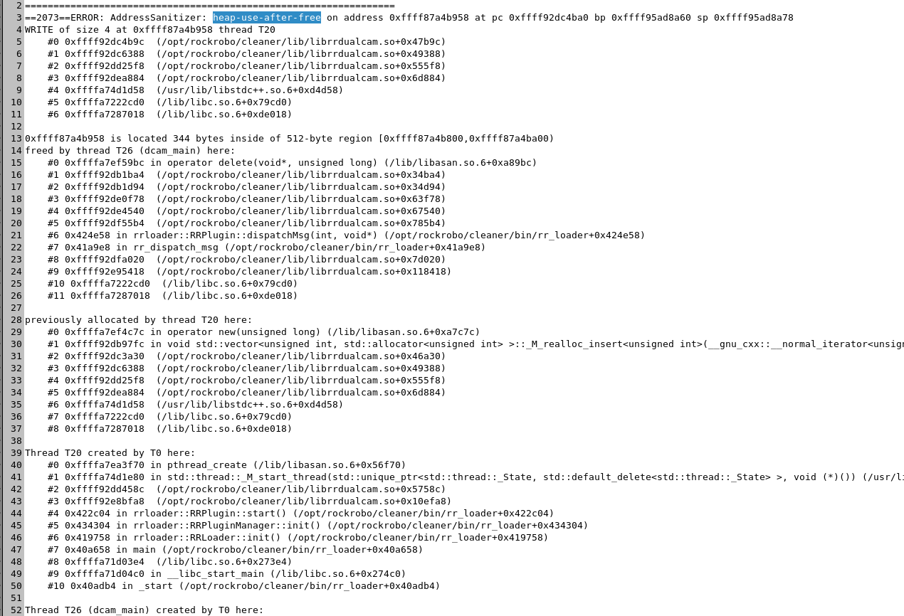heap-use-after-freedrivers\_mem.log.2073    | 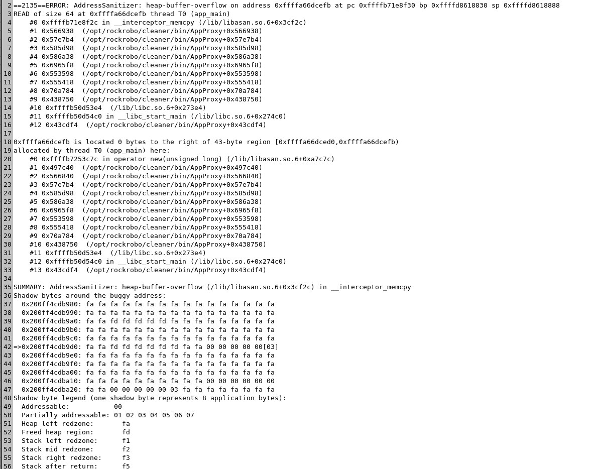 heap-buffer-overflow drivers\_mem.log.2135 | 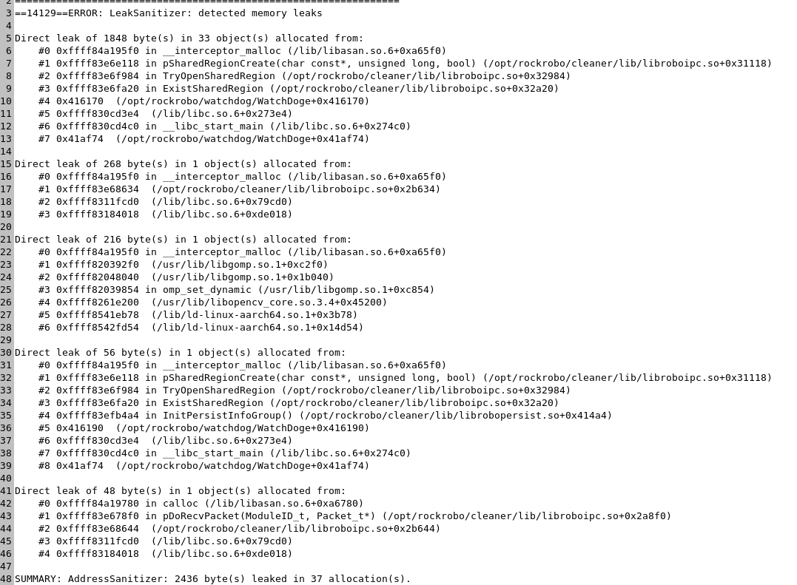detected memory leaksdrivers\_mem.log.14129  | 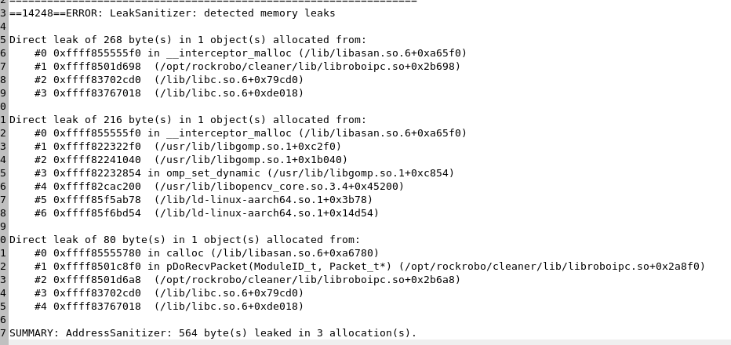 detected memory leaksdrivers\_mem.log.14128 |                                                                                                                                |                                                                                                                                          |

