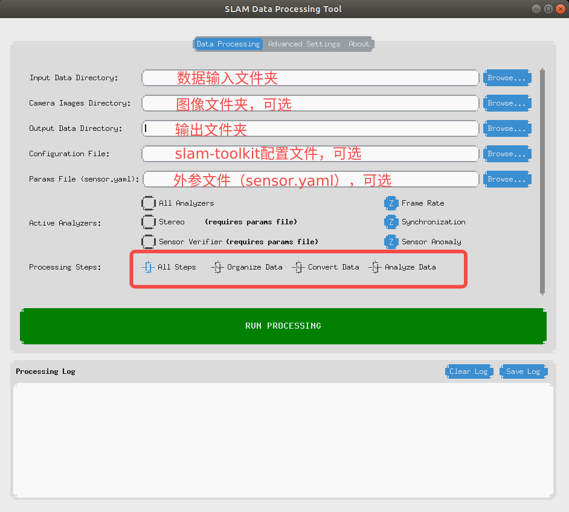
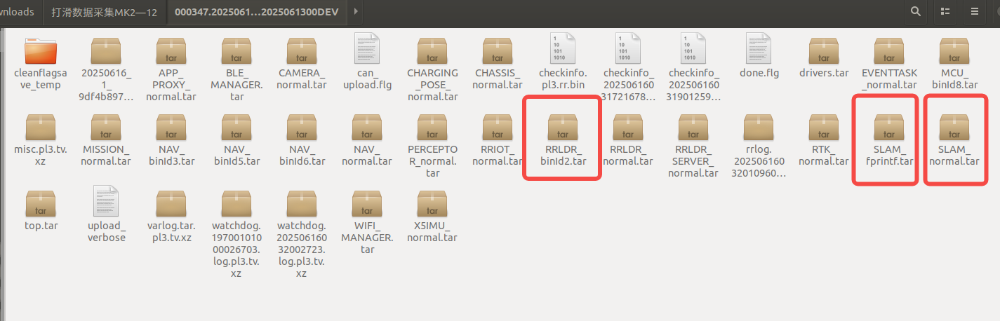
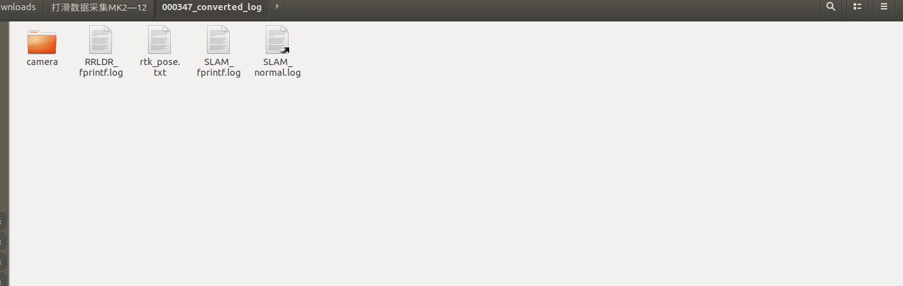
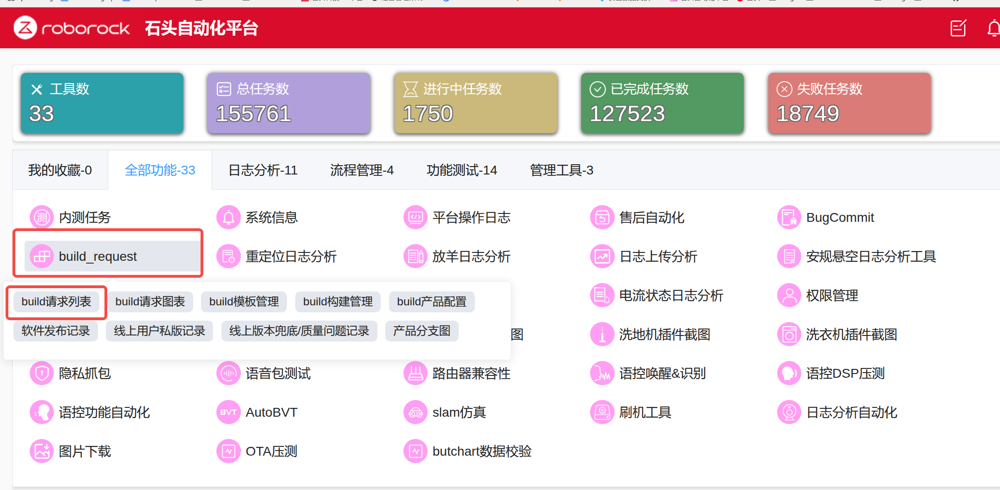

# 割草机仿真和上机流程

# 一、仿真

1. Jenkins出包

   详细见[ 编译vslam](https://roborock.feishu.cn/wiki/QGYCwrSA4iZdslkKBsTcQAi6nxc)：第5，6，7节

2. 日志转换

   1. 使用butchart\_convertor：


      ```bash
      git clone ssh://git@gitlab5.roborock.com:10022/RockRobo/slam/tools.git
      git checkout private/butchart/dataset_check
      echo "export PATH={tools路径}/butchart:$PATH" >> ~/.bashrc # 替换为具体路径
      source ~/.bashrc
      butchart_convertor.py -i {原始数据文件夹路径} -o {输出路径} -c {图像数据路径} # 注意：输出路径不要和原始数据文件夹路径重叠;如果没有图像可不加-c


      #versa项目
      butchart_convertor.py -ml #激光项目可用，全拷贝
      butchart_convertor.py -cp #只拷贝不解析
      ```

   2. 使用data\_toolkit：该工具除了日志转换，还有数据正确性检测功能

      ```bash
      # python环境：3.12
      git clone https://gitlab1.roborock.com/Butchart/data_toolkit.git
      git checkout develop
      cd slam_data_toolkit
      pip install -e . 
      slam-toolkit-gui
      ```

   

   转换前日志：

   

   其中RRLDR\_binId2包含了传感器日志文件，最终会解压成RRLDR\_fprintf.log

   SLAM\_fprintf包含了SLAM收到的重要的指令和位姿输出，最终解压成SLAM\_fprintf.log

   SLAM\_normal包含了SLAM常规日志打印，最终解压成SLAM\_normal.log

   image包含了图像，最终解压成camera

   转换后日志：

   

| 原始日志文件                                  | 处理后日志文件               | 日志内容                            | 中间层工具                         | 备注                                                                   |
| --------------------------------------- | --------------------- | ------------------------------- | ----------------------------- | -------------------------------------------------------------------- |
| RRLDR\_binId2.tarRRLDR\_binId2.log.pl9  | RRLDR\_fprintf.log    | 传感器日志（imu/odo/rtk）              | BinToTextlog\_merge.sh        | RRLDR\_binId2.log先解压为Sensor\_fprintf.log，再根据时间戳排序为RRLDR\_fprintf.log |
| SLAM\_fprintf.tarSLAM\_fprintf.log.pl9  | SLAM\_fprintf.log     | slam pose在机器上的计算结果，与其他模块交互的重要指令 | log\_merge.sh                 |                                                                      |
| SLAM\_normal.tarSLAM\_normal.log.pl9    | SLAM\_normal.log      | Slam debug日志                    | log\_merge.sh                 |                                                                      |
| sensor.yaml.pl9.tv.xzsensor.yaml.pl9.tv | sensor.yaml           | 外参文件                            | 无                             |                                                                      |
| image/\*.fs                             | camera/camera0/\*.png | 图像                              | png\_decoder，fs\_png\_decoder |                                                                      |
| NAV\_binId3.tarNAV\_binId3.log.pl9      | Status\_fprintf.log   | 导航接收到的slam pose (odo频率）         | BinToTextlog\_merge.sh        |                                                                      |

中间层工具地址：smb://192.168.111.103/mowerbuild/Butchart\_TOOL

# 二、上机

1. 交叉编译slam

   1. 工具链准备：Butchart：build/toolchain

   ```bash
   cd {build目录}/toolchain/aarch64-mr527-linux-gnu/
   ./.toolchain.init
   ```

   * 使用工具链：

   ```bash
   cp {build目录}/toolchain/aarch64-mr527-linux-gnu.cmake {slam_workspace目录}/
   ```

   修改`{slam_workspace目录}/aarch64-mr527-linux-gnu.cmake`中，`TOOLCHAIN_TOP_PATH`为实际toolchain地址

   * 编译slam\_archive：
     cd 到slam\_workspace/rrslam\_build\_tools/buildscripts

   `./slam_build.sh butchart false origin false true`


   * 替换库

   | 项目                         | slam.archive地址                                           |
   | -------------------------- | -------------------------------------------------------- |
   | Butchart/ButchartPro/Monet | `prebuild/aarch64-mr527-linux-gnu/slam`                  |
   | Versa                      | `prebuild/aarch64-mr527-linux-gnu/RR_PROJECT_VERSA/slam` |

2. 编译上层软件包：

   在jenkins上，Butchart\_Debug->Build with Parameters，选择自己的分支

   选择相关的宏：

   `RR_SW_FUNCTION_ENABLE_SLAM_USE_RTK `：slam是否使用RTK，默认开

3. 编译整机包：

   进入石头自动化平台：https://auto.roborock.com/#/login?redirect=%2Fdashboard

   build\_request -> build请求列表 -> 新建

   

4. 刷机和烧录上层软件包

   详细见[ 割草机工作开发调试流程](https://roborock.feishu.cn/docx/XQBVdE2QBoTWBZxO17DclBpKnqf)：“刷机相关”

5. 下载日志和debug

   详细见[ 割草机工作开发调试流程](https://roborock.feishu.cn/docx/XQBVdE2QBoTWBZxO17DclBpKnqf)：“实机日志打包及分析方法”

***

附录一：会议视频

https://roborock.feishu.cn/minutes/obcn4q5l6ppu2xoxatl779ro

附录二：软测机器烧写和APP使用指南

