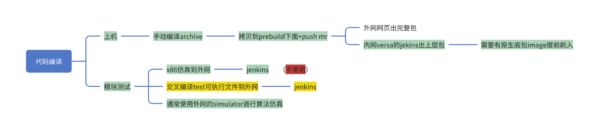
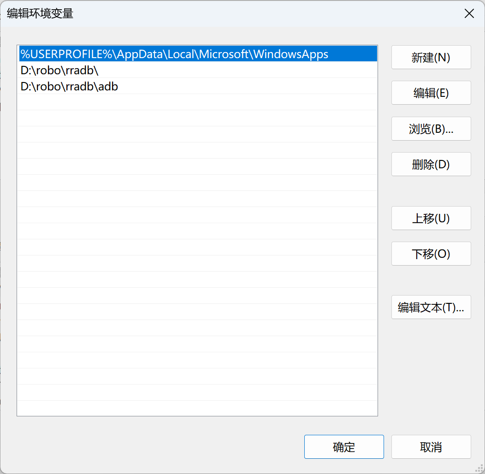
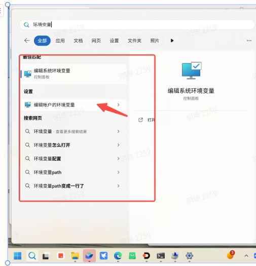
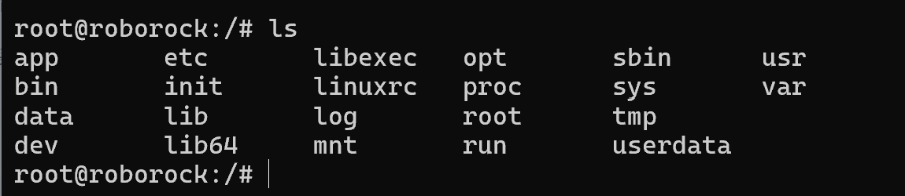
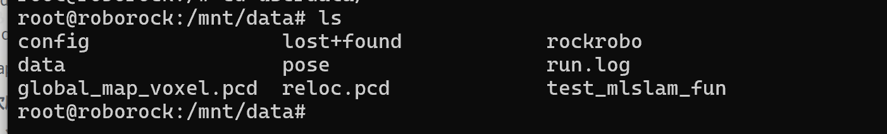
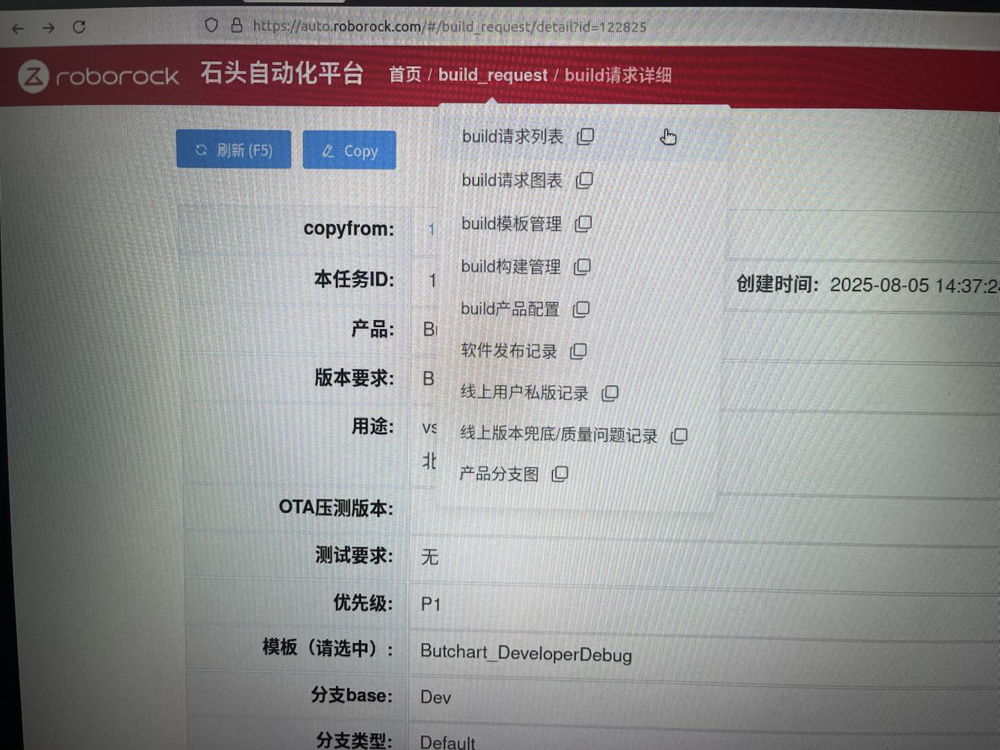
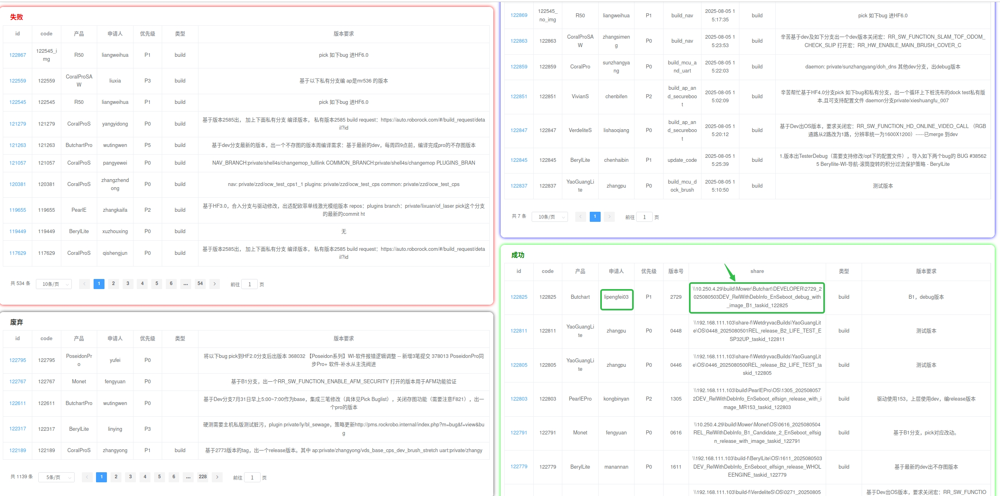
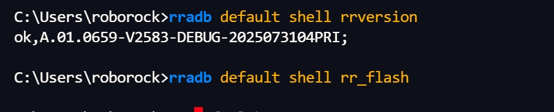
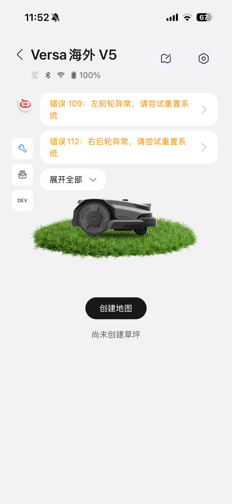

# 多线slam上机：环境配置、出包、刷机流程v2.0

#

# 1. 路径汇总：

上层包jekins地址：http://192.168.140.45:8080/job/Versa\_Debug

| Daily build             | 镜像：  | release版本：smb://192.168.111.103/mowerbuild/Versa/OS                                                                              | debug版本：smb://192.168.111.103/mowerbuild/Versa/DEVELOPER                                                                              | IMG/VERSA\_V1083\_2025122401DEV\_R1\_DEBUG\_20251224-024250.img |
| ----------------------- | ---- | -------------------------------------------------------------------------------------------------------------------------------- | ------------------------------------------------------------------------------------------------------------------------------------- | --------------------------------------------------------------- |
|                         | App  | release版本：smb://192.168.111.103/mowerbuild/Versa/OS/相关镜像版本/OTA\_PKG/versa\_XXX\_app.XX.pk&#x67;**（刷镜像必刷App，底层驱动都在这里更新，刷完再替换上层）** | debug版本：smb://192.168.111.103/mowerbuild/Versa/DEVELOPER/相关镜像版本/OTA\_PKG/versa\_XXX\_app.XX.pk&#x67;**（刷镜像必刷App，底层驱动都在这里更新，刷完再替换上层）** |                                                                 |
| 日常出包：jekins路径           |      | smb://192.168.111.103/mowerbuild/Versa/Debug/BuildRelease                                                                        |                                                                                                                                       |                                                                 |
| core\_dump需要的FULLTEST路径 |      | smb://192.168.111.103/mowerbuild/Versa/FULLTEST                                                                                  | [ Versa割草机 core dump问题的定位与查询](https://roborock.feishu.cn/wiki/EExSwWXwniLnQOkWuEMcgb3kn1d?from=from_copylink)           多线组文档         |                                                                 |
|                         |      |                                                                                                                                  |                                                                                                                                       |                                                                 |

# 2. 刷机指令

## 2.1 算法包部署

&#x20;  参考，实测，手动cmd输入更灵活和快，这个目前先废弃

| jekins路径上层刷机    | 获取jekins路径包（如 PRODUCT\_V2024121815PRI.tar.gz）刷app：传输临时目录，解压算法，复制到系统目录北京最新机器，执行一次：rradb root:fjsnyffydszvozkr shell ls rradb default push PRODUCT\_V2024121815PRI /tmp rradb default shell tar -xf /tmp/PRODUCT\_V2024121815PRI.tar.gz -C /tmp rradb default shell cp -r /tmp/opt/rockrobo /opt rradb default shell reboot清空日志: rradb default shell  "killall -SIGUSR2 WatchDoge" rradb default shell  "rm -rf /mnt/data/rockrobo/devtest/\*" rradb default shell  reboot日志目录： rradb default shell  ls  /mnt/data/rockrobo/devtest/ rradb default shell ls /dev/shm实时查看 SLAM 日志： rradb default shell tail -f /dev/shm/SLAM\_normal.log日志拉取 rradb default shell  "touch /mnt/data/rockrobo/devtest/save"  by郭科：可以生成日志 rradb default shell  pull "/mnt/data/rockrobo/devtest/." ./ |
| --------------- | ------------------------------------------------------------------------------------------------------------------------------------------------------------------------------------------------------------------------------------------------------------------------------------------------------------------------------------------------------------------------------------------------------------------------------------------------------------------------------------------------------------------------------------------------------------------------------------------------------------------------------------------------------------------------------------------------------------------------------------------------------------------------------- |
| daily测试的app无需解压 | rradb default push 目录\app包 /tmprradb default shell secinstall 3,/tmp rradb default shell reboot                                                                                                                                                                                                                                                                                                                                                                                                                                                                                                                                                                                                                                                                                 |

\`\`

# 3. 刷机步骤教程：

## 3.1 步骤参考：[ AP刷机流程](https://roborock.feishu.cn/docx/L1fTdNkX5oQZTExNJYhcaOZPnde?from=from_copylink)

## 3.2 注意

1. 地瓜的**非首次刷镜像**和**首次**不同配置；**非首次刷镜像需要进入一次rr\_flash状态；**

2. 刷镜像必须刷一次app，否则muc不能自动升级，参考9节

3. rradb 版本要用新的；地瓜软件可能有新的，没找到

# 4. 刷机exe工具下载和安装

|   |   |                                                                                     |                                                                                     |
| - | - | ----------------------------------------------------------------------------------- | ----------------------------------------------------------------------------------- |
|   |   |                                                                                     | 不定期更新                                                                               |
|   |   |  |  |
|   |   |                                                                                     |                                                                                     |

&#x20;     &#x20;

## 4.1 我们的机器的sign列表:

| 5#，mk1机器，北京 |   |   |
| ----------- | - | - |
|             |   |   |

LSLAM组苏州设备管理：

[ 机器信息管理](https://roborock.feishu.cn/wiki/J8ykwER0yinAh3k1ekrcCddDnud?from=from_copylink)

# 5. Test 的 jekins出包

## 5.1 test出包步骤

1. 在内网jenkins网站下选择Mover\_VSlam\_Debug->Build with Parameters

   1. 割草机：Mower\_VSlam\_Debug（备注扫地机：VSlam\_Debug）

2. 在SLAM\_BRANCH选择分支（repo: slam\_workspace）必须全部提交到slam\_workspace

3. 在CMAKE\_BUILD\_TYPE下面的地方勾选编译宏ENABLE\_RRSLAM, ENABLE\_VSLAM, ENABLE\_FUSION

4. 编译成功后，仿真软件包地址：smb://192.168.111.103/build/VSlam/Debug/BuildRelease

   1. 用户名：    域名：rockrobo   密码&#x20;

## 5.2 裸板仿真：空板跑test+log，详细指令可以参考上级刷机篇章；

1. adb shell 进入系统目录；

2. 另开终端，外部用**adb push <本地文件路径> userdata** 将以下文件拷贝到板子中的userdata下：

   1. PS C:\Users\rockrobo> adb push .\\.vscode\argv.json userdata

   2. 算法配置文件（jenkins编译的包里没有，需要从外网拖一个进去）

   3. LOG数据；

   4. 备注：192.168.140.5：8080  中   Mower\_Vslam\_Debug，&#x20;

      1. jenkins  交叉编译，可执行文件\*test；

      2. 文件导出路径在vslam/debug\*\*\*\*\*

3. 板子中的目录如下：

* 为了方便，大家可以在userdata中这么放置各个文件（userdata目录内容如下）：

  

  1. **data**为log存放文件夹；

  2. **config**存放算法yaml文件夹；

  3. 其他如需另外文件夹可以自己用mkdir创建。

* 执行可执行文件

  1. 赋予可执行文件权限：**chmod 777 <可执行文件名>**

  2. 执行可执行文件并导出log：**./<可执行文件名> > run.log**

* 将log导出板子：

  1. **adb pull <板子中的log路径> 本地电脑路径**

# 6. 出包完整包（可选，这个绝招）

&#x20;   网页https://auto.roborock.com/#/build\_request/detail?id=122825

（1）点击该链接，填写完必要选项之后，点击页面底端的“提交”，就可以构建项目。
（2）如果想查看项目编译进度，请点击页面上面的“build request”--->"build请求列表"：

（3）点击进去后，可以在右下方“成功”模块查找编译结果所在的路径：

|  |  |
| ------------------------------------------------------------------------------------ | ------------------------------------------------------------------------------------ |

（4）提示：develop分支编译的结果一定会成功，但是其他分支由于各种因素的存在编译不一定成功

# 7. 特殊问题：

## 7.1 闫冬上级脚本指令：[ 上机常用指令脚本](https://roborock.feishu.cn/wiki/AuT0wslKiio3x6k2xLbcaoHbnye?from=from_copylink)

## 7.2 U 盘临时使用

U 盘保存日志（推荐）

&#x20;1）挂载 U 盘：

&#x20;rradb default shell mount /dev/sda /mnt/data/rockrobo/usb\_storage/rrlog/

&#x20;2）卸载 U 盘：

&#x20;rradb default shell umount /mnt/data/rockrobo/usb\_storage/rrlog/

&#x20;3）拷贝日志到 U 盘（避免中断）：

&#x20;rradb default shell cp /mnt/data/rockrobo/devtest/日志文件 /mnt/data/rockrobo/usb\_storage/rrlog/

说明：/dev/shm 为内存目录，日志可能因重启丢失，长时间测试建议及时拷贝到 U 盘。

## 7.3 查看镜像版本：

## 7.4 日志上传和下载，割草机通用

[ log上传与下载](https://roborock.feishu.cn/wiki/RIpewwYGaiBsrNkcMwLccF4mnTe?from=from_copylink)

## 7.5 muc升级问题：

**mcu的bin包是跟app打包在一起的**

**app先刷下daily build，再更新成你们自己的私版**

### 7.5.1 查看版本：需要看下mcu的版本

rradb default shell uart\_test -t AT+APFAC%

rradb default shell uart\_test -t AT+ENFAC%

rradb default shell uart\_test -t AT+MCU\_OTA=FWVER?,0%

rradb default shell uart\_test -t AT+MCU\_OTA=FWVER?,1%

rradb default shell uart\_test -t AT+MCU\_OTA=FWVER?,10%

rradb default shell uart\_test -t AT+MCU\_OTA=FWVER?,11%

***

~~PS C:\Users\roborock\Desktop\10-22> rradb default shell uart\_test -t AT+MCU\_OTA=FWVER?,0%~~

~~ok,RR\_VERSA.A3.G1\_M6.0.0\_RELEASE\_20250926-151054;~~

~~PS C:\Users\roborock\Desktop\10-22> rradb default shell uart\_test -t AT+MCU\_OTA=FWVER?,1%~~

~~ok,boot=0.2,mcu\_app\_ver=258,hw\_id=1.1,bomid="01.0001";~~

~~PS C:\Users\roborock\Desktop\10-22> rradb default shell uart\_test -t AT+MCU\_OTA=FWVER?,10%~~

~~ok,boot=0.1,mcu\_app\_ver=258,hw\_id=1.1,bomid="01.0001";~~

~~PS C:\Users\roborock\Desktop\10-22> rradb default shell uart\_test -t AT+MCU\_OTA=FWVER?,11%~~

~~ok,boot=0.1,mcu\_app\_ver=258,hw\_id=1.1,bomid="01.0001";~~

~~PS C:\Users\roborock\Desktop\10-22>~~

## 7.6 如何禁用/恢复自动更新MCU？

禁用自动更新：rradb default shell touch /mnt/reserve/ota\_config.ini

恢复自动更新：rradb default shell rm /mnt/reserve/ota\_config.ini

原理是在默认路径创建一个空策略文件，从而禁用OTA。

可在任意时候执行(刷机前后、安装上层包前后都行)，不会被普通刷机和安装包影响。

指令和说明：[ MCU\_OTA相关命令说明](https://roborock.feishu.cn/docx/Iqegdn759obt89xrtcYc3JMHncd?from=from_copylink)

经常报告

## 7.7 日志解析：

中间层日志情况：

[ slam采集需求](https://roborock.feishu.cn/wiki/A1YewlrXVikKI1kbzGSc6guXnfe#share-N3ozd1rjdoY27SxoZyecdwkHnr0)

### 7.7.1 公共工具

[ 割草机工作开发调试流程](https://roborock.feishu.cn/docx/XQBVdE2QBoTWBZxO17DclBpKnqf#share-S2CQdFBqRoiUlsxe9gOcAseznyh)

### 7.7.2 slam工具

[ 割草机工作开发调试流程](https://roborock.feishu.cn/docx/XQBVdE2QBoTWBZxO17DclBpKnqf#share-S2CQdFBqRoiUlsxe9gOcAseznyh)

# 8. 参考：

\-------------------------------------------------------------------------------------------------------------

[ AP刷机流程](https://roborock.feishu.cn/docx/L1fTdNkX5oQZTExNJYhcaOZPnde?from=from_copylink)

[ 割草机仿真和上机流程](https://roborock.feishu.cn/wiki/J3wyw6uiviGUeUkD4X6ceCXAnCd?from=from_copylink)

[ 割草机工作开发调试流程](https://roborock.feishu.cn/docx/XQBVdE2QBoTWBZxO17DclBpKnqf?from=from_copylink)
[ 割草机手动启动rr\_loader](https://roborock.feishu.cn/wiki/Hs2FwX2Wbi6XAxkeMmjcLKo8nhg)

中间层版本：[ 机器烧录流程（面向开发）](https://roborock.feishu.cn/wiki/AQTKwj0sYiRQk5kFQahcFVqlnnf?from=from_copylink)   [ slam采集需求](https://roborock.feishu.cn/wiki/A1YewlrXVikKI1kbzGSc6guXnfe?from=from_copylink)

\---------------------------------------------------------------------------------------------------------------------

