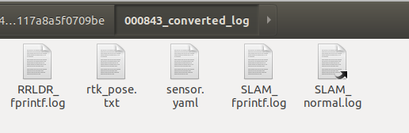
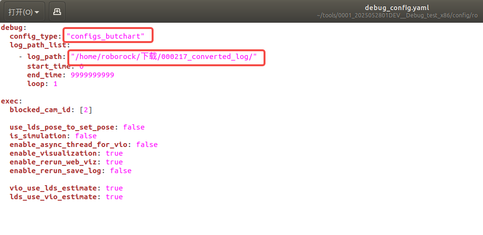

# 割草机日志仿真

# 拉取仿真程序包

jenkins编译：

1. 在内网jenkins网站（192.168.140.5:8080）下选择Mower\_VSlam\_Debug->Build with Parameters

2. 在SLAM\_BRANCH选择分支（repo: slam\_workspace）

   * 注意：本地submodule的修改需要经过git add {submodule}，git commit 和git push origin来更新（也就是说需要建立联系）

3. 在CMAKE\_BUILD\_TYPE下面的地方根据需要勾选编译宏ENABLE\_RRSLAM, ENABLE\_VSLAM, ENABLE\_FUSION

4. 编译成功后，仿真软件包地址：smb://192.168.111.103/mowerbuild/VSlam/Debug

需要有（smb://192.168.111.103/mowerbuild/VSlam/Debug）读权限，如果没有请在OA上提交share目录文件夹权限申请。

比如我自己编译了一个包

解压后进入到文件夹中，在命令行输入以下命令：

```bash
#让相应的文件拥有可执行权限
chmod +x _setup_util.py lib/slam_module_ros_bridge/slam_module_ros_bridge share/slam_module_ros_bridge/scripts/* bin/*
```

# 拉取日志解压工具

tools仓库的private/butchart/dataset\_check分支 （https://gitlab5.roborock.com/RockRobo/slam/tools/-/tree/private/butchart/dataset\_check）

如果已经clone 了 tools仓库则切换到private/butchart/dataset\_check分支，之后把butchart文件夹加入PATH路径：

```bash
 ## 把下面的语句加入~/.bashrc 或者 ~/.zshrc 长期生效
 export PATH=/home/roborock/log-tools/tools/butchart:$PATH
```

# 解压日志进行仿真

把日志文件夹下载到本地，在日志文件夹路径下执行：

```bash
butchart_convertor.py
```

之后会在原日志文件夹的同一级目录生成 **<包号>\_converted\_log** 文件夹，里面包含：
RRLDR\_fprintf.log  rtk\_pose.txt  SLAM\_fprintf.log  SLAM\_normal.log sensor.yaml等文件。



接下来进入仿真程序目录(**请确保程序目录中不包含中文字符，否则会报错**)，编辑config/ro/debug\_config.yaml文件：
config\_type为"configs\_butchart"，log\_path为刚才转换出来的日志路径，如下图：



之后执行：

```bash
# 1. source 文件
# 如果使用bash
source setup.bash
# 如果使用zsh
source setup.zsh
# 2. 启动仿真程序
roslaunch slam_module_ros_bridge slam_ros_bridge_okvis.launch
```

之后就可以在rviz中可视化分析了。

