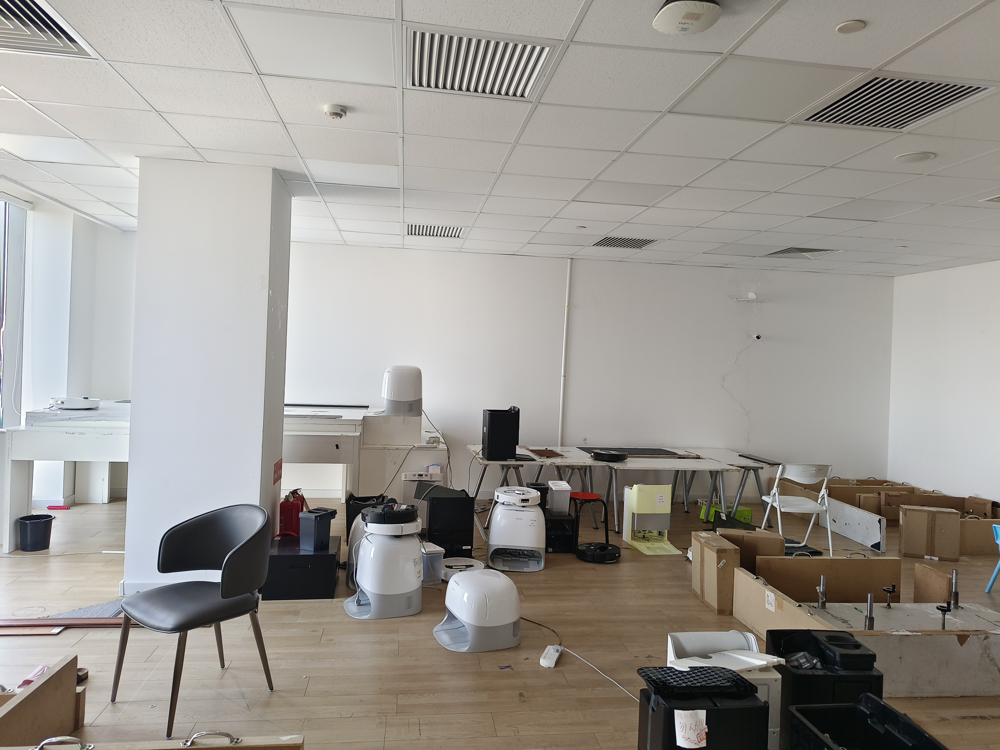
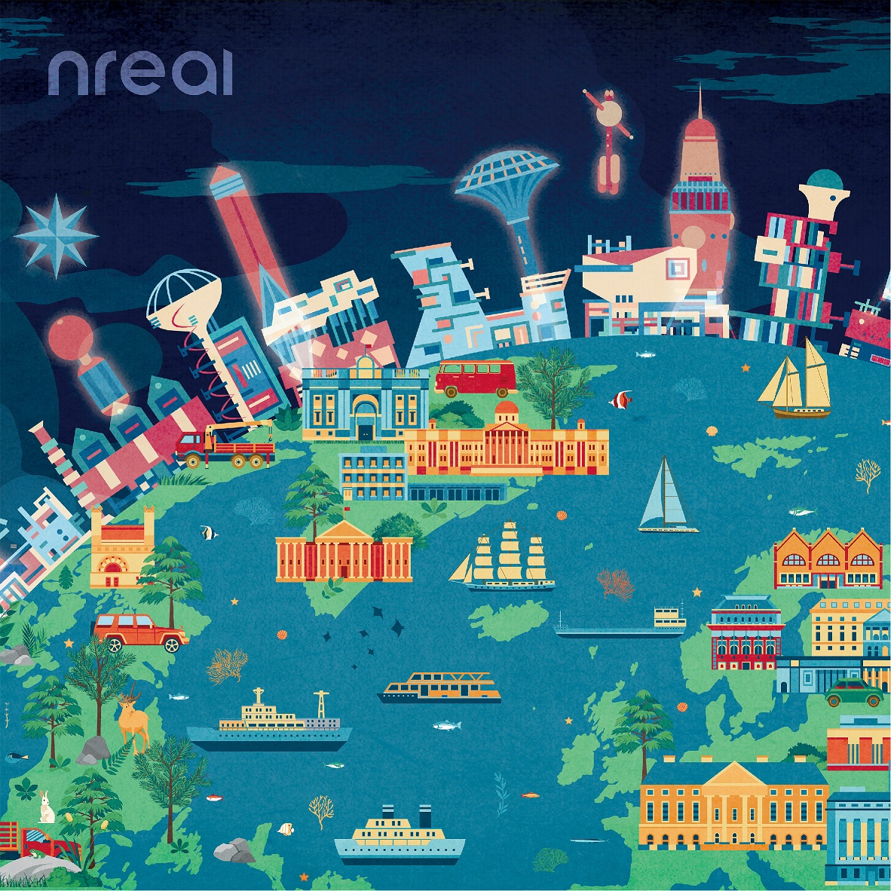
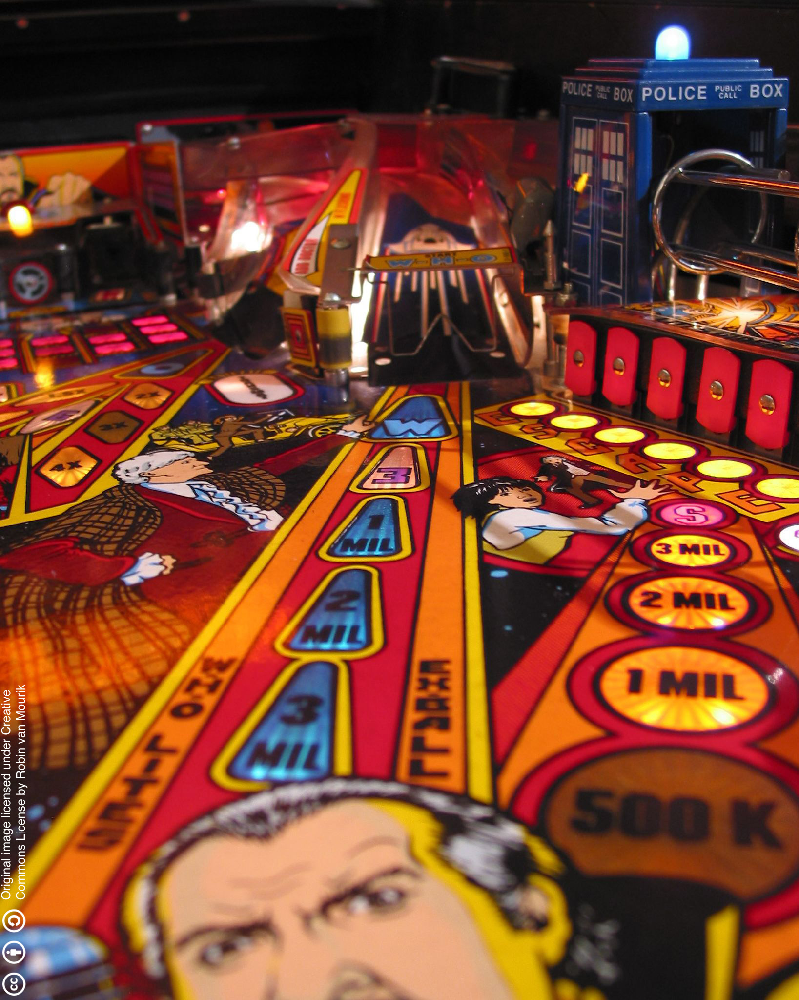
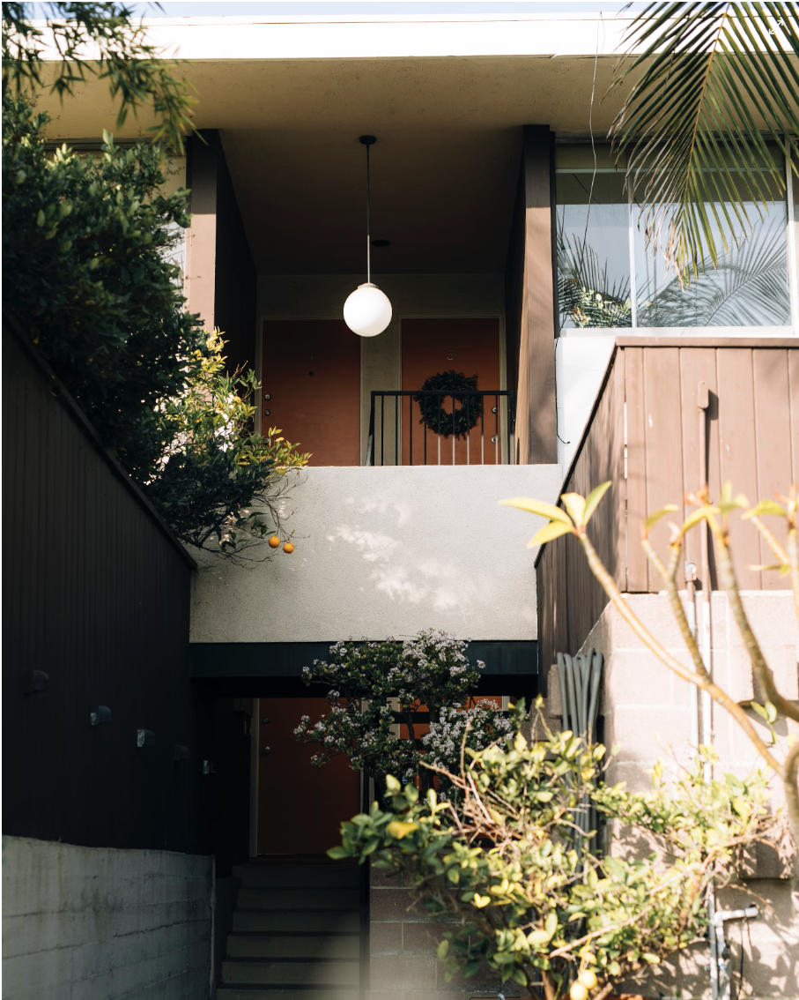
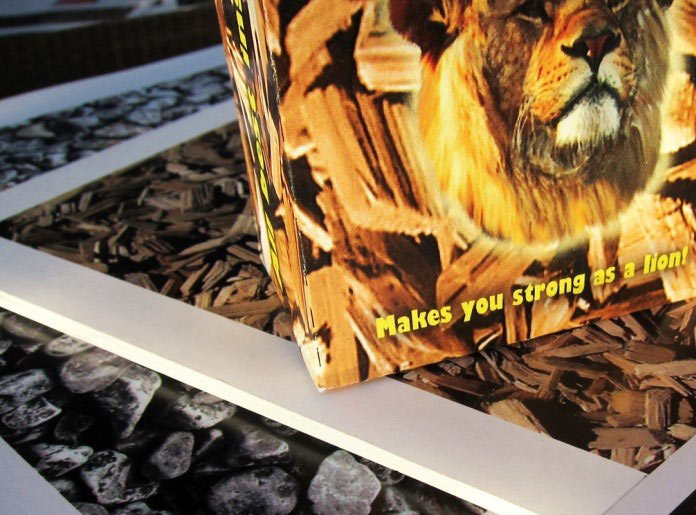
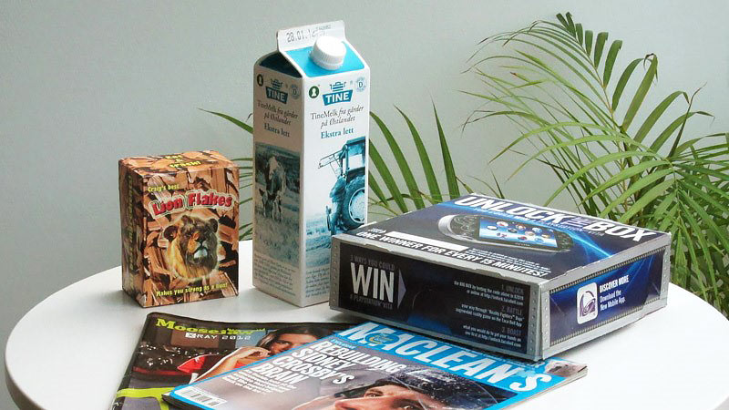
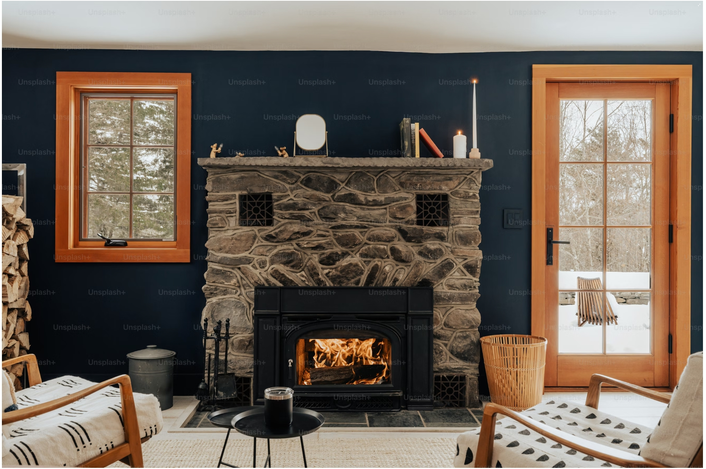

# 视觉实验室需求

# 一、需求

1. 标定结果验证

   1. 需要aprilgrid

   2. 场地大于3x3

   3. 地面布置方格区域

   4. 转台

2. Tunning结果验证

   1. 亚克力板

   2. 亮度可调节的灯

3. vslam数据采集

   1. 墙面布置

   2. 轨迹真值

# 二、安装布置

## 2.1 户型图

## 2.2 墙面布置

### 2.2.1 底图

1m x 1m 20

1.5m x 1m 10

1m x 1.5m 10

### 2.2.2 A4图案

### 2.2.3 材质与粘贴方式

* 相纸、覆哑膜，或者其他镜面反射度低的打印材质。

* 彩绘图从踢脚线以上往上贴，每层之间间隔10厘米左右，每列之间间隔也是10厘米左右。

  * 高1.5m的图像贴2层，高1m的图像贴3层

* 彩绘图像每隔两列贴一列几何图形，高度需要调整一下从踢脚线以上往上贴，几何图形之间连起来，不要有间隔。几何图形与彩绘图像间隔10厘米左右。

## 2.3 装置

1. 白板&粉笔

2. 办公桌x1

3. 转台x1

4. Aprilgrid

   1. 氧化铝材质 0.5m x2, 0.3m x2, 0.8m x1

5. 亚克力板 10mm厚度 60x60cm，白色x2 黑色x2 透明x2

6. 拷贝台A1x2 （或者相同大小的LED背光）

7. 打印10x10棋盘格，格子大小10cm

   1. 在房间短边中心，靠墙贴到地上

8. 窗帘x2组

### 2.3.1 装置清单

| 名称              | 链接                                                                                                                                                                                                                                                                                                                                                                                                                                                                                                                                                                                                                                                                                                                                                                                                                | 数量 | 描述                                                                                          | 单价（¥）     |
| --------------- | ----------------------------------------------------------------------------------------------------------------------------------------------------------------------------------------------------------------------------------------------------------------------------------------------------------------------------------------------------------------------------------------------------------------------------------------------------------------------------------------------------------------------------------------------------------------------------------------------------------------------------------------------------------------------------------------------------------------------------------------------------------------------------------------------------------------- | -- | ------------------------------------------------------------------------------------------- | --------- |
| AprilGrid 0.3m  | [淘宝链接](https://item.taobao.com/item.htm?id=575970557405\&price=170-3000\&sourceType=item\&sourceType=item\&suid=99041d71-30de-46f0-ade9-72d2318ed607\&ut_sk=1.ZViNJ2UdI1ADAN8UUwVDHI3i_21646297_1739189475237.Copy.ShareGlobalNavigation_1\&un=d08afb331c41fe66e8f55b3b63c56d8b\&share_crt_v=1\&un_site=0\&spm=a2159r.13376460.0.0\&tbSocialPopKey=shareItem\&sp_tk=QnZ0RWU2Vjhnd0I%3D\&cpp=1\&shareurl=true\&short_name=h.TpkbzR0qnQ4B3bv\&bxsign=scd5uFDRmVHttIC7njhAz0h0nru9BPcs3agoy2s7rp42QR88UMaatEUK_lK99u2uwQST4uN-LH8nzL6XlrrRTi9TOYqZNR7YWn-jtwxIWjCJ_Vp2nM44XX2RrO13qnne9Fo\&tk=BvtEe6V8gwB\&app=chrome)                                                                                                                                                                                               | 2  | 铝基板                                                                                         | 520       |
| AprilGrid 0.5m  | [淘宝链接](https://item.taobao.com/item.htm?id=575970557405\&price=170-3000\&sourceType=item\&sourceType=item\&suid=99041d71-30de-46f0-ade9-72d2318ed607\&ut_sk=1.ZViNJ2UdI1ADAN8UUwVDHI3i_21646297_1739189475237.Copy.ShareGlobalNavigation_1\&un=d08afb331c41fe66e8f55b3b63c56d8b\&share_crt_v=1\&un_site=0\&spm=a2159r.13376460.0.0\&tbSocialPopKey=shareItem\&sp_tk=QnZ0RWU2Vjhnd0I%3D\&cpp=1\&shareurl=true\&short_name=h.TpkbzR0qnQ4B3bv\&bxsign=scd5uFDRmVHttIC7njhAz0h0nru9BPcs3agoy2s7rp42QR88UMaatEUK_lK99u2uwQST4uN-LH8nzL6XlrrRTi9TOYqZNR7YWn-jtwxIWjCJ_Vp2nM44XX2RrO13qnne9Fo\&tk=BvtEe6V8gwB\&app=chrome)                                                                                                                                                                                               | 2  | 蜂窝铝基板                                                                                       | 900       |
| AprilGrid 0.8m  | [淘宝链接](https://item.taobao.com/item.htm?id=575970557405\&price=170-3000\&sourceType=item\&sourceType=item\&suid=99041d71-30de-46f0-ade9-72d2318ed607\&ut_sk=1.ZViNJ2UdI1ADAN8UUwVDHI3i_21646297_1739189475237.Copy.ShareGlobalNavigation_1\&un=d08afb331c41fe66e8f55b3b63c56d8b\&share_crt_v=1\&un_site=0\&spm=a2159r.13376460.0.0\&tbSocialPopKey=shareItem\&sp_tk=QnZ0RWU2Vjhnd0I%3D\&cpp=1\&shareurl=true\&short_name=h.TpkbzR0qnQ4B3bv\&bxsign=scd5uFDRmVHttIC7njhAz0h0nru9BPcs3agoy2s7rp42QR88UMaatEUK_lK99u2uwQST4uN-LH8nzL6XlrrRTi9TOYqZNR7YWn-jtwxIWjCJ_Vp2nM44XX2RrO13qnne9Fo\&tk=BvtEe6V8gwB\&app=chrome)                                                                                                                                                                                               | 1  | 蜂窝铝基板                                                                                       | 3000      |
| 亚克力板  60x60cm 白 | [淘宝链接](https://detail.tmall.com/item.htm?id=665804946708\&price=8.58-218.4\&sourceType=item\&sourceType=item\&suid=ed214abb-d6c5-4202-bbd2-1ba039c7f19c\&shareUniqueId=30416593934\&ut_sk=1.ZViNJ2UdI1ADAN8UUwVDHI3i_21646297_1739189475237.Copy.1\&un=d08afb331c41fe66e8f55b3b63c56d8b\&share_crt_v=1\&un_site=0\&spm=a2159r.13376460.0.0\&wxsign=tbw8RizVTzBpwEO8RIolPQC0e9eyYqjc6cKuOwPlG3jwwV4ShpfT7Py9tKTVWI7oO8YiZrcNzxfii08p-Lv3bz80KDpcZG1HA_dFELZScqX4fQYC05PXCDueBj7CS5n3SGU\&tbSocialPopKey=shareItem\&sp_tk=SVc0WWU2VkkzUjk%3D\&cpp=1\&shareurl=true\&short_name=h.Tplpssb0HFrhgyo\&bxsign=scdMXYJ-5O8i9VbxIJ-mZMstLr0XpXreAfmFr1BWTptcUU5fapQ0K3ciBMOeNA9BCWzMYt3chphqUphm3vkWvz2Gwgp9xqiif3Di5jxpIK2j0MoCx1qicPFm9pp5n3v5AHy\&tk=IW4Ye6VI3R9\&app=chrome)                                           | 2  | 厚度8mm                                                                                       | 80        |
| 亚克力板 60x60cm 黑  | [淘宝链接](https://detail.tmall.com/item.htm?id=665804946708\&price=8.58-218.4\&sourceType=item\&sourceType=item\&suid=ed214abb-d6c5-4202-bbd2-1ba039c7f19c\&shareUniqueId=30416593934\&ut_sk=1.ZViNJ2UdI1ADAN8UUwVDHI3i_21646297_1739189475237.Copy.1\&un=d08afb331c41fe66e8f55b3b63c56d8b\&share_crt_v=1\&un_site=0\&spm=a2159r.13376460.0.0\&wxsign=tbw8RizVTzBpwEO8RIolPQC0e9eyYqjc6cKuOwPlG3jwwV4ShpfT7Py9tKTVWI7oO8YiZrcNzxfii08p-Lv3bz80KDpcZG1HA_dFELZScqX4fQYC05PXCDueBj7CS5n3SGU\&tbSocialPopKey=shareItem\&sp_tk=SVc0WWU2VkkzUjk%3D\&cpp=1\&shareurl=true\&short_name=h.Tplpssb0HFrhgyo\&bxsign=scdMXYJ-5O8i9VbxIJ-mZMstLr0XpXreAfmFr1BWTptcUU5fapQ0K3ciBMOeNA9BCWzMYt3chphqUphm3vkWvz2Gwgp9xqiif3Di5jxpIK2j0MoCx1qicPFm9pp5n3v5AHy\&tk=IW4Ye6VI3R9\&app=chrome)                                           | 2  | 厚度8mm                                                                                       | 80        |
| 亚克力板 60x60cm 透明 | [淘宝链接](https://detail.tmall.com/item.htm?id=665804946708\&price=8.58-218.4\&sourceType=item\&sourceType=item\&suid=ed214abb-d6c5-4202-bbd2-1ba039c7f19c\&shareUniqueId=30416593934\&ut_sk=1.ZViNJ2UdI1ADAN8UUwVDHI3i_21646297_1739189475237.Copy.1\&un=d08afb331c41fe66e8f55b3b63c56d8b\&share_crt_v=1\&un_site=0\&spm=a2159r.13376460.0.0\&wxsign=tbw8RizVTzBpwEO8RIolPQC0e9eyYqjc6cKuOwPlG3jwwV4ShpfT7Py9tKTVWI7oO8YiZrcNzxfii08p-Lv3bz80KDpcZG1HA_dFELZScqX4fQYC05PXCDueBj7CS5n3SGU\&tbSocialPopKey=shareItem\&sp_tk=SVc0WWU2VkkzUjk%3D\&cpp=1\&shareurl=true\&short_name=h.Tplpssb0HFrhgyo\&bxsign=scdMXYJ-5O8i9VbxIJ-mZMstLr0XpXreAfmFr1BWTptcUU5fapQ0K3ciBMOeNA9BCWzMYt3chphqUphm3vkWvz2Gwgp9xqiif3Di5jxpIK2j0MoCx1qicPFm9pp5n3v5AHy\&tk=IW4Ye6VI3R9\&app=chrome)                                           | 2  | 厚度8mm                                                                                       | 80        |
| 拷贝台A1           | [淘宝链接](https://detail.tmall.com/item.htm?id=773942846951\&price=24.8-388\&sourceType=item\&sourceType=item\&suid=71a8f057-3c53-4139-9add-16dbefe4ec4d\&shareUniqueId=30416668920\&ut_sk=1.ZViNJ2UdI1ADAN8UUwVDHI3i_21646297_1739189475237.Copy.1\&un=d08afb331c41fe66e8f55b3b63c56d8b\&share_crt_v=1\&un_site=0\&spm=a2159r.13376460.0.0\&wxsign=tbwUbfZDwppNh1O2yw8eWuNK1jaxXcQbp_xBjl435txjMyazeiIJZnIF7lrKhszW8HhTZdKeIqM7gqRLjzFmMfcpKIZCUE7e5l0Hi2pgAKr_zcMy4Lt88sfEG18UbgzEiU4\&tbSocialPopKey=shareItem\&sp_tk=Y2ZIbGU2VktqU0o%3D\&cpp=1\&shareurl=true\&short_name=h.TpkSyrMezMwpUN6\&bxsign=scdbBrDgKGuck0PoPwSgWhzZYOlfqlfJr5OEAXKN_bbjufEt9RsgDpSTMGfH555KGdaWm32jSYbLBjS7SfN8UewtadLT2lP_f-nKSSZhuIyaQTEuBtylWk-ZU7GgM-XSAuJ\&tk=cfHle6VKjSJ\&app=chrome)                                             | 2  | 大小为A1                                                                                       | 348       |
| 棋盘格打印           | 打印店                                                                                                                                                                                                                                                                                                                                                                                                                                                                                                                                                                                                                                                                                                                                                                                                               | 1  | 10x10棋盘格，格子大小10cm。使用低镜面反射纸张打印。单面，彩色，背面无胶水。                                                  | 25        |
| 墙面墙纸画打印         | 打印店                                                                                                                                                                                                                                                                                                                                                                                                                                                                                                                                                                                                                                                                                                                                                                                                               | 40 | 1x1m 20份，1x1.5m 20份，打印内容类似本文档样例，要求纹理丰富，对比度强，色彩鲜艳。使用低镜面反射纸张打印。单面，彩色，背面无胶水。                   | 1260      |
| 白板              | [淘宝链接](https://e.tb.cn/h.TKQf2td94eMrnWR?tk=QRV8eh3GNav)                                                                                                                                                                                                                                                                                                                                                                                                                                                                                                                                                                                                                                                                                                                                                          | 1  | 公司没有现成的，采购0.8x1.0米                                                                          | 111       |
| 办公桌             |                                                                                                                                                                                                                                                                                                                                                                                                                                                                                                                                                                                                                                                                                                                                                                                                                   | 1  | 公司有的话直接搬来一个，布置于暗室。                                                                          | 已沟通不用再采购。 |
| 转台              |                                                                                                                                                                                                                                                                                                                                                                                                                                                                                                                                                                                                                                                                                                                                                                                                                   | 1  | 公司现有转台在负重能达到15kg的话可以复用公司的。                                                                  | 已沟通不用再采购。 |
| 装修相关：           |                                                                                                                                                                                                                                                                                                                                                                                                                                                                                                                                                                                                                                                                                                                                                                                                                   |    |                                                                                             |           |
| 名称              | 链接                                                                                                                                                                                                                                                                                                                                                                                                                                                                                                                                                                                                                                                                                                                                                                                                                | 数量 | 描述                                                                                          | 单价（¥）     |
| 卷轴窗帘            |                                                                                                                                                                                                                                                                                                                                                                                                                                                                                                                                                                                                                                                                                                                                                                                                                   | 2  | 使用卷轴窗帘，并且进行遮光处理。期望窗帘落下**没有褶皱，**&#x80FD;够完整**遮挡落地窗光线**，并且有**两种不同花纹，**&#x8FDB;行切&#x6362;**。** |           |
| 纯白窗帘，花纹如链接      | [淘宝链接](https://e.tb.cn/h.TKsG8Qt39avnwoy?tk=ypO1ehVROVX)雪绒奶白款，定制大小，与窗帘盒匹配                                                                                                                                                                                                                                                                                                                                                                                                                                                                                                                                                                                                                                                                                                                                         | 1  |                                                                                             |           |
| 有纹理窗帘，花纹如链接     | [淘宝链接](https://item.taobao.com/item.htm?abbucket=18\&id=737132944095\&ns=1\&pisk=g-Voeg0ZFdYIqL5GNnG5CUXW6sBxlbGIFkdKvXnF3moXwvodFkD3voMUwbU8mDrTx2F89W2XtPaQwaGdPbaSOXSOX1h3PzGB_PuYC7vqg4a24URFHjSJuXfAX1CToTuS9rSTwlunH439TXkrUKzqc2AyUBrE3IuI0Quea2-VomgETQkrUr8q7V-eU4re0muZ-QueUDu4u43iTDrETZ4qc2HlYLoTTRPVmHzlgpH21u3oEczr4zU4gwDwFPnDTBP0nznN6mAeTS0zk_kk2I5EbRZ438yMzIHKGmVnrk16Nbk3Cy33q_ArMRE7QAwfxdmaBPGrWz1kifzzHW0Y9wpn4uN0u7HD5CMY07qn2XBedfyqWPi74epx9744wqZH7LUrC0cmlWIXaD24L7HSO3StFyy0m4qAcK00BuNig5SXtlSrwKJatFRIuwF2dpMrlqmOYsGHp6oO8OQcodUIUqgsXZbDdEkrlqqGoZvTBYuj7T1..\&priceTId=214784e117393509790803364e1c4b\&skuId=5097406181499\&spm=a21n57.1.item.110.4e5052e6MlKTGm\&utparam=%7B%22aplus_abtest%22%3A%224933f9ba661d5b443ab263a6158d49ab%22%7D\&xxc=taobaoSearch)D8280，定制大小，与窗帘盒匹配 | 1  |                                                                                             |           |
| 可调亮度灯           | [淘宝链接](https://e.tb.cn/h.TKKIdkVvi4Kvuec?tk=nLtkeh2VSHj)                                                                                                                                                                                                                                                                                                                                                                                                                                                                                                                                                                                                                                                                                                                                                          | 1  | 60W 布置于右侧房间（暗房）天花板正中心（可适度调节位置）。最高亮度能使暗室亮度达到办公环境亮度水平。                                        | 35        |

# 三、TODO

需要确定最终场地的大小，以给出张贴图像集。

看有没有预算，在视觉实验室做一套动捕系统。

[ 视觉实验室装修申请](https://roborock.feishu.cn/wiki/BBl0wSPKQiYWGDk1au4cml7Fnld)
