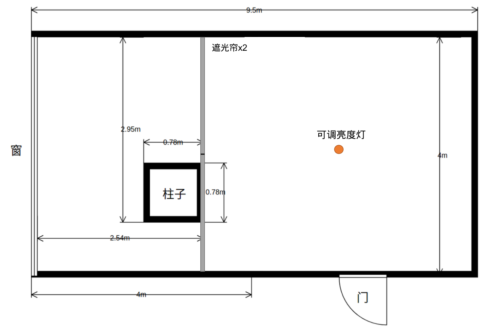
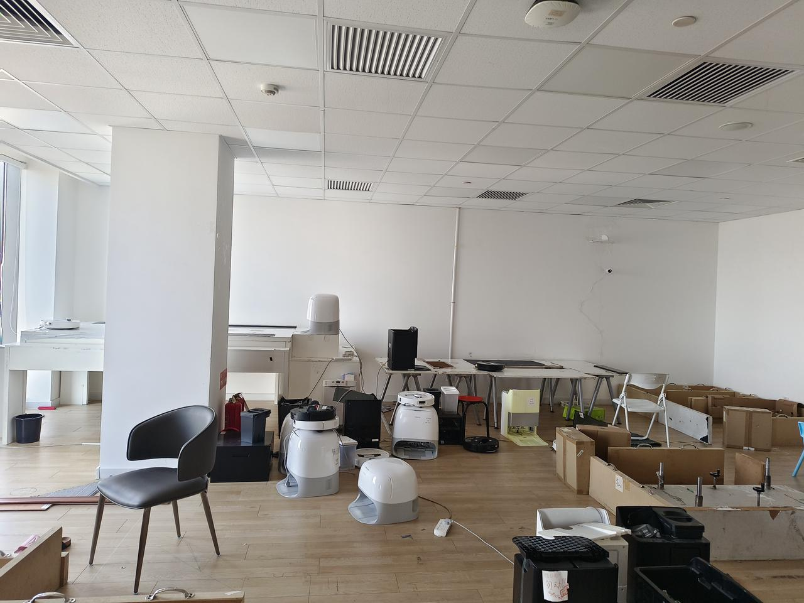

# 视觉实验室装修申请

Hi, all

为支持vslam开发，现申请对13层软件功能开发区进行改装，需要隔出一个房间作为视觉实验室。下图分别为装修平面图和对应的场地现状。望各位领导审批。另有一批实验器具需求，将在OA进行采购申请。

装修细节列出如下

* 原厂地中灯保留，电路需要改装，留出独立开关。

* 原厂地中的电口保留，不需要额外安装网口。

* 场地内墙面需要全刷白。

* 新装的门需要避免漏光。

* 场地内需要额外安装可调亮度光源，并留出开关。光源参考以下清单中的规格。

* 遮光帘需要避免漏光，一个位置安装两款窗帘，图案参考清单中的规格。最好是下拉式布局，避免褶皱。

  * 有纹理窗帘：白底、黑色无规则纹理。安装在靠墙侧。

  * 纯白色窗帘。安装在靠窗侧。

装修要素参考：

| 名称    | 链接                                                                                                                                                                                                                                                                                                                                                                                                                                                                                                                                                                                                                                                                                                                                                                                                                | 描述                                                   |
| ----- | ----------------------------------------------------------------------------------------------------------------------------------------------------------------------------------------------------------------------------------------------------------------------------------------------------------------------------------------------------------------------------------------------------------------------------------------------------------------------------------------------------------------------------------------------------------------------------------------------------------------------------------------------------------------------------------------------------------------------------------------------------------------------------------------------------------------- | ---------------------------------------------------- |
| 纯白窗帘  | [淘宝链接](https://e.tb.cn/h.TKsG8Qt39avnwoy?tk=ypO1ehVROVX)雪绒奶白款，定制大小，与窗帘盒匹配                                                                                                                                                                                                                                                                                                                                                                                                                                                                                                                                                                                                                                                                                                                                         | 安装在靠墙侧                                               |
| 有纹理窗帘 | [淘宝链接](https://item.taobao.com/item.htm?abbucket=18\&id=737132944095\&ns=1\&pisk=g-Voeg0ZFdYIqL5GNnG5CUXW6sBxlbGIFkdKvXnF3moXwvodFkD3voMUwbU8mDrTx2F89W2XtPaQwaGdPbaSOXSOX1h3PzGB_PuYC7vqg4a24URFHjSJuXfAX1CToTuS9rSTwlunH439TXkrUKzqc2AyUBrE3IuI0Quea2-VomgETQkrUr8q7V-eU4re0muZ-QueUDu4u43iTDrETZ4qc2HlYLoTTRPVmHzlgpH21u3oEczr4zU4gwDwFPnDTBP0nznN6mAeTS0zk_kk2I5EbRZ438yMzIHKGmVnrk16Nbk3Cy33q_ArMRE7QAwfxdmaBPGrWz1kifzzHW0Y9wpn4uN0u7HD5CMY07qn2XBedfyqWPi74epx9744wqZH7LUrC0cmlWIXaD24L7HSO3StFyy0m4qAcK00BuNig5SXtlSrwKJatFRIuwF2dpMrlqmOYsGHp6oO8OQcodUIUqgsXZbDdEkrlqqGoZvTBYuj7T1..\&priceTId=214784e117393509790803364e1c4b\&skuId=5097406181499\&spm=a21n57.1.item.110.4e5052e6MlKTGm\&utparam=%7B%22aplus_abtest%22%3A%224933f9ba661d5b443ab263a6158d49ab%22%7D\&xxc=taobaoSearch)D8280，定制大小，与窗帘盒匹配 | 安装在靠窗侧                                               |
| 可调亮度灯 | [淘宝链接](https://e.tb.cn/h.TKKIdkVvi4Kvuec?tk=nLtkeh2VSHj)                                                                                                                                                                                                                                                                                                                                                                                                                                                                                                                                                                                                                                                                                                                                                          | 60W 布置于右侧房间（暗房）天花板正中心（可适度调节位置）。最高亮度能使暗室亮度达到办公环境亮度水平。 |

