# 实验室机器信息统计

| 机型                  | SN                                                                                                                                                                                                                                                                                                                                                                                                                       | TN                | 是否报废 | 机型阶段 | 拍照记录（TN码拍照，APP机器信息页，实机照片）                                                                                                                                                                                                                                                                                                                        |
| ------------------- | ------------------------------------------------------------------------------------------------------------------------------------------------------------------------------------------------------------------------------------------------------------------------------------------------------------------------------------------------------------------------------------------------------------------------ | ----------------- | ---- | ---- | ------------------------------------------------------------------------------------------------------------------------------------------------------------------------------------------------------------------------------------------------------------------------------------------------------------------------------------------------ |
| ButchartPro（定位组机器 ） | R0049X52900121                                                                                                                                                                                                                                                                                                                                                                                                           | 7010979X153121059 | 否    | B1   | 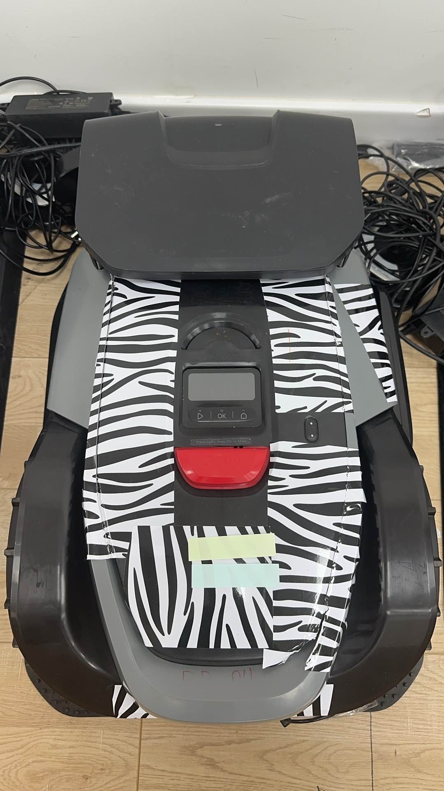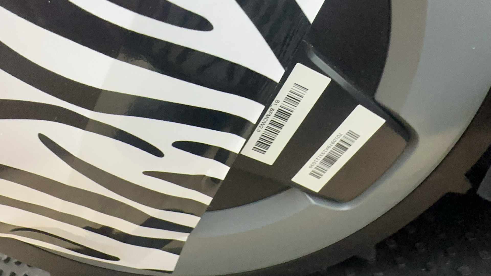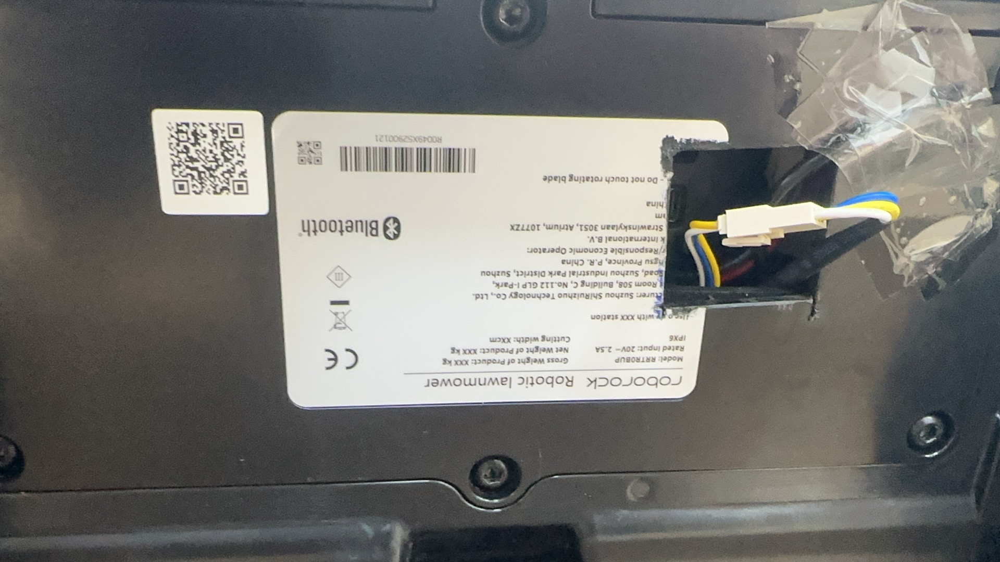                                                                                     |
| Butchart（定位组机器 ）    | R0045X52800003                                                                                                                                                                                                                                                                                                                                                                                                           | 7010959X152800017 | 否    |      | 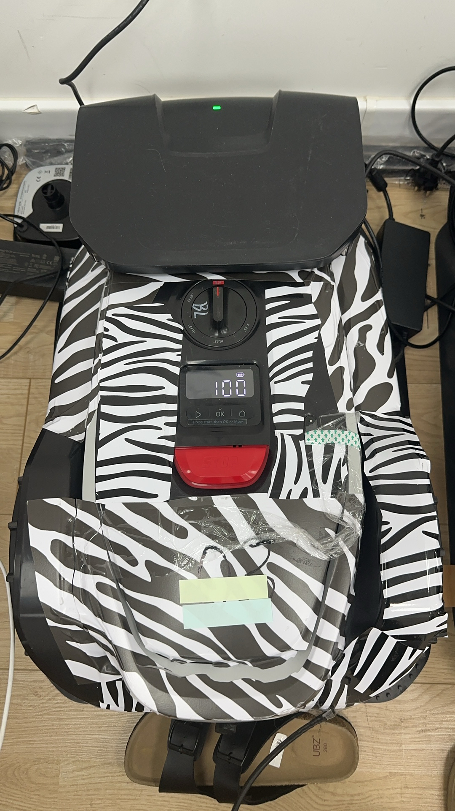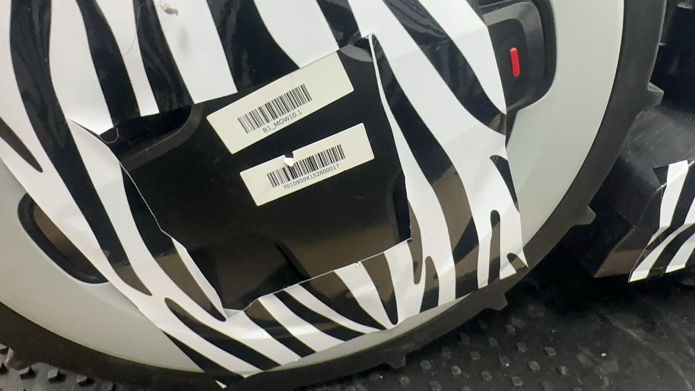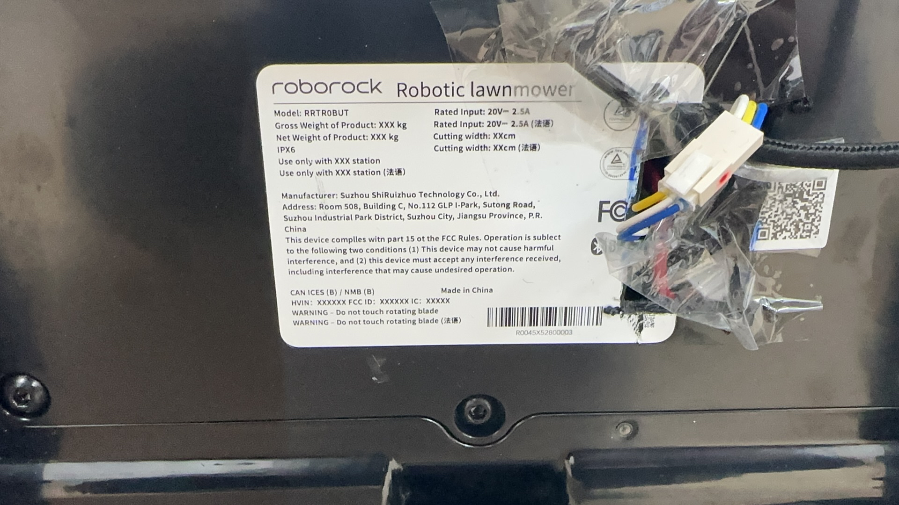                                                                                     |
| Versa（感知 ）          | R0063X54220024PN：7011023X154220024                                                                                                                                                                                                                                                                                                                                                                                       |                   | 否    | B1   | 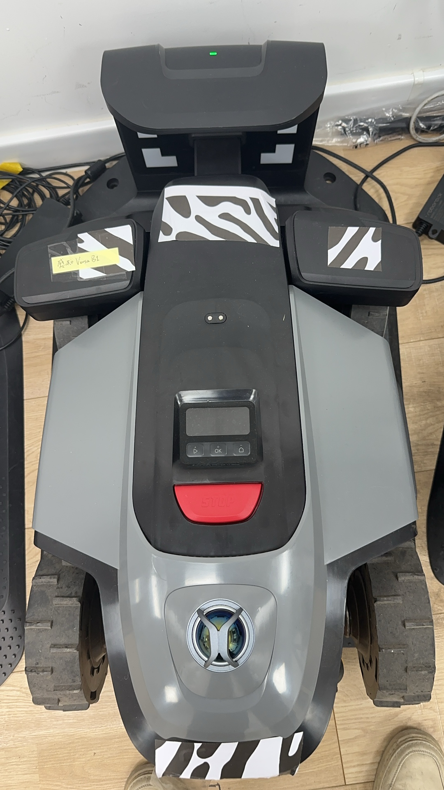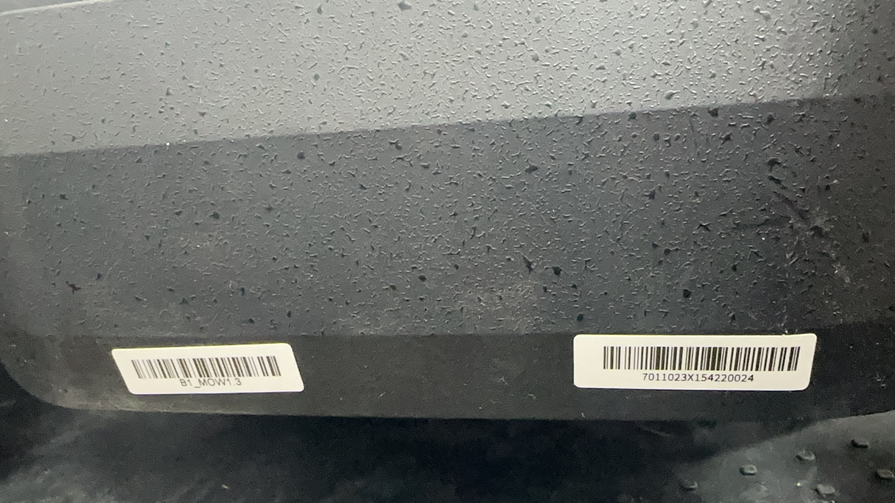                                                                                                                                                                         |
| Versa（定位， ）         | 产品名称: Versa海外 V5网络信息: AAIP 地址: [192.168.0.4](http://192.168.0.4/)WI-FI MAC地址: 24:9e:7d:49:47:26产品型号: roborock.mower.a282v5SN序列号: R0063X54210039固件版本: 02.99.98App 版本: 4.52.07(iOS 26.0 - 10141)插件版本: 215用户UID: rr659b53a6c55850DID: 1n3AY6Q4pnXwKZM3SBOi61mobileModel: iPhone17,3region: cn，需要保留的机器                                                                                                                       |                   | 否    |      | 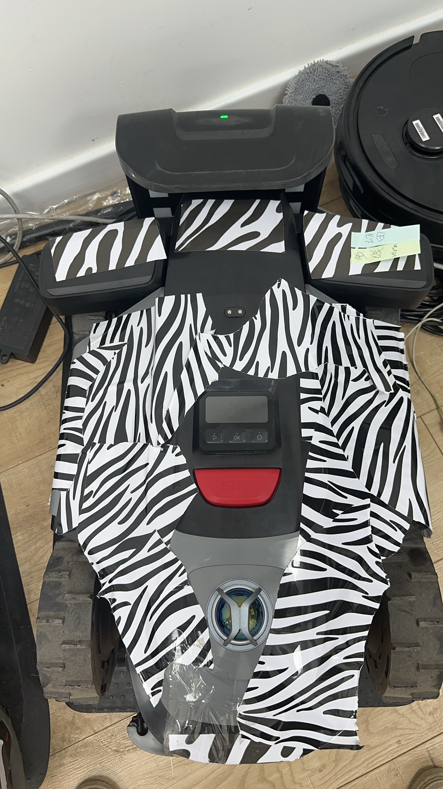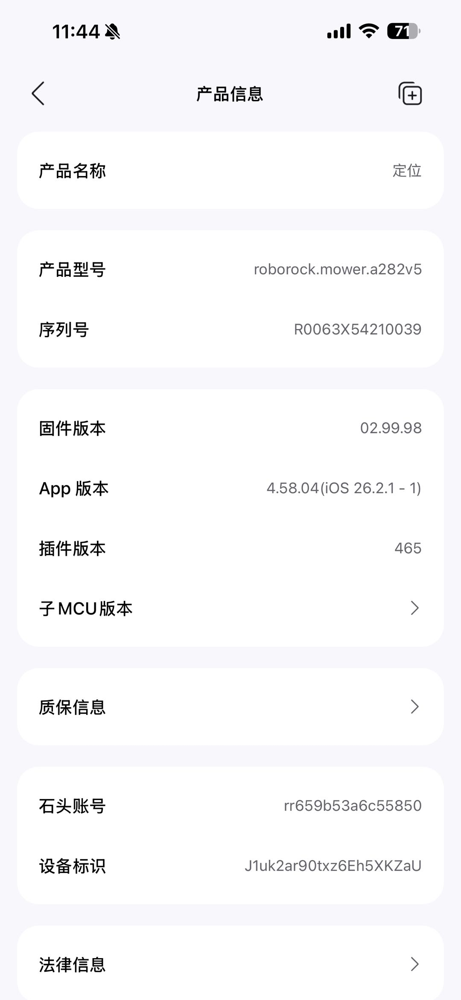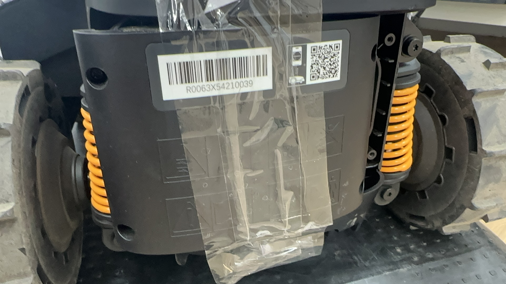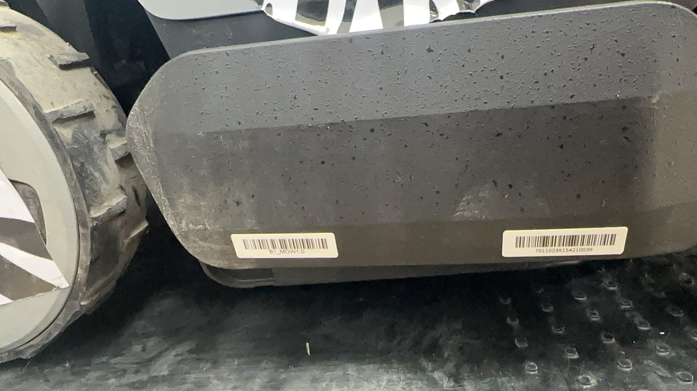 |
| ButchartPro（导航， ）   | R0049X52900102导航王朋涛管理&#xA;&#xA;产品名称: ButchartPro海外 V5&#xA;网络信息: AA&#xA;IP 地址: [192.168.0.2](http://192.168.0.2/)&#xA;WiFi MAC 地址: 24:9e:7d:33:b6:ab&#xA;产品型号: roborock.mower.a266v5&#xA;序列号: R0049X52900102&#xA;RTK 基站序列号: 未配对&#xA;固件版本: 02.99.98&#xA;App 版本: 4.56.06(Android 35)&#xA;插件版本: 342&#xA;质保信息: &#xA;石头账号: rr63f845683bd850&#xA;设备标识: 4VmOOPJcTj1tUfkJwQqiJH&#xA;法律信息: &#xA;mobileModel: V2454A&#xA;region: cn |                   | 否    |      | 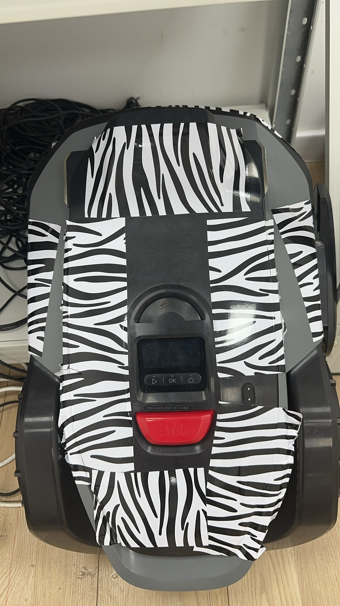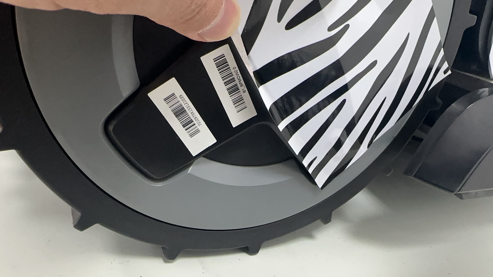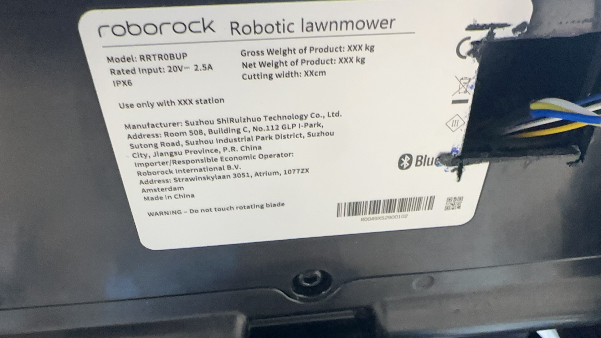                                                                                     |

