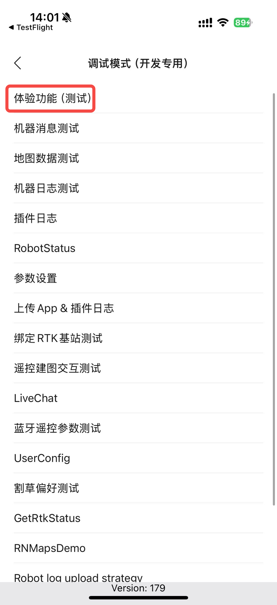
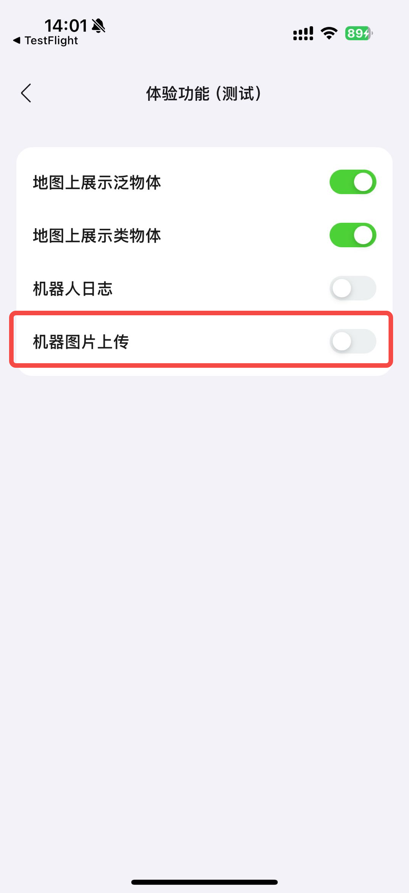
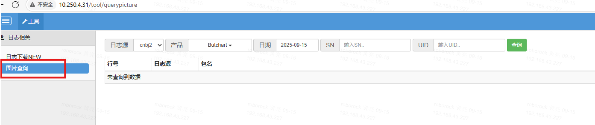
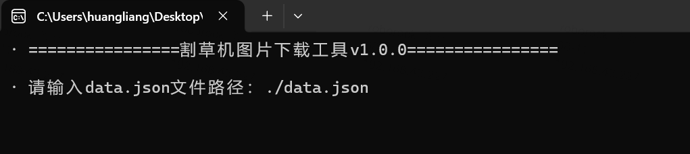

# 图片上传与下载

# 一.上传

## 1. 版本确认

图片能保存、上传的条件

1. 固件为存图版本

* 机器版本

v1：不存图，不上传

v5：存图，自动上传

## 2. 禁用方法

支持版本：9/29日开始往后的固件，179开始往后的插件

两种方法：

### 2.1 app开关

小扳手中

### 2.2 创建标志文件

1. 创建disable\_img\_up.flg文件禁用上传（删除则打开）

2. 重启机器

# 二.查询

只能查询确认，下载还是要用工具

查询网址：http://10.250.4.31/tool/querypicture

网站权限申请：&#x20;

查询选项同日志[ log上传与下载](https://roborock.feishu.cn/wiki/RIpewwYGaiBsrNkcMwLccF4mnTe)

注：暂不支持四驱侧边相机图像

# 三.下载

## 1.工具与配置文件

> 2026/2/26之后的版本用1.0.8版本，之前的用1.0.7版本
>
> 使用方式同之前一样，因为fs\_png\_decoder已经集成在此工具了，所以只需要用不同的版本即可，不需要额外更改data.json配置文件

Windows版（版本1.0.7）

windows版（1.0.8）

Linux版（1.0.7）

Linux版（1.0.8）

## 2.服务器下载

适用于下载机器上传到云端的图片

### 配置文件（data.json）

* **region**:上传服务器，由配网的app账号决定（cnbj2：中国大陆；de：欧区；usor：美区）

* **productType**: 机器类型，butchart、butchartPro、monet、versa

* **date**: 时间格式，图片上传的日期，如果想下载一个时间段，可以用英文逗号分隔，比如：2019-12-01,2019-12-24，下载12月1号到12月24号，总共24天的图片。(注意：机器为utc时间，图片可能在北京时间的前一天)

* **list**: 下载的多台机器的配置，json对象数组

* **sn**: 设备序列号，执行"rradb default shell cat /dev/shm/sn"指令获取（若未配过SN默认0000000000000）

* **uid**:用户id，执行"rradb default shell cat /mnt/reserve/miio/wifi.conf"指令获取

注：四驱侧边相机图片临时下载方式，uid填"usbcam/uid"

* **nid**:匿名id，用于解密，执行"rradb default shell cat /mnt/reserve/vnid"指令获取（没有则填0000000000000000，可能影响图片解密）

* **package**: 图片目录，下载指定目录的图片，图片目录和日志目录序号对应，如果为空，下载当天全部目录

（例：对应日志目录为000270.20250819075559099\_R0005X52700138\_2025081905DEV，参数填"000270"）

* **startTime、endTime：**&#x53EF;选下载时间段的起始和结束时间，北京时间，格式：HH:mm:ss（03:29:00），需要图片名包含时间信息（R\_97261\_640X544\_2025\_11\_28\_11\_29\_00\_image.fs）

* **isZip**: 处理结果目录是否压缩，true：压缩，false：不压缩

  * autoZipName: 处理结果zip文件名是否自动生成，如果 isZip : true时，autoZipName: true, 最终zip名已GUID为文件名

  * zipPwd: 处理结果zip压缩文件压缩密码，isZip： true 时，zip文件将会加密

* **asyncCount**: 并行下载数量，默认4，同时下载4个 encpic\_\*.tar.enc 文件，建议最大不要超过核心数

### 运行方法

1. 直接点击程序，输入配置文件data.json的路径

* 命令行启动

### 运行结果

进度条跑完后，会在 LawnImgDownload.Cmd.exe 同级目录下生成对应的 结果目录 或 zip文件。

## 3.本地图片处理

用于处理手动从机器pull出来的图片文件

### 配置文件（localfile.json）

* **path**：需要处理的文件夹, 注意：json里windows目录必须是双斜杠

* **nid**:匿名id，如果是加密图片，用于解密，执行"rradb default shell cat /mnt/reserve/vnid"指令获取（没有则填0000000000000000）

### 运行方法

命令行启动

### 运行结果

处理完成后，结果文件在path目录下

### 图片解压工具：
