# 内存占用分析

# 仿真时的内存占用分析方式

&#x20;<https://renyili.org/post/jemalloc%E4%BD%BF%E7%94%A8/>

# 割草机跑机内存占用分析方式

&#x20;

参考文档：[ rrprofiler 使用说明](https://roborock.feishu.cn/wiki/ZELbwsEwIiAFTlkhKV7cyvNznxh)

1. 编译特定版本

统计进程内存占用情况，需要打开特定的编译宏：

```c++
RR_SW_DEBUG_MEM_PROFILE
RR_SW_ENABLE_JEMALLOC
RR_SW_DEBUG_LOADER_PROFILE
RR_SW_FUNCTION_PLUGIN_RUN_AS_SUB_PROCESS
```

其中前三个宏表示打开内存占用统计工具，具体意思[ rrprofiler 使用说明](https://roborock.feishu.cn/wiki/ZELbwsEwIiAFTlkhKV7cyvNznxh)有详细解释，第四个宏表示各个模块单独开进程，方便单独统计slam模块的内存或CPU占用情况。

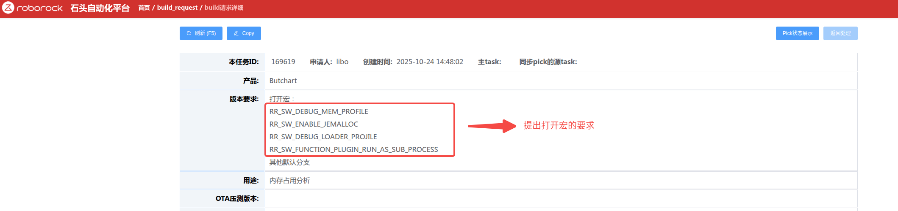

* 版本跑机确认

打开宏后，机器跑机过程中会在devtest下生成不加密的日志，日志解压缩后可以看出许多heap\_\*开头的文件。

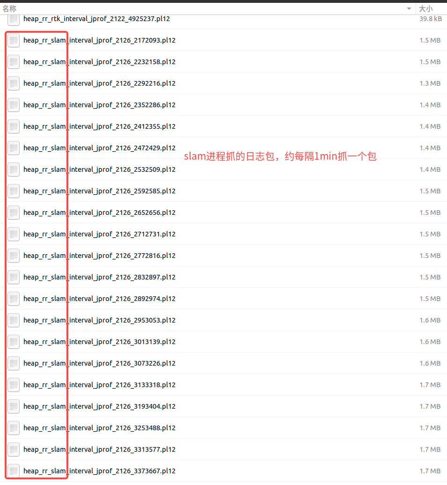

注意：如果日志已经上传服务器，从日志平台下载的会自动解压日志包，可以直接看到heap\_\*文件。但如果手动打包拉出的devtest日志在解压过程中，当前版本log\_merge.sh脚本没有识别heap\_\*开头的文件，会把日志误删掉，解压时略改一下log\_merge.sh内容，不要删掉MEM\_DEBUG\_bk文件夹，里面会有许多heap\_\*的文件，手动解压一下即可使用。

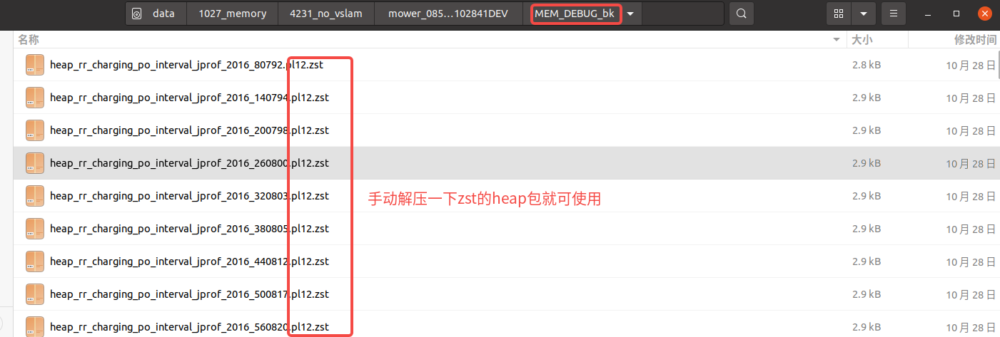

* 内存占用统计

- slam整个模块的内存和cpu占用情况：

  slam单拉进程后，日志top.log直接记录了slam整个模块（rr\_slam）的内存和cpu占用情况，可以直接统计出不同时刻整个slam的占用情况。

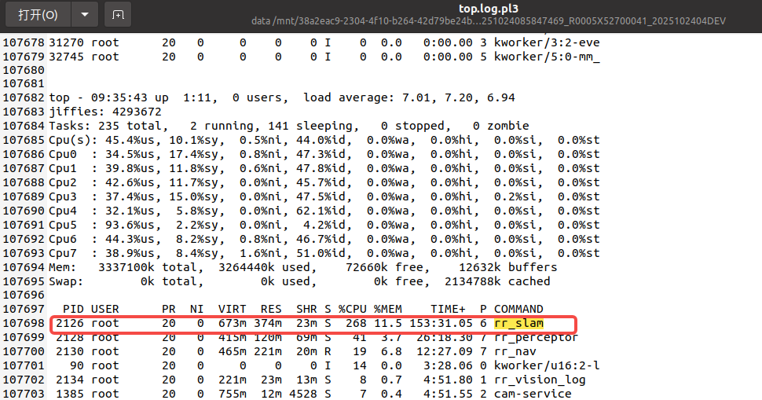

* slam中各个线程的内存和cpu占用情况

  日志topH.log直接记录了所有线程的内存和cpu占用情况，包含slam中开启的各个线程（slam线程命名为l\_s\_\*），可以直接统计出不同时刻slam不同线程之间的占用情况。

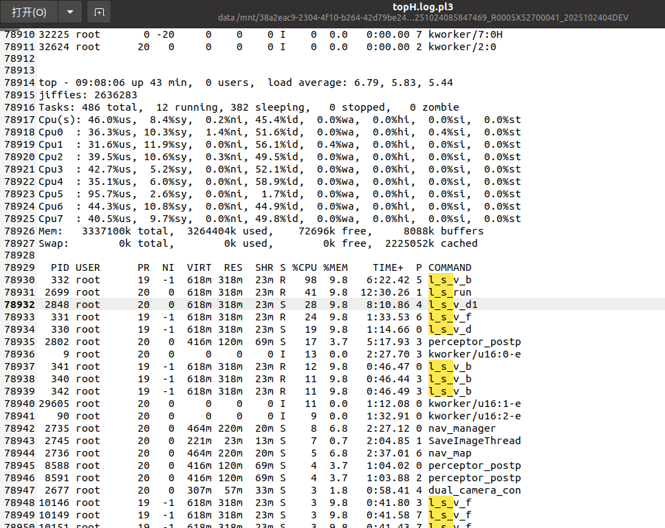

* 內存占用火焰图生成（參考文档[ rrprofiler 使用说明](https://roborock.feishu.cn/wiki/ZELbwsEwIiAFTlkhKV7cyvNznxh)）

类似分析core一样，准备文件：

* 下载对应版本的sdk（在share文件夹对应版本目录中），并解压sdk，会生成一个rootfs文件夹。

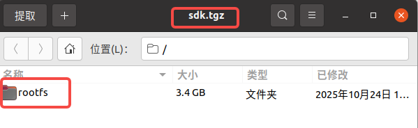

* 下载对应版本的FULLTEST包（在share文件夹对应版本的FULLTEST目录中），并解压，将解压出的文件放到sdk里的rootfs文件夹下。

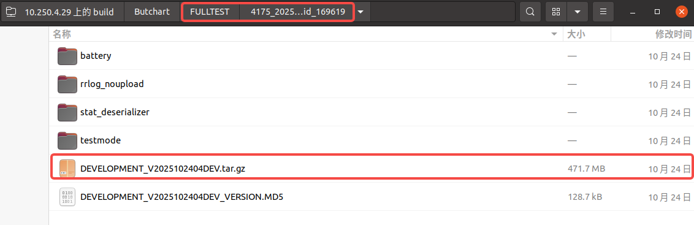

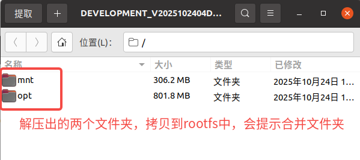

* 拷贝感兴趣时刻的heap\_\*文件到rootfs中。

  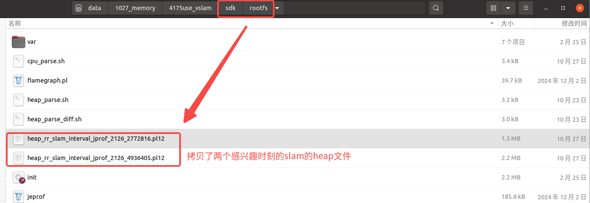

* 拷贝perf工具到rootfs中

  perf工具下载参考[ rrprofiler 使用说明](https://roborock.feishu.cn/wiki/ZELbwsEwIiAFTlkhKV7cyvNznxh?from=from_copylink)：

  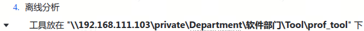

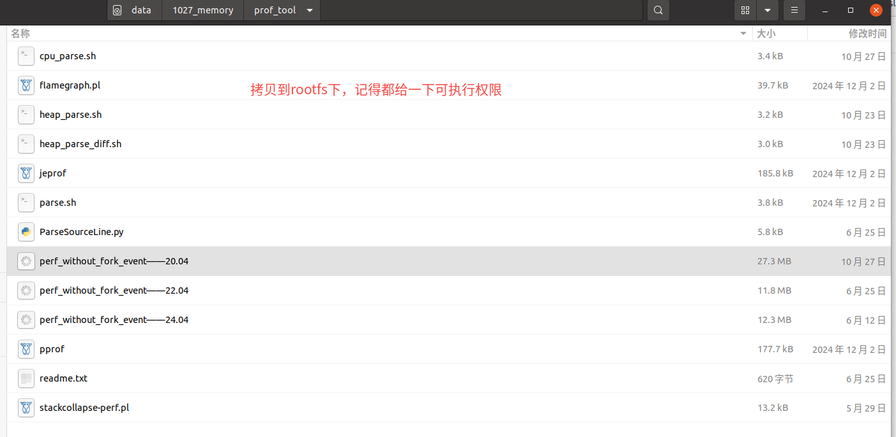

* 火焰图生成命令：

  ```c++
  ./heap_parse.sh heap_rr_slam_interval_jprof_*
  ```

  生成过程中可能会遇到一些问题，参考文档[ perf结果详细使用教程](https://roborock.feishu.cn/wiki/LsESw5ANqiJvinklJ9icKeq5nKc?from=from_copylink)有很详细的解决方案（也包含整个perf使用流程）

  内存分析中可能遇到如下问题

  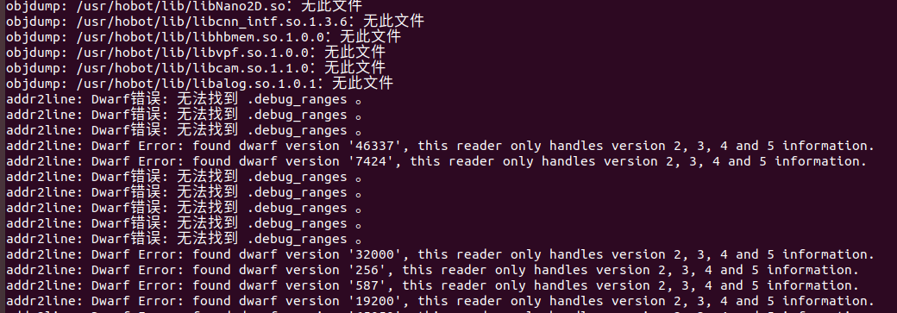

  可对应做如下修改：

  1. heap\_parse.sh中每个./${PROF}的lib\_prefix新增./usr/hobot/lib

     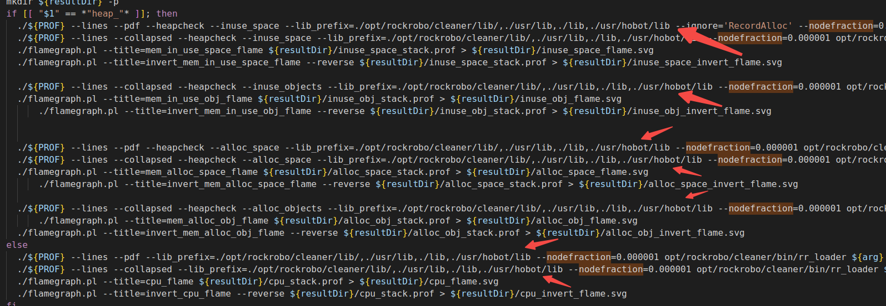

  2. jeprof中替换自己PC上的llvm进程

     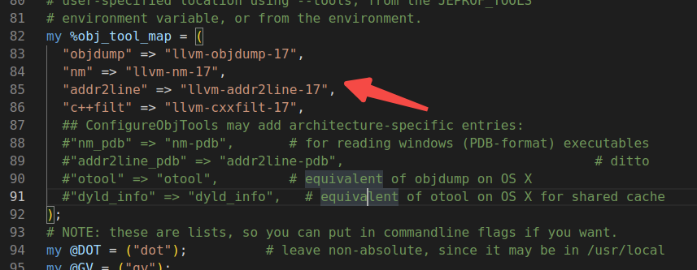

  原工具中只有ubuntu 22和24的perf\_without\_fork\_event，再补充一个ubuntu 20.04的版本：

* 火焰图解读

  解决各种问题，命令成功执行后，会在rootfs中生成heap文件对应的文件夹，里面有许多.svg的火焰图格式文件，浏览器打开即可详细看火焰图每层的情况。

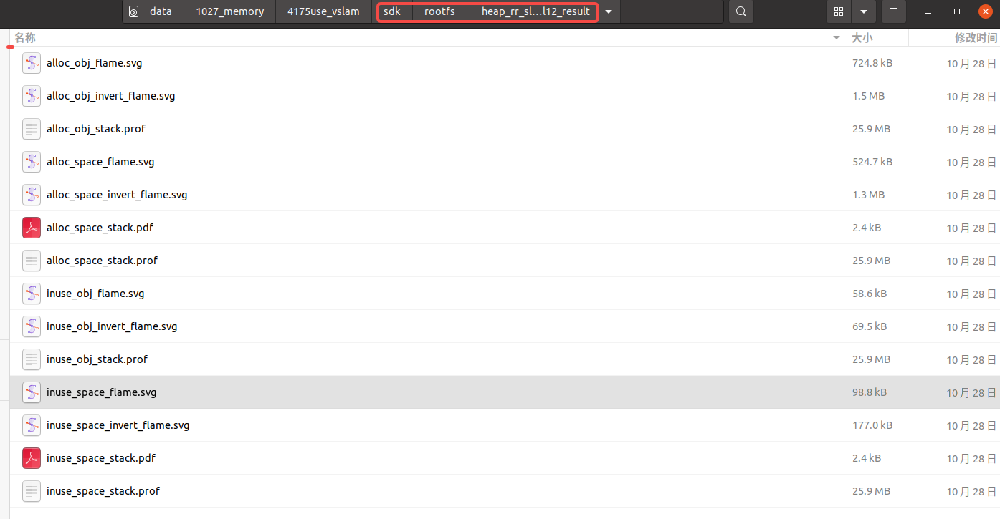

不同火焰图文件的含义参考[ rrprofiler 使用说明](https://roborock.feishu.cn/wiki/ZELbwsEwIiAFTlkhKV7cyvNznxh?from=from_copylink)

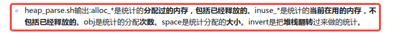

浏览器打开火焰图后可以看到具体函数的内存占比和大小，火焰图中的samples：\*\_space\_\*文件的samples表示内存大小，单位字节Byte；\*\_obj\_\*文件的samples表示分配次数。

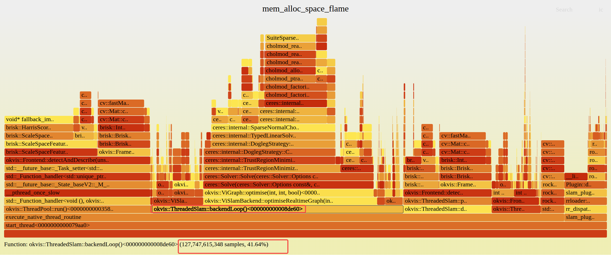

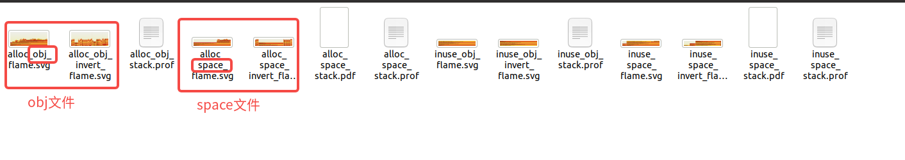

