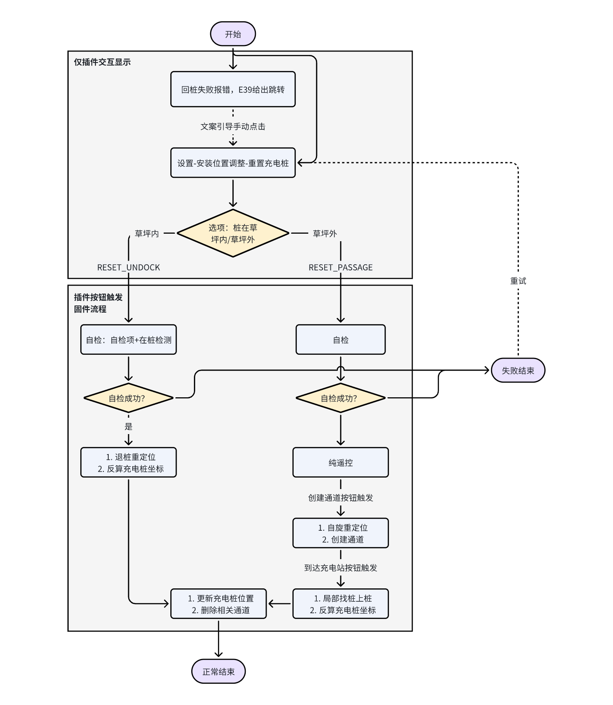
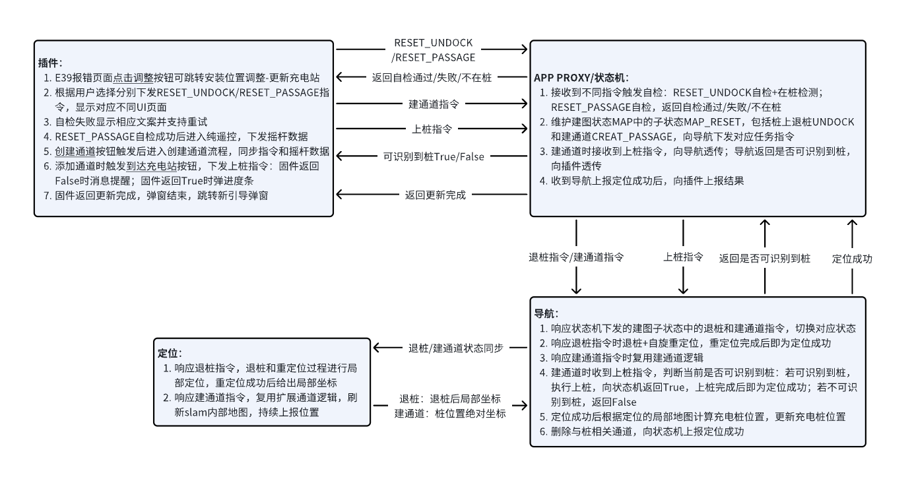
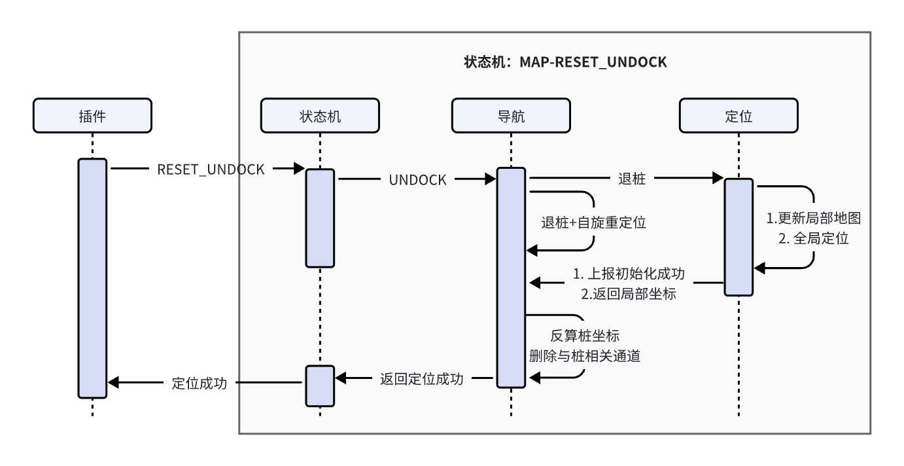
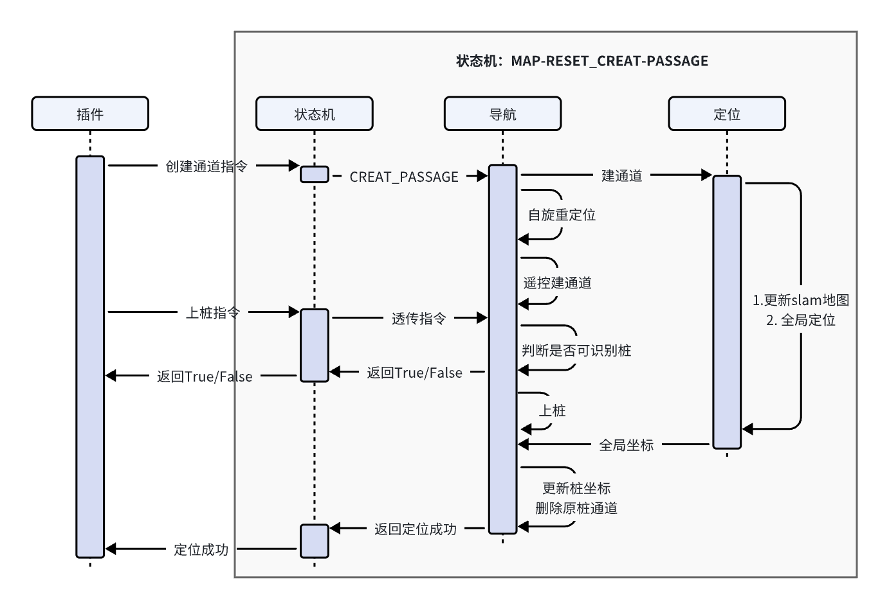

# 激光LiDAR充电桩移位需求分解

# 文档版本记录

| 版本   | 变更时间      | 变更记录 | 变更人 |
| ---- | --------- | ---- | --- |
| V0.1 | 2026/2/26 | 初稿创建 |     |

# 产品需求

[ 激光LiDAR充电桩移位策略](https://roborock.feishu.cn/wiki/HiQSwqbC6iYoY5kzV6pc7ixcnXc)

# 交互需求（IR）

IR-01: 需要在显示E39回桩失败报错时可选择跳转重新定位充电桩，引导重新定位充电桩和建立上桩通道

IR-02: 需要在定位失败后提示失败，并可以重新尝试

# 系统需求（SR）

SR-01：需要按照机型区分重新建桩逻辑，区分RTK款和激光款的重新建桩功能

SR-02：在收到重新建桩指令后，需要执行对应动作并重定位获取充电桩位置

SR-02-001: 新充电桩在草坪内时，需退桩+自旋重定位获取充电桩位置

SR-02-002: 新充电桩在草坪外时，需按照建通道逻辑进行局部定位，遥控距离不大于建通道距离限制

SR-03：更新充电桩位置后，需要删除原有上桩通道，并支持重新建立上桩通道

# 概要设计（AR）

