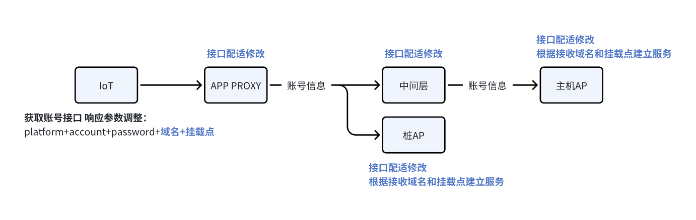
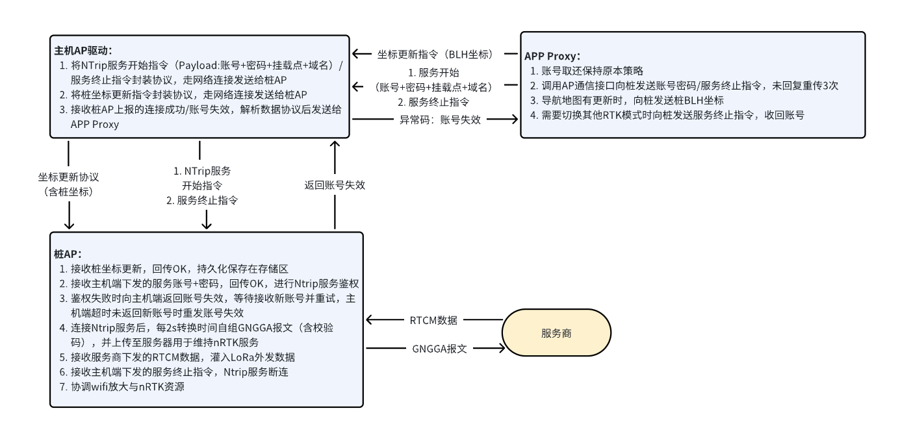
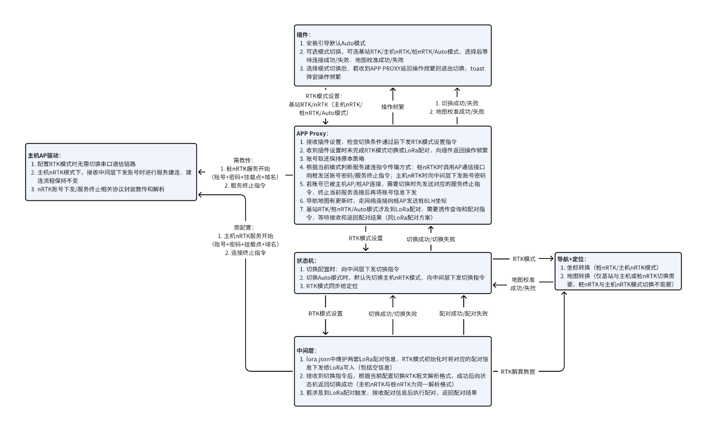
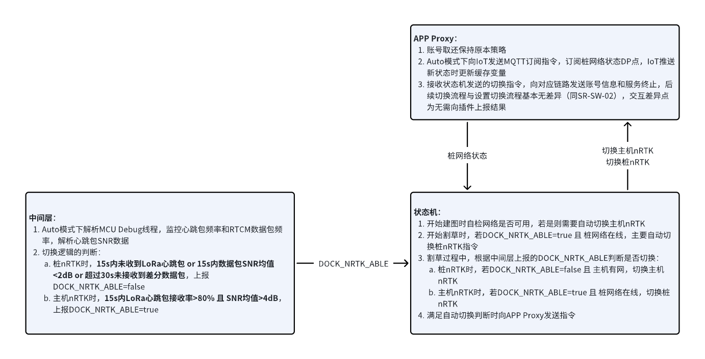
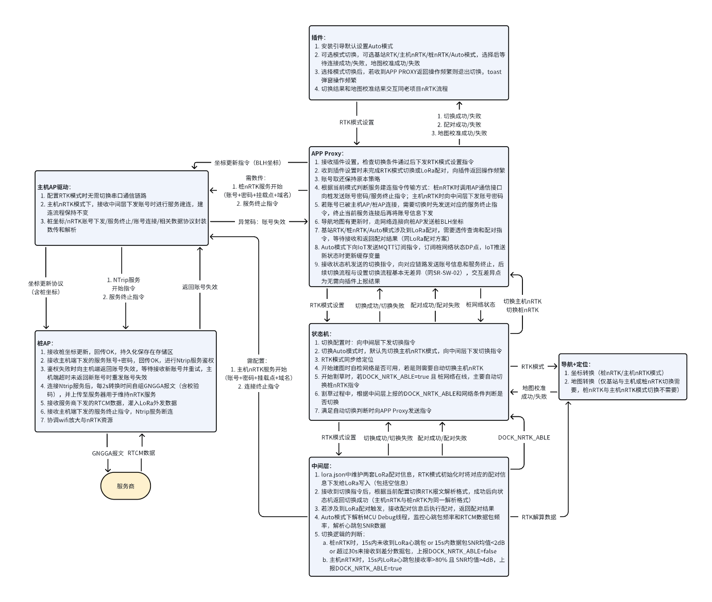
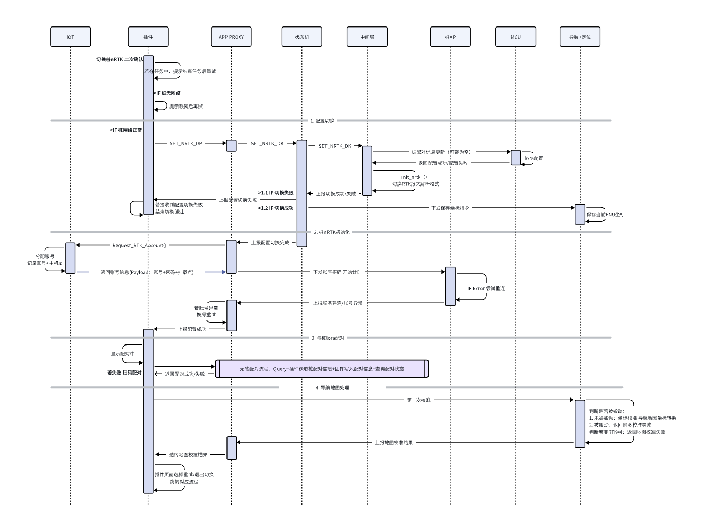
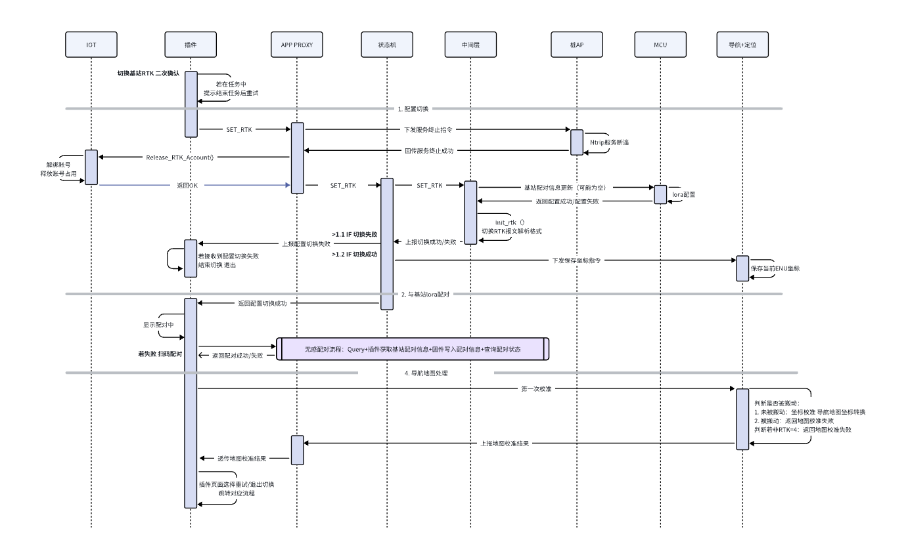
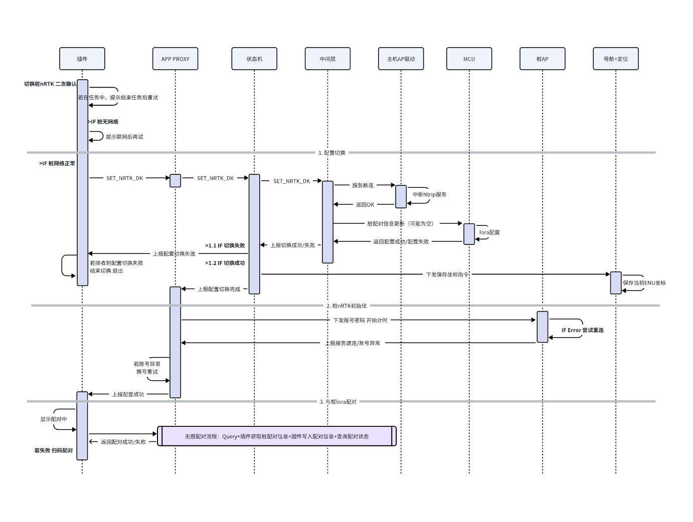
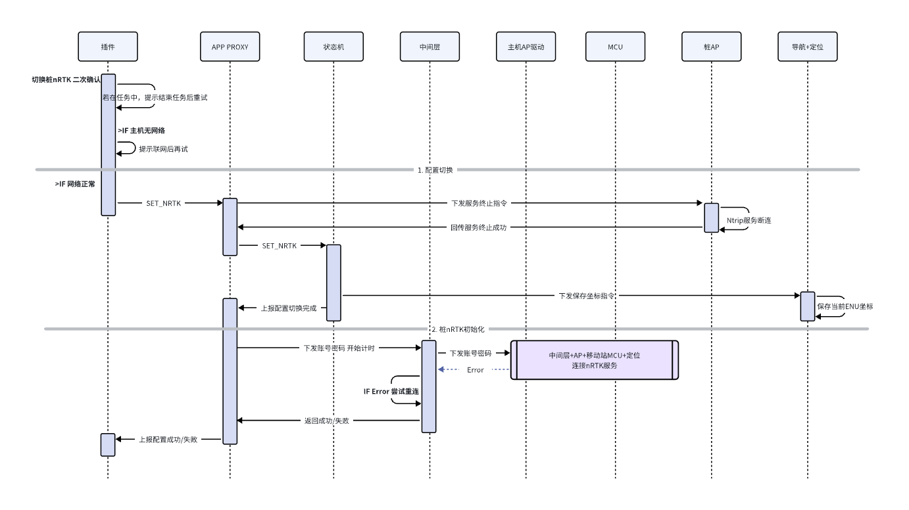

# nRTK需求分解-Gaia

# 文档版本记录

| 版本   | 变更时间      | 变更记录          | 变更人 |
| ---- | --------- | ------------- | --- |
| V0.1 | 2026/3/13 | 桩nRTK实现需求初版完成 |     |
| V0.2 | 2026/3/23 | 账号信息新增绑定域名    |     |
| V1.0 | 2026/3/30 | 根据产品完整需求初版完成  |     |

# &#x20;产品需求

[ 网络RTK](https://roborock.feishu.cn/wiki/PQbnwpaCSitmzCkYuZwcnKMAnFe)

# 交互需求

IR-01：需要在满足条件时实现1+1RTK/主机nRTK/桩nRTK三种模式之间的任意切换，切换后可正常使用RTK定位

IR-02：需要在RTK模式切换成功后主动对齐导航地图，支持地图切换失败后重建地图或切换回原模式

# 系统需求

**SR-ID-00：需要兼容一供二供多家供应商账号，可根据账号归属连接对应的供应商服务**

SR-ID-01：账号池的账号需要能够对应正确的域名和挂载点，主机可通过域名连接

SR-ID-02：需要能够随时支持供应商的增减和修改

SR-ID-03：需要根据用户区域匹配对应供应商账号池，提供正确区域的账号（TBD）

**SR-DK-00：需要支持使用桩nRTK模式，可通过桩连接CORS服务获取RTCM后通过LoRa传输给主机进行nRTK解算**

SR-DK-01：esp桩端需要进行Ntrip账号鉴权与服务保持

SR-DK-01-001：桩需要进行账号的连接，接收到主机下发账号后进行Ntrip服务建连，并在尝试建连后向主机返回连接成功/账号失效

SR-DK-01-002：桩需要接收主机更新的充电桩坐标并保存

SR-DK-01-003：桩端需要按照2s频率根据当前桩坐标和时间自组GNGGA报文，并向Ntrip服务器上传

SR-DK-02：主机端需要支持桩nRTK模式

SR-DK-02-001：主机端在桩nRTK模式下根据一定的账号取还逻辑向IoT请求和归还账号，主动发起桩连接Ntrip服务和断联的请求

SR-DK-02-002：主机端需要在充电桩位置更新后向桩同步桩经纬高坐标

**SR-SW-00：需要支持基站RTK/主机nRTK/桩nRTK三者之间的切换**

SR-SW-01：需要支持1+1RTK模式与桩nRTK模式之间的设置切换，进行配置切换、服务建连和地图校准

SR-SW-01-001：仅支持用户主动触发切换

SR-SW-01-002：模式切换时需要将LoRa配对信息切换为桩LoRa

SR-SW-01-003：切换后需要根据切换前后相对坐标和绝对坐标进行地图坐标转换

SR-SW-02：需要支持主机nRTK模式与桩nRTK模式之间的设置切换，进行配置切换、服务建连和地图复用

SR-SW-02-001：支持用户主动触发切换

SR-SW-02-002：模式切换时需要更换账号使用端，在主机AP和桩AP之间回收和发放账号

SR-SW-02-003：地图可完全复用，地图校准步骤可直接通过

SR-SW-03：需要支持1+1RTK模式与主机nRTK模式之间的设置切换，进行配置切换、服务建连和地图复用

SR-SW-02-001：切换为1+1RTK模式时需要将LoRa配对信息切换为基站LoRa

SR-SW-02-002：其余切换配置（与已有方案基本相同）

SR-SW-04：新手引导默认设置nRTK的auto模式

SR-SW-05：auto模式初始使用主机nRTK，初始配置流程复用已有功能

SR-SW-06：触发切换受到线程阻塞时需要取消此次切换，并向插件返回提示

| **模式切换**      | **APP Proxy** | **中间层** | **导航+定位** |
| ------------- | ------------- | ------- | --------- |
| 基站RTK->主机nRTK |               |         | 需地图对准     |
| 基站RTK->桩nRTK  |               |         | 需地图对准     |
| 主机nRTK->基站RTK |               |         | 需地图对准     |
| 主机nRTK->桩nRTK |               |         | 不需地图对准    |
| 桩nRTK->基站RTK  |               |         | 需地图对准     |
| 桩nRTK->主机nRTK |               |         | 不需地图对准    |

**SR-AU-00：需要支持自动模式下桩nRTK与主机nRTK模式间的智能切换**

SR-AU-01：设置Auto模式时保存设置，初始若网络可用设置为主机nRTK模式，若网络不可用设置为桩nRTK模式

SR-AU-02：设置Auto模式时需要先进行桩LoRa配对，完成后再进行nRTK模式切换

SR-AU-03：建图时若网络可用需要切换为主机nRTK模式

SR-AU-04：割草时若LoRa信号良好需要使用桩nRTK模式，切换策略为：

* 开始割草时需要检测桩网络和LoRa信号，若桩在线且LoRa信号正常则切换为桩nRTK模式；

* 割草过程中需要在桩nRTK无法支持时切换为主机nRTK，并在桩nRTK可用时切换回桩nRTK，切换条件：

  * LoRa连接中断（15s内未收到LoRa心跳包）或LoRa即将断开（15s内数据包SNR均值<2dB）或RTCM数据中断（超过30s未接收到差分数据包），若此时主机已连接网络，切换为主机nRTK；

  * LoRa连接稳定（15s内SNR均值>4dB），若此时查询云端在线状态的DP点为在线，切换为桩nRTK；

# 概要设计

# 详细设计                                                            &#x20;

1. **插件交互流程**

[ 1. NRTK & 实体Sim卡 & Lora需求梳理](https://roborock.feishu.cn/wiki/Songw7qfIimaGpkBiBHct8nsnHf#share-BrhBdEmdfo6iwUx8JGtcKeL1nHd)

* **固件交互流程**

- 基站RTK切桩nRTK

* 桩nRTK切基站RTK

* 主机nRTK切桩nRTK

* 桩nRTK切主机nRTK

