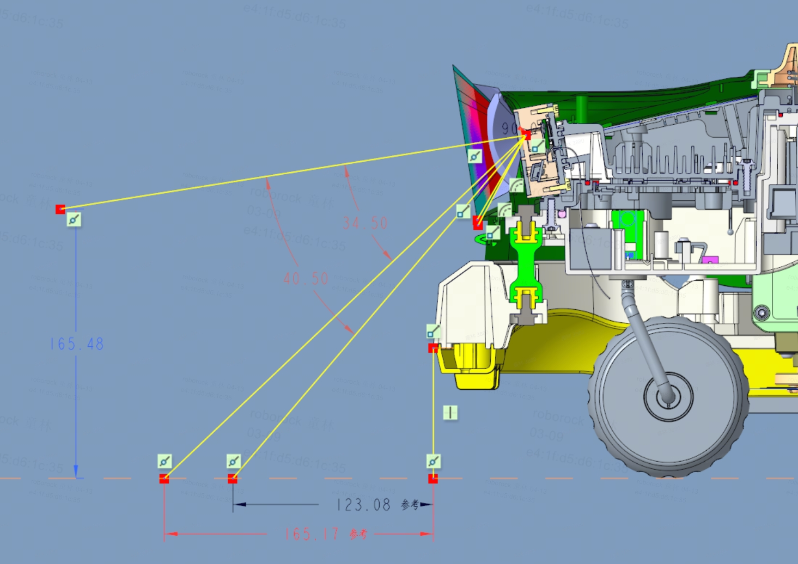
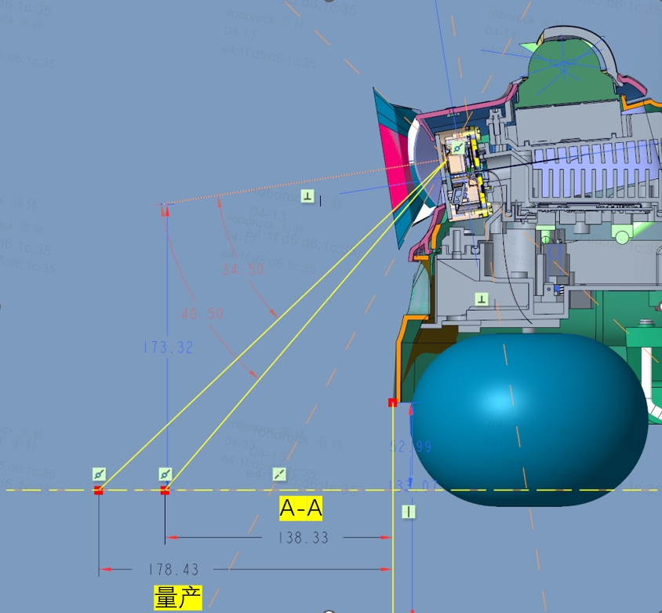

# FLORA,LUMOS,GAIA联合双目评估

## 背景

* 今年三个新项目相对于去年项目架构盲区约大15\~20mm（整机尺寸限制），导致对双目的管控要求更大

&#x20;                              butchart                                                                             flora

* 欧菲和联合双目，相较于去年舜宇降本均在22元以上。考虑联合非AA工艺，主要是考虑进一步降本因素

* Flora mk2 架构设计时，联合的AA工艺预估价差是4\~5元，不良参考舜宇为7‰

## 约束条件

[ 联合OC及盲区管控](https://roborock.feishu.cn/docx/ZmMKd8ecIoYZ2Fxyf1occhHunGh) &#x20;

[ 双目盲区软件必须15cm以下的诉求理论分析](https://roborock.feishu.cn/docx/Q5e7d4lhmoqZKQxgvQoc9GMBn4g)  &#x20;

联合制程管控能力弱，目前拿不到理论和实际不良率，不确定性大。

无实际不良率，无法确定挑选方案是否可行以及挑选增加的人力成本等。

## 优劣势对比

|             | 价格     | 制程管控           | 软件诉求（15cm） | TPM RFQ  | 结构/ID | 项目周期                 | 其他 |
| ----------- | ------ | -------------- | ---------- | -------- | ----- | -------------------- | -- |
| 欧菲双目（AA工艺）  | A      | 制程管控能力相对较强     | 满足         | 满足       | 无变动   | 无变动                  |    |
| 联合双目（AA工艺）  | B=A-12 | 风险低，交货情况暂无数据支撑 | 满足         | 满足       | 无变动   | 无变动                  |    |
| 联合双目（非AA工艺） | B-12   | 风险高，交货质量不确定性高  | 不满足        | 不满足      | 有变动   | 需要重新优化架构和ID设计，预计影响3周 |    |

## TO DO

* 商务议价，已提供采购侧期望加权平均价格 &#x20;

* 三个项目采用方案推进

## 参考文档

[ 割草机双目模组资料汇总](https://roborock.feishu.cn/sheets/TLOrstCK1hMkw0tcTAPc8oXpnEd)
