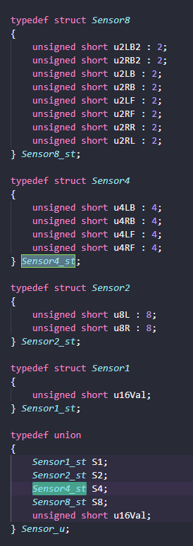
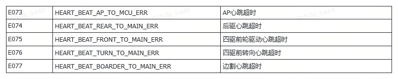
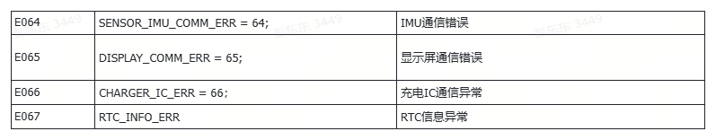
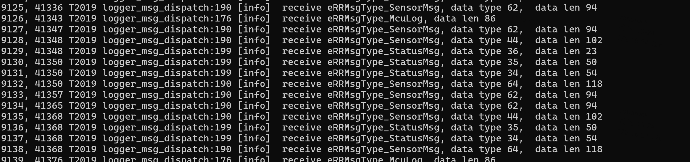

# 中间层数据协议

# 一、X5IMU

## 1.1 Imu外参

### 1. 通讯方式pin'c

* rrloader广播:common/loader/include/plugin\_msg\_define.h

### 2. 消息ID

* eRRMsgType\_IMUParameters

### 3. 数据定义

| rr\_msg\_imu\_param\_t |                   |                   |
| ---------------------- | ----------------- | ----------------- |
| 字段                     | 类型                | 备注                |
| acc\_noise             | rr\_imu\_noise\_t | imu相对odo位置        |
| gyro\_noise            | rr\_imu\_noise\_t | imu相对odo的四元数角度信息  |
| extrinsic              | float\[12]        | 外参值，12个元素的float数组 |

## 1.2 Imu数据

### 1. 通讯方式

* rrloader广播:common/loader/include/plugin\_msg\_define.h

### 2. 消息ID

* eRRMsgType\_IMUData

### 3. 数据定义

| rr\_msg\_imu\_data\_t |                    |      |          |
| --------------------- | ------------------ | ---- | -------- |
| 字段                    | 类型                 | 是否必须 | 备注       |
| timestamp             | uint64\_t          | 是    | 时间戳      |
| linear\_acceleration  | point\_3d\_type    | 是    | 三轴加速度    |
| angular\_velocity     | three\_axis\_type  | 是    | 三轴角速度    |
| orientation           | quaterion\_type    | 是    | 三轴角度/四元数 |

## 1.3 中间层与下位机接口

### 1. 通讯方式

* uart\_api:  data\_parse.h

### 2. 消息ID

* RPT\_IMU\_INFO\_ID

### 3. 数据定义

| rpt\_imu\_msg     |              |      |        |
| ----------------- | ------------ | ---- | ------ |
| 字段                | 类型           | 是否必须 | 备注     |
| timestamp         | Unsigned int | 是    | 时间戳    |
| acc\_roll         | double       | 是    | 旋转角线速度 |
| acc\_pitch        | double       | 是    | 倾斜角线速度 |
| acc\_yaw          | double       | 是    | 航向角线速度 |
|  angular\_roll    | double       | 是    | 旋转角角速度 |
| angular\_pitch    | double       | 是    | 旋转角角速度 |
| angular\_yaw\_yaw | double       | 是    | 航向角角速度 |


### 4. 函数接口

由下位机提供：rda\_headers.h

| 函数名                            | 参数                  | 返回值类型 | 备注                               |
| ------------------------------ | ------------------- | ----- | -------------------------------- |
| rr\_ap\_imu\_init              |                     | int   | 设置imu工作为普通模式，成功返回0，失败返回-1        |
| rr\_ap\_imu\_read\_data\_start |                     | int   | 开始读取数据                           |
| rr\_ap\_imu\_exit              |                     | void  | 退出后imu工作为disable模式，要使用imu需再次init |
|  rr\_ap\_imu\_read\_data       |  X5Gyro\_st  \*data | void  | 将raw\_data数据转换为buffer数据          |

# 二、CHASSIS

## 2.1 中间层与下位机接口


### 1. odo/imu相关数据

```c++
RPT_MCU_REAR_MOTOR_ID                               = UART_API_ID_BASE + 0x32,//后轮
RPT_MCU_FRONT_MOTOR_ID                              = UART_API_ID_BASE + 0x3c,//前轮

typedef enum {
    VELMODE_NONE = 0,
    VELMODE_LARGE_TURN_AKM,
    VELMODE_SMALL_TURN_AKM,
    VELMODE_SPIN,
    VELMODE_TURN_ANGLE,
} McuMotorCtrlMode_e;

typedef struct
{
    float acc[3];         // x y z
    float gyro[3];        // x y z
    float quat[4];        // x y z w
    uint32_t odo_cnt[2];  // odo cnt: rear_left, rear_right
    float odo_speed[2];   // actual car v w
    float bus_current[2]; // rear left/right bus current
    int64_t time_stamp;
} McuRearOdoGyro_st;

typedef struct
{
    uint32_t odo_cnt[2];  // odo cnt: front_left, front_right
    float odo_speed[2];   // front left/right speed
    float bus_current[2]; // front left/right bus current
    float angle[2];
    int64_t time_stamp_move;
    int64_t time_stamp_steer;
} McuFrontOdo_st;
/////////////////////////////////////////////////////////////////////////////////////
CMD_SET_ODO_SPD_ID                                 = UART_API_ID_BASE + 0xbc,
// 这个结构体同步改了！
typedef struct {
  float odo_speed[2]; // target car v w
  float front_angle[2]; // steer motor, left/right angle, (left 90 : 0 : right -90)
  int ctrl_mode; //control mode, only for monet
} McuOdoSpd_st;

基于ODO计算，一圈对应的odo_cnt：
四驱前轮 660
四驱后轮 660
两驱后轮 1200
```


### 2. 机器触发式信号

#### 2.1碰撞和抬起

用来上报bumper和drop状态信息。触发时上报和解除时上报。

上报bumper\&drop数据结构，都使用Sensor\_u这个定义。



1.bumper

```plain&#x20;text
RPT_STATUS_BUMPER_ID                               = UART_API_ID_BASE + 0x21,

typedef enum {
    BUMPER_DIR_INIT                                = 0x0,
    BUMPER_DIR_BACK                                = 0x1,
    BUMPER_DIR_FRONT                               = 0x2,
    BUMPER_DIR_LEFT                                = 0x3,
    BUMPER_DIR_RIGHT                               = 0x4,
} BumperDir_e;

typedef struct {
    Sensor_u raw_dir;
    BumperDir_e parse_dir;
} Sensor_Bumper_st;
```

2.Drop使用的是Sensor4\_st 。u4LB u4LF u4RB u4RF,左右分别有两个霍尔

```c++
RPT_STATUS_DROP_ID                                 = UART_API_ID_BASE + 0x22,

typedef union {
    Sensor1_st      S1;
    Sensor2_st      S2;
    Sensor4_st      S4;
    Sensor8_st      S8;
    Sensor16_st     S16;
    unsigned short  u16Val;
} Sensor_u;

```


#### 2.2 翻转和倾斜

```c++
RPT_MCU_SENSOR_ID                                  = UART_API_ID_BASE + 0x33,

typedef struct       // 倾斜
{
    uint8_t Front : 1;         // 前
    uint8_t Back: 1;           // 后
    uint8_t Left : 1;          // 左
    uint8_t Right : 1;         // 右
    uint8_t LeftFront : 1;     // 左前
    uint8_t RightFront : 1;    // 右前
    uint8_t LeftBack : 1;      // 左后
    uint8_t RightBack : 1;     // 右后
} Tilt_st;

typedef union {
    Tilt_st tilt;
    uint8_t u8Val;
} Tilt_u;

typedef struct         // 翻转
{
    uint8_t Front : 1;   // 前
    uint8_t Back: 1;    // 后
    uint8_t Left : 1;   // 左
    uint8_t Right : 1;  // 右
    uint8_t resv: 4;  // 预留
} Flip_st;

typedef union {
    Flip_st    flip;
    uint8_t    u8Val;
} Flip_u;

typedef struct {
    Tilt_u        pose_tilt; // 位姿-倾斜
    Flip_u        pose_flip; // 位姿-翻转
    uint8_t       resv[14];     // 保留
} McuSensor_st;
```

#### 2.3 雨淋

```c++
RPT_RAIN_SENSOR_ID                                  = UART_API_ID_BASE + 0x1c,

typedef enum {
    RAIN_NONE = 0, // 不触发
    RAIN_ERR,      // 故障
    RAIN_LOW,      // 小雨
    RAIN_MID,      // 中雨
    RAIN_HIGH,     // 大雨
} McuRainSensor_e;

typedef struct {
    uint8_t    u8Status; // McuRainSensor_e
    uint8_t    resv[3];
} RainSensor_st;

```

故障码：


#### 2.4 童脚抬起

```c++
RPT_STATUS_FEET_DROP_ID                                 = UART_API_ID_BASE + 0x102,

typedef struct Sensor2
{
    unsigned short u8L : 8;  // 左边抬起
    unsigned short u8R : 8;  // 右边抬起
} Sensor2_st;

typedef union {
    Sensor2_st      S2;
    unsigned short  u16Val;
} Sensor_u;
```

### 3. 电机相关

#### 3.1 切割电机

下发：

```plain&#x20;text
RPT_CTRL_CUT_MAIN_ID                               = UART_API_ID_BASE + 0x07,
RPT_CTRL_CUT_EDGE_ID                               = UART_API_ID_BASE + 0x13,

typedef struct
{
    MotorCutId_e motor_id;
    int16_t speed;
    uint8_t resv[2];
} McuCut_st;
```

上传：

```c++
RPT_STATUS_CUT_MOTOR_ID                            = UART_API_ID_BASE + 0x26,

typedef enum
{
    MOTOR_STATE_INIT = 0,
    MOTOR_STATE_STOP,
    MOTOR_STATE_RUNNING,
    MOTOR_STATE_BRAKE,
    MOTOR_STATE_SELFCHECK,
} McuMotorState_e;

typedef enum
{
    MOTOR_CUT_MAIN = 0,
    MOTOR_CUT_BORDER,
    MOTOR_CUT_2ND_MAIN,
    MOTOR_CUT_NUM
} MotorCutId_e;

typedef struct
{
    union
    {
        uint16_t fault_bits;
        struct
        {
            uint16_t lost_connect       : 1; // MCU失去通信
            uint16_t driver_ic_fault    : 1; // 预驱芯片故障
            uint16_t temp_ntc_loss      : 1; // NTC开路故障
            uint16_t over_temp          : 1; // NTC过温
            uint16_t motor_phase_open   : 1; // 电机开路
            uint16_t motor_phase_loss   : 1; // 电机缺相
            uint16_t hallsensor_loss    : 1; // 霍尔传感器异常
            uint16_t vbus_error         : 1; // 电压异常
            uint16_t over_iphase_peak   : 1; // 相电流峰值过流故障
            uint16_t over_ibus_peak     : 1; // 母线电流峰值过流故障
            uint16_t over_ibus_calc_lv1 : 1; // 母线积分过流LV1
            uint16_t over_ibus_calc_lv2 : 1; // 母线积分过流LV2
            uint16_t over_ibus_calc_lv3 : 1; // 母线积分过流LV3
            uint16_t over_ibus_calc_lv4 : 1; // 母线积分过流LV4
            uint16_t motor_rotor_lock   : 1; // 堵转故障
            uint16_t resv               : 1;
        };
    };
    int16_t speed; // 电机转速（单位 rpm）
    float current; // 电机母线电流（单位 A）
    float temp;  //26年项目：电机积分过流热累积值，百分比变量，范围0-100.00，单位%；25年项目：电机NTC温度，单位摄氏度℃；
    McuMotorState_e motor_state;
} MotorCutData_st;

typedef struct
{
    MotorCutData_st motor_cut[MOTOR_CUT_NUM];
    int64_t time_stamp;
} McuCutMotorData_st;
```

#### 3.2 调高电机

下发：

```c++
RPT_CTRL_HEIGHT_MODULE_ID                               = UART_API_ID_BASE + 0x1b,

typedef struct{
    uint16_t position;
}McuHeightModuleCtrl_st;
```

上传：

```c++
RPT_STATUS_HEIGHT_MODULE_ID                            = UART_API_ID_BASE + 0x27,

typedef enum
{
    MOTOR_STATE_INIT = 0,
    MOTOR_STATE_STOP,
    MOTOR_STATE_RUNNING,
    MOTOR_STATE_BRAKE,
} McuMotorState_e;

typedef enum
{
    MOTOR_HEIGHT_MODULE,
    MOTOR_HEIGHT_NUM
} MotorHeightId_e;

typedef struct
{
    union
    {
        uint16_t fault_bits;
        struct
        {
            uint16_t lost_connect       : 1; // MCU失去通信
            uint16_t motor_phase_open   : 1; // 电机开路
            uint16_t hallsensor_loss    : 1; // 霍尔传感器异常
            uint16_t over_ibus_peak     : 1; // 母线电流峰值过流故障
            uint16_t motor_rotor_lock   : 1; // 堵转故障
            uint16_t limit_hall1_fault  : 1; // 限位霍尔1故障
            uint16_t limit_hall2_fault  : 1; // 限位霍尔2故障
            uint16_t pos_detect         : 1; // 到位检测
            uint16_t resv               : 8;
        };
    };
    int16_t height_position; // 高度（单位mm）
    float current; // 电流（单位 A）
    float temp;
    McuMotorState_e motor_state;
} MotorHeightData_st;

typedef struct
{
    MotorHeightData_st motor_height[MOTOR_HEIGHT_NUM];
    int64_t time_stamp;
} McuHeightMotorData_st;
```

#### 3.3 行走电机

上传：

```c++
RPT_STATUS_DRIVE_MOTOR_ID                             = UART_API_ID_BASE + 0x3b,

typedef enum
{
    MOTOR_STATE_INIT = 0,
    MOTOR_STATE_STOP,
    MOTOR_STATE_RUNNING,
    MOTOR_STATE_BRAKE,
} McuMotorState_e;

typedef enum
{
    MOTOR_DRIVE_FRONT_L,
    MOTOR_DRIVE_FRONT_R,
    MOTOR_DRIVE_BACK_L,
    MOTOR_DRIVE_BACK_R,
    MOTOR_DRIVE_NUM
} MotorDriveId_e;

typedef struct
{
    union
    {
        uint16_t fault_bits;
        struct
        {
            uint16_t lost_connect       : 1; // MCU失去通信
            uint16_t driver_ic_fault    : 1; // 预驱芯片故障
            uint16_t temp_ntc_loss      : 1; // NTC开路故障
            uint16_t over_temp          : 1; // NTC过温
            uint16_t motor_phase_open   : 1; // 电机开路
            uint16_t motor_phase_loss   : 1; // 电机缺相
            uint16_t hallsensor_loss    : 1; // 霍尔传感器异常
            uint16_t resv1              : 1; 
            uint16_t over_iphase_peak   : 1; // 相电流峰值过流故障
            uint16_t over_ibus_peak     : 1; // 母线电流峰值过流故障
            uint16_t over_ibus_calc_lv1 : 1; // IQ积分过流
            uint16_t resv2              : 1; // 
            uint16_t resv3              : 1; // 
            uint16_t phase_invalid      : 1; // 相电流检测失效
            uint16_t motor_rotor_lock   : 1; // 堵转故障
            uint16_t resv4              : 1;
        };
    };
    int16_t speed; 
    float current;
    float temp;
    McuMotorState_e motor_state;
} MotorDriveData_st;

typedef struct
{
    MotorDriveData_st motor_drive[MOTOR_DRIVE_NUM];
    int64_t time_stamp;
} McuDriveMotorData_st;
```

#### 3.4 转向电机

上传：

```c++
RPT_STATUS_TURN_MOTOR_ID                               = UART_API_ID_BASE + 0x3a,                            = UART_API_ID_BASE + 0x39,

typedef enum
{
    MOTOR_STATE_INIT = 0,
    MOTOR_STATE_STOP,
    MOTOR_STATE_RUNNING,
    MOTOR_STATE_BRAKE,
} McuMotorState_e;

typedef enum
{
    MOTOR_TURN_FRONT_L,
    MOTOR_TURN_FRONT_R,
    MOTOR_TURN_NUM
} MotorTurnId_e;

typedef struct
{
    union
    {
        uint16_t fault_bits;
        struct
        {
            uint16_t lost_connect       : 1; // MCU失去通信
            uint16_t driver_ic_fault    : 1; // 预驱芯片故障
            uint16_t temp_ntc_loss      : 1; // NTC开路故障
            uint16_t over_temp          : 1; // NTC过温
            uint16_t motor_phase_open   : 1; // 电机开路
            uint16_t motor_phase_loss   : 1; // 电机缺相
            uint16_t hallsensor_loss    : 1; // 霍尔传感器异常
            uint16_t resv1              : 1; // 
            uint16_t over_iphase_peak   : 1; // 相电流峰值过流故障
            uint16_t over_ibus_peak     : 1; // 母线电流峰值过流故障
            uint16_t over_ibus_calc_lv1 : 1; // IQ积分过流
            uint16_t resv2              : 1; // 
            uint16_t resv3              : 1; // 
            uint16_t phase_invalid      : 1; // 相电流检测失效
            uint16_t motor_rotor_lock   : 1; // 堵转故障
            uint16_t encoder_fault      : 1; // 编码器故障
        };
    };
    int16_t angle_position;
    float current;
    float temp;
    McuMotorState_e motor_state;
} MotorTurnData_st;

typedef struct
{
    MotorTurnData_st motor_turn[MOTOR_TURN_NUM];
    int64_t time_stamp;
} McuTurnMotorData_st;

```

#### 3.5 电机状态控制

&#x20;  下发：

```c++
CMD_SET_MOTOR_STATE_ID                         = UART_API_ID_BASE + 0xe5,

// 电机ID枚举
typedef enum {
    MOTOR_ID_CUT_MAIN = 0,  // 主刀电机
    MOTOR_ID_CUT_BORDER,    // 边割电机
    MOTOR_ID_HEIGHT_MODULE, // 调高电机
    MOTOR_ID_DRIVE_BACK_L,  // 左轮行走
    MOTOR_ID_DRIVE_BACK_R,  // 右轮行走
    MOTOR_ID_DRIVE_FRONT,   // 前轮行走
    MOTOR_ID_TURN_FRONT,    // 前转向
    MOTOR_ID_MAX
} McuMotorId_e;

// 电机状态
typedef enum {
    MC_STATE_INIT = 0, /* init state */
    MC_STATE_STOP,     /* idle stop state */
    MC_STATE_RUNNING,  /* running state */
    MC_STATE_BRAKE,    /* brake state */
    MC_STATE_SELFCHECK,
} McuMotorCtrlState_e;

// 电机状态控制
typedef struct {
    McuMotorId_e motor_id;            // 电机ID
    McuMotorCtrlState_e target_state; // 目标状态
} McuMotorCtrl_t;
```


#### 3.6 电机故障清除控制

下发：

```c++
CMD_SET_MOTOR_FAULT_CLEAR_ID                     = UART_API_ID_BASE + 0xe6,

// 电机故障清除
typedef struct {
    McuMotorId_e motor_id; // 电机ID
    uint16_t fault_mask;    // 故障掩码，位为1表示清除对应故障，0xFFFF表示清除所有故障
    uint16_t resv;       // 保留字节
} McuMotorFaultClear_t;
```

#### 3.7 打草头模组伸缩电机

下发：

```c++
CMD_SET_EDGETRIM_EXT_ID                    = UART_API_ID_BASE + 0x30, //下发

// Edge Trimmer Extension Actuator电机状态
typedef enum {
    RR_EXT_INIT = 0, 
    RR_EXT_CALIBRATING,
    RR_EXT_RETRACTED,  //收回状态
    RR_EXT_RETRACTING,
    RR_EXT_EXTENDED,   //伸出状态
    RR_EXT_EXTENDING,
    RR_EXT_ERR_HALT,
} McuExtMotorState;

// 打草头伸缩电机控制
typedef struct {
    McuExtMotorState target_state; // 伸缩电机控制状态 只能发RR_EXT_RETRACTED或者RR_EXT_EXTENDING  
} McuExtMotorCtrl_t;
```

上传：

```c++
RPT_EDGETRIM_EXT_STA_ID                    = UART_API_ID_BASE + 0x40, //上报

// 打草头伸缩电机状态
typedef struct {
    McuExtMotorState state; // 伸缩电机状态（返回可能返回多种状态）     
    int16_t ibus_mA;   //电流
    union
    {
        uint16_t code; //故障码
        struct  //后续还会更新
        {
            uint16_t overcurrent    : 1;
            uint16_t rotorlock      : 1;
            uint16_t slippage       : 1;
            uint16_t opencircuit    : 1;
            uint16_t rsv            : 11;
            uint16_t unknownErr     : 1;
        }bits;
    }fault;
} McuExtMotorStatus_t;
```

### 4. 按键

新增ID和结构体。

```c++
RPT_MCU_KEY_ID                                     = UART_API_ID_BASE + 0x34,

typedef struct {
 uint8_t key;
}McuKey_st;
```

按键新定义：

```c++
RPT_KEY_ID                                         = UART_API_ID_BASE + 0x06,

typedef struct {
    unsigned char
    b6Val;    /* b6Val real is u8Val, keep this name just for build compatible */
    unsigned char
    b2Index;  /* b2Index real is u8Index, keep this name just for build compatible */
} Key_st;

typedef union {
    Key_st        stKey;
    unsigned char u8RptKeyVal;
} Key_u;

/*key*/
typedef enum {
    KEY_NONE                        = 0,
    /* single key short begin (0x1 ~ 0x1f),  xx_short represent lower than 3 second*/
    MOW_SHORT                       = 0x1,
    OK_SHORT                        = 0x2,
    HOME_SHORT                      = 0x3,
    EMER_SHORT                      = 0x4,
    SPOT_SHORT                      = 0x5,

    /* single key long begin (0x20 ~ 0x3f)， xx_long represent over 3 second */
    SINGLE_LONG_BASE                = 0x20, /*will never rpt base*/
    MOW_LONG                        = SINGLE_LONG_BASE | MOW_SHORT,
    OK_LONG                         = SINGLE_LONG_BASE | OK_SHORT,
    HOME_LONG                       = SINGLE_LONG_BASE | HOME_SHORT,
    EMER_LONG                       = SINGLE_LONG_BASE | EMER_SHORT,
    SPOT_LONG                       = SINGLE_LONG_BASE | SPOT_SHORT,

    /* composite key short synchronously begin (0x40 ~ 0x4f)， 
        such as press key A short and press key B short at same time */
    SYNC_SHORT_BASE                  = 0x40, /*will never rpt base*/
    SYNC_SHORT                       = SYNC_SHORT_BASE + 0,
    SYNC_MOW_OK_SHORT                = SYNC_SHORT_BASE + 1,
    SYNC_HOME_OK_SHORT               = SYNC_SHORT_BASE + 2,
    SYNC_MOW_HOME_SHORT              = SYNC_SHORT_BASE + 3,
    SYNC_MOW_OK_HOME_SHORT           = SYNC_SHORT_BASE + 4,
    SYNC_MOW_HOME_SPOT_SHORT         = SYNC_SHORT_BASE + 5,

    /* COMP key long synchronously  begin (0x60 ~ 0x6f),
        such as press key A long and press key B long at same time */
    SYNC_LONG_BASE                   = 0x50, /*will never rpt base*/
    SYNC_LONG                        = SYNC_LONG_BASE + 0,
    SYNC_MOW_OK_LONG                 = SYNC_LONG_BASE + 1,
    SYNC_HOME_OK_LONG                = SYNC_LONG_BASE + 2,
    SYNC_MOW_HOME_LONG               = SYNC_LONG_BASE + 3,
    SYNC_MOW_OK_HOME_LONG            = SYNC_LONG_BASE + 4,
    SYNC_MOW_HOME_SPOT_LONG          = SYNC_LONG_BASE + 5,

    /* composite key short sequentially begin (0x50 ~ 0x5f) , 
        such as firstly press key A short, and then press key B short*/
    SEQ_SHORT_BASE                   = 0x60, /*will never rpt base*/
    SEQ_SHORT                        = SEQ_SHORT_BASE + 0,
    SEQ_MOW_OK_SHORT                 = SEQ_SHORT_BASE + 1,
    SEQ_HOME_OK_SHORT                = SEQ_SHORT_BASE + 2,

    /* composite key long sequentially begin (0x70 ~ 0x7f) ,
        such as firstly press key A long, and then press key B long */
    SEQ_LONG_BASE                    = 0x70, /*will never rpt base*/
    SEQ_LONG                         = SEQ_LONG_BASE + 0,
    SEQ_MOW_OK_LONG                  = SEQ_LONG_BASE + 1,
    SEQ_HOME_OK_LONG                 = SEQ_LONG_BASE + 2,

    /* special key begin (0x80 ~ 0xee) */
    KEY_SPECIAL_BASE                 = 0x80,
    KEY_UP                           = KEY_SPECIAL_BASE + 0,
    KEY_DOWN                         = KEY_SPECIAL_BASE + 1,
    OK_LONG_10S                      = KEY_SPECIAL_BASE + 2,
    HOME_MOW_DOWN                    = KEY_SPECIAL_BASE + 3,
    MOW_3_TIMES                      = KEY_SPECIAL_BASE + 4,
    EMER_DOWN                        = KEY_SPECIAL_BASE + 5,
    HOME_LONG_5S                     = KEY_SPECIAL_BASE + 6,
    HOME_LONG_10S                    = KEY_SPECIAL_BASE + 7,
    MOW_HOME_STOP_LONG_10S           = KEY_SPECIAL_BASE + 8,
    OK_7_TIMES                       = KEY_SPECIAL_BASE + 9,  /* OK 短按7次 */
    MOW_LONG_HOME_7_TIMES            = KEY_SPECIAL_BASE + 10, /* MOW按下后，按7次HOME */
    HOME_LONG_MOW_5_TIMES            = KEY_SPECIAL_BASE + 11, /* HOME按下后，按5次MOW */
    HOME_7_TIMES                     = KEY_SPECIAL_BASE + 12, /* home 短按7次 */

    KEY_RESERVE_BASE                 = 0xf0,
    KEY_INVALID                      = 0xff,
} KeyAction_e;


```

### 5. MCU状态机state上报和下发

```c
COMM_SYS_MODE_ID                                   = 0x03,
RPT_SYS_MODE_ID                                    = COMM_SYS_MODE_ID,

/*define for system mode*/
typedef enum
{
    SYS_MODE_NORMAL = 0x0,   /*working mode*/
    SYS_MODE_IDLE = 0x1,     /*sleep*/
    SYS_MODE_FACTORY = 0x2,  /*factory*/
    SYS_MODE_BIT = 0x3,      /*BIT*/
    SYS_MODE_AUTO_BIT = 0x4, /*AUTOBIT*/
    SYS_MODE_APP_TEST = 0x5, /*MOBILITY*/
    SYS_MODE_SHUTDOWN = 0x6, /*shutdown*/
    SYS_MODE_RESET = 0x7,
    SYS_MODE_ENERGY_EFFICIENCY = 0x8,
    SYS_MODE_RETREAD = 0x9,
    SYS_MODE_SELF_CALIBRATION = 0xa,

    SYS_MODE_EMER_STOP = 0x11,
    SYS_MODE_OTA      =  0x12,
    SYS_MODE_MCU_RESET_AP = 0x13,        /* Force reset AP by MCU, used to notify AP the reboot reason */
    SYS_MODE_THEFT_PROTECTION = 0x14,
    SYS_MODE_LOWPWR = 0x15,

    SYS_MODE_PWRON_STARTKEY_ONLY = 0x20, /*StartKey pwron*/
    SYS_MODE_RESET_WDT_ONLY = 0x21,      /*WDG reset*/
    SYS_MODE_RESET_KEY_ONLY = 0x22,      /*Key reset*/
    SYS_MODE_RESET_SOFT_ONLY = 0x23,     /*SoftWare reset*/
    SYS_MODE_RESET_SELFTEST_ONLY = 0x24, /*Selftest reset*/
    SYS_MODE_REBOOT_ONLY = 0x25,         /*Reboot*/
    SYS_MODE_RESET_OTA_ONLY = 0x26,      /*OTA*/
    SYS_MODE_RESET_RECOVER_ONLY = 0x27,  /*Recover*/

    SYS_MODE_PWRON_DOCK_ONLY = 0x40,            /*DOCK pwron*/
    SYS_MODE_RESET_WDT_WITH_DOCK = 0x41,        /*WDT reset & DOCK*/
    SYS_MODE_RESET_KEY_WITH_DOCK = 0x42,        /*KEY reset & DOCK*/
    SYS_MODE_RESET_SOFT_WITH_DOCK = 0x43,       /*SOFT reset & DOCK*/
    SYS_MODE_RESET_SELFTEST_WITH_DOCK = 0x44,   /*Selftest reset & DOCK*/
    SYS_MODE_REBOOT_WITH_DOCK = 0x45,           /*Reboot & DOCK*/
    SYS_MODE_RESET_OTA_WITH_DOCK = 0x46,        /*OTA & DOCK*/
    SYS_MODE_RESET_RECOVER_WITH_DOCK = 0x47,    /*Recover & DOCK*/

    SYS_MODE_END
} SysMode_e;


typedef enum  {
    REASON_SINGLE_TEST,
    REASON_TEST_IDLE,
    REASON_WAKEUP_KEY,
    REASON_WAKEUP_DOCK,
    REASON_WAKEUP_NET,
    REASON_MCU_BOOTUP,
    REASON_FAC_BIT,
    REASON_HOME_10_KEY,

    REASON_STOP_BASE = 0x10,   /*STOP mode*/
    REASON_STOP_BY_KEY,
    REASON_STOP_BY_LIFT,
    REASON_STOP_BY_TILT,
    REASON_STOP_BY_FLIP,
    REASON_STOP_BY_BUMPER,
    REASON_STOP_BY_OUTSIDE,
    REASON_STOP_BY_AT_EXIT,
    REASON_STOP_BY_OTA_FINISH,
    REASON_STOP_BY_THEFT_EXIT,

    REASON_OTA_BASE = 0x20,    /*OTA mode*/
    REASON_OTA_SILENT,

    REASON_SHUTDOWN_BASE = 0x30,   /*SHUTDOWN mode*/
    REASON_SHUTDOWN_FORCE_REBOOT,  // 强制重启
    REASON_SHUTDOWN_LOW_POWER,     // 低电量
    REASON_SHUTDOWN_BAT_ERROR,     // 电池异常
    REASON_SHUTDOWN_RECOVERY,      // 恢复出厂
    REASON_SHUTDOWN_COMM_ERROR,    // 心跳超时34分钟自动关机
    REASON_SHUTDOWN_AP_CTRL,       // ap命令，如按键关机
    REASON_SHUTDOWN_BIT_FAC,       // 工厂模式下关机
    
    REASON_THEFT_BASE = 0x40,   /*theft protection mode*/
    REASON_THEFT_FAKE_POWEROFF, //假关机
    
    
} SysModeReason_e;

#define SYS_MODE_MAGIC "sys_md"
#define SYS_MODE_MAGIC_FORCE "sys_fc"
#define SYS_MODE_MAGIC_MAX_LEN (7)
typedef struct system_mode {
    // magic should be "sys_md" or "sys_fc"
    char au8Magic[SYS_MODE_MAGIC_MAX_LEN];
    unsigned char u8Mode; // to SysMode_e
    uint32_t u32Reason;   // to SysModeReason_e
} SysMode_st;

```

### 6. LED灯配置

```c++
CMD_SET_LED_MODE_ID                                     = UART_API_ID_BASE + 0xB3,


typedef enum
{
    LED_TYPE_BUT_WIFI = 0,      // WiFi图标
    LED_TYPE_BUT_BLUETOOTH = 1, // 蓝牙图标
    LED_TYPE_BUT_4G = 2,        // 4G图标
    LED_TYPE_BUT_BAT = 3,       // 电池图标
    LED_TYPE_BUT_LOCK = 4,      // 锁定图标
    LED_TYPE_BUT_DASHBOARD = 5, // 数码管
    LED_TYPE_BUT_NUM,
} LEDType_Butcht_e;

typedef enum
{
    LED_NONE = 0,   // MCU不处理
    // 1 - 6 主要适用于图标
    LED_OFF,        // 常灭
    LED_ON,         // 常亮
    LED_BLINK_SLOW, // 慢闪
    LED_BLINK_FAST, // 快闪
    LED_BREATH,     // 呼吸
    LED_HEART_BEAT, // 心跳

    // 7 - 21 主要适用于数码管
    LED_STANDY,      // 待机
    LED_PIN_NUM1,    // 锁定后，输入密码显示，第1个数字
    LED_PIN_NUM2,    // 锁定后，输入密码显示，第2个数字
    LED_PIN_NUM3,    // 锁定后，输入密码显示，第3个数字
    LED_PIN_NUM4,   // 锁定后，输入密码显示，第4个数字
    LED_MAPPING,    // 建图中
    LED_MOWING,     // 割草中， 需要附带进度数值
    LED_CHARGE_SOC, // 充电中， 电量显示
    LED_MOW_STOP,   // 急停
    LED_USER_CODE,  // 用户异常错误码
    LED_SYS_CODE,   // 系统异常错误码(内部)
    LED_LIFT,       // 抬起
    LED_OTA,        // 升级
    LED_RECHARGE,   // 回充
    LED_TILT,       // 倾斜/翻转
    LED_LOCATING,   // 定位中
    LED_PAUSE,      // 暂停
    LED_RECHARGE_IDLE,   // 桩外无任务回充
    LED_LOCATING_IDLE,   // 桩外无任务定位
    LED_OTA_FAIL,        // 升级失败
    LED_BIT_MODE,        // BIT模式
    LED_NET_WAIT,        // 等待配网
    LED_NET_PAIRING,     // 配网中
    LED_NET_SUCCESS,     // 配网成功
    LED_MCT_MODE,      // MCT模式
    LED_MMT_MODE,     // MMT模式
    LED_RT_VEDIO,     // 实时视频
 
    //以下针对采图小车
    LED_CAMERA_OPEN_SPIN = 200,          //旋转,相机开启中
    LED_CAMERA_CLOSE_SPIN = 201,         //旋转，相机关闭中
    LED_CAMERA_RUNNING = 202,            //OK
    LED_DISK_FULL = 203,                 //磁盘满，显示FULL
    //MCU端支持预留一些错误码，            比如从F03~F10
    
    LED_SCREEN_OFF_ALL = 255,       // 熄屏
} LEDEffect_Butcht_e;

typedef struct
{
    LEDEffect_Butcht_e LedEffect; // 灯效
    uint16_t u16CycleNum;        // 亮度
    uint16_t u16Value;           // 显示值
    uint8_t resv[5];
} LEDEffectPara_Butcht_st;

typedef struct
{
    LEDEffectPara_Butcht_st astLEDEffect[LED_TYPE_BUT_NUM];
} CmdLed_Butcht_st;

```


1. 亮度 （u16CycleNum）

0- 256：pwm周期，   0 代表灭，  256代表最大亮度， 大于256也等效于256

* Value

```c++
密码显示： 0-9
割草进度： 0-100
电量显示： 0-100
错误码：   0-999  //注意区分用户错误和系统错误 
```

### 7. 示廓灯/氛围灯设置

```c
CMD_SET_SIGNLED                                    = UART_API_ID_BASE + 0xff,

typedef enum
{
    SINGLE = 1,       // 单色模式
    BREATH_SLOW,      // 慢呼吸
    BREATH_FAST,      // 快呼吸
    MARQUEE,          // 跑马灯
    POWER_ON,         // 开机灯效
    POWER_OFF,        // 关机灯效
    PORT_SILENCE,     // EMC特殊处理
} AMBIENT_LAMP_MODE;

typedef struct
{
    AMBIENT_LAMP_MODE cmd;
    union
    {
        struct
        {
            /**  SINGLE模式下设置灯光颜色 */
            /**  呼吸模式下设置最大亮度 */
            /**  RGB最大为64 */
            uint8_t r;
            uint8_t g;
            uint8_t b;
        };
        uint8_t param[7];
    };
} SignLed_st;
```

### 8. PIN校验

下发：

```c++
CMD_VERIFY_PIN_CODE_ID          = UART_API_ID_BASE + 0x9D, // 下发当前PIN码，校验是否匹配
CMD_SET_NEW_PIN_CODE_ID         = UART_API_ID_BASE + 0xD6, // 设置PIN码，要求下发当前PIN码和新PIN码
CMD_SET_NEW_PIN_CODE_FORCE_ID   = UART_API_ID_BASE + 0x100,// 不提供旧PIN码的情况下设置新PIN码

#define PIN_CODE_XOR_RANDNUM   0x73d8

// AP下发数据
typedef struct
{
    uint16_t pin_code_in_use; // 当前PIN码或备用PIN码(0-9999)
    uint16_t pin_code_new;    // 新PIN码， 校验时，MCU不关心这个字段(0-9999)
    uint32_t seq;             // 序列号            
} McuPinCodeUse_st;

// 不提供旧PIN码的情况下设置PIN码，McuPinCodeUse_st结构体使用如下代码来构建
{
    McuPinCodeUse_st st;
    st->pin_code_new = (new_code^PIN_CODE_XOR_RANDNUM)&0xffffu;
    st->pin_code_in_use = (~st->pin_code_new)&0xffffu;
    st->seq = seq
}

typedef enum
{
    PIN_VERIFY_SUCCESS = 0,
    PIN_VERIFY_FAIL,
} McuPinVerifyState_e;

// MCU 回复结果
typedef struct
{
    McuPinVerifyState_e state;
    uint32_t seq;              // 与下发时的序列号保持一致
} McuPinCodeUseState_st;
```

上报：

```c++
RPT_STATUS_PIN_CHECK_ID                        = UART_API_ID_BASE + 0x37,

typedef enum {
    PIN_STATUS_NONE = 0,                // 无
    PIN_STATUS_SUCCESS,                 // 校验成功，机器解锁
    PIN_STATUS_ONCE_FAIL,               // 单次失败， 可再次输入密码
    PIN_STATUS_MULTI_FAIL,              // 多次失败(连续5次)， 锁定密码输入，等待30分钟
    PIN_STATUS_OVER_TIME,               // 单次输入超时(60s)
    PIN_STATUS_30MIN_AFTER_LATEST_FAIL, // 距离上次输入失败已经超过30分钟
    PIN_STATUS_RESET_AND_SUCCESS,       // 恢复出厂设置且PIN码验证通过
    PIN_STATUS_NOT_READY_FOR_NEXT_INPUT,// 距离上次输入失败不到30分钟
    PIN_STATUS_ENTRY,                   // PIN码输入开始
} McuPinStatus_e;

typedef struct
{
    McuPinStatus_e pin_status;
} McuPinCodeStatus_st;

```

### 9. BMS

下发：

```c
set_                                  = UART_API_ID_BASE + 0xb7,
typedef struct cmd_charge
{
    unsigned short u16DockType;     // 不涉及 默认写1
    unsigned short u16Current;      // 0:停止充电
} Charge_st;
```

| u16DockType | typedef enum RR\_DOCK\_TYPE{    // RR\_DOCK\_TYPE\_STOP = 0,    RR\_DOCK\_TYPE\_COMMON = 1,    RR\_DOCK\_TYPE\_O1,           // 60W, 2A    RR\_DOCK\_TYPE\_O2,           // 90W, 3A    RR\_DOCK\_TYPE\_O3,           // 120W, 4A    RR\_DOCK\_TYPE\_O4,           // 1500W, 5A    RR\_DOCK\_TYPE\_O5,           // 180W, 6A    RR\_DOCK\_TYPE\_O6,           // 210W, 7A    RR\_DOCK\_TYPE\_NUM,} RR\_DOCK\_TYPE; |
| ----------- | ----------------------------------------------------------------------------------------------------------------------------------------------------------------------------------------------------------------------------------------------------------------------------------------------------------------------------------------------------------------------------------------------------------------- |
| u16Current  | typedef enum RR\_MAX\_CURRENT{    RR\_DOCK\_STOP = 0,    RR\_DOCK\_MAX\_CURRENT\_0A,  // POWERWAY\_ADAPTOR\_NO\_CHARGE    RR\_DOCK\_MAX\_CURRENT\_1A,    RR\_DOCK\_MAX\_CURRENT\_2A,    RR\_DOCK\_MAX\_CURRENT\_3A,    RR\_DOCK\_MAX\_CURRENT\_4A,    RR\_DOCK\_MAX\_CURRENT\_5A,    RR\_DOCK\_MAX\_CURRENT\_6A,    RR\_DOCK\_MAX\_CURRENT\_7A,    RR\_DOCK\_MAX\_CURRENT\_NUM,} RR\_MAX\_CURRENT;                |

```c
CMD_GET_BAT_INFO_ID                                = UART_API_ID_BASE + 0x84,

返回：
RPT_BATTERY_INFO_ID                                = UART_API_ID_BASE + 0x08,
```

上传：

```c
#define UART_API_ID_PROJECT_BASE 1
#define UART_API_ID_RESERVE    0xff
#define UART_API_ID_BASE       (UART_API_ID_PROJECT_BASE  + UART_API_ID_RESERVE)

// 电池相关信息
RPT_BATTERY_INFO_ID                                = UART_API_ID_BASE + 0x08,
typedef struct bat_info
{
    unsigned short u16VolVal;      /* mV   for Battery aging */
    unsigned short u16IVal;        /* mA   for Battery aging */
    unsigned short u16BattVendor;  /* 1C26 for deasy 2P6S */
    unsigned short u16DockType;    /* 电池匹配的桩类型 */
    unsigned char u8Soc;           /* 0-100                  */
    signed char    s8BattTemp;     /*-20-75*/
    union                          /* BMS Status */
    {
        unsigned int u32Status;
        struct
        {
            unsigned int err_batt_temp_high                : 1;    // 放电过温
            unsigned int err_batt_volt                     : 1;
            unsigned int err_batt_i_out                    : 1;    // 过流短路
            unsigned int err_batt_temp_chg_high            : 1;    // 充电过温
            unsigned int err_batt_temp_low                 : 1;    // 放电低温
            unsigned int err_batt_temp_chg_low             : 1;    // 充电低温
            unsigned int err_chg_voltage                   : 1;    // 过压充电
            unsigned int err_chg_current                   : 1;    // 充电电流异常
            unsigned int err_i2c_to_chg                    : 1;    // charge IC通信异常
            unsigned int err_batt_ntc                      : 1;
            unsigned int err_batt_adc                      : 1;
            unsigned int err_batt_degradation              : 1;    // 电池老化
            unsigned int err_chg_timeout                   : 1;    // 充电超时
            unsigned int err_unknown_batt                  : 1;    // 非官方电池
            unsigned int err_batt_temp_chg_high_warning    : 1;
            unsigned int err_batt_volt_low_warning         : 1;
        };
    };
    union                          /* ChrgStatus_ERR_xxxxxxxx*/
    {
        unsigned char u8ChrgStatus;
        struct
        {
            unsigned char u8IsCharge : 1;
            unsigned char u8ErrInfo  : 7;
        };
    };
} Bat_st;

//以下还未添加
// 适配器相关信息
RPT_VADPT_INFO_ID                                  = UART_API_ID_BASE + 0x1a,
typedef struct adp_info
{
    unsigned short u16AdpVol; // mV
    unsigned short u16AdpCur; // mA
    unsigned char u8CurState; //upgrade or downgrade state
    unsigned char u8BatCurLevel;
} Adapt_st;

// 充电循环相关信息
RPT_CHARGING_CYCLE_ID                              = UART_API_ID_BASE + 0x12,
typedef struct
{
    unsigned short u16Times;
} ChargingCycle_st;
```

| Bat\_st           | unsigned short u16VolVal     | 电池电压                                                                                                                                                                                                                                                                                                                                                                    |
| ----------------- | ---------------------------- | ----------------------------------------------------------------------------------------------------------------------------------------------------------------------------------------------------------------------------------------------------------------------------------------------------------------------------------------------------------------------- |
|                   | unsigned short u16IVal       | 电池电流                                                                                                                                                                                                                                                                                                                                                                    |
|                   | unsigned short u16BattVendor | #define UNKNOWN\_PACK                        ((uint16\_t)0xF5F5)#define DESAY\_TIANPENG\_20SG\_2P6S     ((uint16\_t)0x1D26)#define DESAY\_TIANPENG\_25PG\_2P6S     ((uint16\_t)0x1E26)#define DESAY\_TIANPENG\_20SG\_3P6S     ((uint16\_t)0x1D36)#define DESAY\_TIANPENG\_25PG\_3P6S     ((uint16\_t)0x1E36)#define DESAY\_TIANPENG\_25PG\_4P6S     ((uint16\_t)0x1E46) |
|                   | unsigned char u8Soc          | 剩余电量                                                                                                                                                                                                                                                                                                                                                                    |
|                   | signed char    s8BattTemp    | 电池温度                                                                                                                                                                                                                                                                                                                                                                    |
|                   | unsigned char u8ChrgStatus   |                                                                                                                                                                                                                                                                                                                                                                         |
|                   |                              |                                                                                                                                                                                                                                                                                                                                                                         |
|                   |                              |                                                                                                                                                                                                                                                                                                                                                                         |
|                   |                              |                                                                                                                                                                                                                                                                                                                                                                         |
|                   |                              |                                                                                                                                                                                                                                                                                                                                                                         |
| Adapt\_st         | u16AdpVol                    | 适配器电压                                                                                                                                                                                                                                                                                                                                                                   |
|                   | u16AdpCur                    | 适配器电流                                                                                                                                                                                                                                                                                                                                                                   |
|                   | u8CurState                   |                                                                                                                                                                                                                                                                                                                                                                         |
|                   | u8BatCurLevel                |                                                                                                                                                                                                                                                                                                                                                                         |
| ChargingCycle\_st | unsigned short u16Times      | 循环次数                                                                                                                                                                                                                                                                                                                                                                    |

```c++
// 充电桩状态信息
RPT_STATUS_DOCK_ID                                 = UART_API_ID_BASE + 0x20
typedef struct Sensor8
{
    unsigned short u2LB2 : 2;
    unsigned short u2RB2 : 2;
    unsigned short u2LB : 2;
    unsigned short u2RB : 2;
    unsigned short u2LF : 2;
    unsigned short u2RF : 2;
    unsigned short u2RR : 2;
    unsigned short u2RL : 2;
} Sensor8_st;

typedef struct Sensor4
{
    unsigned short u4LB : 4;
    unsigned short u4LF : 4;
    unsigned short u4RB : 4;
    unsigned short u4RF : 4;
} Sensor4_st;

typedef struct Sensor2
{
    unsigned short u8L : 8;
    unsigned short u8R : 8;
} Sensor2_st;

typedef struct Sensor1
{
    unsigned short u16Val;
} Sensor1_st;
typedef union
{
    Sensor1_st S1;
    Sensor2_st S2;
    Sensor4_st S4;
    Sensor8_st S8;
    unsigned short u16Val;
} Sensor_u uDock;
```

电子表格（无法获取数据：Unaifl）

### 10. SoC自检

下发

```c
CMD_SET_AP_IO_SQUARE_WAVE_ID                        = UART_API_ID_BASE + 0xd7,
```

### 11. AP-MCU通信心跳

下发：

```c++
COMM_HEART_BEAT_ID                                      = 0x05,

typedef struct{
    unsigned long u32HBeatStopTime; // 0：默认400ms，0xFFFFFFFF：关闭检测，others:停止时间（秒）
} McuHeartBeatCtrl_st;

```

上报：

```c++
COMM_HEART_BEAT_ID                                      = 0x05,

typedef struct{
    unsigned int u32HeartBeatInterval; // 默认 0
} HeartBeat_st;
```

### 12. 通信异常上报

```c++
RPT_COMM_ERROR_ID                                = UART_API_ID_BASE + 0x39,

typedef struct{
    uint32_t apToMain: 1; /*  AP 至 主控 */
    uint32_t slaveToMain : 1; /* 后驱 至 主控  */
    uint32_t boaderToMain : 1; /* 边割 至 主控       */
    uint32_t frontWheelToMain : 1; /* 前驱 至 主控        */
    uint32_t frontSteelToMain : 1; /* 前转向 至 主控         */
    uint32_t rtkToMain : 1; /* RTK  至 主控         */
    uint32_t resv : 26; /* 预留        */
} McuCommErr_st;  // MCU通信异常

typedef union {
    McuCommErr_st stMcuCommErr;
    uint32_t u32Val;
} McuCommErr_u;
```

故障码：



### 13. Sensor 开关

```c++
CMD_SET_DEV_SWITCH_ID                              = UART_API_ID_BASE + 0xb1,

typedef enum McuDev_id
{
    //MCU_DEVID_BANK0
    SWITCH_ACTION = (0x1 << 0),
    SWITCH_BUMPER = (0x1 << 1),
    SWITCH_TILT = (0x1 << 2),
    SWITCH_FLIP = (0x1 << 3),
    SWITCH_WALL = (0x1 << 4),
    SWITCH_DROP = (0x1 << 5),
    SWITCH_DUSTIN = (0x1 << 6),
    SWITCH_BRUSH = (0x1 << 7),
    SWITCH_SWEEP = (0x1 << 8),
    SWITCH_FAN = (0x1 << 9),
    SWITCH_WHEEL_ODO = (0x1 << 10),
    SWITCH_GYRO = (0x1 << 11),
    SWITCH_BAT = (0x1 << 12),
    SWITCH_DOCK_IR = (0x1 << 13),
    SWITCH_WATERBOX = (0x1 << 14),
    SWITCH_WATERPUMP = (0x1 << 15),
    SWITCH_MOP = (0x1 << 16),
    SWITCH_LT = (0x1 << 17),
    SWITCH_CARPET = (0x1 << 18),
    SWITCH_MOUSE  = (0x1 << 19),
    SWITCH_STRECH_RAG = (0x1 << 20),
    SWITCH_DOCK_IR_BOOT = (0x1 << 21),
    SWITCH_VACUUMPUMP = (0x1 << 22),
    SWITCH_BRAKE_DET = (0x1 << 23),
    SWITCH_STEER = (0x1 << 24),
    SWITCH_STRETCH_BRUSH = (0x1 << 25),
    SWITCH_ARM_DOOR_POWER = (0x1 << 26),
    SWITCH_ARM_WHEEL_PWR_EN = (0x1 << 27),
    SWITCH_MECH_ARM_PWR_EN  = (0x1 << 28),
    SWITCH_SWITCH_3V3C_DOOR_EN  = (0x1 << 29),
    SWITCH_BACKUNIVERSAL_EN  = (0x1 << 30),
    SWITCH_SWEEP_STRETCH_LIFT = (0x1 << 31),


    //MCU_DEVID_BANK1
    SWITCH_FRONT_SWING = (0x1 << 1),
    SWITCH_BACK_SWING = (0x1 << 2),
    SWITCH_SIDEMOP_LIFT = (0x1 << 3),
    SWITCH_LDS_LIFT = (0x1 << 4),
    SWITCH_CPU_FAN  = (0x1 << 5),
    SWITCH_IR_CODE_EMITTER = (0x1 << 6),
} DevId_e; 

typedef enum McuDev_bank
{
    MCU_DEVID_BANK0,
    MCU_DEVID_BANK1,
    MCU_DEVID_BANK2,
    MCU_DEVID_BANK3,
} DevIdBank_e;


typedef enum
{
    DEV_ENABLE = 0,
    DEV_DISABLE = 1,
} DeviceSta_st;


typedef struct
{
    unsigned short u16ADCVal;
} LightTouch_st;


typedef struct McuDevSwitch
{
    unsigned int u32Mask;
    unsigned char u8Bank;
} DevSwitch_st; 
```


### 14. 上电原因

```c++


typedef enum  {
     PWRON_NONE = 0x0,        /*StartKey pwron*/
 
     PWRON_STARTKEY_ONLY = 0x1,        /*StartKey pwron*/
     PWRON_RESET_WDT_ONLY = 0x2,      /*WDG reset*/
     PWRON_RESET_KEY_ONLY = 0x3,      /*Key reset*/
     PWRON_RESET_SOFT_ONLY = 0x4,     /*SoftWare reset*/
     PWRON_RESET_SELFTEST_ONLY = 0x5, /*Selftest reset*/
     PWRON_REBOOT_ONLY = 0x6,         /*Reboot*/
     PWRON_RESET_OTA_ONLY = 0x7,      /*OTA*/

     PWRON_PWRON_DOCK_ONLY = 0x10,      /*DOCK pwron*/
     PWRON_RESET_WDT_WITH_DOCK = 0x11,  /*WDT reset & DOCK*/
     PWRON_RESET_KEY_WITH_DOCK = 0x12,  /*KEY reset & DOCK*/
     PWRON_RESET_SOFT_WITH_DOCK = 0x13, /*SOFT reset & DOCK*/    SYS_MODE_MCU_RESET_AP = 0x44, /* Force reset AP by MCU, used to notify AP the reboot reason */
     PWRON_RESET_SELFTEST_WITH_DOCK = 0x15, /*Selftest reset & DOCK*/
     PWRON_REBOOT_WITH_DOCK = 0x16,         /*Reboot & DOCK*/
     PWRON_RESET_OTA_WITH_DOCK = 0x17,         /*OTA & DOCK*/
}PowerOnReason_e;
```

### 15. 基站控制跳舞（临时需求，不合入dev）

上报AP的CMD ID

```plain&#x20;text
IFA_CMD_ID                                         = 0xfe,
```

上报数据结构体

```plain&#x20;text
typedef struct _T_CtrlCmd
{
    int8_t index;
    int8_t key_num;
}T_CtrlCmd;
```

| 名称    | 大小       | 备注           |
| ----- | -------- | ------------ |
| index | uint8\_t | 范围0-9        |
| val   | uint8\_t | 1-急停2-退出3-启动 |

### 16. 可选模组

```plain&#x20;text
CMD_GET_OPTIONAL_MODULE_ID                         = UART_API_ID_BASE + 0xab,

typedef struct {
    uint16_t BorderCut : 1;
    uint16_t resv: 15;
} McuOptionalModule_st;
```

### 17. Board ID

```plain&#x20;text
COMM_DEV_INFO_ID                                   = 0x09,
CMD_GET_DEV_INFO_ID                                = COMM_DEV_INFO_ID,

typedef struct _dev_info_
{
    unsigned char u8WSType;
    unsigned char u8GyroType;
    unsigned char u8BattType;
    unsigned char u8ChrIcType;
    unsigned char u8McuId;
    unsigned char u8BoardId;     // 两驱B2_1及之后单板为3，四驱B2及之后单板为3
    unsigned char u8FanType;
    unsigned char u8LdsId;
    unsigned char u8FlowLedId;
    unsigned char u8MopId;
    unsigned char u8SubGyroId;
    unsigned char reserved[5]; /* make the structure 16 byte in total !!!*/
} DevInfo_st;

```

### 18. 整机锁定状态

```c++
CMD_SET_LOCK_STATUS_ID      = UART_API_ID_BASE + 0xe1, // 下发机器锁定状态
CMD_GET_LOCK_STATUS_ID      = UART_API_ID_BASE + 0x3d, // 获取机器锁定状态
RPT_LOCK_STATUS_ID          = CMD_GET_LOCK_STATUS_ID，//上报机器锁定状态   

// AP下发数据
typedef struct
{
    uint8_t lock_status;  //   PIN锁 0：未锁定 1：锁定， 读写，写1有效
    uint8_t insert_key;  // 机械钥匙 0: 未插入 1：插入 2:单一失效，只读
    uint8_t rsv[2];      
} McuLockStatus_st;
```

### 19. 器件异常

```c++
CMD_GET_ERROR_ID                                   = UART_API_ID_BASE + 0x8c,
RPT_ERROR_ID                                       = UART_API_ID_BASE + 0x04,

typedef struct error_id
{
    unsigned int bFacTestErr : 1;
    unsigned int bImuSpiErr : 1;    // IMU
    unsigned int bChgIcI2cErr : 1;  // 充电IC
    unsigned int bNvramErr : 1;
    unsigned int bRangeErr : 2;
    unsigned int bFlowLedI2cErr : 1;
    unsigned int bDisplayLedI2cErr : 1; // 显示屏
    unsigned int bRTCErr : 1;     // RTC
    unsigned int bLedPwrErr : 1;     // LED 供电
    unsigned int bSensorPwrErr : 1;     // sensor 供电
    unsigned int bCanPwrErr : 1;     // can 供电
    unsigned int Rsvd : 20;
} Err_st;

```

故障码：



### 20. BlackBox统计

#### 20.1 工厂测试

```c++
CMD_SET_TEST_INFO_ID                               = UART_API_ID_BASE + 0xb8,

#define TESTINFO_ACTION_WRITE 1
#define TESTINFO_ACTION_INIT  0
#define TESTINFO_ACTION_READ  2

typedef struct
{
    unsigned char action; // 对应TESTINFO_ACTION_xxx
    union
    {
        struct result_st
        {
            unsigned char u8Station;
            unsigned char u8Result;
        } Result_st;
        TestInfoHeaer_st stHeader;
    } data;
} TestInfoCmd_st;
```

#### 20.2 SN（主机）

```c++
CMD_GET_SN_ID                                      = UART_API_ID_BASE + 0x83, //AP下发
CMD_GET_TN_ID                                      = UART_API_ID_BASE + 0x8e,
CMD_GET_PN_ID                                      = UART_API_ID_BASE + 0x87,

RPT_SN_ID                                          = UART_API_ID_BASE,        // MCU返回
RPT_PN_ID                                          = UART_API_ID_BASE + 0x0c,
RPT_TN_ID                                          = UART_API_ID_BASE + 0x15,

typedef struct sn
{
    char as8SN[SN_MAX_LEN];
} Sn_st;
```

#### 20.3 IC型号

```c++
COMM_DEV_INFO_ID                                   = 0x09,
RPT_DEV_INFO_ID                                    = COMM_DEV_INFO_ID,
CMD_GET_DEV_INFO_ID                                = COMM_DEV_INFO_ID,
    
typedef struct _dev_info_
{
    unsigned char u8WSType;
    unsigned char u8GyroType; // IMU型号
    unsigned char u8BattType; // battery型号
    unsigned char u8ChrIcType; // charger型号
    unsigned char u8McuId;
    unsigned char u8BoardId;
    unsigned char u8FanType;
    unsigned char u8LdsId;
    unsigned char u8FlowLedId;
    unsigned char u8MopId;
    unsigned char u8SubGyroId;
    unsigned char u8BattVendor; // battery厂商
    unsigned char reserved[4]; /* make the structure 16 byte in total !!!*/
} DevInfo_st;

enum _DEVINFO_ {
    DEVINFO_INVALID             = 0,

    DEVINFO_WS_SHARP            = 1,
    DEVINFO_WS_ST               = 2,
    DEVINFO_WS_KODENSHI         = 3,

    DEVINFO_GYRO_BOSCH_BMI160   = 1, // IMU型号
    DEVINFO_GYRO_INV_ICM40607   = 2,
    DEVINFO_GYRO_BOSCH_BMI270   = 3,
    DEVINFO_GYRO_INV_ICM42670   = 4,
    DEVINFO_GYRO_QST_QMI8658    = 5,
    DEVINFO_GYRO_BOSCH_BMI055   = 6,
    DEVINFO_GYRO_BOSCH_BMI323   = 7,
    DEVINFO_GYRO_BOSCH_BMI088   = 8,
    DEVINFO_GYRO_MAX_ID,

    DEVINFO_BATT_DSY_PA         = 1, // battery厂商
    DEVINFO_BATT_DSY_LG         = 2,
    DEVINFO_BATT_SWD_PA         = 3,
    DEVINFO_BATT_SWD_LG         = 4,
    DEVINFO_BATT_SAMSUNG        = 5,
    DEVINFO_BATT_LG_M26         = 6,
    DEVINFO_BATT_SANYO          = 7,
    DEVINFO_BATT_DOMESTIC       = 8,
    DEVINFO_BATT_SDI35E         = 9,
    DEVINFO_BATT_LIPO_8339C1    = 10,
    DEVINFO_BATT_BAK            = 11,
    DEVINFO_BATT_LISHEN         = 12,
    DEVINFO_BATT_LIPO_SPEAR     = 13,
    DEVINFO_BATT_DEPWR_26P      = 14,
    DEVINFO_BATT_SCUD           = 15,
    DEVINFO_BATT_DEPWR_LISHEN   = 16,
    DEVINFO_BATT_DEPWR_TIANPENG = 17,
    DEVINFO_BATT_DSY_YIWEI      = 18,
    DEVINFO_BATT_DSY_TIANPENG   = 19,
    DEVINFO_BATT_MAX_ID,

    DEVINFO_BATT_1E16           = 1, // battery型号
    DEVINFO_BATT_1E26,
    DEVINFO_BATT_1E36,
    DEVINFO_BATT_1E46,
    DEVINFO_BATT_1D16,
    DEVINFO_BATT_1D26,
    DEVINFO_BATT_1D36,
    DEVINFO_BATT_1D46,
    DEVINFO_BATT_1C16,
    DEVINFO_BATT_1C26,
    DEVINFO_BATT_1C36,
    DEVINFO_BATT_1C46,
    DEVINFO_BATT_1B16,
    DEVINFO_BATT_1B26,
    DEVINFO_BATT_1B36,
    DEVINFO_BATT_1B46,
    
    DEVINFO_CHRIC_BQ24773       = 1, // charger型号
    DEVINFO_CHRIC_BD99954       = 2,
    DEVINFO_CHRIC_SC8886        = 3,
    DEVINFO_CHRIC_BQ25713       = 4,
    DEVINFO_CHRIC_BQ25721       = 5,
    DEVINFO_CHRIC_SGM41573      = 6,
    DEVINFO_CHRIC_BQ25756E      = 7,
    DEVINFO_CHRIC_MAX_ID,

    DEVINFO_FAN_NIDEC           = 1,
    DEVINFO_FAN_DAOJING         = 2,
    DEVINFO_FAN_NIDEC_4200      = 3,
    DEVINFO_FAN_KWT_4200        = 4,
    DEVINFO_FAN_DAOJIN_4200     = 5,
    DEVINFO_FAN_ROHM            = 6,
    DEVINFO_FAN_KELIER_4200     = 7,
    DEVINFO_FAN_XDS_4200        = 8,//CDS-WA70-0001
    DEVINFO_FAN_MAX_ID,

    DEVINFO_LDS_V1              = 1, /* rubys old version */
    DEVINFO_LDS_V2              = 2, /* ruby, tanos... used */

    DEVINFO_FLOWLED_ISSI        = 1,
    DEVINFO_FLOWLED_AWINIC      = 2,

    DEVINFO_MOP_FORTIOR         = 1,
    DEVINFO_MOP_TOSHIBA         = 2,
    DEVINFO_MOP_LINKO           = 3,
};
```

#### 20.4 充放电循环次数

```c++
RPT_CHARGING_CYCLE_ID                              = UART_API_ID_BASE + 0x12,

typedef struct
{
    unsigned short u16Times;  // 每循环一次上报1
    unsigned int u32Energy;  // 累计放电量（Wh）
} ChargingCycle_st;
```

#### 20.5 底板温度

```c++
RPT_MCU_TEMP_ID                                   = UART_API_ID_BASE + 0x3f,

typedef struct
{
    float temp; //imu温度
} McuTemp_st;
```


### 21. MCU重启

```c++
 RPT_MCU_RESET_ID                                  = UART_API_ID_BASE + 0x3e,
 
typedef enum
{
    MCU_RESET_NONE = 0,
    MCU_RESET_HEART_BEAT,            // AP-MCU心跳超时65s
    MCU_RESET_ENERGY_EFFICIENCY,      // 能效模式
    MCU_RESET_FORCE_REBOOT,           // AP不响应关机检测则强制重启
    MCU_RESET_SELFTEST,              // MCU自检失败
    MCU_RESET_RECOVERY,             // 恢复出厂
    MCU_RESET_POWEROFF_LONG,        // 强制重启
    MCU_RESET_CHARGE_I2C,           // charger IC通信异常
    MCU_RESET_AP_CTRL,              // AP指令控制MCU重启
    MCU_RESET_AP_CTRL_RECOVERY,    // AP指令恢复出厂
    MCU_RESET_AP_CTRL_UPGRADE,      // AP指令OTA
    MCU_RESET_AP_CTRL_MIDNIGHT,    // AP指令半夜重启
    MCU_RESET_OTA,                  // OTA
    MCU_RESET_FACTORY,              // 工厂指令重启
    MCU_RESET_IWDG,                 // MCU看门狗重启
} eMcuResetReason;
 
 
typedef struct
{
    unsigned short u16Reason;  // 重启原因
} McuRestRpt_st;
```

### 22. PPS状态查询（VERSA专用）

```c++
下发：
RPT_MCU_RESETCMD_GET_PPS_INFO_ID_ID                            = UART_API_ID_BASE + 0xa7,
 
typedef struct
{
    uint8_t request_type;       // 请求类型 (预留字段)
} PpsRequest_st;
 
 
回复：
RPT_MCU_RESETCMD_GET_PPS_INFO_ID_ID                            = UART_API_ID_BASE + 0xa7,
 
typedef struct
{
    uint32_t pulse_count;       // PPS脉冲计数
    uint8_t pps_enabled;        // PPS启动状态
    uint8_t reserved[3];        // 保留字段
    uint64_t mcu_local_time_ms; // MCU本地时间(毫秒)
    uint64_t synced_time_ms;    // 同步后的时间(毫秒)
} PpsInfo_st;

```

### 23. 强制关机

```c++
CMD_SET_FORCE_SHUTDOWN                             = UART_API_ID_BASE + 0xfe,

typedef struct
{
    uint32_t u32eserved;       // 预留
} ForceShutdown_st;
 
```

### 24. 防盗模式开启

```c++
CMD_SET_THEFT_MODE_STATUS_ID                       = UART_API_ID_BASE + 0xe7,

typedef struct
{
    uint32_t u32Status;       //1:开启 0:关闭
} TheftModeStatus_st;
```

### 25. PPS中断信号查询（VERSA专用）

```c++
下发：
RPT_GET_MCU_FROM_AP_PPS= UART_API_ID_BASE + 0xa8,
 
typedef struct
{
    uint32_t request_type;       // 需要检测的秒数
} PpsSignalRequest_st;
 
 
回复：
RPT_GET_MCU_FROM_AP_PPS= UART_API_ID_BASE + 0xa8,
 
typedef struct
{
    uint32_t request_type;      // 收到消息之后收到的pps拍数
} PpsSignalInfo_st;

```

### 26. 舵机标定

```c++
CMD_SET_SERVO_CALIBRATION_ID                       = UART_API_ID_BASE + 0xE8,

typedef enum {
    SERVO_ID_FRONT = 0,
    SERVO_ID_FRONT_LEFT,
    SERVO_ID_FRONT_RIGHT,
} McuServoId_e;

typedef enum {
    SERVO_CALIB_NONE = 0, // 无动力状态，允许手动调节
    SERVO_CALIB_SET_VAL,  // 设置当前角度为指定值
    SERVO_CALIB_TO_POS,   // 转动到指定位置
} McuServoCalib_e;

typedef struct {
    McuServoId_e id;
    McuServoCalib_e state;
    int32_t angle_val; // 角度值，单位：0.01°
    uint8_t resv[4];
} McuServoCalib_st;
```

### 27. 前控板上下电

```c++
CMD_GET_STATUS_FRONT_BOARD_POWER_ID                = UART_API_ID_BASE + 0x9e,
CMD_SET_FRONT_BOARD_POWER_STATUS_ID                = UART_API_ID_BASE + 0xe0,

typedef struct
{
    uint8_t u8Status;       //1:开启 0:关闭
} FrontBoardPowerStatus_st;
```

### 28. BIT模式

#### 28.1 LED控制

```c++
CMD_SET_BIT_LED_MODE_ID                            = UART_API_ID_BASE + 0xec,

typedef enum
{
    LED_MODE_TESTING = 0,      //全亮
    LED_MODE_REAL_TIME = 1,
    LED_MODE_RET = 2,          //结束
} LedMode_e;
typedef struct led_mode
{
    unsigned char u8Mode;
    uint32_t param;
} LedMode_st;
```

# 四、LiDAR

## 1. 上下电

方案改变，MCU侧保持雷达电源常开，由AP控制雷达电源开关。

```c
CMD_POWER_CTL_ID                                   = UART_API_ID_BASE + 0xb5,

enum power_status
{
    DOWN = 0,
    UP = 1,
    /*
     * equal to reset, but RESET is used by other enum, so...
     * NOT USED, JUST FOR FUTURE
     */
    // DEFAULT,
};

typedef enum {
#ifdef RR_DRV_HW_LIDAR
    POWER_CTL_DEV_ID_LiDAR = 0x00,
#endif

    POWER_CTL_DEV_ID_MAX
} PowerCtlDevID_e;

typedef struct {
    PowerCtlDevID_e dev_id;
    enum power_status status;
} PowerCtl_st;
```


## 2. Lidar与Plugin中上层软件接口

```plain&#x20;text
// lidar to camera的标定参数，存在eeprom中
eRRMsgType_LidarCameraParameters = 314,

typedef struct rr_msg_calib_lidar_to_cam_data {
    uint8_t version;
    float   rx; // 绕x轴角度，rad
    float   ry; // 绕y轴角度，rad
    float   rz; // 绕z轴角度，rad
    float   tx; // x偏移，m
    float   ty; // y偏移，m
    float   tz; // z偏移，m
}

//...
```

# 五、RECORDER

## 5.1 recorder记录的数据

### 5.1.1 Sensor和Status的Msg Type

RECORDER\_normal.log中存储发送的数据，如eRRMsgType\_SensorMsg，最终会解析成为Sensor\_fprintf.log。其中包含几种不同的消息，如IMUData，GyroOdo等，如果希望查看具体消息的记录情况，可以由data type来识别。如下：



eRRMsgType\_McuOdoPose = 34,

eRRMsgType\_McuCmdVel = 35,

eRRMsgType\_McuDevices = 36,

eRRMsgType\_McuFrontOdo = 44,

eRRMsgType\_RTKData = 60,

eRRMsgType\_IMUData = 62,

eRRMsgType\_GyroAndOdoRaw = 64,

eRRMsgType\_ChargingPoseInOdom = 65,

eRRMsgType\_SlamPose3D = 100,

例如，41357时刻收到的SensorMsg，根据data type = 62，可以确认为IMUData


