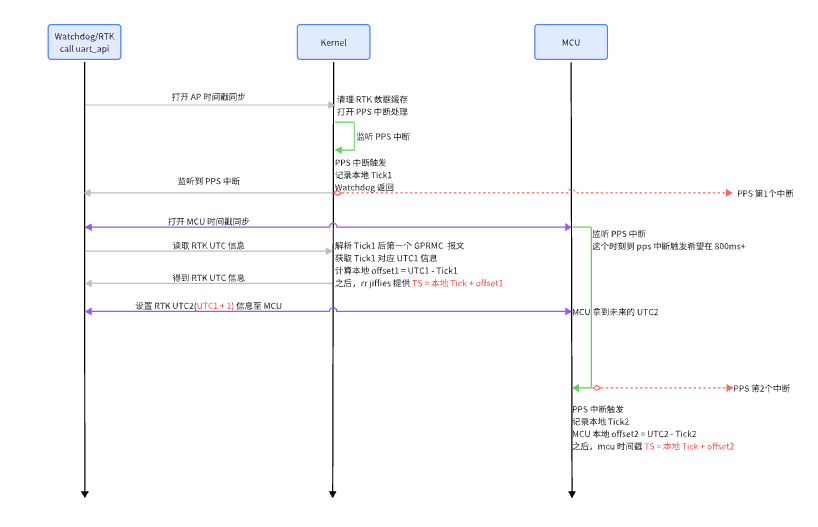
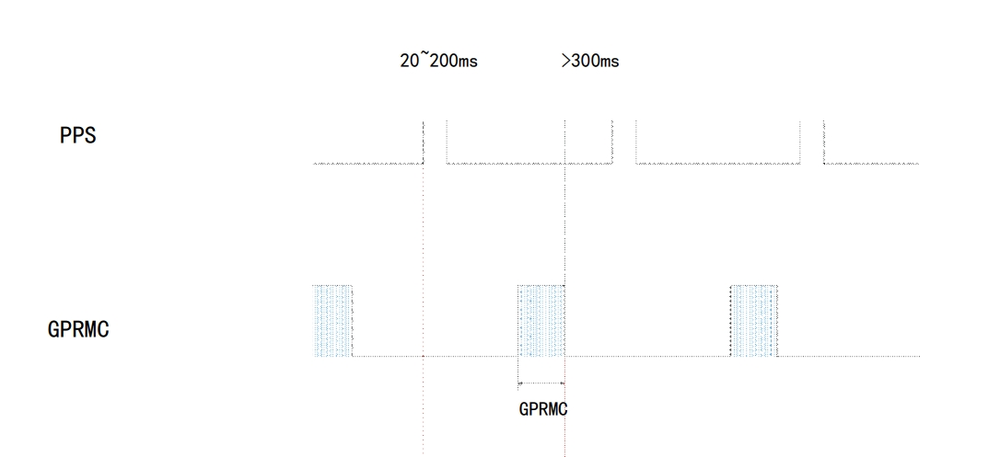
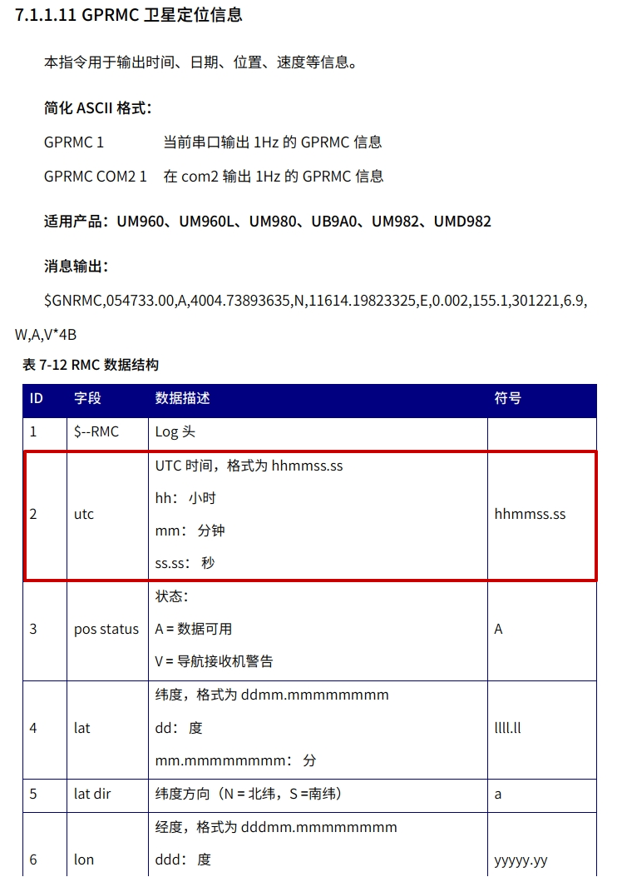
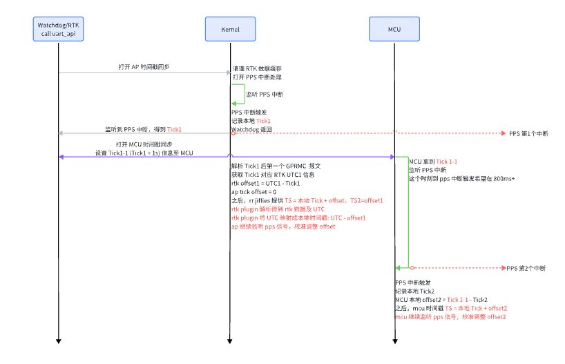
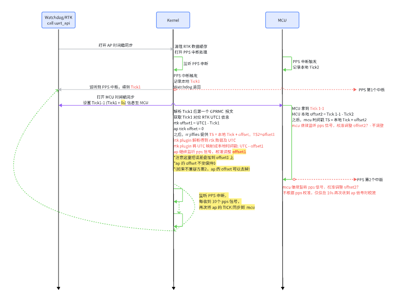
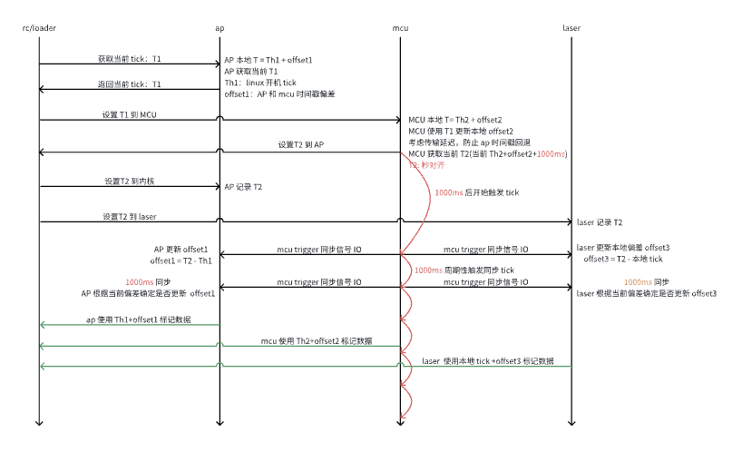
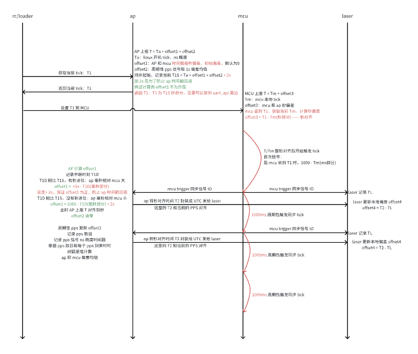
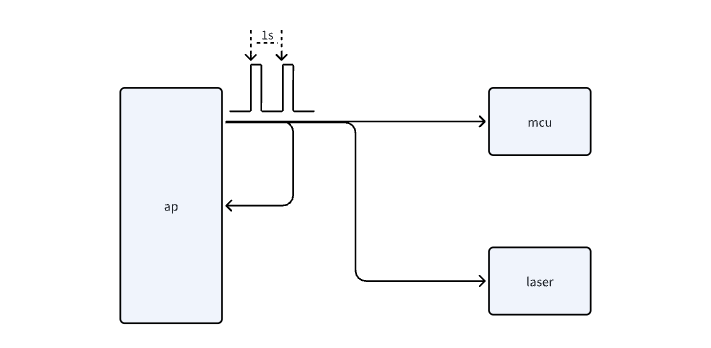
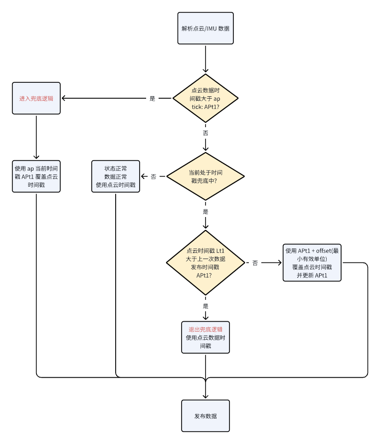

# 割草机时间戳同步方案设计

# 1. RTK 割草机

ap + mcu + rtk

## 1.1 方案1 (×)

**GPRMC&#x20;**&#x62A5;文 1hz

GPS 模块连续向产品发送 GPRMC 数据和 PPS 同步脉冲信号，PPS 同步脉冲长度为 20 \~ 200 ms，GPRMC 数据必须在同步脉冲 500 ms 内完成

AP 和 MCU 的时间戳，都同步到这个 UTC 上，不更新系统 UTC 时间

1. 大体流程参考图示，需要注意的是

   1. AP offset 的计算基于第一个 pps 信号，必须抓取 PPS 信号后的第一个GPRMC 报文，解析 UTC

   2. MCU offset 的计算基于第二个 pps 信号，所以 MCU  对齐 AP 抓取的 UTC + 1s

   3. AP 必须在使能 mcu 监听 pps 信号之后的 1s 内将 UTC + 1 给到 mcu&#x20;

   4. 时间戳 base 更新到 rtk utc 之后，各个模块根据 pps 信号，做 1s 校准

   5. 严格来讲两个 pps 的时间差是 1s，如果和本地的 ms 累加误差超过 10ms，大概率 pps 信号有干扰

2. 假如机器在无卫星信号的开机，需要 rtk plugin 在合适的时机完成时间戳同步

   1. 或者 RTK 机器的时间戳同步完全交给 rtk plugin 负责

3. 本方案在 rtk 信号丢失，开始清扫时，整机后退1m 的过程中，假如收到 rtk 信号，会发生时间戳跳变

## 1.2 方案2 (X)

本方案重点解决 方案1 的时间戳跳变以及从没有卫星数据到有卫星数据，时间戳同步前的的时间内，数据融合问题

遗留工作项：如果长时间未搜到卫星信号，pps 的信号输出，是否依赖本地时钟？本地时钟的误差是多少？有卫星信号后，是否会修正 pps 的信号输出？

## 1.3 方案3 (√)-去掉 ap offset，误差叠加到 rtk offset1

**方案2缺点：**

1、 没有RTK信号的时候 mcu和AP无法同步？

如果一开机RTK就没信号，那么ap 和mcu的时间差别比较大，一直不同步，上层算法会有问题。

**方案3特点：**

1、RTK和mcu都把时间同步到AP，AP自己的时间不动。

2、AP和mcu的同步 与 AP和RTK的同步毫无关系，完全解耦。

2、利用pps信号中断作为同步时机。

**AP和MCU对于pps信号的滤波方法：**

1. 每次pps中断记录一下当前时间 cur\_time = get\_time()

2. 下一次中断中， 判断当前时间和last\_time 是否大于995ms

3. 如果大于995ms ， 则认为是有效的pps信号。 last\_time =  cur\_time

4. 如果小于995ms，则认为是干扰，滤除。不更新last time

**AP和MCU同步流程：**

1、AP端：

自己数pps信号，每间隔n秒，向mcu发送一个报文。

报文内容为ap当前时刻的时间，记为 tick\_ap = get\_time();

2、mcu端：

1. 每个有效的pps信号中都记录自己本地的时间，记为tick\_mcu = get\_time();

2. 当收到AP报文后，记录 offset = tick\_ap - tick\_mcu  （必须保证在1s内收到ap的报文，如果1s收不到会有问题）

3. 发布数据的时间戳 ts = get\_time() + offset

4. 继续监听pps中断，重复 a 和b的操作，每次同步都强制更新offse即可。

**AP和RTK同步流程（只需要ap端操作）：**

AP端：

1. 自己数pps信号，每间隔n秒，记录自己当前的时间 tick\_ap = get\_time();

2. 同时，解析一次对应上述秒的GPRMC报文，得到报文中的UTC时间，记为utc

3. 设置offset1 =  utc - tick\_ap

4. RTK的UTC时间转到 ap时间   rtk\_ap = rtk\_utc  - offset

5. AP当前的时间转到UTC时间   ap\_utc = get\_time() + offset1

6. AP上所有数据的时间戳正常发布即可，无需任何调整。

**时间同步放羊监控指标：**

1. mcu侧：当前offset - last\_offset > 10ms , 则打印一行error日志&#x20;

2. AP侧/中间层：当前offset1 - last\_offset1 > 10ms, 则打印一行error日志

3. 对于gyroodo报文：统计量 time\_diff = ap\_time - mcu\_time

   1. time\_diff 均值 小于等&#x4E8E;**&#x20;3ms**为正常

   2. time\_diff 所有数据均小于等于**20ms**为正常

4. 对于gyroodo报文：统计量 mcu\_time\_interval = mcu\_time - last mcu\_time

   1. mcu\_time\_interval 均值在**17ms ～ 23ms&#x20;**（闭区间）之间为正常

   2. mcu\_time\_interval 所有数据均小于 **50ms** 为正常

5. 对于RTK报文： 统计量 rtk\_time\_interval = rtk\_time - last rtk\_time

   1. rtk\_time\_interval 均值在**98ms ～ 102ms&#x20;**（闭区间）之间为正常

   2. rtk\_time\_interval 所有数据均小于 **105ms** 为正常

6. 对于RTK报文： 统计量 rtk\_delay\_time = abs（rtk\_time - 最近的imu\_time）

   1. rtk\_delay\_time的均值小于 **130ms**

   2. rtk\_delay\_time的所有数据均小于 **160ms**

# 2. 雷达割草机

ap + mcu + laser

## 1.1 方案1(X)

## 1.2 方案2(√)-简化

1. Mcu 异常复位时，ap 需要重新和 mcu 同步时间戳，

   1. 此刻 offset1 和 offset4 不为0，pps 对齐时，ap 时间戳不可回退

   2. 因此，发给 mcu 的 tick，需要加上 offset1 和 offset4

   3. 计算 offset1 时，offset4 清零

2. Ap 异常时，不管是进程异常，还是系统异常，offset1 和 offset4 均可清零

## **1.2 方案3(√)-B2**

1. Ap 发出 pwm 波形

2. Pwm 同时连接 ap，mcu，laser

3. Ap 收到 pwm 中断后，获取当前的 tick，理论上 ap 侧两个 pps 绝对 1s，不该有偏差

   1. 将毫秒精度精度时间给 mcu(也可以10s同步一次)

   2. 取 tick 秒精度时间，转 utc 给 laser，并且记录 laser 的毫秒偏差 offset

4. 收到 laser 数据后，加上毫秒偏差 offset

5. **雷达断流/时间戳回退：lidar 没对纹波做过滤，触发断流/时间戳回退，对于时间戳回退的处理方式**

   1. Lidar plugin 解析 lidar 和 imu 的数据，同时获取 ap 的 APt1

      1. 如果 lidar 的时间戳 Lt1 大于 APt1，则说明 lidar 发生向未来的跳变

         1. 跳变偏差比较小，小于传输误差时，这里会误判

      2. Lidar 发布数据时，使用 ap 的 APt1

         1. 此时 APt1 一定大于 plugin 上次发布的数据时间戳

   2. 时间戳同步正常后，lidar 的时间戳恢复正常

      1. lidar 的时间戳 Lt2 小于 ap 的 APt2

         1. 因为有传输时延

      2. 之前的周期内，ap 使用自身的 APt1 覆盖了点云数据的时间戳

         1. 如果 Lt2 大于 APt1，plugin 直接使用 Lt2 发布数据

         2. 否则 LT2f = (APt1 - Lt2) / 2，plugin 直接使用 Lt2 发布数据

   

