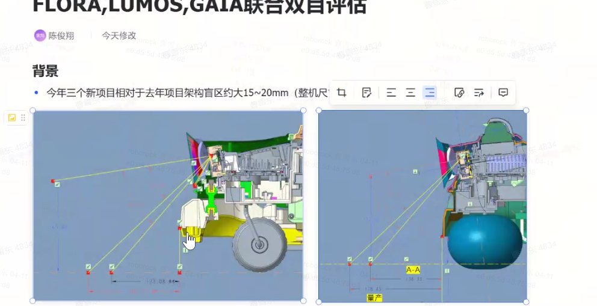
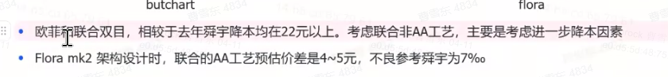
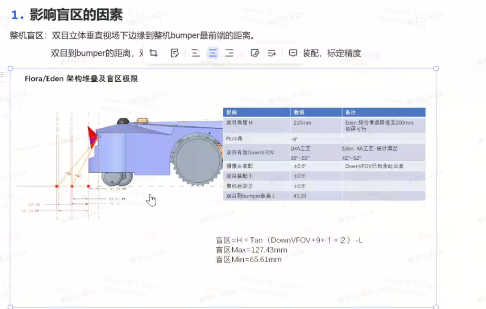
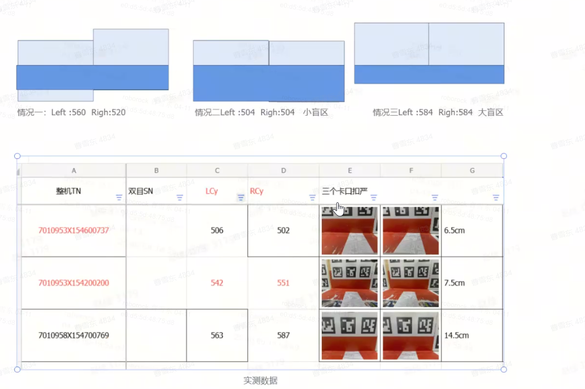
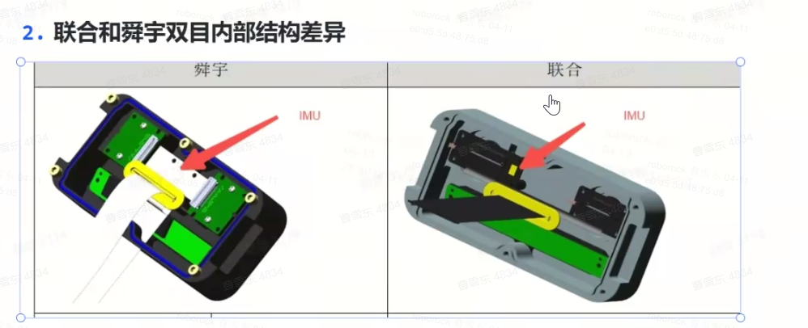

# 双目盲区软件必须15cm以下的诉求理论分析

# **背景：**

**联合**工艺受供应和价格影响，可能达不到盲区15cm以内的软件诉求。

MK2会有联合aa工艺（盲区小于15cm）和联合非aa（盲区大于15cm）工艺两种样品，需要对比测试下盲区对软件的影响。

# 0331结论：

软件领域：不接受盲区大于15cm，导航栅格精度为5cm，大于15cm则软件盲区达到20cm。其他领域 产品、TPM、结构、电子等 需要 搜集评估。

# 理论原因分析汇总

| **领域** | **必须15cm以内的原因**                                                                                                                                                     | **备注**            |
| ------ | ------------------------------------------------------------------------------------------------------------------------------------------------------------------- | ----------------- |
| 导航     | 导航这边很多功能会受到影响，安全策略，自主延边贴边距离，避障障碍物附近漏割，跌落检测等。安全性，覆盖率，避障效果对盲区的需求都是越小越好。                                                                                               |                   |
| 感知     | 感知目前对双目之前测试看盲区接近即可，相机的ISP和图像质量需要一致，影响模型输出，雷达盲区（这个我们在看童脚测试数据评估）大于15cm，对地15cm-20cm的差值部分感知看不到，会影响避障，但是影响不是很巨大（目前15cm盲区向上拆切，下面盲区不大），需要实际的20cm盲区样品测试评估 ，测试采集数据图像效果和避障效果  |                   |
| 定位     | 定位对盲区小于多少阈值没有需求。定位要求双目安装 pitch < 9º，高度 > 20cm。原因是减少前盖+草地在图像中的面积，更多看到远处的建筑，有利于于定位，反之，大面积草地，视觉无法定位。 （和减少盲区的需求相反，之前安装的角度和高度已经是权衡的结果）                                   | 盲区扩大20cm，对定位没有影响  |
| SE     | 主要是导航的安全相关功能强依赖于盲区，当前关注的机器压脚问题、悬崖安全问题等均需要依赖近距离障碍物检测                                                                                                                 |                   |
| SPM    |                                                                                                                                                                     |                   |

# **测试场景搜集：**

| **领域** | **测试场景** | **测试计划&#x20;** | **研发分析结论** |
| ------ | -------- | -------------- | ---------- |
| 导航     |          |                |            |
| 定位     |          |                |            |
|        |          |                |            |

