# 联合OC及盲区管控

# 1. 影响盲区的因素

整机盲区：双目立体垂直视场下边缘到整机bumper最前端的距离。

&#x20;              双目到bumper的距离，双目高度，双目pitch角，双目立体视场角，装配，标定精度

对于模组厂来说，影响因素是双目立体视场角，单模组OC精度和左右目搭配&#x20;

（原始分辨率1280\*1080，OC：640，544）

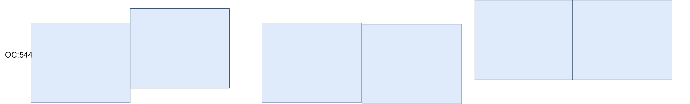

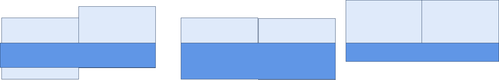

# 2. 联合和舜宇双目内部结构差异

# 3. 联合和舜宇生产数据

## 3.1 联合2026.1.23批次

第一批次生产数据OC分布，左目基本在544以下，右目在544以上，但是对于量产工艺来说，单模组Cy分布范围在±40pixel，即108um。 均值并未分布在中心（L：533, R：554）接近情况一

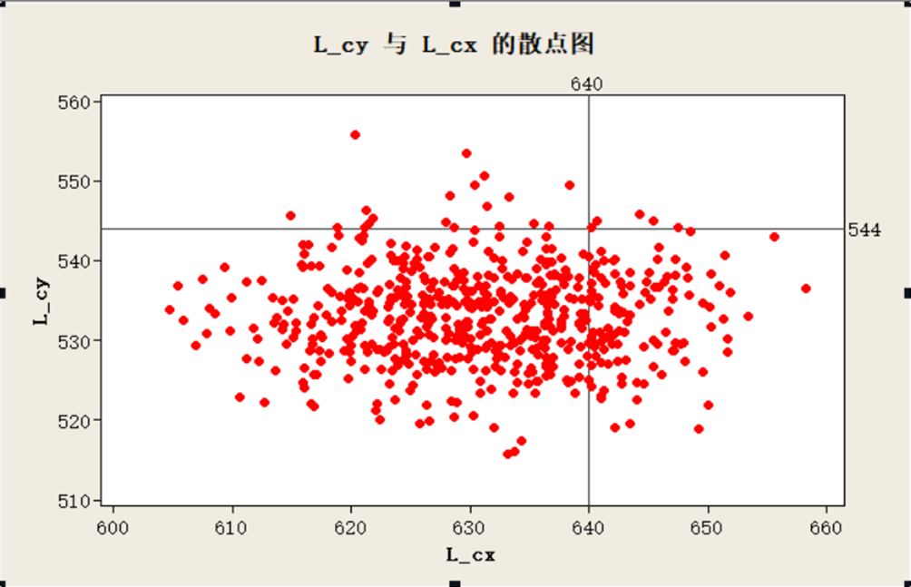

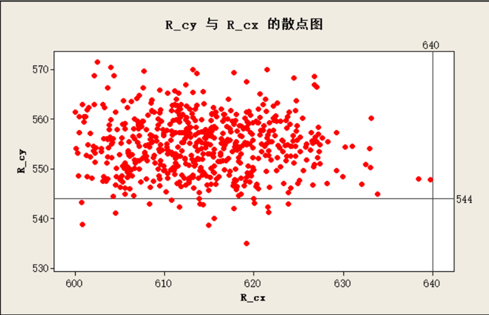

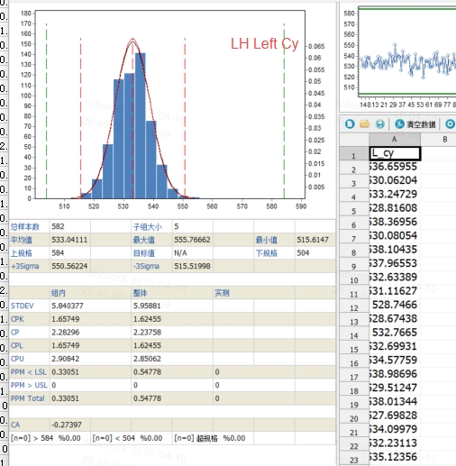

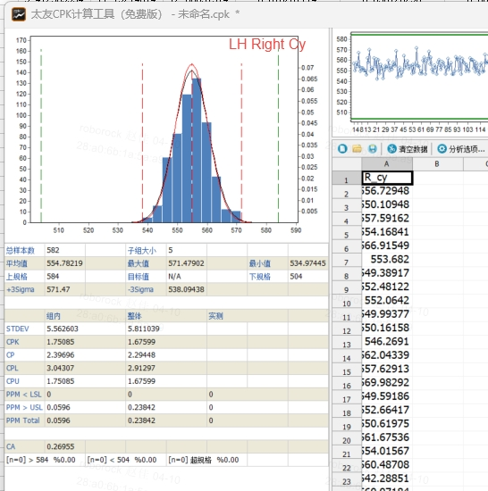

整机versa装机300pcs 盲区统计数据如下，门限0.15  最大值0.11，CPK=3.15

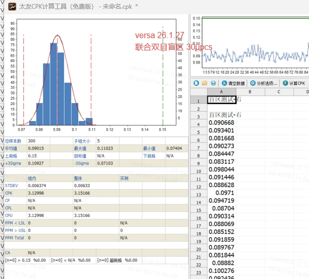

## 3.2 联合 2026.4.9 批次  (596PCS)  重新挑选golden 点检单模组OC

L:522  R:551

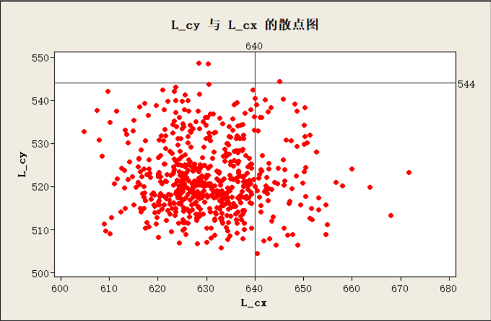

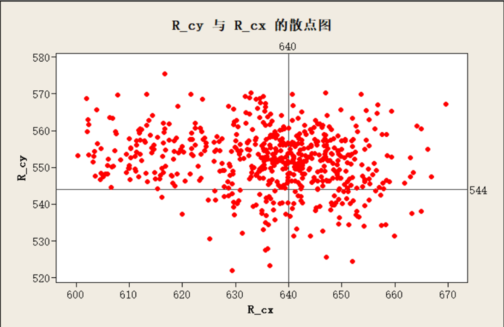

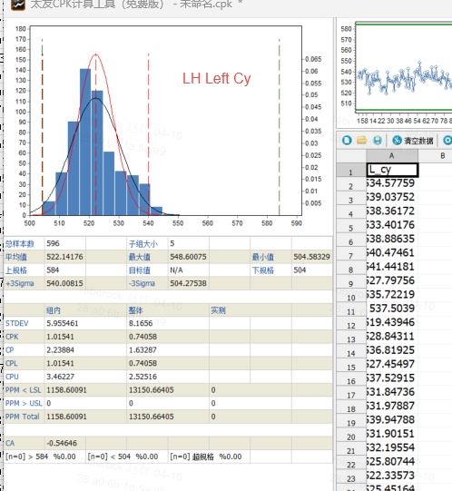

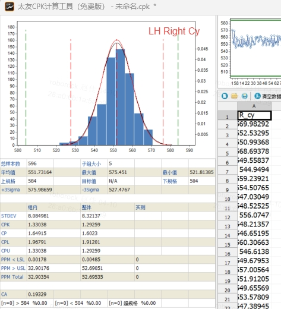

计划4.14/4.15 上整机monet 会有整机数据

# &#x20;

## 3.3 舜宇  量产 1991pcs

左右目相同，数据分布一致，且平均值居中&#x20;

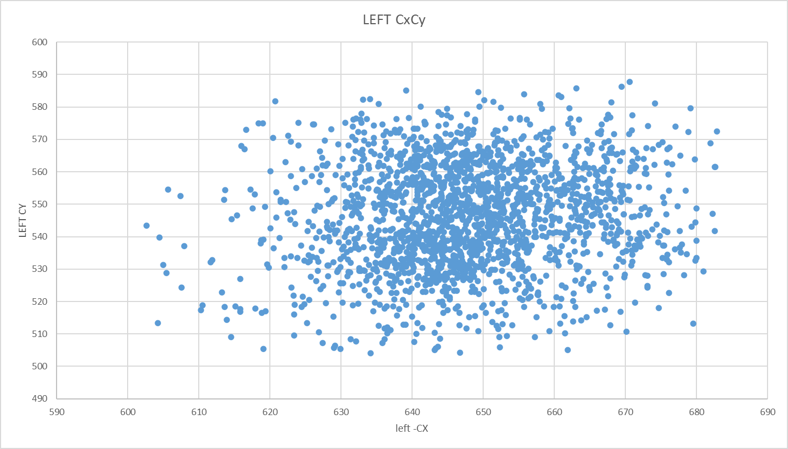

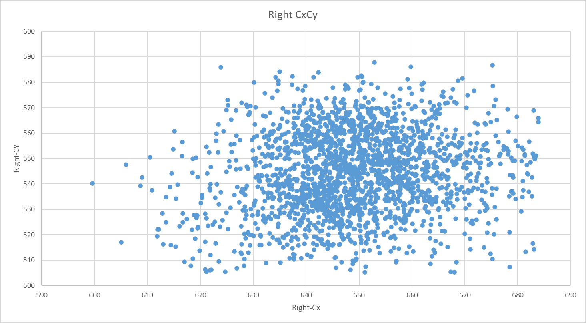

L:546  R :544

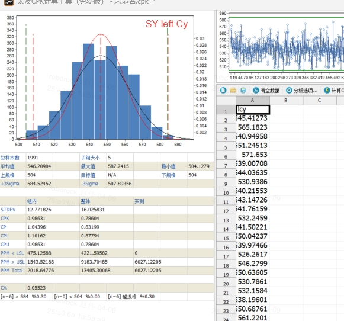

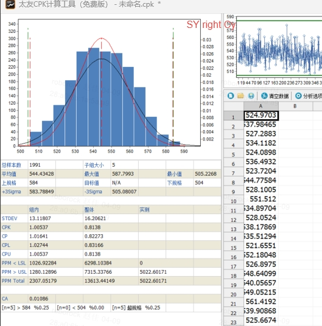

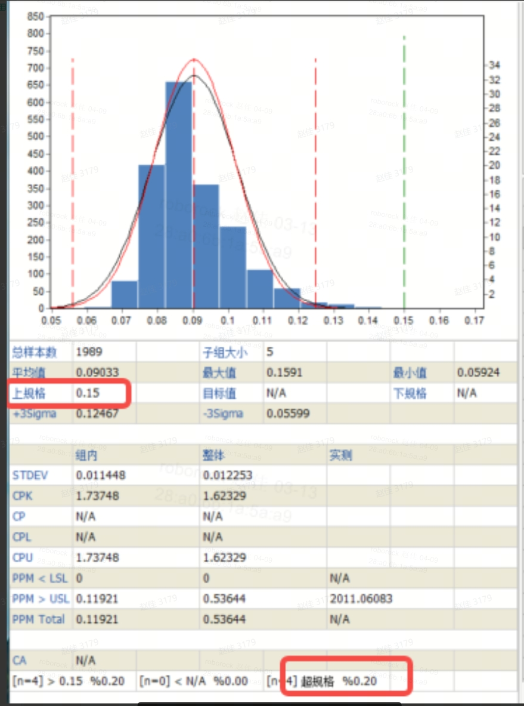

|                          | 样本量  | OC       | 平均值       |
| ------------------------ | ---- | -------- | --------- |
| 联合第一批次                   | 582  | Left Cy  | 533.04111 |
|                          |      | Rigt Cy  | 554.78219 |
| 联合第二批次（重新挑选golden模组点检OC） | 596  | Left Cy  | 522.14176 |
|                          |      | Right Cy | 551.73164 |
| 舜宇量产                     | 1991 | Left Cy  | 546.20904 |
|                          |      | Right Cy | 554.78219 |

# 4. 结论

以上，联合量产双目工艺，左右目结构约束，并不能共用治具和机台，导致左右目数据不一致，加上联合厂内制程管控因素，且左右目搭配随机，盲区会有批量不良风险。
