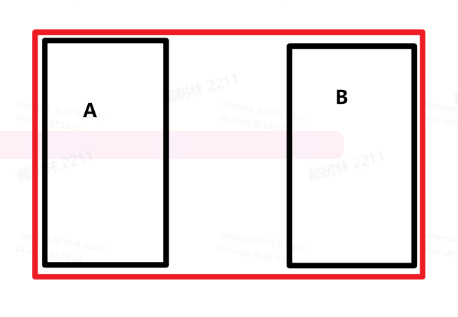
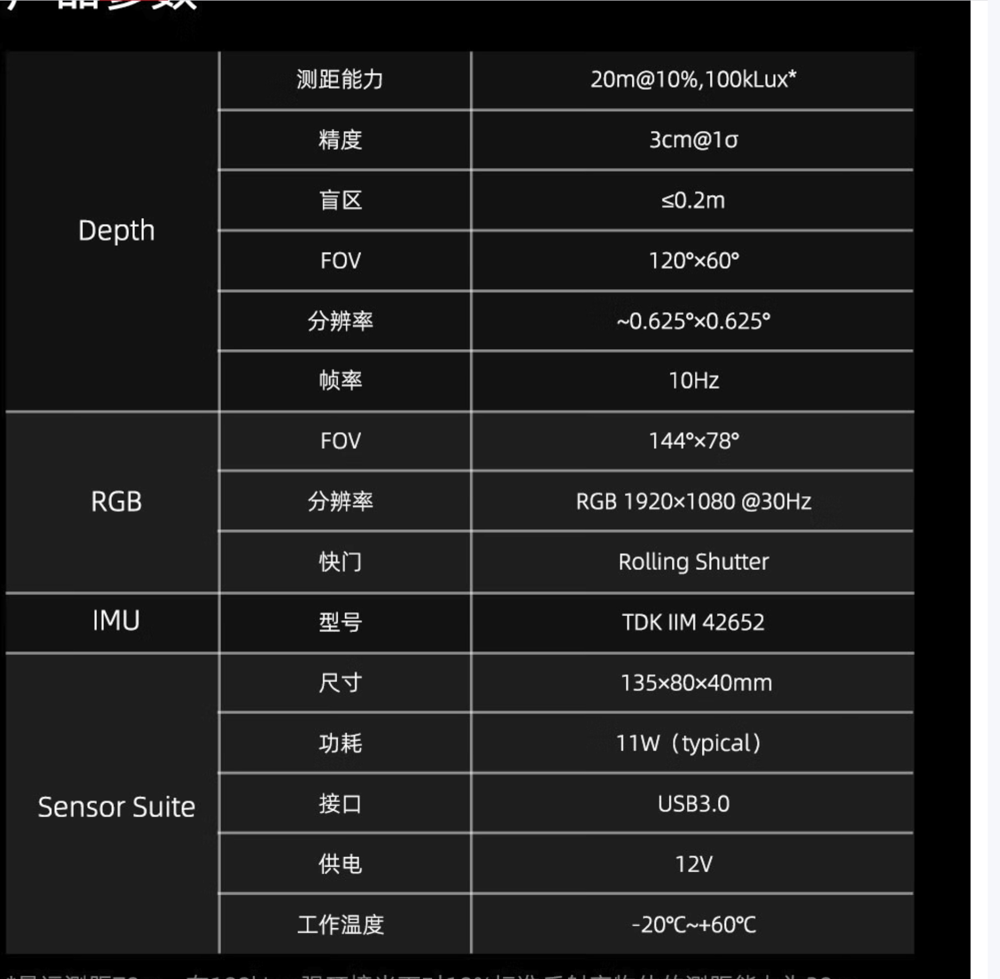
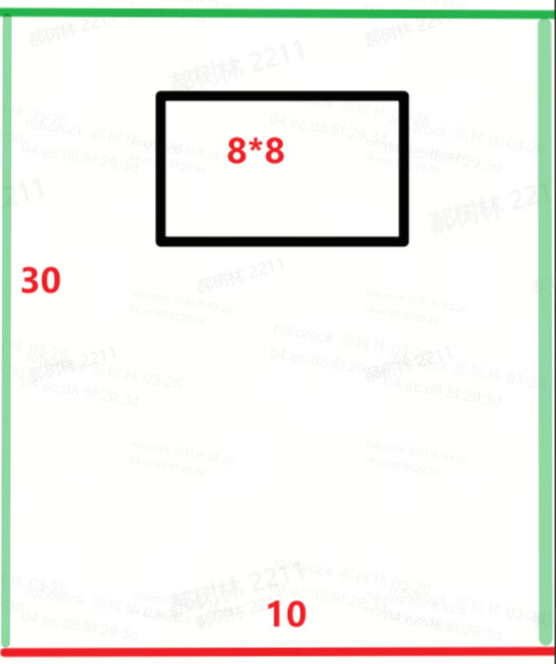
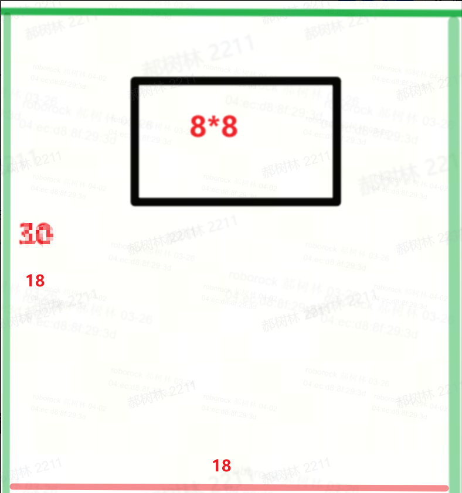
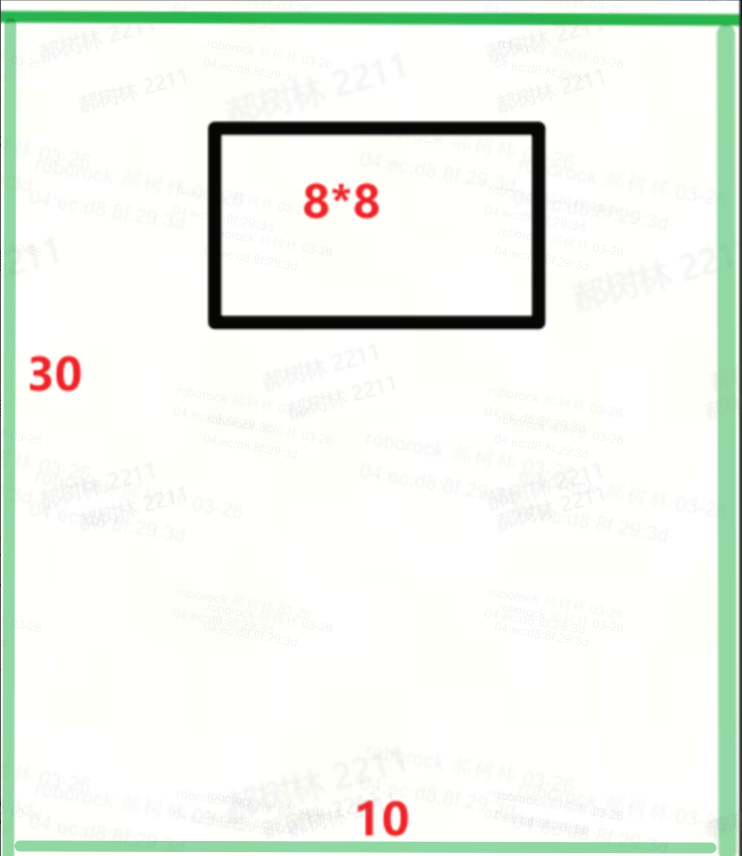
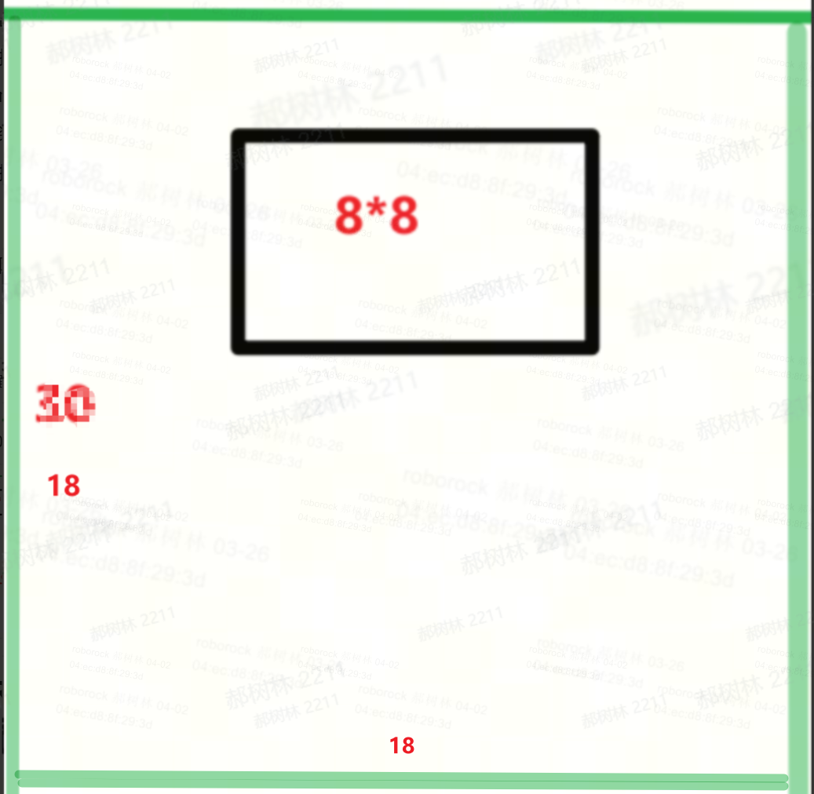

# 割草机-小场地光电方案预研（双目/RGBD）

# 1、市场情况

&#x20; 公司小场地机型空白，友商相关产品有一定出货量；

# 2、产品需求

## 2.1 覆盖场景

### 2.1.1 场景大小

300平方米以内（按照正方形场地）；2000平米以上有降本需求；

Ⅰ、完全封闭的园子，外边界为花圃、树木、篱笆（slam有效边界）等；

Ⅱ、半开放园子，3面边界清晰（边界对标Ⅰ），正前方空旷，直接连接道路；

Ⅲ、长宽比：1：1\~1：1.5；

### 2.1.2 边界识别

评估当前传感方案能解决哪些边界场景（已知可解决明确边界，当前雷达和RTK方案，通过遥控和视觉自主识别定义边界）；**TOF先按照120\*60评估；**

### 2.1.3 跨区域工作

至少覆盖两个区域；面积外围红框面积300平方米；

### 2.1.4 识别需求

区分边界；沿边和障碍物避障策略；

### 2.1.5 规划切割

弓字形割草路径（目标：雷达方案效果，**实际对标纯视觉**）；

理论评估，效果差于360°雷达，需实际导航策略优化，实测对比；

## 2.2 成本区间

较当前方案（雷达+双目）降本1/3\~1/2；区间为200\~300RMB；

## 2.3 性能指标

### 2.3.1 Slam 待摸底

* HFOV：120°      VFOV：60°

* 水平角分辨率： 0.5°

* 垂直角分辨率：0.5° （靠下部分（下面30度）的分辨率尽可能高一点 0.5°，兼顾避障需求。 靠上的位置分辨率可以适当变低，例如1°）

* 量程：30m （10% 反射率）

* 准度： ±5cm以内

* 精度（波动）：3cm  1sigma

* 帧率： 5\~10hz

其他：

1. HDR场景无问题

2. 强光场景（光照在障碍物上，光照在lens上两种情况）无问题

3. 树木树叶成像清晰无拖影

### 2.3.2 避障  **待更新**

* 分辨率：640\*480（双目分辨率，正在调整）

* 量程：1m，最小80cm；

* FOV

  * 水平FOV先保证覆盖1.5倍机身吧，具体角度我还真没算过

  * 竖直FOV得能看到机身前方10cm地面及机身高度+20cm的高度

* 帧率：7.5hz

* ±1cm@50cm

* **另：**

  * 强光场景需表现OK

  * 黑色物体，如地埋喷头，要正常测量

  * 噪声表现要ok

  * 雨水、粉尘、遮挡depth的效果需要明确

# 3、双目/RGBD效果实测对比

## 3.1 目的

Ⅰ、初步摸测双目和RGBD的定位效果；

Ⅱ、摸底RGBD的性能指标下限（量程，角度分辨率）；

## 3.2 摸测模组/整机

### 3.2.1 双目

以当前已发布的mova viax机器，做为双目的对比组；

### 3.2.2 RGB—D

Ⅰ、采用速腾AC1的TOF模组， 本身配置RGB，集成IMU于一体，可用于手动收集数据；

Ⅱ、通过降低TX功率，从而减少量程，实现8m/12m/15m@10%反射率的量程验证；

## 3.3 数据采集

### 3.3.1 数据采集类型

Ⅰ、双目通过mova viax，进行场景的建图和slam定位测试，全程视频录制；

**测试要求**

* 每个场景都建图一次，割草两次（光照条件好的时候一次， 黄昏或者日落后一次）

* 不对桩的位置有要求

* 【额外测试】布置两个小场景，中间用一个窄通道连接（测试两次，光照好和光照不好的时候各一次）

  * 建完A区域后，继续建立B区域以及通道

  * 机器在AB区域完成割草

**输出要求**

* 提供建图和割草的监控视频

* 提供建图和割草app上的录屏

* 最终的割草记录截屏

* 中间出了任何问题需要记录（例如无法回桩， 无法正常通过通道等）；

Ⅱ、RGBD通过仿割草机安装高度，同步收集深度/RGB图/IMU数据（ros\_bag包）；

①、输出数据采集的运动轨迹方式；&#x20;

②、数据收集为ros\_bag1（不能丢包，如果有丢包现象，RGB可以不录）；&#x20;

③、camera内参、传感器的外参标定并提供；&#x20;

④、安装位置尽量对标割草机安装位置；&#x20;

⑤、数据同步感知，确认数据质量；&#x20;

### 3.3.2 收集场景

#### 双目

#### **RGBD**

基于受限观测RGBD模组和双目模组方案的局限性，对以下场景进行数据收集验证：

| **场景1**                                                                             | **场景2**                                                                             | **场景3**                                                                             | **场景4**                                                                             | **场景5** | **备注**                                   |
| ----------------------------------------------------------------------------------- | ----------------------------------------------------------------------------------- | ----------------------------------------------------------------------------------- | ----------------------------------------------------------------------------------- | ------- | ---------------------------------------- |
| ①、3面围墙；②、30\*10m                                                                    | ①、3面围墙；②、18\*18m                                                                    | ①、4面围墙；②、30\*10m                                                                    | ①、4面围墙；②、18\*18m                                                                    | 随机小场地   | 优先采集场景1/场景3                              |
|  |  |  |  |         | 1、红色表示无墙边界；2、黑色表示房屋边界；3、绿色表示有效墙面（栅栏，篱笆）； |

分别用速腾模组的8m，12m, 15m量程版本，对以上五个场景进行数据采集；角度分辨率摸底，可以仿真时软件实现；

数据采集格式及分类见云文档：[ 割草机RGBD数据采集表](https://roborock.feishu.cn/wiki/NaxUwrkQhiMkxwkQdBcclXLOnuf?sheet=921f6d)

备注：由于数据量大，三个量程版本中，一个轨迹是随机抽取其中两个进行采集；且只有a1,c带RGB图像；

bag包路径：https://roborock.feishu.cn/drive/folder/LTiNf1wYIlN659dajKbcAQUPn8d

## 3.4 数据分析

## 3.5 对比结论

# 4、RGB-D方案-参数定版

# 5、模组开发计划

