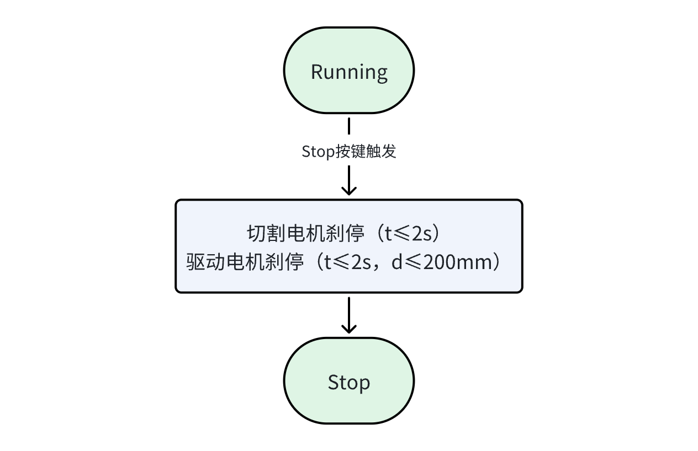
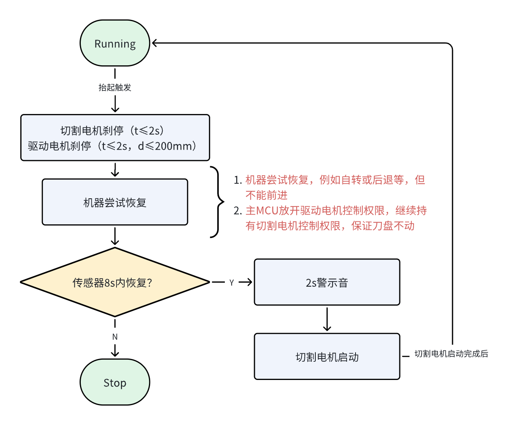
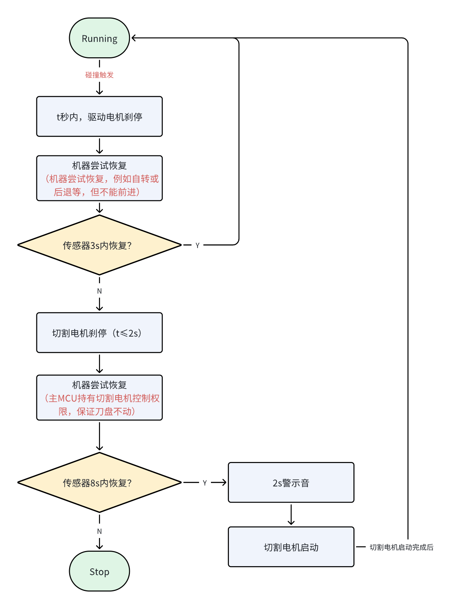
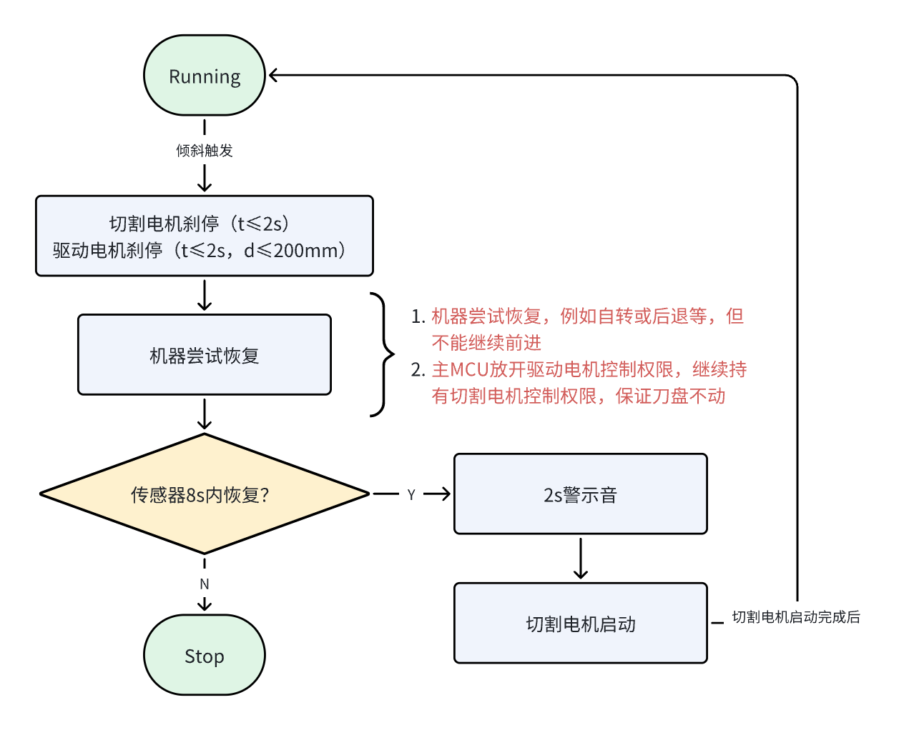
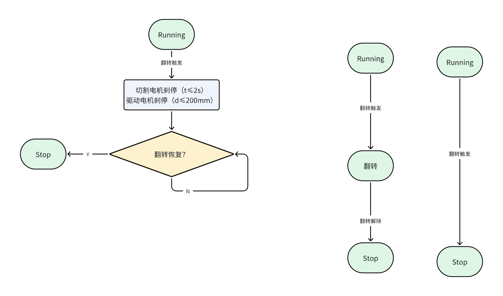
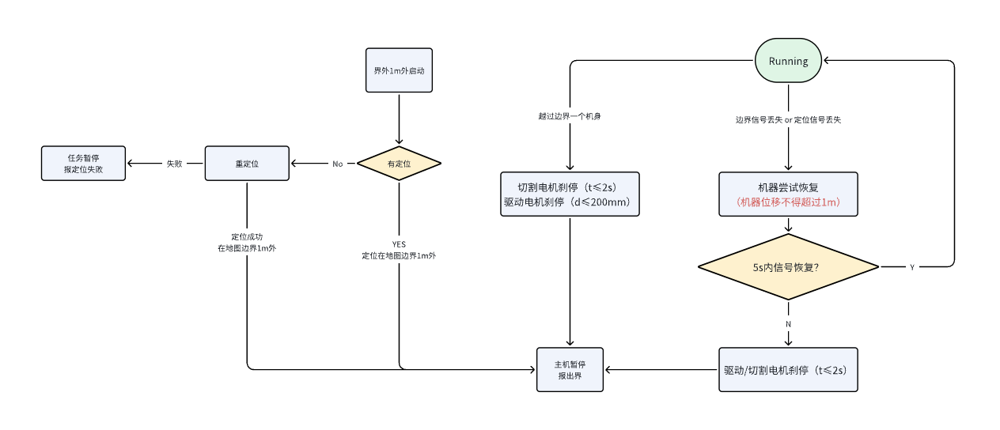
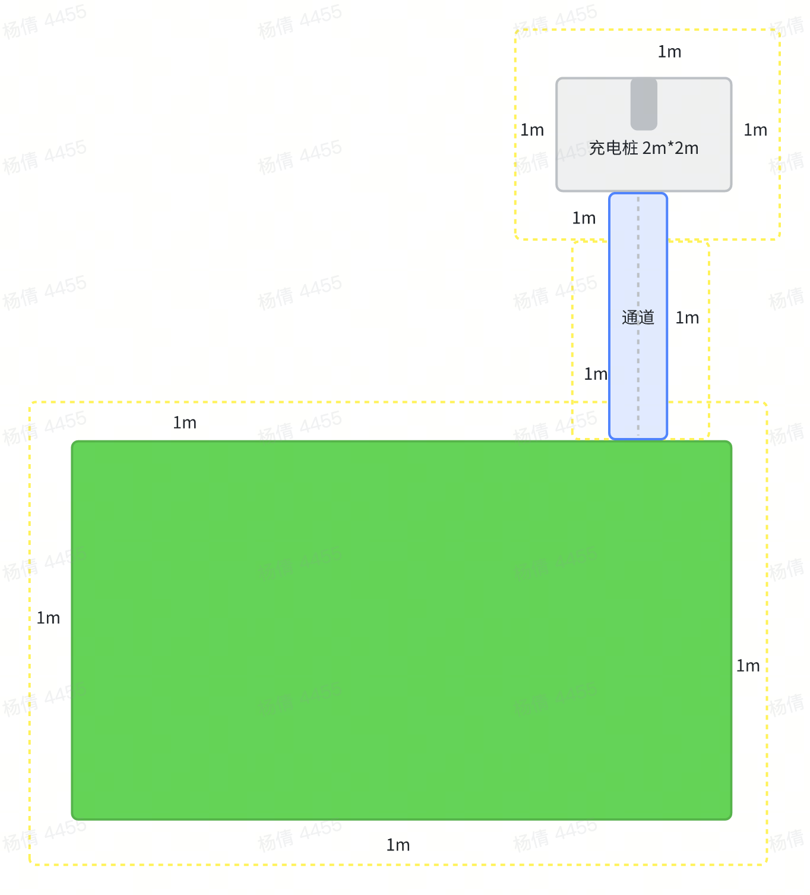

# 智能割草机安规策略功能

# 1. Stop按键

* Stop按键优先级高于其他任何控制

### 1.1 **安规需求：**

* Stop按键作为割草机器人的紧急停止按键，其优先级高于任何割草机自主行为和其他控制动作。

* 当Stop按键被按下后，除了整机屏幕按键的“Mow+OK”和“Home+OK”组合按键，以及将割草机手动放置至充电站以外，其余任何操作都不允许割草机启动工作。

### 1.2 **核心需求参数指标：**

| 目标       | 关键指标                          |
| -------- | ----------------------------- |
| 切割刀盘快速响应 | 从Stop触发至切割点击刹停，时间≤2s          |
| 驱动系统快速响应 | 从Stop触发至驱动点击刹停，时间≤2s，距离≤200mm |

### 1.3 **触发逻辑：**

# 2. 抬起

### 2.1 **安规需求：**

* 机器放置在坚硬、光滑的水平表面上。通过机器外壳的任何部分（地面接触部分除外）以均匀的水平方式垂直于表面提升机器。提升速率为（20±10）mm/s。当所有地面接触部件与表面失去接触并且最低地面接触部分距离表面不超过 10 毫米时，抬起触发

* 机器放置在坚硬、光滑的水平表面上。通过机器外壳的任何部分（地面接触部分除外）上的单点提升机器。提升速率为（100±20）mm/s。当至少一个地面接触部件与表面失去接触并且最高地面接触部分距离表面不超过 300 毫米时，抬起触发

* 抬起传感器单轮触发，安规不做处理

* 抬起双轮触发持续xms（防抖）后（触发防抖），切割电机及驱动电机刹停（满足反应时间≤2s，刹车距离小于200mm）

* 切割电机，驱动电机刹停后，主机尝试恢复，8s内传感器恢复，继续割草

### 2.2 **核心需求参数指标：**

| 目标       | 关键指标                          |
| -------- | ----------------------------- |
| 切割刀盘快速响应 | 从Stop触发至切割点击刹停，时间≤2s          |
| 驱动系统快速响应 | 从Stop触发至驱动点击刹停，时间≤2s，距离≤200mm |
| 可自主恢复时间  | 在8s内抬起传感器若恢复，割草机可继续割草         |

### 2.3 **触发逻辑**

# 3. 障碍物（bumper，8S)

### 3.1 安规需求：

* 在所有的运行方向和位置上，传感器都会处于活跃状态且能发挥预期作用，除非在该方向上：

  * 切割装置不运行且运行距离 D ≤ 2\*机身长

  * 切割装置运行且运行距离 D ≤ 行进方向上的前边缘至最近的刀尖缘的距离

* 机器撞击障碍物时，最大动能为5 J，最大力 F，50N ≤ F ≤ 260N（0\~0.5s），50N ≤ F ≤ 130N（＞0.5s）

* 碰撞持续触发xms（防抖）后，驱动电机刹停时间：t = D/v，D 是行进方向上的前边缘至最近的刀尖缘的距离，v 是机器接近时的速度

### 3.2 核心需求参数指标：

| 目标    | 关键指标                                          |
| ----- | --------------------------------------------- |
| 最大动能  | ≤5J                                           |
| 最大撞击力 | 50N ≤ F ≤ 260N（0\~0.5s），50N ≤ F ≤ 130N（＞0.5s） |
| 刹停时间  | t=D/v（根据各产品进行计算）                              |

### 3.3 触发逻辑：

* 若需要依赖减速来满足最大冲击力的要求，可以允许附加非接触传感器，前提是必须可以对具有以下特点的刚性非金属目标有相应：

  * 圆柱形

  * 直径70±2mm，高400±5mm，直立

  * 颜色或阴影与背景相匹配

  * 归一化环境温度

  或者，非接触传感器满足障碍物传感器的要求，前提是必须可以对具有以下特点的刚性非金属目标有相应：

  * 圆柱形

  * 直径25±2mm，高145-150mm，直立

  * 颜色或阴影与背景相匹配

  * 归一化环境温度

* 非接触避障功能中：

  * 检测到障碍物后，是否进行减速，需产品定义

  * 检测到障碍物且持续时长超过3s、10s时，是否需要符合上述碰撞的要求（若符合上述碰撞的要求，安规一定能过，若不符合，则TUV将通过实测和沟通来得出结论）

# 4. 倾斜

### 4.1 安规需求：

* 假设机器具有最大倾斜角度 β，倾斜触发角度应提前3°，即倾斜触发角度≤ β - 3°

* 各系列产品最大爬坡倾斜角度：

  * Butchart：34°（实际倾翻角度65°左右）

  * Butchart pro：34°（实际倾翻角度65°左右）

  * Monet：45°（实际倾翻角度70°左右，定45°是考虑39°宣称+5度陀螺仪波动）

  * Versa：45°（实际倾翻角度70°左右，定45°是考虑39°宣称+5度陀螺仪波动）

* 倾斜传感器触发持续xms（防抖）后，切割电机在2S内需刹停，驱动电机刹停（满足反应时间≤2s，刹车距离小于200mm）

### 4.2 核心需求参数指标：

| 目标       | 关键指标                           |
| -------- | ------------------------------ |
| 触发角度     | ≤ 整机最大倾角-3°                    |
| 切割刀盘快速响应 | 从Stop触发至切割点击刹停，时间≤2s           |
| 驱动系统快速响应 | 从Stop触发至驱动点击刹停，时间≤2s，距离≤200mm  |
| 可自主恢复时间  | 在8s内倾斜传感器角度若满足≤β - 3°，割草机可继续割草 |

### 4.3 触发逻辑：

# 5. 翻转

### 5.1 安规需求：

* 机器翻转持续触发2s后（这个描述不对，2S手都给切了），切割电机和驱动电机均刹停

* 整机处于翻转状态时，手动状态下也无法启动，机器必须回正后才能手动启动

### 5.2 核心需求参数指标：

| 目标       | 关键指标                 |
| -------- | -------------------- |
| 切割刀盘快速响应 | 从Stop触发至切割点击刹停，时间≤2s |
| 驱动系统快速响应 | 从Stop触发至驱动点击刹停，时间≤2s |

* 机器翻转持续触发xms（防抖）后，切割电机和驱动电机在2S内均需刹停，手动状态下也无法启动，机器必须回正后才能手动启动

### 5.3 触发逻辑：

# 6. 出边界

### 6.1 安规需求：

* 机器不得越过边界超过一个机身（整个机身处于边界外，取机身长度）

  * 机器在距离边界外≤1m的位置时，可尝试导航回地图 ,>1m 机器无法自主运行（暂停在原地）&#x20;

* 若工作区域改变，机器无法自主运动，暂停在原地（允许进入手动状态，用户自主触发）

* 若机器丢失边界信息（定位信号丢失，信号丢失的定义需要跟TUV沟通--暂定纯惯导累计行走距离阈值判定定位丢失），机器的位移不得超过1米（根据Vslam+惯导性能给出）（暂停在原地）

* 机器恢复到地图内定位后，机器自动运行，切割装置启动（2s警示音）

### 6.2 核心需求参数指标：

| 目标       | 关键指标               |
| -------- | ------------------ |
| 安规边界     | 边界位置+一个机身长度        |
| 允许运动最大边界 | 边界位置+1m（与机身长度取最大值） |
| 丢定位最大位移  | 1m                 |

### 6.3 触发逻辑：

**地图边界定义：**

# 7. 蓝牙连接

### 7.1 安规需求：

* 自动模式下，首次连接距离＜6米

* 若切割装置正在启用，遥控距离应＜6米，若不启用，遥控距离应＜20米

* 不可采用间接重传（＞蓝牙规范5.0）

* App连接需使用配对或密码解密方式

* 遥控机器运动时，切割装置不启用

* 当用户释放控制时，机器需立即停止运动

* 障碍物检测功能、边界检测功能可以停用，但其他传感器的功能应保持

* App与机器失联时间 T > 2s，驱动电机刹停（d≤200mm），切割电机刹停（t≤2s），恢复之后可重启

### 7.2 核心需求参数指标：

| 目标     | 关键指标               |
| ------ | ------------------ |
| 首次连接距离 | ＜6m                |
| 遥控距离   | 开刀＜6m，停刀＜20m       |
| 断连刹停   | 切割电机≤2s，驱动电机≤200mm |

# 补充交互说明

* 触发 **抬起&#x20;**--> 检测到xms，2 秒内停刀停轮，**语音报抬起、屏幕亮起显示LIFT**，如若8 秒内正常则继续工作，如若 8 秒没恢复转 STOP 状态，屏幕由 **LIFT-->STOP**，并**上报 APP&#x20;**&#x9519;误消息；

* 触发 **翻转&#x20;**--> 检测到xms 立即停刀停轮，并&#x8F6C;**&#x20;STOP 状态**，**语音报倾斜、屏幕STOP**，并**上报 APP&#x20;**&#x9519;误消息；

* 触发 **倾斜&#x20;**--> 检测到xms，**语音报倾斜、屏幕亮起显示 FLIP**，如若8 秒内正常则继续工作，如若 8 秒没恢复转 STOP 状态，屏幕由 **FLIP-->STOP**，并**上报 APP&#x20;**&#x9519;误消息；

* 触发 STOP，语音报 STOP、屏幕亮起显示 STOP，上报 APP。

# 8. 其他

* 2s警示音：单个连续音调或多个音调或间歇性（频率=2），发声时间t≥2s

* 手动状态下，障碍物检测功能、边界检测功能可以停用，但其他传感器的功能应保持

* RTK是否能直接接SoC？（安规功能一部分可以做在SoC，但仅限于工作区域、障碍物，上电和在桩上时做自检）

* SoC内置的MCU是否能用于安规认证（不能）

# 9. 参考文档
