# 任务概览：

1. 竞品信息收集

2. 竞品测试项目

3. 竞品拆机分析

# 竞品信息收集：

1. 主要竞对

2. 未来趋势

|            |                                                                                              |                                                               |                                                                     |                                                                             |                                                              |           |
| ---------- | -------------------------------------------------------------------------------------------- | ------------------------------------------------------------- | ------------------------------------------------------------------- | --------------------------------------------------------------------------- | ------------------------------------------------------------ | --------- |
| 品牌         | 九号                                                                                           | 松灵                                                            | 富士华                                                                 | 白马                                                                          | 九号                                                           | 九号        |
| 型号         | i215                                                                                         | Yuka mini 2                                                   | Automower® 560 EPOS®                                                | Sunseeker X9（4/30发售）                                                        | Navimow X430                                                 | i206      |
| 参考图片  | 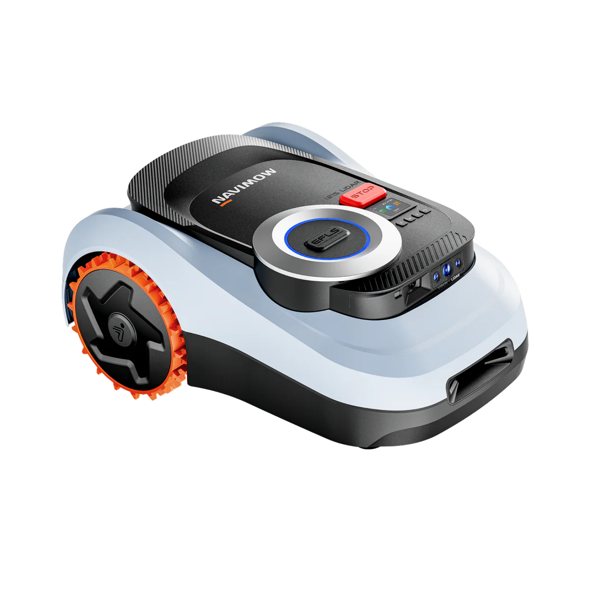                                                          | 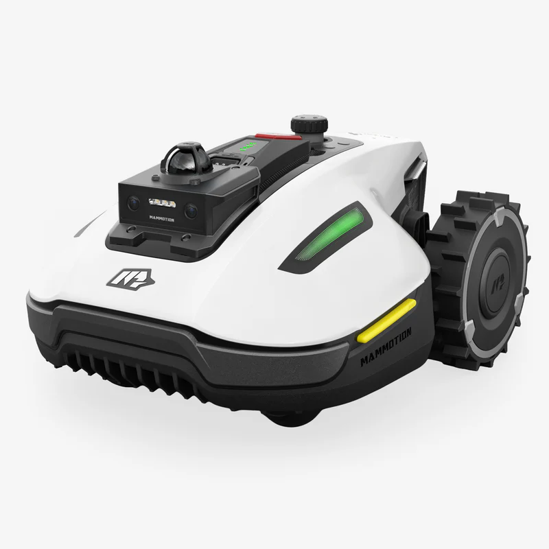                          | 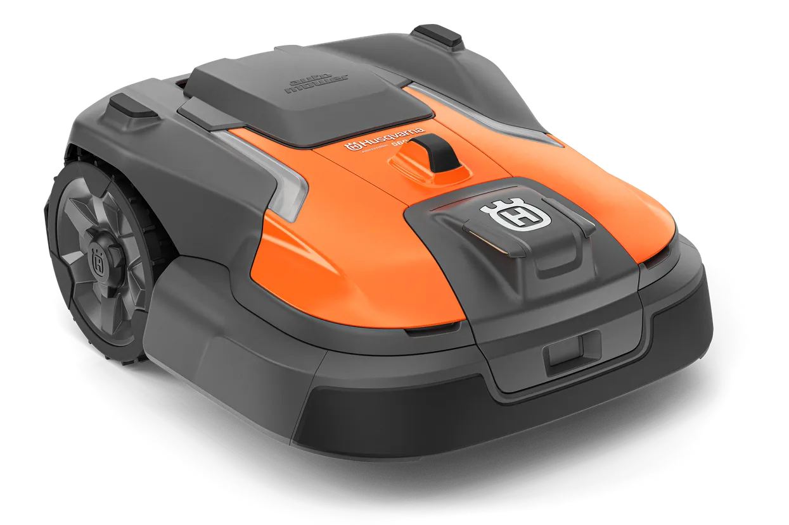                                | 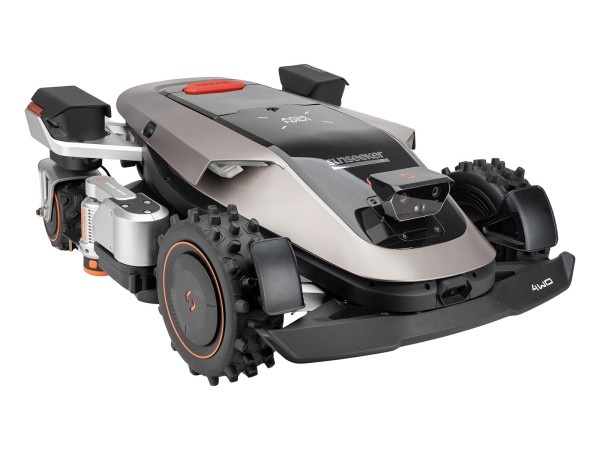                                         | 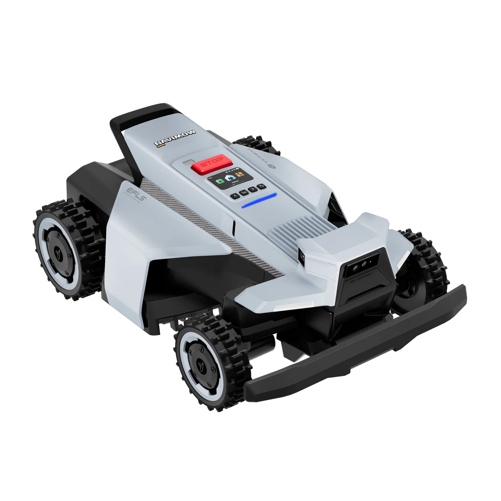                          |           |
| 参考/购买网址    | https://navimow.segway.com/products/navimow-i2-lidar-robot-lawn-mower?variant=52432620126513 | https://mammotion.com/pages/yuka-mini-2-1000-robot-lawn-mower | https://www.husqvarna.com/uk/robotic-lawn-mowers/automower-560epos/ | https://www.motorgeraete-halberstadt.de/sunseeker-maehroboter-elite-x9-plus | https://navimow.segway.com/pages/navimow-x4-robot-lawn-mower |           |
| 技术路线       | 面阵雷达+RGB-D                                                                                   | 360雷达+双目                                                      | nRTK+雷达（毫米波）/Fleet management                                       | nRTK+摄像头/打草头                                                                | nRTK+摄像头                                                     | 三轮，RTK+单目 |

#### 整体排序

&#x20; 运行稳定性：

&#x20; 切割干净程度：

&#x20; 易用性：

# 测试环境

| **场景** | **地点**                              | **链接**                                                                                                                                                                                                                                                                                                                                                                                             |                                     |
| ------ | ----------------------------------- | -------------------------------------------------------------------------------------------------------------------------------------------------------------------------------------------------------------------------------------------------------------------------------------------------------------------------------------------------------------------------------------------------- | ----------------------------------- |
| 民宿概况   | 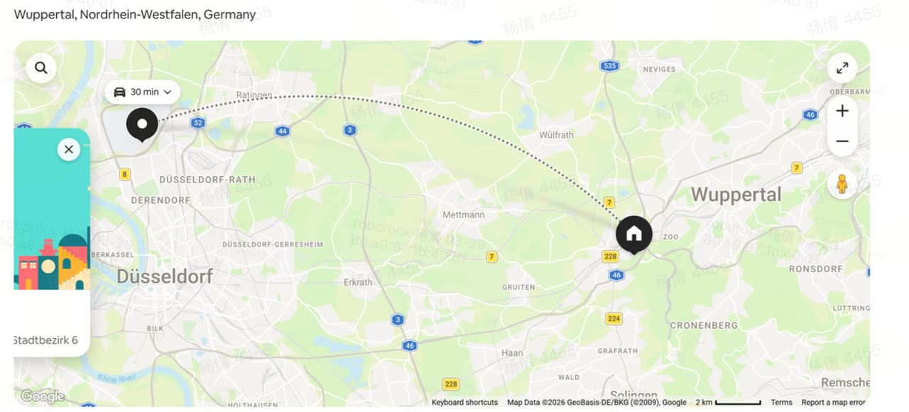 | [Airbnb: Vacation Rentals, Cabins, Beach Houses, Unique Homes & Experiences](https://www.airbnb.com/rooms/951307034382349852?adults=6\&check_in=2026-03-24\&check_out=2026-04-11\&search_mode=regular_search\&children=0\&infants=0\&pets=0\&source_impression_id=p3_1773835035_P3EiC8d0k3ZhswWY\&previous_page_section_name=1000\&federated_search_id=4ad7dc8d-5366-4ad6-877a-11929edc2ed1)  | 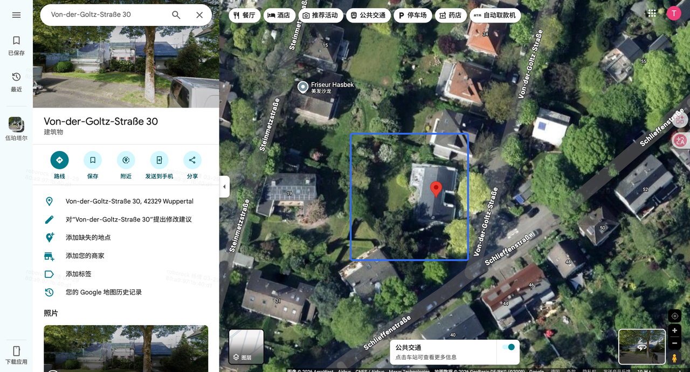 |
|        |                                     |                                                                                                                                                                                                                                                                                                                                                                                                    |                                     |

**鼹鼠打洞**

民宿没这个情况，周边环境转了一圈，也没见到有明显的洞。

# 模板

## **开箱：**

### i206

[IMG\_6918.HEIC]()

## 1. 快连

**配网与新手引导**

<table><colgroup><col width="101"><col width="140"><col width="277"><col width="277"><col width="288"></colgroup>
<thead>
<tr>
<th colspan="2">测试点</th>
<th>测试方法</th>
<th>录屏</th>
<th>说明</th>
</tr>
</thead>
<tbody>
<tr>
<td><strong>配网</strong></td>
<td>支持的配网方式</td>
<td></td>
<td></td>
<td></td>
</tr>
<tr>
<td colspan="2"><strong>安装过程</strong></td>
<td>插件的新手引导</td>
<td></td>
<td></td>
</tr>
<tr>
<td rowspan="3"><strong>信号检测</strong> </td>
<td>1+1 型的无感配对</td>
<td>先不开启基站，然后测试无感配对失败路径</td>
<td></td>
<td></td>
</tr>
<tr>
<td>切换网络 RTK 逻辑</td>
<td><ul>
<li>互相切换能否支持以及方式</li>
</ul></td>
<td></td>
<td></td>
</tr>
<tr>
<td>位置信号要求</td>
<td><ul>
<li>如果不连电源，不进行配对，后续是否还会二次触发</li>
<li>测试必须位置信号好，是否可跳过，以及跳过的后续逻辑</li>
</ul></td>
<td><ul>
<li></li>
</ul></td>
<td></td>
</tr>
</tbody>
</table>

## 2. 建图

### 2.1 建图流程

#### 2.1.1 九号

##### 视频：

<table><colgroup><col width="100"><col width="392"><col width="615"></colgroup>
<thead>
<tr>
<th><strong>元素</strong></th>
<th>视频/截图</th>
<th>说明</th>
</tr>
</thead>
<tbody>
<tr>
<td><strong>自检</strong></td>
<td></td>
<td></td>
</tr>
<tr>
<td><strong>建草坪</strong> </td>
<td><a href="">建草坪.MP4</a> <a href="">创建交叠草坪包裹草坪.MP4</a> </td>
<td>激光款跟 RTK 款基本没差异，<ul>
<li>

草坪逻辑：

<ul>
<li>起点必须在已建草坪外；</li>
<li>闭合距离约</li>
<li></li>
</ul>
</li>
<li>

 如果草坪不连通

</li>
</ul></td>
</tr>
<tr>
<td><strong>建通道</strong></td>
<td></td>
<td><ul>
<li>通道终点、起点也需要在 0.5m内；</li>
<li>上桩通道跟所有草坪只能有一个，大概在充电桩左右各 0.5m、桩二维码前 2m左右可以闭合地图</li>
</ul></td>
</tr>
<tr>
<td><strong>建禁区</strong></td>
<td></td>
<td><ul>
<li></li>
</ul></td>
</tr>
<tr>
<td><strong>建视觉禁区</strong></td>
<td></td>
<td></td>
</tr>
<tr>
<td><strong>分割</strong></td>
<td></td>
<td></td>
</tr>
<tr>
<td><strong>合并</strong></td>
<td></td>
<td></td>
</tr>
<tr>
<td rowspan="2"><strong>修改边界</strong></td>
<td></td>
<td></td>
</tr>
<tr>
<td></td>
<td></td>
</tr>
<tr>
<td><strong>重命名</strong></td>
<td></td>
<td><ul>
<li>限10 个字符；</li>
<li>允许重名；</li>
<li>允许空格、允许符号</li>
</ul></td>
</tr>
<tr>
<td><strong>保存地图</strong> </td>
<td></td>
<td></td>
</tr>
<tr>
<td><strong>删除</strong></td>
<td></td>
<td>如果不选择元素，会直接询问是否删除整个地图 </td>
</tr>
</tbody>
</table>

<table><colgroup><col width="126"><col width="312"><col width="384"><col width="265"></colgroup>
<thead>
<tr>
<th><strong>模块</strong></th>
<th>测试点</th>
<th>录屏/截图</th>
<th>说明</th>
</tr>
</thead>
<tbody>
<tr>
<td rowspan="3"><strong>草坪</strong></td>
<td><strong>起点设置：</strong><ul>
<li>测试特别远；</li>
<li>测试到草坪边界上是否有识别；</li>
</ul></td>
<td></td>
<td></td>
</tr>
<tr>
<td><strong>终点设置：</strong><ul>
<li>闭环检测距离</li>
<li>闭合点制造角落，直线连接是否漏割</li>
</ul></td>
<td></td>
<td></td>
</tr>
<tr>
<td><strong>异型草坪</strong><ul>
<li>8 字型草坪；</li>
<li>线团型草坪；</li>
</ul></td>
<td></td>
<td></td>
</tr>
<tr>
<td><strong>通道</strong></td>
<td><ul>
<li>通道长度、数量、宽度；</li>
<li>测试特别远、各种交叉，是否生成异常；</li>
</ul></td>
<td></td>
<td></td>
</tr>
<tr>
<td><strong>禁区</strong></td>
<td><ul>
<li>禁区和<strong>草坪边界</strong>关系，边界是否割草</li>
<li>分割、交叠的基础上怎么建禁区；</li>
<li>U 型禁区，内部是否漏草（有没有从边界上进入内部）</li>
<li>分割后的 U 型禁区</li>
<li>8 字型禁区，中间是否割草</li>
</ul></td>
<td></td>
<td></td>
</tr>
<tr>
<td><strong>手划禁区/手划不避障区（若有</strong>）</td>
<td><ul>
<li>不同状态下（任务中，待机中…）建区的流程，机器状态</li>
<li>设置范围及设置的限制</li>
</ul></td>
<td></td>
<td></td>
</tr>
<tr>
<td><strong>视觉不避障区</strong></td>
<td><ul>
<li>

设置范围：禁区、草坪

</li>
<li>

不避障范围：

<ul>
<li><strong>危险：</strong>活体、水域、花圃；</li>
<li><strong>普通：</strong>没危险的高度障碍物、路面</li>
</ul>
</li>
<li>

对沿边影响，草坪沿边、禁区沿边

</li>
</ul></td>
<td></td>
<td></td>
</tr>
<tr>
<td><strong>修改边界</strong></td>
<td><ul>
<li>可闭合范围</li>
<li>修改后，与通道不相连</li>
<li>修改后，禁区/视觉不避障区超出草坪</li>
<li>在交叠边界是否可以修改，修改后变为包含关系。</li>
</ul></td>
<td></td>
<td></td>
</tr>
<tr>
<td><strong>分割</strong></td>
<td><ul>
<li>交互测试</li>
<li>回字形</li>
<li>对计划、偏好影响</li>
</ul></td>
<td></td>
<td></td>
</tr>
<tr>
<td><strong>合并</strong></td>
<td><ul>
<li>交互测试</li>
<li>交叠草坪合并</li>
<li>对计划、偏好影响</li>
</ul></td>
<td></td>
<td></td>
</tr>
<tr>
<td><strong>重命名</strong></td>
<td><ul>
<li>交互测试</li>
<li>相同名称</li>
</ul></td>
<td></td>
<td></td>
</tr>
<tr>
<td><strong>删除</strong> </td>
<td><ul>
<li>草坪：分割后回字形</li>
<li>删除桩所在的草坪 -- 删除后再建</li>
<li>删除草坪导致不联通</li>
</ul></td>
<td></td>
<td></td>
</tr>
<tr>
<td><strong>整个地图</strong></td>
<td>备份机制？同步机制？</td>
<td></td>
<td></td>
</tr>
</tbody>
</table>

#### 2.1.2 Luba

[0401 单次割草记录 1.PNG]()

[0401 首次建图.MP4]()

[0401 首次建图后割草.mov]()

> **建图顺序：**
>
> Luba 的建图顺序是先创建区域 --·> 从已建草坪创建到新草坪的通道 --·> 创建新草坪
>
> 桩到首个区域的路径也会被记录为上桩通道。
>
>
>
> 这样的好处是不会漏掉通道，但无法支持孤立草坪

> **建图细节：**
>
> 1. **退桩点位置：**&#x673A;器屁股距离充电桩底板约 1m--这个退桩距离忒长了点，它自己机身才 50cm 左右长度；
>
> 2. 退桩后，后画个边长约 0.5m 左右的等边扫角形，在三个点分别转一圈再回到原点调整位姿，记录退桩点环境信息；
>
> 3. 每个草坪起点，都会做等边三角的动作；
>
> 4. 退桩点到第一个草坪的起点，通道长度约 3m，否则会失败；--不知道是不是跟 Vison 有关系，为啥要限制这么短距离；
>
> 5. **闭合距离：**&#x56DE;到起点，它需要先按已到达、再检测是否可以闭合，它自动检测并提示可闭合的范围是 0.5m。一旦继续靠近闭合点，就会弹窗强要求闭合
>
> 6. **遥控擦除功能：**&#x9065;控建图时候的后退摇杆，等同擦除，他没有禁用左右摇杆，但是实际上遥控后退时左右摇杆未生效

> **割草：**
>
> * **默认非常区域不割草：**&#x533A;域 1 在水泥地上，它没割这块即完成；
>
> * **承接上述逻辑，会跨骑边界割草：**&#x533A;域 2 的边界在区域 1 中，但区域 2 沿边时会跨骑割草；--这样我们其实引导用户扩边建图，不割边界是不是就行了

#### 2.1.3 元素交叉流程：

<table><colgroup><col width="100"><col width="136"><col width="285"><col width="541"><col width="255"></colgroup>
<thead>
<tr>
<th><strong>新元素</strong></th>
<th><strong>交叉元素</strong></th>
<th>测试点</th>
<th>九号</th>
<th></th>
</tr>
</thead>
<tbody>
<tr>
<td rowspan="3"><strong>草坪</strong></td>
<td><strong>充电站</strong></td>
<td><ul>
<li>首个草坪包含充电站；</li>
<li>首个草坪不包含充电站；</li>
<li>非首个草坪包含充电站：对通道处理</li>
</ul>割草：<ul>
<li>充电站完全在草坪内</li>
<li>边界线压过充电站</li>
</ul></td>
<td></td>
<td></td>
</tr>
<tr>
<td><strong>禁区</strong></td>
<td><ul>
<li></li>
</ul></td>
<td></td>
<td></td>
</tr>
<tr>
<td><strong>通道</strong></td>
<td></td>
<td></td>
<td></td>
</tr>
<tr>
<td><strong>禁区</strong></td>
<td><strong>草坪</strong></td>
<td>创建禁区时，与草坪边界重合、以及超出草坪创建 </td>
<td><ul>
<li>九号不允许创建禁区时超草坪边界，超出草坪边界时有提醒，超出草坪边界后，会把禁区之间处理为新的边界（就是把禁区挖掉）</li>
<li>允许创建禁区时叠着草坪边界走，该边界会沿边；</li>
<li></li>
</ul></td>
<td></td>
</tr>
<tr>
<td></td>
<td><strong>草坪之间的通道</strong></td>
<td>禁区与通道是否允许交叠、是否允许堵塞通道</td>
<td><ul>
<li>创建禁区时，会高亮出来通道的起点</li>
</ul></td>
<td></td>
</tr>
<tr>
<td></td>
<td><strong>上桩通道</strong></td>
<td></td>
<td></td>
<td></td>
</tr>
<tr>
<td></td>
<td><strong>禁区交叠</strong></td>
<td></td>
<td><ul>
<li>禁区的起点不允许设置在禁区内，如果新旧禁区有交叠，会融合掉两个禁区；</li>
</ul></td>
<td></td>
</tr>
</tbody>
</table>

#### 2.1.4 草坪交叠

### 2.2 脏污影响（感知）

**范围：双目、侧目**

**建图模式：手动、自主**

<table><colgroup><col width="188"><col width="244"><col width="390"><col width="305"></colgroup>
<thead>
<tr>
<th>测试</th>
<th>注意事项</th>
<th>录屏/截图</th>
<th>说明</th>
</tr>
</thead>
<tbody>
<tr>
<td>建图开始时蒙着摄像头</td>
<td></td>
<td></td>
<td></td>
</tr>
<tr>
<td>建图过程中盖住摄像头</td>
<td>最长可坚持时间 关注是否可用</td>
<td></td>
<td></td>
</tr>
<tr>
<td>部分脏污情况</td>
<td><ul>
<li>泥点</li>
<li>雨淋</li>
</ul></td>
<td></td>
<td></td>
</tr>
</tbody>
</table>

### 2.3 遥控体验

<http://192.168.111.52/index.php?m=bug&f=view&bugID=451192>

* 滞后感：没有滞后感

* 遥控拐弯：双摇杆90 度拐弯非常丝滑

* 后退速度：

* App 遥控：双摇杆适合建图，单遥控适合遥控。

* 整体是否够沿着边界比较平稳的遥控创建路线？

  * 能，但感觉速度也快，非常精细的控制不是很容易。双遥控直角转弯很丝滑，并且 RTK 款的即使尽量贴边在实际割草时感觉也有时没有完全按照创建的轨迹走，部分地方感觉有内缩，需要对比。

### 2.4 重定位、续建

看是否支持地图续建、以及建图中重定位，以及其策略动作。

**搬运、倾斜、翻转、轮子打滑/故意堵塞、拖拽后轮或前轮行走、 坡度、关机重启**

#### 九号 1+1 款 RTK（i206）

> **测试结论：**
>
> 在**定位信号好**的情况下，
>
> * 搬运、倾斜、或者翻转，都不影响地图续建，即使轮子没着地，也能实时更新当前位置和朝向，续建后的边界能用；
>
> * 如果是复杂轨迹（绕圈等），九号会优化一下，抹掉杂乱轨迹，不会导致其失败；
>
> 在**定位信号不好**的情况下，搬运后的定位和朝向<u>不会更新</u>，视觉优化后的轨迹可能会整体偏移无法使用。

<table><colgroup><col width="308"><col width="378"><col width="697"><col width="268"><col width="126"><col width="345"></colgroup>
<thead>
<tr>
<th>测试点</th>
<th>视频</th>
<th>建图轨迹</th>
<th>生成图形</th>
<th>是否视觉优化</th>
<th>说明</th>
</tr>
</thead>
<tbody>
<tr>
<td><ul>
<li><strong>RTK良好</strong>区域下，抱起机器后，放在旁边1m位置， 朝向与原来一致</li>
</ul></td>
<td><a href="">信号好-搬运 1m-方向一致.mp4</a> </td>
<td></td>
<td></td>
<td>否，未提示</td>
<td>在搬运时，轨迹<strong>实时更新</strong>，搬运后轨迹显示的朝向与实际<strong>一致</strong>。 生成后的轨迹，实际<strong>验证一致</strong>。地图可用。</td>
</tr>
<tr>
<td><ul>
<li><strong>RTK良好</strong>区域下，抱起机器后，<strong>转三圈</strong>，然后 放在旁边1m位置，朝向和原先不变。</li>
</ul></td>
<td><a href="">信号好-转 3 圈-方向一致.mp4</a></td>
<td></td>
<td></td>
<td>否，未提示</td>
<td>在搬运转圈时候，轨迹会<strong>实时更新</strong>。 生成地图时，优化掉了搬运后的这段，是地图优化问题，非设定逻辑。 矩形轨迹实际<strong>验证是一致</strong>的（舍掉搬运后的这段）</td>
</tr>
<tr>
<td><ul>
<li><strong>RTK良好</strong>区域下，抱起机器后，转三圈，然后 放在旁边 1m 位置，朝向和原先相差90度。</li>
</ul></td>
<td><a href="">信号好-转 3 圈-方向不一致.mp4</a> </td>
<td></td>
<td></td>
<td>否，未提示</td>
<td>在搬运转圈时候，轨迹会<strong>实时更新</strong>。 搬运后，机器朝向与轨迹稍有偏差，大方向一致、但是角度有点偏差。 在生成地图时，搬运的轨迹优化偏差较大。 矩形内的轨迹还是一致的。</td>
</tr>
<tr>
<td><ul>
<li><strong>RTK阴影</strong>区域下，抱起机器后，放在旁边1m位置，朝向和原先不变；</li>
</ul></td>
<td><a href="">信号不好-搬运 1m-方向一致.mp4</a> <a href="">信号不好-搬运 1m-方向一致-优化后割草.mp4</a> </td>
<td></td>
<td></td>
<td>有提示信号差</td>
<td>建图时刚好信号不好，搬运后定位未更新； 在闭合时，地图显示就不太正确； 建图后，提示需要视觉优化，优化后基本没啥变化。 实测跑一圈地图不正确，整体偏移了 1m。 </td>
</tr>
<tr>
<td><ul>
<li><strong>RTK阴影</strong>区域下，抱起机器后，放在旁边1m位置， 朝向和原先相差90度。</li>
</ul></td>
<td><a href="">信号不好-搬运 1m-方向不一致 App .MP4</a> <a href="">信号不好-搬运 1m-方向不一致.mp4</a> <a href="">信号不好-搬运 1m-方向不一致-割草.mp4</a></td>
<td></td>
<td></td>
<td>否，未提示</td>
<td>人为制造的信号不好，在搬运前盖住信号灯 搬运后拿走信号等，有同步</td>
</tr>
</tbody>
</table>

#### Luba nRTK款

> 测试结论：
>
> nRTK 信号好，在建图过程中搬运、拖拽等，都不会导致失败，且会自动更新轨迹和朝向。
>
> 但由于 Luba是检测到闭合则自动完成的逻辑，因此搬运中如果检测到闭环出现，则会报失败。

[搬运 1m 可续建朝向轨迹实时更新.MP4]()

搬运 1m可续建，朝向、轨迹实时更新

[往前拉干预轨迹实时更新且正确.MP4]()

抬起往前拉干预，轨迹实时更新且正确

[触发倾斜实际上不需要解锁.PNG]()

[轨迹有闭合则会续建失败.MP4]()

轨迹有闭合则会续建失败

[轨迹有闭合则会续建失败报定位丢失.PNG]()

### 2.5 脏污影响

### 2.6 蓝牙连接

测试点：距离、频率

建图过程中很少报。

### 2.7 AI 自主建图

#### 九号：

建图方式：沿边探索，非目心方式弓字内部探索

[自主建图过程中悬崖翻车.MP4]()

<table><colgroup><col width="157"><col width="365"><col width="648"></colgroup>
<thead>
<tr>
<th><strong>手动自动方式</strong></th>
<th><ul>
<li>需要在建草坪前，用户选择</li>
</ul></th>
<th></th>
</tr>
</thead>
<tbody>
<tr>
<td><strong>设置起点方式</strong> </td>
<td><ul>
<li>需要用户遥控到需要创建的草坪内；</li>
</ul>视觉会识别到是否已在草坪内，如果在草坪内，如果已在草坪内，会点亮按钮、让用户手动标记 点亮距离大概有 1～2m，实测不是很稳定，有时候需要遥控至草坪内3～4 米才实际识别出在草坪内。   </td>
<td></td>
</tr>
<tr>
<td><strong>找边</strong></td>
<td>机器是怎么找边的？</td>
<td>我理解九号是会沿着通道创建的方向回头找边。</td>
</tr>
<tr>
<td><strong>异常处理</strong></td>
<td><strong>悬崖翻车</strong><ul>
<li>翻车后，放平机器，机器会立刻主动进行重定位（向前 1m）；</li>
<li>当重定位后识别到在已建草坪外时，会无法续建（无论手动还是自动）；</li>
</ul><strong>切状态：</strong><ul>
<li>建图到一半，哪怕状态切换到割草、或回充，仍然可以手动继续建图，机器人会先自动跑到上次自动建图结束的位置让用户手动继续（实际会回退一部分可能判断建的不好的路线）</li>
<li>如果</li>
</ul></td>
<td></td>
</tr>
<tr>
<td></td>
<td></td>
<td></td>
</tr>
<tr>
<td></td>
<td></td>
<td></td>
</tr>
</tbody>
</table>

#### 2.7.1 不同边界

| **边界类型**      | 测试点      | 录屏/截图 | 说明 |
| ------------- | -------- | ----- | -- |
| **稀疏的草和浓密的草** | 连续的，怎么判断 |       |    |
| **普通边界**      |          |       |    |
| **夹草的石板路**    |          |       |    |
|               |          |       |    |

#### 2.7.2 自动外扩

AI 自主建图后，是否会锁边，场景是：原来稀疏草坪没草、后面长草了，或者搬动了挪位。

**测试方法：**

在建图后，外移不同距离，看是否会 AI 追边、或变更地图。

#### 2.7.3 交互录屏

#### 2.7.4 相关设置项

如锁边等

## 3. App 功能设置

###

###

### 雨淋

| **边界类型** | 测试点 | 录屏/截图 | 说明 |
| -------- | --- | ----- | -- |
|          |     |       |    |
|          |     |       |    |
|          |     |       |    |
|          |     |       |    |

#### **默认雨淋时间：**

1. 是否与气象系统结合

2. 默认的恢复时间是多久

### 防盗警告功能

有两种告警：

1、搬运告警

2、防盗告警

其中，搬运告警是除了蓝牙连接、以及建图状态，都会报；

防盗告警基本只依赖 GPS，如果在桩不会报。

#### 防盗：

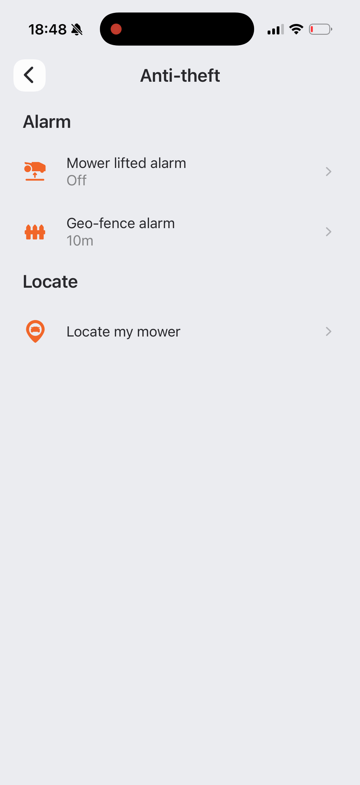

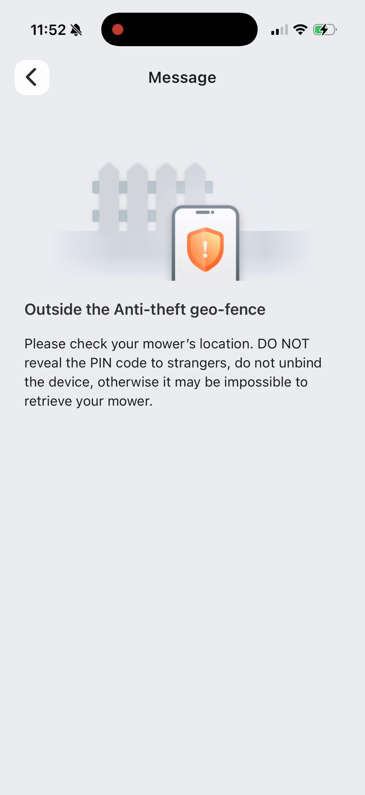

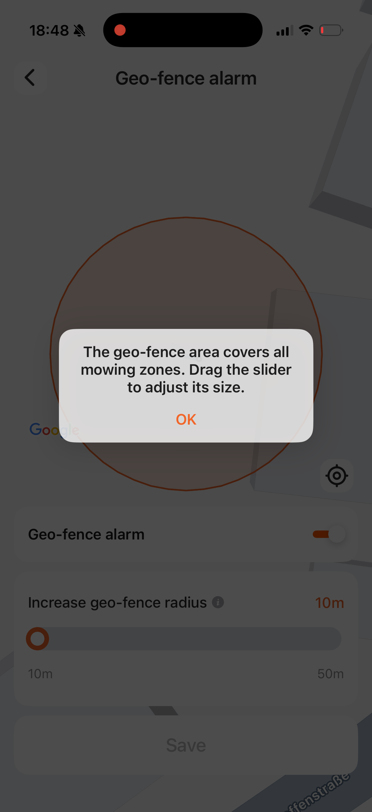

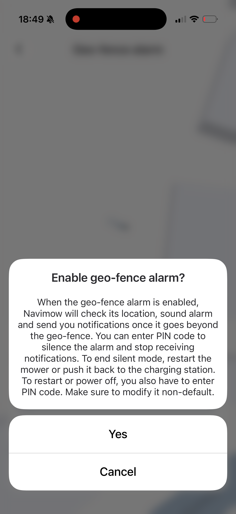

[20260326-124404.mp4]()

正常触发，设置 10m，误差大概在 2～5m左右

[防盗触发 声音真洪亮.mp4]()

声音比我们大很多

[防盗逻辑测试.mp4]()

在桩不触发

来个我们的声音对比：

[我们的声音对比.mp4]()

> 非工作状态，充电中，分别将机器、充电站都搬运至室内，模拟定位飘的情况，模拟成功了～～～
>
> 1、搬运后，会定位，定位不正确会直接触发防盗告警；
>
> 2、搬运中、搬运后，都会触发防盗告警；
>
> 3、触发防盗告警后，立即怼桩，防盗不解除；
>
> 4、搬运后怼桩，等待很长时间都没有触发防盗告警（在桩外时间稍微长点就告警了）；
>
> 另外，在拔掉 RTK 的插头后，从充电站搬出机器，搬运很长时间，都没触发防盗告警，App 显示位置未更新。

生效范围：

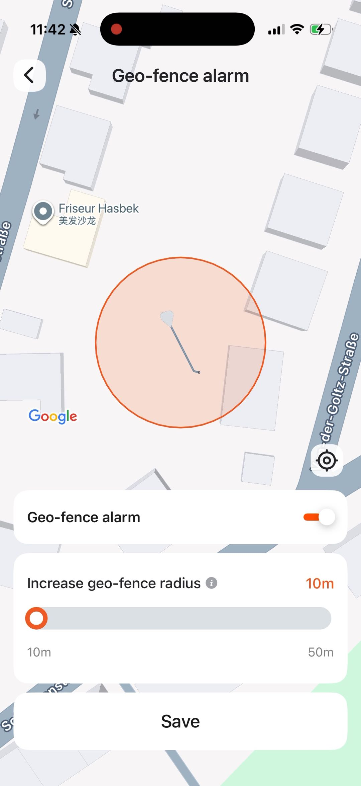

左图谷歌地图的缩放比基本一致。

防盗范围是圆形，应该是以某个中心计算的，半径距离不是

1. 围栏范围我记得是5-50m，看下距离的灵敏度

i206 是 RTK 款机器，当前使用的是 1+1 的模式，在此模式下，防盗范围是 10m～50m，在信号良好情况下，搬运机器有绕过墙体，触发报警，距离误差在 2～5m 左右。

* 测试一下触发后的解除逻辑以及长时间不处理的机器状态表现

  1. 固件端的表现

  2. 插件端的表现

长时间不处理不敢，九号声音太大了，我怕被投诉。

触发告警时，App仅Push，没任何变化。

触发后，屏幕自动调到 PIN 码输入。

* 触发防盗后关机操作

长按 OK 可关机

* 触发防盗关机后重新开机是否会立即进入防盗还是需要等待收敛

  1. 需要什么操作

  2. 表现是什么？告警音？消息推送重新触发？

防盗触发后，不支持关机

* 防盗是否存在使用限制，是否强需要4G数据，如果没有，WiFi是否可以使用这个功能（我记得之前是不行的需要一个模块，看下是否存在更新）

* 在充电桩上面是否会触发

  1. 充电桩放在室内是否可以触发告警？

已测试，看下上述视频，室内会触发告警，但在桩不会。

#### 搬运：

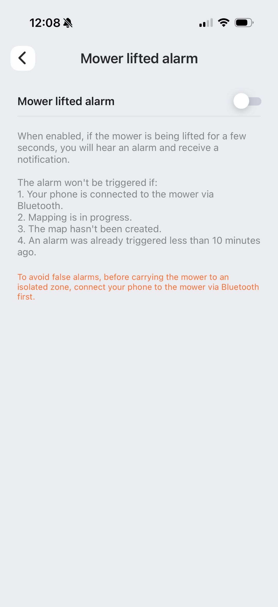

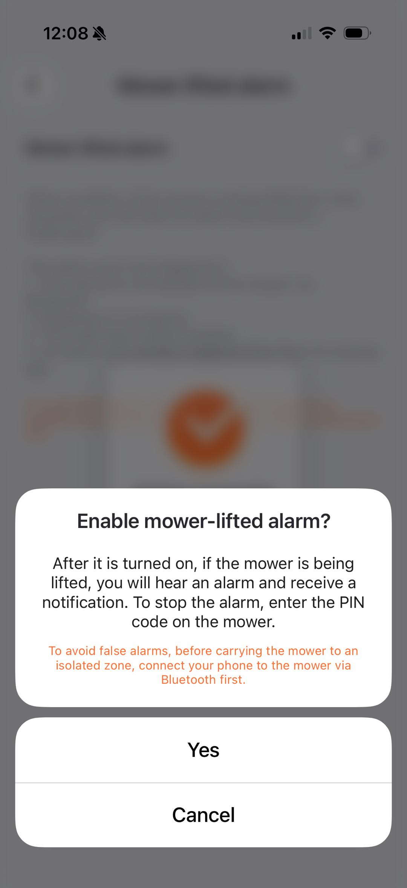

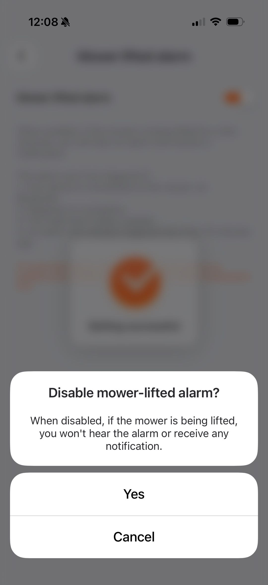

[搬运告警.mp4]()

> 1. 默认关闭，开启时提示了用户如果要搬运，建议先连蓝牙；
>
> 2. 搬运大概 2～3 秒即报警；
>
> 3. 尝试大概20 次左右快速搬运放下，未触发搬运告警。
>
> 另外九号解除防盗告警有个 bug，就是我触发了两次左右短按2次 Mow+OK 就解除了。

### 勿扰

### 计划表

* 手动割草中，计划时间到：计划表取消；

* 手动割草怼桩，会变暂停任务（任务未结束显示 End Task），计划时间到时，触发的是手动计划继续。

### 实时视频

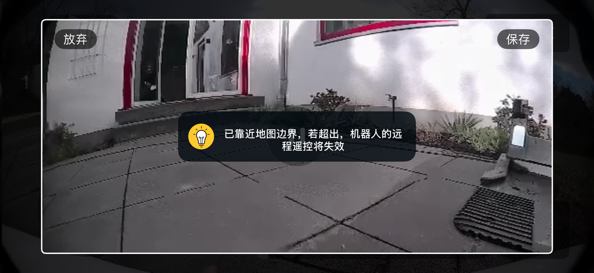

### 割草图案

设置：

割草效果：

* 怎么割

* 锐角效果、钝角效果

## RTK管理

### RTK热力图

1. 看下热力图是如何生成的，以及后续的更新逻辑

### 充电桩位置安装推荐

1. 安装位置推荐是放在引导里还是说需要拿到热力图才可以推荐

2. 如果放在引导里面，那么使用的方案是什么？

## 4. 割草

九号割草开始要求信号好，信号不好手动割草则提示定位不佳、不让割草：

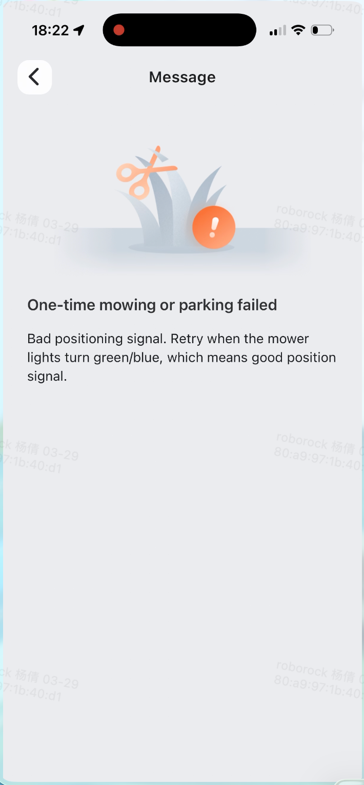

### 4.1 割草任务

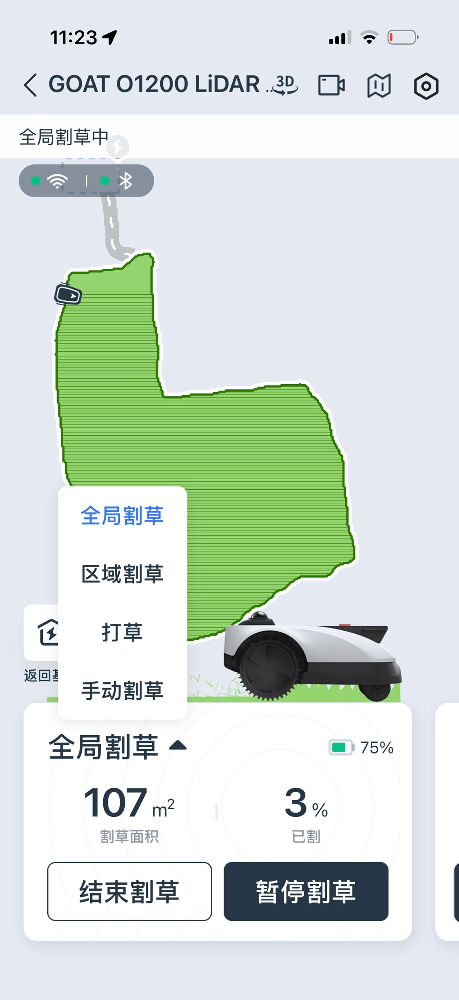

<table><colgroup><col width="132"><col width="144"><col width="819"><col width="298"></colgroup>
<thead>
<tr>
<th><strong>功能点</strong></th>
<th>测试点和方法</th>
<th>录屏/截图</th>
<th>说明</th>
</tr>
</thead>
<tbody>
<tr>
<td rowspan="3"><strong>续割</strong></td>
<td>一周未割的是否会清空</td>
<td></td>
<td>3/14有割草，于3/30 日拿到机器。 如图所示，<strong>没有清空草坪的进度。</strong> </td>
</tr>
<tr>
<td>续割电池策略 </td>
<td></td>
<td><ul>
<li>九号的续割电量是 15%（可调整）</li>
<li>能支持割草、遥控的电量要求是 20%（不可调整）</li>
<li>低电续割，电量要充到 80% 后开始；（不可调整）</li>
<li>电池充电到最高多少，可设置</li>
</ul> 九号可设置电池充电的限制、以及续割的电量，但不可设置 20% 才能割草、80% 即续割。 低电情况下，用户可以启动割草，会提示电量上来之后再去  <strong>充电速度：</strong> 新机器，1 个小时从 15% 充到 80% 出去续割</td>
</tr>
<tr>
<td>续割是否能在桩外继续</td>
<td>九号没法测，雨淋、勿扰都是天气系统限制的。</td>
<td></td>
</tr>
<tr>
<td><strong>计划割草</strong></td>
<td>时间过小是否提示、过密割草提示</td>
<td></td>
<td></td>
</tr>
<tr>
<td rowspan="4"><strong>手动割草</strong></td>
<td>手动割草时，计划触发； 手动割草时暂停怼桩； 手动割草怼桩；</td>
<td><a href="">手动割草怼桩定时启动.MP4</a> </td>
<td><ol>
<li>手动割草时，定时时间到，会提示计划延迟；</li>
<li>手动割草时，暂停并怼桩，任务未结束，当定时时间到时，会触发手动的任务继续。</li>
</ol></td>
</tr>
<tr>
<td>按键启动，怎么判断是否清空进度</td>
<td></td>
<td></td>
</tr>
<tr>
<td>划区割草</td>
<td></td>
<td></td>
</tr>
<tr>
<td>选边割草</td>
<td></td>
<td></td>
</tr>
<tr>
<td rowspan="3"><strong>结束割草</strong></td>
<td>割草中，手动怼桩，是否结束任务</td>
<td></td>
<td></td>
</tr>
<tr>
<td>割草中关机</td>
<td></td>
<td></td>
</tr>
<tr>
<td>回充是否结束任务</td>
<td></td>
<td></td>
</tr>
<tr>
<td rowspan="2"><strong>割草进度</strong></td>
<td>修改地图、清空任务</td>
<td></td>
<td></td>
</tr>
<tr>
<td>手动清空进度</td>
<td></td>
<td></td>
</tr>
<tr>
<td rowspan="3"><strong>割草时间线</strong></td>
<td></td>
<td></td>
<td></td>
</tr>
<tr>
<td></td>
<td></td>
<td></td>
</tr>
<tr>
<td></td>
<td></td>
<td></td>
</tr>
<tr>
<td rowspan="3"></td>
<td></td>
<td></td>
<td></td>
</tr>
<tr>
<td></td>
<td></td>
<td></td>
</tr>
<tr>
<td></td>
<td></td>
<td></td>
</tr>
</tbody>
</table>

### 4.2 割草规划

<table><colgroup><col width="132"><col width="236"><col width="252"><col width="298"></colgroup>
<thead>
<tr>
<th><strong>功能点</strong></th>
<th>测试点和方法</th>
<th>录屏/截图</th>
<th>说明</th>
</tr>
</thead>
<tbody>
<tr>
<td rowspan="3"><strong>割草顺序</strong></td>
<td><ul>
<li>就近顺序</li>
<li>次优顺序</li>
</ul></td>
<td></td>
<td></td>
</tr>
<tr>
<td><ul>
<li>补割策略</li>
</ul></td>
<td></td>
<td></td>
</tr>
<tr>
<td><ul>
<li>分区策略</li>
</ul></td>
<td></td>
<td></td>
</tr>
<tr>
<td rowspan="3"><strong>割草方向</strong></td>
<td><ul>
<li>高效</li>
</ul></td>
<td></td>
<td></td>
</tr>
<tr>
<td><ul>
<li>自定义</li>
</ul></td>
<td></td>
<td></td>
</tr>
<tr>
<td><ul>
<li>随机</li>
</ul></td>
<td></td>
<td></td>
</tr>
</tbody>
</table>

#### 禁区在草坪边界

#### 视觉不避障区

**A/B草坪+道路为实际的场景，然后又建了一个蓝色区域的草坪，看机器人会不会在这个区域割草：**

#### **非草识别**

**在一块非草坪的区域建一个草坪，试一下是否能割草：**

### 4.3 GOTO

<table><colgroup><col width="132"><col width="147"><col width="172"><col width="252"><col width="298"></colgroup>
<thead>
<tr>
<th><strong>功能点</strong></th>
<th>测试点</th>
<th>测试方法/终点</th>
<th>录屏/截图</th>
<th>说明</th>
</tr>
</thead>
<tbody>
<tr>
<td>块内goto</td>
<td><ul>
<li>最短路径</li>
<li>不破坏草坪图案</li>
</ul></td>
<td></td>
<td></td>
<td></td>
</tr>
<tr>
<td>通道穿越</td>
<td><ul>
<li>多通道策略</li>
</ul></td>
<td></td>
<td></td>
<td></td>
</tr>
<tr>
<td>选点</td>
<td><ul>
<li>草坪之子起点</li>
<li>草坪沿边起点</li>
<li>断点接续点</li>
<li>回桩点</li>
</ul></td>
<td></td>
<td></td>
<td></td>
</tr>
</tbody>
</table>

### 4.4 **弓字：**

#### 动作

##### 科沃斯（O1200）

弓字调头速度贼快，掉头前是谨慎的：

#### 方向

测试是否会根据地图形状，自动分区，调整弓字方向：

### 4.5 沿边

#### 科沃斯 - 打草绳

[斜坡边界无法建图、易滑坡.mp4]()

[打草头沿边.mp4]()

[打草绳修剪效果.mp4]()

> 1、斜坡沿边易跌落。
>
> 2、打草绳开启声音很大，人靠近检测是 2m，能在 1.5m左右停下，有误检，一次沿边中误报了 2 次左右（激光款）。

<table><colgroup><col width="132"><col width="147"><col width="252"><col width="298"></colgroup>
<thead>
<tr>
<th><strong>功能点</strong></th>
<th>测试点</th>
<th>录屏/截图</th>
<th>说明</th>
</tr>
</thead>
<tbody>
<tr>
<td>草坪沿边</td>
<td><ul>
<li>沿边距离</li>
<li>沿边次数</li>
<li>行进速度</li>
</ul></td>
<td></td>
<td></td>
</tr>
<tr>
<td>禁区沿边</td>
<td><ul>
<li>沿边距离</li>
<li>沿边次数</li>
<li>行进速度</li>
</ul></td>
<td></td>
<td></td>
</tr>
<tr>
<td>障碍物沿边</td>
<td><ul>
<li>沿边距离</li>
<li>沿边次数</li>
<li>行进速度</li>
</ul></td>
<td></td>
<td></td>
</tr>
<tr>
<td>闭环</td>
<td><ul>
<li>正常闭环</li>
<li>小闭环</li>
</ul></td>
<td></td>
<td></td>
</tr>
</tbody>
</table>

### 4.6 割草效率

覆盖率、割草效率

<table><colgroup><col width="132"><col width="215"><col width="172"><col width="252"><col width="298"></colgroup>
<thead>
<tr>
<th><strong>功能点</strong></th>
<th>测试点</th>
<th>测试方法/终点</th>
<th>录屏/截图</th>
<th>说明</th>
</tr>
</thead>
<tbody>
<tr>
<td>覆盖情况</td>
<td><ul>
<li>多障碍物</li>
<li>动态障碍物</li>
<li>沿边漏草等</li>
</ul></td>
<td></td>
<td></td>
<td></td>
</tr>
<tr>
<td>效率测试</td>
<td><ul>
<li> 500 /1000 平百分百覆盖时间</li>
</ul></td>
<td></td>
<td></td>
<td></td>
</tr>
<tr>
<td>提效点</td>
<td><ul>
<li>沿边、弓字顺序</li>
<li>电量动态调整</li>
</ul></td>
<td></td>
<td></td>
<td></td>
</tr>
</tbody>
</table>

#### 沿边贴边距离测试

齐平边界、高度边界

###

## 5. 通道

#### 5.1 多通道策略

#### 5.2 窄通道

[ 窄通道建图行为分析，以及处理方案](https://roborock.feishu.cn/wiki/RWVJwVNQIiZLn0kAtPRcoA4TnKb?from=from_copylink)

| 场景           | 图片                                                                                             |   |   |
| ------------ | ---------------------------------------------------------------------------------------------- | - | - |
| 靠墙通道         |                                                                                                |   |   |
| 与草坪靠很近  | 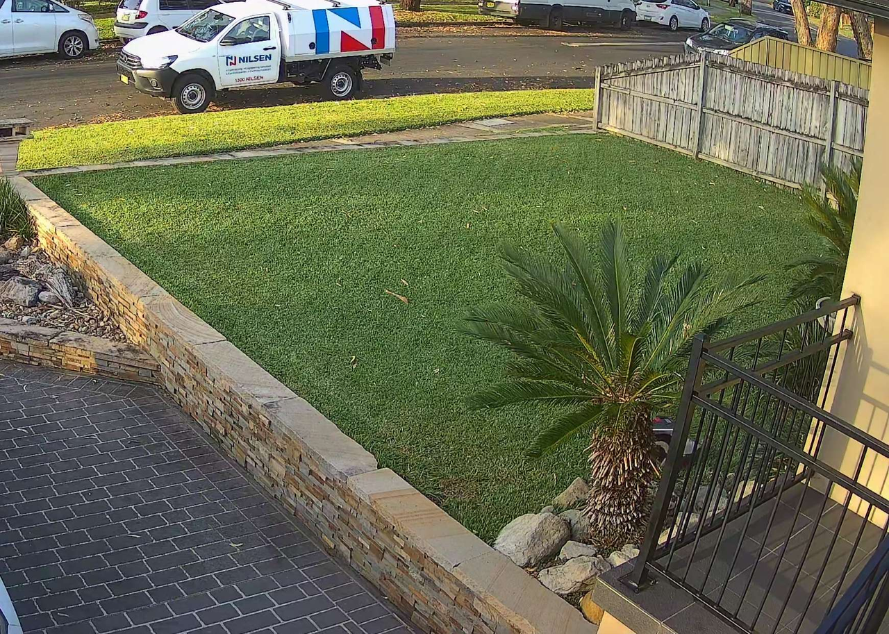通道旁边就是草坪，但是有物理阻隔，看下情况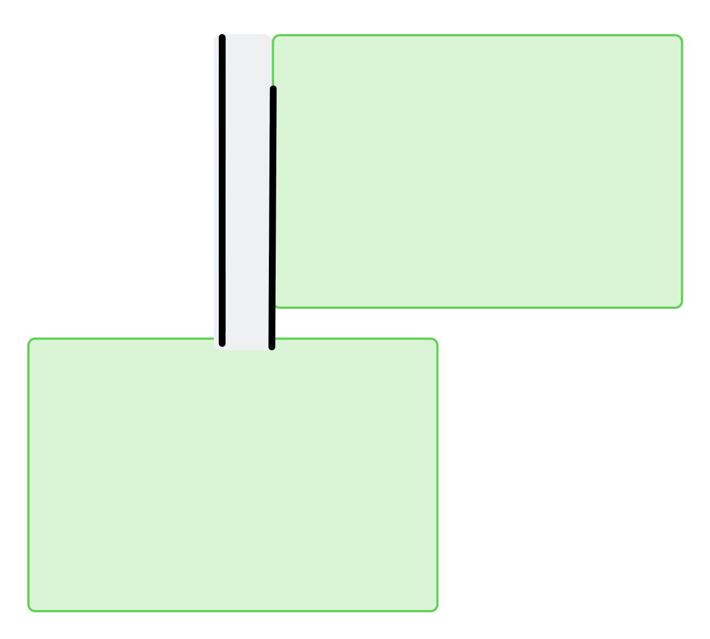 |   |   |

#### 5.3 草坪内的狭窄区域

| 场景  | 图片 |   |   |
| --- | -- | - | - |
| 多边墙 |    |   |   |
|     |    |   |   |

## 6. 脱困

#### 脱困动作：

[0408 脱困环境.mov]()

[回充底盘被卡脱困 8 分钟.mov]()

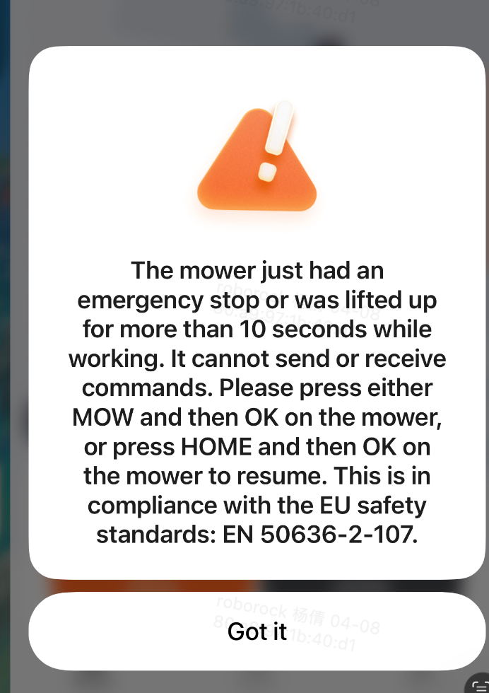

#### 割草时一圈障碍物围困，是否可以推开障碍物回充：

经常硬顶，后退压脚

## 7. 地图边界不严格

####

## 8. 脏污检测

### &#x20;九号 i206

单目摄像头，研发反馈脏污影响不大很正常……

#### 定位信号正常 + 脏污

##### 雨水

雨水**没有影响**，正常沿边、弓字，下雨时仍然可以正常工作

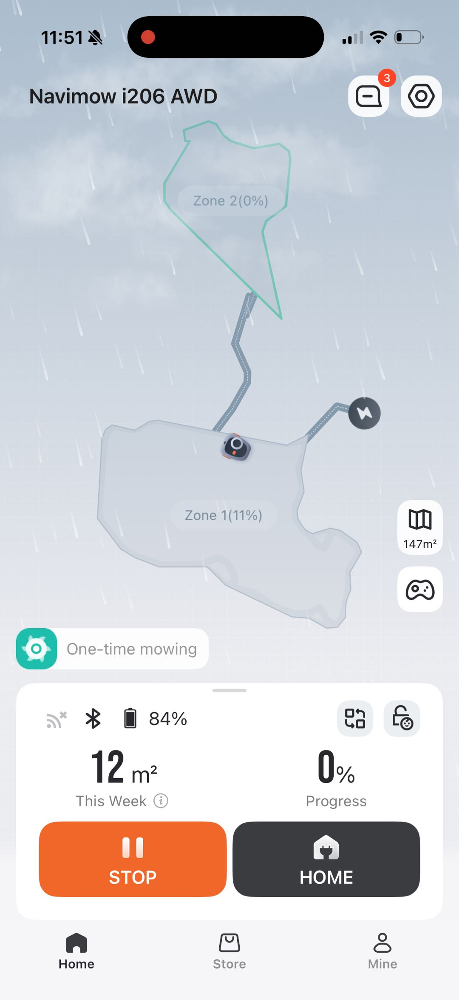

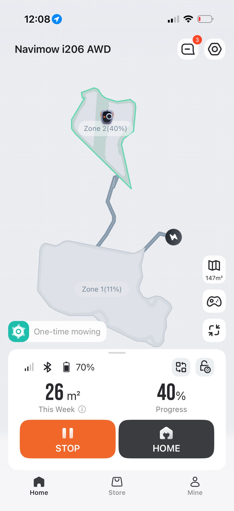

[940792f05e4db2962b0a38c87241a451.MP4]()

##### 脏污：

##### 倒水、倒咖啡、抹泥巴：

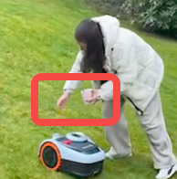

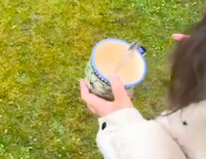

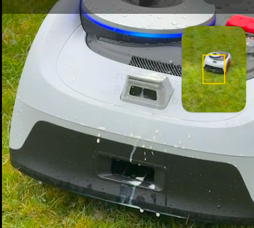

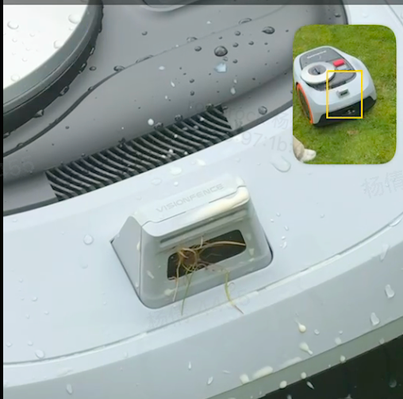

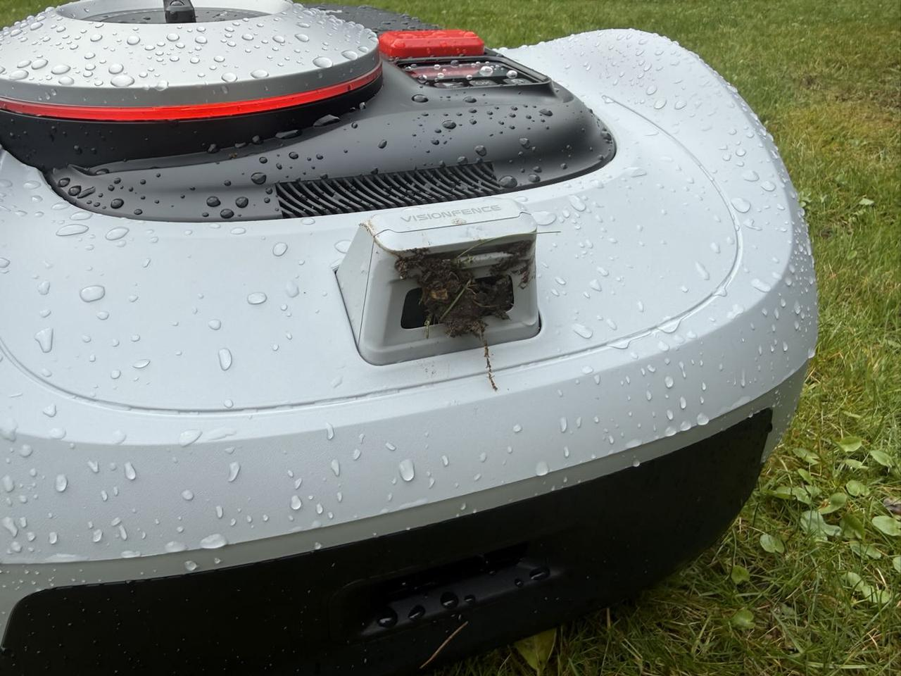

> 脏污后会继续割草（开刀盘了），但整体速度会慢很多、路线也比较乱：
>
> * 脏污特别严重的情况下，在比较小的范围内探索了大概有5 分钟，然后报错停机；
>
> * 稍微轻点的脏污情况下，探索的步伐稍微大点，仍在割草、割草效率比较低，不报错停机，遇到树桩、人都会正常避障。
>
> * 让其回充后关刀盘，速度快了很多，能够成功返回，也不影响上桩；

#### 定位信号不好+脏污

## 9. 障碍物

#### **静态障碍识别距离：**

障碍物被识别前距离；

#### **静态障碍物避障动作：**

遇障后动作（掉头/绕障）；

#### **弓子遇障动作：**

#### **动态障碍避让反应时间：**

识别到障碍到停止或绕行；

**动态障碍物避障动作：**

遇障后动作；

#### **深坑、水洼等识别：**

识别能力和处理逻辑；

### **触发bumper：**

时间以及动作；

## 10. 夜间建图割草

[夜间建图割草.mov]()

建图、弓字、避障情况

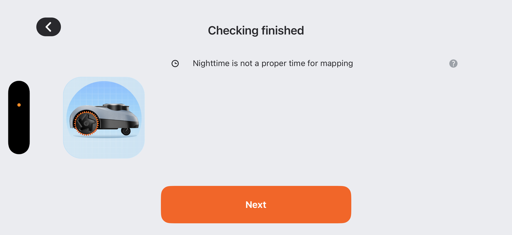

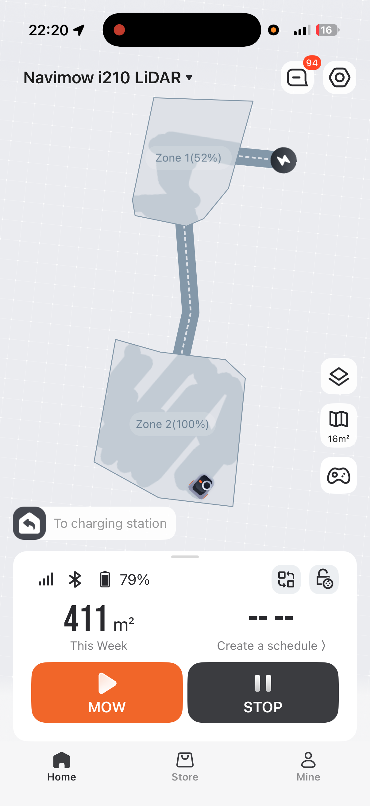

## 11. 出桩与回充

### **寻桩动作：**

**正常及充电站位移以后的寻桩动作；**

左右挪动大概 1.5m内能找回，2m有点悬，看视频，看不懂寻桩动作：

[上桩下桩以及挪桩.mov]()

[挪桩 2.mov]()

报错

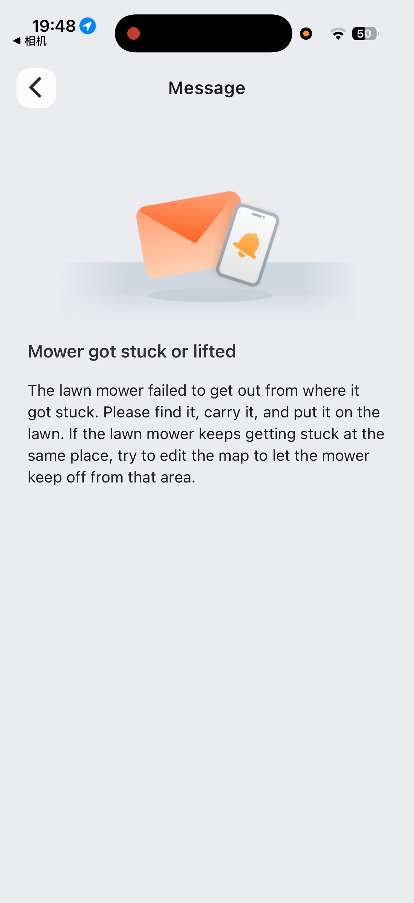

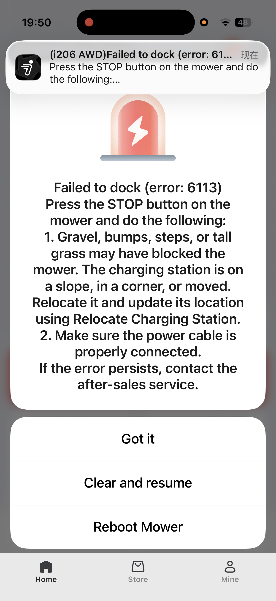

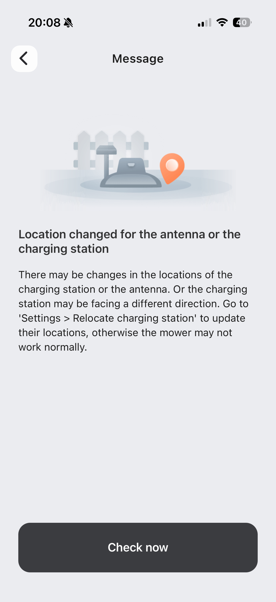

### 回充路径

### 出桩动作

出桩动作：是否有随机出桩点或随机出桩路径

无随机出桩点（包含在视频里）

## 12. 刹车

#### **平地刹车：**

#### **充电刹车：**

#### **坡道刹车：**

## 13. 功耗

**待机功耗：**&#x8BB0;录1.5h待机功耗；

`@何爱俊`

|            | 科沃斯                                      | 九号三轮                                      |
| ---------- | ---------------------------------------- | ----------------------------------------- |
| **初始电量**   |  94%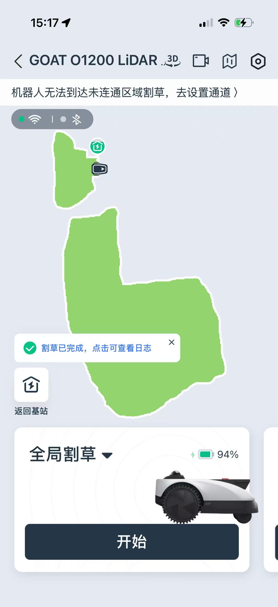 | 100%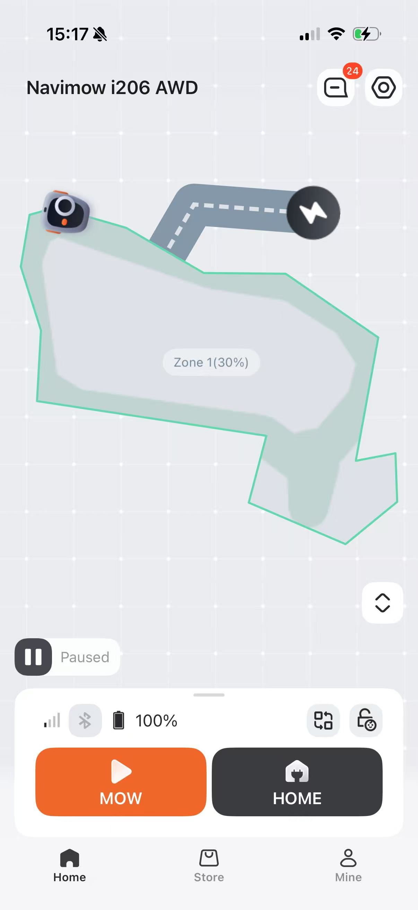  |
| **5.5h待机** | 41%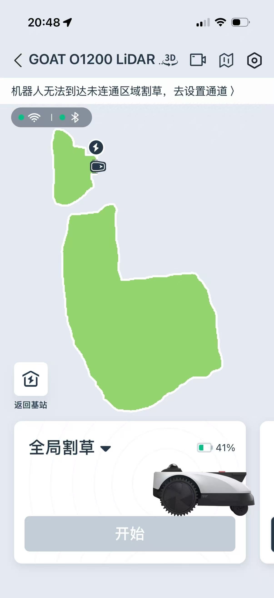  | 0% 关机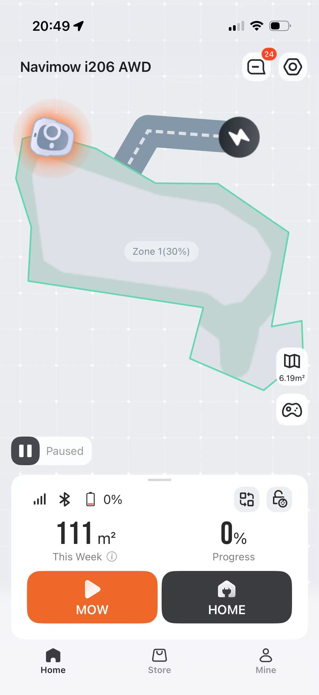 |

## 14. 噪音：

**电动升降的噪音和运行速度：**

## 15. 安规传感器

### Bumper

**让机器bumper触发着启动，看机器是直接报错，还是先后退尝试接触再报错，lift，bumper都要试：**

都不报错，你没法抵着

### **出界：**

将机器拉出界，是否会回到界内/报错。

#### Yuka Mini（视觉 + nRTK）

[出界测试.mp4]()

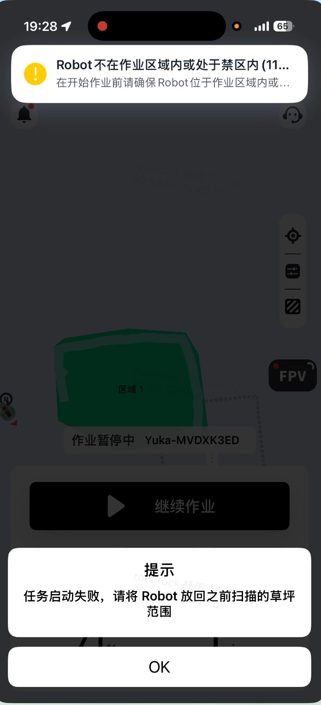

**出界很严格**

1.2m 左右就报出界了；

然后遥控到 1m 内还不动，一直遥控到 0.4～0.6m 左右，才能正常启动。

#### 九号激光款 i2

[出界测试-建图如是.mov]()

[抬起后轮拖出去.mov]()

拉出3m：

* 如果是慢慢推出去的，给推出 3m 会报错；

* 如果是抬高后轮拉出来的，超出3m放下来后做了重定位，然后正常回充；

#### 九号 RTK 款

[抬高后轮拉出边界 RTK 款.mov]()

[割草中搬至室内.mov]()

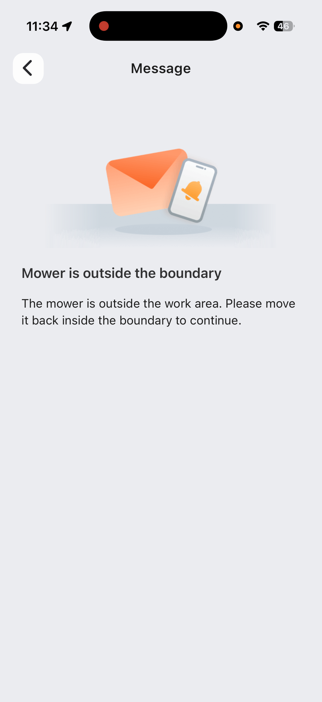

同激光

拖出来会直接报，拉后轮会直接返回，距离差不多也是 2 米多到 3 米。

另外在割草中搬运至室内，会一直费劲儿在走不停，手动暂停后再启动后报错。

## Stop逻辑

> 九号：
>
> 1. 抬起传感器在前轮；
>
> 2. 所有的都报 Lift，无论抬起、倾斜、翻转、超规坡道上；
>
> 3. 待机状态下，除了翻转机器达90 度或以上（完全翻转过来），都不需要两步解锁即可启动；
>
> 4. 遥控、建图逻辑同待机；
>
> 5. 割草过程中，触发 10s左右才会进 STOP，否则放下即立刻启动继续前进；
>
> 6. 安全：传感器触发1～2s内会停刀，安全风险不大，放下来之后即可跑，先跑、确定没问题了再动刀。

<table><colgroup><col width="124"><col width="140"><col width="116"><col width="309"><col width="280"><col width="328"></colgroup>
<thead>
<tr>
<th><strong>操作/状态</strong></th>
<th>割草中</th>
<th>回充中</th>
<th>待机中（无任务、有任务都一样）</th>
<th>建图中</th>
<th>遥控中</th>
</tr>
</thead>
<tbody>
<tr>
<td><strong> STOP 拍停</strong></td>
<td>需要手动按键解锁</td>
<td>同割草中</td>
<td>不需要手动解除，仅有语音和灯效提示，按STOP 后屏幕、 App 无提示STOP，未进入急停状态</td>
<td><ul>
<li>会提示急停了，App按钮可直接点继续；</li>
</ul></td>
<td><ul>
<li><strong>遥控时、或遥控模式下暂停拍STOP：</strong>直接退出遥控模式；</li>
<li><strong>遥控模式下的指哪儿到哪儿，机器自主行走时拍 STOP：</strong>机器拍停，语音、机身屏幕 STOP，App 弹窗询问是否继续，可直接继续行走，不需要按键解除 STOP；</li>
</ul></td>
</tr>
<tr>
<td><strong>触发倾斜</strong></td>
<td>会触发 STOP，需要手动按键解锁</td>
<td>同割草中</td>
<td>不需要手动解除，仅有语音和灯效提示，按STOP 后屏幕、 App 无提示STOP，未进入急停状态</td>
<td><ul>
<li>不需要解除STOP，没触发 STOP，放平后即可续建；</li>
</ul></td>
<td><ul>
<li><strong>遥控时、或遥控模式下暂停抬起：</strong>App会提示抬起了，放下机器后可以继续遥控，不需要解锁。</li>
</ul><ul>
<li><strong>遥控模式下的指哪儿到哪儿，机器自主行走时抬起：</strong>App会提示抬起了，放下机器后机器会继续自主行走至目标点，不需要解锁。</li>
</ul></td>
</tr>
<tr>
<td><strong>抵住 Bumper</strong></td>
<td></td>
<td></td>
<td>用脚抵住超过 30s，无任何反馈</td>
<td></td>
<td>遥控时、以及开启刀盘抵住，会继续走，App 会提示密草切割时建议减速。</td>
</tr>
<tr>
<td><strong>视频</strong> </td>
<td colspan="2"><a href="">割草、回充 STOP 逻辑一致.MP4</a> </td>
<td><a href="">待机时抬起不触发安规.mp4</a> </td>
<td><a href="">建图中急停、倾斜以及计划表.MP4</a> </td>
<td><a href="">遥控时拍停、倾斜.mp4</a> <a href="">遥控中的拍停、倾斜、Bumper、.MP4</a></td>
</tr>
</tbody>
</table>

* STOP 解除后，如果把脚立刻放在前面，会直接后退不顶脚；

* 在坡道上 STOP 没锁轮，会滑坡，建图时暂停不会滑；

## 16. **特别的功能设计**

石头没有的（没纳入规划的）

#### Luba 建图顺序：

Luba 的建图顺序是先创建区域 --·> 从已建草坪创建到新草坪的通道 --·> 创建新草坪

桩到首个区域的路径也会被记录为上桩通道。

这样的好处是不会漏掉通道，但无法支持孤立草坪，BUT，可能这块是视觉的？？不知道其他款是不是也这样。

我一直很纠结的点是，怎么满足

* 先创建通道再创建区域

* 先创建区域再创建通道

这两类不同思路的用户，虽然技术不一定能支持前者。

但是交互上我觉得可以借鉴 Luba 这个，当我识别到新草坪的起点在已建草坪内时，我们就提示他遥控到新草坪的起点，然后自动生成通道，然后提示用户再开始建图。

但当起点在草坪外时，我们就设置草坪起点，开始建图。

#####

## 17. RGB实景地图是否准确

准

## 18. 耗材与保养

<table><colgroup><col width="126"><col width="312"><col width="384"><col width="265"></colgroup>
<thead>
<tr>
<th><strong>模块</strong></th>
<th>测试点</th>
<th>录屏/截图</th>
<th>说明</th>
</tr>
</thead>
<tbody>
<tr>
<td><strong>清洁提示（若有）</strong></td>
<td><ul>
<li>提示的时机及频率</li>
<li>有无对于提示的自定义操作（如关闭提示，自定义提示时机）</li>
</ul></td>
<td></td>
<td>可以问一问用户对于这个提示的看法 </td>
</tr>
<tr>
<td><strong>耗材</strong></td>
<td><ul>
<li>提示的时机及频率</li>
<li>有无对于提示的自定义操作（如关闭提示，自定义提示时机）</li>
</ul></td>
<td></td>
<td></td>
</tr>
</tbody>
</table>

## 19. 售后模块

`@宋云鹏`

| 测试项                                 | 测试结果 | 说明     |
| ----------------------------------- | ---- | ------ |
| BIT自检的颗粒度（可以参考检测项以及报错情况），以及包含的具体检测项 |      | 测试方法不限 |
| MMT自检的颗粒度，以及包含的具体检测项                |      |        |
| 售后工具使用的满意度（）                        |      |        |

## 多机协同

`@王超`

[ 多机协同需求明确](https://roborock.feishu.cn/docx/Fw1AdC4CToTZRRxo7p5cuKDenue)

建议对九号的多机协同功能全量录制视频

## 开发关注模块

## 数据延迟

#### **切换通讯方式后数据交互和传输是否影响或延迟：**

是否支持、延迟时间；

#### 状态机

<table><colgroup><col width="369"><col width="312"><col width="263"></colgroup>
<thead>
<tr>
<th>测试项</th>
<th>测试结果</th>
<th>说明</th>
</tr>
</thead>
<tbody>
<tr>
<td><ol>
<li>遥控的可用距离，停刀停轮的速度之类的</li>
</ol></td>
<td></td>
<td></td>
</tr>
<tr>
<td><ol start="2">
<li>雨淋勿扰低电这种打断自动割草后，机器自己回桩的情况下，重启，重启后机器的继续任务的情况</li>
</ol></td>
<td></td>
<td></td>
</tr>
<tr>
<td><ol start="3">
<li>自动割草、建图切换到遥控割草、退出遥控回到自动之后机器的表现</li>
</ol></td>
<td></td>
<td></td>
</tr>
<tr>
<td><ol start="4">
<li>有没有其他机器带网络切换（wifi/4g）还有视频遥控相关功能的，看能否关注一下这些功能</li>
</ol></td>
<td></td>
<td></td>
</tr>
</tbody>
</table>

### 定位

[ 割草机竞品测试-建图定位](https://roborock.feishu.cn/wiki/Afbgw3kHFikdRZkARwFcpa63nPb?from=from_copylink)

# 历史测试文档：

[ 25.9IFA 竞品测试](https://roborock.feishu.cn/wiki/LEpJw0992inPFFk2aEKcQZ07n3f?from=from_copylink)

[ 26.1-德国竞品测试](https://roborock.feishu.cn/wiki/EUaLwFoIUiRmjqkv4vxcikbYn8d?from=from_copylink)

[ 窄通道竞品测试需求](https://roborock.feishu.cn/wiki/SM9BwiGXSi0yFbkl9Hwcm3canxd?from=from_copylink)

