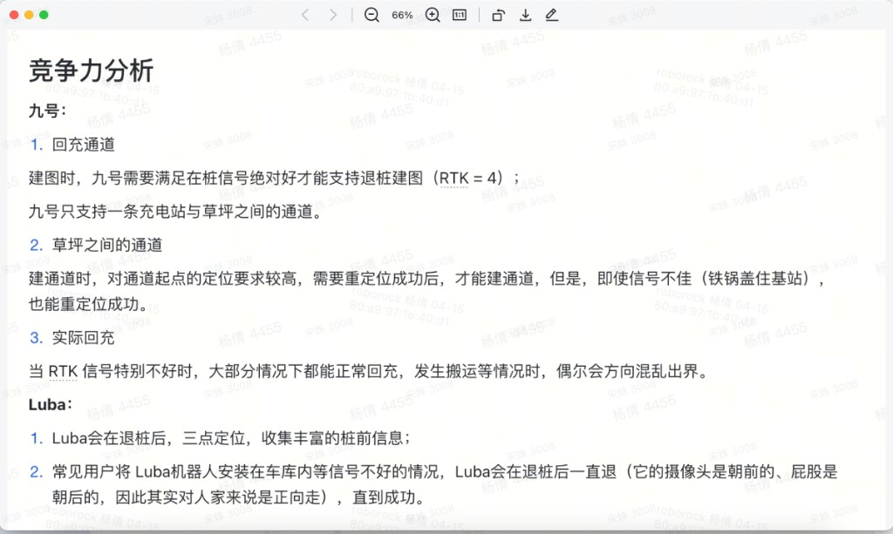

# 产品反馈 — 竞争力分析（2026-04-18）

> 来源：产品于 2026-04-18 反馈，附原图 `images/产品反馈-竞争力分析-原图.png`。
> 注意：本份**不是 inbox 实测材料**，是产品基于多次实地观察总结的「竞争力分析」结论。
> 引用时统一记为：`[产品反馈 2026-04-18 §xxx]`。

## 1. 九号

### 1.1 回桩通道
- **建图时，九号需要满足在桩信号绝对好才能支持退桩建图（RTK = 4）**
- **九号只支持一条充电桩与草坪之间的通道**

### 1.2 草坪之间的通道
- 建通道时，**对通道起点的定位要求较高**，需要重定位成功后才能建通道
- 但是，**即使信号不佳（铁锅盖住基站），也能重定位成功**

### 1.3 实际回充
- 当 RTK 信号特别不好时，大部分情况下都能正常回充
- **发生搬运等情况时，偶尔会方向混乱出界**

## 2. Luba

### 2.1 退桩动作
- **Luba 会在退桩后，三点定位，收集丰富的桩前信息**

### 2.2 信号差场景退桩策略
- 常见用户将 Luba 机器人安装在车库内等信号不好的情况
- **Luba 会在退桩后一直退**（它的摄像头是朝前的、屁股是朝后的，因此其实对人家来说是正向走），直到成功

## 3. 原图

