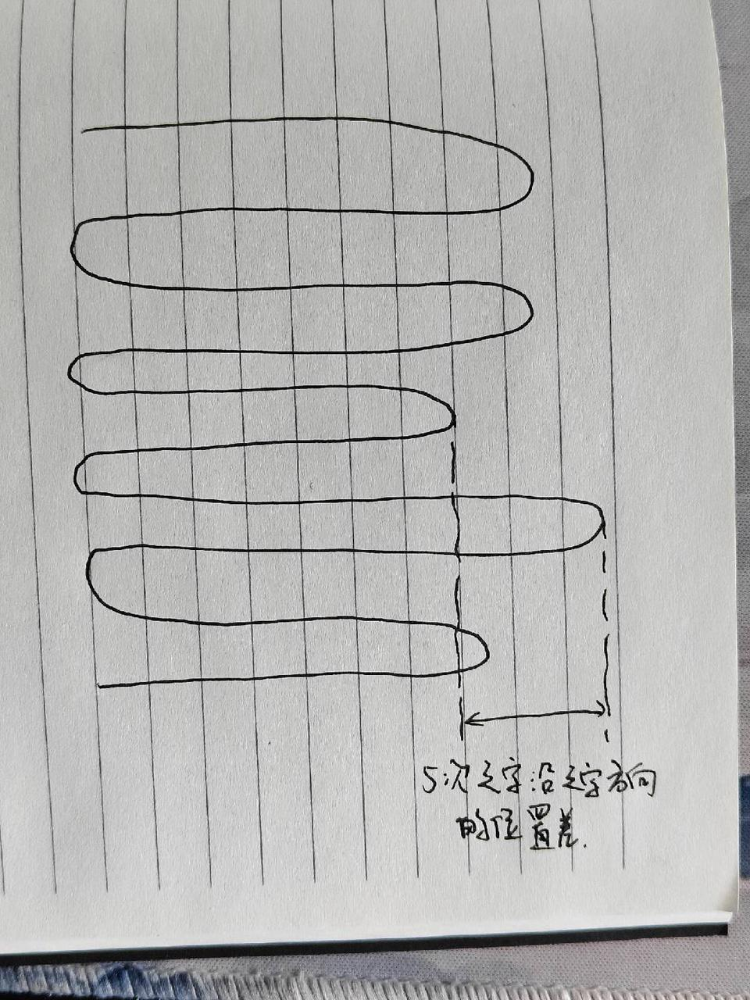
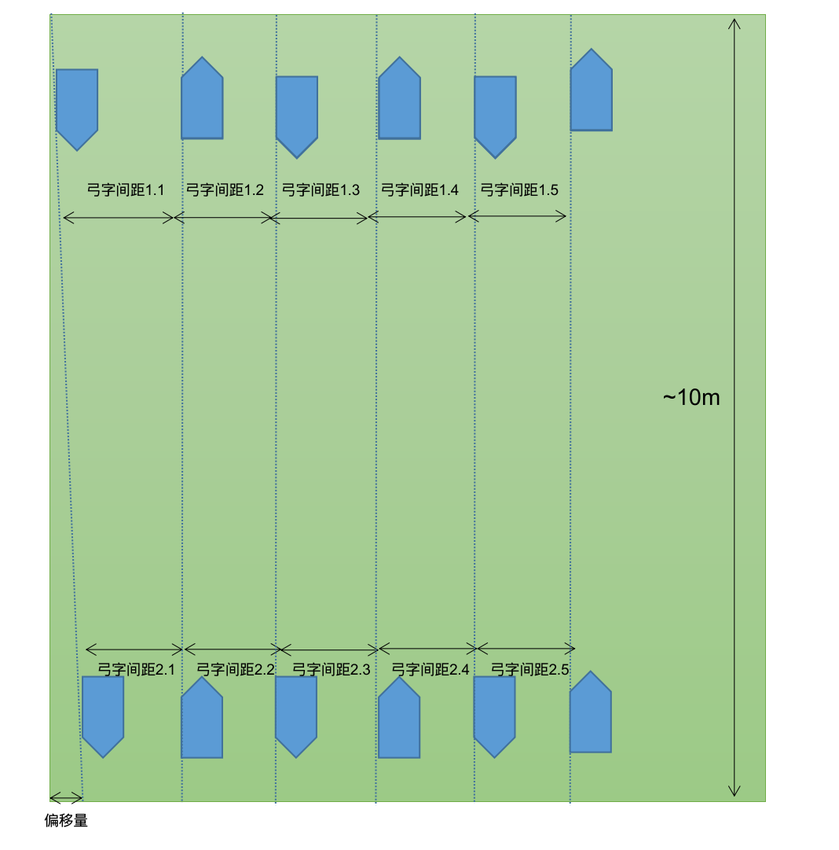
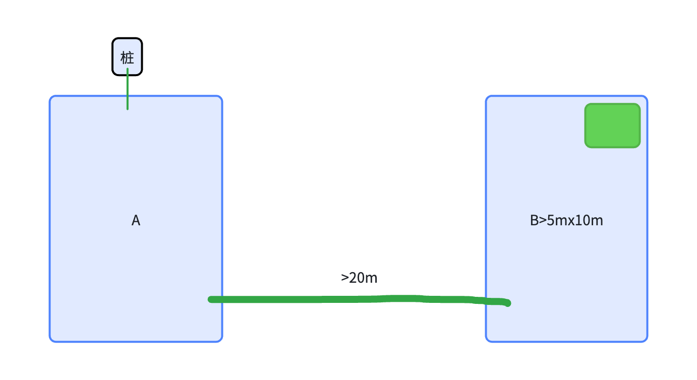

# 割草机竞品测试-建图定位

# 1. 分类

电子表格（无法获取数据：UJwtTS）

# 2. 场景测试

电子表格（无法获取数据：EcFtAJ）

# 3. 架构测试

## 3.1 白马 Sunseeker X9

* 15个传感器和8个摄像头，只看到双目、iTOF、3个DTOF、红外热成像仪

  * 哪8个摄像头？

  * DTOF的FOV是多大？还是单点？

# 4. 行为测试

## 4.1 建图测试

1. 正常建图的流程先走一遍。 看看正常建图流程 （看了youtube的视频，好像是正常弓字割草，然后最后自主沿了一圈边界）

   * 关注点：

     * 建图行为是啥样的？

       1. 自主延边？

       2. 有没有地图中间区域的探索？

     * 回桩后地图是否会再次优化（app上地图回桩前截一张图，回桩后等一段时间再截一张对比看看）？如果优化了地图，大概花费的时间是多少？

   > 1、建图后，割草顺序：先沿边 2～3 次（不同机型沿边此时不同），再沿禁区，然后再弓字；
   >
   > 2、建图后没有自主沿边；
   >
   > 3、没有地图中间区域的探索；
   >
   > 4、地图优化功能EFLS 是用户可选开启的，且仅有 RTK 款机器有 EFLS 功能。经过观察，在开启情况下，在信号比较不错的情况下建图后没有优化，信号差时会触发优化，优化时间只有几分钟，但是优化后的地图基本没变。（尤其发生搬运的情况下）

2. 建图中的异常情况测试

   * 建图中是否允许搬起机器？-允许，参见我的那个集合文档

   * 最终边界轨迹如何连接？

     \-- RTK 款在搬运的过程中，会直接实时更新轨迹和朝向，轨迹是杂乱的，保存后也没优化这块轨迹，就是保留了杂乱结果（我在想九号可能是想说有修改边界功能，后续用户可以自行单独修改这块边界）；Luba和九号都是这套逻辑；

     \--  RTK 款，在信号不好时，搬运过程中就不会更新轨迹了，搬运前后地图显示的定位没变。

     \-- Luba不支持 8 字型地图，因此在搬运过程中轨迹闭合了就会报错。

     以上在我的测试文档里面都有视频，可以看下

   * 从当前位置A，搬动机器后，放置到距离A点1m左右的位置B处，观察机器行为。&#x20;

     * 机器在B处是否会有先转圈重定位的动作？

     * 重定位成功后，是否会回到原先A点？

     * 搬起后，后续的建图定位精度如何？（机器的app上定位和机器的实际位置是否一致）

   RTK 信号好完全一致，信号不好就不准。在搬运过程中估计和朝向都是实时更新的。

   * 建图过程中，拖住机器，使得轮子打滑，观察机器行为。（**RTK机器需要在RTK阴影区域进行这项测试**）

     * 打滑后是否有重定位（定位找回）动作？

     * 打滑后，建图定位的精度如何？（机器的app上定位和机器的实际位置是否一致）

     * 遮挡（视觉定位传感器）加打滑后精度怎么样

## 4.2 定位测试

1. 割草过程中，动态障碍物（人类）频繁在相机前方走来走去，观察机器定位精度。（针对固态激光雷达产品）

2. 相机、激光雷达脏污或者遮挡的情况下，机器是否会检测报错？

## 4.3 重定位测试

1. 抱起机器后，重新放置在草坪上，观察机器的重定位动作。 只需要转圈，还是会走一些特定轨迹？

   1. 区分RTK机型和激光雷达机型进行观察

2. 在区域1建立了地图后，将机器放置在区域1之外的地方，机器是否能重定位成功？如果成功了，定位是否准确？ 后续割草行为是否异常？如果失败了，机器之后的行为是啥？ 直接原地报错停机吗？

   1. 区域1建图已完成的状态下

   2. 区域1建图未完成的状态下

3. 直接更换桩的位置（app上不进行操作更换桩位置的处理），在桩附近进行重定位，观察是否成功，定位的位置是否准确？（nRTK机型，机器在RTK阴影区域测试）

4. 更换桩位置后，在app上操作一下更换桩位置，使得app上显示的桩位置更新过来。 然后再在桩的附近进行重定位测试，观察是否成功，定位的位置是否准确？（nRTK机型，机器在RTK阴影区域测试）

5. 如果上述3和4，重定位假成功，继续长时间割草，直到回桩（如果有可能），看定位是否可以恢复

6. A区域建图成功，搬桩到没有共视关系的B区域割草，割草一段时间后触发重定位，看是否会成功或是一直尝试重定位？观察是否会重定位到新B图上？（测试是否会在新图上进行重定位）（只针对激光雷达机型）

# 5. 定量评估方案

## 5.1 场地需求：

在草地遥控建一个外框10m\*10m的图，使弓字的长度为10m。

## 5.2 测试项

## 5.3 调头漏割

### 5.3.1 示意图

#### 5.3.1.1 示例表

电子表格（无法获取数据：r2cR2T）

### 5.3.2 行间漏割

#### 5.3.2.1 示意图

#### 5.3.2.2 示例表

电子表格（无法获取数据：TsRalQ）

# 6. 窄通道评估方案 - 无窄通道场景

## 6.1 测试项：

* 验证竞品是否能跑下来以下测试。重复以下测试 3 次。场地布局见下图。

  1. 清空所有地图。

  2. 出桩，建图区域 A。A 离桩很近。

  3. 从区域 A，遥控到区域 B，建区域 B。B 离桩很远。并且跨两道窄墙通道。

  4. 建立通道 B->A。要求走出窄通道后立即结束。

  5. 桩出去 B 区域选区割草，割草完成后点击回桩。

## 6.2 关注点

1. 是否可以建通道

2. 建图时通道内劫持、搬动机器人后的行为

   * 是否显式重定位（语音、APP提示）

   * 重定位行为（走方块、原地转圈）

   * 重定位后是否可以正常走出通道，后续割草、定位是否正常

3. 是否引导用户双向建通道（**激光雷达竞品无需测**）

4. 割草时能否进入窄通道？（**激光雷达竞品无需测**）

5. 进入窄通道时是否有磕碰？

   1. 如果有磕碰，第一次磕碰时，APP 显示机器是否在通道上，机器是否实际在通道上。

6. 进入窄通道后是否会产生磕碰

   1. 正向建通道，反向过通道时是否撞墙

7. 进入窄通道后，APP 显示机器是否在通道上，机器是否实际在通道上（**激光雷达竞品无需测**）

8. 割草经过通道（与建图经过通道的方向相反）时通道内劫持、搬动机器人后的行为

   * 是否显式重定位（语音、APP提示）

   * 重定位行为（走方块、原地转圈）

   * 重定位后是否可以正常走出通道，后续割草、定位是否正常

| 测试轮次 | （上述问题每个作为一列） | APP 录像 | 机器工作录像 |
| ---- | ------------ | ------ | ------ |
| 1    |              |        |        |
| 2    |              |        |        |
| 3    |              |        |        |

