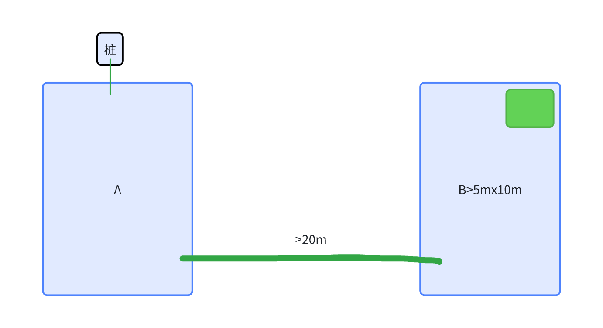
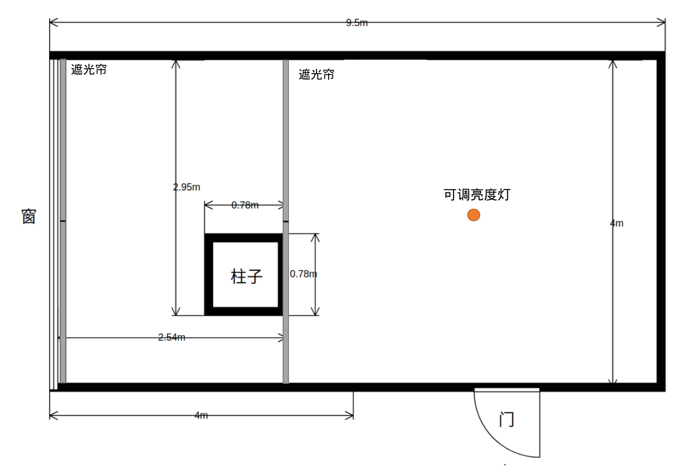

# 通用（全组共用）— Decisions

> 模块：`overview/modules/common/`
> 来源 inbox：`inbox/`（全组通用文档）

---

## D-001 SLAM 暂停/恢复需求设计【已定案】

**背景**
不需要 SLAM 时暂停以节省电、CPU、内存、降低散热

**选定方案**
触发 pause 的 5 种情况：按下 stop 键 / 报错 / 在桩上 / 桩外待命 / 升级

暂停策略（参考扫地机）：
- pause 后始终向导航发送暂停前的 pose（不更新）
- pause 期间 SLAM 收到 Gyro/odom/激光/RTK 均不 dispatch
- 暂停期间不检测传感器，不进行重定位

暂停期间发生搬动/gyro超过5度/odom移动的处理：
- 导航记录"曾发生搬动"状态
- resume 时导航通知 SLAM 开始重定位，并启动重定位动作

SLAM 相关改动：
- odom/IMU 更新量小于阈值时不递推融合状态
- 轮子停 2s 后用滑窗滤波估计 gyro 偏置（完全停止 / 稳态两级判断）
- 稳态持续 2s 后用 acc 初始对准更新 roll/pitch，yaw 保持不变

**放弃方案**
先 resume 定位、等 response 再启动导航（不推荐，延迟高）

**来源** | inbox/001_需求文档/001_SLAM暂停

---

## D-002 割草机竞品传感器方案分析【已定案（参考）】

**背景**
需要了解竞品定位传感器组合，指导自研方向选择

**选定方案（竞品概况）**

| 机型 | 定位传感器 | 感知传感器 |
|------|-----------|-----------|
| Husqvarna 560 EPOS | nRTK + 视觉? + 引导线 | 雷达 + 视觉AI |
| Navimow i215 | 固态激光雷达 + 视觉 | 雷达 + 140° RGB |
| 松灵 Yuka mini2 | 机械雷达 | 视觉AI（10TOPS） |
| Navimow X430 | nRTK + 360° VSLAM + VIO | 360° RGB Camera + ToF |
| 白马 Sunseeker X9 | nRTK + VSLAM | 双目 + iTOF + 3×DTOF + 红外热成像仪 |

测试矩阵已建立（斜坡/铁网边界/窄通道/RTK阴影/建图中搬动/搬桩/打滑），含激光和 RTK+双目 两种机型测试方案。
定量评估：10m×10m 草地弓字轨迹（调头漏割/行间漏割两项）。

**来源** | inbox/001_需求文档/002_割草机竞品测试-建图定位

---

## D-003 TR3/TR4 过点测试定义与软件职责【已定案】

**背景**
项目开发流程中 TR3/TR4 两个过点的测试内容需要明确，指导软件测试资源分配

**选定方案**

**TR3（架构过点）** — 侧重最基本可用：
- 平台：能启动、跑程序、访问内存/Flash
- 器件：能运行（出图/收发数据/控制）+ 安装位置无干涉
- 结构：基本行走/越障/上桩可用
- 电子：IO 如设计一般
- 原则：最快手段验证基本能力，发掘明显问题为 TR4 做准备

**TR4（结构过点）** — 侧重风险识别 + 极限验证（可量产性）：
- 平台：压测（内存/Flash 组合稳定性）
- 器件：一二供专项测试（极限场景/标定/软件逻辑）
- 结构：细致极限测试（上下桩/越障/刹车）
- 软件职责：风险识别 + 极限验证（器件指标极限、结构场景极限）

变通点：TR4 无法全覆盖时，优先测风险高的项（如上限机器上下桩）

**来源** | inbox/007_通用文档/004_TR3、TR4过点测试内容说明

---

## D-004 视觉实验室建设需求【已定案】

**背景**
支持 vslam 开发，需要隔出专用视觉实验室（13 层软件功能开发区）

**选定方案**
三大功能场地：
1. **标定结果验证**：aprilgrid（0.3m×2/0.5m×2/0.8m×1 铝基板）+ 场地 ≥3×3 + 地面棋盘格 + 转台
2. **tunning 结果验证**：亚克力板（白/黑/透明各×2）+ 亮度可调节灯（60W）+ 拷贝台
3. **vslam 数据采集**：墙面布置彩绘图（1m×1m×20 + 1.5m×1m×10 + 1m×1.5m×10）+ 遮光帘

场地布置：墙面全白 + 独立开关 + 可调亮度光源 + 双层遮光帘（纯白+纹理各一款）

**待确定**：最终场地大小确认后给出张贴图像集；动捕系统预算待定

**来源** | inbox/007_通用文档/005_实验室管理文档/001_视觉实验室需求

