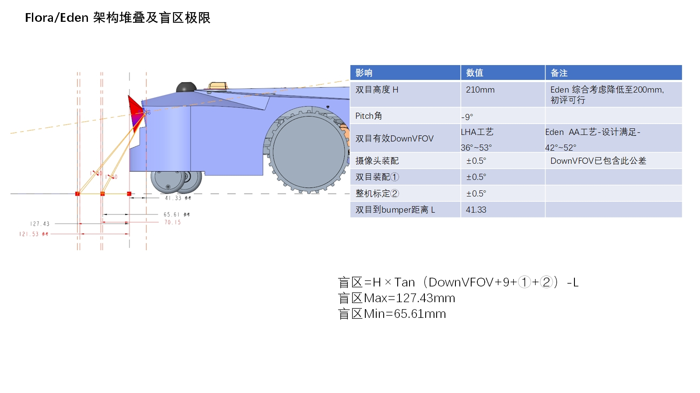
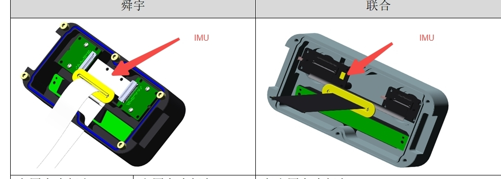
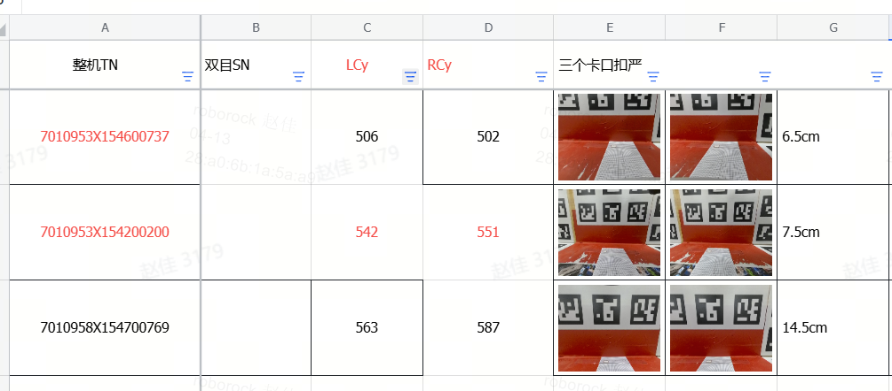

# 通用（全组共用）— Decisions

> 模块：`overview/modules/common/`
> 来源 inbox：`inbox/`（全组通用文档）

---

## D-001 SLAM 暂停/恢复需求设计【已定案】

**背景**
不需要 SLAM 时暂停以节省电、CPU、内存、降低散热

**选定方案**
触发 pause 的 5 种情况：按下 stop 键 / 报错 / 在桩上 / 桩外待命 / 升级

暂停策略（参考扫地机）：

- pause 后始终向导航发送暂停前的 pose（不更新）
- pause 期间 SLAM 收到 Gyro/odom/激光/RTK 均不 dispatch
- 暂停期间不检测传感器，不进行重定位

暂停期间发生搬动/gyro超过5度/odom移动的处理：

- 导航记录"曾发生搬动"状态
- resume 时导航通知 SLAM 开始重定位，并启动重定位动作

SLAM 相关改动：

- odom/IMU 更新量小于阈值时不递推融合状态
- 轮子停 2s 后用滑窗滤波估计 gyro 偏置（完全停止 / 稳态两级判断）
- 稳态持续 2s 后用 acc 初始对准更新 roll/pitch，yaw 保持不变

**放弃方案**
先 resume 定位、等 response 再启动导航（不推荐，延迟高）

**来源** | inbox/001_需求文档/001_SLAM暂停

---

## D-002 割草机竞品传感器方案分析【已定案（参考）】

**背景**
需要了解竞品定位传感器组合，指导自研方向选择

**选定方案（竞品概况）**

| 机型                 | 定位传感器                   | 感知传感器                       |
| ------------------ | ----------------------- | --------------------------- |
| Husqvarna 560 EPOS | nRTK + 视觉? + 引导线        | 雷达 + 视觉AI                   |
| Navimow i215       | 固态激光雷达 + 视觉             | 雷达 + 140° RGB               |
| 松灵 Yuka mini2      | 机械雷达                    | 视觉AI（10TOPS）                |
| Navimow X430       | nRTK + 360° VSLAM + VIO | 360° RGB Camera + ToF       |
| 白马 Sunseeker X9    | nRTK + VSLAM            | 双目 + iTOF + 3×DTOF + 红外热成像仪 |

测试矩阵已建立（斜坡/铁网边界/窄通道/RTK阴影/建图中搬动/搬桩/打滑），含激光和 RTK+双目 两种机型测试方案。
定量评估：10m×10m 草地弓字轨迹（调头漏割/行间漏割两项）。

**来源** | inbox/001_需求文档/002_割草机竞品测试-建图定位

竞品窄通道测试方案

---

## D-003 TR3/TR4 过点测试定义与软件职责【已定案】

**背景**
项目开发流程中 TR3/TR4 两个过点的测试内容需要明确，指导软件测试资源分配

**选定方案**

**TR3（架构过点）** — 侧重最基本可用：

- 平台：能启动、跑程序、访问内存/Flash
- 器件：能运行（出图/收发数据/控制）+ 安装位置无干涉
- 结构：基本行走/越障/上桩可用
- 电子：IO 如设计一般
- 原则：最快手段验证基本能力，发掘明显问题为 TR4 做准备

**TR4（结构过点）** — 侧重风险识别 + 极限验证（可量产性）：

- 平台：压测（内存/Flash 组合稳定性）
- 器件：一二供专项测试（极限场景/标定/软件逻辑）
- 结构：细致极限测试（上下桩/越障/刹车）
- 软件职责：风险识别 + 极限验证（器件指标极限、结构场景极限）

变通点：TR4 无法全覆盖时，优先测风险高的项（如上限机器上下桩）

**来源** | inbox/007_通用文档/004_TR3、TR4过点测试内容说明

---

## D-004 视觉实验室建设需求【已定案】

**背景**
支持 vslam 开发，需要隔出专用视觉实验室（13 层软件功能开发区）

**选定方案**
三大功能场地：

1. **标定结果验证**：aprilgrid（0.3m×2/0.5m×2/0.8m×1 铝基板）+ 场地 ≥3×3 + 地面棋盘格 + 转台
2. **tunning 结果验证**：亚克力板（白/黑/透明各×2）+ 亮度可调节灯（60W）+ 拷贝台
3. **vslam 数据采集**：墙面布置彩绘图（1m×1m×20 + 1.5m×1m×10 + 1m×1.5m×10）+ 遮光帘

场地布置：墙面全白 + 独立开关 + 可调亮度光源 + 双层遮光帘（纯白+纹理各一款）

**待确定**：最终场地大小确认后给出张贴图像集；动捕系统预算待定

**来源** | inbox/007_通用文档/005_实验室管理文档/001_视觉实验室需求

视觉实验室户型图

---

## D-005 RTK 割草机时间戳同步方案设计（方案3选定）【已定案】

**背景**
RTK 割草机（AP + MCU + RTK 模块）三方时钟源不同，需统一时间戳基准。方案1/2 存在 RTK 信号丢失导致时间戳跳变、无卫星信号时 AP/MCU 无法同步等问题。

**选定方案**
方案3：RTK 和 MCU 均以 AP 时间为基准同步，AP 自身时间不变。AP-MCU 同步与 AP-RTK 同步完全解耦，均依赖 PPS 信号中断作为同步时机。

- **AP-MCU 同步**：AP 每隔 n 秒在 PPS 中断后发送 `tick_ap`，MCU 记录 `offset = tick_ap - tick_mcu`，发布时间戳 `ts = get_time() + offset`
- **AP-RTK 同步**：AP 解析 GPRMC 报文得 UTC，计算 `offset1 = utc - tick_ap`，RTK 数据时间戳直接转换（`rtk_ap = rtk_utc - offset1`）
- **PPS 滤波**：两次 PPS 中断间隔 > 995ms 才视为有效信号

**时间戳监控指标**

| 维度                   | 指标                            | 正常阈值               |
| -------------------- | ----------------------------- | ------------------ |
| MCU offset 跳变        | `cur_offset - last_offset`    | ≤ 10ms（否则打印 error） |
| AP offset1 跳变        | `cur_offset1 - last_offset1`  | ≤ 10ms（否则打印 error） |
| gyroodo time_diff 均值 | `ap_time - mcu_time` 均值       | ≤ 3ms              |
| gyroodo time_diff 最大 | 所有数据                          | ≤ 20ms             |
| MCU 时间间隔均值           | `mcu_time_interval`           | 17～23ms            |
| MCU 时间间隔最大           | 所有数据                          | < 50ms             |
| RTK 时间间隔均值           | `rtk_time_interval`           | 98～102ms           |
| RTK 时间间隔最大           | 所有数据                          | < 105ms            |
| RTK 延迟均值             | `abs(rtk_time - 最近 imu_time)` | < 130ms            |
| RTK 延迟最大             | 所有数据                          | < 160ms            |

**理由**

- 方案1/2 中 AP offset 的存在导致 RTK 信号恢复时时间戳跳变（方案1）或无卫星时同步失效（方案2）
- 方案3 去掉 AP offset，两路同步完全解耦，无跳变风险

**来源** | inbox/0413新增/割草机时间戳同步方案设计_2026-04-13-10-57-40/割草机时间戳同步方案设计.md

方案1（已淘汰）
方案2（已淘汰）
方案3（选定）
AP-MCU 同步流程图

---

## D-006 雷达割草机时间戳同步方案设计（方案2/3选定）【已定案】

**背景**
雷达割草机（AP + MCU + LiDAR）需将三个模块时间戳对齐。AP 产生 PWM 信号同步取代依赖 GPS PPS。

**选定方案**

**方案2（简化版，√）**：AP 自发 PWM 同时连接 AP/MCU/Laser。MCU 复位时 AP 重新同步，发给 MCU 的 tick 需加上 offset1+offset4 避免时间戳回退。AP 异常时 offset 均清零。

**方案3 B2（√）**：AP 发 PWM 波形，同时连接 AP/MCU/Laser：

- AP → MCU：毫秒精度 tick（可 10s 同步一次）
- AP → Laser：秒精度 UTC + 记录毫秒偏差 offset
- LiDAR 时间戳回退处理：
  - 若 `Lt1 > APt1`（lidar 向未来跳变），用 AP 时间 APt1 覆盖点云时间戳
  - 时间戳恢复正常后，若 `Lt2 > APt1` 直接用 Lt2；否则用 `LT2f = (APt1 - Lt2) / 2`

**理由**
方案1 中 MCU 直接拿 UTC 存在初始化依赖问题；方案2/3 通过 AP 作为单一时钟源进行分发，减少对外部信号的依赖。

**来源** | inbox/0413新增/割草机时间戳同步方案设计_2026-04-13-10-57-40/割草机时间戳同步方案设计.md

雷达方案1（已淘汰）
雷达方案2（选定，简化版）
雷达方案3 B2（选定）
LiDAR 时间戳回退处理流程

---

## D-007 割草机中间层数据协议设计（X5IMU / 底盘 ODO / 传感器接口）【已定案】

**背景**
定义 AP 中间层（rrloader）与算法插件、下位机之间的完整数据通信协议，涵盖 IMU、底盘运动数据、传感器触发信号（碰撞/抬起/翻转）等。

**选定方案**

通信方式：rrloader 广播，定义文件 `common/loader/include/plugin_msg_define.h`

**核心消息 ID 与数据结构：**

| 模块          | 消息 ID                      | 主要结构体                | 关键字段                                                             |
| ----------- | -------------------------- | -------------------- | ---------------------------------------------------------------- |
| IMU 外参      | `eRRMsgType_IMUParameters` | `rr_msg_imu_param_t` | acc_noise / gyro_noise / extrinsic[12]                           |
| IMU 数据      | `eRRMsgType_IMUData`       | `rr_msg_imu_data_t`  | timestamp / linear_acceleration / angular_velocity / orientation |
| 底盘 ODO（下位机） | `RPT_MCU_REAR_MOTOR_ID`    | `McuRearOdoGyro_st`  | acc[3]/gyro[3]/quat[4]/odo_cnt[2]/odo_speed[2]/time_stamp        |
| 底盘 ODO 前轮   | `RPT_MCU_FRONT_MOTOR_ID`   | `McuFrontOdo_st`     | odo_cnt[2]/odo_speed[2]/angle[2]/time_stamp                      |
| 速度指令        | `CMD_SET_ODO_SPD_ID`       | `McuOdoSpd_st`       | odo_speed[2]/front_angle[2]/ctrl_mode                            |
| 碰撞传感器       | `RPT_STATUS_BUMPER_ID`     | `Sensor_Bumper_st`   | raw_dir/parse_dir（FRONT/BACK/LEFT/RIGHT）                         |
| 抬起传感器       | `RPT_STATUS_DROP_ID`       | `Sensor4_st`         | u4LB/u4LF/u4RB/u4RF（霍尔传感器）                                       |
| 翻转/倾斜       | `RPT_MCU_SENSOR_ID`        | `Tilt_st`            | Front/Back/Left/Right/4个对角方向                                     |

ODO 圈编码计数（`odo_cnt` 一圈对应值）：四驱前轮 660 / 四驱后轮 660 / 两驱后轮 1200

IMU 下位机接口：通过 `uart_api: data_parse.h`，消息 ID `RPT_IMU_INFO_ID`，函数接口由 `rda_headers.h` 提供（`rr_ap_imu_init` / `rr_ap_imu_read_data_start` / `rr_ap_imu_exit` / `rr_ap_imu_read_data`）

**理由**
统一协议定义，避免不同插件各自解析下位机原始数据导致字段理解不一致。

**来源** | inbox/0413新增/中间层数据协议_2026-04-13-10-53-06/中间层数据协议.md

碰撞/抬起传感器数据结构

---

## D-008 激光 LiDAR 充电站移位功能设计 V0.1【待确认】

**背景**
用户因庭院布局调整、草坪改造或环境遮挡等原因，需要移动充电站位置。现有系统缺乏对充电站移位场景的支持，移位后机器人无法正常作业或回充。

**选定方案**
支持充电站移位功能（V0.1, 2026/3/3），核心设计：

- **触发路径**：【地图管理】→【重定位充电站】
- **功能点1**：激光 LiDAR 充电站移位判断逻辑（检测充电站是否发生移位）
- **功能点2**：支持用户通过 App 手动选择重定位充电站
- **关联模块**：通道管理

**功能流程**

充电站移位功能流程图

**UI 设计**

充电站移位 UI 示意

**理由**
提升用户操作便捷性与系统鲁棒性，覆盖充电站因环境变化被迫移位的使用场景。

**来源** | `teams/laser/inbox/0413新增/激光LiDAR充电站移位策略_2026-04-13-11-03-19/激光LiDAR充电站移位策略.md`

---

## D-009 双目盲区 15cm 软件诉求分层：导航强约束，定位以远场可见性优先【待确认】

**背景**
联合双目可能因工艺与供应约束无法稳定满足盲区 `<=15cm` 的软件诉求，需要明确导航、感知、定位等领域对盲区的真实需求边界。

**选定方案**
软件诉求按领域分层：

- 导航 / SE：将双目盲区 `<=15cm` 作为强约束，关联安全策略、贴边、避障障碍物附近漏割、跌落检测等近距离功能
- 感知：关注盲区扩大的近场漏检风险，但结论仍需基于 `20cm` 盲区样品的图像和避障测试验证
- 定位：不把盲区阈值本身作为直接需求，优先保证双目安装 `pitch < 9°`、高度 `> 20cm`，减少前盖和草地占比，尽量看到远处建筑等稳定特征

**理由**
文档给出的判断是：导航和安全功能直接依赖近距离可见区域，而定位更依赖中远场稳定特征。为了压小盲区而过度下俯或降低相机高度，可能反向损害定位可用画面。

**来源** | `inbox/0413新增/双目盲区软件必须15cm以下的诉求理论分析_2026-04-13-14-11-21/双目盲区软件必须15cm以下的诉求理论分析.md`

---

## D-010 联合双目盲区管控需以左右目 OC 一致性与随机配对风险为核心【待确认】

**背景**
新项目架构盲区较去年增大约 `15~20mm`，使双目模组的有效下视场、OC 精度和左右目一致性对整机盲区更敏感。需要识别联合方案的主要风险来源。

**选定方案**
联合双目的盲区管控重点放在以下几项：

- 双目立体视场角 / 有效 `DownVFOV`
- 单模组 `OC` 精度
- 左右目 `Cy` 分布一致性
- 左右目随机搭配后的组合风险

文档给出的联合方案风险链条为：

- 左右目结构约束不同，不能共用治具和机台
- 厂内制程管控能力偏弱
- 左右目 `Cy` 分布不居中且不一致
- 随机搭配后更容易出现大盲区

**理由**
文档中的几何分析和量产数据都指向同一件事：盲区并非仅由整机高度或 `pitch` 决定，模组侧的 `OC` 分布与左右目配对方式会显著放大批量波动，带来整机盲区不良风险。

**来源** | `inbox/0413新增/联合OC及盲区管控_2026-04-13-14-34-49/联合OC及盲区管控.md`

---

## D-011 FLORA/LUMOS/GAIA 项目联合双目选型：AA 可评估推进，非AA 不建议采用【待确认】

**背景**
FLORA、LUMOS、GAIA 三个新项目受整机尺寸限制，架构盲区较去年更大；同时联合双目存在 AA 和非 AA 工艺两种可能方案，需要从价格、制程、软件诉求和项目周期综合评估。

**选定方案**
当前文档结论为：

- 欧菲双目（AA 工艺）：满足 `15cm` 软件诉求，制程管控相对更强
- 联合双目（AA 工艺）：可满足 `15cm` 诉求，价格较欧菲更低，但交货情况仍缺少数据支撑
- 联合双目（非 AA 工艺）：不满足 `15cm` 软件诉求，也不满足 `TPM RFQ`，且需要重新优化架构和 `ID` 设计，预计影响 3 周

**理由**
在架构盲区本就变大的前提下，联合非 AA 工艺的制程不确定性会进一步压缩软件安全余量；文档因此将其评估为高风险方案。联合 AA 工艺仍可继续评估，但需要后续量产与交付数据补充。

**来源** | `inbox/0413新增/FLORA,LUMOS,GAIA联合双目评估_2026-04-13-14-36-45/FLORA,LUMOS,GAIA联合双目评估.md`