# Mova-viax 测试

# 测试总结

1. 建图能力 & 模式
  1. 沿边遥控建图+地图学习（边界四周选点旋转）
  2. 沿边基本可快速闭合，位姿偏差小
2. 重定位能力
  1. 出桩时基于桩可快速重定位
  2. 割草中会进行重定位动作（原地转360度后，走边长约1米的正方形轨迹），若在视野内可重定位成功
3. 割草精度
  1. 未见出界、进禁区
  2. 2米长度进行弓字，弓字间隔在12.2cm到14.2cm之间（切割宽度20cm）
    1. 长距离监控视频显示会存在漏割
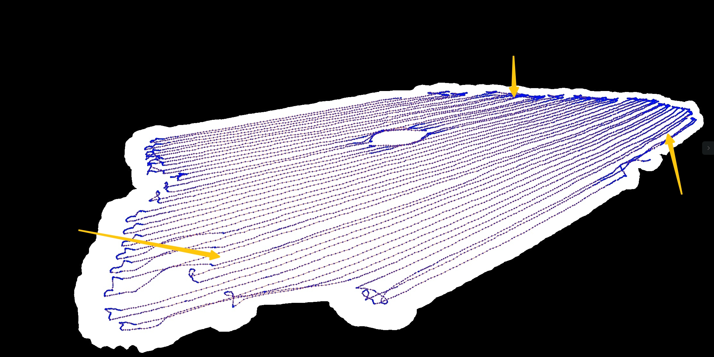
  3. 掉头边界间隔，在0到22.7cm，先弓字再沿边（可能存在部分沿边漏割）
4. 业务逻辑
  1. 根据当地日落时间自动停止工作
  2. 搬桩后，真实割草区域相对桩位置平移，app显示不变（即与实际位置不一致）
  3. 存在双目遮挡检测
5. 异常情况
  1. 建图中搬动，若定位未丢失可继续遥控建图，若丢失则需要回桩重建
  2. 轮子原地打滑，定位不漂
  3. 动态障碍物不影响定位

# 一、建图测试

1. 正常建图的流程先走一遍。 看看正常建图流程
  - 建图行为是啥样的？
    - 遥控建图，闭合回桩，地图学习，回桩，进行割草
      - 地图学习（怀疑此时是有边界后的地图细化）
        - 分别在各个草坪的几个边界区域原地转圈，涵盖草坪内视野，单个草坪学习完成前，地图区域会闪一下（但看边界无明显变化）
  - 回桩后地图是否会再次优化（app上地图回桩前截一张图，回桩后等一段时间再截一张对比看看）？如果优化了地图，大概花费的时间是多少？
    - 未看到地图变动
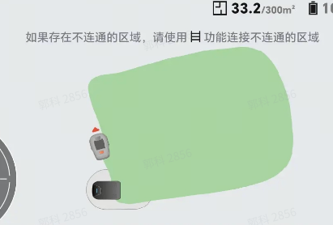

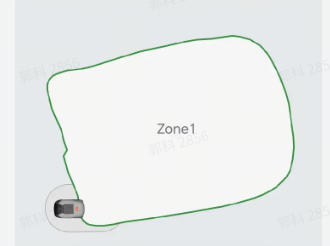
2. 建图中的异常情况测试
  - 建图中是否允许搬起机器？ （搬起后把相机朝下看是否报错，放回后是否可自动重定位到正确位置）
    - 机器抬起后垂直地面，报倾斜故障，解除故障后直接报定位异常，建图失败需要遥控回桩。
    - 机器平行抬起放到前方2米，定位正常，继续遥控建图
  - 从当前位置A，搬动机器后，放置到距离A点1m左右的位置B处，观察机器行为。 
    - 机器在B处是否会有先转圈重定位的动作？
      - **搬动中位姿正常，未触发重定位**
    - 重定位耗时多少？
    - 重定位成功后，是否会回到原先A点？
      - 建图中，直接更新位姿，后续继续遥控
    - 搬起后，后续的建图定位精度如何？（机器的app上定位和机器的实际位置是否一致）
      - 建图定位准确
  - 建图过程中，拖住机器，使得轮子打滑，观察机器行为。
    - 打滑后是否有重定位（定位找回）动作？
      - 打滑过程中定位未漂移
    - 打滑后，建图定位的精度如何？（机器的app上定位和机器的实际位置是否一致）
      - 建图定位准确
    - 遮挡加打滑后精度怎么样
      - 位姿乱后报遮挡
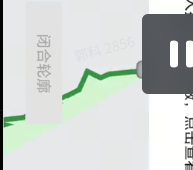
    - 长时间遮挡，出桩前遮挡的机器行为。
      - 如果始终保持遮挡，会报错停机吗？报出的错误是什么？会引导用户清理摄像头吗？
        - 会报错停机，报摄像头被遮蔽请检查，有引导用户解决
3. 多区域建图情况
  - 是否支持多区域建图
    - 最多支持建立3个区域
  - 建完图后，是否支持增/删区域
    - 支持
4. 通道
  1. 通道允许创建的最大长度
    1. 30米，但20米双边墙提示超过30米无法创建（2次）
  2. 窄通道内会不会撞墙，撞墙后能不能自主恢复并走出通道
    1. 通道内不撞墙
  3. 窄通道回充（桩在窄通道内，行走15米后出通道，再点击回充）
    1. 3次均报回充失败，重定位后均可回桩（分别执行1次重定位、1次重定位、3次重定位）

[📎 飞书20260424-115506.mp4](<files/飞书20260424-115506.mp4>)

[📎 飞书20260424-115448.qt](<files/飞书20260424-115448.qt>)

# 二、重定位测试

1. 割草中，抱起机器后，重新放置在草坪上，观察机器的重定位动作。 只需要转圈，还是会走一些特定轨迹？
  1. 原地转360度后，走边长约1米的正方形轨迹，持续进行，可走很远
2. 在区域1建立了地图后，将机器放置在区域1之外的地方，机器是否能重定位成功？如果成功了，定位是否准确？ 后续割草行为是否异常？如果失败了，机器之后的行为是啥？ 直接原地报错停机吗？
  1. 走重定位轨迹，3分钟后重定位成功，报界外停机。
3. 割草中，搬动机器到较远（仍在建图区域内），视角差异较大的位置，是否能重定位上？重定位耗时多少？
4. 割草中，搬动到建图区域外（有共视），是否能重定位上？重定位耗时多少？
5. 割草中，搬动到建图区域外（无共视），是否能重定位上？重定位耗时多少？
6. 直接更换桩的位置（app上不进行操作更换桩位置的处理），在桩附近进行重定位，观察是否成功，定位的位置是否准确？
  1. 割草区域是相对桩位置的，app中也相对搬动之前的桩（看起来好像在正常割草）
7. 更换桩位置后，在app上操作一下更换桩位置，使得app上显示的桩位置更新过来。 然后再在桩的附近进行重定位测试，观察是否成功，定位的位置是否准确？
  1. 不支持更换基站位置

# 三、定位稳定性测试

1. 大概啥样的照度下，机器就不工作了？（重点关注低照度，使用照度计测量）
  1. 苏州0506，晚上18：38分，太阳即将落山，天还较亮（怀疑根据当地日落时间）
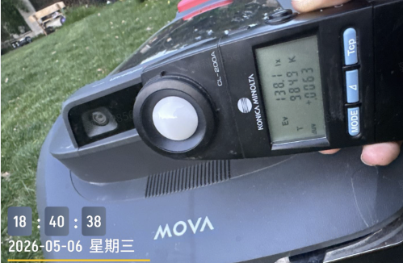

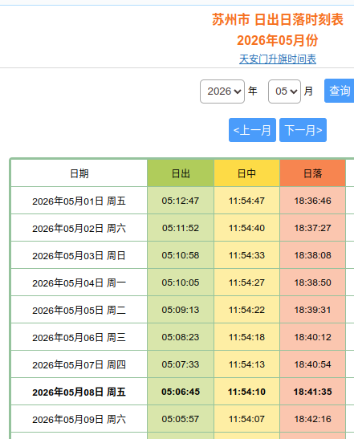
2. 在太阳落山前开始割草，看看太阳落山时刻是否能够自动停止工作。
  1. 能够自动停止
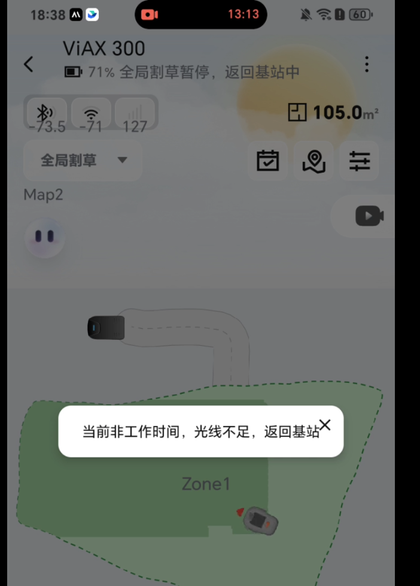
3. 中午建图，傍晚割草，观察机器轨迹是否会出现明显偏差（监控+app录屏）。
  1. 未见明显偏差，5点30割草，天还较亮
4. 割草过程中，动态障碍物（人类）频繁在相机前方走来走去（不形成障碍物），观察机器是否会轨迹异常。
  1. 未见异常
5. 相机脏污或者遮挡的情况下，机器是否会检测报错？
  1. 遮挡相机会后退一下再转一圈后报遮挡
6. 创建通道（上桩通道或者区域通道）后，观察机器是否每次退桩割草都是一样的轨迹？（是否考虑了磨草等问题）
  1. 不一样，考虑了磨草

# 四、slam定位精度衡量办法

## <u>**定性评估方案**</u>

（注意：需要观察机器实际的位置是否出界或者踩到禁区，而不是从app上看）

### 场地要求：

### 测试项

## <u>**定量评估方案**</u>

### 场地需求：

在草地遥控建一个外框10m*10m的图，使弓字的长度为10m。

### 测试项

#### 调头漏割

##### 示意图

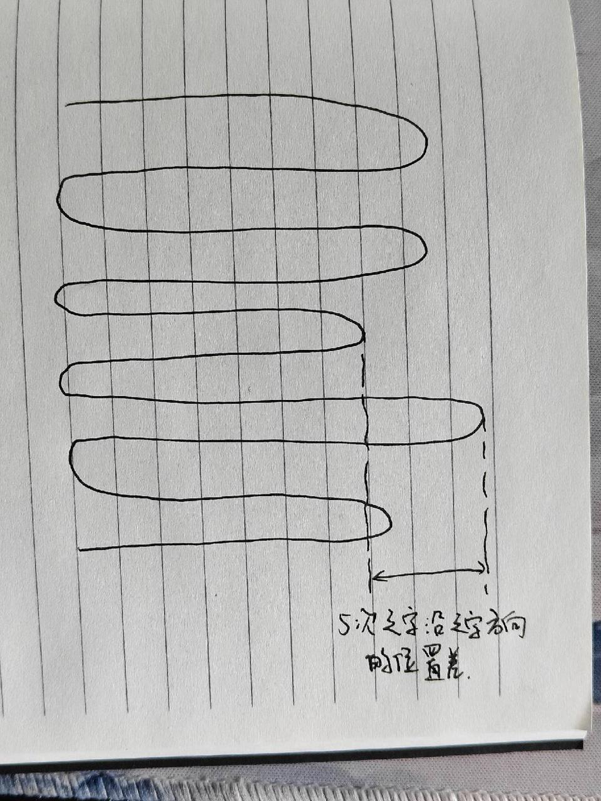

##### 结果

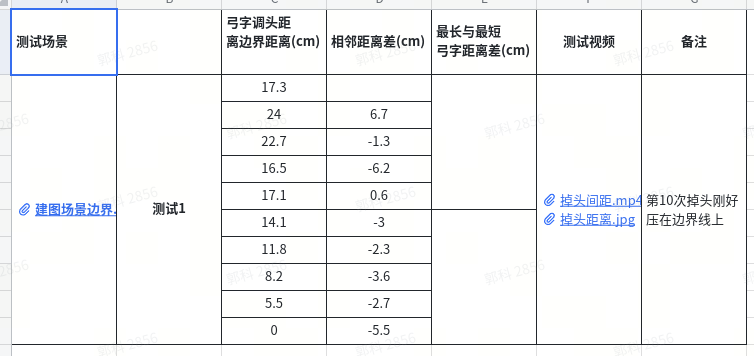

#### 行间漏割

##### 示意图

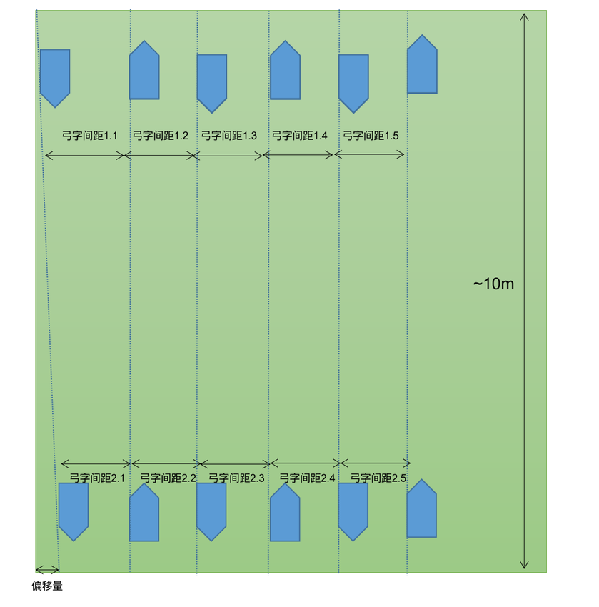

##### 结果

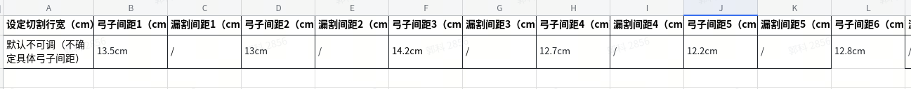

## 边界定位性能（无自主沿边建图功能）

1. 使用线材/障碍物，圈出一片10m x 3m的草地，桩在短边中心，朝向与长边方向平行面向场内

2. 使用割草机自主建图（非割草建图），并且保存完成
3. 场地内的一条长边区域内部一圈，铺非绿色的遮盖物。每隔1m统计机器与边界的距离。
  1. +为边界内距离边界的距离
  2. - 为出边界，与边界的距离
4. 桩转动10°左右，重复b、c两步
  

# 五、新增测试（依据上述结果可能新增）

1. 遮挡相机，触发打滑，看看轮子对于定位有没有影响。
  1. 遮挡会进行检测动作，无法再造打滑
2. 机器的轮子有没有减震
  1. 无
3. 搬动充电桩后，加长时间割草，看看是不是能够姿态恢复回来
  1. 长时间割草，不恢复，直到割完回充

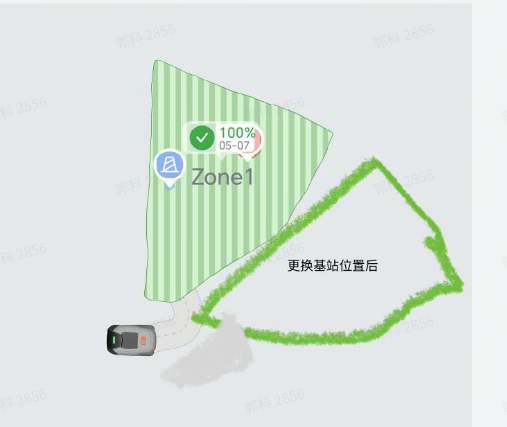
4. 建图完成后，后续的割草时刻，在草坪中间放置一些非草的很矮的东西，看看会不会压过去
  1. 会压
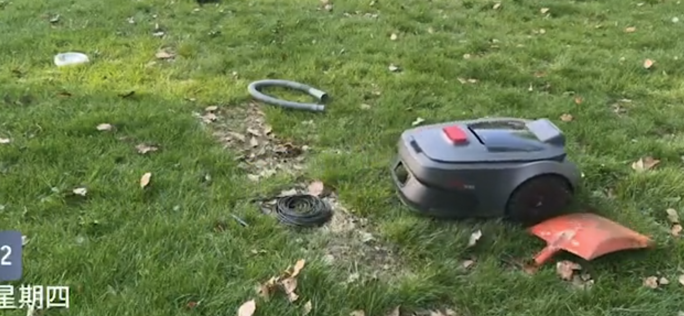
5. 建立多个区域，例如A区 B区域，两个区域距离远一点。  之后删除A区域，删除后，把机器搬动到A区域的位置，出桩重定位，看看是否定位成功？ 或者报错出界？（目的是看一下，删除区域后，建立的地图会不会跟着删除，从而判断分区的地图是一个大地图还是多个子图）
  1. 出桩定位成功，从B搬到A的过程中，实时显示移动，并报错在界外
6. A区域建图成功，搬桩到没有共视关系的B区域割草，割草一段时间后触发重定位，看是否会成功或是一直尝试重定位？观察是否会重定位到新B图上？（测试是否会在新图上进行重定位）
  1. 只能遥控建图，搬动后会在原地等待遥控
7. 

[📄 竞品测试数据记录](https://roborock.feishu.cn/wiki/R31ewPX0iiKCdEkVh3qcC2YznRb?sheet=7DXUu6)