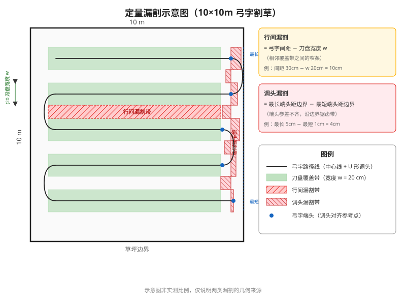

# Mova ViAX 300 纯双目割草机测试用例（现场填写版）

> 目的：针对 **Mova ViAX 300（纯双目视觉、无 RTK、无 LiDAR）** 整理一套有逻辑、可执行、可回填的测试用例，覆盖基础功能 → 重定位 → 搬桩 → 打滑 → 避障 → 高级功能 → 沿边距离 7 大模块。
>
> 本版为**现场填写版**：已移除竞品预期行为信息，请按实测客观记录、避免先入为主。每条只给「前置 / 步骤 / 观察点」，结果自行回填。

---

## 官方能力声明（Mova ViAX 300，型号 MVVV1200）

> 用途：作为测试的"预期能力基线"——实测须验证官方声明是否成立、边界在哪。
> 制造商：Dreame Technology Netherlands B.V.。下列数值取自官方规格分发的经销商规格页（见信息源），如与官方 App/手册不一致以官方为准。

| 能力维度 | 官方声明 |
| --- | --- |
| 适用面积 | ≤ 300 m² |
| 导航 / 建图 | UltraEyes 1.0 双目视觉 AI；无埋线、无 RTK、无 GPS 依赖 |
| 相机 | 双目 + HDR，FOV 120°×70°，检测距离 50 m |
| 避障 | 识别 300+ 物体类型 |
| **最小可通行通道宽度** | **60 cm**（窄于 60cm 需在 APP 配成"通道"才能只通过不割草） |
| 最大爬坡 | 40%（≈22°） |
| 最大越障高度 | 4 cm |
| 割草宽度 | 20 cm |
| 割草高度 | 20–60 mm |
| 割草方式 | U 型路径 + 双模沿边（贴边 / 沿边） |
| 多地图管理 | 双地图（dual-map） |
| 工作速度 / 续航 | 约 25 m/min；约 50–60 min/充（18V 2.5Ah） |
| 防盗 | TrueGuard AI 实时视频巡逻 + 人体检测；GPS 需选配 MOVA Link 模块 |
| 机身 | 约 59.5 × 38 × 27 cm，19.3 kg；前轮驱动 + 全向后脚轮 + 全地形胎 |
| 控制 | MOVAhome App（iOS / Android），无线虚拟边界 |

**信息源**：

- [robotlawnmowershop.co.uk — Mova ViAX 300 规格表](https://www.robotlawnmowershop.co.uk/products/mova-viax-300-robot-lawnmower-grey.html)（最小通道 60cm / 越障 4cm / 爬坡 40% / 双目HDR / FOV 120°×70° / 检测 50m / 双地图）
- [robocleaners.com — MOVA ViAX 300](https://www.robocleaners.com/en/mova-viax-300.html)（UltraEyes 1.0、60cm 窄道、双地图管理、TrueGuard 防盗）
- [inserv.lv — MOVA ViAX 300 (MVVV1200) 技术规格](https://www.inserv.lv/en/products/209893/mova-viax-300-robotic-lawn-mower-wire-free-300m2-ai-navigation-mvvv1200-grey)（割草宽 20cm / 割草高 20–60mm / 爬坡 40% / 速度 25 m/min / 57 dB）
- [castorama.fr — Mova Viax 300](https://www.castorama.fr/robot-tondeuse-connecte-mova-viax-300-18v-5ah-300-m-/6977973410423_CAFR.prd)（机身 59.5×38cm / 18V 2.5Ah / 抬起+雨水传感器 / 防碰撞）
- [electrodepot.fr — MOVA ViAX 300](https://www.electrodepot.fr/robot-tondeuse-dreame-mova-viax-300.html)（U 型割草 / 3 刀片 / 19.3kg / 制造商 Dreame Technology Netherlands B.V.）

---

## 0. 测试总则与环境布置

### 0.1 统一场地

一块复合场地覆盖绝大多数用例，避免反复换场：

```
            窄通道（对标 60cm，≥5m 长）
[草坪 A 18×18m]══════════════════════[草坪 B]
  紧邻充电桩                          离桩远，与 A 无共视
    ▲ 充电桩
```

| 区域 | 要求 |
| --- | --- |
| **草坪 A** | 18×18m，紧邻充电桩；用于基础功能 + 地图内用例（重定位/搬桩的"地图内"分支） |
| **草坪 B** | 离桩远、**与 A 无视觉共视**（中间有墙/通道阻隔）；用于"地图外无共视"用例。能跑一段割草即可（≥ 8×8m） |
| **窄通道** | 长 ≥ 5m，连接 A↔B；宽度对标 Mova 官方声称的最小可通行 **60cm**——主测 **约 60cm 挑战档**，可加 **约 80cm 余量档**。注：窄于 60cm 需在 APP 里配成"通道"才能只通过不割草 |
| **共视过渡带** | A 区边界外 1–2m、仍能看到 A 区已建图特征的位置；用于"地图外有共视"用例 |
| **禁区** | A 区内设 1 个**普通矩形禁区**，用于冲禁区 + 禁区沿边 |
| **障碍物角** | 摆放静态障碍物（桶/箱/活体模型）+ 矮于刀盘的地埋物（喷头）+ 镂空栅栏一段 |

### 0.2 光照档位（纯双目对光照敏感，必测维度）

| 档位 | 定义 |
| --- | --- |
| **白天好光照** | 正常日间，无逆光 |
| **逆光** | 桩/障碍物处于强逆光（验证桩视觉识别在逆光下失败） |
| **黄昏/低光照** | 日落后、曝光不足 |
| **夜间** | 全黑或仅环境弱光（验证工作时段限制 + 纯视觉夜间能力） |

### 0.3 现象记录四档（APP 显示位置 vs 实际位置）

| 档 | 含义 |
| --- | --- |
| 准确 | APP 与实际基本一致 |
| 有偏差 | 看得出偏，但可接受 |
| 明显偏 | 一眼看出错位 |
| 离谱 | 严重不符（显示在通道里实际撞墙）→ 视为假成功 |

### 0.4 重定位动作分类（每条重定位/搬桩观察必勾选）

> 区分"放下即对"和"真有重定位流程"。

| 类别 | 行为 |
| --- | --- |
| **A 无动作** | 放下即定位正确（后台持续位姿融合） |
| **B 隐式** | APP 位置跳变一次后修正 |
| **C 显式·短动作** | 绕障 / 小范围晃动 |
| **D 显式·完整流程** | 自转 360° / 移动找标 / 停下扫视场 |

> ⚠️ 注意区分：「左右 ±45° / 360° 找桩」是**桩搜索**，机器位姿已知、只是不知道桩在哪；不要和**位姿重定位**混淆。

### 0.5 每条用例统一回填字段

`是否成功(是/否)` · `重定位动作类别(A/B/C/D)` · `动作耗时(s)` · `位置档(准确/有偏差/明显偏/离谱)` · `是否假成功` · `失败时机器+APP 行为是否合理` · `重定位后是否续割原任务/进度保留` · `录像/截图编号`

### 0.6 用例统一格式

每条用例按下列结构写，回填字段统一引用 §0.3 现象档 / §0.4 动作类别 / §0.5 回填字段：

- **前置**：地图 / 桩 / 光照状态
- **步骤**：可一次跑完的动作序列
- **观察点**：本条要回答的问题（即回填项）

---

## 1. 建图 & 割草基础功能

> 目的：先确认纯视觉机最基础的"能建图、能割草、能出/回桩"链路，作为后续专项的前置。纯视觉机建图普遍**手动遥控为主**，自主能力归到 §6。

### 1.1 单区手动遥控建图

- **前置**：在桩、白天好光照、无图
- **步骤**：出桩 → 遥控沿草坪 A 边界建图 → 回到起点闭合 → 保存
- **观察点**：
  - 能否完成建图？建图轨迹形态（纯沿边 / 沿边+弓字）？
  - 闭合检测距离（靠近起点多少触发可闭合 / 强制闭合）？
  - APP 建图实时性：运动中是否平滑版、保存时是否切细节版？保存耗时？
  - 起点设置限制（必须在已建草坪外 / 距离要求）？
  - **地图学习阶段**：建图闭合后是否有「地图学习」环节（在各区域边界原地转圈）？学习期间地图是否闪烁变化？学习完成标志是什么？
  - **地图学习后 APP 更新**：学习完成后，APP 上显示的地图轨迹/边界是否有明显更新（对比学习前截图）？更新耗时多久？

### 1.2 多区域 + 通道扩建

- **前置**：已建草坪 A、在桩
- **步骤**：遥控过窄通道到草坪 B → 建 B 区 → 建立 B→A 通道 → 走出通道结束
- **观察点**：
  - 多区域上限（建到第几个区域被拒）？增删区域是否支持？
  - 通道能否成功建立？通道长度上限（尽量拉长测）？
  - 通道建立交互（遥控起点→转圈→遥控终点→走建图，是否需要双向）？

### 1.3 边割边建图（割草建图）

- **前置**：在桩、无图
- **步骤**：启动建图 → 观察是否在建图同时执行割草
- **观察点**：是否支持边割边建？支持时弓字是否更密？

### 1.4 完整割草任务

- **前置**：已有完整地图、在桩、白天好光照
- **步骤**：启动割草 → 沿边 → 弓字 → 自动回桩
- **观察点**：
  - 割草顺序（沿边 N 次 → 沿禁区 → 弓字）？沿边圈数？
  - 是否有自主沿边 / 中间区域探索（纯视觉机普遍无）？
  - 覆盖与漏割（定量项见 §7）？任务能否正常结束并回桩？

### 1.5 出桩 / 回桩行为

- **前置**：已有地图、在桩
- **步骤**：出桩割草 → 任务结束自动回桩；多跑几轮看出桩点/回桩动作
- **观察点**：
  - 出桩是否有随机出桩点 / 随机出桩路径？
  - 回桩寻桩动作（原桩朝向 ±45° 优先 → 360°）？
  - **回桩机制：SLAM 重定位 还是 专用桩标记（红外/二维码）**？（纯视觉路线关键分歧）
  - 桩识别有效距离与逆光表现？

### 1.6 建图断电存盘

- **前置**：建图进行中（约 50%）
- **步骤**：建图途中断电 / 关机 → 重启 → 查看未建完的图是否保留、能否续建
- **观察点**：未建完地图是否还在？能否续建还是必须重建？

### 1.7 中午建图 / 傍晚割草（跨光照基础验证）

- **前置**：白天好光照建图
- **步骤**：中午建图 → 黄昏/低光照启动割草
- **观察点**：割草轨迹相对建图是否有明显偏差（监控 + APP 录屏对照）？

---

## 2. 重定位专项

> 纯视觉机正常工作时**几乎不主动重定位**，通常只在**抱起 / 搬动 / 遮挡**触发。重定位成败**强依赖共视与环境纹理**——落点能否看到老图特征是关键，搬动距离只是表象；因此本模块按**共视**组织（地图内 / 地图外有共视 / 地图外无共视），叠加**建图是否完成**维度，**不单列"距离阈值"测试**。
>
> 每条统一回填 §0.5 字段，动作按 §0.4 勾选 A/B/C/D；重点区分"放下即对（A 类）"与"真有重定位流程（D 类）"，并记录**是否假成功**与**重定位后是否续割原任务**。
>
> ⚠️ 本模块只测"动机器、不动桩"（动桩归 §3）。

### 2.0 用例矩阵总览

| 位置 | 共视 / 纹理 | 用例 | 关注 |
| --- | --- | --- | --- |
| 地图内 | 充分共视 | 2.1 | 抱起原地放回是否需要显式动作 |
| 地图内 | 充分共视 | 2.2 | 短距搬动是否回原始位 a |
| 地图外 | 有共视（边界外 1–2m） | 2.3 | 距边界 1m 内是否允许工作 |
| 地图外 | 无共视（B 区） | 2.4 | 假成功 / 跨图重定位 / 失败行为是否合理 |
| 已建范围外 | 有 / 无共视 | 2.5 | **建图未完成**时搬出（定位丢失 / 边界污染） |
| 任意 | — | 2.6 / 2.7 | 遮挡触发重定位 / 重定位后任务衔接 |

### 2.1 地图内·抱起原地放回

- **前置**：完整地图、机器在地图内正常工作、白天好光照
- **步骤**：抱起 → 原地放回。三个朝向子工况各 3 次：① 朝向一致 ② 偏 90° ③ 抱起转一圈再放回
- **观察点**：
  - 是否有重定位动作（A/B/C/D）？耗时？
  - 放回后位置档？朝向是否识别正确？
  - 是否续割原任务 / 进度是否保留？

### 2.2 地图内·搬动距离档测试（1m / 3m / 5m）

- **前置**：完整地图、机器在地图内
- **步骤**：抱起搬到地图内另一点放下，分三档各测 3 次：**1m / 3m / 5m**（固定搬动方向，落点均在地图覆盖范围内）→ 触发/等待重定位 → 继续任务
- **观察点**：
  - 各档重定位是否成功？动作类别（A/B/C/D）？耗时？位置档？
  - **是否回原始位 a，还是从落点继续？**（各档是否一致？）
  - 随距离增大，成功率 / 动作类别 / 耗时如何变化？

### 2.3 地图外·有共视（共视过渡带）

- **前置**：地图建完；机器搬到 A 区边界外 1–2m、**仍能看到 A 区已建图特征**
- **步骤**：搬到共视过渡带放下 → 触发/等待重定位 → 尝试启动割草
- **观察点**：
  - 能否重定位回老图？位置档？
  - **距边界 1m 内是否允许工作**？是否报出界？
  - 失败时行为：原地报错 / 自转-前进-自转 / 持续重定位？

### 2.4 地图外·无共视（B 区）

- **前置**：A 区建完；机器搬到与 A **无共视**的 B 区
- **步骤**：搬到 B 区放下 → 开始割草 / 触发重定位 → 持续观察 ≥ 5min
- **观察点**：
  - 会成功重定位，还是一直尝试？
  - 是否重定位到错误位姿（**假成功**）？是否建新图？**是否具备跨图全局重定位**？
  - 失败时行为是否合理（原地报错 / 瞎走出界 / 持续重定位不报错）？

### 2.5 建图未完成时搬到「已建部分覆盖范围之外」

> 说明：建图未完成时只有一张**部分地图**，所以这里的"内/外"指**已建部分覆盖范围**的内/外，不是完整地图；"有/无共视"指落点**能否看到已建部分的特征**。

- **前置**：A 区建图至约 50%（**未闭合**），仅有部分地图
- **步骤**：抱起搬到**已建部分覆盖范围之外**放下（按落点能否看到已建特征分"有共视 / 无共视"各测）→ 观察建图能否继续
- **观察点**：
  - 定位是否丢失？丢失是否导致**建图终止**（须重建）？
  - 能否在落点续建并与已建部分拼接？
  - **"抱着走"的空中轨迹是否被记进地图边界**（边界污染，已知产品 bug）？落地后边界是否变成"抱起↔放下两点连线"？

### 2.6 相机遮挡触发重定位

- **前置**：完整地图、正常工作
- **步骤**：工作中用遮光物盖住双目 → 观察触发行为 → 揭开
- **观察点**：是否触发重定位？**立刻触发还是走一段才报**？报错语义是否清晰？（脏污/避障维度见 §5）

### 2.7 重定位后任务衔接

- **前置**：任一重定位成功的用例之后
- **步骤**：观察重定位成功后机器从哪里继续
- **观察点**：是否续割原任务断点 / 进度是否保留 / 还是从重定位位置重新开始？

---

## 3. 搬桩专项

> 与 §2"动机器、不动桩"相反，本模块只**动桩**。按 **桩位变化时态（建图中 / 割草中 / 桩上）× APP 是否同步桩位 × 搬桩距离（近 / 远 / 无共视）** 组织。
>
> 关注点：搬桩后**区域是否跟桩平移**、机器实际位置与 APP 显示是否一致、**回桩靠什么机制**（SLAM 重定位 / 专用标记）。

### 3.1 建图中移桩

- **前置**：建图进行中
- **步骤**：建图约 50% 时物理移桩（位移明显）→ 继续建图 → 尝试回桩
- **观察点**：能否继续建图？能否回桩？**建图完成后 APP 桩位是否更新**？

### 3.2 割草中移桩

- **前置**：完整地图、割草中
- **步骤**：割草中物理移桩 → 观察
- **观察点**：能否继续割草？是否出界？能否正常回桩？**区域是否跟桩平移**？

### 3.3 桩上移桩（机器停在桩上时移桩）

- **前置**：机器停在桩上
- **步骤**：机器在桩上时物理移桩 → 观察 APP + 后续出桩/割草
- **观察点**：**APP 地图位置是否跟桩变化**？后续出桩/割草是否错乱？是否弹"桩位置变化"警告？

### 3.4 单独搬桩·APP 不操作（含距离档）

- **前置**：完整地图、机器工作中
- **步骤**：单独把桩搬到新位置、**APP 不做任何操作** → 机器尝试回桩。距离分档各测：**近（约 1m）/ 远（约 3m）**
- **观察点**：机器去哪找桩？能否回桩？**区域是否跟桩平移导致工作区跑到原区外**？机器实际位置 vs APP 显示？随距离增大识别成功率变化？

### 3.5 单独搬桩·APP 操作换桩位置

- **前置**：完整地图
- **步骤**：搬桩后在 APP 上操作"更换桩位置"使 APP 桩位更新 → 机器回到新桩附近触发重定位
- **观察点**：**APP 是否提供换桩入口**？换桩后区域如何处理（是否仍平移）？重定位是否成功 / 准确 / 假成功？

### 3.6 搬桩到无共视 B 区

- **前置**：A 区建图成功
- **步骤**：把桩搬到与 A **无共视**的 B 区 → 机器在 B 区开始割草 → 一段时间后触发重定位
- **观察点**：会成功重定位还是一直尝试？是否重定位到 B 区新位姿？**是否建新图**？还是以桩为原点跑旧图（无跨图全局重定位）？失败行为是否合理？

### 3.7 桩识别有效距离扫描（含逆光）

- **前置**：固定场景；分**白天好光照 / 逆光**两组
- **步骤**：桩从 0.5m 步进到 5m，每个距离正对 / 偏 ±30° / ±60° 各 3 次，记录能否识别到桩 / 回桩
- **观察点**：桩识别有效距离上限？偏角对识别的影响？**逆光下是否识别失败**？

### 3.8 搬桩后机器重定位：地图坐标系锚定在搬桩前还是搬桩后

- **前置**：完整地图；将桩平移约 2m
- **步骤**：搬桩（约 2m）后出桩割草 → 割草开始后立即抱机器放到地图内不同位置（选 5 个均匀分布的位置，每次 3 次）→ 触发重定位 → 观察后续割草行为
- **观察点**：
  - 重定位是否成功？
  - 成功后割草路径是以**搬桩前的地图边界**为准，还是以**搬桩后（平移了的）地图边界**为准？
  - 两次结果（搬桩前 vs 搬桩后区域）机器实际割草位置与 APP 显示是否一致？

---

## 4. 打滑专项

> 验证轮子打滑（拖拽 / 空转 / 按住）时定位是否漂移、是否有找回动作，以及**是否依赖轮速 odom**（纯视觉机若 VIO/VSLAM 高频跟踪够稳，打滑几乎不影响）。
>
> 行为推断：打滑几乎不影响位姿 → 疑不依赖 odom 或 odom 权重低；打滑后明显漂移 → 依赖 odom。

### 4.1 建图中拖拽 / 按住轮子打滑

- **前置**：手动建图中
- **步骤**：拖住机器尾部 / 按住轮子使轮子打滑 5s → 释放 → 继续建图
- **观察点**：打滑后是否有重定位 / 找回动作（A/B/C/D）？定位是否仍准（APP vs 实际）？是否有提示？

### 4.2 长时间打滑

- **前置**：建图 / 割草中
- **步骤**：持续打滑（抬轮空转）较长时间 → 观察
- **观察点**：定位是否累积漂移？是否触发异常 / 找回？是否进脱困？

### 4.3 打滑 + 双目遮挡组合

- **前置**：建图中
- **步骤**：用遮光物遮挡双目 → 拉住机器尾部 5s 打滑 → 释放 → 揭开遮挡
- **观察点**：**视觉失能下打滑**定位精度如何（APP vs 实际）？是否有找回动作？是否提示？

### 4.4 贴边 / 贴障打滑（可选）

- **前置**：完整地图、割草中
- **步骤**：贴墙 / 灌木 / 障碍物割草，自然产生打滑 → 观察 ≥ 5min
- **观察点**：是否丢定位？是否出界？

### 4.5 颠簸路面（石板路 / 石子路 / 坑洼，可选）

- **前置**：含颠簸路面的场地（石板路 / 石子路 / 严重坑洼任一），建图约 50 平
- **步骤**：正常建图 → 割草 3 次 → 全程监控观察轨迹
- **观察点**：弓字轨迹是否均匀平滑？是否出界？是否漏割？颠簸路面上定位是否漂移（与平坦草地对比）？

---

## 5. 障碍物避障专项

> 观察**识别距离 → 避障动作 → 避障后行为**三段。覆盖静态 / 动态 / 矮障 / 镂空 / 活体 / 类物体显示。末尾附**相机遮挡失效**一节（感知失效而非避障）。

### 5.1 静态障碍物避障

- **前置**：完整地图、割草中；障碍物角摆桶 / 箱
- **步骤**：机器朝静态障碍物行进 → 观察
- **观察点**：**识别距离**（障碍被识别前的距离）？避障动作（掉头 / 绕障）？避障后与障碍的距离？

### 5.2 动态障碍物避障（人穿过）

- **前置**：割草中
- **步骤**：人 / 移动物从机器前方穿过 → 观察
- **观察点**：**反应时间**（识别到障碍 → 停止 / 绕行）？动作？穿过后 APP 位置是否正确？

### 5.3 弓字 / 沿边遇障动作

- **前置**：割草中
- **步骤**：分别在弓字段、沿边段前方设障 → 观察
- **观察点**：弓字遇障动作（掉头 / 绕）？沿边遇障动作？遇障后是否漏割？

### 5.4 矮障 / 地埋物 / 镂空栅栏 / 活体（类物体）

- **前置**：障碍物角布置：地埋喷头（< 刀盘高度）、镂空网状栅栏一段、静止活体模型
- **步骤**：分别靠近各类物体（含沿边经过、转弯经过、突然窜出）→ 观察
- **观察点**：
  - 矮于刀盘的地埋物（喷头）转弯时是否剐蹭？
  - 镂空 / 网状栅栏是否识别避让、是否碰撞剐蹭（落地 + 悬空）？
  - 静止活体沿边是否剐蹭？突然窜出活体是否避开？
  - 落叶堆 / 被草遮挡的电线如何处理？

### 5.5 APP 障碍类别显示

- **前置**：避障发生时
- **步骤**：避障时看 APP 是否显示障碍类别 / 位置
- **观察点**：APP 是否显示检测到的障碍类别？障碍位置是否显示？

### 5.6 坡面避障（如有坡场地，可选）

- **前置**：≥ 15° 坡场地
- **步骤**：坡面上设障 → 观察避障能力
- **观察点**：坡面上能否正常避障 / 工作？

### 5.7 相机脏污 / 遮挡（感知失效，附节）

- **前置**：分**出桩前 / 工作中**两时态
- **步骤**：双目脏污（泥点 / 雨淋 / 倒水）或遮挡 → 观察
- **观察点**：是否检测脏污 / 遮挡？报错语义是否清晰？出桩前遮挡 vs 工作中遮挡行为差异？清理后能否恢复（自愈 / 须返桩）？
  - **脏污不报错时的精度**：若脏污程度较轻未触发报错，割草轨迹是否仍正常（弓字均匀、无出界）？

---

## 6. 高级功能

> AI 自主能力、窄通道、工作时段、边界修改——这些是纯视觉机能力分档的主要区分点。

### 6.1 自主建图能力

- **前置**：在桩、无图
- **步骤**：尝试触发完全自主建图（不遥控）→ 观察
- **观察点**：是否支持完全自主建图？自主建图条件（是否需明显草/非草边界纹理）？无明显边界处是否停住不过去？

### 6.2 自主沿边

- **前置**：已建图
- **步骤**：割草任务 → 观察是否自主沿边
- **观察点**：建图后 / 割草时是否自主沿边？沿边精度（距边界多少）？

### 6.3 窄通道通行（对标官方 60cm）

- **前置**：约 60cm 窄通道（连接 A↔B），另可加 80cm 余量档
- **步骤**：建通道 → 割草反向通过通道 → 中段抱起转 90° 放回 → 观察能否走出
- **观察点**：
  - 能否建通道？**60cm 能否通行**（验证官方声明）？窄于 60cm 是否须在 APP 配成"通道"才能只通过不割草？
  - 通道内 APP 显示 vs 实际？是否磕碰角壁？磕碰时 APP 是否仍在通道内？
  - 每次通过轨迹是否一致？

### 6.3.1 通道内启动回桩（附加项）

- **前置**：桩在通道外（出口处），机器在通道内部（距出口 ≥ 10m）
- **步骤**：机器在通道内部，直接发起回桩指令 → 观察
- **观察点**：能否成功回桩？失败时行为（报错 / 重定位 / 原地等待）？失败后遥控到桩附近触发重定位后能否回桩？

- **前置**：L 型通道，转弯 90°±10°，前后段各 ≥ 3m
- **步骤**：遥控过 L 型通道建图 → 转弯处抱起转 180° 放回 → 反向通过
- **观察点**：转弯处轨迹是否连续？是否磕碰角壁？180° 转向后朝向是否识别正确？反向通过成功率？

### 6.5 工作时段 / 夜间

- **前置**：分黄昏 / 夜间
- **步骤**：夜间 / 低光照尝试建图 + 割草；接近日落观察是否主动停工
- **观察点**：是否限制工作时段？**按日出日落硬限制还是按实测亮度**？夜间纯视觉能否工作？是否有时间缓冲设置？改系统时间是否影响？

### 6.6 边界修改

- **前置**：已建图
- **步骤**：在 APP 修改地图边界（外扩 / 内缩）→ 保存 → 割草验证
- **观察点**：是否支持边界修改？可修改/可闭合范围？修改后与通道、禁区的关系（是否冲突、是否需重新沿边）？修改后实际割草边界是否对齐？

### 6.7 异型草地——长条形（30m×3m）

> 长条形草地对纯视觉机是挑战场景：两侧视觉特征少、弓字极短，类似走廊定位条件。

- **前置**：可建 30m×3m 长条形草地（长宽比约 10:1）
- **步骤**：遥控建 30m×3m 边界 → 割草 → 观察全程轨迹
- **观察点**：弓字轨迹是否均匀平滑？是否出界？是否漏割（短弓字端头）？定位是否在长条端头处出现漂移？

---

## 7. 割草沿边距离测量

> 量化沿边贴边的设定值 vs 实际偏差，以及漏割。纯视觉机沿边精度直接影响"贴边好不好看"和"会不会跨边/压硬路"。

### 7.1 沿边贴边距离测量（设定 vs 实测）

- **前置**：完整地图、草坪沿边段
- **步骤**：设不同贴边档位（参考 Mova 的 5 / 10 / 15cm）→ 割草后用卷尺实测机身/刀盘距边界的实际距离
- **观察点**：每档**设定值 vs 实测偏差**？各档是否有问题（贴太近压硬路 / 贴太远漏边 / 触发打滑）？正数档是否跨边切割？

### 7.2 草坪 / 禁区 / 障碍物沿边

- **前置**：含矩形禁区 + 障碍物的地图
- **步骤**：分别观察草坪沿边、禁区沿边、障碍物沿边
- **观察点**：各类沿边的距离 / 次数 / 行进速度？禁区沿边是否割到禁区内？

### 7.3 直角边界 / 基站周围漏割

- **前置**：含直角边界的地图、桩周围
- **步骤**：割草完成后检查直角处、基站周围覆盖
- **观察点**：直角边界处是否漏割？基站周围是否漏割？最大漏割宽度？

### 7.4 定量漏割（10×10m 规整草坪，可选）

- **前置**：遥控建 10×10m 外框、弓字长约 10m
- **步骤**：完整割草后目测量化



> 图：定量漏割两类来源——行间漏割（相邻弓字覆盖带之间的窄条）与调头漏割（弓字端头参差形成的沿边界锯齿带）。

- **观察点**：
  - **调头漏割**：弓字端头是否对齐？最大与最小弓字距边界距离差约多少 cm？
  - **行间漏割**：相邻弓字间是否有明显漏割带？最大漏割约多少 cm？

---

## 附录 C：长期稳定性测试方案

> 与 §1–§7 行为验证版不同，本附录关注**低算力平台（RK3562 + 2G RAM）下的长期性能稳定性**——同一建图执行多次割草，观察定位精度是否随时间或次数衰减。
>
> 执行节奏：**每日早、中、晚三个时段各执行 2 次全局割草**；整个测试期间桩不能动（建议螺钉固定到地面，避免角度和位置变化）。
>
> 本方案可在 §1–§7 行为验证通过后单独执行。

### C.1 出界稳定性

- **场地**：分别在以下 4 类场景各建一张图（约 10×10m）：房子周围非空旷场景、空旷草地中心、凹型三面墙（U 形）、湖边（离湖水 ≥ 2m）
- **建图要求**：遥控走正方形路径，对行走轨迹做地面标记（偏差控制在 10cm 内，尽量沿草地边界/墙角）
- **步骤**：同一场景建图 1 次 + 每日早中晚各割草 2 次，持续观察
- **观察点**：是否出界？是否撞墙？出界次数随割草次数是否累积？哪个场景出界率最高？

### C.2 漏割稳定性

- **场地**：同 C.1 四类场景，架设高处监控摄像头（能拍到完整割草轨迹）
- **步骤**：同一场景建图 1 次 + 每日早中晚各割草 2 次，收集对应时间全程监控视频
- **观察点**：弓字间隔是否均匀（对比 §7.4 基准值 12.2–14.2cm）？漏割面积随割草次数是否变化？不同时段漏割情况是否有差异（光照变化影响）？

### C.3 通道行走稳定性

- **场地**：分别在石板路、石子路、空旷草地中心、窄通道（≤15m，避免建图失败）、凹型三面墙内、墙边建立约 25m 回桩通道，并做路径标记
- **步骤**：割草 2 分钟后回桩，观察走通道时的轨迹偏差，**重复 10 次**
- **观察点**：通道内是否出界？轨迹偏差是否在 10cm 以内？随重复次数偏差是否累积？哪类路面偏差最大？

### C.4 困难场景稳定性

| 场景                     | 操作                | 观察点                 |
| ---------------------- | ----------------- | ------------------- |
| **颠簸路面**（石板/石子/坑洼/跑机台） | 建图约 50 平 + 割草 3 次 | 弓字轨迹是否均匀平滑？是否出界/漏割？ |
| **斜坡**（约 20°）          | 建图 + 割草，观察轨迹      | 是否出界？弓字是否平行于等高线？    |
| **长条形草地**（约 30m×3m）    | 建图 + 割草           | 弓字是否均匀？端头是否漂移？      |
