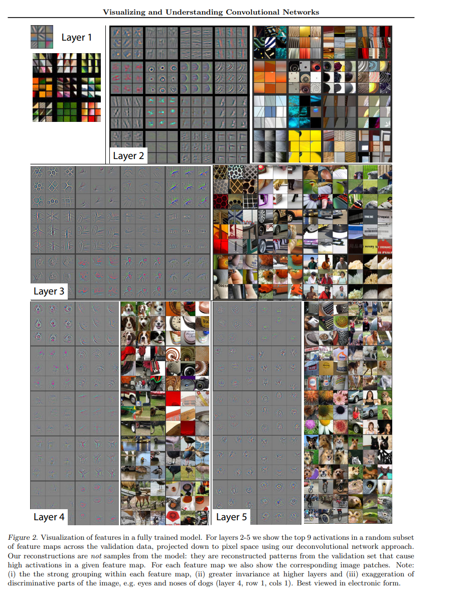
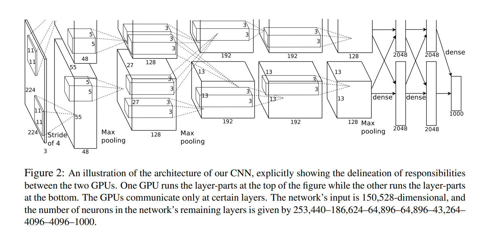
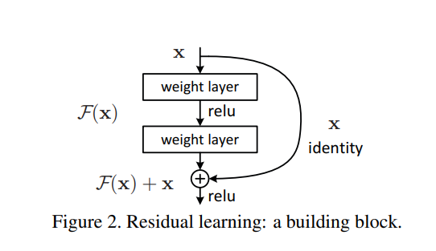
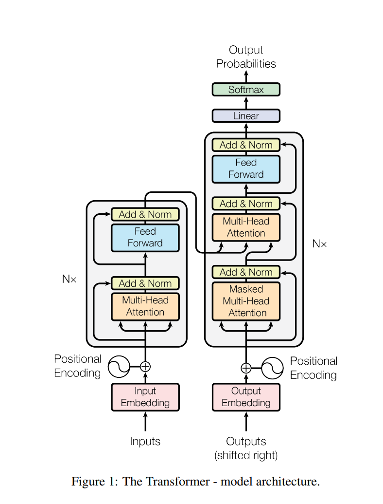
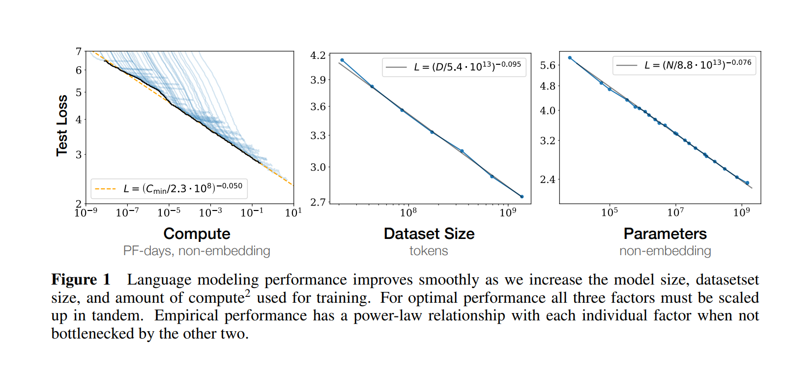
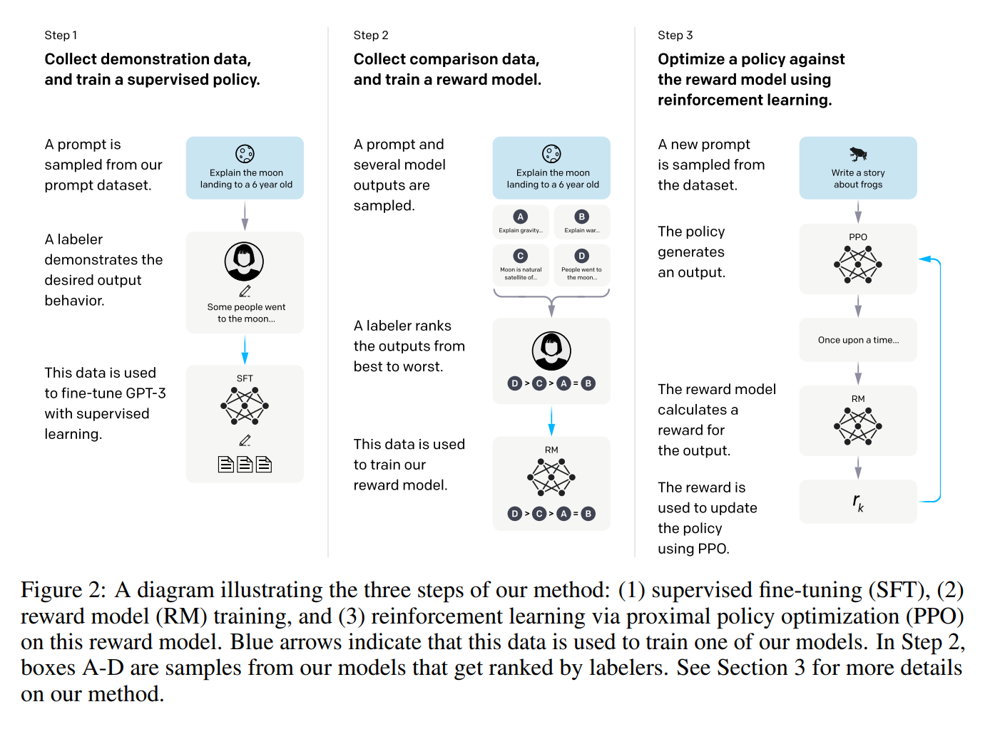
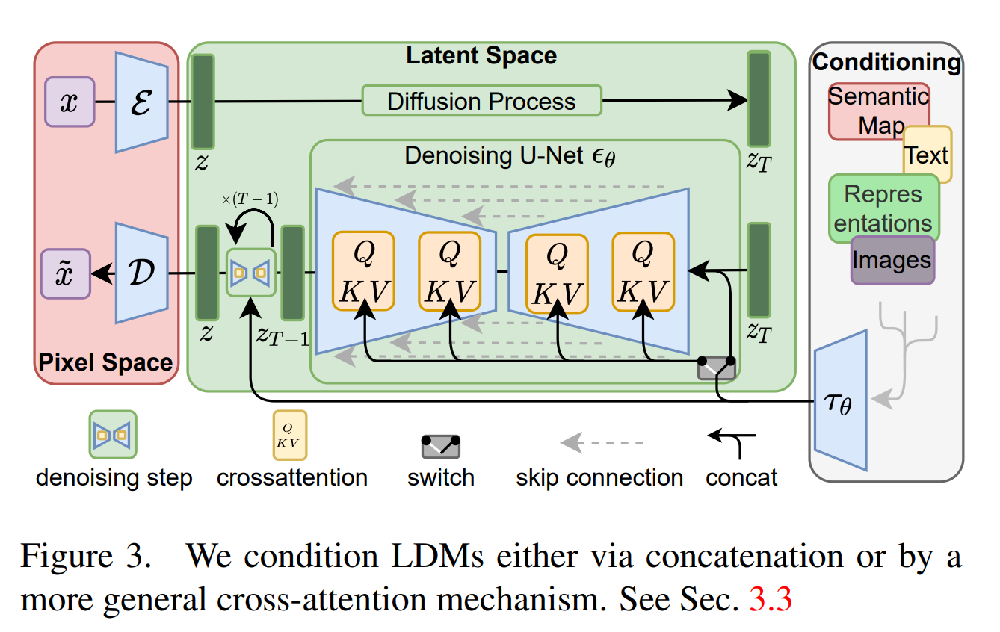
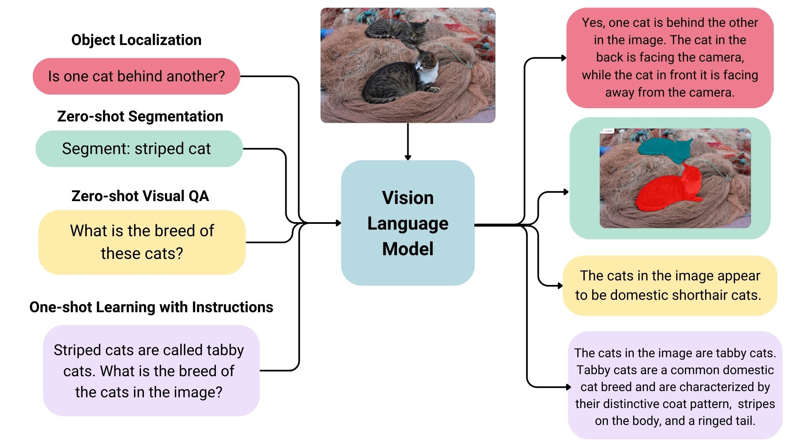
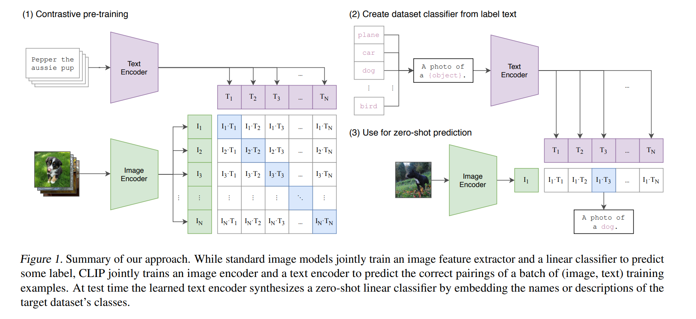

# AI 演进笔记 （2012-2026） 

## 1. 整体趋势

2012-2026 间 AI 演进经历 4 个 foundation 阶段（判别式 → Transformer → Diffusion 与视觉生成 → VLM 与多模态理解）与 2 个延伸方向（具身 VLA / World Models 近期形态）。时间线：

- **2012-2015 判别式 AI**：AlexNet （NeurIPS 2012） / VGG / GoogLeNet / ResNet （CVPR 2016） — CNN 端到端特征学习；
- **2017 Transformer**: Vaswani et al. — self-attention 替代 RNN，LLM 工业化基础；
- **2020-2022 LLM scaling**: GPT-3 (NeurIPS 2020) / Chinchilla (NeurIPS 2022) / ChatGPT (2022-11); 
- **2020-2024 Diffusion 与视觉生成**：DDPM （NeurIPS 2020） → Stable Diffusion （2022-08） → Sora （2024-02）；
- **2020-2024 VLM 与多模态理解**：CLIP （ICML 2021） → GPT-4V （2023-09） → LLaVA （NeurIPS 2023）；
- **2023-2026 具身 VLA**：RT-2 （2023-07） → π₀ （2024-10） → π₀。7 (2026-04-16) / Helix 02 (2026-01) / GR00T N1.7 (2026-04-17); 
- **2024-2026 World Models 近期形态**：Genie 3 （2025-08） / Cosmos （2025-01 起）；

## 2. 第一阶段：判别式 AI （2012-2015）

2012 年前后的判别任务仍以分类、检测、序列输出为目标；变化发生在中间表示。图像识别等任务从「人工特征 + classifier」转向端到端训练，特征由神经网络从数据中学习。CNN、RNN、ResNet 分别处理这条路线上的 3 个问题。

- **CNN**：raw RGB pixel 直接进入网络，替代 SIFT / HOG 等人工特征；
- **RNN / LSTM**：同一端到端训练方式扩展到翻译、语音等序列任务；
- **ResNet**：在网络继续加深时，通过残差连接缓解优化退化。

后续 Transformer、Diffusion、VLM、VLA 的任务形式已经超出判别任务，但仍复用这一阶段留下的视觉 backbone，以及残差连接、归一化、GPU 端到端训练等深网络工程组件。

### 2.1 CNN：视觉端到端特征学习

2012 年前后的图像识别系统通常分两段：人设计图像特征，模型基于这些特征做分类。AlexNet 把两段合入同一个网络：输入 raw RGB pixel，卷积层学习边缘、纹理、物体部件，softmax 输出类别。

AlexNet 在 ImageNet ILSVRC-2012 上 top-5 错误率为 15.3%，第二名为 26.2%[1]。该结果对应的系统分工变化是：特征由网络在监督信号下学习，而非主要依赖人工规则。

AlexNet 之后，VGG 和 GoogLeNet 继续沿端到端 CNN 路线处理两个工程问题：

- **VGG**：全部用 3×3 卷积堆深网络，验证重复 block 也能形成强视觉表示[2]；
- **GoogLeNet / Inception**：在同一层里并联不同尺度的卷积分支，用更少参数处理多尺度视觉模式[3]。

CNN 解决的是「一张图如何变成可分类的视觉特征」。当输入变成句子或语音时，问题多了一个时间轴：模型不能只看一张固定大小的图，还要按顺序读入一个变长序列。

### 2.2 RNN：序列建模

RNN 在第 `t` 个 token 处同时使用当前输入 `x_t` 和前一时刻的 hidden state `h_{t-1}`。hidden state 在时间步之间递归传递，使模型能够处理句子、音频片段和时间序列。

普通 RNN 的问题是长序列训练不稳定。LSTM 在 1997 年提出 cell state 和 input / forget / output 三个门控，用显式的记忆通路缓解梯度衰减[4]。到 2014 年，seq2seq 把 RNN / LSTM 组织成 encoder-decoder：encoder 读入源句子，decoder 生成目标句子[5]。

这条路线把端到端学习从图像扩展到翻译和语音。Deep Speech 在 2014 年使用深度 RNN 处理语音识别[7]；Bahdanau attention 让 decoder 在生成每个词时关注源句子中的相关位置，降低对单一 encoder 向量的依赖[6]。

RNN 的结构瓶颈来自时间步依赖：第 `t` 步依赖第 `t-1` 步，训练和推理难以并行；长距离信息需要逐步传递，路径变长后更难保留。2017 年 Transformer 用 self-attention 直接连接任意两个 token，替换了 RNN 的递归结构[8]。

### 2.3 ResNet 与残差连接

CNN 和 RNN 说明表示可以由网络学习。继续加深网络可以提升表示能力，但普通 CNN 从 20 层加到 56 层时，训练误差和测试误差同时升高[9]。

该现象不能用过拟合解释。过拟合通常表现为训练误差下降、测试误差升高；这里训练误差也升高，问题来自优化退化。更深的普通网络理论上可以通过额外层学习恒等映射来复现浅层网络，实际 SGD 很难自动得到该解[9]。

ResNet 把每个 block 的目标从直接学习 `y = F(x)`，改成学习残差 `y = F(x) + x`[9]。

当 `F(x)` 接近 0 时，残差 block 退化为恒等映射。反向传播时，梯度可以沿 `+x` 的恒等分支传回浅层。残差连接给优化器提供了更直接的梯度路径，因此 152 层 ResNet 可以在 ImageNet 上训练，并在 ILSVRC 2015 分类任务上取得 3.57% top-5 错误率[9]。

残差连接后来进入多类深网络架构。Transformer 每个 attention / FFN 子层外都有 `x + Sublayer(x)`[8]；Diffusion U-Net 也使用跨层 skip connection。CNN 的卷积和 RNN 的循环绑定具体输入结构；残差连接的作用更通用，核心是给深层网络的信息和梯度提供更短路径。

CNN、RNN、ResNet 共同构成这一阶段的主线：模型先从图像和序列中学习表示，再通过残差连接支持更深网络训练。第二阶段的 Transformer 与这条主线有两层关系：用 self-attention 替换 RNN 的递归结构，改善序列建模的并行性和长距离依赖；沿用 ResNet 的残差连接，使更深的序列模型可以稳定训练。

### References

- [1] Krizhevsky et al., ImageNet Classification with Deep Convolutional Neural Networks (AlexNet), NeurIPS 2012.
- [2] Simonyan & Zisserman, Very Deep Convolutional Networks for Large-Scale Image Recognition (VGG), ICLR 2015. arXiv:1409.1556
- [3] Szegedy et al., Going Deeper with Convolutions (GoogLeNet / Inception), CVPR 2015. arXiv:1409.4842
- [4] Hochreiter & Schmidhuber, Long Short-Term Memory, Neural Computation 1997.
- [5] Sutskever et al., Sequence to Sequence Learning with Neural Networks, NeurIPS 2014. arXiv:1409.3215
- [6] Bahdanau et al., Neural Machine Translation by Jointly Learning to Align and Translate, ICLR 2015. arXiv:1409.0473
- [7] Hannun et al., Deep Speech: Scaling up end-to-end speech recognition, arXiv 2014. arXiv:1412.5567
- [8] Vaswani et al., Attention Is All You Need, NeurIPS 2017. arXiv:1706.03762
- [9] He et al., Deep Residual Learning for Image Recognition, CVPR 2016. arXiv:1512.03385

---

## 3. 第二阶段：Transformer 范式 （2017-2026）

Transformer 的核心问题是序列建模：给定一段文本，模型需要为每个 token 建立与其它 token 的依赖关系。RNN 通过 hidden state 按顺序传递上下文；Transformer 用 self-attention 一次性计算 token 间相关性，使训练并行性和长距离依赖建模同时改善[1]。

后续 Scaling Law、GPT-3、ChatGPT 与 RLHF，分别沿着模型规模、少样本泛化和人类偏好对齐继续扩展这条路线。

### 3.1 [Transformer](https://jalammar.github.io/illustrated-transformer/)：注意力机制

Transformer (Vaswani et al.，NeurIPS 2017）[1] 用 self-attention + position-wise FFN 取代 RNN 循环结构与 CNN 卷积。Self-attention 将每个 token 映射为三组向量：

- Query：当前 token 用于匹配其它 token 的查询向量；
- Key：其它 token 用于被匹配的键向量；
- Value：匹配后参与加权汇总的值向量。

Scaled dot-product attention 用 Query 和 Key 的相似度计算权重，再对 Value 做加权汇总。Multi-head attention 并行计算多组 Q/K/V，使模型在不同表示子空间中建模 token 关系[1]。

在 WMT'14 EN-DE 翻译任务上 BLEU 28.4，超过当时 RNN encoder-decoder baseline 25.16[1]。

#### 3.1.1 关键设计

- **Attention 机制**：Scaled dot-product $\operatorname{Attention}(Q, K, V)=\operatorname{softmax}\left(\frac{Q K^T}{\sqrt{d_k}}\right) V$ [1]，$\sqrt{d_k}$ 缩放用于避免 dot product 过大后 softmax 过早饱和。
- **Position encoding**：Self-attention 不包含词序信息；Transformer 给每个 token 加入 positional encoding，让表示同时包含词义和位置。原始 Transformer 使用 sin/cos 固定位置编码，后续 LLM 多使用 RoPE 等位置编码方案。
- **架构组合**：原始 Transformer 采用 encoder-decoder 结构；每个 attention 或 FFN 子层外加残差连接和 LayerNorm，即 `LayerNorm(x + Sublayer(x))`，其中残差连接沿用了 ResNet 的 `F(x) + x` 思路[2]。

#### 3.1.2 工程后果

- **并行训练**：RNN 的状态递推存在时间步依赖；self-attention 将 token 两两关系表示为矩阵，训练时可并行计算。
- **长距离依赖**：RNN 中远距离信息需要经过多个 hidden state 传递；self-attention 中任意两个 token 可在同一层建立依赖。

#### 3.1.3 三派与影响

Transformer 后来形成三种常见用法，差异主要在输入读取和输出生成方式：

- **encoder-only** (BERT, Devlin et al.，NAACL 2019）[3]：整句一起读，用 masked language modeling 训练模型根据上下文补全被遮住的词。它输出的是上下文语义表示，主要用于文本分类、实体识别、句子匹配等语言理解任务[3]。
- **decoder-only** (GPT, Radford et al.，2018）[4]：只看当前位置左侧上下文，用 causal language modeling 训练模型预测下一个 token。生成时每次输出一个 token，再把该 token 接回上下文继续生成；这一自回归形式后来成为 LLM 的主流结构[4]。
- **encoder-decoder** (T5, Raffel et al.，JMLR 2020）[5]：encoder 先读输入文本，decoder 再生成输出文本。T5 把翻译、摘要、分类、问答等任务都改写成「文本输入 → 文本输出」格式，因此不同 NLP 任务可以用同一套模型结构和训练形式处理[5]。

Attention 机制本身在 Bahdanau et al.（ICLR 2015）[6] 中已用于 NMT（Neural Machine Translation，神经机器翻译）：生成目标语言每个词时，模型会动态关注源语言句子中最相关的位置。Transformer 的变化，是把 attention 从辅助模块变成整套网络的主干。

### 3.2 Scaling Law 与 GPT-3

Transformer 给出了可并行训练的结构，下一步问题转向规模扩展：参数、数据、算力增加后，模型 loss 如何变化。Kaplan et al.（OpenAI 2020）[7] 用实验拟合出 LLM cross-entropy loss 与参数量 N、数据量 D、计算量 C 的幂律关系：

这条曲线把大模型训练转向可估算的工程扩展问题：给定 compute budget 后，可以估计参数量、训练 token 数和最终 loss 之间的关系。工程重点也从频繁更换新架构，转向 scale 现有架构、配数据和调训练流程。

#### 3.2.1 GPT-3 (2020)

GPT-3 (Brown et al.，NeurIPS 2020）[8] 175B 参数，300B token 训练，展示了 in-context learning：

- 不更新模型参数，只在 prompt 中给少量任务示例，模型就能按示例格式完成翻译、问答、算术和代码生成等任务；
- 多项任务的性能曲线随 scale 平滑提升，与 Kaplan 2020 的预测方向一致[7][8]。

#### 3.2.2 Chinchilla 修正 （2022）

- Kaplan 2020 的 scaling law 让早期 LLM 更偏向增加参数量；
- Hoffmann et al. 2022 通过 400+ 个实验修正了这一结论：在固定算力下，参数量和训练 token 数应同步增加，约为 1B 参数对应 20B token。
- Chinchilla 只有 70B 参数，但用 1.4T token 训练，性能超过 280B 参数、300B token 的 Gopher，说明 GPT-3 / Gopher 这类模型参数很大，但训练数据不足。

#### 3.2.3 Emergent abilities 与争议

- Wei et al.（TMLR 2022）[10] 认为，部分 BIG-Bench 任务在小模型上接近随机，但模型规模超过某个阈值后表现突然上升，这类现象被称为 emergent abilities。
- Schaeffer et al.（NeurIPS 2023）[11] 反驳说，很多“突然上升”来自 exact-match 这类离散指标：答案只要不完全正确就记 0 分，因此平滑进步会被显示成跳变。换成连续评价指标后，部分任务的性能曲线变得平滑。

### 3.3 ChatGPT 与 RLHF

GPT-3 说明大语言模型可以通过 prompt 适配任务；面向对话产品时，还需要约束输出：理解指令、按人类偏好组织答案，并降低有害回复概率。ChatGPT（OpenAI 2022-11-30）[12] 的技术基底是 GPT-3.5 加 InstructGPT-style RLHF（Ouyang et al.，NeurIPS 2022）[13]。

#### 3.3.1 RLHF 三阶段

- **SFT（supervised fine-tuning）**：用人类示范回复做 supervised learning，让 base model 学会对话格式；
- **Reward model**：让人类对多个候选回复排序，训练一个 reward model 近似人类偏好；
- **PPO RL**：用 reward model 作为 reward signal，再用 PPO 优化 policy LM。

InstructGPT 把目标概括为三 H：helpful、harmless、honest[13]。

RLHF 思想源自 Christiano et al.（NIPS 2017）[14] 的 RL from human preferences。

#### 3.3.2 产品意义

- ChatGPT 5 天 100 万用户、2 个月 1 亿用户。技术路线接续 InstructGPT；产品形态上，对话 UI 和 alignment to human preference 让 LLM 进入普通用户的日常使用场景。
- 后续 Anthropic Claude 的 Constitutional AI 继续围绕人类偏好与安全约束改进模型输出[15]。

### References

- [1] Vaswani et al., Attention Is All You Need, NeurIPS 2017. arXiv:1706.03762
- [2] He et al., Deep Residual Learning for Image Recognition, CVPR 2016. arXiv:1512.03385
- [3] Devlin et al., BERT: Pre-training of Deep Bidirectional Transformers for Language Understanding, NAACL 2019. arXiv:1810.04805
- [4] Radford et al., Improving Language Understanding by Generative Pre-Training (GPT-1), OpenAI 2018.
- [5] Raffel et al., Exploring the Limits of Transfer Learning with a Unified Text-to-Text Transformer (T5), JMLR 2020. arXiv:1910.10683
- [6] Bahdanau et al., Neural Machine Translation by Jointly Learning to Align and Translate, ICLR 2015. arXiv:1409.0473
- [7] Kaplan et al., Scaling Laws for Neural Language Models, arXiv 2020. arXiv:2001.08361
- [8] Brown et al., Language Models are Few-Shot Learners (GPT-3), NeurIPS 2020. arXiv:2005.14165
- [9] Hoffmann et al., Training Compute-Optimal Large Language Models (Chinchilla), NeurIPS 2022. arXiv:2203.15556
- [10] Wei et al., Emergent Abilities of Large Language Models, TMLR 2022. arXiv:2206.07682
- [11] Schaeffer et al., Are Emergent Abilities of Large Language Models a Mirage?, NeurIPS 2023. arXiv:2304.15004
- [12] OpenAI, Introducing ChatGPT, openai.com/blog 2022-11-30.
- [13] Ouyang et al., Training Language Models to Follow Instructions with Human Feedback (InstructGPT), NeurIPS 2022. arXiv:2203.02155
- [14] Christiano et al., Deep Reinforcement Learning from Human Preferences, NIPS 2017. arXiv:1706.03741
- [15] Bai et al., Constitutional AI: Harmlessness from AI Feedback, arXiv 2022. arXiv:2212.08073

---

## 4. 第三阶段：Diffusion 与视觉生成（2020-2024）

2020 年前后，图像生成主要有 GAN、VAE、Normalizing Flow 三类做法。DDPM 选择先规定一条加噪过程：从真实图像 `x_0` 出发，每一步加入少量高斯噪声，经过 `T` 步得到接近 `N(0, I)` 的 `x_T`；模型要学习的是反方向，在给定 `x_t` 和时间步 `t` 时预测噪声[1]。

沿着这条路线，后续改进集中在三处：DDPM 原始采样步数多；文生图需要让文本稳定进入每一步去噪；高分辨率图像在像素空间去噪计算量高。DDIM、Classifier-Free Guidance (CFG) 与 Latent Diffusion 分别对应这三处改动[2][3][4]，之后被 DALL-E 2、Imagen、Stable Diffusion、Stable Video Diffusion 与 Sora 等系统沿用[5][6][7][8][9]。

### 4.1 三类生成路线

先把 DDPM 放到当时的生成模型背景里看：GAN、VAE、Normalizing Flow 都从随机变量生成样本，但训练目标和结构约束不同。

| 路线 | 生成方式 | 约束 | 来源 |
|---|---|---|---|
| GAN | 生成器与判别器做对抗训练 | min-max optimization | [10] |
| VAE | 编码器学习 latent distribution，解码器从 latent 生成样本 | 用 evidence lower bound 替代直接 log-likelihood | [11] |
| Normalizing Flow | 学习可逆变换，把简单分布映射到数据分布 | 变换需可逆，并计算 Jacobian determinant | [12] |

与这三类方法相比，DDPM 先规定一条不需要学习的加噪链，再学习这条链的反向去噪过程[1]。生成任务被拆成同一个网络在不同时间步上的噪声预测问题。

### 4.2 DDPM：噪声残差

DDPM (Denoising Diffusion Probabilistic Models) 的训练输入由三项构成：真实图像 `x_0`、随机时间步 `t`、高斯噪声 `ε`。前向过程可直接采样任意时间步的带噪图像 `x_t`[1]：

$$x_t = \sqrt{\bar{\alpha}_t}x_0 + \sqrt{1-\bar{\alpha}_t}\epsilon$$

网络输入 `x_t` 和 `t`，输出与图像同形状的噪声预测 `ε_θ(x_t, t)`。DDPM 使用的简化损失是噪声预测的 MSE[1]：

$$L = \mathbb{E}_{t, x_0, \epsilon}[||\epsilon - \epsilon_\theta(x_t, t)||^2]$$

推理阶段没有真实图像 `x_0`。系统先采样 `x_T ~ N(0, I)`，再按 `T, T-1, ..., 1` 的顺序反复调用同一个去噪网络，把 `x_t` 更新为噪声更低的 `x_{t-1}`[1]。

DDPM 的一步采样可写成：

$$x_{t-1} = \frac{1}{\sqrt{\alpha_t}}\left(x_t - \frac{1-\alpha_t}{\sqrt{1-\bar{\alpha}_t}}\epsilon_\theta(x_t, t)\right) + \sigma_t z,\quad z \sim \mathcal{N}(0, I)$$

| 阶段 | 输入 | 网络输出 | 是否需要真实图 |
|---|---|---|---|
| 训练 | `x_0`、随机时间步 `t`、随机噪声 `ε` | `ε_θ(x_t, t)` | 需要 |
| 推理 | `x_T ~ N(0, I)`、时间步序列、可选条件 `c` | `ε_θ(x_t, t, c)` | 不需要 |

训练阶段的真实图只用于构造监督信号；推理阶段保留的是训练好的参数、随机起点和时间步序列。后续文生图、图像编辑和结构控制，主要改变采样起点与条件输入。

### 4.3 快速扩展的三处改动

DDPM 的采样默认需要多步网络前向，且无条件模型不能直接响应文本或结构约束。2021-2022 年的三类工作分别处理采样速度、条件控制和计算成本：DDIM 减少采样步数，CFG 让文本条件影响每一步去噪，Latent Diffusion 把高分辨率图像生成搬到 latent space。

| 问题 | 解法 | 改动位置 | 来源 |
|---|---|---|---|
| 采样慢 | DDIM | 把反向过程改成 deterministic non-Markovian path，使采样可跳过部分中间时间步 | [2] |
| 条件控制 | CFG | 同一网络同时预测有条件与无条件噪声，采样时线性组合两次预测 | [3] |
| pixel space 计算贵 | Latent Diffusion | 先用 VAE 把图像压到 latent space，再在 latent 上去噪 | [4] |

CFG 的采样公式为：

$$\epsilon = \epsilon_{\mathrm{uncond}} + w \cdot (\epsilon_{\mathrm{cond}} - \epsilon_{\mathrm{uncond}})$$

`w` 控制条件强度；文本、类别或图像条件通过每一步噪声预测影响采样轨迹[3][4]。Latent Diffusion 则把每一步去噪从 pixel space 移到 VAE encoder 压缩后的 latent space，Stable Diffusion 基于这一设计训练 text-to-image 模型，并在 2022-08 公开发布模型权重[4][8]。

### 4.4 图像应用

文生图在 DDPM 推理过程中加入文本条件。文本编码器先把 prompt 变成向量 `c`，去噪网络再根据 `x_t`、`t` 和 `c` 预测噪声；随机起点仍是 `x_T ~ N(0, I)`[3][4]。条件去噪网络可写为：

$$\epsilon_\theta(x_t, t, c)$$

图像应用的差异可以按采样起点和条件输入区分：

| 使用方式 | 采样起点 | 条件输入 | 输出关系 | 来源 |
|---|---|---|---|---|
| 无条件生成 | `x_T ~ N(0, I)` | 无 | 从训练分布中采样新图像 | [1] |
| 文生图 | `x_T ~ N(0, I)` | 文本 embedding | 文本条件影响每一步噪声预测 | [3][4][5][6] |
| img2img | 输入图加噪到中间时间步 | 文本或图像条件 | 保留部分输入图结构，再沿条件去噪 | [14] |
| inpainting | 已知区域固定，缺失区域从噪声开始 | mask 与可选文本条件 | 只更新 mask 指定区域 | [4] |
| ControlNet | `x_T` 或图像相关起点 | 边缘、姿态、深度等控制图 | 结构条件通过额外网络进入去噪过程 | [13] |

2022-2024 间，diffusion 产品按公开方式可分为闭源图像 / 视频生成、开放权重图像生成、开放视频生成三类。三类系统都围绕采样起点、条件输入和去噪网络组织生成流程，但交付形式不同。

| 路线 | 代表系统 | 公开形式 | 工具链特征 | 来源 |
|---|---|---|---|---|
| 闭源图像 / 视频生成 | DALL-E 2、Imagen、Sora、Veo | API、网页产品或技术报告 | 模型权重未公开，用户通过产品入口调用 | [5][6][7][17] |
| 开放权重图像生成 | Stable Diffusion | 权重与代码生态公开 | LoRA、ControlNet、ComfyUI 等工具围绕开源权重扩展 | [4][8][13] |
| 开放视频生成 | Stable Video Diffusion | 研究权重或代码生态公开 | 主要用于短片段生成与研究复现 | [9] |

开放权重使 diffusion 从单一模型扩展成工具链：LoRA 改风格或主体，ControlNet 接入结构条件，ComfyUI 把采样器、条件、后处理组织成可编排流程。这些工具没有改变 §4.2 的训练目标，改变的是推理阶段的条件与采样流程。

### 4.5 图像到视频

2022-2024 间，Diffusion 的去噪对象从单张图像扩展到视频表示。图像系统在图像或图像 latent 上去噪，视频系统在带时间维度的 latent、frame sequence 或 spacetime patch 上去噪。

| 系统 | 时间 | 去噪对象 | 说明 | 来源 |
|---|---|---|---|---|
| DALL-E 2 / Imagen / Stable Diffusion | 2022 | 图像或图像 latent | 文本条件进入每一步去噪；Stable Diffusion 使用 LDM 公开 text-to-image 权重 | [4][5][6][8] |
| GEN-1 | 2023-02 | video latent | 输入 source video 与文本 / 图像条件，输出保留原视频结构约束的 stylized video | [15] |
| Stable Video Diffusion | 2023-11 | video latent | 基于 video diffusion 生成短视频片段 | [9] |
| Sora | 2024-02 | spacetime patch | 把视频表示为时空 patch，再在这些 token 上做去噪生成 | [7][16] |

视频生成比图像生成多出时间一致性约束：同一人物、物体位置、运动轨迹和场景状态需要跨帧保持一致。Sora 技术报告把视频表示为 spacetime patch，并以 "world simulators" 描述 video generation models[7]。这条线在 §7 继续连接到可交互 World Models；§5 则转向另一条相邻路线：从生成视觉内容，转向理解视觉内容并用语言回答。

### References

- [1] Ho et al., Denoising Diffusion Probabilistic Models (DDPM), NeurIPS 2020. arXiv:2006.11239
- [2] Song et al., Denoising Diffusion Implicit Models (DDIM), ICLR 2021. arXiv:2010.02502
- [3] Ho & Salimans, Classifier-Free Diffusion Guidance, arXiv 2022. arXiv:2207.12598
- [4] Rombach et al., High-Resolution Image Synthesis with Latent Diffusion Models, CVPR 2022. arXiv:2112.10752
- [5] Ramesh et al., Hierarchical Text-Conditional Image Generation with CLIP Latents (DALL-E 2), arXiv 2022. arXiv:2204.06125
- [6] Saharia et al., Photorealistic Text-to-Image Diffusion Models with Deep Language Understanding (Imagen), NeurIPS 2022. arXiv:2205.11487
- [7] OpenAI, Video generation models as world simulators (Sora technical report), 2024-02.
- [8] Stability AI, Stable Diffusion Public Release, stability.ai 2022-08-22.
- [9] Blattmann et al., Stable Video Diffusion, arXiv 2023. arXiv:2311.15127
- [10] Goodfellow et al., Generative Adversarial Nets, NeurIPS 2014. arXiv:1406.2661
- [11] Kingma & Welling, Auto-Encoding Variational Bayes, ICLR 2014. arXiv:1312.6114
- [12] Rezende & Mohamed, Variational Inference with Normalizing Flows, ICML 2015. arXiv:1505.05770
- [13] Zhang & Agrawala, Adding Conditional Control to Text-to-Image Diffusion Models (ControlNet), ICCV 2023. arXiv:2302.05543
- [14] Meng et al., SDEdit: Guided Image Synthesis and Editing with Stochastic Differential Equations, ICLR 2022. arXiv:2108.01073
- [15] Esser et al., Structure and Content-Guided Video Synthesis with Diffusion Models (GEN-1), ICCV 2023. arXiv:2302.03011
- [16] Peebles & Xie, Scalable Diffusion Models with Transformers (DiT), ICCV 2023. arXiv:2212.09748
- [17] Google DeepMind, Veo 3 release, deepmind.google 2024-12.

---

## 5. 第四阶段：VLM 与多模态理解 （2020-2024）

§4 的 Diffusion 关注“按文本生成视觉内容”。VLM 处理另一侧问题：图像和文字如何落到同一个语义空间，模型如何基于图像生成回答。2020-2024 年，这条线从 CLIP 的图文匹配，走到 LLaVA / GPT-4V 这类看图回答模型。

CLIP 先把图像和自然语言描述对齐；LLaVA 再把 CLIP 的视觉特征接到 LLM，让模型用语言回答图像相关问题。后续 VLA 沿用这类视觉-语言输入，但把输出从文本扩展为机器人动作。

### 5.1 CLIP：图文对齐

监督分类模型的输出类别由训练集预先规定。ImageNet 分类器最后一层对应 1000 个类别；新增类别时，需要重新收集标注数据并训练分类头。CLIP (Contrastive Language-Image Pre-training, Radford et al.，OpenAI ICML 2021）把类别标签换成自然语言描述：图像 encoder 和文本 encoder 分别输出向量，再用对比学习让匹配的图文靠近、不匹配的图文远离[1]。

CLIP 使用 4 亿对图文数据训练，图像 encoder 可使用 ResNet 或 ViT，文本 encoder 是 Transformer[1]。一个 batch 内有 `N` 对图文样本，模型计算 `N×N` 相似度矩阵：

$$S_{ij} = \frac{I_i^\top T_j}{\tau}$$

其中 `I_i` 是第 `i` 张图的归一化图像向量，`T_j` 是第 `j` 段文本的归一化文本向量，`τ` 是 temperature。矩阵对角线 `S_ii` 是真实配对，非对角线是 batch 内负例。CLIP 同时做 image-to-text 和 text-to-image 两个方向的交叉熵：

$$\mathcal{L}_{\text{i2t}} = -\frac{1}{N} \sum_i \log \frac{\exp(S_{ii})}{\sum_j \exp(S_{ij})}$$

$$\mathcal{L}_{\text{t2i}} = -\frac{1}{N} \sum_j \log \frac{\exp(S_{jj})}{\sum_i \exp(S_{ij})}$$

$$\mathcal{L}_{\text{CLIP}} = \frac{1}{2}(\mathcal{L}_{\text{i2t}} + \mathcal{L}_{\text{t2i}})$$

训练完成后，分类可以改写成图文匹配：把候选类别写成文本 prompt，例如 `a photo of a {class}`，再选择与图像向量相似度最高的文本向量。CLIP 在 ImageNet zero-shot 上达到 76.2% top-1，接近同论文中 ResNet-50 监督训练的 76.5%[1]。

### 5.2 CLIP 的应用

CLIP 输出的是共享语义空间里的向量，因此它最直接的用法是相似度计算，而不是生成文本。

| 用法 | 输入 | 输出 | 来源 |
|---|---|---|---|
| 零样本分类 | 图像 + 类别 prompt | 相似度最高的类别文本 | [1] |
| 图文检索 | 文本查图 / 图像查文本 | 向量空间最近邻 | [1] |
| 文生图条件 | prompt 文本 | 文本条件向量或 CLIP latents | [4][5][6] |
| VLM 视觉编码器 | 图像 | 视觉 token / patch features | [5] |

在 Diffusion 系统里，CLIP 或相关文本编码器把 prompt 变成条件输入；在 LLaVA、Qwen-VL、InternVL 等 VLM 里，CLIP-ViT 或 SigLIP 先把图像变成视觉特征，再由 projection、adapter 或 cross-attention 接到语言模型。

### 5.3 从匹配到回答

CLIP 只能判断图像和文本是否匹配，不能直接生成回答。要让模型回答“图里发生了什么”“为什么这样做”，架构里需要能自回归生成文本的语言模型。

2022-2023 年的 VLM 可按视觉特征如何接入文本生成分成三类：

| 路线 | 代表 | 视觉如何进入文本模型 | 适合任务 | 来源 |
|---|---|---|---|---|
| 双编码器 | CLIP / ALIGN / SigLIP | 图像和文本各自编码，做相似度 | 检索、零样本分类 | [1][2] |
| 编解码器 | BLIP / BLIP-2 | 视觉 encoder 后接文本 decoder；BLIP-2 用 Q-Former 压缩视觉 token | caption、VQA | [10] |
| LLM-based | Flamingo / LLaVA / GPT-4V | 把视觉特征转成 LLM 可接收的 token 或 cross-attention 条件 | 对话、复杂指令 | [4][5][11] |

这三类路线的差别不在“是否理解图像”，而在输出形式：双编码器输出相似度，编解码器输出 caption 或短回答，LLM-based 模型用 LLM 的语言生成能力处理开放式问题。

### 5.4 LLaVA：视觉接入 LLM

LLaVA (Liu et al.，NeurIPS 2023）把冻结的 CLIP-ViT-L/14 接到 Vicuna。图像先被 CLIP-ViT 编码成 patch features，projection layer 把这些视觉特征映射到 LLM 的 embedding 维度，再和文本 token 一起输入 Vicuna[5]。

LLaVA 的关键在于复用已有组件。CLIP-ViT 已经把图像编码成与语言相关的视觉特征，Vicuna 已经具备对话和指令跟随能力；中间的 projection layer 只需要把 CLIP 特征映射到 LLM 的 token space[5]。

训练分两步：

- **Feature alignment**：用 558K 图文对训练 projection layer，使图像特征能进入 LLM 的表示空间[5]；
- **Visual instruction tuning**：用 GPT-4 基于 COCO caption 与 object bounding boxes 生成的 158K 视觉指令数据训练模型回答图像问题[5]。

LLaVA 发展快的原因主要在这两个选择：架构上少改 LLM，数据上用 GPT-4 生成高质量视觉指令样本。相比从零训练多模态模型，这条路线把训练目标缩小为“把已有视觉 encoder 和已有 LLM 接起来，再教它按指令回答图像问题”。

2024 年后，开源 VLM 多沿用“视觉编码器 + projector / adapter + LLM”的结构，只是更换视觉编码器、LLM、分辨率处理和指令数据。LLaVA-1.5（2023-10）把 projection 从 linear 改为 MLP，并加入更多学术 VQA 数据[12]。

### 5.5 应用与后续

VLM 的应用按输出形式分成两类。CLIP 类模型适合相似度和检索任务；LLaVA / GPT-4V 类模型适合生成回答、描述和多轮对话。

| 任务 | 更常用的模型形态 | 原因 |
|---|---|---|
| 大规模图像检索 | CLIP / SigLIP | 图像向量可预先缓存，查询时做向量检索 |
| 零样本分类 | CLIP / OpenCLIP | 类别可写成文本 prompt |
| 图像问答 | LLaVA / Qwen-VL / GPT-4V | 需要基于图像生成文本回答 |
| 多模态助手 | LLM-based VLM | 需要对话、格式控制和指令跟随 |
| 机器人 VLA | VLM / VLA backbone | 视觉和语言输入继续接到动作输出 |

2024 年起，GPT-4o 和 Gemini 等闭源系统开始把文本、图像、音频、视频放到同一模型训练或服务接口中[4][7]。开源路线则继续沿 LLaVA / Qwen-VL / InternVL 这类模块化结构改进视觉编码器、分辨率和指令数据。

VLM 的输出仍然是文本；VLA (Vision-Language-Action) 把输出扩展到机器人动作。RT-2 把机器人动作离散化为 token，让 VLM 通过 fine-tuning 输出 action token；π₀ / GR00T 等路线则常把 VLM 作为语义理解或 reasoning 模块，再接 continuous action head、diffusion transformer 或 flow-matching action head[6]。

### References

- [1] Radford et al., Learning Transferable Visual Models From Natural Language Supervision (CLIP), ICML 2021. arXiv:2103.00020
- [2] Jia et al., Scaling Up Visual and Vision-Language Representation Learning With Noisy Text Supervision (ALIGN), ICML 2021. arXiv:2102.05918
- [3] Minderer et al., Simple Open-Vocabulary Object Detection with Vision Transformers (OWL-ViT), ECCV 2022. arXiv:2205.06230
- [4] OpenAI, GPT-4V(ision) System Card, openai.com 2023-09.
- [5] Liu et al., Visual Instruction Tuning (LLaVA), NeurIPS 2023. arXiv:2304.08485
- [6] Brohan et al., RT-2: Vision-Language-Action Models Transfer Web Knowledge to Robotic Control, arXiv 2023. arXiv:2307.15818
- [7] Gemini Team, Gemini: A Family of Highly Capable Multimodal Models, 2023. Technical Report.
- [8] Anthropic, The Claude 3 Model Family: Opus, Sonnet, Haiku, 2024. Model Card.
- [9] Zhai et al., Sigmoid Loss for Language Image Pre-Training (SigLIP), ICCV 2023. arXiv:2303.15343
- [10] Li et al., BLIP-2: Bootstrapping Language-Image Pre-training with Frozen Image Encoders and Large Language Models, ICML 2023. arXiv:2301.12597
- [11] Alayrac et al., Flamingo: a Visual Language Model for Few-Shot Learning, NeurIPS 2022. arXiv:2204.14198
- [12] Liu et al., Improved Baselines with Visual Instruction Tuning (LLaVA-1.5), arXiv 2023. arXiv:2310.03744

---

## 6. 延伸 1：具身 VLA （2023-2026）

VLM 把图像和语言接到同一个模型里，输出通常还是文本。VLA (Vision-Language-Action) 把输出换成机器人动作：模型输入视觉观测和自然语言指令，直接生成控制命令[1]。

这一步把前三条线接到机器人上：Transformer 提供序列建模骨架，VLM 提供视觉-语言表征，Diffusion / flow matching 提供连续动作轨迹的生成方式。VLA 的难点在输出侧：语义理解必须落到可执行动作上。

### 6.1 从 VLM 到 VLA

VLM 的典型形式可以写成：

$$p(y_{1:N} \mid I, q)$$

其中 $I$ 是图像，$q$ 是文本问题或指令，$y_{1:N}$ 是文本 token。VLA 的输出变成动作序列：

$$p(a_{t:t+H-1} \mid o_t, l, s_t)$$

其中 $o_t$ 是当前视觉观测，$l$ 是语言指令，$s_t$ 是可选机器人状态，$a_{t:t+H-1}$ 是未来一段动作。这个接口变化带来 3 个差异：

- **输出可执行**：文本回答只要语义合理即可，动作必须能被机器人控制器执行；
- **动作有频率和维度**：单臂、双臂、移动底盘、humanoid 的 action space 不同，动作还要满足控制频率；
- **错误会进入环境**：文本错误停在屏幕上，动作错误会改变场景，下一帧观测也随之改变。

RT-2 选择把动作离散化为 LLM vocabulary 中的 token，让 VLM 在输出端生成 action token[2]。这条路线继承了 §3 的自回归 token 生成，也继承了 §5 的 VLM 视觉-语言 backbone。

### 6.2 动作表示

动作不能只按“是否输出 raw action”来理解。Action token 综述把 VLA 中的动作表示归为 language description、code、affordance、trajectory、goal state、latent representation、raw action、reasoning 等类型[3]。这组分类适合用来读 2023-2026 年的 VLA：不同模型的差别，往往不在是否使用 VLM，而在动作被表示成什么。

| 动作表示 | 输出内容 | 适合解释的路线 |
|---|---|---|
| action token | 离散动作 token | RT-2[2] |
| action chunk / trajectory | 一段未来连续动作 | OpenVLA / Octo[4][5] |
| latent action | 中间 latent，再由 action expert 输出动作 | AgiBot GO-1 / 部分 hierarchical VLA[6] |
| flow / diffusion action | 从噪声或 flow 生成连续动作轨迹 | π₀ / LingBot-VLA / GR00T[7][8][9] |
| reasoning / plan | 任务分解、子目标或高层计划 | Gemini Robotics / GR00T Action Cascade[10][9] |

RT-2 的 action token 做法容易和 LLM 对齐，但连续控制常需要输出多个自由度、多个时间步的动作。π₀ 直接把 action chunk 当成连续对象，用 flow matching 生成动作序列[7]；LingBot-VLA 也使用 Flow Matching 做连续动作建模[8]。§4 的生成模型方法在这里换了生成对象：从图像 latent 变成动作轨迹。

### 6.3 代表路线

2023-2026 年的 VLA 可以按“动作接口”分成 4 条路线。

| 路线 | 代表 | 做法 | 与前文关系 |
|---|---|---|---|
| VLM fine-tune 成 action token policy | RT-2[2] | PaLI-X / PaLM-E 加机器人数据，输出 action token | 继承 §3 token 生成和 §5 VLM |
| 开源 generalist policy baseline | OpenVLA / Octo[4][5] | 用 Open X-Embodiment 训练可微调 policy | 把 VLA 变成可复现 baseline |
| VLM backbone + continuous action head | π₀ / LingBot-VLA[7][8] | VLM 编码观测和指令，flow matching 生成 action chunk | 把 §4 diffusion / flow matching 接到动作 |
| dual-system / humanoid policy | GR00T / Gemini Robotics[9][10][11] | 慢速 VLM reasoning 负责计划，高频 action head 负责执行 | 承接 §5 VLM reasoning，并引出 §7 World Models |

**RT-2 (2023-07)** 把 PaLI-X / PaLM-E 这类 VLM fine-tune 成 VLA，动作被表示为 token 并接入语言模型输出端[2]。RT-2 的关键作用在接口：它把 web-scale 视觉语言预训练中的语义知识迁移到机器人控制任务上。

**OpenVLA / Octo** 代表开源 baseline。OpenVLA 是 7B VLA，基于 Open X-Embodiment 的 970k robot demonstrations 训练，并提供代码和权重[4]；Octo 基于约 800k robot episodes 训练，提供 27M / 93M 两种规模的 generalist policy[5]。这类工作让 VLA 不只停留在闭源 demo，而是可以被复现、微调和对比。

**π₀ / LingBot-VLA** 代表 continuous action head。π₀ 使用 PaliGemma 作为 VLM backbone，并用 flow matching action head 生成动作[7]。LingBot-VLA 使用 Qwen2.5-VL、Mixture-of-Transformers 和 action expert，训练数据约 20,000 小时，来自 9 种双臂机器人配置；评估覆盖 3 个平台、每个平台 100 个任务，并公开 code、base model 和 benchmark data[8]。LingBot 适合作为国内公开路线的案例：它同时给出数据规模、训练效率和真实机器人评估三个工程维度。

**GR00T / Gemini Robotics** 代表 dual-system。GR00T N1 使用 VLM 推理加 Diffusion Transformer 动作模块[9]；N1.7 的 Action Cascade 使用 Cosmos-Reason2-2B 作为 System 2，32-layer DiT 作为 System 1，并使用 EgoScale 20,854 小时第一视角数据训练[11]。Gemini Robotics 1.5 / ER 1.5 把 embodied reasoning 与 VLA policy 分开，用一个模型做空间理解、任务规划和进度估计，另一个模型负责动作执行[10]。

### 6.4 数据、部署与下一步

VLA 在 2023-2026 年进展集中在 3 个条件上。

- **VLM backbone 可复用**：RT-2、OpenVLA、π₀、LingBot-VLA 都复用已有 VLM 或 LLM-VLM backbone，再用机器人数据把输出接到动作上[2][4][7][8]；
- **机器人数据规模上升**：OpenVLA 使用 970k demonstrations[4]，π₀ 使用约 10k 小时机器人数据[7]，LingBot-VLA 使用约 20,000 小时真实机器人数据[8]，GR00T N1.7 使用 EgoScale 20,854 小时第一视角数据[11]；
- **动作生成从 token 转向连续轨迹**：flow matching / diffusion action head 被用于生成 action chunk，减少逐 token 输出对连续控制的限制[7][8][9]。

VLA 仍然是从当前观测直接输出动作。长任务中，当前动作会改变后续观测，错误会沿时间累积；如果 policy 不能先比较候选动作的未来后果，就只能依赖训练中见过的模式。§7 的 World Models 讨论的就是下一步：在执行前先预测未来，再用未来结果辅助 policy 选动作。

### References

- [1] Kawaharazuka et al., Vision-Language-Action Models for Robotics: A Review Towards Real-World Applications, arXiv 2025. arXiv:2510.07077
- [2] Brohan et al., RT-2: Vision-Language-Action Models Transfer Web Knowledge to Robotic Control, arXiv 2023. arXiv:2307.15818
- [3] Zhong et al., A Survey on Vision-Language-Action Models: An Action Tokenization Perspective, arXiv 2025. arXiv:2507.01925
- [4] Kim et al., OpenVLA: An Open-Source Vision-Language-Action Model, CoRL 2024 / PMLR 2025. arXiv:2406.09246; GitHub: github.com/openvla/openvla; Hugging Face: huggingface.co/openvla/openvla-7b
- [5] Octo Model Team, Octo: An Open-Source Generalist Robot Policy, arXiv 2024. arXiv:2405.12213; GitHub: github.com/octo-models/octo; Project: octo-models.github.io
- [6] AgiBot， GO-1 + AgiBot World 数据集 release， agibot.com 2025-03-10； GitHub: github.com/OpenDriveLab/Agibot-World; Hugging Face: huggingface.co/agibot-world/GO-1
- [7] Black et al. (Physical Intelligence), π₀: A Vision-Language-Action Flow Model for General Robot Control, arXiv 2024. arXiv:2410.24164; GitHub: github.com/Physical-Intelligence/openpi (Apache-2.0)
- [8] Robbyant, A Pragmatic VLA Foundation Model (LingBot-VLA), arXiv 2026. arXiv:2601.18692; GitHub: github.com/Robbyant/lingbot-vla; Hugging Face: hf.co/robbyant/lingbot-vla-4b
- [9] NVIDIA, GR00T N1 release, developer.nvidia.com 2025-03; GitHub: github.com/NVIDIA/Isaac-GR00T; Hugging Face: huggingface.co/nvidia/GR00T-N1-2B
- [10] Google DeepMind, Gemini Robotics 1.5: Pushing the Frontier of Generalist Robots with Advanced Embodied Reasoning, Thinking, and Motion Transfer, technical report 2025; deepmind.google/models/gemini-robotics
- [11] NVIDIA, GR00T N1.7: Action Cascade and EgoScale, huggingface.co/blog/nvidia/gr00t-n1-7 2026-04-17; GitHub: github.com/NVIDIA/Isaac-GR00T; Hugging Face: huggingface.co/collections/nvidia/gr00t-n17

---

## 7. 延伸 2：World Models 范式与近期形态 （2024-2026）

VLA 从当前观测和语言指令直接输出动作；World Model 多做一步预测：给定当前观测和候选动作，先估计未来观测，再让 policy 基于这个未来做决策[1]。它和普通视频生成的差别在动作条件：同一张当前画面下，向左移动和向右移动应该得到不同的未来。

这条线接在前面几章之后：Diffusion 提供生成连续视觉序列的能力，VLM 提供视觉和语言表征，VLA 提供动作输出；World Model 把未来视觉序列和动作后果连在一起。机器人真机数据贵、长任务容易累积误差，预测未来因此成为 planning、数据扩增和离线评估的共同工具。

### 7.1 定义

World Model 在本节指 **action-conditioned** 的视觉 / 状态预测器：

$$p(o_{t+1:t+H} \mid o_t, a_{t:t+H-1}, l)$$

其中 $o_t$ 是当前观测，$a_{t:t+H-1}$ 是候选动作序列，$l$ 是可选语言指令，$o_{t+1:t+H}$ 是未来观测。普通视频生成更接近 $p(o_{t+1:t+H} \mid o_t, l)$：它可以生成看起来合理的未来，但没有显式动作输入。机器人 policy 评估需要的是前者；如果动作换了，预测出的未来不变，这个模型就不能判断哪个动作更好[1]。

World Model 和 policy 的关系可以从一个联合分布看起：

$$p(o_{t+1:t+H}, a_{t:t+H-1} \mid o_t, l)$$

不同方法的差别在于怎么拆这个联合分布：先生成未来再反推动作，还是把未来和动作放进同一个生成过程，或者只在 latent 表征里预测未来。

### 7.2 五种范式

综述把 World Model 与 policy 的组合方式分成 5 类[1]。这 5 类可以按“模型之间怎么分工”来读。

#### 7.2.1 IDM-style：先想象再行动

IDM-style 使用两个模型。World Model 先生成未来画面，Inverse Dynamics Model (IDM) 再根据当前画面和未来画面反推出动作[1]：

$$p(o, a \mid o_t, l) = p(o \mid o_t, l)\,p(a \mid o, o_t)$$

UniPi 是这条路线的代表：语言指令先生成未来视频，再由 inverse dynamics 推出可执行动作[2]。这个做法把 §4 的视频生成能力接到 policy 上，但它依赖生成视频的可执行性；如果生成的视频物理上不可执行，IDM 推出的动作也会失效。

#### 7.2.2 Single-backbone：联合生成

Single-backbone 不把 World Model 和 policy 拆成两个模型，而是用一个 backbone 同时生成未来视觉表示和动作。未来视频 latent 与未来动作拼成一个目标向量：

$$x = [z_v; z_a]$$

模型在同一个去噪过程里更新 $z_v$ 和 $z_a$[1]。Cosmos Policy 属于这一类[3]。这条路线的好处是视觉未来和动作在同一个模型里协调；代价是训练目标更重，模型需要同时学会视频预测和动作生成。

#### 7.2.3 MoE / MoT：专家分工

MoE / MoT 保留专家分工：视觉、动作、时序或任务条件可以由不同专家处理，再通过 attention 或 routing 交换信息[1]。这类方法不要求一个模块同时承担所有工作，也不完全拆成独立模型。

它适合处理多形体或多任务场景。机器人手臂、移动底盘和 humanoid 的动作空间不同，但部分视觉和语言表征可以共享；专家分工给这些差异留下空间。

#### 7.2.4 Unified VLA：预测未来作为训练约束

Unified VLA 仍以 policy 为主：模型直接输出动作，但训练时加入未来预测任务[1]。推理时它不一定真的生成未来视频；未来预测更多用于约束中间表征，使视觉、语言和动作表示包含后续状态信息。

这类方法适合不希望推理变慢的场景。policy 保持单次前向输出动作，训练阶段用 future prediction 补充监督信号。

#### 7.2.5 Latent-space WM：表征空间预测

Latent-space WM 不预测像素，也不一定预测视频 latent，而是预测未来观测的 embedding[1]。VLA-JEPA 是这条路线的代表[4]。

这条路线和 §5 的 VLM 表征更接近：对控制来说，未来“语义状态”有时比未来“长什么样”更有用。机器人要判断杯子是否会被推倒、目标是否会靠近夹爪，不一定需要还原每个像素；它需要的是能支持动作选择的状态表示。

5 种范式对照如下：

| 范式 | 做法 | 推理时是否生成未来 | 代表作 |
|---|---|---|---|
| IDM-style | 先生成未来，再反推动作 | 是 | UniPi[2] |
| Single-backbone | 一个 backbone 联合生成视觉未来和动作 | 看具体实现 | Cosmos Policy[3] |
| MoE / MoT | 不同专家处理视觉、动作或时序 | 看具体实现 | Motus[1] / GE-Act[1] |
| Unified VLA | policy 主干中加入未来预测训练 | 通常不生成 | GR-1[1] / WorldVLA[1] |
| Latent-space WM | 预测未来 embedding | 不生成像素 | VLA-JEPA[4] |

<!-- REVIEW: 此处建议补 Survey arXiv:2605.00080v1 Fig. 3 (5 种范式的架构对比图)，截到 images/world-model_5paradigms_from-survey2605.png -->

### 7.3 作为 simulator

上面 5 种范式讨论的是 World Model 怎么接进 policy。另一类用法是把 World Model 当环境：policy 不在真机上试错，而是在 World Model 里 rollout、拿到 reward 或候选结果，再更新或筛选动作[1]。

| 用法 | World Model 提供什么 | 代表 |
|---|---|---|
| RL 训练 | imagined transition、reward、done signal | WMPO[5] / WoVR[6] |
| 候选动作打分 | 多个动作序列的未来 rollout | IRASim / World-in-World[1] |
| policy 评估 | 不同 checkpoint 的离线对比 | WorldEval[7] |

这类用法对 **action faithfulness** 要求更高。若 World Model 预测的未来不随动作变化，评估信号会失效：所有候选动作都可能得到相似的“成功未来”。WoVR 因此把 policy rollout 反过来加入 World Model 更新，让 simulator 和 policy 交替改进[6]。

<!-- REVIEW: 此处建议补 Survey arXiv:2605.00080v1 Fig. 5 (WM as RL vs Evaluation 双角色图)，截到 images/world-model_2roles_from-survey2605.png -->

### 7.4 应用与近期形态

World Model 的应用集中在 4 类：

| 应用 | 做什么 | 价值 |
|---|---|---|
| Planning | 生成候选未来，辅助选动作 | 执行前先比较后果 |
| Data | 生成 imagined rollout 或演示 | 减少真机采集 |
| RL | 在 imagined environment 中训练 | 降低试错成本 |
| Evaluation | 离线比较 policy / checkpoint | 减少真机评测次数 |

近期代表主要有两条：

- **DeepMind Genie 系列**：Genie 1 (2024-02) 生成 2D platform-style 可交互环境[8]；Genie 2 (2024-12) 扩展到 3D 并保持约 1 分钟一致性[9]；Genie 3 (2025-08-05) 官方描述为 720p / 24 fps real-time，并可保持“几分钟”级一致性[10]。
- **NVIDIA Cosmos**（2025-01 起）：Predict 2.5 做未来状态预测，Transfer 2.5 做 sim-to-real 数据增强，Reason 2 提供 VLM reasoning；GR00T N1.6 / N1.7 使用 Cosmos-Reason2 作为 System 2 backbone（§6.2.1）[11]。

World Model 的难点不在“视频更真实”这一项。机器人需要的是动作因果对齐、长时序物理自洽、跨视角一致和交互稳定；这些性质决定预测结果能不能用于 policy 训练和评估[1]。

### References

- [1] NTU MARS et al., World Model for Robot Learning: A Comprehensive Survey, arXiv 2026. arXiv:2605.00080v1
- [2] Du et al., Learning Universal Policies via Text-Guided Video Generation (UniPi), NeurIPS 2023. arXiv:2302.00111
- [3] Cosmos Policy (Kim et al., 2026)，见 [1] §3.3 / Table 1
- [4] VLA-JEPA (Sun et al., 2026)，见 [1] §3.6 / Table 1
- [5] WMPO (Zhu et al., 2026)，见 [1] §4.1
- [6] WoVR (Jiang et al., 2026)，见 [1] §4.1
- [7] WorldEval (Li et al., 2025e)，见 [1] §4.2
- [8] Bruce et al., Genie: Generative Interactive Environments, ICML 2024. arXiv:2402.15391
- [9] DeepMind, Genie 2: A large-scale foundation world model, deepmind.google 2024-12.
- [10] DeepMind, Genie 3: A new frontier for world models, deepmind.google/en/blog/genie-3 2025-08-05.
- [11] NVIDIA, Advancing Physical AI with Cosmos 2.5 + Reason2, developer.nvidia.com/blog 2026-04.