# AI 演进笔记 （2012-2026） 

## 1. 整体趋势

2012-2026 间 AI 演进经历 4 个 foundation 阶段（判别式 → Transformer → Diffusion 与视觉生成 → VLM 与多模态理解）与 2 个延伸方向（具身 VLA / World Models 近期形态）。时间线：

- **2012-2015 判别式 AI**：AlexNet （NeurIPS 2012） / VGG / GoogLeNet / ResNet （CVPR 2016） — CNN 端到端特征学习；
- **2017 Transformer**: Vaswani et al. — self-attention 替代 RNN，LLM 工业化基础；
- **2020-2022 LLM scaling**: GPT-3 (NeurIPS 2020) / Chinchilla (NeurIPS 2022) / ChatGPT (2022-11);
- **2020-2024 Diffusion 与视觉生成**：DDPM （NeurIPS 2020） → Stable Diffusion （2022-08） → Sora （2024-02）；
- **2020-2024 VLM 与多模态理解**：CLIP （ICML 2021） → GPT-4V （2023-09） → LLaVA （NeurIPS 2023）；
- **2023-2026 具身 VLA**：RT-2 （2023-07） → π₀ （2024-10） → π₀。7 (2026-04-16) / Helix 02 (2026-01) / GR00T N1.7 (2026-04-17);
- **2024-2026 World Models 近期形态**：Genie 3 （2025-08） / Cosmos （2025-01 起）；

## 2. 第一阶段：判别式 AI （2012-2015）

- 2012-2015 间，图像识别等任务从「人工特征 + classifier」转向端到端训练，特征由神经网络从数据中学习；
- CNN / RNN / ResNet 分别做出了贡献：
  - **CNN**：原始图像直接进入网络，替代 SIFT / HOG 等人工特征；
  - **RNN / LSTM**：端到端训练 扩展到翻译、语音等序列任务；
  - **ResNet**：在网络继续加深时，通过残差连接缓解优化退化。
- 后续 Transformer / Diffusion / VLA 等架构沿用其中的核心组件（CNN backbone、ResNet 残差连接）。

### 2.1 CNN：视觉端到端特征学习

2012 年前后的图像识别系统通常分两段：人设计图像特征，模型基于这些特征做分类。AlexNet 把两段合入同一个网络：输入原始图像，卷积层学习边缘、纹理、物体部件，softmax 输出类别。

#### 2.1.1 AlexNet 关键设计

AlexNet 在 ImageNet ILSVRC-2012 上 top-5 错误率为 15.3%，第二名为 26.2%[1]。

> 特征由网络在监督信号下学习，而非主要依赖人工规则。

- **网络架构**：5 层卷积 + 3 层全连接，60M 参数；当时 NVIDIA GTX 580 单卡 3GB VRAM 装不下，采用双 GPU 数据并行；

#### 2.1.2 后续推进

AlexNet 之后，VGG 和 GoogLeNet 继续沿端到端 CNN 路线处理两个工程问题：

- **VGG**：全部用 3×3 卷积堆深网络，验证重复 block 也能形成强视觉表示[2]；
- **GoogLeNet / Inception**：在同一层里并联不同尺度的卷积分支，用更少参数处理多尺度视觉模式[3]。

### 2.2 RNN：序列建模

[RNN （Recurrent Neural Network）](https://colah.github.io/posts/2015-08-Understanding-LSTMs/) 在第 `t` 个 token 处同时使用当前输入 $x_t$ 和前一时刻的 hidden state $h_{t-1}$ 。hidden state 在时间步之间递归传递，使模型能够处理句子、音频片段和时间序列。

#### 2.2.1 主要变体

- **原始 RNN**: 
  - hidden state $h_t = tanh(W_h h_{t-1} + W_x x_t)$ ; 
  - 长序列梯度衰减 / 爆炸严重；
- [**LSTM**](https://zh.d2l.ai/chapter_recurrent-modern/lstm.html) ( Hochreiter & Schmidhuber,  Neural Computation 1997) [9]: 
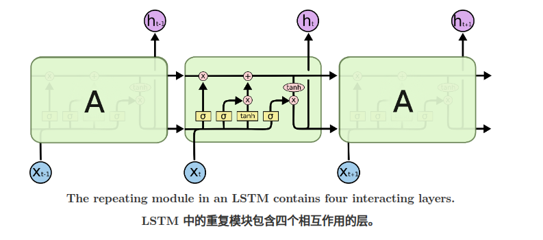

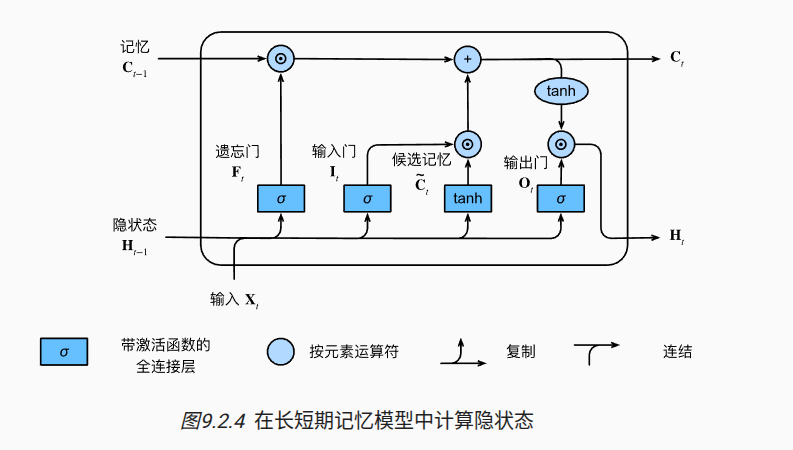

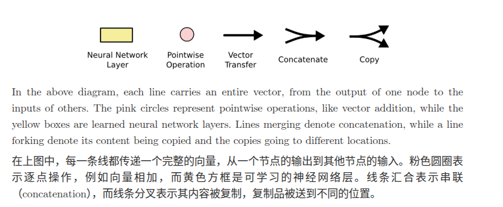

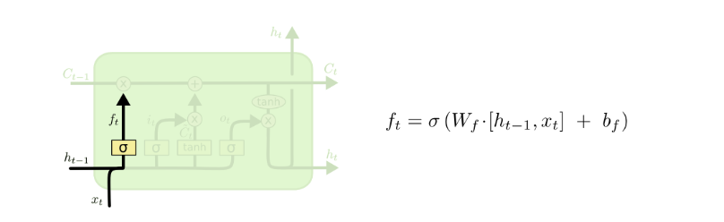

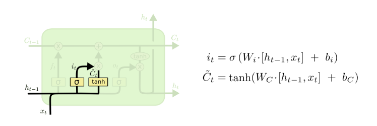

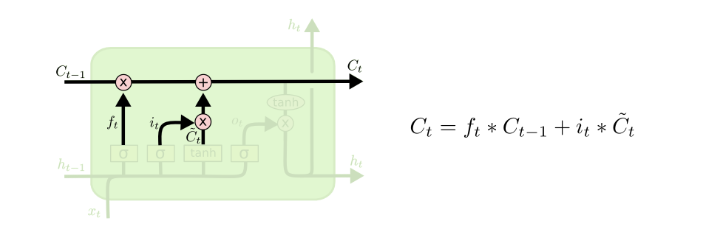

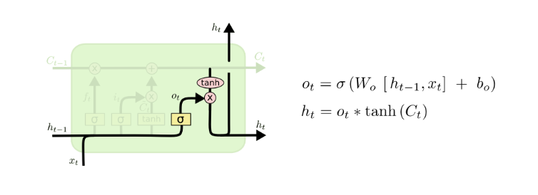

  - 引入 input / forget / output 三门控 + cell state，缓解长序列梯度衰减；
  - 2014-2017 年是 NMT / speech 主流 backbone；
- **GRU** (Cho et al.,  EMNLP 2014) [10]: 
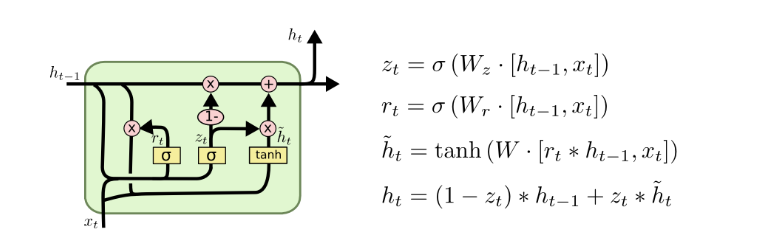

  - 简化 LSTM 为 update / reset 两门，参数比 LSTM 少 ～25%，多数任务上性能相当；

#### 2.2.2 已知局限

RNN 在 2017 年后被 Transformer 快速取代，主要原因：

- **串行依赖**：当前 step 依赖前一 step hidden state，无法 GPU 并行；
- **长距离依赖衰减**：即使 LSTM 也只能稳定捕获 ～100-1000 step 内信息；

这两条由 Transformer （Vaswani et al。， NeurIPS 2017）[12] 同时解决。

### 2.3 ResNet 与残差连接

ResNet 引入残差连接 $y = F(x) + x$ [13]，解决了深网络的优化退化（degradation）问题。

该机制后续在 Transformer[12]、Diffusion U-Net 等主流架构的 block 中被沿用，成为不绑定具体任务范式的通用组件。

#### 2.3.1 起因

ResNet (He et al.， 2015-12）[13] 之前，CNN 深度从 20 层加到 56 层时，训练误差与测试误差同时升高[13]。

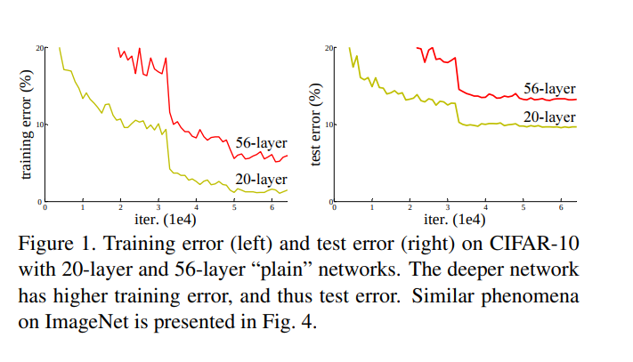

这一现象不能用过拟合解释——若是过拟合，训练误差应继续下降。

该现象被归因为优化层面的退化：

- 普通 CNN 加深后，理论上可以通过额外层学习恒等映射来复现浅层网络的解；
- 但没有残差连接时，SGD 很难把这些额外层优化成恒等映射，导致更深网络的训练误差反而升高[13]。
- Li et al. （NeurIPS 2018） 通过损失曲面可视化进一步证实，残差连接显著平滑了深网络的损失曲面，使 SGD 更易收敛[15]。

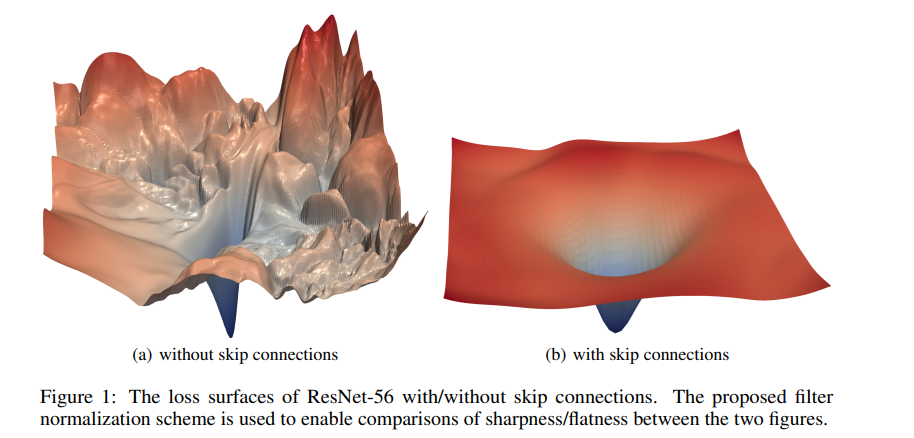

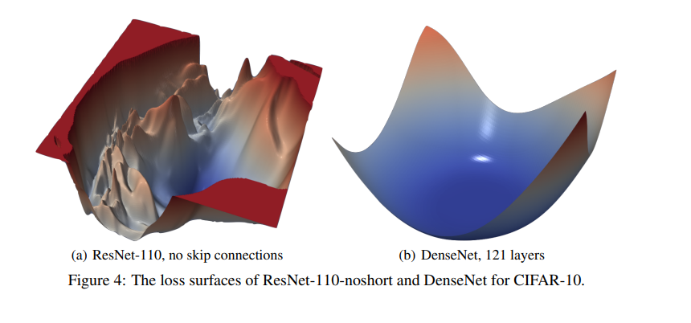

#### 2.3.2 解决

**残差 block 与梯度路径**

每个 block 的输出由 $y = F(x)$ 改为 $y = F(x) + x$ [13]。

- F 学到 0 时 block 退化为恒等映射；
- 更深的网络至少不会比更浅的等价网络更差，给优化器一条保底通路。

对残差 block $y = F(x) + x$，反向传播时梯度不仅经过 $F(x)$ 分支，还能沿 `+x` 的恒等分支直接回传。即使 $F(x)$ 分支的梯度很小，恒等分支仍会把外层梯度传到浅层，因此 ResNet 比普通深层 CNN 更不容易出现梯度衰减[13]。

ResNet 用了两种 block 设计[13]：

- **Basic block**（用于 ResNet-18 / 34）：两个 3×3 卷积 + 残差加和；
- **Bottleneck block**（用于 ResNet-50 / 101 / 152）：1×1 → 3×3 → 1×1 三层卷积 + 残差加和。1×1 卷积先压缩通道再恢复，参数与计算量约为 basic block 的一半。

> He et al. 在 Pre-activation 工作（ECCV 2016）[16] 把 BN 与 ReLU 移到卷积之前（即 BN-ReLU-Conv 而非 Conv-BN-ReLU），让残差通路更接近纯恒等映射，可训练深度从 152 层扩展到 1001 层。

**ImageNet 实验**

ResNet 在 ImageNet 上的 top-5 错误率随深度变化：

| 模型 | 错误率 | 参数量 |
| --- | --- | --- |
| ResNet-18 | 7.55% | 11.7M |
| ResNet-34 | 6.50% | 21.8M |
| ResNet-50 | 5.71% | 25.6M |
| ResNet-101 | 5.05% | 44.5M |
| ResNet-152 | 4.49% | 60.2M |

ResNet 在一年内取代 VGG / GoogLeNet 成为下游 CV 任务的默认 backbone：

- COCO 目标检测 mAP 从 33.5（VGG-Faster R-CNN）提升到 37.4（ResNet-101-Faster R-CNN）[13]；
- ImageNet localization 错误率从 19.4% 降到 9.0%[13]。

#### 2.3.3 影响

**跨架构延续**

**Transformer 系**（NLP / LLM 主线）：每个 sub-layer 后采用 $LayerNorm(x + Sublayer(x))$，其中 `+` 即残差连接[12]；后续 LLM / VLM / VLA 大量复用该 block 模板；

架构无关属性使其在 CNN[13]、Transformer[12]、Diffusion U-Net 等不同范式中均有沿用，且常与各架构原有的归纳偏置（卷积、attention 等）正交叠加。

### References

- [7] Sutskever et al., Sequence to Sequence Learning with Neural Networks, NeurIPS 2014. arXiv:1409.3215
- [8] Bahdanau et al., Neural Machine Translation by Jointly Learning to Align and Translate, ICLR 2015. arXiv:1409.0473
- [9] Hochreiter & Schmidhuber, Long Short-Term Memory, Neural Computation 1997.
- [10] Cho et al., Learning Phrase Representations using RNN Encoder-Decoder for Statistical Machine Translation, EMNLP 2014. arXiv:1406.1078
- [11] Hannun et al., Deep Speech: Scaling up end-to-end speech recognition, arXiv 2014. arXiv:1412.5567
- [12] Vaswani et al., Attention Is All You Need, NeurIPS 2017. arXiv:1706.03762
- [13] He et al., Deep Residual Learning for Image Recognition, CVPR 2016. arXiv:1512.03385
- [14] Srivastava et al., Training Very Deep Networks (Highway Networks), NeurIPS 2015. arXiv:1507.06228
- [15] Li et al., Visualizing the Loss Landscape of Neural Nets, NeurIPS 2018. arXiv:1712.09913
- [16] He et al., Identity Mappings in Deep Residual Networks (Pre-activation), ECCV 2016. arXiv:1603.05027
- [17] Veit et al., Residual Networks Behave Like Ensembles of Relatively Shallow Networks, NeurIPS 2016. arXiv:1605.06431
- [18] Huang et al., Densely Connected Convolutional Networks, CVPR 2017. arXiv:1608.06993
- [19] Xie et al., Aggregated Residual Transformations for Deep Neural Networks, CVPR 2017. arXiv:1611.05431

---

## 3. 第二阶段：Transformer 范式 （2017-2026）

Transformer 的核心问题是序列建模：

- 给定一段文本，模型需要为每个 token 建立与其它 token 的依赖关系。
- RNN 通过 hidden state 按顺序传递上下文；
- Transformer 用 self-attention 一次性计算 token 间相关性，使训练并行性和长距离依赖建模同时改善[1]。

后续 Scaling Law、GPT-3、ChatGPT 与 RLHF，分别沿着**模型规模**、**少样本泛化**和**人类偏好对齐**继续扩展这条路线。

### 3.1 [Transformer](https://jalammar.github.io/illustrated-transformer/)：注意力机制

Transformer (Vaswani et al.，NeurIPS 2017）[1] 用 self-attention + position-wise FFN 取代 RNN 循环结构与 CNN 卷积。Self-attention 将每个 token 映射为三组向量：

- Query：当前 token 用于匹配其它 token 的查询向量；
- Key：其它 token 用于被匹配的键向量；
- Value：匹配后参与加权汇总的值向量。

Scaled dot-product attention 用 Query 和 Key 的相似度计算权重，再对 Value 做加权汇总。Multi-head attention 并行计算多组 Q/K/V，使模型在不同表示子空间中建模 token 关系[1]。

在 WMT'14 EN-DE 翻译任务上 BLEU 28.4，超过当时 RNN encoder-decoder baseline 25.16[1]。

#### 3.1.1 关键设计

- **Attention 机制**：Scaled dot-product $\operatorname{Attention}(Q, K, V)=\operatorname{softmax}\left(\frac{Q K^T}{\sqrt{d_k}}\right) V$ [1]， $\sqrt{d_k}$  缩放避免 softmax 进入饱和；
- **Position encoding：**Self-attention 不包含词序信息；Transformer 给每个 token 加入 positional encoding，让表示同时包含词义和位置。原始 Transformer 使用 sin/cos 固定位置编码，后续 LLM 多使用 RoPE 等位置编码方案。
- **架构组合**：原始 Transformer 采用 encoder-decoder 结构；每个 attention 或 FFN 子层外加残差连接和 LayerNorm，即 `LayerNorm(x + Sublayer(x))`，其中残差连接沿用了 ResNet 的 `F(x) + x` 思路[2]。

#### 3.1.2 工程结果

- **并行训练**：
  - RNN 的状态递推存在时间步依赖；
  - self-attention 将 token 两两关系表示为矩阵，训练时可并行计算。
- **长距离依赖**：
  - RNN 中远距离信息需要经过多个 hidden state 传递；
  - self-attention 中任意两个 token 可在同一层建立依赖。

### 3.2 Scaling Law 与 GPT-3

Transformer 给出了可并行训练的结构，下一步问题转向规模扩展：参数、数据、算力增加后，模型 loss 如何变化。

Kaplan et al.（OpenAI 2020）[7] 用实验拟合出 LLM cross-entropy loss 与参数量 N、数据量 D、计算量 C 的幂律关系：

这条曲线把大模型训练转向**可估算的工程扩展**问题：

- 给定 compute budget 后，可以估计参数量、训练 token 数和最终 loss 之间的关系。
- 工程重点也从频繁更换新架构，转向 scale 现有架构、配数据和调训练流程。

#### 3.2.1 GPT-3 (2020)

GPT-3 (Brown et al.，NeurIPS 2020）[8] 175B 参数，300B token 训练，展示了 in-context learning：

- 不更新模型参数，只在 prompt 中给少量任务示例，模型就能按示例格式完成翻译、问答、算术和代码生成等任务；
- 多项任务的性能曲线随 scale 平滑提升，与 Kaplan 2020 的预测方向一致[7][8]。

#### 3.2.2 Chinchilla 修正 （2022）

- Kaplan 2020 的 scaling law 让早期 LLM 更偏向增加参数量；
- Hoffmann et al. 2022 通过 400+ 个实验修正了这一结论：在固定算力下，参数量和训练 token 数应同步增加，约为 1B 参数对应 20B token。
- Chinchilla 只有 70B 参数，但用 1.4T token 训练，性能超过 280B 参数、300B token 的 Gopher，说明 GPT-3 / Gopher 这类模型参数很大，但训练数据不足。

#### 3.2.3 Emergent abilities 与争议

- Wei et al.（TMLR 2022）[10] 认为，部分 BIG-Bench 任务在小模型上接近随机，但模型规模超过某个阈值后表现突然上升，这类现象被称为 emergent abilities。
- Schaeffer et al.（NeurIPS 2023）[11] 反驳说，很多“突然上升”来自 exact-match 这类离散指标：答案只要不完全正确就记 0 分，因此平滑进步会被显示成跳变。换成连续评价指标后，部分任务的性能曲线变得平滑。

### 3.3 ChatGPT 与 RLHF

GPT-3 说明大语言模型可以通过 prompt 适配任务；

面向对话产品时，还需要约束输出：理解指令、按人类偏好组织答案，并降低有害回复概率。

ChatGPT（OpenAI 2022-11-30）[12] 的技术基底是 GPT-3.5 加 InstructGPT-style RLHF（Ouyang et al。 , NeurIPS 2022) [13]. 

#### 3.3.1 RLHF 三阶段

- **SFT（supervised fine-tuning）**：用人类示范回复做 supervised learning，让 base model 学会对话格式；
- **Reward model**：让人类对多个候选回复排序，训练一个 reward model 近似人类偏好；
- **PPO RL**：用 reward model 作为 reward signal，再用 PPO 优化 policy LM。

InstructGPT 把目标概括为三 H：helpful、harmless、honest[13]。

RLHF 思想源自 Christiano et al。（NIPS 2017）[14] 的 RL from human preferences。

#### 3.3.2 产品意义

- ChatGPT 5 天 100 万用户、2 个月 1 亿用户。技术路线接续 InstructGPT；产品形态上，对话 UI 和 alignment to human preference 让 LLM 进入普通用户的日常使用场景。
- 后续 Anthropic Claude 的 Constitutional AI 继续围绕人类偏好与安全约束改进模型输出[15]。

### References

- [1] Vaswani et al., Attention Is All You Need, NeurIPS 2017. arXiv:1706.03762
- [2] He et al., Deep Residual Learning for Image Recognition, CVPR 2016. arXiv:1512.03385
- [3] Devlin et al., BERT: Pre-training of Deep Bidirectional Transformers for Language Understanding, NAACL 2019. arXiv:1810.04805
- [4] Radford et al., Improving Language Understanding by Generative Pre-Training (GPT-1), OpenAI 2018.
- [5] Raffel et al., Exploring the Limits of Transfer Learning with a Unified Text-to-Text Transformer (T5), JMLR 2020. arXiv:1910.10683
- [6] Bahdanau et al., Neural Machine Translation by Jointly Learning to Align and Translate, ICLR 2015. arXiv:1409.0473
- [7] Kaplan et al., Scaling Laws for Neural Language Models, arXiv 2020. arXiv:2001.08361
- [8] Brown et al., Language Models are Few-Shot Learners (GPT-3), NeurIPS 2020. arXiv:2005.14165
- [9] Hoffmann et al., Training Compute-Optimal Large Language Models (Chinchilla), NeurIPS 2022. arXiv:2203.15556
- [10] Wei et al., Emergent Abilities of Large Language Models, TMLR 2022. arXiv:2206.07682
- [11] Schaeffer et al., Are Emergent Abilities of Large Language Models a Mirage?, NeurIPS 2023. arXiv:2304.15004
- [12] OpenAI, Introducing ChatGPT, openai.com/blog 2022-11-30.
- [13] Ouyang et al., Training Language Models to Follow Instructions with Human Feedback (InstructGPT), NeurIPS 2022. arXiv:2203.02155
- [14] Christiano et al., Deep Reinforcement Learning from Human Preferences, NIPS 2017. arXiv:1706.03741
- [15] Bai et al., Constitutional AI: Harmlessness from AI Feedback, arXiv 2022. arXiv:2212.08073

---

## 4. 第三阶段：Diffusion 与视觉生成（2020-2024）

2020 年前后，图像生成主要有 GAN、VAE、Normalizing Flow 三类做法。

DDPM 选择先规定一条加噪过程：

1. 从真实图像 $x_0$ 出发，每一步加入少量高斯噪声，经过 `T` 步得到接近 `N(0, I)` 的 $x_T$；模型要学习的是反方向，在给定 $x_T$ 和时间步 `t` 时预测噪声[1]。

后续有三项核心改进：

1. DDIM：DDPM 原始采样步数多；
2. Classifier-Free Guidance （CFG） ：文生图，让文本进入每一步去噪；
3. Latent Diffusion：把去噪搬到压缩后的 latent space 以降低计算量。

这些优化，之后被 DALL-E 2、Imagen、Stable Diffusion、Stable Video Diffusion 与 Sora 等系统沿用[5][6][7][8][9]。

### 4.1 方法演进 （Diffusion 主线）

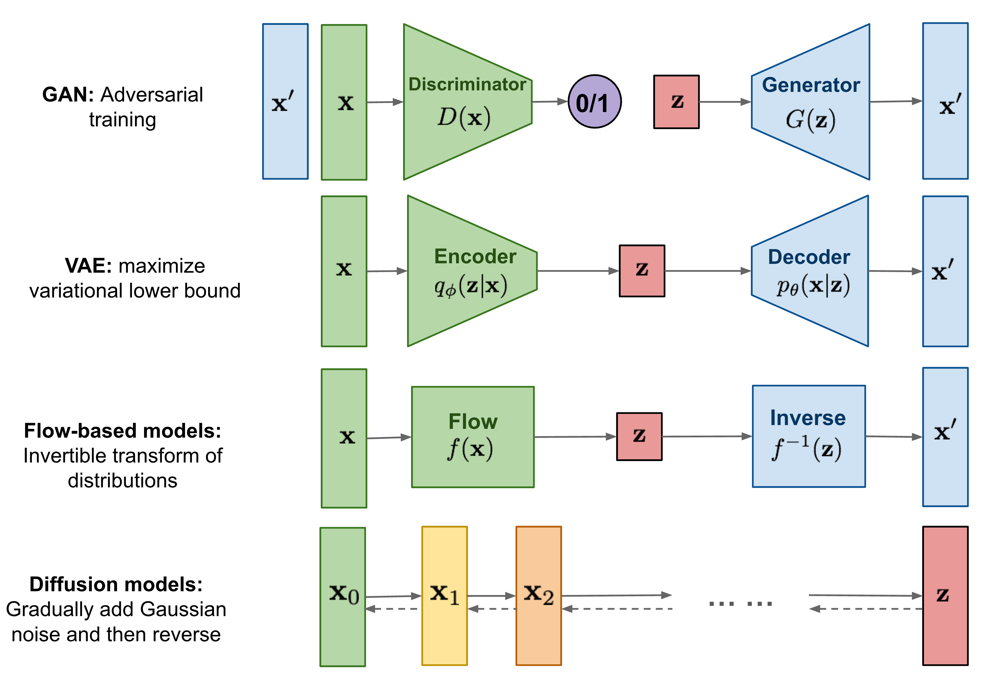

| 路线 | 生成方式 | 约束 | 来源 |
| --- | --- | --- | --- |
| GAN | 生成器与判别器做对抗训练 | min-max optimization | [10] |
| VAE | 编码器学习 latent distribution，解码器从 latent 生成样本 | 用 evidence lower bound 替代直接 log-likelihood | [11] |
| Normalizing Flow | 学习可逆变换，把简单分布映射到数据分布 | 变换需可逆，并计算 Jacobian determinant | [12] |

#### 4.2 DDPM：噪声残差

DDPM （Denoising Diffusion Probabilistic Models） 的训练输入由三项构成：真实图像 $x_0$、随机时间步 `t`、高斯噪声 `ε`。前向过程可直接采样任意时间步的带噪图像 $x_t$[1]：

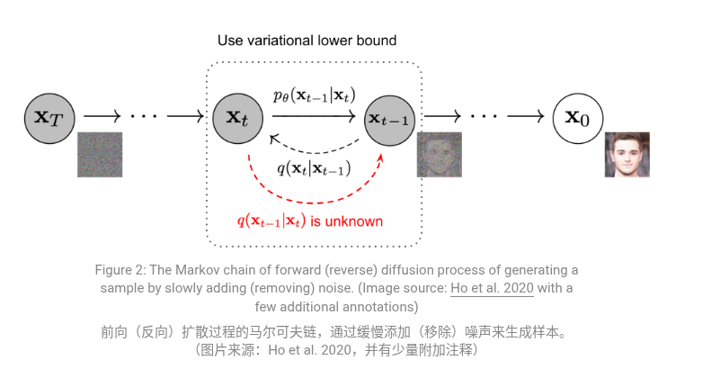

- Forward:  $q\left(\mathbf{x}_{1: T} \mid \mathbf{x}_0\right):=\prod_{t=1}^T q\left(\mathbf{x}_t \mid \mathbf{x}_{t-1}\right), \quad q\left(\mathbf{x}_t \mid \mathbf{x}_{t-1}\right):=\mathcal{N}\left(\mathbf{x}_t ; \sqrt{1-\beta_t} \mathbf{x}_{t-1}, \beta_t \mathbf{I}\right)$ ; 
  - $β_t$ 是 noise schedule，就是每一步加噪声的强度表；
  - 从第 `t-1` 步图像 `x_{t-1}` 得到第 `t` 步图像 `x_t` 时，往里面加一点高斯噪声。
- Reverse：模型  $ε_θ（x_t， t）$  预测加入的噪声；损失  $L = E[||ε - ε_θ(x_t, t)||²]$；
- T 通常 1000 步，直接采样需 1000 次 forward pass；

#### 4.3 快速扩展的三处改动

DDPM 的采样默认需要多步网络前向，且无条件模型不能直接响应文本或结构约束。

2021-2022 年的三类工作分别处理采样速度、条件控制和计算成本：

- DDIM 减少采样步数；
- CFG 让文本条件影响每一步去噪；
- Latent Diffusion 把高分辨率图像生成搬到 latent space。

| 问题 | 解法 | 改动位置 | 来源 |
| --- | --- | --- | --- |
| 采样慢 | DDIM | 把反向过程改成 deterministic non-Markovian path，使采样可跳过部分中间时间步 | [2] |
| 条件控制 | CFG | 同一网络同时预测有条件与无条件噪声，采样时线性组合两次预测 | [3] |
| pixel space 计算贵 | Latent Diffusion | 先用 VAE 把图像压到 latent space，再在 latent 上去噪 | [4] |

CFG 的采样公式为：

$\epsilon = \epsilon_{\mathrm{uncond}} + w \cdot (\epsilon_{\mathrm{cond}} - \epsilon_{\mathrm{uncond}})$

`w` 控制条件强度；文本、类别或图像条件通过每一步噪声预测影响采样轨迹[3][4]。Latent Diffusion 则把每一步去噪从 pixel space 移到 VAE encoder 压缩后的 latent space，Stable Diffusion 基于这一设计训练 text-to-image 模型，并在 2022-08 公开发布模型权重[4][8]。

### 4.4 图像应用

文生图在 DDPM 推理过程中加入文本条件。

文本编码器先把 prompt 变成向量 `c`，去噪网络再根据 `x_t`、`t` 和 `c` 预测噪声；随机起点仍是 `x_T ~ N(0, I)`[3][4]。

条件去噪网络可写为：$\epsilon_\theta(x_t, t, c)$

图像应用的差异可以按采样起点和条件输入区分：

| 使用方式       | 采样起点             | 条件输入         | 输出关系             | 来源           |
| ---------- | ---------------- | ------------ | ---------------- | ------------ |
| 无条件生成      | `x_T ~ N(0, I)`  | 无            | 从训练分布中采样新图像      | [1]          |
| 文生图        | `x_T ~ N(0, I)`  | 文本 embedding | 文本条件影响每一步噪声预测    | [3][4][5][6] |
| img2img    | 输入图加噪到中间时间步      | 文本或图像条件      | 保留部分输入图结构，再沿条件去噪 | [14]         |
| inpainting | 已知区域固定，缺失区域从噪声开始 | mask 与可选文本条件 | 只更新 mask 指定区域    | [4]          |
| ControlNet | `x_T` 或图像相关起点    | 边缘、姿态、深度等控制图 | 结构条件通过额外网络进入去噪过程 | [13]         |

2022-2024 间，diffusion 产品按公开方式可分为闭源图像 / 视频生成、开放权重图像生成、开放视频生成三类。

三类系统都围绕采样起点、条件输入和去噪网络组织生成流程，但交付形式不同。

| 路线 | 代表系统 | 公开形式 | 工具链特征 | 来源 |
| --- | --- | --- | --- | --- |
| 闭源图像 / 视频生成 | DALL-E 2、Imagen、Sora、Veo | API、网页产品或技术报告 | 模型权重未公开，用户通过产品入口调用 | [5][6][7][17] |
| 开放权重图像生成 | Stable Diffusion | 权重与代码生态公开 | LoRA、ControlNet、ComfyUI 等工具围绕开源权重扩展 | [4][8][13] |
| 开放视频生成 | Stable Video Diffusion | 研究权重或代码生态公开 | 主要用于短片段生成与研究复现 | [9] |

开放权重使 diffusion 从单一模型扩展成工具链：LoRA 改风格或主体，ControlNet 接入结构条件，ComfyUI 把采样器、条件、后处理组织成可编排流程。

### 4.5 图像到视频

2022-2024 间，Diffusion 的去噪对象从单张图像扩展到视频表示。图像系统在图像或图像 latent 上去噪，视频系统在带时间维度的 latent、frame sequence 或 spacetime patch 上去噪。

| 系统 | 时间 | 去噪对象 | 说明 | 来源 |
| --- | --- | --- | --- | --- |
| DALL-E 2 / Imagen / Stable Diffusion | 2022 | 图像或图像 latent | 文本条件进入每一步去噪；Stable Diffusion 使用 LDM 公开 text-to-image 权重 | [4][5][6][8] |
| GEN-1 | 2023-02 | video latent | 输入 source video 与文本 / 图像条件，输出保留原视频结构约束的 stylized video | [15] |
| Stable Video Diffusion | 2023-11 | video latent | 基于 video diffusion 生成短视频片段 | [9] |
| Sora | 2024-02 | spacetime patch | 把视频表示为时空 patch，再在这些 token 上做去噪生成 | [7][16] |

视频生成比图像生成多出时间一致性约束：同一人物、物体位置、运动轨迹和场景状态需要跨帧保持一致。

Sora 技术报告把视频表示为 spacetime patch，并以 "world simulators" 描述 video generation models[7]。

这条线在 §7 继续连接到可交互 World Models；

### References

- [1] Ho et al., Denoising Diffusion Probabilistic Models (DDPM), NeurIPS 2020. arXiv:2006.11239
- [2] Song et al., Denoising Diffusion Implicit Models (DDIM), ICLR 2021. arXiv:2010.02502
- [3] Ho & Salimans, Classifier-Free Diffusion Guidance, arXiv 2022. arXiv:2207.12598
- [4] Rombach et al., High-Resolution Image Synthesis with Latent Diffusion Models, CVPR 2022. arXiv:2112.10752
- [5] Ramesh et al., Hierarchical Text-Conditional Image Generation with CLIP Latents (DALL-E 2), arXiv 2022. arXiv:2204.06125
- [6] Saharia et al., Photorealistic Text-to-Image Diffusion Models with Deep Language Understanding (Imagen), NeurIPS 2022. arXiv:2205.11487
- [7] OpenAI, Video generation models as world simulators (Sora technical report), 2024-02.
- [8] Stability AI, Stable Diffusion Public Release, stability.ai 2022-08-22.
- [9] Blattmann et al., Stable Video Diffusion, arXiv 2023. arXiv:2311.15127
- [10] Goodfellow et al., Generative Adversarial Nets, NeurIPS 2014. arXiv:1406.2661
- [11] Kingma & Welling, Auto-Encoding Variational Bayes, ICLR 2014. arXiv:1312.6114
- [12] Rezende & Mohamed, Variational Inference with Normalizing Flows, ICML 2015. arXiv:1505.05770
- [13] Zhang & Agrawala, Adding Conditional Control to Text-to-Image Diffusion Models (ControlNet), ICCV 2023. arXiv:2302.05543
- [14] Meng et al., SDEdit: Guided Image Synthesis and Editing with Stochastic Differential Equations, ICLR 2022. arXiv:2108.01073
- [15] Esser et al., Structure and Content-Guided Video Synthesis with Diffusion Models (GEN-1), ICCV 2023. arXiv:2302.03011
- [16] Peebles & Xie, Scalable Diffusion Models with Transformers (DiT), ICCV 2023. arXiv:2212.09748
- [17] Google DeepMind, Veo 3 release, deepmind.google 2024-12.

---

## 5. 第四阶段：VLM 与多模态理解 （2020-2024）

VLM 处理另一侧问题：图像和文字如何落到同一个语义空间，模型如何基于图像生成回答。

2020-2024 年，这条线从 CLIP 的图文匹配，走到 LLaVA / GPT-4V 这类看图回答模型。

1. CLIP 先把图像和自然语言描述对齐；
2. LLaVA 再把 CLIP 的视觉特征接到 LLM，让模型用语言回答图像相关问题。
3. 后续 VLA 沿用这类视觉-语言输入，但把输出从文本扩展为机器人动作。

### 5.1 CLIP：图文对齐（2021）

监督分类模型的输出类别由训练集预先规定。

ImageNet 分类器最后一层对应 1000 个类别；新增类别时，需要重新收集标注数据并训练分类头。

CLIP (Contrastive Language-Image Pre-training, Radford et al.，OpenAI ICML 2021）把类别标签换成自然语言描述：图像 encoder 和文本 encoder 分别输出向量，再用对比学习让匹配的图文靠近、不匹配的图文远离[1]。

- **数据**：400M 对图像和文本描述，从 web 收集（WIT-400M）；
- **Encoder**：image encoder （ViT-B/16， ViT-L/14， ResNet） 把图像编码成向量，text encoder （Transformer） 把文本编码成向量，联合训练；
- **Loss**：InfoNCE 在一个 batch 内把原本配对的 （image， text） 作为正样本，把错配图文作为负样本；训练目标是提高正样本图文向量的相似度，同时降低错配图文向量的相似度；
  $\mathcal{L}_{\mathrm{CLIP}}=-\frac{1}{2 N} \sum_{i=1}^N\left[\log \frac{e^{\operatorname{sim}\left(v_i, t_i\right) / \tau}}{\sum_{j=1}^N e^{\sin \left(v_i, t_j\right) / \tau}}+\log \frac{e^{\operatorname{sim}\left(t_i, v_i\right) / \tau}}{\sum_{j=1}^N e^{\operatorname{sim}\left(t_i, v_j\right) / \tau}}\right]$

训练完成后，匹配的图文对具有较高的余弦相似度。

#### 5.2 CLIP 的应用

CLIP 输出的是共享语义空间里的向量，因此它最直接的用法是相似度计算，而不是生成文本。

| 用法 | 输入 | 输出 | 来源 |
| --- | --- | --- | --- |
| 零样本分类 | 图像 + 类别 prompt | 相似度最高的类别文本 | [1] |
| 图文检索 | 文本查图 / 图像查文本 | 向量空间最近邻 | [1] |
| 文生图条件 | prompt 文本 | 文本条件向量或 CLIP latents | [4][5][6] |
| VLM 视觉编码器 | 图像 | 视觉 token / patch features | [5] |

在 Diffusion 系统里，CLIP 或相关文本编码器把 prompt 变成条件输入；

在 LLaVA、Qwen-VL、InternVL 等 VLM 里，CLIP-ViT 或 SigLIP 先把图像变成视觉特征，再由 projection、adapter 或 cross-attention 接到语言模型。

### 5.3 从匹配到回答

CLIP 只能判断图像和文本是否匹配，不能直接生成回答。

要让模型回答“图里发生了什么”“为什么这样做”，架构里需要能自回归生成文本的语言模型。

2022-2023 年的 VLM 可按视觉特征如何接入文本生成分成三类：

| 路线 | 代表 | 视觉如何进入文本模型 | 适合任务 | 来源 |
| --- | --- | --- | --- | --- |
| 双编码器 | CLIP / ALIGN / SigLIP | 图像和文本各自编码，做相似度 | 检索、零样本分类 | [1][2] |
| 编解码器 | BLIP / BLIP-2 | 视觉 encoder 后接文本 decoder；BLIP-2 用 Q-Former 压缩视觉 token | caption、VQA | [10] |
| LLM-based | Flamingo / LLaVA / GPT-4V | 把视觉特征转成 LLM 可接收的 token 或 cross-attention 条件 | 对话、复杂指令 | [4][5][11] |

这三类路线的差别不在“是否理解图像”，而在输出形式：双编码器输出相似度，编解码器输出 caption 或短回答，LLM-based 模型用 LLM 的语言生成能力处理开放式问题。

### 5.4 LLaVA：视觉接入 LLM

LLaVA (Liu et al.，NeurIPS 2023）把冻结的 CLIP-ViT-L/14 接到 Vicuna。

图像先被 CLIP-ViT 编码成 patch features，projection layer 把这些视觉特征映射到 LLM 的 embedding 维度，再和文本 token 一起输入 Vicuna[5]。

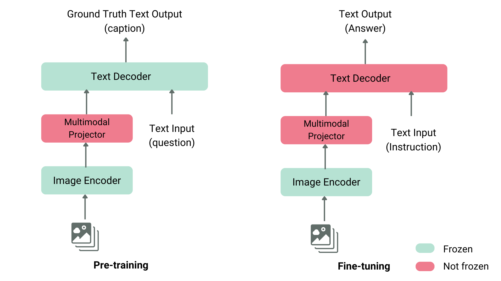

LLaVA 的关键在于复用已有组件。CLIP-ViT 已经把图像编码成与语言相关的视觉特征，Vicuna 已经具备对话和指令跟随能力；中间的 projection layer 只需要把 CLIP 特征映射到 LLM 的 token space[5]。

训练分两步：

- **Feature alignment**：用 558K 图文对训练 projection layer，使图像特征能进入 LLM 的表示空间[5]；
- **Visual instruction tuning**：用 GPT-4 基于 COCO caption 与 object bounding boxes 生成的 158K 视觉指令数据训练模型回答图像问题[5]。

LLaVA 发展快的原因主要在这两个选择：架构上少改 LLM，数据上用 GPT-4 生成高质量视觉指令样本。相比从零训练多模态模型，这条路线把训练目标缩小为“把已有视觉 encoder 和已有 LLM 接起来，再教它按指令回答图像问题”。

2024 年后，开源 VLM 多沿用“视觉编码器 + projector / adapter + LLM”的结构，只是更换视觉编码器、LLM、分辨率处理和指令数据。LLaVA-1.5（2023-10）把 projection 从 linear 改为 MLP，并加入更多学术 VQA 数据[12]。

### 5.5 应用与后续

VLM 的应用按输出形式分成两类。CLIP 类模型适合相似度和检索任务；LLaVA / GPT-4V 类模型适合生成回答、描述和多轮对话。

| 任务 | 更常用的模型形态 | 原因 |
| --- | --- | --- |
| 大规模图像检索 | CLIP / SigLIP | 图像向量可预先缓存，查询时做向量检索 |
| 零样本分类 | CLIP / OpenCLIP | 类别可写成文本 prompt |
| 图像问答 | LLaVA / Qwen-VL / GPT-4V | 需要基于图像生成文本回答 |
| 多模态助手 | LLM-based VLM | 需要对话、格式控制和指令跟随 |
| 机器人 VLA | VLM / VLA backbone | 视觉和语言输入继续接到动作输出 |

2024 年起，GPT-4o 和 Gemini 等闭源系统开始把文本、图像、音频、视频放到同一模型训练或服务接口中[4][7]。开源路线则继续沿 LLaVA / Qwen-VL / InternVL 这类模块化结构改进视觉编码器、分辨率和指令数据。

- VLM 的输出仍然是文本；
- VLA （Vision-Language-Action） 把输出扩展到机器人动作。
- RT-2 把机器人动作离散化为 token，让 VLM 通过 fine-tuning 输出 action token；
- π₀ / GR00T 等路线则常把 VLM 作为语义理解或 reasoning 模块，再接 continuous action head、diffusion transformer 或 flow-matching action head[6]。

### References

- [1] Radford et al., Learning Transferable Visual Models From Natural Language Supervision (CLIP), ICML 2021. arXiv:2103.00020
- [2] Jia et al., Scaling Up Visual and Vision-Language Representation Learning With Noisy Text Supervision (ALIGN), ICML 2021. arXiv:2102.05918
- [3] Minderer et al., Simple Open-Vocabulary Object Detection with Vision Transformers (OWL-ViT), ECCV 2022. arXiv:2205.06230
- [4] OpenAI, GPT-4V(ision) System Card, openai.com 2023-09.
- [5] Liu et al., Visual Instruction Tuning (LLaVA), NeurIPS 2023. arXiv:2304.08485
- [6] Brohan et al., RT-2: Vision-Language-Action Models Transfer Web Knowledge to Robotic Control, arXiv 2023. arXiv:2307.15818
- [7] Gemini Team, Gemini: A Family of Highly Capable Multimodal Models, 2023. Technical Report.
- [8] Anthropic, The Claude 3 Model Family: Opus, Sonnet, Haiku, 2024. Model Card.
- [9] Zhai et al., Sigmoid Loss for Language Image Pre-Training (SigLIP), ICCV 2023. arXiv:2303.15343
- [10] Li et al., BLIP-2: Bootstrapping Language-Image Pre-training with Frozen Image Encoders and Large Language Models, ICML 2023. arXiv:2301.12597
- [11] Alayrac et al., Flamingo: a Visual Language Model for Few-Shot Learning, NeurIPS 2022. arXiv:2204.14198
- [12] Liu et al., Improved Baselines with Visual Instruction Tuning (LLaVA-1.5), arXiv 2023. arXiv:2310.03744

---

## 6. 延伸 ：VLA & World Model（2023-2026）

[📄 World Model 笔记](https://roborock.feishu.cn/wiki/Co7ow7jMViKrXfkhIznc0c7Vnib?renamingWikiNode=false)