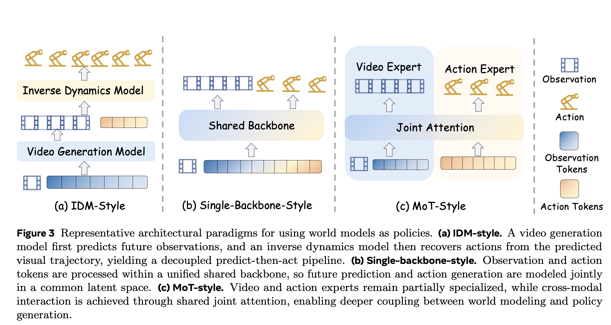
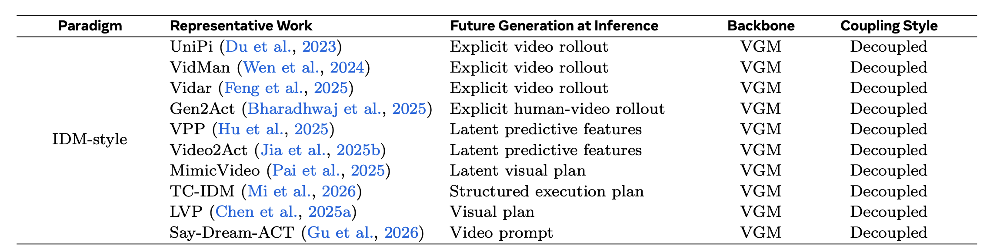
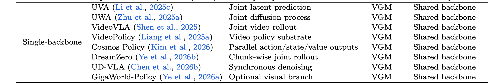
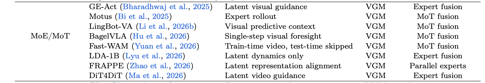
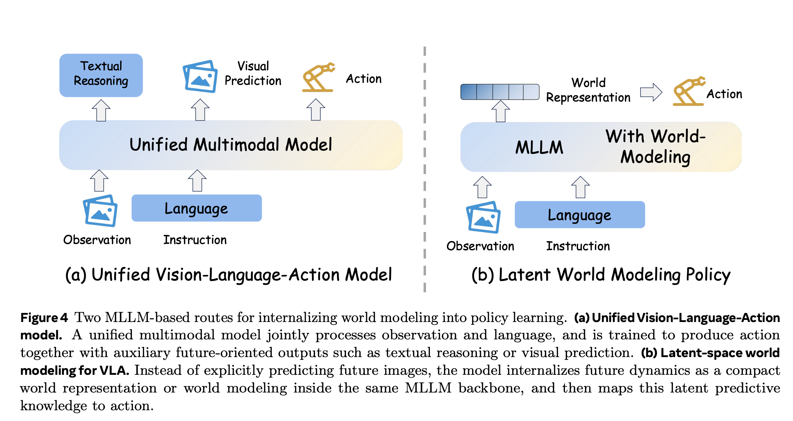
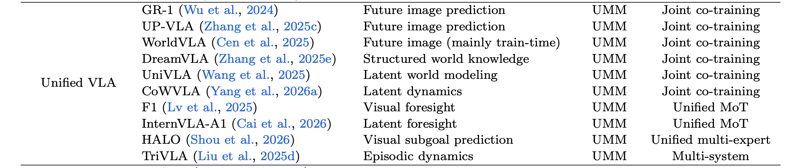
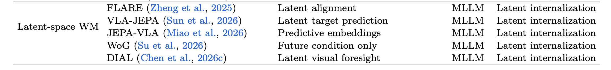
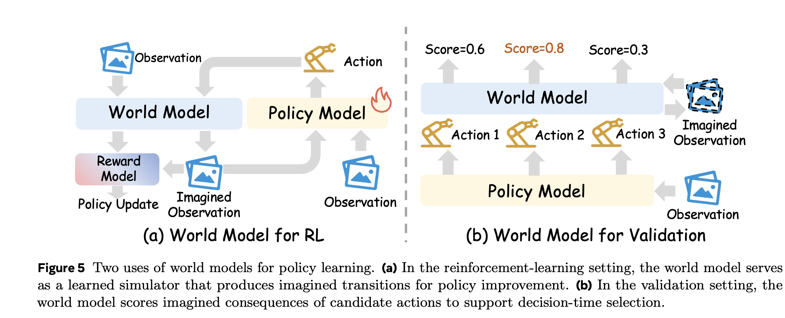

# World Model 笔记

## 0 概述

1. **World Model = 支持机器人决策的未来预测结构**；其中 action-conditioned 是闭环控制里最关键的一类能力；
2. **WM 提供的三大能力 = 前瞻 / 想象规划 / 数据扩增**，补标准端到端 VLA 缺少显式未来预测结构的短板；

## 1 什么是世界模型

**世界模型 = 一个内部模拟器，输入"我现在看到什么 + 我打算干什么"，输出"接下来会发生什么"。**

| "我现在看到什么" | 当前观测 | $o_t$（通常是图像） |
| --- | --- | --- |
| "我打算干什么" | 动作 | $a_t$（关节速度 / 末端位姿 / 抓取指令…） |
| "接下来会发生什么" | 未来观测 | $o_{t+1}, o_{t+2}, \ldots$ |

世界模型是在学一个概率：

$p\left(o_{t+1: t+H} \mid o_t, a_{t: t+H-1}, l\right)$

- $o_t$：时刻 t 的观测（当前看到的图像）；
- $a_{t:t+H-1}$：从时刻 t 到 t+H-1 的**一串动作；**
- $H$: 想往未来看多远（horizon，预测步长）；
- $l$: 语言指令；
- $o_{t+1: t+H}$：被预测出来的未来 H 帧观测；

公式非常像“视频生成模型”，但视频生成模型只要"看起来真"就够了；

世界模型必须满足要求： **当改变输入的 action，输出的未来必须以"物理上合理的方式"跟着变。**

### 1.1  与视频生成模型的区别

**对闭环控制 / action evaluation 更有用的 world model，通常需要 action-conditioned（动作条件化）：它的价值不在于画面逼真，而在于"忠实反映动作的物理后果"；**

假设有一段机械臂场景的图像 $o_t$：

**场景 A：普通视频生成模型（如 Sora）**

- 输入： $o_t$
- 输出：一段 5 秒的视频，机械臂丝滑地移动，完成某个动作；
- **问题**：这段视频画面逼真，但不一定符合**想让它做的动作**。换一个 action 给模型，生成视频可能完全一样——因为它只在"模仿见过的视频分布"。

**场景 B：更适合闭环控制 / action evaluation 的 world model**

- 输入：$o_t$ + 动作 $a_t$ = "夹爪向左移动 5cm"；
- 输出：未来画面里夹爪**真的**向左移动了 5cm；
- 输入：$o_t$ + 动作 $a_t$ = "夹爪向右移动 5cm"；
- 输出：未来画面里夹爪**真的**向右移动了 5cm；

## 2 为什么引入世界模型

### 2.1 VLA 简介

**VLA = 端到端神经网络，输入"图像 + 语言指令"，输出"机器人动作"；**

公式表示：

$\pi\left(a_{t+1: t+k} \mid o_t, l\right)$

- $o_t$：当前观测（图像 + 本体感受）；
- $l$: 语言指令；
- $a_{t+1: t+k}$：未来 k 步动作（也叫 action chunk）；

| **RT-2**      | Google 用 VLM 微调出的开山之作（2023）                |
| ------------- | ------------------------------------------ |
| **OpenVLA**   | 开源、社区最常用的 baseline                         |
| **π0 / π0.5** | Physical Intelligence 公司，flow matching 动作头 |

### 2.2 VLA 三个短板

#### 2.2.1 长时序推理（Long-Horizon Reasoning）

- 任务变长，任务成功率大幅下降；
- 标准端到端 VLA 多为**隐式时序建模**：它可以从数据里学到一些任务顺序，但缺少显式、可查询、可比较的未来预测结构；

#### 2.2.2 时序信用分配（Temporal Credit Assignment）

- 失败了不知道是哪一步错了；
- **没法把失败信号正确归因到早期错误动作上；**

#### 2.2.3 复合误差（Compounding Errors）

- 每一步小偏差，越走越歪；
- 这是模仿学习的经典毛病（Distribution Shift），标准端到端 VLA 往往缺少显式 rollout，因此很难在执行前预判"我这一步会不会把后面带偏"；

这些短板的根源**不仅**是"动作预测能力不够"，**更是缺少一种显式的预测结构，让模型能预判"我这么做了之后世界会变成什么样"；**

> - 纯 sensorimotor VLA：如 RT-1 / RT-2 / OpenVLA 这类，主要是 `observation + instruction -> action`。它可能在网络内部学到一些 plan-like behavior，但没有显式 rollout，也不能比较「动作 A 会导致什么未来，动作 B 会导致什么未来」。
> - hierarchical VLA / planner-VLA：有 planning。比如高层把任务拆成 subtask，低层 VLA 执行动作；或者 VLA 输出中间语言动作、subgoal、CoT。这类有规划成分，但多是 语言层 / 子任务层 planning，不一定具备物理未来预测。
> - VLA + world model：planning 接近论文强调的形式。它可以预测未来 observation / latent state / video rollout，再用这些 imagined futures 比较动作、做评估、做 RL 或数据扩增。

### 2.3 world module 提供的能力

- Foresight（前瞻）：
  - 在动作执行**之前**，预测可能的未来状态或动作后果。
- Imagination-Driven Planning（想象驱动的规划）
  - 用想象出来的未来 rollout 去**比较**多个候选动作，选最优的。
- Data Amplification （数据扩增）
  - 用 world model 合成额外的演示数据，扩展训练集。

|   | 纯 VLA | VLA + World Model |
| --- | --- | --- |
| 决策方式 | 当前观测 + 指令 → 动作 | 当前观测 / 候选动作 → 预测未来 → 改进行动 |
| 时序意识 | 多为隐式时序建模 | 可利用 future rollout / latent prediction |
| 失败归因 | 难直接解释哪步导致后果 | 可用预测轨迹辅助定位动作后果 |
| 数据来源 | 真实演示为主 | 真实演示 + 想象轨迹 / 合成数据 |
| 论文术语 | "purely reactive" | "predictive structure" |

## 3 概率视角表述

### 3.1 概率视角分类

同一个任务：指令 —— 把桌上的杯子放到盘子里。

可以引发**四种问题**：

| 问题 | 对应模型 |
| --- | --- |
| 现在该做什么动作？ | **Policy（策略）** |
| 如果只看当前画面和任务意图，未来大概会变成什么样？ | **Passive World Model / Video Generation Model** |
| 如果指定一串动作，未来画面会怎么变？ | **Controllable World Model** |
| 如果已经看到前后两段画面，能不能反推出中间做了什么动作？ | **Inverse Dynamics Model (IDM)** |

- Policy 常出现在 imitation learning / VLA 里；
- World Model 常出现在 model-based RL / planning 里；
- IDM 常出现在逆动力学和 video-to-action 里；

 **它们可以看成同一个联合分布的四种切片。**

1. **积分“未来画面”，得到 Policy 模型：**

$\underbrace{p\left(a_{t+1: t+k} \mid o_t, l\right)}_{\text {Policy }}=\int p\left(o_{t+1: t+k}, a_{t+1: t+k} \mid o_t, l\right) \mathrm{d} o_{t+1: t+k}$

> OpenVLA、π0、Diffusion Policy ;

1. 把"动作"积分掉，得到 Passive World Model:

$\underbrace{p\left(o_{t+1: t+k} \mid o_t, l\right)}_{\text {Passive WM }}=\int p\left(o_{t+1: t+k}, a_{t+1: t+k} \mid o_t, l\right) \mathrm{d} a_{t+1: t+k}$

> 在很多场景下，它对应的就是 **Video Generation Model**（VGM）;
> 
> Sora / CogVideoX ;

1. **把动作当成条件而非积掉，得到 Controllable World Model ( 可控世界模型)：**

$\underbrace{p\left(o_{t+1: t+k} \mid o_t, a_{t+1: t+k}\right)}_{\text {Controllable WM }}$

|   | Passive WM | Controllable WM |
| --- | --- | --- |
| 公式 | $p(o_{t+1:t+k} \mid o_t, l)$ | $p(o_{t+1:t+k} \mid o_t, a_{t+1:t+k})$ |
| 输入 | 画面 + 语言 | 画面 + **动作** |
| 别名 | Video Generation Model / task-guided imagination | Action-conditioned / controllable WM |
| 例子 | Sora、CogVideoX | IRASim、Cosmos Predict |
| 低层 action 接口 | 通常没有或较弱 | 明确暴露 |
| 适合什么 | 想象监督、数据扩增、visual planning | 闭环 rollout、动作比较、policy evaluation |

1. 换个方向，得到 Inverse Dynamics Model (**逆动力学模型 / Inverse Dynamics Model)**：

$\underbrace{p\left(a_{t+1: t+k} \mid o_{t: t+k}\right)}_{\text {IDM }}$

| 模型 | 本质操作 | 数学形式 | 干啥用 |
| --- | --- | --- | --- |
| **Policy** | 把 o 积掉 | $p(a \mid o_t, l)$ | 决策、执行 |
| **Passive WM**（=VGM） | 把 a 积掉 | $p(o \mid o_t, l)$ | 视频生成、想象监督 |
| **Controllable WM** | 把 a 当条件 | $p(o \mid o_t, a)$ | 动作条件预测、闭环评估 |
| **IDM** | 反向：从 o 推 a | $p(a \mid o_{t:t+k})$ | 从画面反推动作 |

### 3.2 概率视角分类的意义

1. 解释了"为什么 WM 和 Policy 可以耦合"：
  1. 解释了"为什么 WM 和 Policy 可以耦合"，因此可以"分享"参数、共用 backbone、甚至放进**同一个生成过程**里；
2. 定义了后面所有架构分类的"骨架"：
| 范式 | 怎么处理这四个切片 |
| --- | --- |
| **IDM-Style** | 两个独立模型：一个生成未来的 VGM/WM + 一个 IDM |
| **Single-Backbone** | 一个 backbone 同时建模所有切片 |
| **MoE/MoT** | 不同切片用不同专家，但通过 attention 耦合 |
| **Unified VLA** | Policy 主，同时加入 future prediction / world modeling 辅助任务 |
| **Latent-Space WM** | 不在像素空间画未来，而是在 latent 空间做预测 |
3. 澄清了"World Model" vs "Video Generator" 的争论；

## 4 IDM-Style范式（先想象，再行动）

### 4.1 概念

**第一步：World Model 想象未来**

$\hat{o}_{t+1: t+H}=W\left(o_t, l\right)$

或者更紧凑的，在 latent 空间里做：

$\hat{z}_{t+1: t+H}=W\left(E_{\text {img }}\left(o_t\right), E_{\text {text }}(l)\right)$

**第二步：Policy 根据"现在 + 想象的未来"出动作**

$\pi\left(a_{t+1: t+H^{\prime}} \mid o_t, l\right)=P\left(a_t \mid E_{\text {img }}\left(o_t\right), E_{\text {text }}(l), \Phi\left(\hat{o}_{t+1: t+H}\right)\right)$

- $\Phi(\cdot)$ 是从想象出来的未来里**抽取关键特征**的函数；
- $H^{\prime}
 $是要执行的动作长度（ $H^{\prime} \leq H$）

### 4.2 演化

**阶段 A：早期 — 直接生成像素视频**

| 方法 | 关键创新 |
| --- | --- |
| **UniPi** (Du et al., 2023) | **分支的源头**。用 task-conditioned 视频扩散生成未来视频，再用最简单的 IDM 比较相邻帧推动作。 |
| **VidMan** | 加了 masked IDM，重点关注"动作相关的区域" |
| **Vidar** | 类似思路，更新版本 |
| **Gen2Act** | 不用机器人视频，而用**人类视频**当未来想象 |

> 生成完整 RGB 视频又慢又贵，而且**画面里大部分的像素和动作无关**（背景、光照…）

**阶段 B：放弃像素，改用 latent feature**

| 方法 | 关键创新 |
| --- | --- |
| **VPP**  | 不渲染像素，只用预训练视频扩散模型的**中间 latent 特征**当作"未来表征" |
| **Video2Act** | 类似思路，更紧凑的接口 |

> 决策只需要"未来的表征"，不需要"未来的图像"。
> 
> 视频扩散模型的中间层 latent 已经包含了足够的运动/物理信息，**不必走完解码器**。

**阶段 C：让中间产物更"执行友好"**

visual plan / 几何轨迹 / latent visual plan

| 方法 | 关键创新 |
| --- | --- |
| **MimicVideo** (Pai et al., 2025) | 不生成完整视频，而是保留"**部分去噪**的 latent visual plan"。可以理解成视频模型脑子里的"动作草图"。 |
| **TC-IDM** | 把生成的未来翻译成**结构化执行计划**，例如工具中心的几何轨迹。"末端执行器应该怎么走"。 |
| **LVP** | 生成可重定位的 visual plan。换一个初始位置，也能把同一个计划搬过去用。 |

**阶段 D：当作 in-context prompt 用**

| 方法 | 关键创新 |
| --- | --- |
| **Say-Dream-ACT** (Gu et al., 2026) | 生成的视频不当 IDM 目标，而当**视觉 prompt** 喂给 policy（类似 LLM 的 in-context learning） |

### 4.3 优缺点

**优点**

1. **模块化**：WM 和 IDM 可以独立换、独立升级；
2. **可重用预训练**：WM 可以直接用 CogVideoX、Cosmos 这类预训练视频模型，不用从头训；
3. **可解释**：能**看到** WM 想象的未来视频，调试时知道"它脑子里想的是什么"；
4. **数据需求灵活**：WM 可以用大量无动作标签的视频预训练，IDM 只需要少量带动作标签的数据；

**缺点**

1. **性能上限被 WM 卡死；**
  1. WM 可能想象的不准；
2. **视觉合理 ≠ 物理可执行；**
  1. 即使视觉合理，也不代表物理可实现，IDM 强行推动作，会引发异常；
3. **两阶段之间独立；**
  1. WM 冻结，IDM 没法反向"教" WM 怎么生成对决策更有用的画面；
  2. 两个模型**各自优化各自的目标**，没有联合训练。

## 5 Single-Backbone范式

Single-Backbone = 用一个共享的 transformer，同时建模"未来画面"和"未来动作"，让两者在同一个生成过程里被联合优化。

### 5.1 概念

把"未来画面"和"未来动作"拼成一个统一的目标向量：

$x=\left[z_v ; z_a\right]$

- $z_v$ ：未来画面的 latent 表示；
- $z_a$：未来动作的 latent 表示；

然后给一个共享 backbone $f_\theta$ 去做去噪：

$\hat{y}=f_\theta\left(\tilde{x}_\tau, o_t, l, \tau\right)$

- $\tilde{x}_\tau$ ：被加了噪声的输入（扩散过程的中间状态）；
- $\tau$：去噪的时间步；
- $\hat{y}$：模型预测的目标；

**一个统一的去噪损失**：

$\mathcal{L}_{\text {unified }}=\mathbb{E} \ell(\hat{y}, y)$

**这一个 loss 同时教模型两件事**："下一帧画面应该长什么样" + "下一刻动作应该是什么"；

两者**共享所有梯度**，互相监督。

### 5.2 演进

| 方法 | 关键设计 | 你需要记住的直觉 |
| --- | --- | --- |
| **UVA** (Li et al., 2025c) | 学一个 **video-action 联合 latent 空间**，同时监督未来视觉和动作。部署时用轻量的 modality-specific decoder head，可以绕开显式视频生成，只解码动作。 | 早期奠基者：训练时联合学，推理时尽量少生成。 |
| **UWA** (Zhu et al., 2025a) | 把 video diffusion 和 action diffusion 放进同一个 transformer，但不同模态可以有自己的 timestep。 | 可以通过 timestep 控制把 visual future "边缘化掉"，让模型像纯 policy 一样用。 |
| **Cosmos Policy** (Kim et al., 2026) | 基本保留预训练 video diffusion 架构，把 action / future state / value 当作额外 latent "frame" 塞进扩散序列。 | 最直观的实现：什么都可以变成同一生成序列里的 latent frame。 |
| **DreamZero** (Ye et al., 2026b) | 用 **chunk-wise joint denoising**，不自由生成一整段长未来，而是闭环地一小块一小块生成。 | 解决长时序漂移：每个 chunk 都能用最新观测重新校准。 |
| **GigaWorld-Policy** (Ye et al., 2026a) | 联合优化 future action prediction 和 action-conditioned video generation，但通过因果设计让 visual branch 在推理时可选。 | 训练时用视频学物理先验，推理时可以只跑 action 分支。 |

> 对比以上两种范式：
> 
> 1. IDM-Style：**链式法则分解**，两步采样、两个独立模型；
>   $p\left(o, a \mid o_t, l\right)=\underbrace{p\left(o \mid o_t, l\right)}_{\text {Step 1: WM }} \cdot \underbrace{p\left(a \mid o, o_t\right)}_{\text {Step 2: IDM }}$
> 2. Single-Backbone：**直接对联合分布建模**，用一个 shared backbone 处理视觉未来和动作；
>   $p\left(o, a \mid o_t, l\right) \approx f_\theta\left(o_t, l\right) \text {（同一个生成过程建模 } o \text { 和 } a \text { ）}$

### 5.3 优缺点

1. 优点：
  1. **联合训练**：动作目标可以影响共享表征，让 future modeling 更贴近控制需求；
  2. **接口灵活**：通过 timestep / decoder head / 因果掩码，**同一个模型**能在 "纯 policy / WM / 联合"之间切换；
  3. **充分利用预训练**：直接复用 video diffusion backbone；
2. 缺点：
  1.  **训练成本大**：一个模型要同时学两件事，梯度可能对冲，对数据量和算力要求高；
  2.  **架构耦合**：视频和动作完全共享参数，无法针对各自的频率/精度需求做差异化优化；
  3. **预训练 backbone 的选择限制**：通常依赖 video-generative / temporally predictive backbone，不能简单替换成只做 image-text alignment 的 VLM；

## 6 MoE-MoT范式

MoE（Mixture of Experts，混合专家）：**同一个模型里有多个"专家"子网络，对每个输入选择性地激活其中一部分。**

MoT（Mixture of Transformers，混合 Transformer）：是 MoE 的一种特殊形态，**整个模型被分成几个"专家流"（expert streams），每个流处理特定模态，再通过 shared attention、cross-attention 或 interleaved sequence 反复交换信息。**

### 6.1 概念

三种范式对比：

|   | IDM-Style | Single-Backbone | MoE/MoT |
| --- | --- | --- | --- |
| 模型/专家数 | 2 个独立模型 | 1 个共享 backbone | 2 个专家 + 共享 attention |
| 参数共享 | 完全独立 | 高度共享 | 保留专家参数，同时共享上下文 / 注意力信息 |
| 联合训练 | 不行 | 可以 | 可以 |
| 模态差异化 | 完全独立优化 | 强行共享 | 各专家可独立优化 |
| 信息流 | 单向：WM → IDM | 双向 + 完全融合 | 双向 + 保留模态边界 |

公式：

$\left[h_v^{\ell+1}, h_a^{\ell+1}\right]=F_{\ell}^{\operatorname{mix}}\left(h_v^{\ell}, h_a^{\ell} ; o_t, l\right)$

- L: 层的下标（第几层 transformer）；
- $h_v^\ell$ ：视频专家在第 $ \ell$ 层的隐藏状态；
- $h_a^\ell$ ：动作专家在第 $ \ell$ 层的隐藏状态；
- $F_\ell^{\text{mix}}$ ：**层级交互算子**——可以是 joint attention、cross attention 或 shared attention；

### 6.2 来源 & 动机

**视频和动作的"频率不同、精度不同、目标不同"**

|   | 视频生成 | 动作生成 |
| --- | --- | --- |
| 时序频率 | 通常 5–30 FPS | 控制频率 50–500 Hz |
| 表征维度 | 高（像素或 latent） | 低（几个数值） |
| 优化目标 | 视觉重建（L2、感知 loss） | 动作精度（regression / discrete） |
| 训练数据 | 大量未标注视频 | 少量精确标注的机器人数据 |

参考 π0 架构，"双专家"思想：

- 一个大的 VLM 专家处理 vision-language
- 一个轻量的 action expert 处理控制

**MoE/MoT 范式可以类比为：把 π0 / π0.5 这类 expertized policy 的思路，迁移到 video-generative backbone 上。**

原来的视觉语言专家更偏静态语义理解；这里的视频专家更偏时序预测、运动连续性和近似物理动态。

### 6.3 优缺点

1. 优点：
  1. **结合优点**：：联合训练（继承 Single-Backbone）+ 模态特化（继承 IDM-Style）；
  2. **复用 π0 的工程经验**：很多 π0 / π0.5 的训练 trick 可以无缝迁移；
  3. **推理灵活**：通过砍掉某个专家，可以在"完整生成"和"快速决策"之间切换；
  4.  **具备扩展潜力**：它继承了 MoE/MoT 的思路，但具体收益取决于专家设计、融合方式和训练稳定性；
2. 缺点：
  1. **架构复杂**：要小心设计 fusion 算子（joint vs cross vs shared attention），实现门槛高；
  2. **训练不稳定**：多专家联合训练容易出现"模态主导"问题——视频专家梯度大，动作专家梯度被淹没；
  3. 算力消耗大；

## 7 Unified-VLA范式

前 3 种范式的 backbone 都是 VGM——视频生成模型；

但 Unified VLA ： **以 VLA（VLM-based）为主体，把 WM 能力当作"内化的副产品"。**

**关键差异：**

1. **Backbone 不是视频扩散模型**，而是 **MLLM**（多模态大模型）；
2. **Future prediction 不是必需的输出**，而是**训练时的辅助任务；**
3. **WM 不是外挂模块**，而是 **VLA backbone内化的能力；**

### 7.1 概念

Unified VLA = 让 VLA 在训练时除了学"输出动作"，还学"预测未来"，把这两个任务放进同一个 MLLM backbone 里联合优化。

公式：（ multi-task learning + 共享 backbone）

$\mathcal{L}_{\text {total }}=\underbrace{\mathcal{L}_{\text {action }}\left(\pi\left(a \mid o_t, l\right)\right)}_{\text {主任务 }}+\lambda \cdot \underbrace{\mathcal{L}_{\text {future }}\left(p\left(o_{t+1} \mid o_t, l\right)\right)}_{\text {辅助任务 }}$

- **主任务**：标准的 VLA action prediction loss；
- **辅助任务**：未来预测 loss（pixel / latent / 结构化）；
- $\lambda$ ：辅助任务的权重，超参数；

通过共享 backbone 的隐式约束，让 future prediction 和 action prediction 互相改进。

| 维度 | IDM-Style | Single-Backbone | MoE/MoT | **Unified VLA** |
| --- | --- | --- | --- | --- |
| **Backbone** | VGM | VGM | VGM | **MLLM / VLM** |
| **Future prediction** | 必须显式生成 | 可选生成（联合输出） | 可选生成（专家分工） | **多为训练时辅助 loss** |
| **WM 是外挂还是内化** | 外挂（独立模型） | 强耦合（同一个 backbone） | 半外挂（专家） | **完全内化（VLA 自带能力）** |
| **推理时是否一定跑 WM** |  必须 | 可选 | 可选 | **不必** |
| **训练目标数** | 2 个独立 | 1 个统一 | 1 个统一（多专家） | **2 个 multi-task loss** |
| **代表工作** | UniPi、VPP | Cosmos Policy、UVA | Motus、GE-Act | **GR-1、WorldVLA、UniVLA** |

### 7.2 演化

1. 显式未来图像预测（Pixel-level Prediction）
| 方法 | 关键设计 |
| --- | --- |
| **GR-1**（Wu et al., 2024） | 早期代表。GPT-style transformer，**联合预测 action 和 future image** |
| **UP-VLA**（Zhang et al., 2025c） | 类似 GR-1，但用 future-image prediction 同时改进 action 和**视觉泛化** |
| **WorldVLA**（Cen et al., 2025） | 在一个**自回归框架**里统一 action 和 image 的理解+生成；future-image prediction **主要作为训练信号**，推理时不强制输出 |
2. Latent / 隐式未来建模（Compact Representation）
  不预测像素，而是预测**紧凑的未来表征**。

| 方法 | 关键设计 |
| --- | --- |
| **DreamVLA**（Zhang et al., 2025e） | 预测**结构化的世界知识**（动态、空间、语义线索），而非像素 |
| **UniVLA**（Wang et al., 2025） | 在**post-training 阶段**加入 world modeling，让模型从大规模视频里吸收因果动力学，不引入额外的外部 WM |
| **CoWVLA**（Yang et al., 2026a） | 预测 **latent motion + 紧凑视觉目标**，而非冗余的 future frames |
3. 多专家 / 多系统统一模型
  在**任务和训练层面**统一，但**架构内部**保留专家分工。

  和 MoE/MoT 的关键差异： MoE/MoT backbone 是 video diffusion，这里是 MLLM；

| 方法 | 关键设计 |
| --- | --- |
| **F1**（Lv et al., 2025） | 用 MoT 架构，**预测未来视觉状态作为 planning target** |
| **InternVLA-A1**（Cai et al., 2026） | 轻量 latent visual foresight + 联合优化 foresight 和 action |
| **HALO**（Shou et al., 2026） | 推到 **visual subgoal prediction + embodied reasoning** |
| **TriVLA**（Liu et al., 2025d） | 把 grounding / episodic dynamics / control 组织成**协调的子系统** |

### 7.3 范式对比

| 维度 | Single-Backbone（第 5 课） | Unified VLA（今天） |
| --- | --- | --- |
| Backbone 类型 | Video Diffusion Transformer (DiT) | MLLM / VLM |
| 训练范式 | 一个统一的 denoising loss | Multi-task loss（action + future） |
| Future 和 action 的关系 | 拼接成同一个去噪目标 $x = [z_v; z_a]$ | 两个独立的 head 输出 |
| 推理时输出 | 一次去噪过程同时吐出未来和动作 | 通常只走 action head，future head 关闭 |
| 数学本质 | 直接联合建模 $ p(o, a)$ | Multi-task： $\mathcal{L}_a + \lambda \mathcal{L}_o$ |
| 工程哲学 | "把动作当 frame" | "把 future 当辅助监督" |

### 7.4 优缺点

- 优点：
  1. **复用 VLA 基建**：现有 OpenVLA / π0 工程链可以直接微调；
  2. **推理速度快**：通常推理时只跑 action head，速度和标准 VLA 一样；
  3. **数据利用率高**：机器人数据本身就有 next-frame，不用额外标注；
- 缺点：
  1. **Future prediction 能力上限低**：因为是"辅助任务"，所以 future 预测不精细；
  2. **不适合做 imagination-driven planning**：辅助 loss 只够监督表征，不足以支撑"在脑内 rollout"；
  3. **依赖 backbone 的能力**：MLLM backbone 不像 video diffusion 自带强时序先验，长时序预测能力较弱；
  4. **辅助任务权重难调**： $\lambda $   的取值会显著影响最终效果；

## 8 Latent-Space-WM范式

### 8.1 JEPA（Joint Embedding Predictive Architecture）

预测下一帧"长什么样"浪费——应该预测下一帧的"语义表征"；

- **生成式（pixel-level）**：你看到现在的画面，预测下一帧每个像素 RGB 值是多少；
- **JEPA（representation-level）**：你看到现在的画面，预测下一帧在某个 encoder 输出的 **latent 向量**是多少；

| 维度 | Pixel Prediction | JEPA |
| --- | --- | --- |
| 预测目标 | 整张图 | 一个语义向量（千级维度） |
| 模型容量浪费 | 大量算力花在背景、光照 | 算力集中在语义 |
| 训练稳定性 | 像素 L2 / 感知 loss 难调 | embedding loss 更稳定 |
| 信噪比 | 低 | 高 |
| 可解释性 | 高（能看到画面） | 低（看不到，只有向量） |

1. **没有 future image 输出；**
2. **World modeling 完全内化进 backbone 的 latent space；**
3. **Action 生成被这个 latent 表征"指导"，但永远看不到具体未来画面；**

### 8.2 公式

对于联合分布：

$p\left(o_{t+1: t+k}, a_{t+1: t+k} \mid o_t, l\right)$

Latent-Space WM 把"未来观测 o" 替换成"未来 latent z"：

$p\left(z_{t+1: t+k}, a_{t+1: t+k} \mid o_t, l\right)$

其中 $ z = E(o)$ ，E 是某个 encoder（可以是 V-JEPA、CLIP visual encoder、DINO 等）。

### 8.3 优缺点

1. 优点：
  1. **通常更有利于训练稳定**：embedding / latent loss 往往比像素重建更少受背景和光照干扰；
  2. **推理效率高**：没有显式视频生成 / 解码步骤；
  3. **信噪比高**：更多算力花在"对决策有用的信息"上，而不是重建冗余像素；
  4. **避开"视觉合理 ≠ 物理合理"问题；**
2. 缺点：
  1. **可解释性最差；**
  2. **不适合 imagination-driven planning；**
  3. **对 encoder 质量敏感：** 效果依赖 latent 质量：是否优于 video-based 范式，需要按任务、encoder 和 benchmark 具体验证；

## 9 World Model as Simulator（替代真机 RL 与 Policy 评测）

**WM 不再是 policy 的一部分，而是 policy 的"虚拟训练场"和"虚拟考官"。**

真机 RL 的痛点：慢，贵，难重置，危险；

**纯模仿学习**的痛点：

- 只能模仿已有演示，**学不到失败 → 改正**的经验；
- 演示数据采集贵；
- 数据限制性能上限；

WM 是  **"低成本、可控、可重复、安全"** 的虚拟环境。

### 9.1 WM for Reinforcement Learning

#### 9.1.1 公式

$\left(\hat{o}_{t+1}, \hat{r}_t, \hat{d}_t\right) \sim p_\phi\left(\cdot \mid o_{\leq t}, a_{\leq t}, l\right)$

- $\hat{o}_{t+1}$ ：想象的下一帧观测
- $\hat{r}_t$：想象的奖励信号（**WM 不仅生成画面，还估计奖励**）
- $\hat{d}_t$：想象的终止信号（任务完成 / 失败）
- $p_\phi$：参数化的 WM

**WM 不只生成画面，还要估计奖励**。
 这是从"画面预测器"变为"环境模拟器"的关键。

#### 9.1.2 标准 RL 目标

policy 在这个 imagined environment 里**最大化期望回报**：

$J(\theta)=\mathbb{E}_{\hat{\tau} \sim\left(\pi_\theta, p_\phi\right)}\left[\sum_t \gamma^t \hat{r}_t\right]$

或者用 PPO/GRPO-style 的 surrogate loss：

$\mathcal{L}_{\mathrm{RL}}(\theta)=-\mathbb{E}_t\left[\min \left(r_t(\theta) \hat{A}_t, \operatorname{clip}\left(r_t(\theta), 1-\epsilon, 1+\epsilon\right) \hat{A}_t\right)\right]$

> **WM as Simulator 的核心创新不在 RL 算法，而在 environment 的来源。**

### 9.2 演化

**把 WM 当固定 simulator 跑 RL**

做法：先训好一个 WM，然后冻结它，让 policy 在这个静态 WM 里做 RL。

| 阶段 | 方法 | 核心贡献 |
| --- | --- | --- |
| 早期 | **UniSim** (Yang et al., 2024a) | 早期把 video model 当 simulator 的尝试 |
| 早期 | **World-Env** (Xiao et al., 2025) | 标准化"WM + reward generation" 配方 |
| 早期 | **VLA-RFT** (Li et al., 2025b) | 把这个范式系统应用于 VLA 后训练 |
| 拓展 | **DiWA** (Chandra et al., 2025) | 用 frozen WM 做完全 offline 的 diffusion policy 适配 |
| 拓展 | **World4RL** | 用 diffusion world model 做高保真操作精炼 |
| VLA 适配 | **WMPO** (Zhu et al., 2026) | 强调 pixel-space imagination + on-policy GRPO |
| VLA 适配 | **ProphRL** | 适配 flow-based action heads |
| VLA 适配 | **RISE** | 加入 compositional dynamics + progress-value |
| Scale 化 | **GigaBrain-0.5M** (Team et al., 2026) | 把 WM-based RL 推到大规模 VLA 适配 |

**WM 也得改进——Policy 和 WM 协同进化**

> WM 训完之后只是一个**当时数据分布上**的近似。
> 
> 当 policy 越学越好，它会去到 WM **从未见过的状态**——这时 WM 的预测就不可信了

| 方法 | 核心创新 |
| --- | --- |
| **World-VLA-Loop** (Liu et al., 2026b) | **联合预测 future obs + reward**，用 policy 失败的 rollout **反过来 refine simulator** |
| **VLAW** (Guo et al., 2026a) | **迭代修复-改进策略**：交替用真实数据 refine WM，用合成数据 improve VLA |
| **WoVR** (Jiang et al., 2026) | 把 simulator reliability 当作核心瓶颈，提出 controllable action-conditioned video modeling、Keyframe-Initialized Rollouts、和**WM-Policy co-evolution** |

WoVR 的协同进化公式：

$\begin{aligned}
&\phi_{k+1} \leftarrow \operatorname{UpdateWM}\left(\phi_k, \mathcal{D}_{\text {real }} \cup \mathcal{D}_{\text {policy }}\left(\pi_{\theta_k}\right)\right)\\
&\theta_{k+1} \leftarrow \operatorname{UpdatePolicy}\left(\theta_k, \hat{\mathcal{D}}\left(\phi_{k+1}\right)\right)
\end{aligned}$

- **第 k 轮**：用真实数据 + 当前 policy 跑出的轨迹 → 更新 WM；
- **第 k 轮**：用更新后的 WM → 生成想象数据 → 更新 policy；
- **第 k+1 轮**：循环往复；

### 9.3 WM for Evaluation

**WM 不只用来训练 policy，还用来评估 policy：在执行前先"在脑内试一遍"，看哪个候选最好。**

| 评估方式 | 怎么做 | 代表方法 | 理解 |
| --- | --- | --- | --- |
| **① Rollout 候选打分** | Policy 先提出多个候选 action sequence；WM 分别 rollout，预测每个候选的未来；选择预测最好的执行。 | **GPC**、**IRASim**、**World-in-World**、**DreamPlan** | WM 像"考官"：让每个候选动作先在脑内跑一遍，再选分数最高的。 |
| **② WM 作为 MPC 动力学** | 不只是从候选里选，而是把 WM 当成可优化的 dynamics model，主动搜索 / 优化整段动作序列。 | **TD-MPC2**、**LeWorldModel** | WM 从"判官"升级为"导航地图"：可以沿着它预测的动力学去优化动作。 |
| **③ WM 作为 Policy Evaluator** | 不评估单个动作，而是用 WM 对比不同 policy 的整体表现，作为真机评估的 scalable proxy。 | **Veo World Simulator**、**WorldEval**、**WorldArena** | WM 像"离线考场"：不用真机反复跑，也能比较多个 policy 谁更可靠。 |
| **④ 显式 feedback head** | WM 不只生成未来观测，还输出 reward / progress / completion / termination 等反馈信号。 | **World-Env**、**VLA-RFT**、**World-VLA-Loop**、**RISE** | WM 不只"放电影"，还直接告诉你这段想象 rollout 做得好不好、任务有没有推进。 |

### 9.4 优缺点

1. 优点：
  1. 降低 policy 训练成本；
  2. 安全；
  3. 可重复；
  4. 大规模并行；
  5. 避免反复部署真机；
2. 缺点：
  1. **Sim-to-Real Gap**：WM 学到的不是真实物理，而是"近似物理"；
  2. **训练 WM 本身贵；**
  3. **WM 必须持续更新；**
  4. **长时序漂移**：rollout 越长越不准，限制了 horizon；