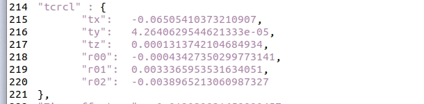

# 售后-双目行差检查与行差标定方案

# 1. 整体流程

1. 行差检测：

   1. 机器摆放于售后标定环境前

   2. APP 进入特定页面，点击“双目行差检查”

   3. 机器拍摄一组 GDC 图像，喂给标定算法进行检查

2. 行差标定：标定双目之间的外参（baseline， 双目基线）与当前双目售后标定基本保持一致

   1. 标定输入新增右目图像

   2. 标定双目行差时，**同时标定双目到整机的外参**

      1. **正常的售后标定，也做双目行差标定**，如果外参变化大再输出

   3. 标定结果新增双目之间外参，称之为**双目基线**

   4. 标定完成后

      1. 对机器进行颠簸、跌落，人为检测行差。确定是否存在模组松动。

# 2. 工作项与排期

1. 通用逻辑，插件进入行差标定/售后标定页面后，给状态机下发进入售后标定模式 &#x20;

   1. 此时状态机不给 MSC、导航发任何消息，后续针对不同任务执行不同逻辑

   2. 打开传感器

2. 行差检测（针对双目模组老化问题）

   * APP 点击检查后，状态机给 MSC 发 **check\_diff&#x20;**&#x20;  &#x20;

     1. MSC 开始接收 gdc 图像

     2. MSC调用如下接口 bool rr\_do\_check\_line\_diff（）检查行差； &#x20;

     3. 如果结果大于 1.22 则需要进行标定，提示用户进行标定

3. 行差标定（针对双目模组老化问题）

   1. APP 提醒用户挪动机器到指定位置 &#x20;

   2. 点击开始标定时，插件告诉状态机需要行差标定，状态机给 MSC 发 **line\_diff\_calib**，并且通知导航开始行差标定动作（动作和售后标定一致）  &#x20;

      1. 机器开始运动

      2. 机器动作同“售后双目外参标定”

      3. 此功能同时标定双目外参，这点属于算法内部逻辑，对外部无感知

      4. MSC 调用 rr\_do\_calib\_cameras\_line\_diff（） // rr\_do\_calib\_cameras + 标定双目之间外参

   3. 标定完成后，MSC先调用rr\_write\_dual\_cam\_calib\_result，然后调用rr\_write\_dual\_cam\_calib\_ext\_result()。此函数的作用是：输入是行差，6个double，此函数会将行差写入eeprom中预留的行差区域，同时，会将标定区域eeprom中的内外参等数据以及标定的行差写入dualcamera\_aftersale\_calibration.json。

      &#x20;&#x20;

      1. ~~注意写入时，包含 dualcamera\_calibration.json 的**全量参数**~~

      2. 驱动封装接口，一次写入 EEPROM+json

4. 机器启动后的参数读取流程

   1. 机器启动时，中间层调用AP接口检查 EEPROM 预留空间内是否有双目基线结果，有的话以“EEPROM 预留空间内的双目基线结果”覆盖掉厂商自己的双目基线结果。这一步的意义是：如果已经标定过了，就用标定后的双目基线值，如果没有标定过，就用厂商自带的，因为自带的值随着机器的老化会失真  &#x20;

   2. 调用读取 EEPROM 的接口，从 EEPROM 读取全部参数  &#x20;

      1. 经沟通，可能涉及到不止一个 EEPROM 接口。任意一个接口读取失败，都应当转向读取 json。

      2. 注意这里包含所有参数的读取，包括售后标定更新的双目到整机外参、双目基线参数

   3. 如果调用读取 EEPROM 的接口失败，通过读取 dualcamera\_calibration.json 的接口，以及读取 dualcamera\_aftersale\_calibration.json 的接口，读取所有参数，如果失败报错 &#x20;

      1. 优先级以及报错逻辑（aftersale 优先）：

         1. 读取 dualcamera\_aftersale\_calibration.json 如果成功，正常运行

         2. aftersale 读取失败后，读取 dualcamera\_calibration.json，如果成功正常运行，如果失败，报错

5. 售后双目外参标定的适配改动（针对换双目模组/机器拆机）  &#x20;

   1. 如果是售后标定，插件给状态机下发开始标定，状态机给 MSC 发 **after\_sale\_calib**，导航开始执行标定动作  &#x20;

   2. 标定完成后，双目到整机外参数写入 EEPROM（覆盖正常的外参写入区域）、写入/mnt/reserve/dualcamera\_aftersale\_calibration.json  &#x20;

      1. 注意写入时，包含 dualcamera\_calibration.json 的**全量参数**

6. 工厂标定遗留问题解决 dualcamera\_calibration.json 保存 （针对当前 dualcamera\_calibration.json 缺失问题）&#x20;

   1. 工厂标定时补充：将/tmp 下的 dualcamera\_calibration.json，拷贝到/mnt/reserve 下

   2. 已出厂的机器，不再额外处理

      1. EEPROM 读取失败，不存在 dualcamera\_aftersale\_calibration.json 和 dualcamera\_calibration.json 的情况下直接报错

   3. 工厂标定时补充：dualcamera\_calibration.json 保存 tcrcl &#x20;

      

7. 确定是否需要每次开机时备份产生。json 文件 &#x20;

# 3. 接口定义

[ 售后标定设计文档](https://roborock.feishu.cn/wiki/NJ5nweU7YiaQpwkZvSgcBxZsnbd)

新增接口在本文档定义。

