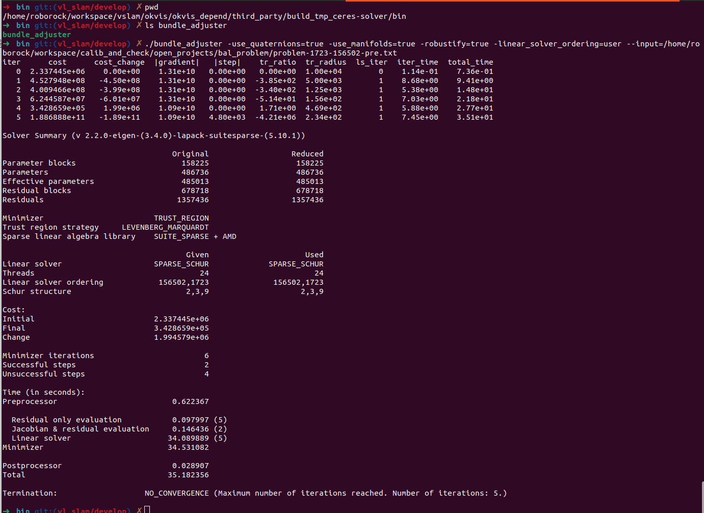

# 定位组-售后双目基线标定开发计划

# 方案概述

1. 构建优化问题：

   1. 左目为基目，右目为附目

   2. 构建ceres优化问题

   3. 待优化变量

      1. Twc1, Twc2, ... Twck为左目各个时刻的姿态

      2. Tc1c2为双目之间外参

      3. 所有二维码特征点的三维位置

   4. 约束

      1. 重投影误差

   5. 这样Twc1, Twc2, ... Twck为左目各个时刻的姿态，替换掉现在重跑图时用来和odo标定的轨迹，这样就有了双目的观测，更准确

# 实现计划

1. 跑通并**理解**ceres的bundle\_adjuster程序 &#x20;

   1. ceres编译完成后，就会有这个程序

   2. 数据集下载地址：<https://grail.cs.washington.edu/projects/bal/final.html>

   3. 注意咱们要用功能需要开启一些参数，在命令行中已标出来

   

2. 修改并实现RR基线标定问题，跑通在线数据  2/5

   1. 去除与目前情况不相关的待优化变量

      1. 去除掉bal\_problem中参数的focal length和径向畸变参数

      2. 去除掉SnavelyReprojectionErrorWithQuaternions重投影误差中的focal length、径向畸变参数的使用，形成RockLeftCamReprojectionErrorWithQuaternions、RockRightCamReprojectionErrorWithQuaternions

   2. 构造Problem

      1. 数据采集 \\\\[10.250.4.29](http://10.250.4.29)\build\Mower\Versa\Debug\BuildRelease\9998\_2026012804dy\_RelWithDebInfo\_debug &#x20;

      2. 右目观测提取，左目观测、右目观测、3D点之间的关系 &#x20;

      3. BA优化代码框架搭建 &#x20;

      4. 集成入rr\_do\_calib\_cameras\_baseline函数 &#x20;

      5. 代码bug排查、批量测试 &#x20;

   3. 实现RR基线标定问题

      1. 该问题假设图像已经经过单目去畸变，内参只有fx fy cx cy并且已固定

         1. RockLeftCamReprojectionErrorWithQuaternions问题定义

            1. $$r=\left[\begin{matrix} fx & 0 & cx \\ 0 & fy & cy \end{matrix}\right]\frac{1}{[T_{cw}P_w]_z}\left[\begin{matrix} [T_{cw}P_w]_x \\ [T_{cw}P_w]_y \\ [T_{cw}P_w]_z \end{matrix}\right] - \left[\begin{matrix} u_l \\ v_l \end{matrix}\right]$$

            2. 其中 $$u,v$$为左目观测到的特征点（二维码检测到的特征点）， $$T_{cw}$$为world在左目系下的姿态

         2. RockRightCamReprojectionErrorWithQuaternions问题定义

            1. $$r=\left[\begin{matrix} fx & 0 & cx \\ 0 & fy & cy \end{matrix}\right]\frac{1}{[T_{crcl}T_{cw}P_w]_z}\left[\begin{matrix} [T_{crcl}T_{cw}P_w]_x \\ [T_{crcl}T_{cw}P_w]_y \\ [T_{crcl}T_{cw}P_w]_z \end{matrix}\right] - \left[\begin{matrix} u_r \\ v_r \end{matrix}\right]$$

            2. 其中 $$u,v$$为观测到的特征点（二维码检测到的特征点）

         3. 注意，**完全使用Ceres自动求导，如非必要不要自己算导数**，代码参考bundle\_adjuster

         4. $$P_{wj}, T_{wcli}$$

         5. $$T_{wcli}, u, v, P_w $$, $$T_{wcri}, u, v, P_w $$

         6. 构建优化问题

            1. addParameterBlock, pw位置, camera姿态 add进去

               1. Pw xyz

               2. Camera qw qx qy qz, x y z

            2. addResidualBlock

               1. 构造Residual

                  1. Ptr = new RockLeftCamReprojectionErrorWithQuaternions(u, v, fx fy cx cy)

                  2. RockRightCamReprojectionErrorWithQuaternions(u, v, fx fy cx cy)

               2. addResidualBlock(Ptr, camera, pw)

               3. problem->SetManifold(cameras + camera\_block\_size \* i, camera\_manifold);

3. 代码加入现有工程 &#x20;

   1. 替代掉第一遍建图后的第二遍定位部分

   2. 直接输出轨迹以供后续标定外参、直接输出双目基线参数

