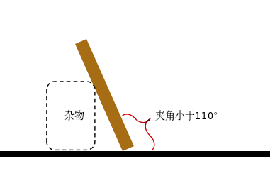
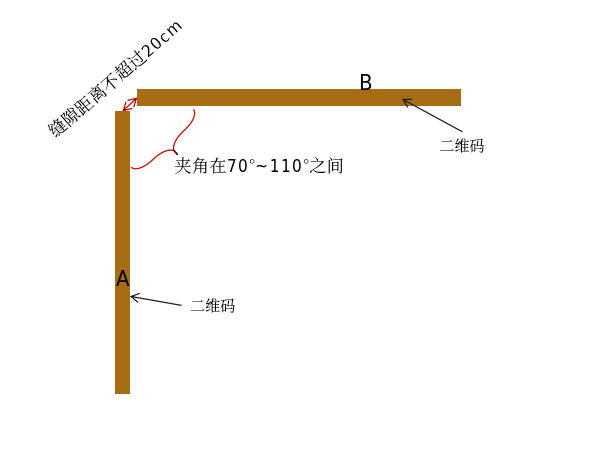

# 售后标定板摆放要求

## 一、AB板竖直摆放要求

* 板子和地面形成的夹角需要小于110度

* 单板可以靠在墙边、桌子边，或者其他障碍物上

图1. 单板摆放侧视图

## 二、AB板拼接摆放要求

* **A、B板必须成对， 不能用两个A板或者两个B板**

* **二维码图案必须在夹角内侧**

* **A、B板接缝位置间隙不超过20cm**

* **A、B板夹角需要保证在70°\~110°之间**

* A、B板子可以更换位置

* 每个板子没有上下的方向，随意摆放

图2. AB板摆放俯视图

> **注意： 标定过程中，A、B板必须保证静止，不能晃动！！**
