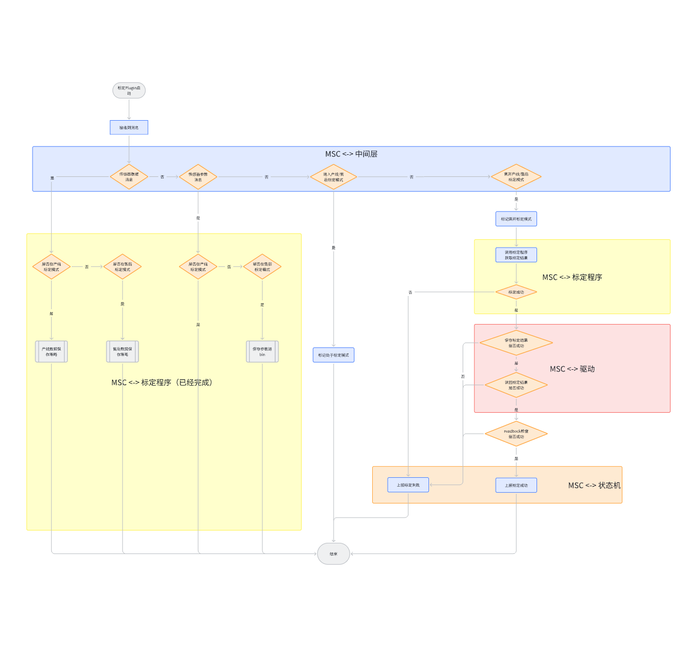
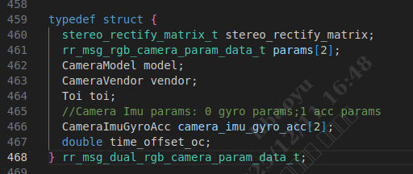
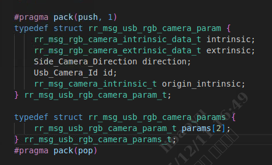

# 售后标定设计文档

# 会议信息

会议主题：售后标定接口对齐

会议时间：Oct 23 (Thu) 17:01 - 17:33 (GMT+08)

参会人：             &#x20;

# 会议议程

# 1. 售后标定整体流程

# 2. 售后标定错误定义

| 所属模块           | 错误码 | 错误含义                  | 售后处理方式                                                   |
| -------------- | --- | --------------------- | -------------------------------------------------------- |
| 标定算法0x01\~0x2f | 635 | Tcrcl优化失败/行差标定失败/其他错误 | Tcrcl失败：可能观测有问题，重新标定;行差标定失败：机器没有按照规定摆放;其他：检查传感器输入输出是否正常。 |
|                | 636 | 相机到odo外参标定失败          | 重标后仍然失败需要更换模组。                                           |
|                | 637 | imu到odo外参检测不通过        | imu内参有问题/标定过程中治具晃动/地面治具没有铺平。                             |
|                | 638 | 机器不在二维码场地             | 将机器放在指定区域进行标定。                                           |
|                | 639 | 机器打滑                  | 检查地面是否有水渍、轮子转动是否正常。                                      |
| 标定模块0x30\~0x5f | 621 | 读写文件错误                |                                                          |
|                | 622 | 雷达数据异常或不足             |                                                          |
|                | 623 | 双目相机数据异常或不足           |                                                          |
|                | 624 | 雷达IMU数据异常或不足          |                                                          |
|                | 625 | 双目相机IMU数据异常或不足        |                                                          |
|                | 626 | ODO数据异常或不足            |                                                          |
|                | 627 | 运动轨迹异常                |                                                          |
|                | 628 | 标定库异常                 |                                                          |
|                | 629 | 写EEPROM异常             |                                                          |
|                | 630 | 右USB相机数据异常或不足         |                                                          |
|                | 631 | 左USB相机数据异常或不足         |                                                          |
|                | 632 | 未获取到双目相机参数            |                                                          |
|                | 633 | 未获取到USB相机参数           |                                                          |
|                | ... |                       |                                                          |

# 3. 各模块间接口定义

以下项中，黄色为未实现的功能点。

## 3.1 数据类型定义

标定参数输入：

**当前欠缺Tci（imu到左目外参）**

标定结果输出：

## 3.2 MSC Plugin <-> 中间层

* 接口功能

  * 侧目相机消息发布接收保存

    * 消息id: eRRMsgType\_UsbRGBCameraData

    * 消息类型：rr\_msg\_usb\_camera\_data\_t

    * 数据保存需求

      * 此消息发布帧率为10Hz，需要保存帧率为5Hz

      * image.header.frame\_number %2 == 1的帧才保存

      * 带畸变的灰度图

      * 图像大小为wxh = 640x544（收到的图像即是此分辨率）

  * 前视图像、odo、imu数据发布、接收、保存沿用已有策略

  * 侧面相机参数发布与接收  ，最晚联调前完成&#x20;

    * 消息id：待定

    * 消息类型：rr\_msg\_usb\_rgb\_camera\_params\_t

    * 无论是否标定过，都发布，有什么参数发布什么？

      * 与“产线core事件，不发布外参有冲突”

      * 未标定时：

        * 内参发布：eeprom里面已经存在

        * 外参发布：旋转为单位阵，平移为0

## 3.3 MSC Plugin <->标定算法

* 接口功能：

  * 调用标定程序，获取标定是否成功，最晚联调前完成   ，最晚联调前完成&#x20;

    * 需要新增接收参数的功能

## 3.4 MSC Plugin <->驱动层

* 接口功能：

  * 写入标定结果到eeprom&#x20;

    * 驱动层接口USB参数写入 ，前视双目写入  ，最晚联调前完成&#x20;

    * 头文件：

    * 调用函数（根据目前情况可调整）：

      * rr\_write\_dual\_cam\_calib\_result

      * rr\_write\_side\_cam\_calib\_result

  * 读取标定结果（用于readback检查）

    * 驱动层接口USB参数读取 ，前视双目读取  ，最晚联调前完成&#x20;

    * 头文件：

    * 调用函数：

      * 前视双目复用已有接口

      * 侧目新增

* Node:

  * 侧目新增direction定义

  * ~~需要确定机器运行期间是否能够读/写eeprom：已确定可以~~

## 3.5 MSC Plugin <->状态机

* 接口功能：

  * 告知MSC Plugin进入/离开相关标定状态

    * 已实现

  * MSC上报是否标定成功  ，最晚联调前完成&#x20;

## 3.6 状态机 <-> 插件

1. &#x20;

# 4. 日志保存/上传策略

* MSCplugin普通日志 &#x20;

  * /dev/shm/MSC\_normal.log，与SLAM\_normal.log的上传策略保持一致。

* MSCPlugin传感器数据文件

  * MSCPlugin  &#x20;

    * 进入标定模式时，删除/mnt/data/rockrobo/msc\_calib/msc\_latest/目录

    * 如果标定失败/mnt/data/rockrobo/msc\_calib/msc\_latest/msc\_pass.bin重命名为/mnt/data/rockrobo/msc\_latest/latest/msc\_calib\_fail.bin

  * 进入和离开售后标定模式时触发正常的日志打包&#x20;

    * 标定失败由用户退出标定模式（已经实现）

    * 状态机给rrlog发消息，触发打包，复用怼桩上传消息

  * 日志模块&#x20;

    * 检测/mnt/data/rockrobo/msc\_calib/msc\_latest/msc\_calib\_fail.bin是否存在

      * 存在的话，把/mnt/data/rockrobo/msc\_calib/msc\_latest/msc\_calib\_fail.bin打包进新的日志包。（通过移动的方式，避免拷贝）

    * 优先级调高，与SLAM\_normal.log的上传策略保持一致

# 5. Actions

1. 确定售后标定数据的后续上传方式

   1. 预期可以采用日志的方式进行上传，待讨论

   2. 有隐私问题找（张磊问是谁负责，扫地机tof项目是盯着风险上传的）

2. 状态机和插件的交互逻辑，下周开始讨论

[ 售后整机标定方案-初版](https://roborock.feishu.cn/wiki/JLaHwA1BVi3jj4kfQjSc7lrCnBe)

