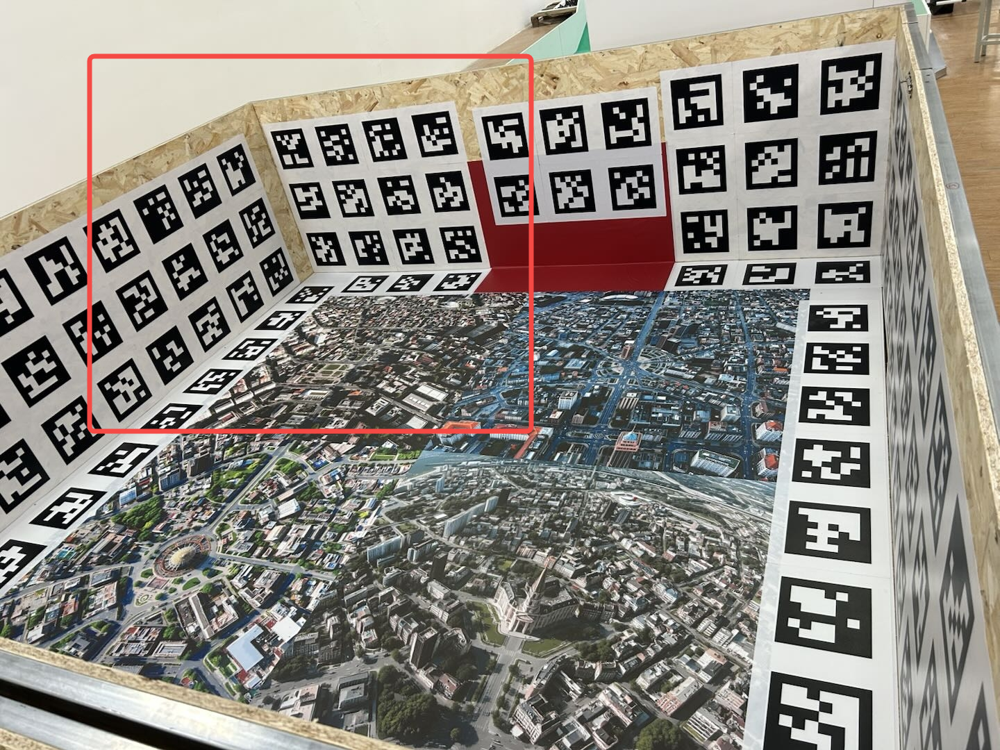
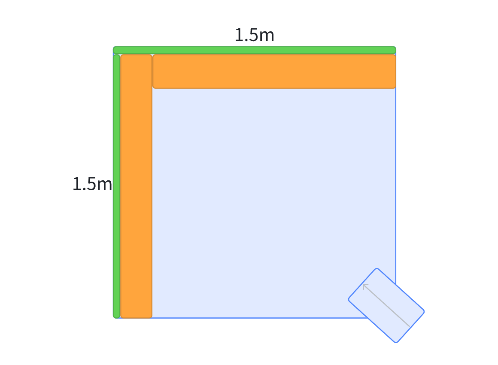

# 售后整机标定方案

# 一、工站&要求

1. 如图所示，在一个1.5m x 1.5m x 1m（高）的墙角贴满二维码（材质、规格与工厂标定方案一致） 可以提供。

2. 张贴牢固，不鼓包，不变形。

3. 场地地面要求平整，要摩擦力大的硬质地面避免打滑。

4. 墙角周边2mx2m的区域能够摆放机器。

5. 地面上也需要贴满二维码。

* 场地俯视示意图

# 二、标定流程

1. 机器摆放位置确定正确

2. 点击机器进入售后标定模式，或者APP上操作进入售后标定模式，进入售后标定模式后：

   1. 机器开始运动，轨迹~~待定（大概是S型）~~走S曲线，此时，相机会被打开，MSC模块开始收集相机数据

   2. 运动完成机器静止，此时机器开始进行标定计算——运算可以是在机器上进行，或者使用上位机进行控制

   3. 运算完成后，标定结果输出至dualcamera\_calibration.ouput.json、result.json。其中，dualcamera\_calibration.ouput.json格式应该和dualcamera\_calibration.json完全一致，result.json是定位模块自身标定的log结果。

3. 确定&应用结果

   1. 人为点击/程序判断后，APP通知，将标定结果写入dualcamera\_calibration.json、EEPROM。

# 四、其他事项

* 什么情况下需要重新标定

  * 原理上，任何涉及到轮子相对于整机的位置、相机相对于整机的位置的改动，都需要重新整机标定

  * 比如

    * 更换双目模组

    * 更换轮组（前、后轮）

    * 机器开盖（带相机的结构被拆下、打开）

1. 考虑标定二维码做在可折叠的板子上。

2. 摊开空间尽量维持再1.5x1.5内。

