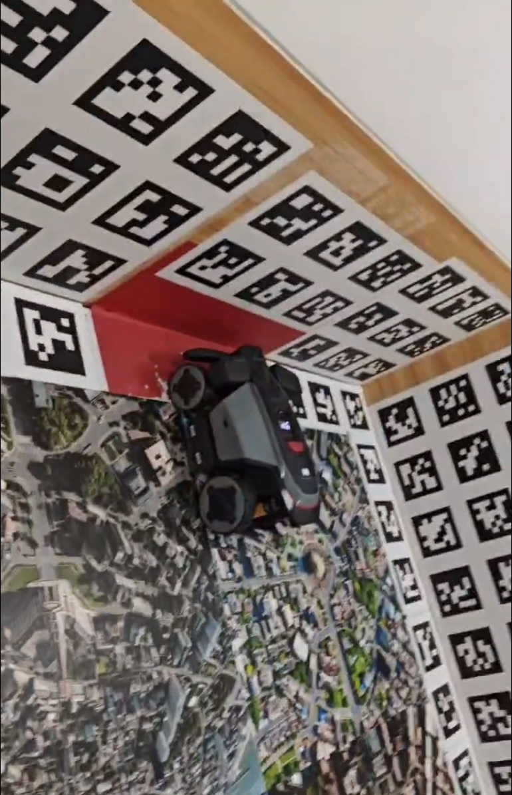
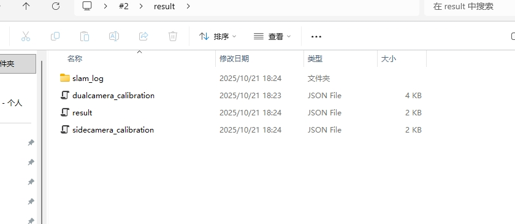
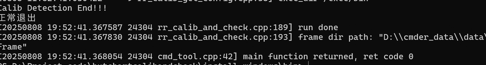
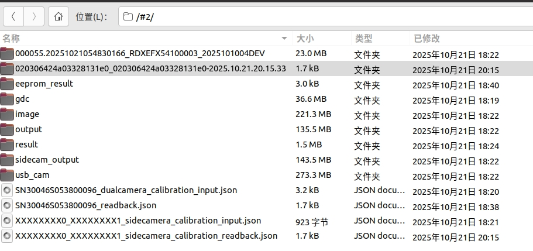

# 整机二维码标定台操作流程

代码包和 docker 环境更新见[ docker环境配置和代码包更新](https://roborock.feishu.cn/wiki/XNKTwNeBSibTDvka4GAcDBuunXe)

ap 版本需适配 20250810 后新版本

1. \# 机器生成 SN\_dualcamera\_calibration\_input.json

rradb default shell uart\_test -t AT+APFAC%

rradb default shell uart\_test -t AT+CAMERA=1,RESERVE\_JSON,0,/tmp%

Monet 机器还需要生成 SN\_XXX\_XXXXX\_sidecamera\_calibration\_input.json： rradb default shell uart\_test -t AT+USB\_CAMERA=1，RESERVE\_JSON，0，/tmp%

rradb default shell uart\_test -t AT+APNORMAL%

* 二维码标定台触发标定模式

  * 将机器摆放在标定台指定位置（双目镜头距离红布约一拳）

* 机器关机重启（必须重启！！！)&#x20;

* 输入 pin 码

  * 标定模式按键组合（长按 HOME+连按 5 次 MOW）->（按 OK）

* 按 OK 后标定开始，3S 内人退出标定台并关门

* 等待机器走完 8 字.......

* 拉取标定日志，到本地目录\<data\_path>

rradb default shell uart\_test -t AT+APFAC%

* 拉取相机内参 json 文件

rradb default shell ls /mnt/reserve

（看到/mnt/reserve 下有个 json 文件，名为：SNXXX\_dualcamera\_calibration\_input.json，拉取该文件）

rradb default pull /mnt/reserve/SNXXX\_dualcamera\_calibration\_input.json \<data\_path>

（monet 机器还需要拉取 SN\_XXX\_XXXXX\_sidecamera\_calibration\_input.json）

rradb default pull /mnt/reserve/SN\_XXX\_XXXXX\_sidecamera\_calibration\_input.json \<data\_path>

* 拉取传感器日志

rradb default shell ls /mnt/data/rockrobo/noupload

（拉取/mnt/data/rockrobo/noupload 下最新的日志包 XXX）

rradb default pull  /mnt/data/rockrobo/noupload/XXX  \<data\_path>

* 拉取 gdc 和 image 图像

rradb default pull /mnt/data/rockrobo/rrlog/gdc   \<data\_path>

（2025.9.8 号后软件版本 gdc 路径更新为：/mnt/data/rockrobo/noupload/gdc

rradb default pull /mnt/data/rockrobo/noupload/gdc   \<data\_path>

)&#x20;

rradb default shell uart\_test -t AT+CAMERA=0,MCT\_SIMPLIFY\_IMG,1%

rradb default pull /mnt/data/rockrobo/rrlog/image   \<data\_path>

（2025.9.8 号后软件版本 image 路径更新为：/mnt/data/rockrobo/noupload/image

rradb default pull /mnt/data/rockrobo/noupload/image   \<data\_path>

（monet 机器还需要拉取 usb\_cam）

rradb default pull /mnt/data/rockrobo/noupload/usb\_cam   \<data\_path>

)&#x20;

rradb default shell uart\_test -t AT+APNORMAL%

***

以上标定数据集采集完毕，电脑端执行标定程序

***

* 已经配置好标定程序的 Windows 电脑

  标定程序文件夹放置在

  D:\calib\_docker\windows\_exe

  在该文件夹下打开终端

  * 执行标定程序：

  .\cmd\_tool.exe calib\_cam\_odo   \<data\_path> \<Monet/Versa/Flora/Lumos>（四驱机器含：Monet、Versa 额外添加一个参数，两驱 Butchart/pro 忽略）

- （可选）执行极线校正检测：

.\cmd\_tool.exe line\_diff\_checker   \<data\_path>\gdc

* 将生成的标定结果 push 到机器，并写入 EEPROM

在\<data\_path>路径下会有标定结果文件夹\<data\_path>/result

如果 result 文件夹下有文件 dualcamera\_calibration.json 则表示标定成功，monet 机器需要同时有 dualcamera\_calibration.json 和 sidecamera\_calibration.json 表示标定成功。

monet 标定后的 result 文件夹如下图：

rradb default push \<data\_path>\result\dualcamera\_calibration.json /tmp/bin.json

rradb default shell sync

* 标定结果写入 EEPROM （确保标定成功的机器才能写入，禁止随便写入一个 json 文件）

rradb default shell uart\_test -t AT+CAMERA=0,WRITE\_CALIBBIN,/tmp/bin.json%

Monet 还需要执行：rradb default push \<data\_path>\result\sidecamera\_calibration.json /tmp/bin.json

Monet 还需要执行：rradb default shell sync

Monet 还需要执行：rradb default shell uart\_test -t AT+USB\_CAMERA=0，WRITE\_CALIBBIN，/tmp/bin.json%

查看是否写入成功，返回 ok， 字样

* 拉取写入 EEPROM 的 json 结果

rradb default shell uart\_test -t AT+CAMERA=0,READBACK\_CALIB\_JSON,0,/tmp%

Monet 还需要执行：rradb default shell uart\_test -t AT+USB\_CAMERA=0，READBACK\_CALIB\_JSON，0，/tmp%

指令会返回读取 EEPROM 的 json 文件路径：/mnt/reserve/SNXXX\_readback.json

* 将返回结果拉取到标定日志路径 \<data\_path>下

rradb default pull /mnt/reserve/SNXXX\_readback.json \<data\_path>

Monet 还需要执行：rradb default pull /mnt/reserve/SN\_XXX\_XXXXXsidecamera\_calibration\_readback.json \<data\_path>

* 校验写入 EEPROM 标定结果

windows\_exe 路径下执行程序

.\cmd\_tool.exe check\_cam\_calib   \<data\_path>

（0926 以后更新的标定环境执行：

.\cmd\_tool.exe check\_eeprom\_readback   \<data\_path>

)&#x20;

程序返回结果显示 0 表示校验成功，其他都表示校验失败。

针对校验失败的情况：再次尝试执行上述步骤 5 里的内容，如果最终校验仍失败请联系软件同事 排查问题。AT 指令失败相关问题请联系  。行差标定失败问题请联系 。

***

确保外参写入 EEPROM 成功且校验 EEPROM 内容成功后整机外参标定完成。

monet 标定后的所有数据如下图（XXXXXXXDEV 文件有一个即可）：

