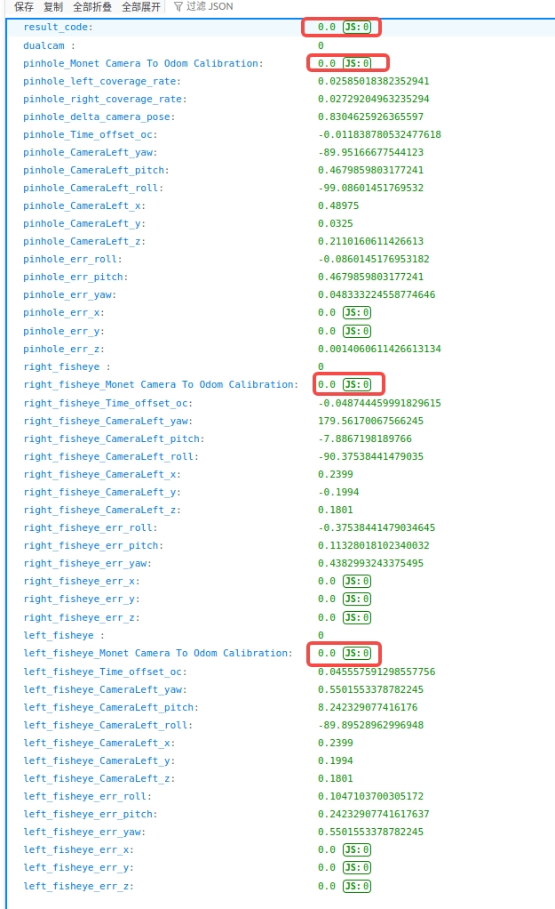
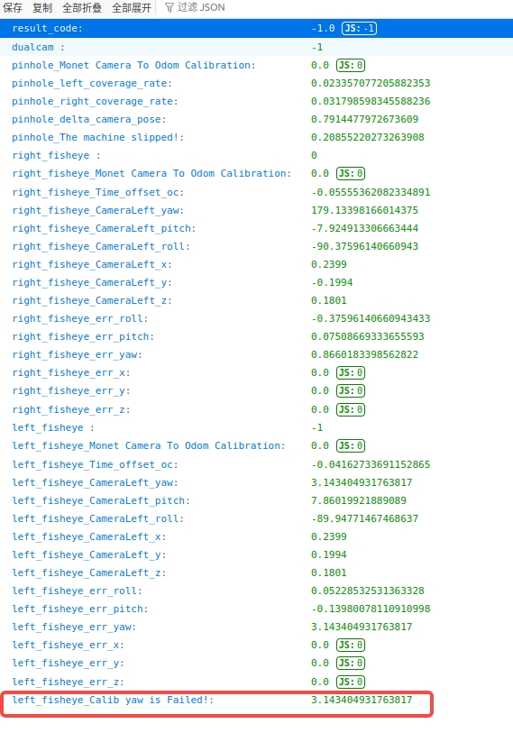
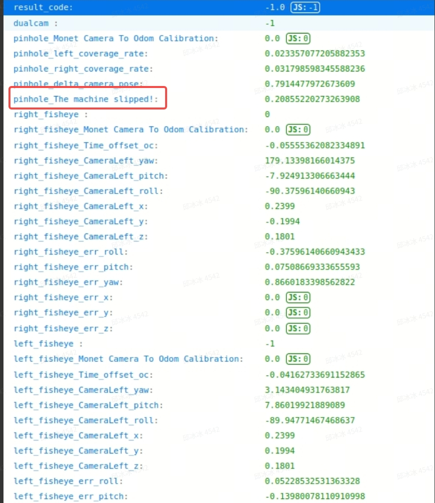
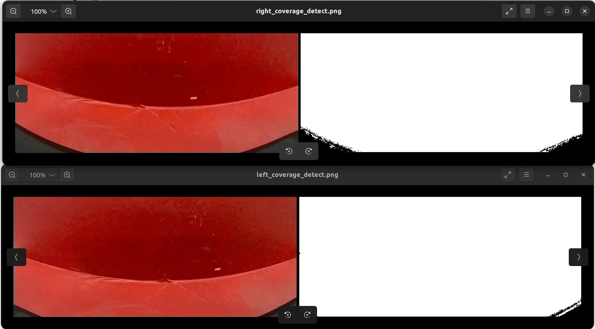

# MCT&IQC Q&A

## MCT 常见问题汇总

1. 标定后打开 result 文件夹里的 result.json，如下图。如果所有相机标定成功，则第一行的 result\_code 显示 0；

如果有一个相机外参标定失败则显示 -1。下面 dualcam、right\_fisheye、left\_fisheye 后的数则表示对应的双目相机、右侧目相机、左侧目相机是否标定成功，成功显示 0，失败显示 -1。如果某个相机标定失败，下面也会显示出具体哪个部分失败。

* **相机外参**标定不过。

| **报错**                          | **问题**            | **阈值** | 如果标定误差超过阈值 1cm，1 度内，可以尝试重新跑 2 次看是否标定成功 | **解决方法**                                     |
| ------------------------------- | ----------------- | ------ | -------------------------------------- | -------------------------------------------- |
| Pinhole z is failed!            | 双目相机平移 z 标定失败     | 0.03   |                                        | 查看地面二维码是否不平整，是否与地面之间有缝隙。                     |
| Pinhole roll is failed!         | 双目相机 roll 角标定失败   | 2      |                                        | 检查机器前后轮是否能够正常滚转、转向。可能是相机内参不合格或模组有问题，需要更换对应相机 |
| Pinhole pitch is failed!        | 双目相机 pitch 角标定失败  | 2      |                                        |                                              |
| Pinhole yaw is failed!          | 双目相机 yaw 角标定失败    | 2      |                                        |                                              |
| right\_fisheye roll is failed!  | 右侧目相机 roll 角标定失败  | 2      |                                        |                                              |
| right\_fisheye pitch is failed! | 右侧目相机 pitch 角标定失败 | 2      |                                        |                                              |
| right\_fisheye yaw is failed!   | 右侧目相机 yaw 角标定失败   | 3.1    |                                        |                                              |
| left\_fisheye roll is failed!   | 左侧目相机 roll 角标定失败  | 2      |                                        |                                              |
| left\_fisheye pitch is failed!  | 左侧目相机 pitch 角标定失败 | 2      |                                        |                                              |
| left\_fisheye yaw is failed!    | 左侧目相机 yaw 角标定失败   | 3.1    |                                        |                                              |

* **imu 外参**标定失败

| **报错**              | **问题**          | **解决方法**                                                                                        |
| ------------------- | --------------- | ----------------------------------------------------------------------------------------------- |
| Toi x is failed     | Toi 平移 x 标定失败   | 检查 input.json 里的 vendor 是否是舜宇对应的 2，或者联合对应的 3，如果错误需要修改。&#xA;如果 vendor 没问题说明 toi 内参提供的不对，需要进一步排查。 |
| Toi y is failed     | Toi 平移 y 标定失败   |                                                                                                 |
| Toi z is failed     | Toi 平移 z 标定失败   |                                                                                                 |
| Toi roll is failed  | Toi roll 角标定失败  |                                                                                                 |
| Toi pitch is failed | Toi pitch 角标定失败 |                                                                                                 |
| Toi yaw is failed   | Toi yaw 角标定失败   |                                                                                                 |

* **机器打滑**

检查地面是否有水渍、转动轮子是否丝滑。

* **遮挡检测失败**。result.json 里报 coverage\_rate fail！

打开 result 文件夹里的 slam\_log 文件夹里的 left\_coverage\_detect.png 和 right\_coverage\_detect.png，下图是正常的。如果白色区域出现黑色或者黑色面积太大或者边界很模糊，可能是有阴影、灰尘遮挡红布或者相机安装位置有问题。

* **时间同步**失败。result.json 里报 time offset fail！

可能是轮子打滑、地面有污渍或走 8 字中间有暂停，可以重跑试试。或者打开 output 文件夹里 camera0 和 camera1 第一张肉眼可见动起来的图对比图片名，即时间戳，如果差 500 以上说明左右目存图不同步，找 。

* output 文件夹里**没有图片**，无法标定

检查 image 文件夹里是否有 L\*\*\*\*。fs 和 R\*\*\*\*。fs，如果没有说明没成功存图，找 。

* 没有生成 result.json 且 result 文件夹里的 slam\_log 文件夹里的 cmd\_out.log 显示**没有“wheel data”**。

打开 output 文件夹看是否有 RRLDR\_fprintf.log，如果没有说明没有存轮子的日志，找 。

## IQC 常见问题汇总
