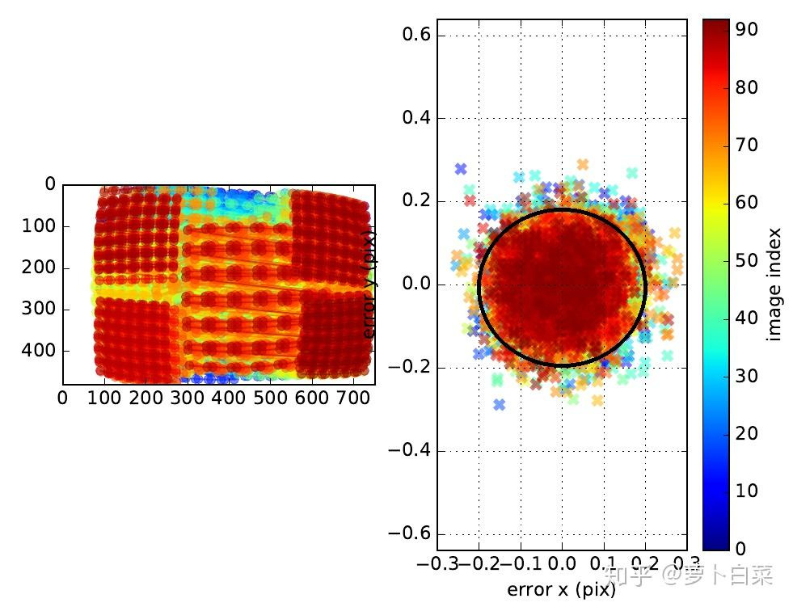
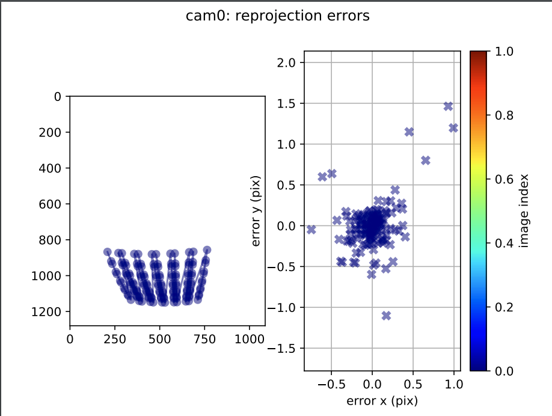

# 割草机标定操作整理

1. 先用 pinhole-equi 模型标定相机内外参；

2. 推荐使用以下开源算法，针对鱼眼相机有优化，命令格式基本与kalibr相同：

   1. https://github.com/castacks/tartancalib?tab=readme-ov-file

# Camera 内外参标定

标定板在FOV分布：

1. 标定数据集target分布：

   1. 整体上能覆盖图像各个区域；

   2. **相机与标定板呈不同角度**（夹角在60 deg以内，以免畸变过大无法识别）；

   3. 包含近、中、远不同距离采集；

2. 光照充足且均匀，光照不足容易导致运动模糊，光照不均匀或存在反光点会影响角点提取精度；

3. 使用足够大的标定板(0.5m以上， 1m为佳)；

   * 如果条件允许，尽可能使用专业高精度标定板或者激光打印标定板；

4. 建议图像降频到1 - 5hz，避免太多重复冗余的图像数据参与优化，并且挑选无明显运动模糊的图像数据；

# Camera - IMU 外参标定

1. 对三个轴（yawing, pitching and rolling）进⾏旋转，以及在三个⽅向（x,y,z）上进⾏平移；（各个轴务必激励充分）

2. 为保证可以看到标定板，yawing、pitching 每个轴转动幅度\[-60, 60]deg，roll 转动幅度在\[0, 360]；&#x20;

3. 进⾏轴转时，相机的平移尽可能小（⼩于5 厘⽶）；

4. &#x20;运动速度不宜过快（减少图像运动模糊），运动时间30s左右；

5. imu-camera标定轨迹应平缓稳定，要避免抖动剧烈；

## 补充：

* kalibr标定结果的理解：（参考网上一个图）

  

  * 右侧颜色条是参与优化的视图的数量，如这里是90+；

  * 视图的顺序是增量式参与优化的顺序，可以看到最后的view是深红色，第一个是深蓝色；

  * 右图每一&#x4E2A;**×**&#x5C31;是对应view上的角点的重投影误差，内外参随着增量式优化逐渐贴近真值，所以id越靠后的view各个点的重投影误差应该更小，如图中**蓝色的重投影误差更发散，红色的重投影误差更收敛**。

  * 角点的重投影误差最好是一个圆形的分布，表示在各个方向上误差一致；

  > 预期重投影误差是逐渐收敛的，且各向同性；

* 此次标定的结果分析：

  

  1. 由于时间戳的错误，显然只使用了单帧图像标定；

  2. 重投影误差无收敛过程；
