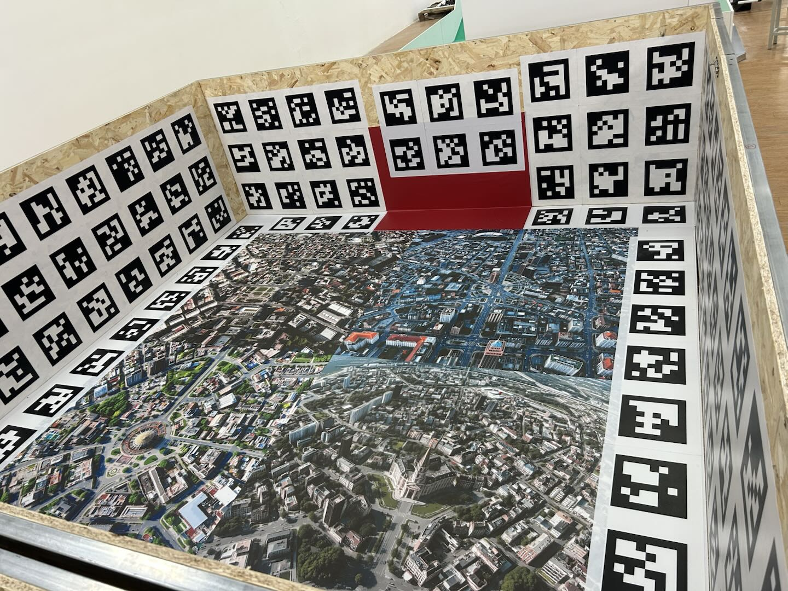
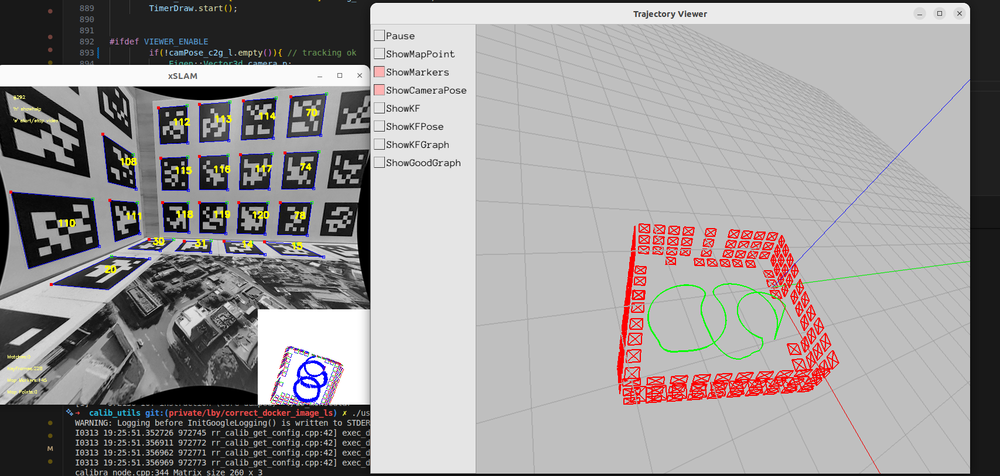
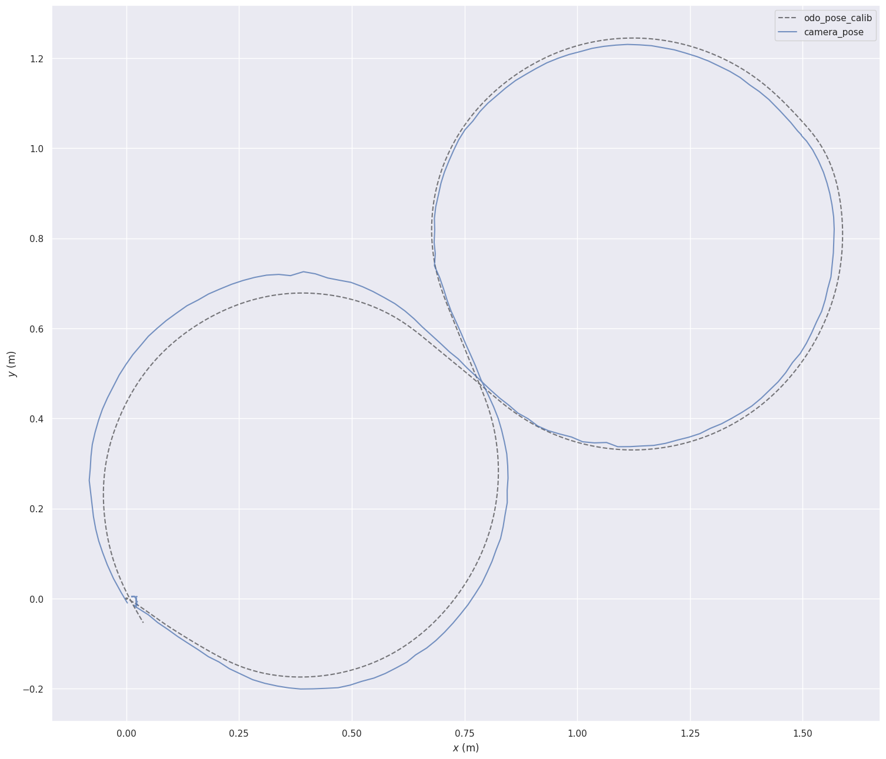
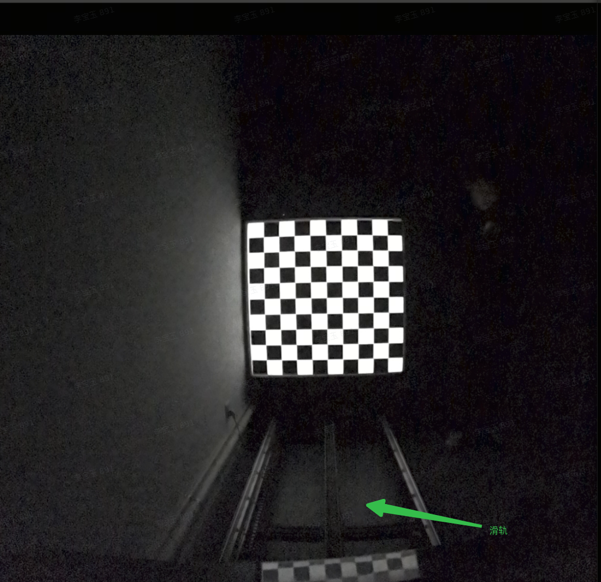
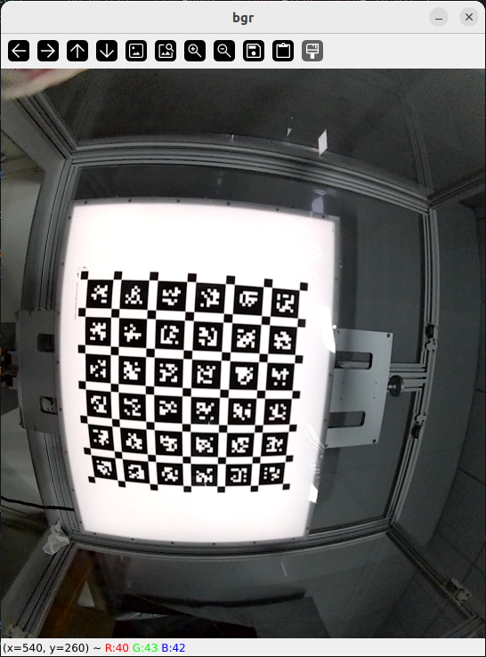

# Butchart标定与检测：方案设计整理

# 1. MCT

## 1.1 工站&要求

二维码方形场地

1. 围成一片3mx3m的方形场地，挡板高1m。

2. 上贴二维码，规格 提供。

3. 张贴牢固，不鼓包，不变形。

4. 挡板稳定，工作期间绝对静止。

5. 挡板基本摆正。

6. 场地地面要求平整，要摩擦力大的硬质地面避免打滑。

7. 地面四角贴二维码。

## 1.2 执行动作

1. 涉及工站

   1. 二维码方形场地(保证环境明亮可多层）

2. 二维码方形场地动作

   1. 控制机器在场地内运动特定轨迹，约1分钟左右。相机轨迹与二维码检测结果大致如下图。

      

      

      1. 启动时，机器正对红色贴纸，距离贴纸约Xcm处。

      2. 静止约5秒钟，期间拍摄彩色图像

      3. 机器逆时针旋转270°

      4. 机器本身开始走8字，ODO坐标系运动轨迹如上右图所示。

   2. 保存数据，调用整机标定算法

   3. 具体调用命令流程请参考[ 机器人整机标定SOP](https://roborock.feishu.cn/wiki/LdTOwOxrniS4pnkNHn7cfmInn3f)

# 2. CQIQC

## 2.1 工站&要求

整体规格同办公区3m滑轨治具。

1. 滑轨长度>=3m

2. 棋盘格为10x10，每个格子大小为0.1m

3. 棋盘格要求不反光（贴亚光膜）。（暗室）

4. 治具由放置整机改为放置模组。

## 2.2 执行动作

2. 3m滑轨动作

   1. 模组置于3m滑轨，在1m、1.5、2m处拍摄图像

   2. 保存图片，调用相机内参&基线检测算法

   3. 具体流程参考[ CCIQC+CIIQC数据采集](https://roborock.feishu.cn/wiki/GKeWwuiyxi1sl9kPlCzcSpvHnGn?open_in_browser=true)

# 3. CIIQC

## 3.1 工站&要求

1. 场地布设有机械臂+APrilGrid二维码

   1. 二维码规格butchartcalibandcheck/docker\_tools/configs/target.yaml

   2. **注意：产线的二维码与工区的二维码略有不同。！！！！在文件里面已备注**

   3. 二维码不反光

2. 下面为采集gyro数据时的标定轨迹（没找到整体的轨迹，需要的话得现拍），以及拍图的样张

## 3.2 执行动作

1. 同时采集80s 的双目图像和imu的数据，按照现有轨迹，对六个自由度分别充分激励（软件提供轨迹文件）

2. 然后上位机拉取数据。计算结果，得出结论。

3. 具体流程参考[ CCIQC+CIIQC数据采集](https://roborock.feishu.cn/wiki/GKeWwuiyxi1sl9kPlCzcSpvHnGn?open_in_browser=true)

