# 售后标定测试数据采集方案

机器SN

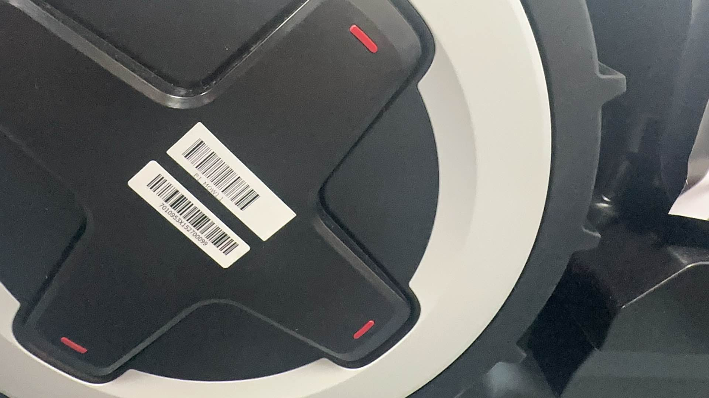

在1/4的标定场地面积（约1.5m\*1.5m）中采集数据，只有两面墙有标定板，每面标定板5列3行，地面处两边各有1行标定板，现设计采集路线如下：

1. S形(2组：序列号1-2)

摆正（车体正面向前，中心对应地缝，两后轮中心对应地缝）向前走，接近尽头边走边向右转180度，直走一段距离后向左转180度。数据标定成功率100%。

* ~~U形（2组：序列号3-4）~~

摆正向前走，接近尽头边走边向右转180度大圈，直走一段距离。数据标定成功率0%。

* ~~L形（2组：序列号5-6）~~

摆正向前走，至一半距离向右转90度大圈，向前直走到尽头。数据标定成功率0%。

* 伞形（5组：序列号7-11）

斜45度出发，走至一半距离，向左转45度，向右转90度，再左转90度。数据标定成功率80%。

* 工形（5组：序列号12-16）

摆正，向右转90度，向左转90度，向右转45度，前行至一半距离，向右转45度，向左转90度，向右转90度。数据标定成功率60%。

结论：

1. 1.5×1.5的场地内，伞形和工形分别采集的5组数据都能标定出结果，且与产线标定结果相比误差z<1cm，旋转角<1°；伞形和工形的标定成功率不高，且多次旋转动作有冗余但并没有提高标定精度，需要优化路线；

2. S形路线只采集了2组，标定成功率100%，需要多采集几组数据验证稳定性；S形不好遥控很难规划标准轨迹，且有一半时间因为看不到二维码缺少关键帧，轨迹图不连续；

3. 小场地标定会存在后轮间距和时间延迟误差较大的问题，后轮间距最大误差4.5cm，时间延迟结果波动范围较大。可以通过固定后轮间距和左右轮半径的方式解决后轮间距较大的问题，且对比出固定轮间距的方法对标定旋转角结果影响不大；

4. TUDO：针对售后标定可以缩小二维码尺寸，将现有二维码尺寸缩小一半，增加售后标定场景内的二维码数量，可提高相机定位精度，改善标定效果；多采集几组S形路线看稳定性；如果采用方案需要优化伞形和工形路线且提升标定成功率。

5. 总体看售后标定限制在小区域内，走较短轨迹，可以完成整机外参标定。

6. 取消时间延迟检测、固定左右轮半径和轮轴距后把所有数据重新标定，发现基本只有yaw有很小的变化（0-0.64deg，大部分在0.2deg内），可以忽略不计。

| **测试序列** | **日期**                                       | **路线** | **是否标定成功** | **左轮半径/m** | **右轮半径/m** | **轮轴距/m** | **cam-odo-x/m** | **cam-odo-y/m** | **cam-odo-z/m**            | **roll**                                                         | **pitch**                                                     | **yaw**                                                          | **时间同步/s**  | **轨迹图**                                                                             |
| -------- | -------------------------------------------- | ------ | ---------- | ---------- | ---------- | --------- | --------------- | --------------- | -------------------------- | ---------------------------------------------------------------- | ------------------------------------------------------------- | ---------------------------------------------------------------- | ----------- | ----------------------------------------------------------------------------------- |
| 产线       |                                              | 8字     | Y          | 0.111819   | 0.112103   | 0.362941  | 0.400000        | 0.032500        | 0.214407                   | -98.895139                                                       | -0.288822                                                     | -89.691573                                                       | -0.0200122  |                                                                                     |
| 1        | 2025\_0813                                   | S形     | Y          | 0.112812   | 0.111127   | 0.364042  | 0.400000        | 0.032500        | -0.210387                  | -1.725131  rad, -98.842742 deg                                   | -0.003572  rad, -0.204657 deg                                 | -1.560501  rad, -89.410135 deg                                   | -0.0158288  | 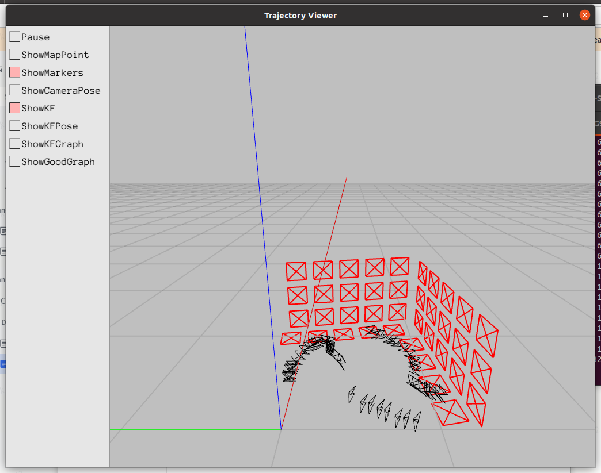 |
|          | 2025\_0813(取消时间延迟检测、固定左右轮半径和轮轴距)             | S形     | Y          | 0.120000   | 0.120000   | 0.361000  | 0.400000        | 0.032500        | -0.211094(diff: −0.000707) | -1.726007  rad, -98.892910 deg(diff: −0.000876rad, −0.050168deg) | -0.003370  rad, -0.193101 deg(diff: 0.000202rad, 0.011556deg) | -1.549312  rad, -88.769011 deg(diff: 0.011189rad, 0.641124deg)   | /           | 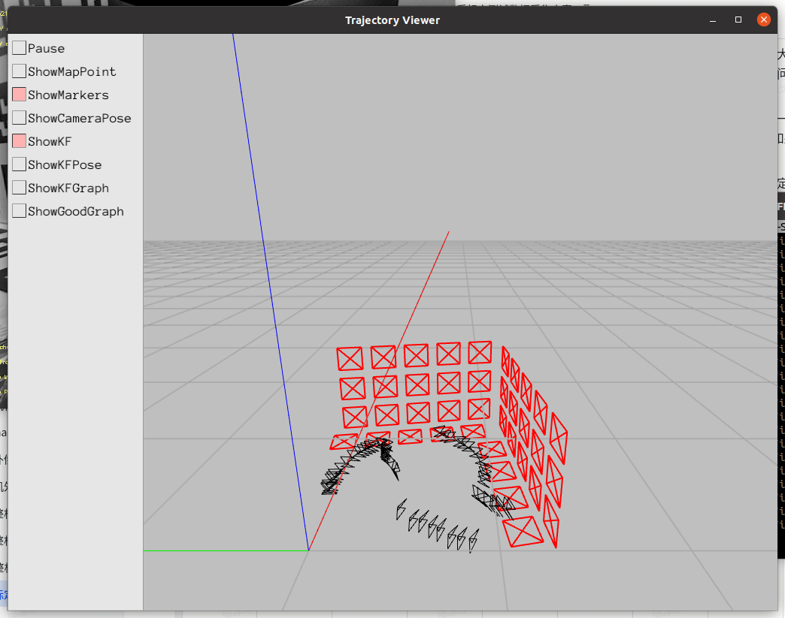 |
| 2        | 2025\_0813                                   | S形     | Y          | 0.113306   | 0.113296   | 0.361086  | 0.400000        | 0.032500        | -0.214977                  | -1.725159  rad, -98.844353 deg                                   | -0.001584  rad, -0.090742 deg                                 | -1.577829  rad, -90.402935 deg                                   | -0.0171257  | 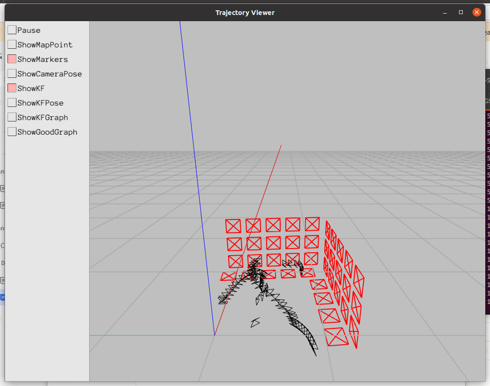 |
|          | 2025\_0813(取消时间延迟检测、固定左右轮半径和轮轴距)             | S形     | Y          | 0.120000   | 0.120000   | 0.361000  | 0.400000        | 0.032500        | -0.214977                  | -1.725159  rad, -98.844353 deg                                   | -0.001584  rad, -0.090742 deg                                 | -1.577934  rad, -90.408965 deg(diff: −0.000105rad, −0.00603deg)  | /           | 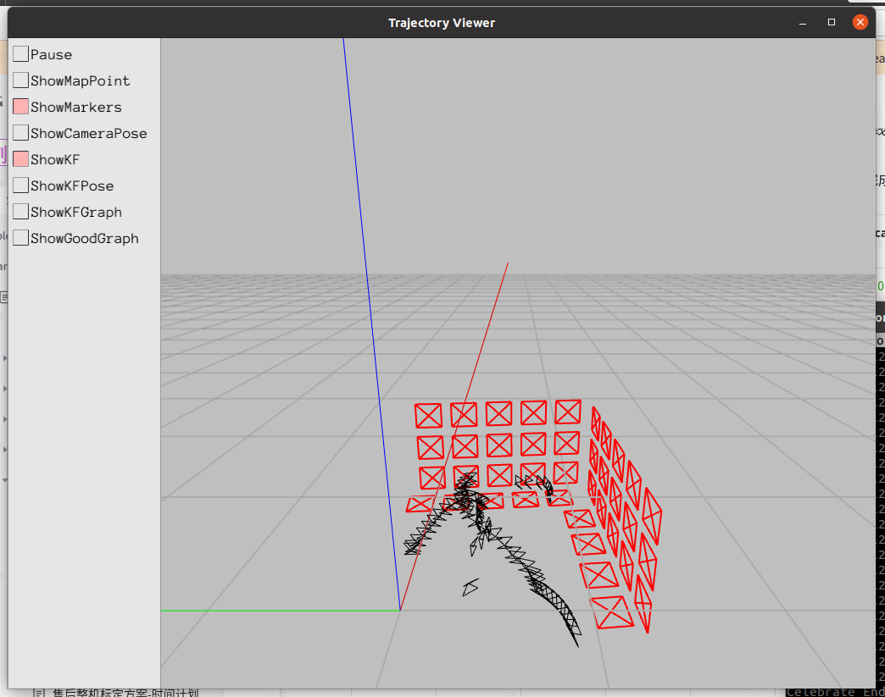 |
| 3        | 2025\_0813                                   | U形     | N          | 0.115157   | 0.112919   | 0.381859  | 0.400000        | 0.032500        | -0.216981                  | -1.727441  rad, -98.975063 deg                                   | 0.001642  rad, 0.094069 deg                                   | -1.561635  rad, -89.475082 deg                                   | -0.0669723  | 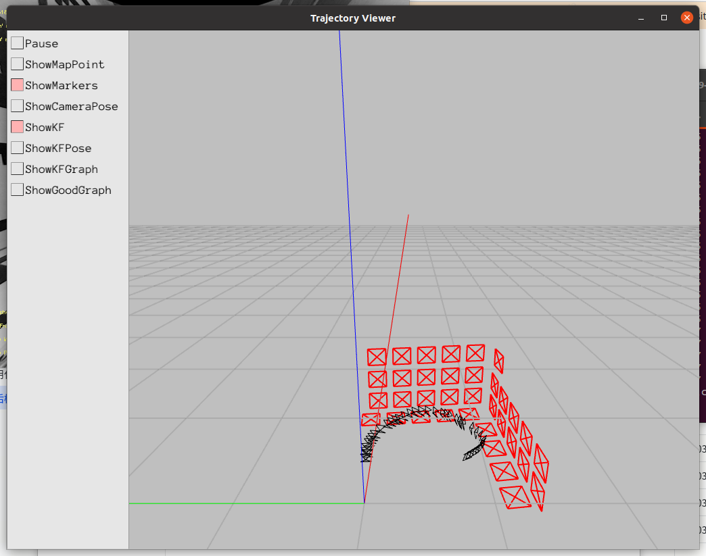 |
|          | 2025\_0813(固定左右轮半径和轮轴距)                      | U形     | N          | 0.120000   | 0.120000   | 0.361000  | 0.400000        | 0.032500        | -0.216981                  | -1.727441  rad, -98.975063 deg                                   | 0.001642  rad, 0.094069 deg                                   | -1.565879  rad, -89.718231 deg(diff: −0.004244rad, −0.243149deg) | -0.0669723  | 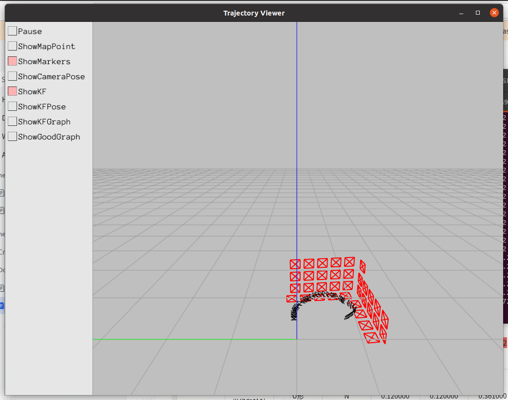 |
|          | 2025\_0813(取消时间延迟检测、固定左右轮半径和轮轴距)             | U形     | Y          | 0.120000   | 0.120000   | 0.361000  | 0.400000        | 0.032500        | -0.216981                  | -1.727441  rad, -98.975063 deg                                   | 0.001642  rad, 0.094069 deg                                   | -1.568053  rad, -89.842833 deg(diff: −0.002174rad, −0.124602deg) | /           | 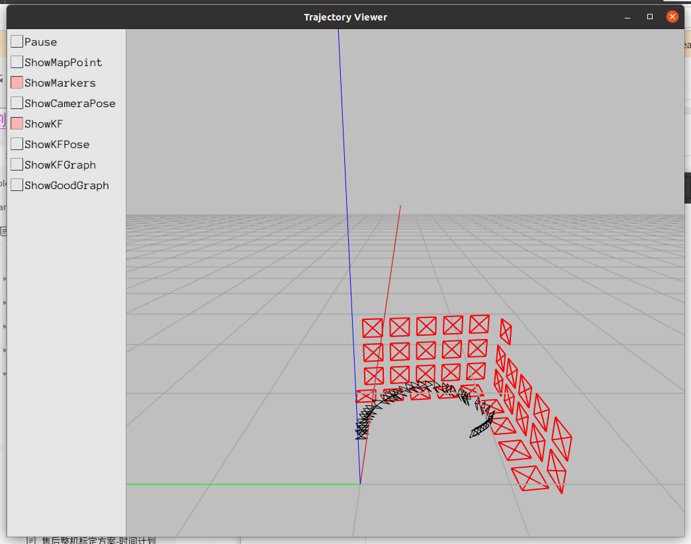 |
| 4        | 2025\_0813                                   | U形     | N          | 0.115792   | 0.113185   | 0.382032  | 0.400000        | 0.032500        | -0.216659                  | -1.727194  rad, -98.960929 deg                                   | 0.001671  rad, 0.095755 deg                                   | -1.559973  rad, -89.379865 deg                                   | -0.0999981  | 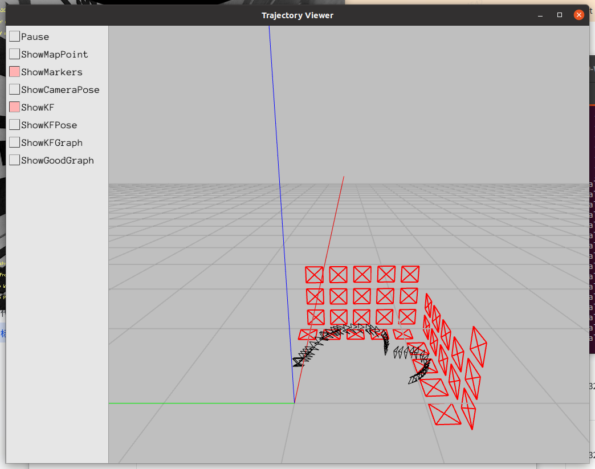 |
|          | 2025\_0813(固定左右轮半径和轮轴距)                      | U形     | N          | 0.120000   | 0.120000   | 0.361000  | 0.400000        | 0.032500        | -0.216659                  | -1.727194  rad, -98.960929 deg                                   | 0.001671  rad, 0.095755 deg                                   | -1.563297  rad, -89.570347 deg(diff: −0.003324rad, −0.190482deg) | -0.0999981  | 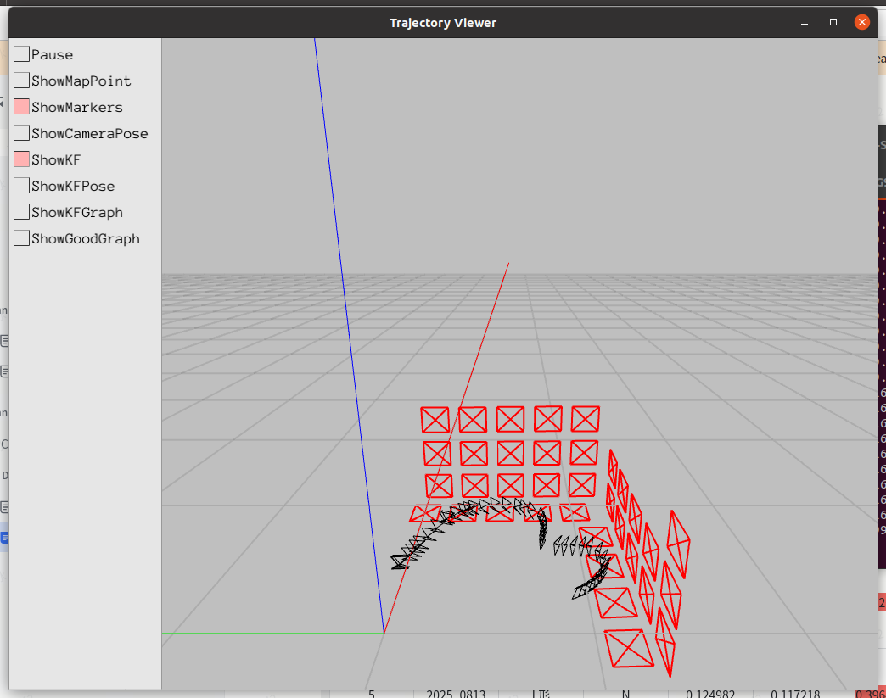 |
|          | 2025\_0813(取消时间延迟检测、固定左右轮半径和轮轴距)             | U形     | Y          | 0.120000   | 0.120000   | 0.361000  | 0.400000        | 0.032500        | -0.216659                  | -1.727194  rad, -98.960929 deg                                   | 0.001671  rad, 0.095755 deg                                   | -1.563391  rad, -89.575678 deg(diff: −0.003418rad, −0.195813deg) | /           | 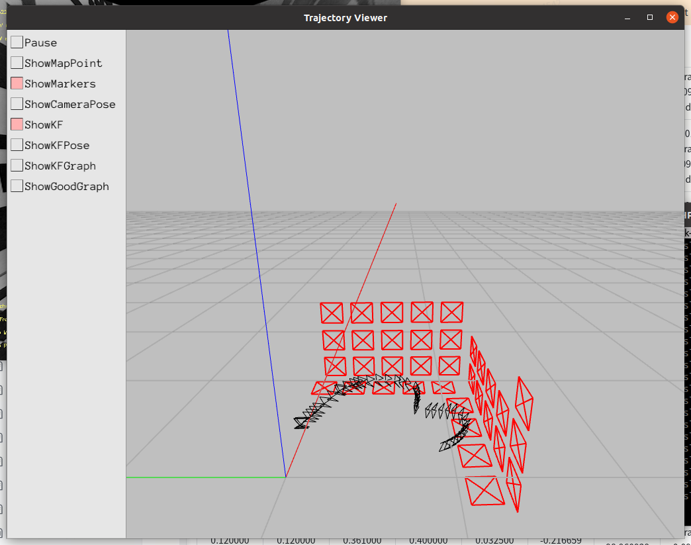 |
| 5        | 2025\_0813                                   | L形     | N          | 0.124982   | 0.117218   | 0.396430  | 0.400000        | 0.032500        | -0.211404                  | -1.724907  rad, -98.829898 deg                                   | -0.001885  rad, -0.108003 deg                                 | -1.542508  rad, -88.379204 deg                                   | -0.0170902  | 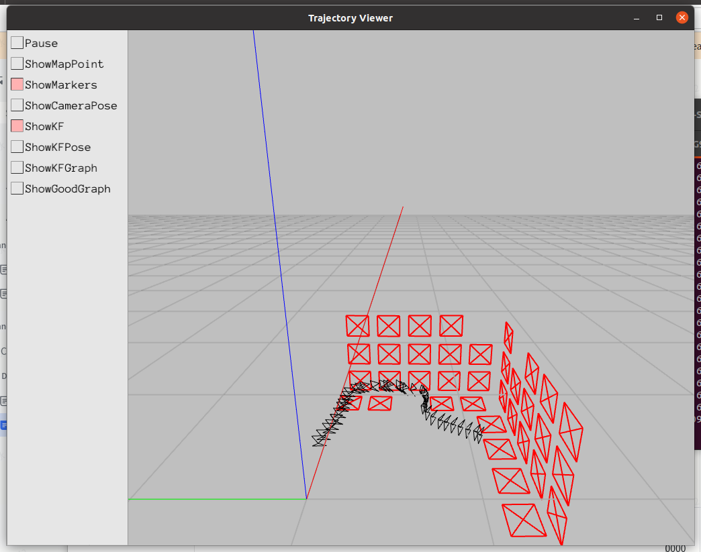 |
|          | 2025\_0813(固定左右轮半径和轮轴距)                      | L形     | Y          | 0.120000   | 0.120000   | 0.361000  | 0.400000        | 0.032500        | -0.211404                  | -1.724907  rad, -98.829898 deg                                   | -0.001885  rad, -0.108003 deg                                 | -1.551705  rad, -88.906147 deg(diff: −0.009197rad, −0.526943deg) | -0.0170902  | 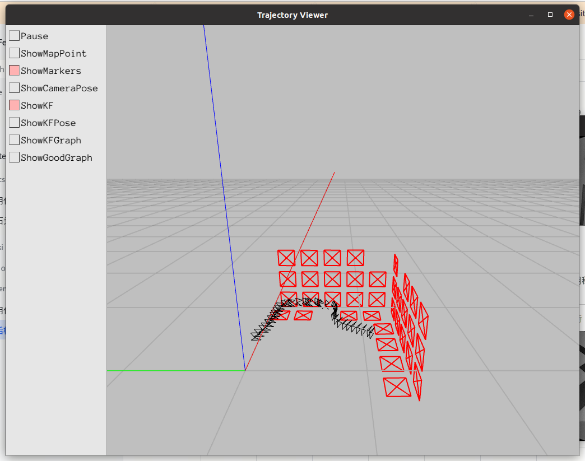 |
|          | 2025\_0813(取消时间延迟检测、固定左右轮半径和轮轴距)             | L形     | Y          | 0.120000   | 0.120000   | 0.361000  | 0.400000        | 0.032500        | -0.211404                  | -1.724907  rad, -98.829898 deg                                   | -0.001885  rad, -0.108003 deg                                 | -1.551712  rad, -88.906530 deg(diff: −0.009204rad, −0.527326deg) | /           | 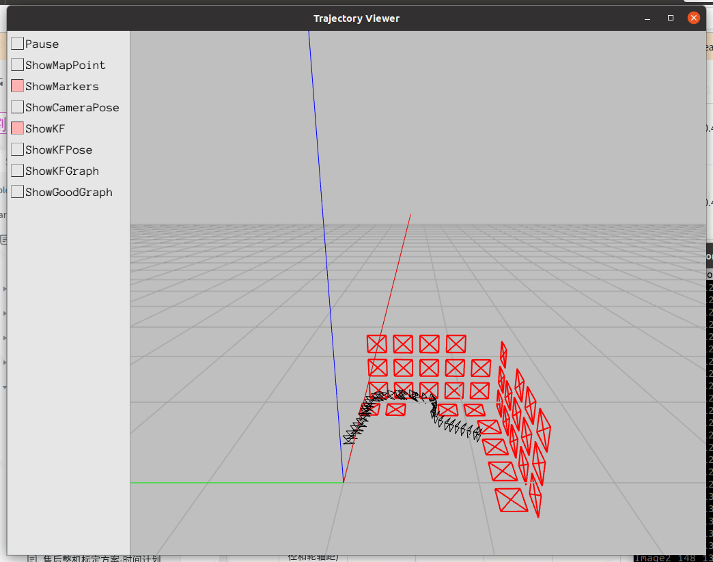 |
| 6        | 2025\_0813                                   | L形     | N          | 0.115912   | 0.115173   | 0.372216  | 0.400000        | 0.032500        | -0.208572                  | -1.723485  rad, -98.748439 deg                                   | -0.005047  rad, -0.289162 deg                                 | -1.577123  rad, -90.362465 deg                                   | -0.055591   |  |
|          | 2025\_0813(取消时间延迟检测、固定左右轮半径和轮轴距)             | L形     | N          | 0.115912   | 0.115173   | 0.372216  | 0.400000        | 0.032500        | -0.208572                  | -1.723485  rad, -98.748439 deg                                   | -0.005047  rad, -0.289162 deg                                 | -1.577123  rad, -90.362465 deg(diff: 0rad, 0deg)                 | /           | 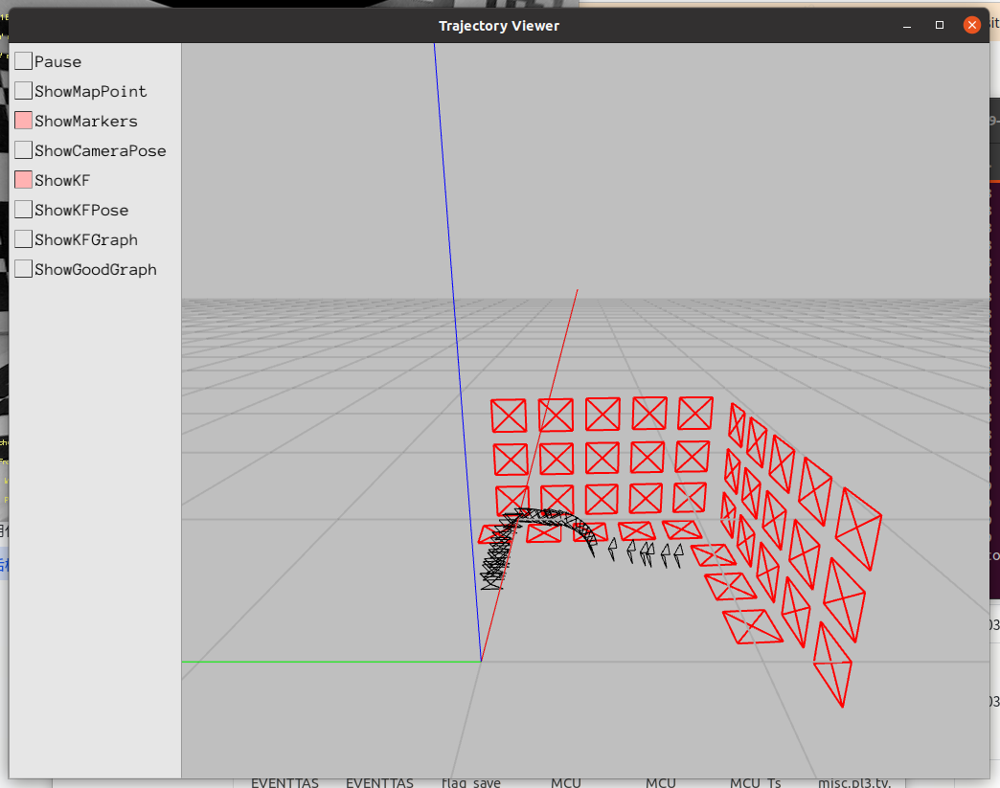 |
| 7        | 2025\_0815\_16\_18\_40                       | 伞形     | Y          | 0.113042   | 0.113468   | 0.367239  | 0.400000        | 0.032500        | -0.208940                  | -1.722401  rad, -98.686291 deg                                   | -0.003113  rad, -0.178340 deg                                 | -1.570144  rad, -89.962596 deg                                   | -0.0193283  | 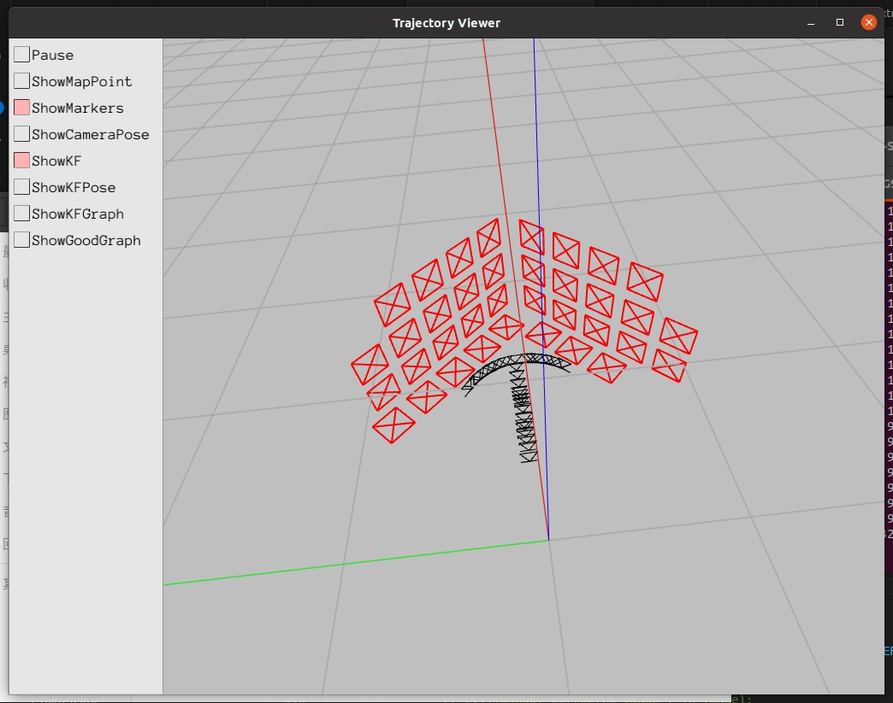 |
|          | 2025\_0815\_16\_18\_40(取消时间延迟检测、固定左右轮半径和轮轴距) | 伞形     | Y          | 0.120000   | 0.120000   | 0.361000  | 0.400000        | 0.032500        | -0.208940                  | -1.722401  rad, -98.686291 deg                                   | -0.003113  rad, -0.178340 deg                                 | -1.569328  rad, -89.915896 deg(diff: 0.000816rad, 0.0467deg)     | /           | 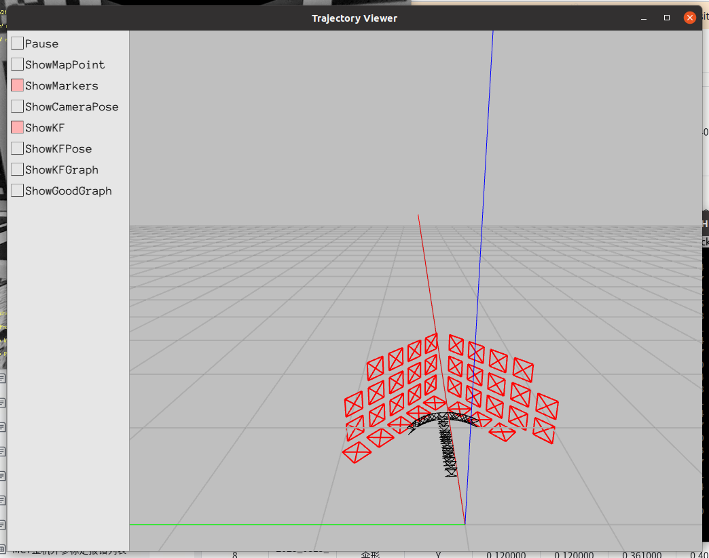 |
| 8        | 2025\_0815\_16\_20\_41                       | 伞形     | Y          | 0.120000   | 0.120000   | 0.361000  | 0.400000        | 0.032500        | -0.206823                  | -1.721094  rad, -98.611451 deg                                   | -0.001009  rad, -0.057796 deg                                 | -1.557798  rad, -89.255240 deg                                   | -0.00610682 | 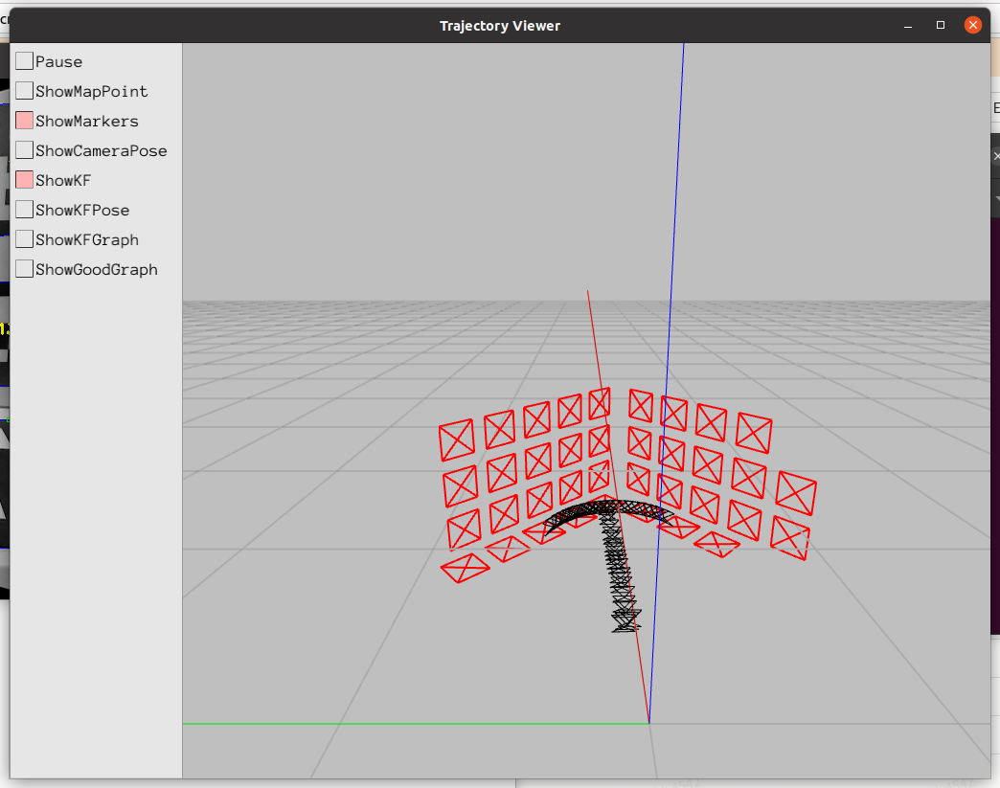 |
|          | 2025\_0815\_16\_20\_41(取消时间延迟检测、固定左右轮半径和轮轴距) | 伞形     | Y          | 0.120000   | 0.120000   | 0.361000  | 0.400000        | 0.032500        | -0.206823                  | -1.721094  rad, -98.611451 deg                                   | -0.001009  rad, -0.057796 deg                                 | -1.557796  rad, -89.255134 deg(diff: 0.000002rad, 0.000106deg)   | /           | 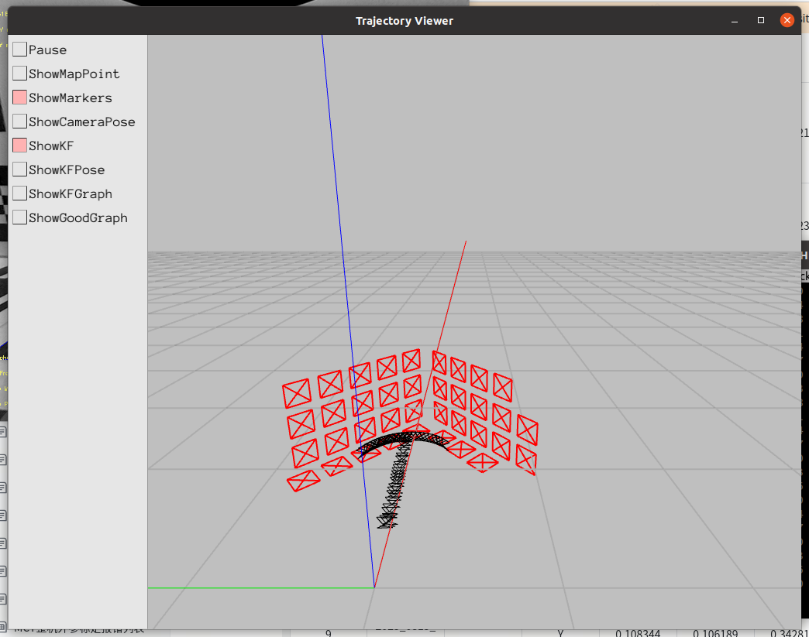 |
| 9        | 2025\_0815\_16\_22\_41                       | 伞形     | Y          | 0.108344   | 0.106189   | 0.342816  | 0.400000        | 0.032500        | -0.210618                  | -1.722667  rad, -98.701530 deg                                   | -0.004997  rad, -0.286321 deg                                 | -1.557482  rad, -89.237135 deg                                   | -0.0171534  | 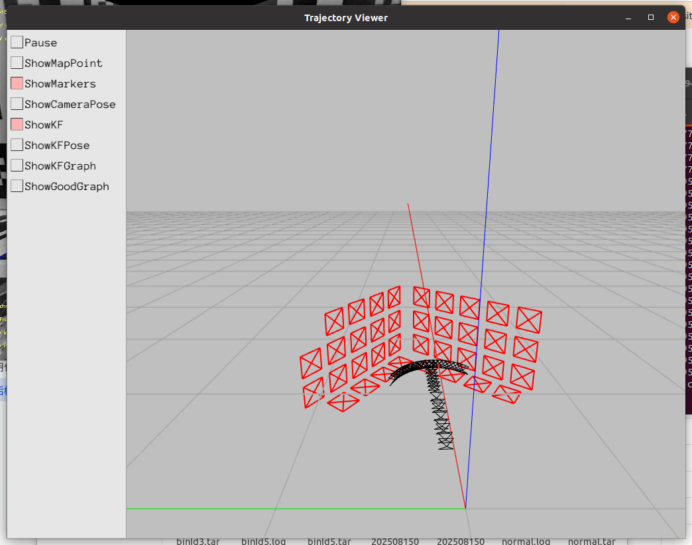 |
|          | 2025\_0815\_16\_22\_41(取消时间延迟检测、固定左右轮半径和轮轴距) | 伞形     | Y          | 0.120000   | 0.120000   | 0.361000  | 0.400000        | 0.032500        | -0.210618                  | -1.722667  rad, -98.701530 deg                                   | -0.004997  rad, -0.286321 deg                                 | -1.557176  rad, -89.219604 deg(diff: 0.000306rad, 0.017531deg)   | /           | 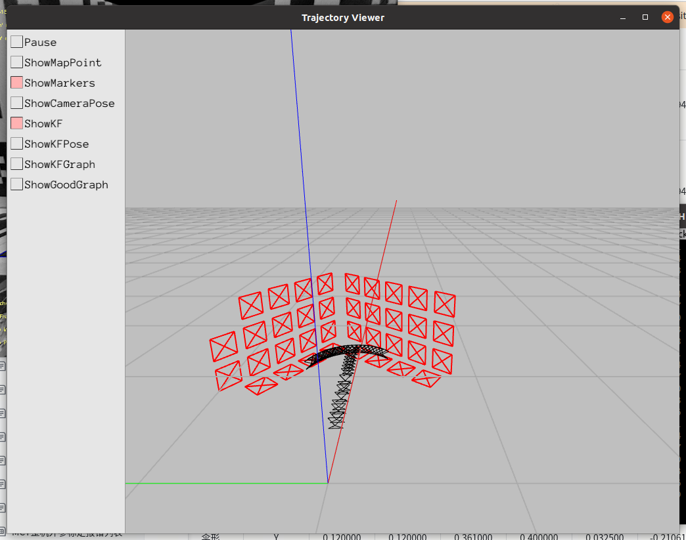 |
| 10       | 2025\_0815\_16\_24\_40                       | 伞形     | N          | 0.132242   | 0.129034   | 0.406029  | 0.400000        | 0.032500        | -0.209207                  | -1.722948  rad, -98.717670 deg                                   | -0.005551  rad, -0.318053 deg                                 | -1.561012  rad, -89.439383 deg                                   | -0.0137616  | 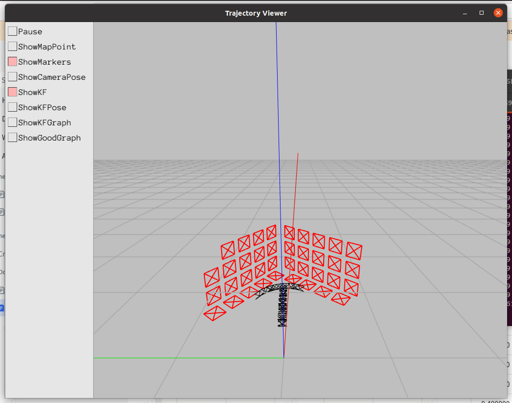 |
|          | 2025\_0815\_16\_24\_40(固定左右轮半径和轮轴距)          | 伞形     | Y          | 0.120000   | 0.120000   | 0.361000  | 0.400000        | 0.032500        | -0.209207                  | -1.722948  rad, -98.717670 deg                                   | -0.005551  rad, -0.318053 deg                                 | -1.561795  rad, -89.484261 deg(diff: −0.000783rad, −0.044878deg) | -0.0137616  | 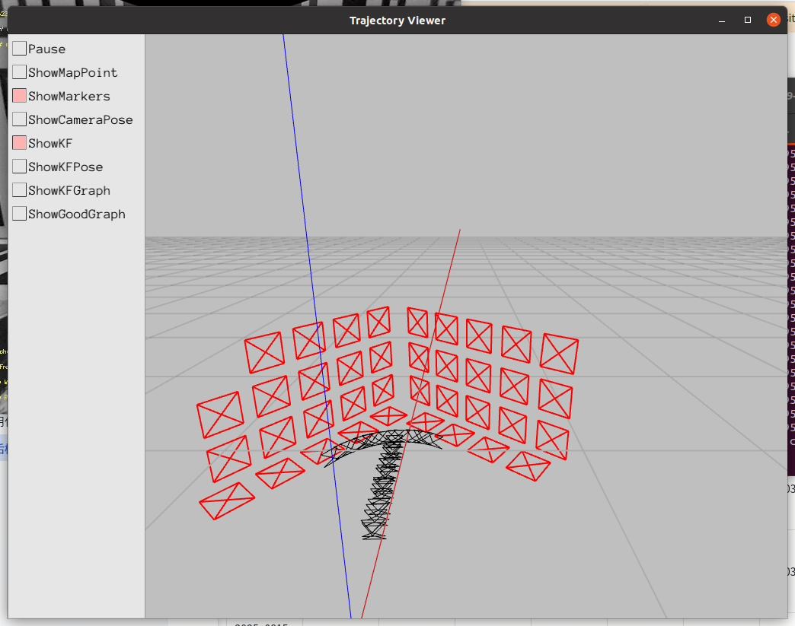 |
|          | 2025\_0815\_16\_24\_40(取消时间延迟检测、固定左右轮半径和轮轴距) | 伞形     | Y          | 0.120000   | 0.120000   | 0.361000  | 0.400000        | 0.032500        | -0.209207                  | -1.722948  rad, -98.717670 deg                                   | -0.005551  rad, -0.318053 deg                                 | -1.561787  rad, -89.483806 deg(diff: −0.000775rad, −0.044423deg) | /           | 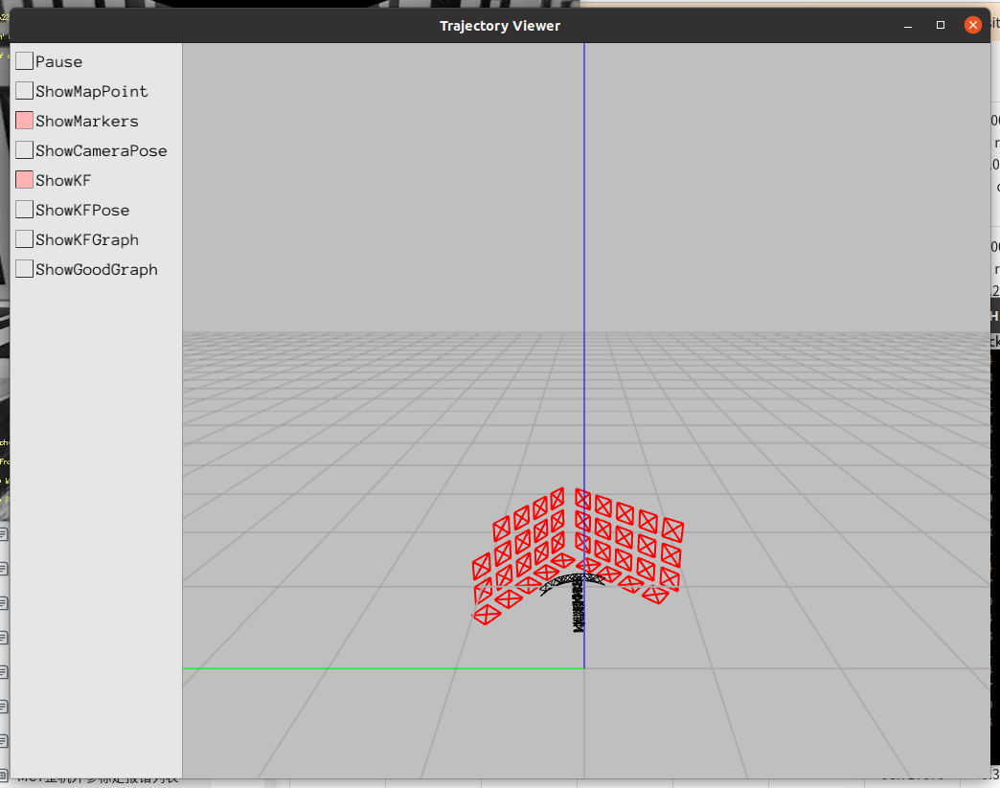 |
| 11       | 2025\_0815\_16\_26\_42                       | 伞形     | Y          | 0.114630   | 0.116240   | 0.370848  | 0.400000        | 0.032500        | -0.209363                  | -1.722052  rad, -98.666300 deg                                   | -0.000888  rad, -0.050900 deg                                 | -1.566156  rad, -89.734144 deg                                   | -0.026411   | 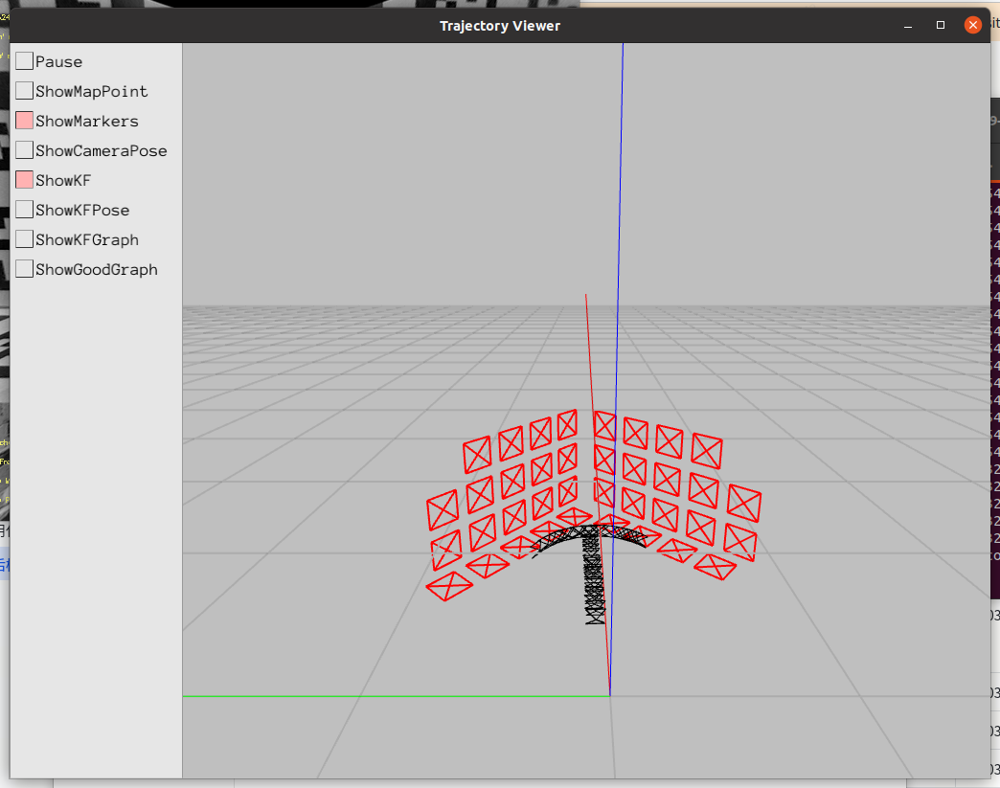 |
|          | 2025\_0815\_16\_26\_42(取消时间延迟检测、固定左右轮半径和轮轴距) | 伞形     | Y          | 0.120000   | 0.120000   | 0.361000  | 0.400000        | 0.032500        | -0.209363                  | -1.722052  rad, -98.666300 deg                                   | -0.000888  rad, -0.050900 deg                                 | -1.564198  rad, -89.621972 deg(diff: 0.001958rad, 0.112172deg)   | /           | 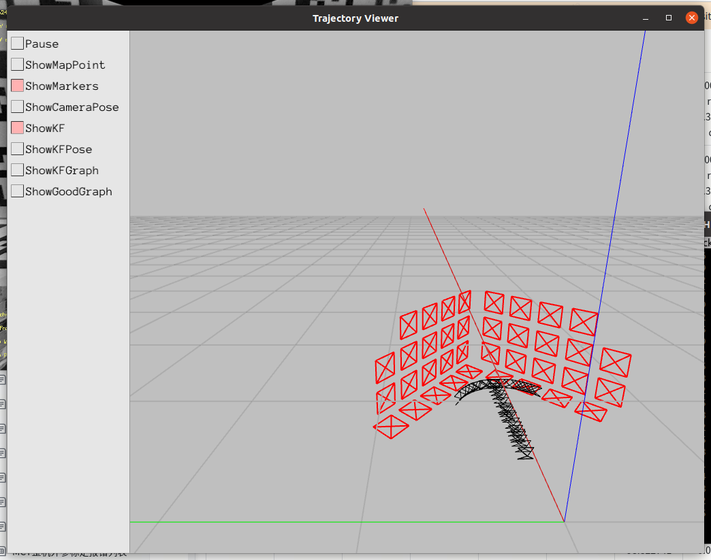 |
| 12       | 2025\_0815\_16\_33\_43                       | 工形     | N          | 0.125833   | 0.126200   | 0.399650  | 0.400000        | 0.032500        | -0.212146                  | -1.724782  rad, -98.822741 deg                                   | -0.001523  rad, -0.087238 deg                                 | -1.564584  rad, -89.644075 deg                                   | -0.0200659  | 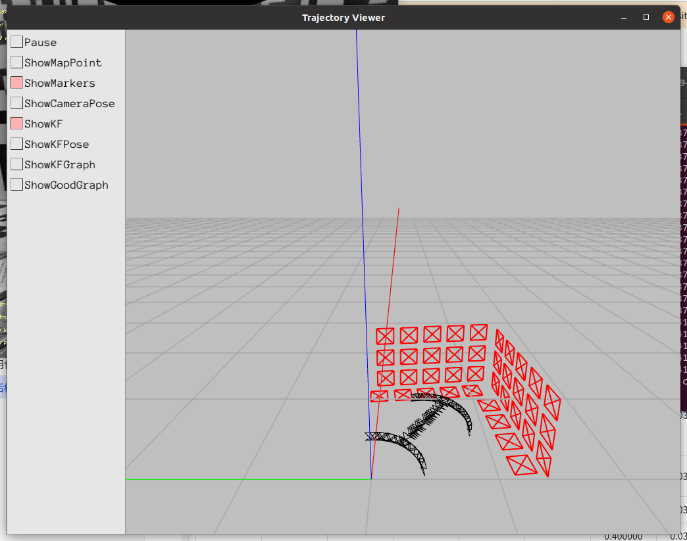 |
|          | 2025\_0815\_16\_33\_43(固定左右轮半径和轮轴距)          | 工形     | Y          | 0.120000   | 0.120000   | 0.361000  | 0.400000        | 0.032500        | -0.212146                  | -1.724782  rad, -98.822741 deg                                   | -0.001523  rad, -0.087238 deg                                 | -1.563881  rad, -89.603782 deg(diff: 0.000703rad, 0.040293deg)   | -0.0200659  | 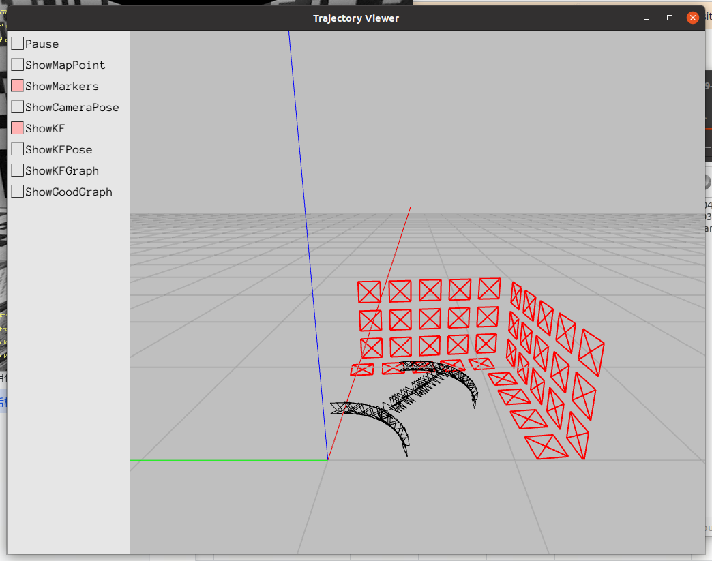 |
|          | 2025\_0815\_16\_33\_43(取消时间延迟检测、固定左右轮半径和轮轴距) | 工形     | Y          | 0.120000   | 0.120000   | 0.361000  | 0.400000        | 0.032500        | -0.212146                  | -1.724782  rad, -98.822741 deg                                   | -0.001523  rad, -0.087238 deg                                 | -1.563884  rad, -89.603930 deg(diff: 0.0007rad, 0.040145deg)     | /           | 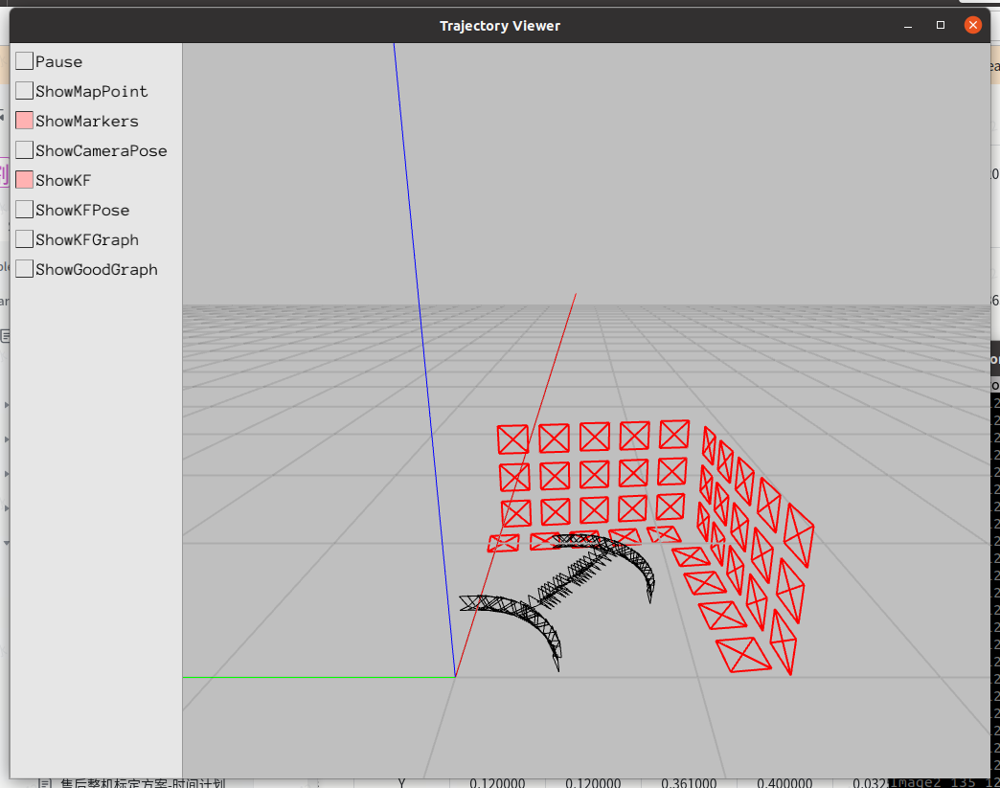 |
| 13       | 2025\_0815\_16\_36\_41                       | 工形     | Y          | 0.113734   | 0.111303   | 0.359593  | 0.400000        | 0.032500        | -0.212487                  | -1.724363  rad, -98.798699 deg                                   | -0.001929  rad, -0.110495 deg                                 | -1.563939  rad, -89.607085 deg                                   | -0.0136609  | 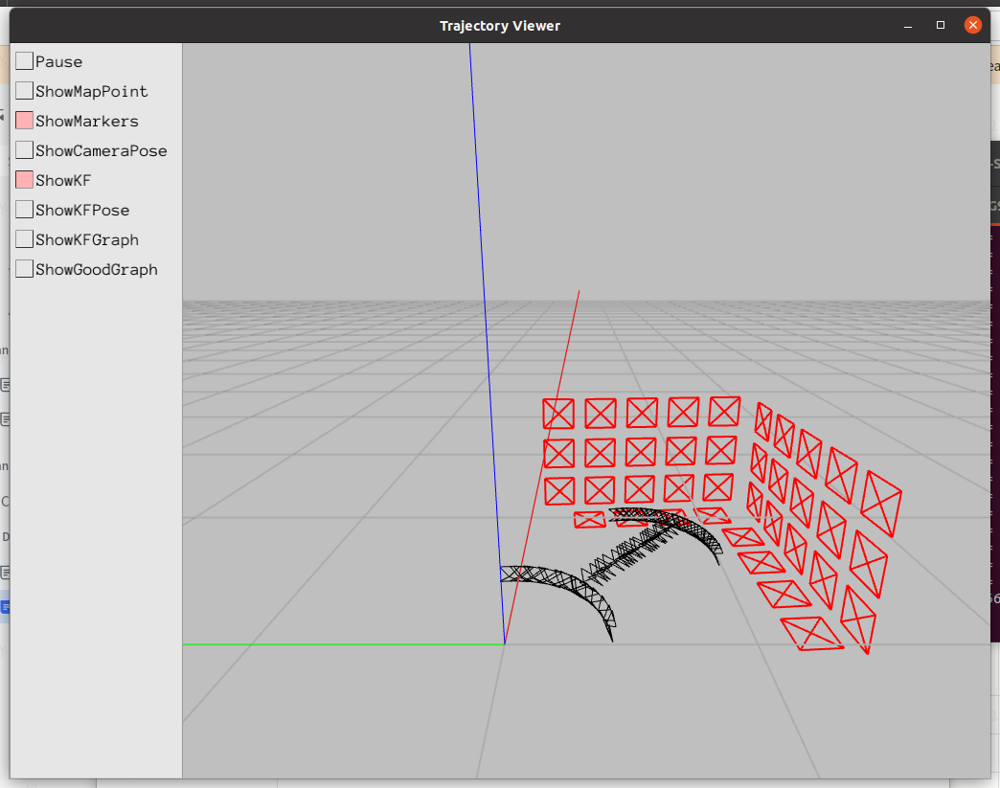 |
|          | 2025\_0815\_16\_36\_41(取消时间延迟检测、固定左右轮半径和轮轴距) | 工形     | Y          | 0.120000   | 0.120000   | 0.361000  | 0.400000        | 0.032500        | -0.212487                  | -1.724363  rad, -98.798699 deg                                   | -0.001929  rad, -0.110495 deg                                 | -1.566405  rad, -89.748396 deg(diff: −0.002466rad, −0.141311deg) | /           | 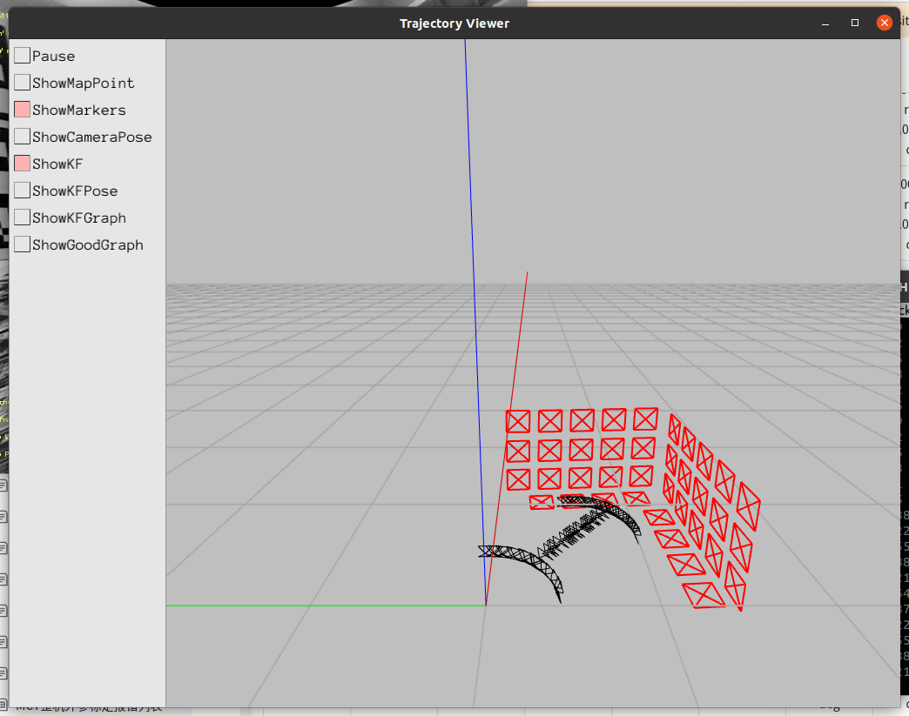 |
| 14       | 2025\_0815\_16\_39\_43                       | 工形     | Y          | 0.119229   | 0.118558   | 0.372969  | 0.400000        | 0.032500        | -0.209765                  | -1.724166  rad, -98.787460 deg                                   | -0.005593  rad, -0.320468 deg                                 | -1.558362  rad, -89.287587 deg                                   | -0.016068   | 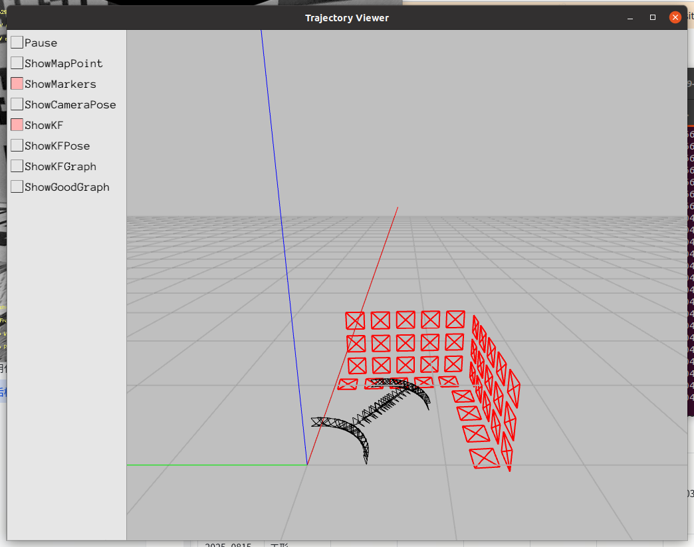 |
|          | 2025\_0815\_16\_39\_43(取消时间延迟检测、固定左右轮半径和轮轴距) | 工形     | Y          | 0.120000   | 0.120000   | 0.361000  | 0.400000        | 0.032500        | -0.209765                  | -1.724166  rad, -98.787460 deg                                   | -0.005593  rad, -0.320468 deg                                 | -1.557923  rad, -89.262414 deg(diff: 0.000439rad, 0.025173deg)   | /           | 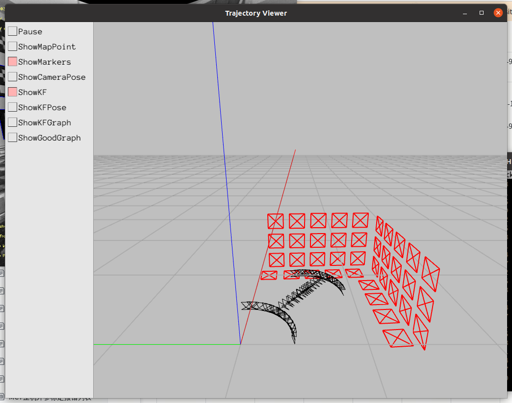 |
| 15       | 2025\_0815\_16\_42\_42                       | 工形     | N          | 0.119615   | 0.120384   | 0.385661  | 0.400000        | 0.032500        | -0.211106                  | -1.725232  rad, -98.848486 deg                                   | -0.003307  rad, -0.189489 deg                                 | -1.568555  rad, -89.871558 deg                                   | -0.0199473  | 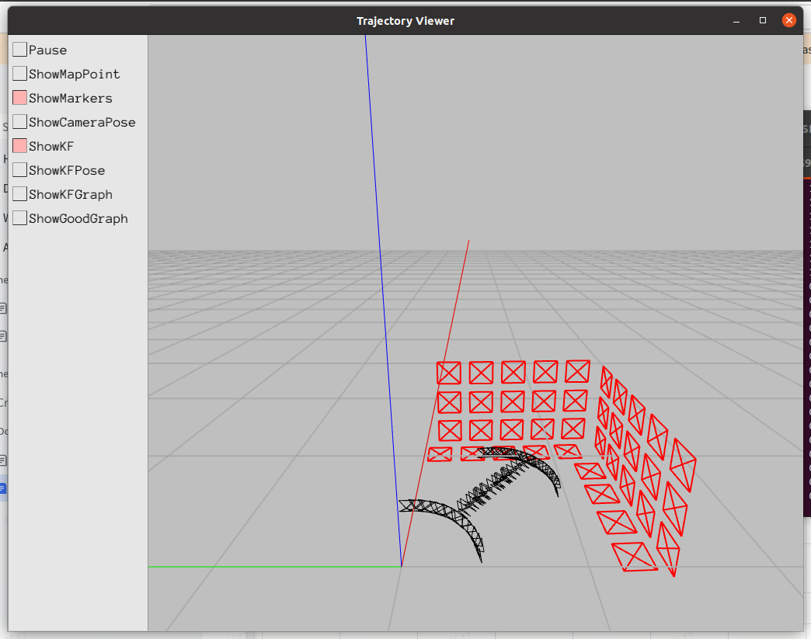 |
|          | 2025\_0815\_16\_42\_42(固定左右轮半径和轮轴距)          | 工形     | Y          | 0.120000   | 0.120000   | 0.361000  | 0.400000        | 0.032500        | -0.211106                  | -1.725232  rad, -98.848486 deg                                   | -0.003307  rad, -0.189489 deg                                 | -1.565538  rad, -89.698707 deg(diff: 0.003017rad, 0.172851deg)   | -0.0199473  | 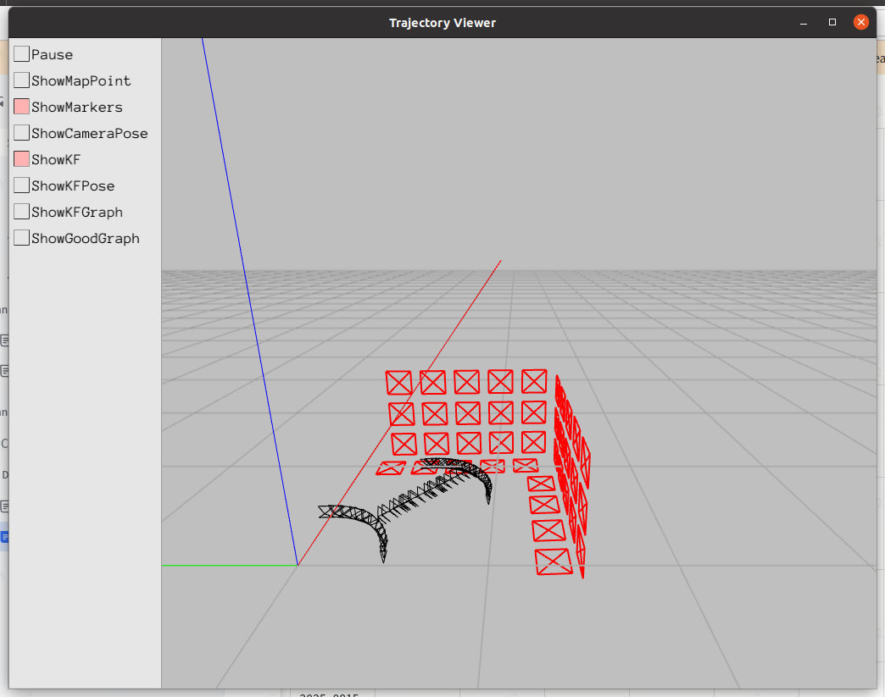 |
|          | 2025\_0815\_16\_42\_42(取消时间延迟检测、固定左右轮半径和轮轴距) | 工形     | Y          | 0.120000   | 0.120000   | 0.361000  | 0.400000        | 0.032500        | -0.211106                  | -1.725232  rad, -98.848486 deg                                   | -0.003307  rad, -0.189489 deg                                 | -1.565536  rad, -89.698604 deg(diff: 0.003019rad, 0.172954deg)   | /           | 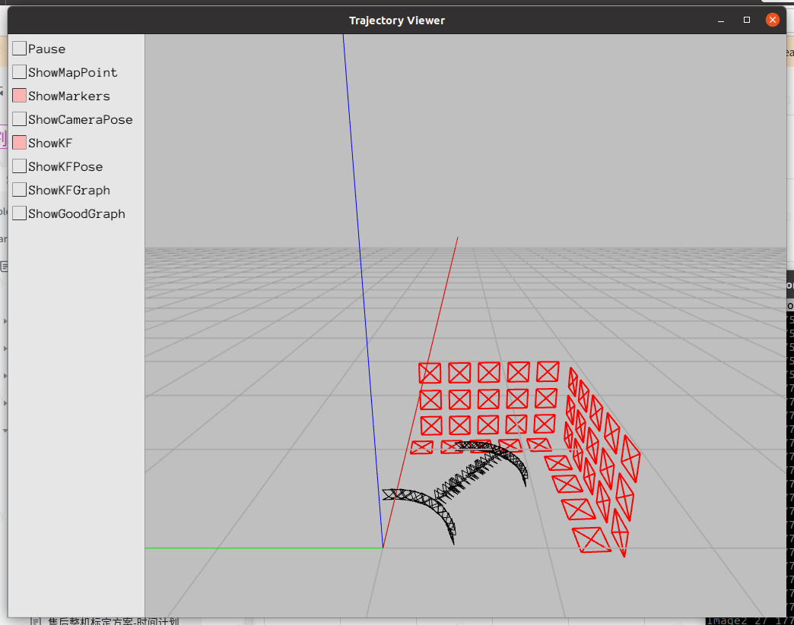 |
| 16       | 2025\_0815\_16\_45\_42                       | 工形     | Y          | 0.114153   | 0.112736   | 0.358987  | 0.400000        | 0.032500        | -0.209008                  | -1.723481  rad, -98.748202 deg                                   | -0.004365  rad, -0.250069 deg                                 | -1.563578  rad, -89.586399 deg                                   | -0.0242536  | 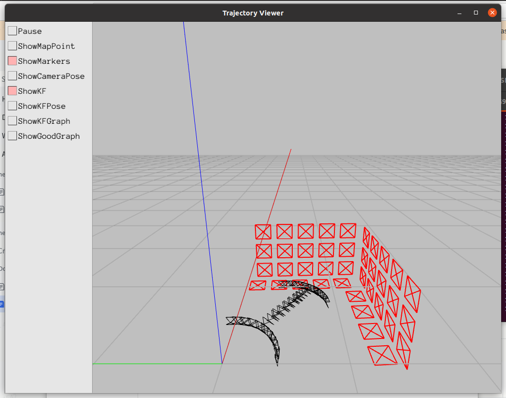 |
|          | 2025\_0815\_16\_45\_42(取消时间延迟检测、固定左右轮半径和轮轴距) | 工形     | Y          | 0.114153   | 0.112736   | 0.358987  | 0.400000        | 0.032500        | -0.209008                  | -1.723481  rad, -98.748202 deg                                   | -0.004365  rad, -0.250069 deg                                 | -1.565263  rad, -89.682948 deg(diff: −0.001685rad, −0.096549deg) | /           | 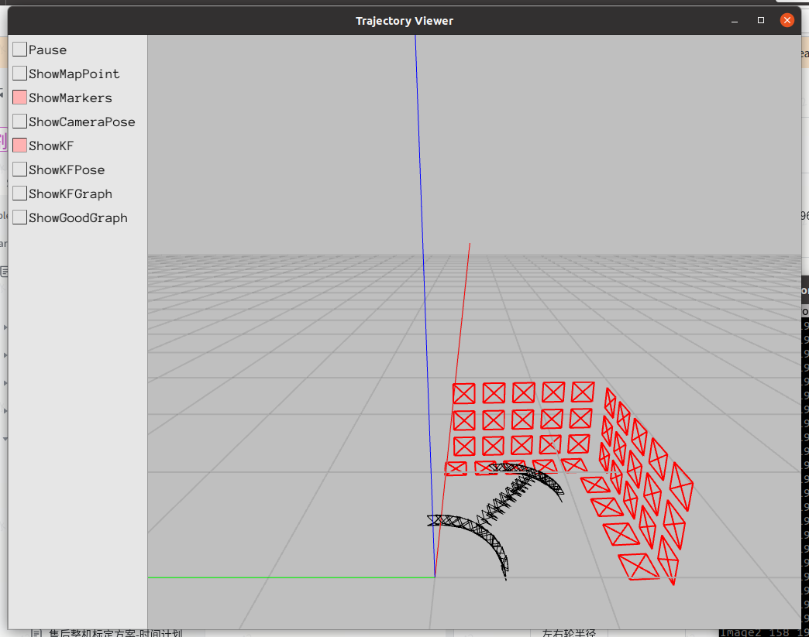 |

