# Eden VSLAM定位数据采集记录

# 0104-沿边数据采集

研发分析：&#x20;

机器：Butchart

场地：105-3-S、105-2\_SE、78-3\_SW、78-4\_NW

版本：任意稳定的版本，进行遥控建图

动作：顺逆时针遥控沿边，顺逆时针采在一个数据里，都走完了一起收图和日志

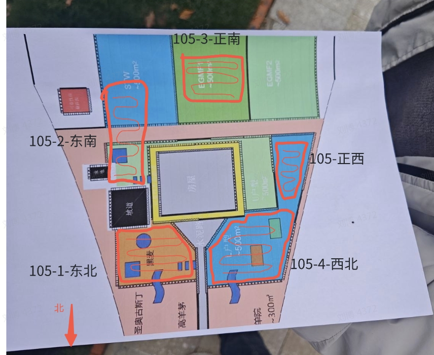

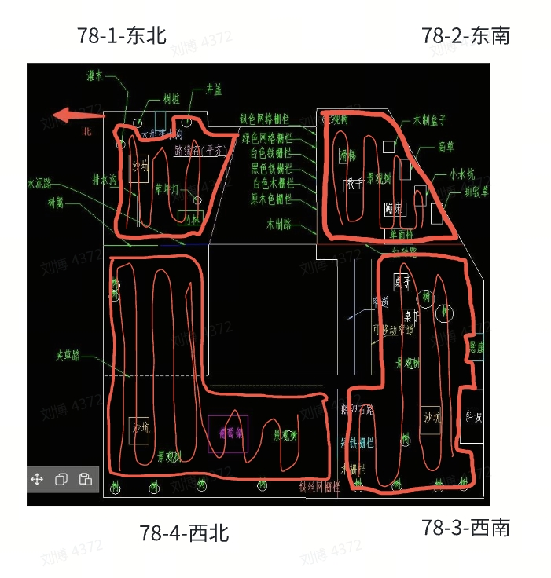

# 0104-VSLAM困难场景数据采集&#x20;

1. 颠簸数据 P1

   1. 目前先采集看看VIO受到的影响大不大，如果受到影响大，需要额外采集建图数据再行分析。

   2. 研发分析：&#x20;

   3. 机器：Butchart

   4. 场地：60栋颠簸场地、60栋鹅卵石场地

      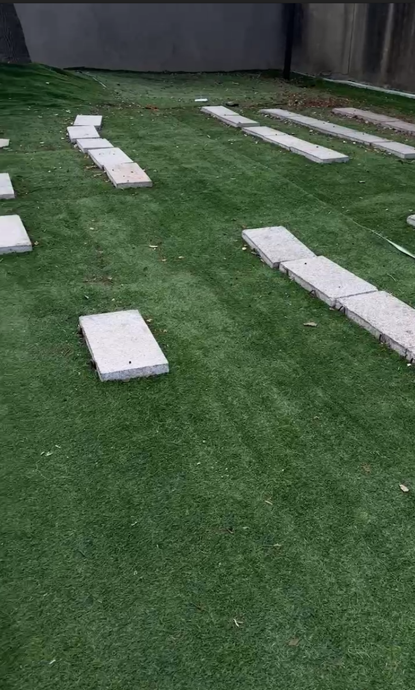

      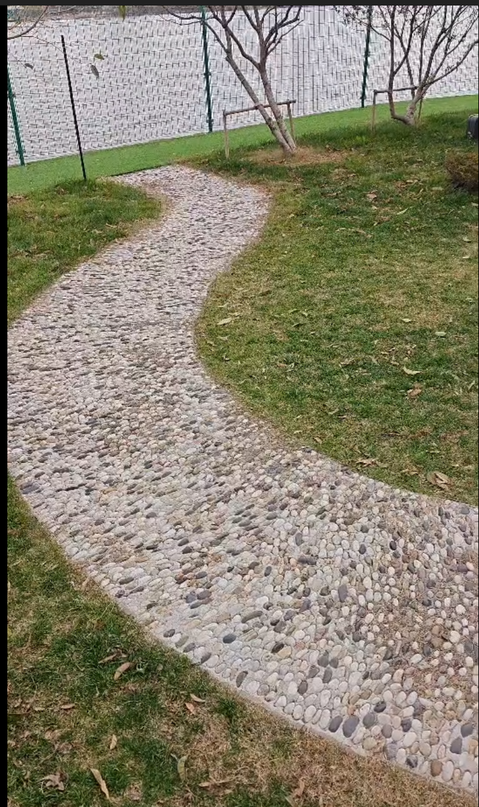

   5. 版本：任意稳定的版本，进行遥控建图

   6. 动作：

      1. 60栋颠簸场地

         1. 沿边建图，包含所有颠簸区域。（注意不仅是图像中的，而是附近所有颠簸块）

         2. 遥控

            1. 跨越所有颠簸块。（小块连在一起的通过其中一块即可）

         3. 弓字割草

      2. 60栋鹅卵石场地

         1. 沿边建图，包含整个鹅卵石地面+鹅卵石两边缘各2m的区域

         2. 遥控

            1. 对于照片所示的前10m长度的鹅卵石，遥控重复穿行鹅卵石地面，来回的穿行间隔1m左右

            2. 沿着整个鹅卵石方向遥控，来回各两次

         3. 弓字割草

2. &#x20;P1[ 视觉定位困难场景数据采集](https://roborock.feishu.cn/docx/TruhdJ5b0ofeR9xLzZfc7elnnuh?open_in_browser=true) 分析

# 1229-光流版建图重定位上机测试

[ 建图、重定位上机测试](https://roborock.feishu.cn/docx/Ef2XdRXWKoPwbXxdii9ccds2nmc)

# 1229-单轴IMU定位数据采集

机器：改装单轴高精度IMU定位数据的机器

场地：78-2-东南

版本：2m弓字割草包或DEV+存图包

采集动作：

1. 沿边建图

2. 密集弓字割草

3. 刷2m弓字割草包，观察割草现象，是否如下图预期，如有问题，和 反馈，改为使用遥控方式采集数据

   1. 2m弓字割草包：新建 /mnt/data/mow\_info.bin  内容格式{"mowInfo": {"mowAngle": 0}}   \\\\[10.250.4.29](http://10.250.4.29)\build\Mower\Monet\OS\2025\_2025122904DEV\_RelWithDebInfo\_EnSeboot\_elfsign\_release\_with\_image\_muti\_mow\_taskid\_207515

   2. 遥控方式：观察密集弓字割草方向，顺着割草方向遥控机器走弓字，弓字间距2m，距离边界0.5m。

研发分析&#x20;

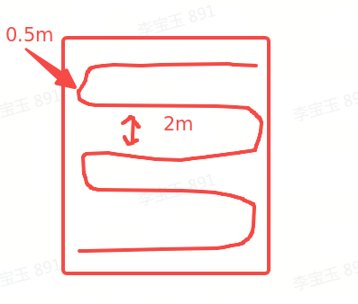

# 1216-建图、重定位上机功能测试数据采集

[ 建图、重定位上机测试](https://roborock.feishu.cn/docx/Ef2XdRXWKoPwbXxdii9ccds2nmc)

# 1211-不同光照条件下2m弓字+正常弓字割草数据采集

[ 78-2：不同光照条件下2m建图+割草数据采集](https://roborock.feishu.cn/wiki/DKtBwIoyqiW457kBmr1ctJ6Ln6c?open_in_browser=true)

# 1212-极限机采集需求

## **版本：可以灵活调整割草方式**

【Butchart】
版本用途：灵活调整割草方式，应对视觉建图与割草任务
测试要求：测试以下三种模式是否能正常建图割草
1\. 不进行任何操作该文件不存在 代表普通弓字割草；
2\. 新建 /mnt/data/mow\_info.bin  内容格式{"mowInfo": {"mowAngle": 90}}   代表90°两米弓字割草；
3\. 新建 /mnt/data/mow\_info.bin  内容格式{"mowInfo": {"mowAngle": 0}}   代表0°两米弓字割草。
版本share为\\\\[10.250.4.29](http://10.250.4.29/)\build\Mower\Butchart\OS\5281\_2026010905DEV\_RelWithDebInfo\_EnSeboot\_elfsign\_release\_with\_image\_muti\_mow\_taskid\_212353
详情请于以下链接查看：<https://auto.roborock.com/#/common/build_request/detail?id=212353>
~~\\\\[10.250.4.29](http://10.250.4.29)\build\Mower\Butchart\OS\4921\_2025120906DEV\_RelWithDebInfo\_EnSeboot\_elfsign\_release\_with\_image\_muti\_mow\_taskid\_197007~~

【ButchartPro】版本构建任务 200045 成功
版本用途：灵活调整割草方式，应对视觉建图与割草任务
测试要求：测试以下三种模式是否能正常建图割草
1\. 不进行任何操作该文件不存在 代表普通弓字割草
2\. 新建 /mnt/data/mow\_info.bin  内容格式{"mowInfo": {"mowAngle": 90}}   代表90°两米弓字割草；
3\. 新建 /mnt/data/mow\_info.bin  内容格式{"mowInfo": {"mowAngle": 0}}   代表0°两米弓字割草；
版本share为
\\\\[10.250.4.29](http://10.250.4.29)\build\Mower\ButchartPro\OS\1333\_2025121503DEV\_RelWithDebInfo\_EnSeboot\_elfsign\_release\_with\_image\_muti\_mow\_taskid\_200045

1. 机器：butchart 极限机

2. 遥控沿边建图，顺时针、逆时针一次完成，不分两次采集，完成后不割草，直接保存数据。

3. 2m 0°弓字建图、割草。

4. 密集弓字建图、割草。

# 1210-相机高度降低1cm测试需求（机器 改装后提供）

## **版本：可以灵活调整割草方式**

【Butchart】
版本用途：灵活调整割草方式，应对视觉建图与割草任务
测试要求：测试以下三种模式是否能正常建图割草
1\. 不进行任何操作该文件不存在 代表普通弓字割草；
2\. 新建 /mnt/data/mow\_info.bin  内容格式{"mowInfo": {"mowAngle": 90}}   代表90°两米弓字割草；
3\. 新建 /mnt/data/mow\_info.bin  内容格式{"mowInfo": {"mowAngle": 0}}   代表0°两米弓字割草。
版本share为
\\\\[10.250.4.29](http://10.250.4.29)\build\Mower\Butchart\OS\4921\_2025120906DEV\_RelWithDebInfo\_EnSeboot\_elfsign\_release\_with\_image\_muti\_mow\_taskid\_197007
详情请于以下链接查看：<https://auto.roborock.com/#/common/build_request/detail?id=197007>

1. 机器：butchart 极限机

2. 遥控沿边建图，顺时针、逆时针一次完成，不分两次采集，完成后不割草，直接保存数据。

3. 2m 0°弓字建图、割草。

4. 密集弓字建图、割草。

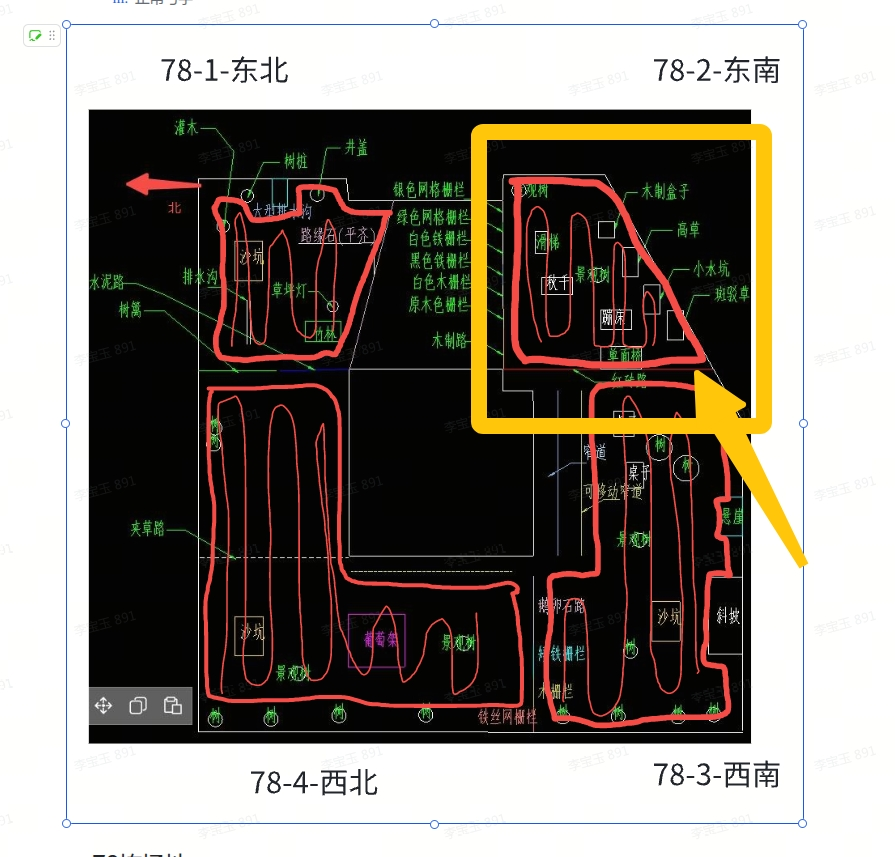

# 1209-照度采集需求

1. 采集地点

   1. 地点如图3个点位，每个点位，距离地面21cm左右采集数据。

2. 提前准备

   1. 提前标记好点位。避免大距离偏移。

   2. 照度计尽量超前，平放，粘在机器上，与相机视角方向大致一致。

3. 采集内容：

   1. 四个方向采集照度。

   2. 四个方向使用AT命令采集单帧前目图像。

   3. 每个点位的采集时间。

4. 采集时间：

   1. 12:00、16:00、16:30，采集一轮

   2. 17:00、17:20、17:30、17:40、17:50、18:00，各采集一轮

测试数据：

# 1201-视觉建图定位摸底采集需求

采集需求

[ VSLAM定位数据采集需求-1014](https://roborock.feishu.cn/wiki/IK3AwkBLQipT5rkZKIvcTvhonDe)

## **最新版本：可以灵活调整割草方式**

【Butchart】
版本用途：灵活调整割草方式，应对视觉建图与割草任务
测试要求：测试以下三种模式是否能正常建图割草
1\. 不进行任何操作该文件不存在 代表普通弓字割草；
2\. 新建 /mnt/data/mow\_info.bin  内容格式{"mowInfo": {"mowAngle": 90}}   代表90°两米弓字割草；
3\. 新建 /mnt/data/mow\_info.bin  内容格式{"mowInfo": {"mowAngle": 0}}   代表0°两米弓字割草。
版本share为
\\\\[10.250.4.29](http://10.250.4.29)\build\Mower\Butchart\OS\4921\_2025120906DEV\_RelWithDebInfo\_EnSeboot\_elfsign\_release\_with\_image\_muti\_mow\_taskid\_197007
详情请于以下链接查看：<https://auto.roborock.com/#/common/build_request/detail?id=197007>

## 备用版本

> ### 密集弓子版本：
>
> butchart  12.01 更新
> 版本用途：调整特征提取方式，用于数据采集测试
> \\\\[10.250.4.29](http://10.250.4.29)\build\Mower\Butchart\OS\4785\_2025120112DEV\_RelWithDebInfo\_EnSeboot\_elfsign\_release\_with\_image\_detector\_single\_thread\_taskid\_192229
>
> ### 2m弓子版本：
>
> butchart  12.01 更新
> 版本用途：增大弓字间隔，调整特征提取方式，用于数据采集测试
> \\\\[10.250.4.29](http://10.250.4.29)\build\Mower\Butchart\OS\4781\_2025120110DEV\_RelWithDebInfo\_EnSeboot\_elfsign\_release\_with\_image\_line\_space\_2m\_taskid\_192223
>
>
> Butchartpro  11.26 更新
> 版本用途：增大弓字间隔，用于数据采集测试
> \\\10.250.4.29\build\Mower\ButchartPro\OS\1143\_2025112406DEV\_RelWithDebInfo\_EnSeboot\_elfsign\_release\_with\_image\_line\_space\_2m\_taskid\_189085
>
> ### 2m 90度弓子版本：
>
> butchart  12.01 更新
>
> 版本用途：90° 增大弓字间隔，调整特征提取方式，用于数据采集测试
> \\\\[10.250.4.29](http://10.250.4.29)\build\Mower\Butchart\OS\4783\_2025120111DEV\_RelWithDebInfo\_EnSeboot\_elfsign\_release\_with\_image\_mow\_ang\_90\_taskid\_192227
>
>
>
> ~~butchart  12.01 更新~~
> ~~版本用途：90°方向增大弓字间隔，用于数据采集测试~~
> ~~\\\\[10.250.4.29](http://10.250.4.29)\build\Mower\Butchart\OS\4761\_2025120105DEV\_RelWithDebInfo\_EnSeboot\_elfsign\_release\_with\_image\_mow\_ang\_90\_taskid\_191973~~

## 数据上传：

地址： https://roborock.feishu.cn/drive/folder/JbXefsseylY0ChdOvrQcSdfonvg?from=from\_copylin

图片和日志压缩到一个压缩包里，命名格式为 地点序号-日期-时间段-割草方式-机器型号

例：78-1东北-1201-12：30\_13：00-2m弓子90度-b2\_14

### 1. 60栋场地

1. 60-1-草地√

   1. 沿边建图  [ 60-1-草地-10-24-10顺逆时针b2-1.zip](https://roborock.feishu.cn/file/SpJYbsJhWoMngsxDTcTcRQT2nog)

   2. 2m弓字   [ 60-1-草地-10-24-14\_15-2米弓字割草b2-1.zip](https://roborock.feishu.cn/file/LFixbsrCqokoQxxNsioc8aslnJu)

   3. 正常弓字     [ 60-1-草地-10-27-15\_17-正常割草b2-1.zip](https://roborock.feishu.cn/file/Xw9Ybqx9borCkMxYAK4cQt49nHR)

2. 60-2-大草地 √

   1. 沿边建图    [ 60-2-大草地-10-24-15\_16-顺逆时针b2-1.zip](https://roborock.feishu.cn/file/FJxDbxfl1oWzS3x1q3Scx7O8nFg)

   2. 2m弓字   中间假草区域过小，且还有较多杂物，建禁区导致割草机无法通行，只有部分割草数据。[ 60-2-大草地-10-24-16\_17-2米弓字割草缺b2-1.zip](https://roborock.feishu.cn/file/MLgRb2uSxo5LVXxSlB0c9o2RnGf)

   3. 2m弓字  [ 60-2-大草地-10-27-10\_11-2米弓字割草b2-1.zip](https://roborock.feishu.cn/file/XPLYbr9iNoqN1BxO66tcIDV8nCc)

   4. 正常弓字  正常割草数据量过大，缺少数据[ 60-2-大草地-10-28-10\_12-正常割草二缺b2-1.zip](https://roborock.feishu.cn/file/YSfQbQHCpom51TxEGCpcSGLMnoX)

   5. 正常弓字    [ 60-2-大草地-10-28-10\_12-正常割草b2-1.zip](https://roborock.feishu.cn/file/KRO5bOMzRoXLljxCeazclP4inlf)

   6. 正常弓字   [ 60-2-大草地-10-29-9\_11-正常割草二b2-1.zip](https://roborock.feishu.cn/file/EBOkbpJKzohPECx9rzJckEUEnYe)

3. ~~需要重采：60-3-U型墙     由于该区域存在较多的石板和杂物，而且有较多测试机在该区域测试，目前不太好进行数据采集。机器：任意Butchart（难以清理，废弃）~~

   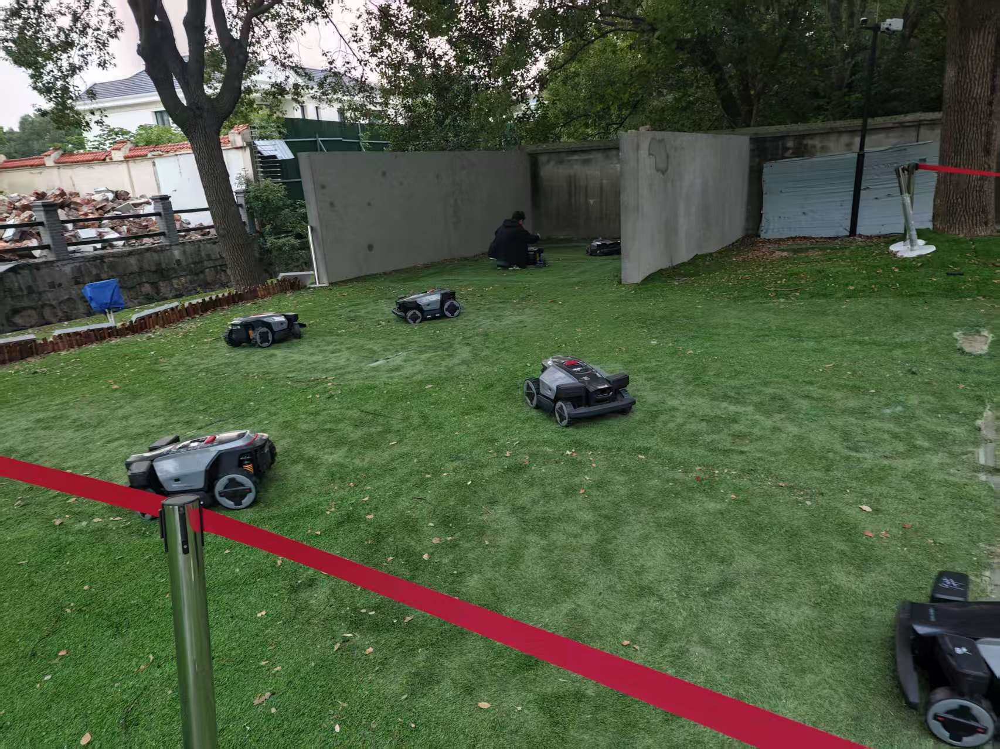

   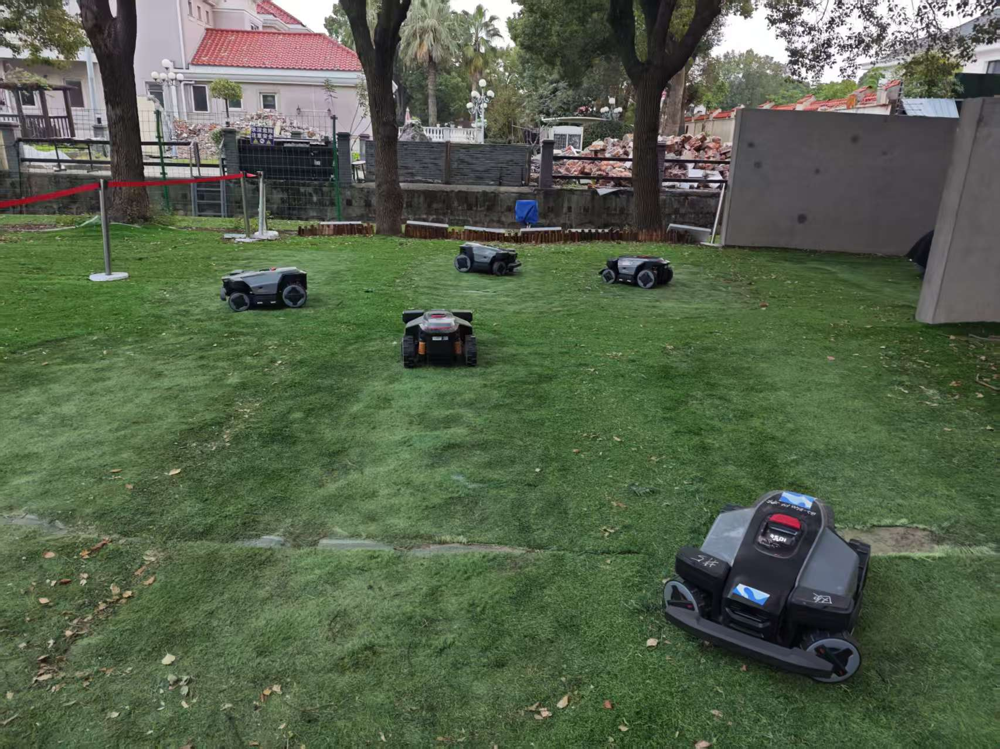

   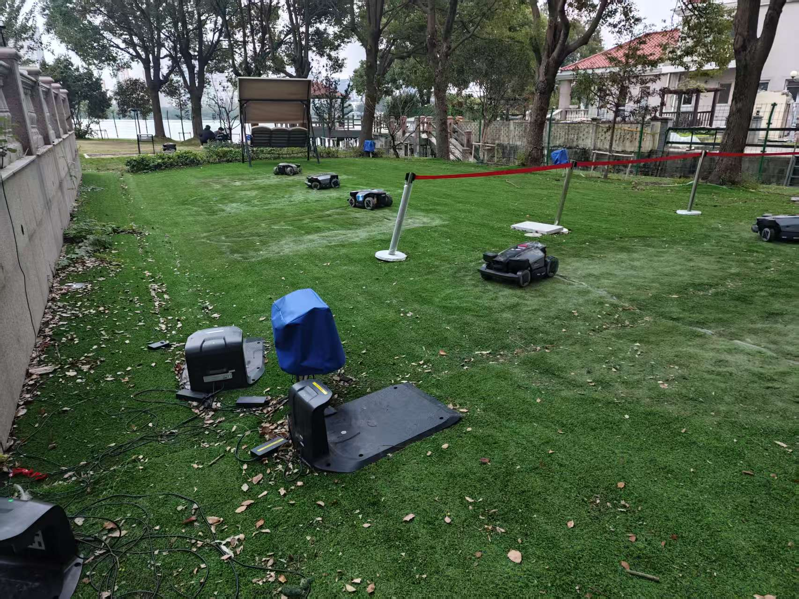

   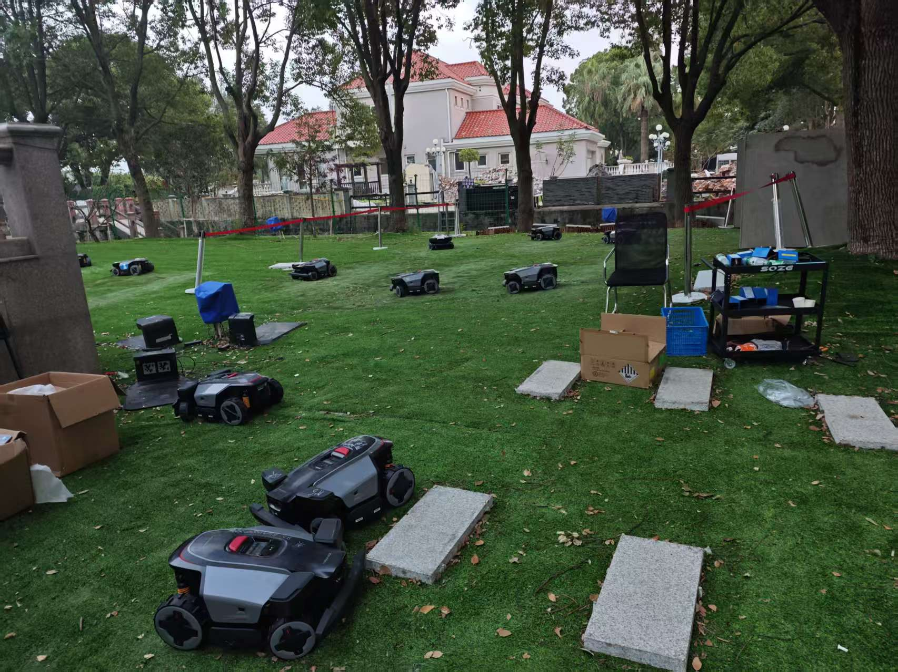

   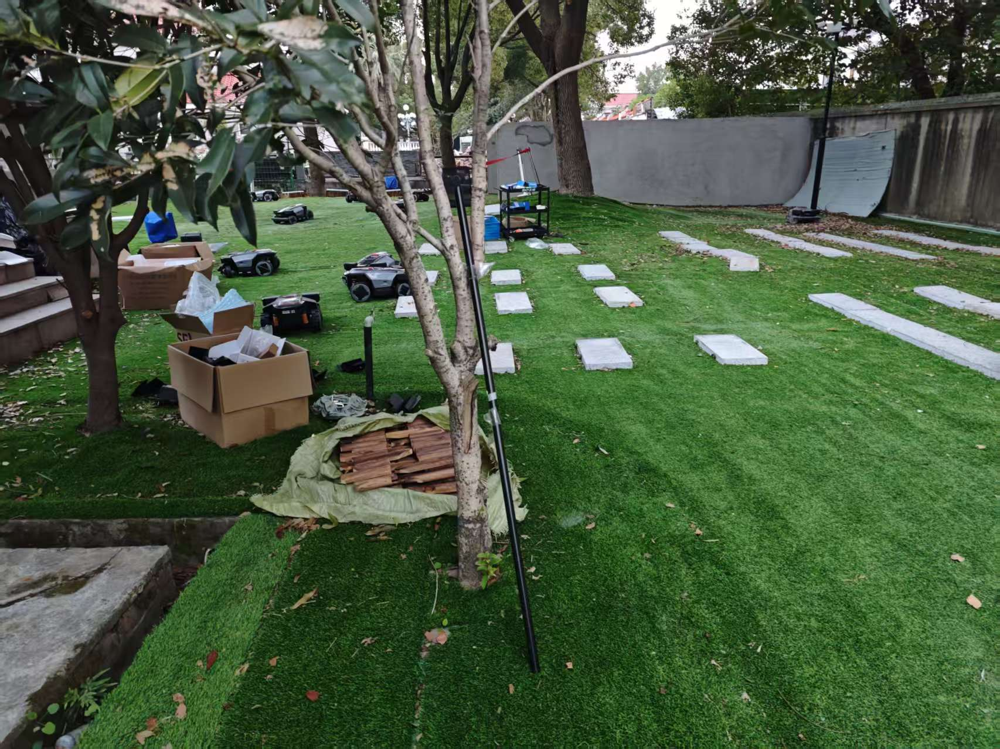

   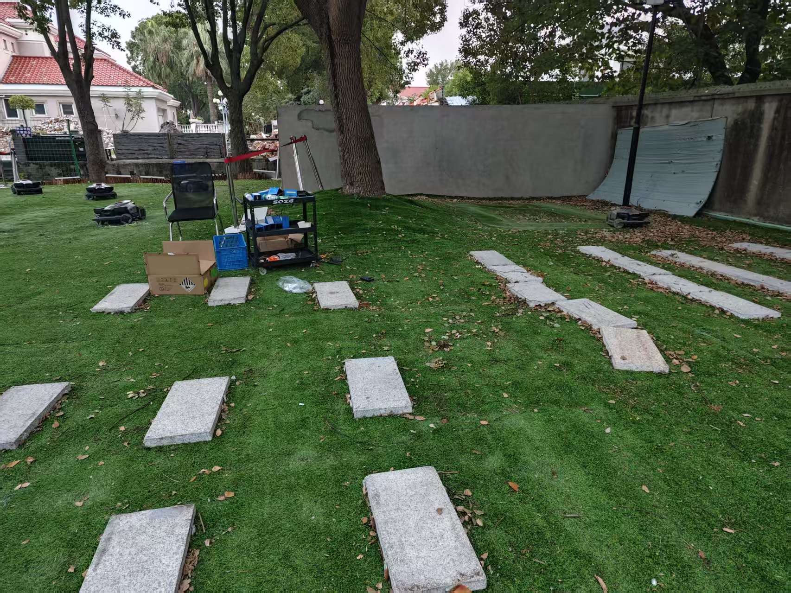

   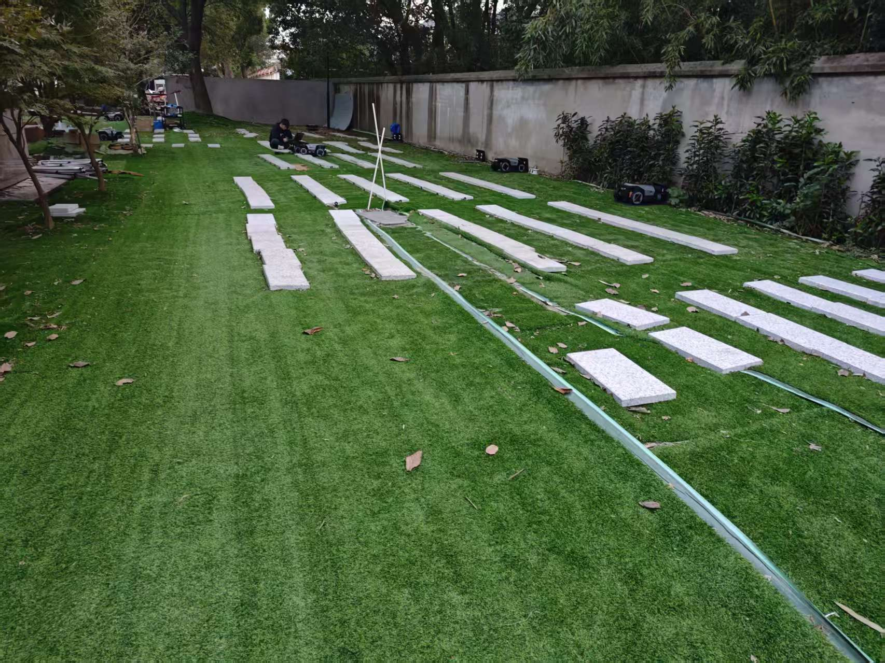

   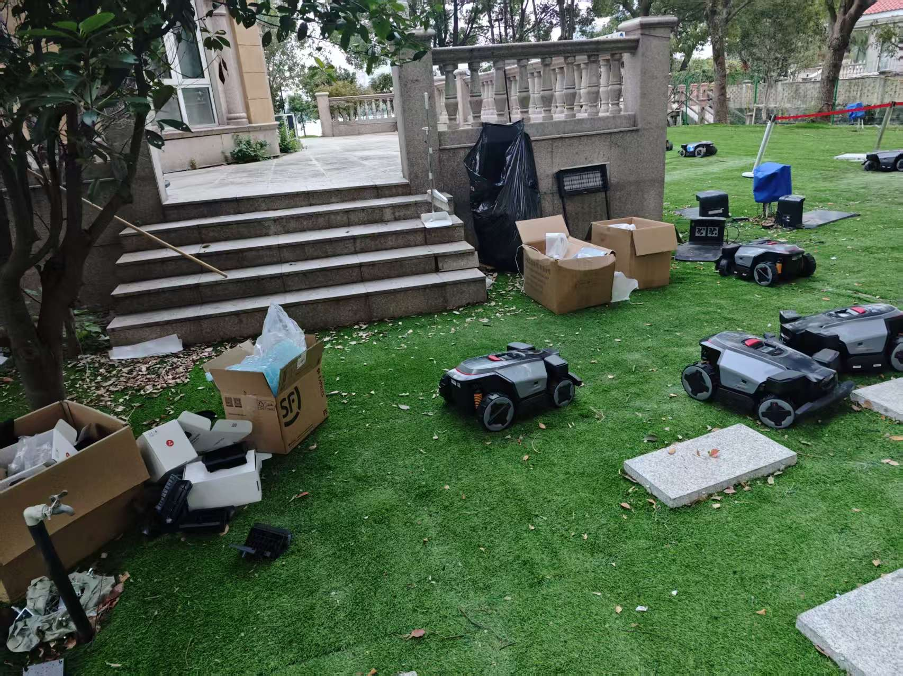

   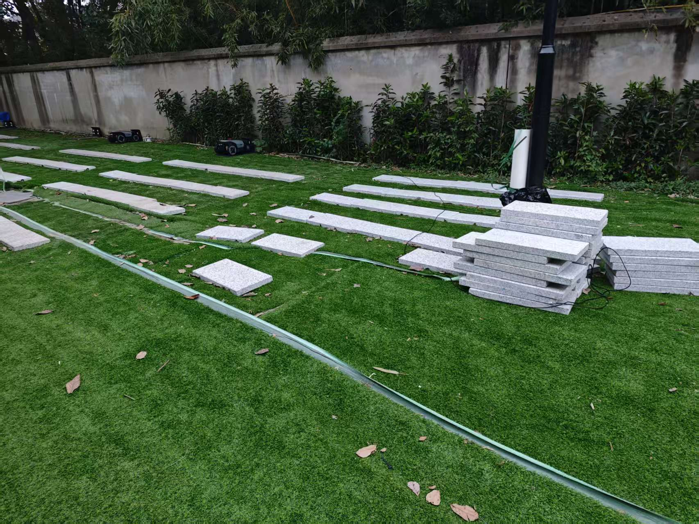

   1. ~~沿边建图~~

   2. ~~2m弓字~~

   3. ~~正常弓字~~

### 2. 78栋场地

1. 78-1-东北 √

   1. 沿边建图：https://roborock.feishu.cn/drive/folder/WmFbfS9pAlRsNYd61sQcTSSfnMc

   2. **※需采集：2m弓字90°，B2-14&#x20;**[78-1东北-1201-14.30\_14.50-2m弓字90°-B3-296](https://roborock.feishu.cn/drive/folder/AukmfEwM7l2WrXdmCSmcAPHGnqh)

   3. 2m弓字[ 78-1-东北-2m 跑机时间：14：00-16：00.rar](https://roborock.feishu.cn/file/A7fJbjhX7osEcqxb0EZcRFmynMd)

   4. 正常弓字[ 78-1-东北弓字14：40-16：00  b2-14.zip](https://roborock.feishu.cn/file/Tum3bRKhRoj2dAxbZrYcBUc3nPN)

2. 78-2-东南√

   1. 沿边建图[ 78-2东南10-22-15顺时针b2-1.zip](https://roborock.feishu.cn/file/LeZPb35U8o76SDx9sqnco64FnLg)

   2. 2m弓字[ 78-2东南10-23-10\_11二米弓采b2-1.zip](https://roborock.feishu.cn/file/Ytwibi0fIow19Hx4eiLcMLcanuc)

   3. **※需采集：2m弓字90°，B2-1&#x20;**[78-2东南-1201-18.00\_18.20-2m弓字90°-B3-296](https://roborock.feishu.cn/drive/folder/HeuFfQZm9lcga9dVpfUcSmqKnCc)

   4. [78-东南-1204-10.45\_11.10-2m弓字90°-B3-296](https://roborock.feishu.cn/drive/folder/V0xefQVJElKbdfdxdrZcEVZNnsd)（白天重新补采）

   5. 正常弓字[ 78-2东南10-22-10\_12正常采b2-1.zip](https://roborock.feishu.cn/file/JIO0behe9oUYOwxV2r9clNenntd)

   6. 正常弓字，采集之前未清理之前数据，且在采集过程中出现问题。[ 78-2东南10-21-14\_16正常采b2-1.zip](https://roborock.feishu.cn/file/MChdbW8IHoPUwUxKbmuciScHn7e)

3. **※需采集：78-3-西南(重采)机器：[B3-296](https://roborock.feishu.cn/drive/folder/VuKnfSwVrlqnzEdDM8pcXAW0n4e)**

   1. 沿边建图[78-西南-12.03-沿边建图-B3\_296](https://roborock.feishu.cn/drive/folder/WgC4f1Zxmli7TgdJrbcc2SVinFq)

   2. [78-西南-12.08-沿边建图-顺时针-B3\_296](https://roborock.feishu.cn/drive/folder/UoetfbNQJlKr7bdGyyece0Mnn8b)（重新补采）

   3. 2m弓字[78-3西南 17：11-17：24 2m弓字 b3-247](https://roborock.feishu.cn/drive/folder/WmVXfTA1PlsHntdS9hgcwlYGngb)

   4. [78-西南-12.08-2m弓字-B3\_296](https://roborock.feishu.cn/drive/folder/SDwBfl8pblg88xdBVlvcsmyVnTf)

   5. [78-西南-2m弓字-B3\_296-12.10](https://roborock.feishu.cn/drive/folder/HA16fzR9Zl5bxPdUGwacYJ5Vnlf)（10.10重新补采）

   6. [78-西南-2m弓字-B3\_296-12.11](https://roborock.feishu.cn/drive/folder/LatwfLvYBlcJf7dPZQTcYvfjnId)（10.11重新补采）

   7. [78-西南-2m弓字-B3\_296-（12.17重新补采）](https://roborock.feishu.cn/drive/folder/Xe9jfhX8Dluu59dN6gRc2O71nQe)

   8. **※需采集：2m弓字90°，任意Butchart&#x20;**[78-3西南-1201-16.30\_17.10-2m弓字90°-B3-296](https://roborock.feishu.cn/drive/folder/VuKnfSwVrlqnzEdDM8pcXAW0n4e)

   9. 正常弓字[78-西南-12.03-密集割草-B3\_296](https://roborock.feishu.cn/drive/folder/Kju1fLnQflscC8dSfcGcRRYGnRd)

   10. [78-西南-12.06-正常弓字-B3\_296](https://roborock.feishu.cn/file/HJOPblOx3otFeKxW2wJcjgA6nIg)（重新补采）

4. 78-4-西北要求多次建图

   1. 晴天13点

      1. 沿边建图：[ 78-4 晴天沿边  10：18-10：30点 B2-14.zip](https://roborock.feishu.cn/file/SMRWboQSmo9QE8xM4XncfibMnTd)√

      2. **※需采集： 2m弓字：[ 78-4西北2m 14：50-15：20 b2-14.zip](https://roborock.feishu.cn/file/QgzwbtuvToTcaZxNS85cKhsinXf) 数据不全&#x20;**[78-4  2m弓字  13点  b3-247](https://roborock.feishu.cn/drive/folder/YcUwfPHueltHkydWKIGcggoZnSh)

      3. 正常弓字：https://roborock.feishu.cn/drive/folder/IuixfumJvlxeyddJCTGcOfxJnyg√

         1. 78-4\_NW\_Arc\_Sunny\_1230-1400

   2. 晴天17点   **※需采集：机器：Butchart B2-14**

      1. **※需采集：沿边建图：[ 78-4西北晴天沿边 15：30-15：50 b2-14.zip](https://roborock.feishu.cn/file/JWsabpYw4oHxHWxPZZRcwdnInzc)时间不对**[78-4西北 晴天沿边17点 b3-247](https://roborock.feishu.cn/drive/folder/XYRcfCU8hlllyGdnAyictu1nnad)

      2. **※需采集：2m弓字：[ 78-4西北2m二次 14：50-15：20 b2-14.zip](https://roborock.feishu.cn/file/BVj2bXDP3oTeMzxrCLpcn0OPnie)时间不对**[78-4西北2m弓字晴天17点 b3-247](https://roborock.feishu.cn/drive/folder/PdXyfF1SjlLelld1BpfcFSLwnAb)

      3. 正常弓字：https://roborock.feishu.cn/drive/folder/RlEQfDqXalHrV5dBRrjcAzHNnDz√

         1. 78-4\_NW\_Arc\_Sunny\_1630-1800

   3. 阴天13点

      1. 沿边建图https://roborock.feishu.cn/drive/folder/XDWIfZ3j8l3epBdRB28cKJOwnF2

      2. **※需采集：2m弓字[ 78-4 西北2m 10点-11点 B2-14.zip](https://roborock.feishu.cn/file/Cjt9bvMkMoefcUxpL5HcpA55ngb) 机器：Butchart B2-14**[78-4  西北  2m弓字  阴天13点 b3-247](https://roborock.feishu.cn/drive/folder/WhpMfCx7BlBgJKdr6Egcr1qJnTh)

      3. 正常弓字：

         1. 只存下一部分数据，中间硬盘掉了[ 78-4 西北正常弓字 12点-16点 B2-14.zip](https://roborock.feishu.cn/file/Sdc8b5HEbonPRIxv77BcCpcanvg)

         2. 周边创建了禁区，只割了中间200多平米的面积[ 78-4 西北正常弓字 12点-16点 B2-14.zip](https://roborock.feishu.cn/file/Sdc8b5HEbonPRIxv77BcCpcanvg)√

            1. 78-4\_NW\_Arc\_Cloudy\_20251108\_0910-1000

   4. 阴天17点

      1. **※需采集：沿边建图：[ 78-4 阴天沿边  9点30-10：00点 B2-14.zip](https://roborock.feishu.cn/file/Eq2Xb0BOIo3tDrxlQ8dcmU4tntg)时间不太对      机器：Butchart B2-14**[78-4 阴天沿边  17点 b3-247](https://roborock.feishu.cn/drive/folder/LMPvfQrtylt3APd1Vv3ceDHInSR)

      2. **※需采集：2m弓字：[ 78-4 阴天下午2M 17点10—17点48  B2-14.zip](https://roborock.feishu.cn/file/Gwp2bclmbov576xwPS3cP5cenrc) 机器：Butchart B2-14**[78-4 西北 阴天17点  2m弓字 b3-247](https://roborock.feishu.cn/drive/folder/AMPwfhJOwls96IdZ5V3cjmr6nIh)

      3. 正常弓字：[ 78-4 阴天密集弓字  15点10-17：10点 B2-14.zip](https://roborock.feishu.cn/file/G77sbSnhZopMk6xR6ZicVZIYnrg)√

### 3. 105栋场地 B2-14

1. 105-1-东北√

   1. 沿边建图：[ 105-1-东北沿边弓字11：20-11：26 B2-14.zip](https://roborock.feishu.cn/file/Sjurb5gcjo25jnxEFrEcQ773nPg)

   2. 2m弓字：[ 105-1-东北2m弓字10：50-10：57 B2-14.zip](https://roborock.feishu.cn/file/KZBSbqjWzoi1wjxVbd5cQGvFnCd)

   3. 正常弓字：[ 105-1-东北弓字11：50-13： 15B2-14.zip](https://roborock.feishu.cn/file/X1XfbngzAodovox5jfUc2BVdndb)

2. **※需采集：105-2-东南  机器：任意Butchart**

   1. **沿边建图[ 105-2-东南-14点18分-14点22分-顺时针和逆时针-b112.zip](https://roborock.feishu.cn/file/K7aHbcEg0ojH9gx5tcvcKlxEnsh)**

   2. [105-东南-12.03-沿边建图-B3\_296](https://roborock.feishu.cn/drive/folder/FPvlfuq1alDC6edbZ2KcyCTAnpd)

   3. **2m弓字 [ 105-2-东南-15时30分-16点03分-二米弓字割草-b112.zip](https://roborock.feishu.cn/file/TBoWbZpVKouxsIxW8J2cm8kkncd)**

   4. [105-2东南-12.02-2m弓字-B3-247](https://roborock.feishu.cn/drive/folder/CFNGfX2Q9lqY71dqlcBcdCjCnWg)

   5. **正常弓字 [ 105-2-东南-12点05分-13点01分-密集割草-b112.zip](https://roborock.feishu.cn/file/KYbFbDDRvoykqLxMZ3acdyXknZg)**

   6. [105-东南-12.03-密集割草-B3\_296](https://roborock.feishu.cn/drive/folder/WYN5fwazWlhCUEdtt4CcDt61nct)

3. **※需采集：105-3-正南 机器：任意Butchart**

   1. **沿边建图 [ 105-3-正南-13点22-13点28分-顺时针和逆时针-b112.zip](https://roborock.feishu.cn/file/BlQkbg9FbojZQmxXP8ccoRKgn1d)**

   2. [105-正南-12.02-沿边建图-B3\_296](https://roborock.feishu.cn/drive/folder/N5blfK2GclpevCdtTDZcA9Cwnoc)

   3. [105-正西-12.08-沿边建图-顺时针-B3\_296](https://roborock.feishu.cn/drive/folder/JLS3fUFYTlyTnhdnpsgcF01Cn3d)（重新补测）

   4. **2m弓字 [ 105-3-正南-13点38分-13点58分-二米弓字割草-b112.zip](https://roborock.feishu.cn/file/NIkZbkcbAoHh9lxhcPPc08YZnj9)&#x20;**

   5. [105-正南-12.02-2m弓字-B3\_296](https://roborock.feishu.cn/drive/folder/RQQmfmjnulYTfMd8jnYcgySkn8d)

   6. **正常弓字 [ 105-3-正南-10点20-11点4分-密集割草-b112.zip](https://roborock.feishu.cn/file/EiyKbHzzFoaN6nx8aNbc5sNgn9g)**

   7. [105-正南-12.02-密集割草-B3\_296](https://roborock.feishu.cn/drive/folder/NidSfWk2Mlo8Pfdoh6CcuXw8nge)

4. **※需采集：105-4-西北 机器：任意Butchart**

   1. 阻塞，西北区域刚铺新草坪，机器不允许在上面跑

   2. **沿边建图 [ 105-4-西北-10点01分-10点05分-顺时针和逆时针-b112.zip](https://roborock.feishu.cn/file/GWlPbxREOoWgW7x3ASBcpafrnWh)**

   3. **2m弓字 [ 105-4-西北-10点22分-10点44分-二米弓字割草-b112.zip](https://roborock.feishu.cn/file/F0wIblzKSoI1hvxNLkhcexxdnsh)**

   4. **正常弓字 [ 105-4-西北-10点06分-11点47分-密集割草-b112.zip](https://roborock.feishu.cn/file/A9g0bc1MIogP0XxuTCFcxomVnid)**

5. **※需采集：105-正西 机器：任意Butchart**

   1. **沿边建图 [ 105-5-正西-9点35分-9点40分-顺时针和逆时针-b112.zip](https://roborock.feishu.cn/file/IrRjbQjCMoNrX2x1Lxoc8F0Tngd)**

   2. [105-正西-12.02-沿边建图-B3\_296](https://roborock.feishu.cn/drive/folder/Q8LcfKhp2l0GwbdlfG8cdK5mnTe)

   3. **2m弓字 [ 105-5-正西-11点19分-10点38分-二米弓字割草-b112.zip](https://roborock.feishu.cn/file/YfsWbBnZkoM0hlxd6UlcFsdzn0b)**
      [105-正西-12.02-2m弓字-B3\_296](https://roborock.feishu.cn/drive/folder/SmBgfEqfdlnOYJdFyGxcCUDanRb)

   4. **正常弓字 [ 105-5-正西-14点19分-15点39分-密集割草-b112.zip](https://roborock.feishu.cn/file/WilFb2tc3odXvjxb7b8cEXe9nof)**

   5. [105-正西-12.02-密集割草-B3\_296](https://roborock.feishu.cn/drive/folder/J5aif5inMlphUmdS6MrcuTUpnnf)

### 4. 机器编号与对应机器固件信息

产品名称: B3-296

网络信息: Unknown

IP 地址: Unknown

WiFi MAC地址: Unknown

产品型号: roborock.mower.a222v5

序列号: RCSEEX54200296

RTK的TN信息: Unknown

固件版本: 02.47.85

App 版本: 4.54.02(iOS 18.6.2 - 1)

插件版本: 276

UID: rr65aaa78cde9830

DID: 48XUgtTUSkWTHJweuYg2wI

mobileModel: iPhone16,2

region: cn

机器b2-1

产品名称: 应用开发b2
网络信息: Roborock-SZ-IOT
IP 地址: [192.168.212.30](http://192.168.212.30)
undefined: 24:9e:7d:33:b8:5a
产品型号: roborock.mower.a222v5
SN序列号: RCSEEX53500030
固件版本: 02.41.05
App 版本: 4.57.02.0929(Android 35)
插件版本: 212
用户UID: rr64dc79f2841830
DID: 3kXFxfMVQ23dAsCikMfLnA
mobileModel: 23127PN0CC
region: eu

机器b2-14

产品名称: Butchart海外 V5
网络信息: Roborock-SZ-IOT
IP 地址: [192.168.212.14](http://192.168.212.14)
WI-FI MAC地址: 24:9e:7d:33:b8:6f
产品型号: roborock.mower.a222v5
SN序列号: RCSEEX53500123
固件版本: 02.41.21
App 版本: 4.57.02.1014(Android 34)
插件版本: 213
用户UID: rr66612246bf1830
DID: 51Sr570EMfk4x0jqelefUE
mobileModel: 23078RKD5C
region: cn

产品名称: b1-12
网络信息: Roborock-Out
IP 地址: [192.168.215.177](http://192.168.215.177)
WI-FI MAC地址: 24:9e:7d:33:b5:0b
产品型号: roborock.mower.a222v5
SN序列号: R0005X52700041
固件版本: Unknown
App 版本: 4.57.02.0929(Android 34)
插件版本: 215
用户UID: rr64dc79f2841830
DID: 4HlnFmll1SYVc6Y9wMJsuO
mobileModel: 22011211C
region: eu

产品名称: B3-247

网络信息: roborock

IP 地址:&#x20;

WiFi MAC地址: 24:9e:7d:49:48:2f

产品型号: roborock.mower.a222v5

序列号: RCSEEX54200247

RTK的TN信息: Unknown

固件版本: 02.47.81

App 版本: 4.54.02(iOS 26.1 - 1)

插件版本: 276

UID: rr65aaa78cde9830

DID: 6QRS5mAenKXLieBjX0FRqr

mobileModel: iPhone16,2

region: cn

### 5. 已整理数据

位置：

sftp://10.2.18.25/mnt/nvme1/RelocalizationData

| 原始数据名称                                                                                                                   | benchmark名称                                                                                                                                    |
| ------------------------------------------------------------------------------------------------------------------------ | ---------------------------------------------------------------------------------------------------------------------------------------------- |
| 60-1-草地-10-24-10顺逆时针b2-1                                                                                                 | 60-1\_NW\_EdgeMap\_251024-1100\_B2-1                                                                                                           |
| 60-1-草地-10-24-14\_15-2米弓字割草b2-1                                                                                          | 60-1\_NW\_2m-Arc\_251024\_14-15\_B2-1                                                                                                          |
| 60-1-草地-10-27-15\_17-正常割草b2-1                                                                                            | 60-1\_NW\_Arc\_251027\_15-17\_B2-1                                                                                                             |
| 60-2-大草地-10-24-15\_16-顺逆时针b2-1                                                                                           | 60-2\_E\_EdgeMap\_251024\_15-16\_B2-1                                                                                                          |
| 60-2-大草地-10-27-10\_11-2米弓字割草b2-1                                                                                         | 60-2\_E\_2m-Arc\_251027\_10-11\_B2-1                                                                                                           |
| 60-2-大草地-10-28-10\_12-正常割草b2-1                                                                                           | 60-2\_E\_Arc\_251028\_10-12\_B2-1                                                                                                              |
| 60-2-大草地-10-29-9\_11-正常割草二b2-1                                                                                           | 60-2\_E\_Arc\_251029\_9-11\_B2-1                                                                                                               |
| 78-1-东北沿边10：30-11：10  b2-14                                                                                              | 78-1\_NE\_EdgeMap\_CW\_1030-1110                                                                                                               |
| 78-1-东北-2m 跑机时间：14：00-16：00                                                                                              | 78-1\_NE\_2m-Arc\_1400-1600                                                                                                                    |
| 78-1-东北弓字14：40-16：00  b2-14                                                                                              | 78-1\_NE\_Arc\_1440-1600                                                                                                                       |
| 78-2东南10-22-15顺时针b2-1                                                                                                    | 78-2\_SE\_EdgeMap\_W\_1500                                                                                                                     |
| 78-2东南10-23-10\_11二米弓采b2-1                                                                                               | 78-2\_SE\_2m-Arc\_1000-1100                                                                                                                    |
| 78-2东南10-22-10\_12正常采b2-1                                                                                                | 78-2\_SE\_Arc\_1000-1200                                                                                                                       |
| 11\_5\_16\_顺逆时针采\_b1-12                                                                                                  | 78-3\_SW\_EdgeMap\_CW\_1600                                                                                                                    |
| 78-4 晴天沿边  10：18-10：30点 B2-14                                                                                            | 78-4\_EdgeMap\_Sunny\_1018-1030                                                                                                                |
| ~~78-4西北2m 14：50-15：20 b2-14~~                                                                                           | 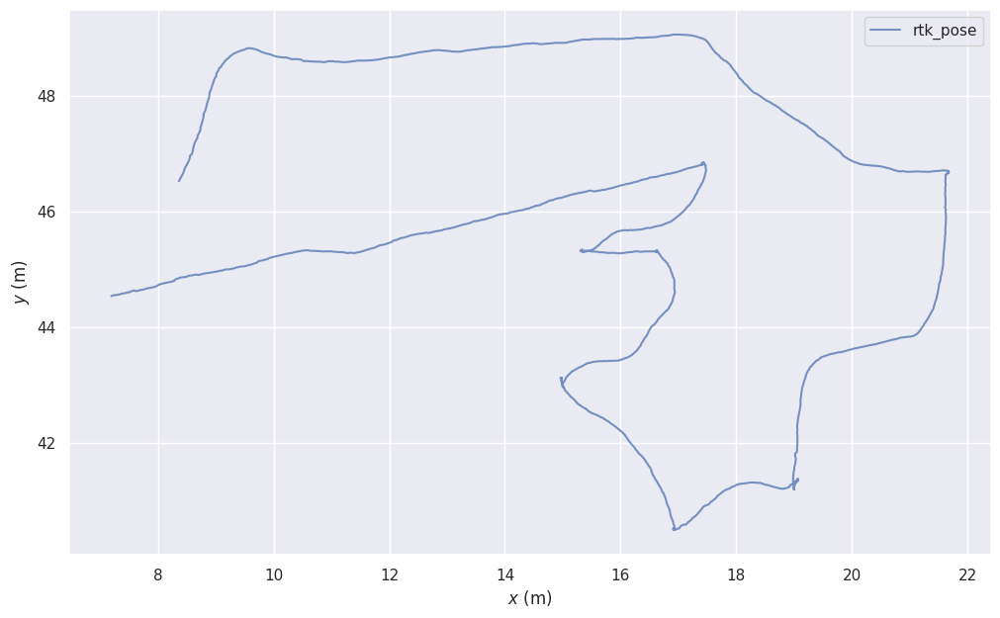轨迹不对78-4\_NW\_EdgeMap\_2m\_sunny\_1450-1520                 |
| 78-4西北晴天弓字12：30-14：00-B2-14                                                                                              | 78-4\_NW\_Arc\_Sunny\_1230-1400                                                                                                                |
| 78-4西北晴天沿边 15：30-15：50 b2-14                                                                                             | 78-4\_NW\_EdgeMap\_Sunny\_1530-1550                                                                                                            |
| 78-4西北2m二次 14：50-15：20 b2-14                                                                                             | 78-4\_NW\_Arc2m\_1450-1520                                                                                                                     |
| 78-4西北晴天二次弓字1630-1800B2-14                                                                                               | 78-4\_NW\_Arc\_Sunny\_1630-1800                                                                                                                |
| 105-1-东北2m弓字10:50-10:57-B2-14                                                                                            | 105-1\_NE\_2m-Arc\_1050-1057\_B2-14                                                                                                            |
| 105-1-东北弓字11：50-13： 15B2-14内含多个日志包，其中两个有弓字                                                                               | 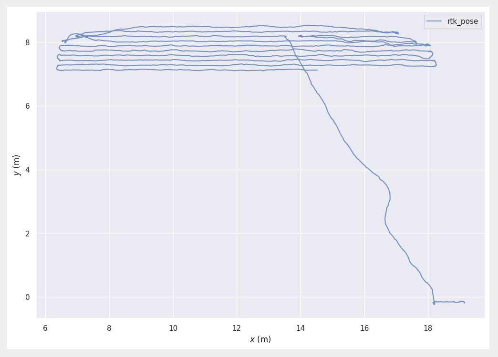105-1\_NE-Arc\_1150-1315\_B2-14\_1                          |
|                                                                                                                          | 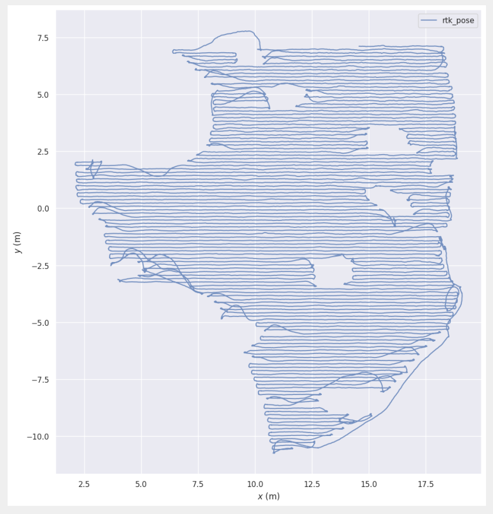105-1\_NE-Arc\_1150-1315\_B2-14\_2                          |
| 105-1-东北沿边弓字11:20-11:26-B2-14转换后的轨迹，看着只有沿边                                                                               | 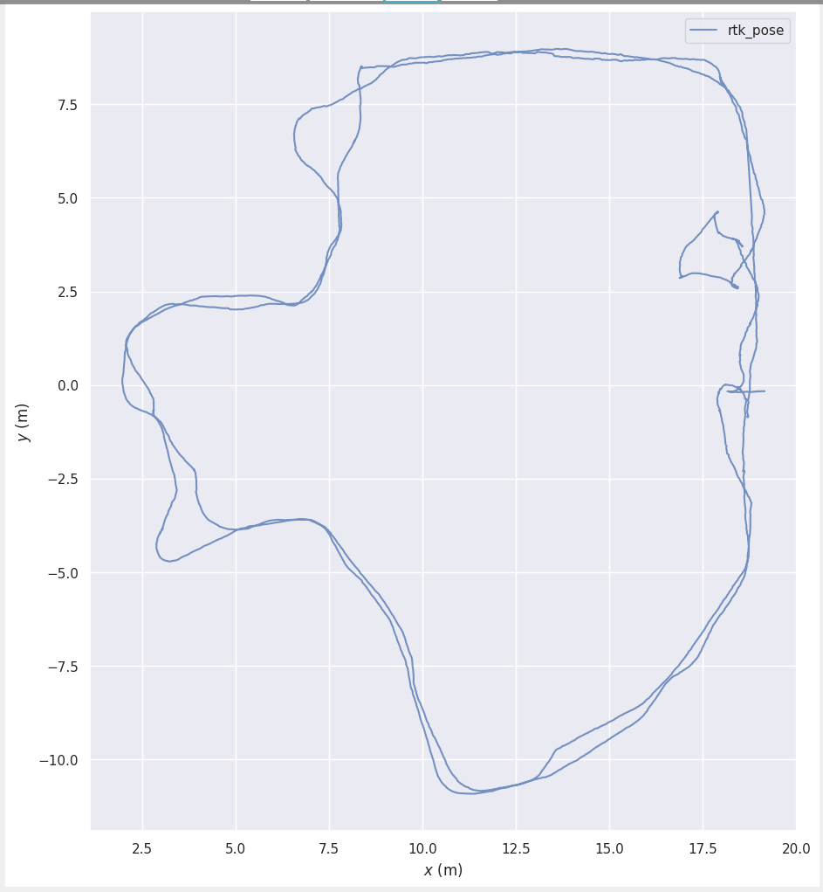105-1\_NE-EdgeMap\_Arc\_1120-1126\_B2-14                    |
| 11月17日发现, B1-12采集的105栋数据 大多存在图像丟帧导致数据不可用的情况.                                                                             |                                                                                                                                                |
| 105-2-东南-15时30分-16点03分-二米弓字割草-b112                                                                                       | 105-2\_SE\_2m-Arc\_1530-1603\_B112                                                                                                             |
| 105-2-东南-12点05分-13点01分-密集割草-b112&#xA;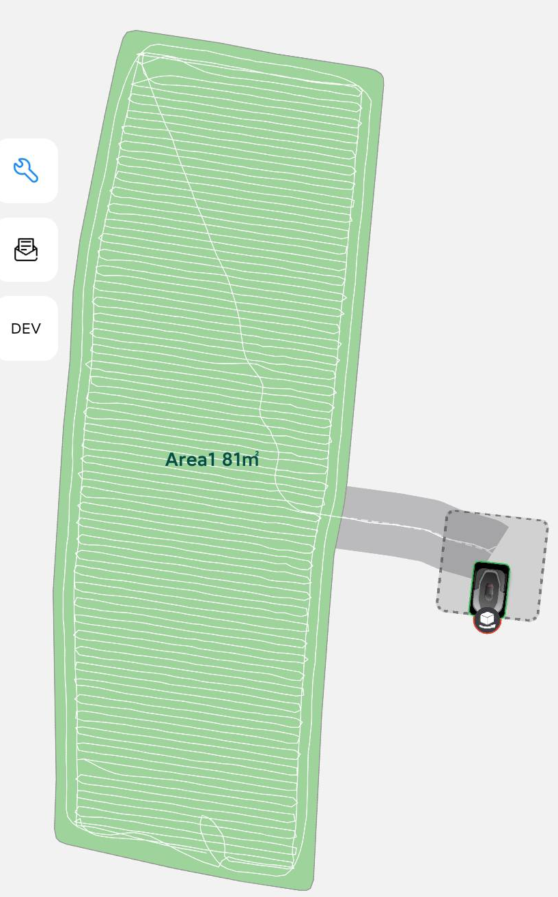 | 105-2\_SE\_Arc\_1205-1301\_B112数据不全，转换后rtk仅部分弓字，测试已删除数据。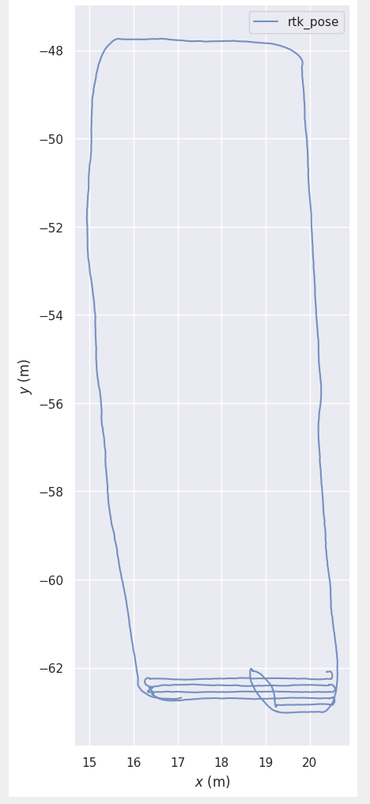    |
|                                                                                                                          | 105-2\_SE\_Arc-EdgeMap\_1205-1301\_B112外圈沿边有个单独的日志包。在弓字割草之前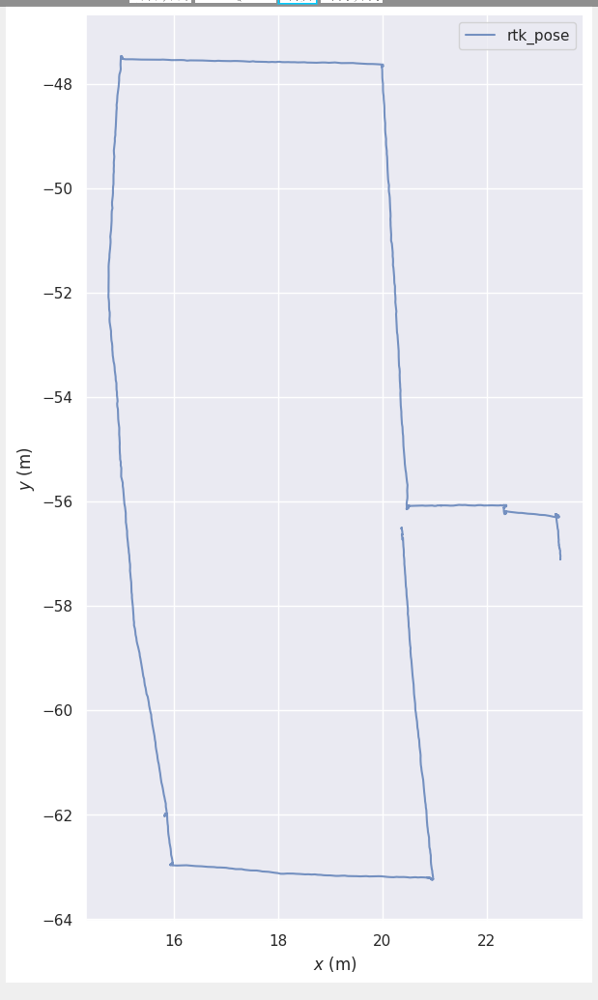 |
| 105-2-东南-14点18分-14点22分-顺时针和逆时针-b112                                                                                      | 105-2\_SE\_CW\_1418-1422\_B112&#xA;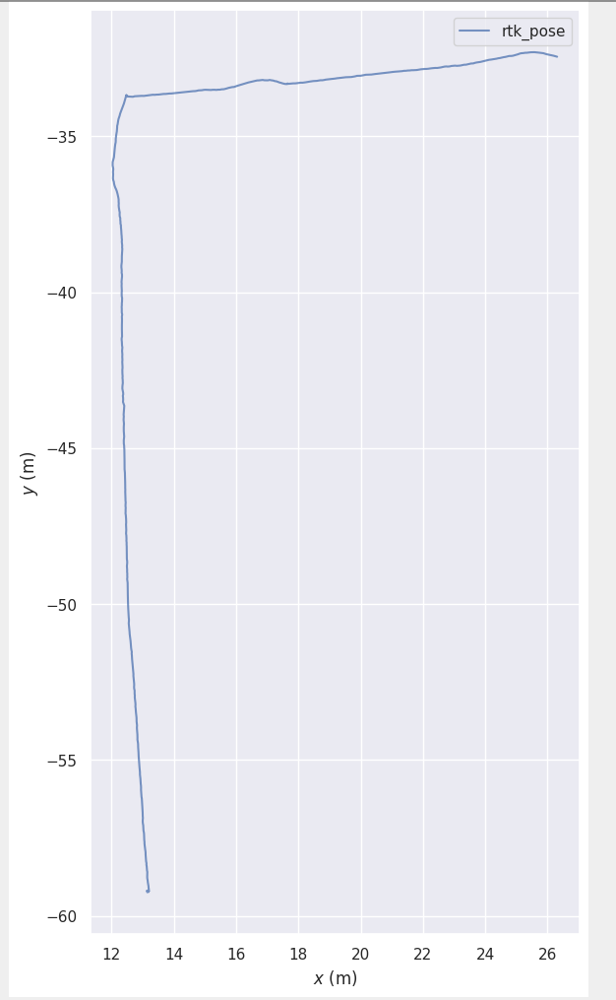rtk只有一部分                 |
| 105-3-正南-13点38分-13点58分-二米弓字割草-b112                                                                                       | 105-3\_S\_2m-Arc\_1338-1358\_B112                                                                                                              |
| 105-3-正南-10点20-11点4分-密集割草-b112                                                                                           | 105-3\_S\_Arc\_1020-1104\_B112                                                                                                                 |
| 105-3-正南-13点22-13点28分-顺时针和逆时针-b112                                                                                       | 105-3\_S\_CW\_1322-1328\_B112                                                                                                                  |
| 105-4-西北-10点22分-10点44分-二米弓字割草-b112                                                                                       | 105-4\_NW\_2m-Arc\_1022-1044\_B112                                                                                                             |
| 105-4-西北-10点06分-11点47分-密集割草-b112                                                                                         | 105-4\_NW\_Arc\_1006-1147\_B112                                                                                                                |
| 105-4-西北-10点01分-10点05分-顺时针和逆时针-b112                                                                                      | 105-4\_NW\_CW\_1001-1005\_B112                                                                                                                 |
| 105-5-正西-11点19分-10点38分-二米弓字割草-b112                                                                                       | 105-5\_W\_2m-Arc\_1038-1119\_B112                                                                                                              |
| 105-5-正西-14点19分-15点39分-密集割草-b112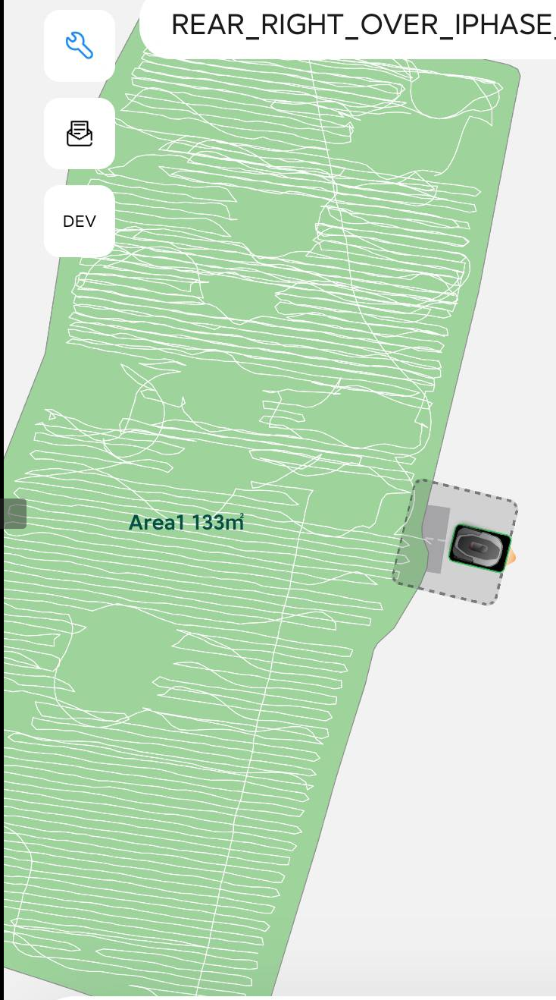      | 105-5\_W\_Arc\_1419-1539-B112-1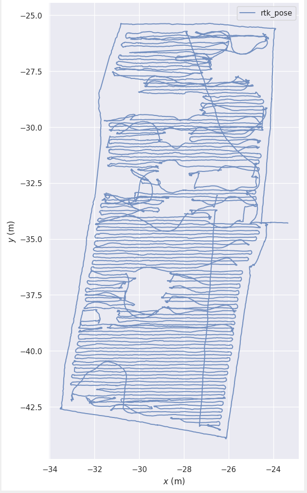和App的轨迹不完全一致，应该是少了一段。        |
|                                                                                                                          | 105-5\_W\_Arc\_1419-1539-B112-2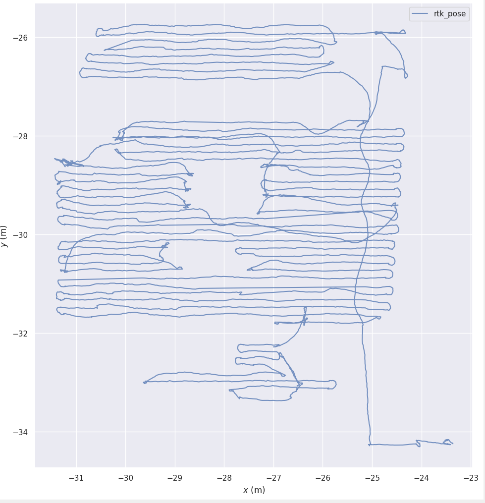不确定这段轨迹和App轨迹什么关系。           |
| 105-5-正西-9点35分-9点40分-顺时针和逆时针-b112                                                                                        | 105-5\_W\_CW\_0935-0940-B112                                                                                                                   |

