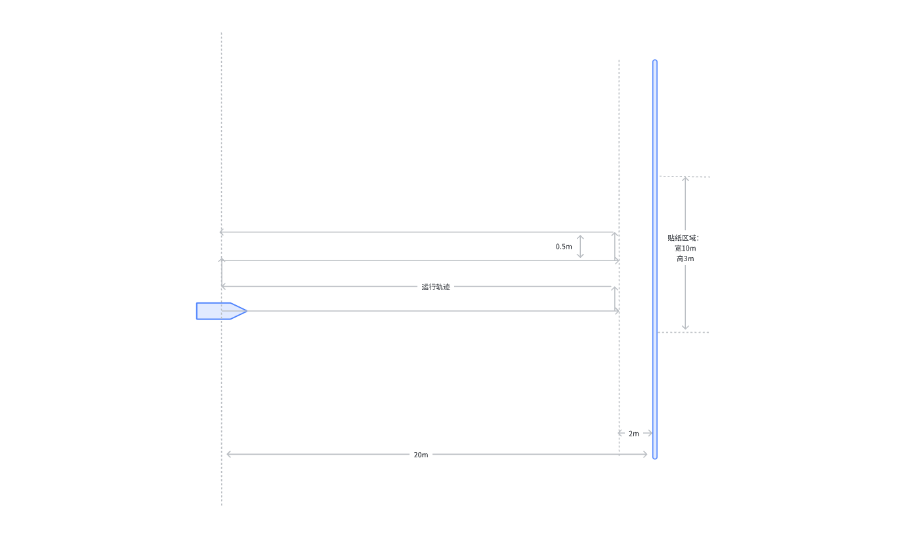

# 行差问题复现与检测方案

# 一、复现场地与操作方式

如图所示场地要求，在贴纸区域，挑选并打印、粘贴下面《打印.zip》内部的图片。贴满粘贴区域，中间可以允许有缝隙。模组前视，安装在大约20cm高的小车上或者人工手拿平稳地移动，按照如图所示轨迹运行，期间拍摄并保存双目图像数据。



# 二、检测工具与方式

5.22 更新：

````markdown
# 双目相机分析工具

用于分析双目相机数据，验证标定参数以及检查同步问题。

## 功能特点

- 支持静态场景和动态场景分析
- 使用SIFT特征点和光流算法分析校准质量
- 生成详细的分析报告和可视化图表
- 适用于各种类型的双目相机系统

## 安装与使用

### 安装步骤

1. 克隆仓库:
```
git clone https://xxxx.com/songshu/stereo_analyzer.git
cd stereo_analyzer
```

2. 安装依赖:
```
pip install -r requirements.txt
```

### 基本用法

```
python stereo_analyzer.py --input-dir [数据目录] --params [标定参数文件]
```

例如:

```
python stereo_analyzer.py --input-dir /path/to/dataset --params /path/to/sensor.yaml
```

## 输入数据要求

### 目录结构

工具期望数据目录结构如下:

```
input_dir/
└── camera/
    ├── camera0/
    │   ├── 1234567890.jpg
    │   └── ...
    └── camera1/
        ├── 1234567890.jpg
        └── ...
```

图像文件名应为毫秒级时间戳。

### 相机参数文件格式

本工具需要一个`sensor.yaml`格式的参数文件来进行双目相机的分析。此文件包含了相机的内参、外参和畸变参数等信息。

#### sensor.yaml 结构

```yaml
sensor:
  cameras:
    - T_B_C:  # 第一个相机(camera0)的外参矩阵
        cols: 4
        rows: 4
        data: [...]  # 16个元素，表示4x4变换矩阵
      camera:  # camera0的参数
        distortion:
          cols: 1
          rows: 8
          data: [...]  # 8个畸变系数
        distortion_type: "radial-tangential8"  # 畸变模型类型
        image_height: 544  # 图像高度
        image_width: 640   # 图像宽度
        intrinsics:
          cols: 1
          rows: 4
          data: [fx, fy, cx, cy]  # 内参(焦距和主点)
        projection_type: "pinhole"  # 投影模型类型
        
    - T_B_C:  # 第二个相机(camera1)的外参矩阵
        # 与camera0格式相同
      camera:  # camera1的参数
        # 与camera0格式相同
```

#### 关键参数说明

1. **内参矩阵(intrinsics)**
   - `fx, fy`: 相机焦距
   - `cx, cy`: 图像主点坐标

2. **畸变参数(distortion)**
   - 根据`distortion_type`的不同，参数含义会有所变化
   - `radial-tangential8`: 径向畸变和切向畸变参数
   - `kannala-brandt`或`equidistant`: 鱼眼相机畸变模型参数

3. **外参矩阵(T_B_C)**
   - 4x4矩阵，表示从机体(Body)坐标系到相机(Camera)坐标系的变换

#### camera0与camera1的关系

在程序中，`sensor.yaml`文件中的参数与代码处理的对应关系如下：

- `sensor.cameras[0]`对应代码中的**camera0**
- `sensor.cameras[1]`对应代码中的**camera1**

程序会从这些参数中提取以下信息：

1. 相机内参矩阵：`K0`和`K1`
2. 畸变系数：`distortion0`和`distortion1`
3. 畸变模型类型：`dist_type_cam0`和`dist_type_cam1`
4. 从机体到相机的变换矩阵：`T_B_C0`和`T_B_C1`
5. 从camera1到camera0的变换矩阵：`T_C1_C0`
6. 用于立体校正的旋转矩阵和平移向量：`R`和`T`

这些参数用于双目图像的校正、特征匹配和偏差分析，保证分析结果的准确性。

#### 示例文件

工具提供了一个`example/sensor_template.yaml`示例文件，可作为创建自己的参数文件的参考。

## 命令行参数

- `--input-dir`, `-i`: 输入数据目录，包含camera/camera0和camera/camera1子目录
- `--output-dir`, `-o`: 输出目录，默认为input_dir/analysis
- `--sampling-rate`, `-r`: 采样率(Hz)，默认1.0
- `--center-ratio`, `-c`: 校正缩放因子，大于1.0放大，小于1.0缩小，默认0.7
- `--flow-threshold`, `-t`: 光流偏差阈值(像素)，超过此值视为异常，默认1.5
- `--time-diff`, `-d`: 双目时间戳匹配阈值(毫秒)，默认30
- `--grid-size`, `-gs`: 极线可视化网格线间距(像素)，默认15
- `--max-features`, `-mf`: 提取的SIFT特征点最大数量，默认1000
- `--ransac-threshold`, `-rt`: RANSAC重投影阈值(像素)，默认1.5
- `--params`: 相机参数文件路径(sensor.yaml格式)，必须提供
- `--config`: 配置文件路径(YAML格式)，可选

## 分析结果与解读

分析结果将保存在输出目录中，包括:

- 极线校正可视化
- Y方向偏差分布直方图
- 时间序列偏差图
- 问题帧可视化
- 详细的分析报告

关于分析结果的详细解释和如何解读可视化内容，请参阅`stereo_analyzer.md`文档。该文档提供了：

- 可视化内容的详细说明
- 各类图表的解读方法
- 异常情况的判断标准
- 结果评估指南

查看`stereo_analyzer.md`可以帮助您全面理解分析结果并做出正确的评估判断。 
````
