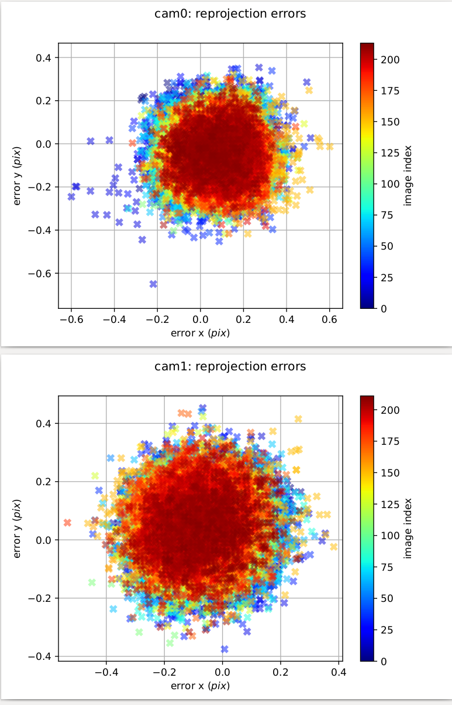
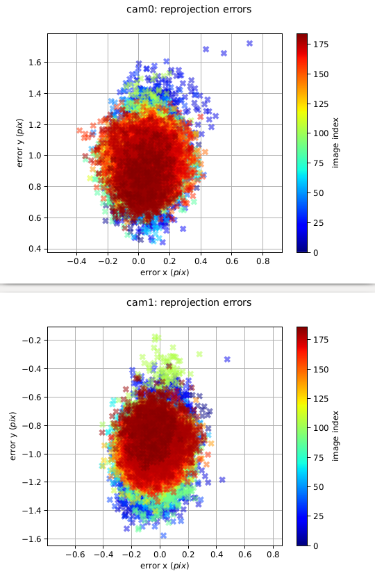
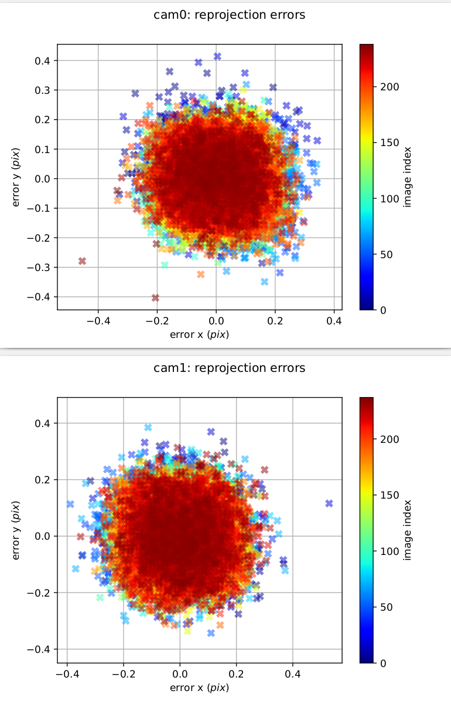
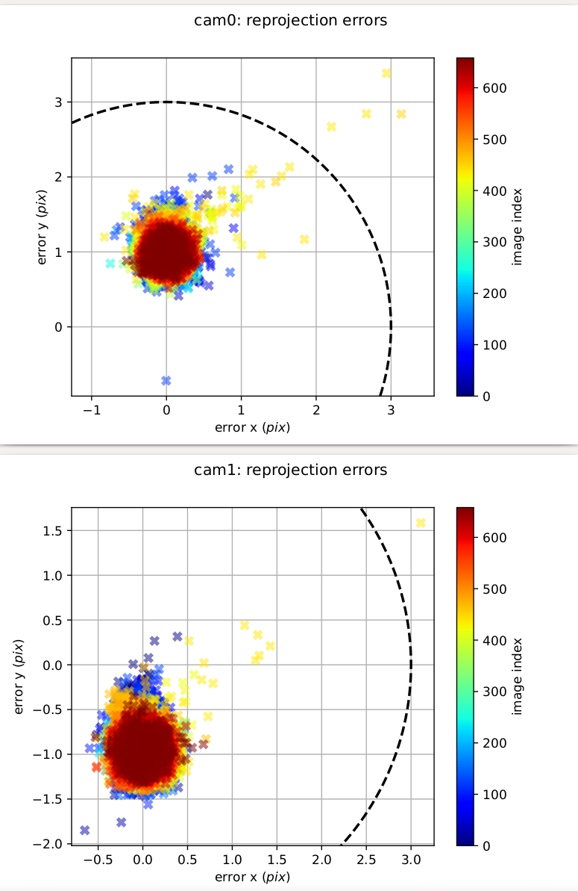
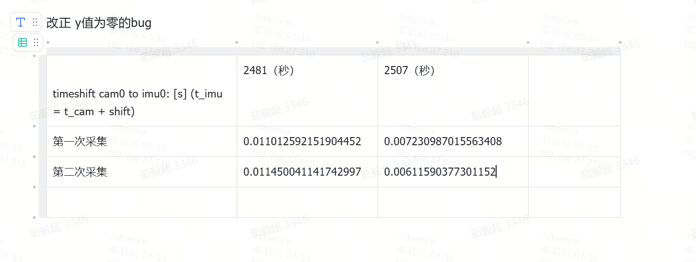
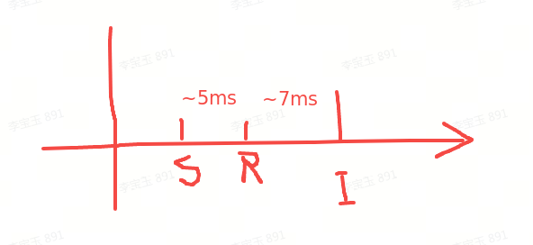

# B1-37行差&Cam Time问题排查

# 一、行差问题排查

1. ~~算法差异，排除~~

   1. ~~用slam\_data\_toolkit脚本测试了GDC图，行差0.5左右，与俊杰的算法有一致性。~~

2. FOV差异基本排除

   1. slam\_data\_toolkit使用 dualcamera\_calibration.json中的P1、P2、R1、R2，105 lake的平均行差1.55pix。

      1. 分析了1264对图像，648对图像行差超过1.5pix

      2. 105lake为室外图像，跟踪特征点主要在图像上半部分。648对行差大的图像，图像左上和中上部的行差为正，但右上部的行差为负。

   2. 不过在105lake上确实存在行差随到光心距离而增大。

3. 进一步确定FOV问题

   1. 出桩上层软件采图：进入数据采集模式，遥控重复出桩回桩3次

4. 上层软件处理问题

   1. 关闭上层软件，开启AT命令在78 lake采集图像

5. 模组内部变动

   1. 工区MCT采图，看行差

   2. 机械臂采集模组标定数据

# 二、Camera-IMU时间戳offset标定实验相关现象

# 2.1 实验数据&#x20;

毅超针对camera-imu时间戳offset进行标定的数据中发现，不同的版本存在不同的重投影误差。并且这些版本都各采集了两次，时间有穿插。可以排除是两次版本间有结构参数改变。并且能够确定Daily Build上确实存在行差大的问题。

2507为Daily Build

2481为改了相机时间戳至曝光开始时的Build

1. 2481-1 20250722

2. 2507-1 20250723

3. 2481-2 202507240300

4. 2507-2 202507240327

| 采集版本/批次 | 版本类型        | 采集时间         | 重投影误差图                                                                              | 行差  |
| ------- | ----------- | ------------ | ----------------------------------------------------------------------------------- | --- |
| 2481-1  | 改相机时间戳      | 20250722     |  | ～0  |
| 2507-1  | Daily Build | 20250723     |  | \~2 |
| 2481-2  | 改相机时间戳      | 202507240300 |  | \~0 |
| 2507-2  | Daily Build | 202507240327 |  | \~2 |

## 2.2 offset结论

2507为Daily Build，时间更晚

2481为改了相机时间戳至曝光开始时的Build，时间更早

相关结论

1. IMU时间戳滞后，可能有滤波带来的影响

2. sync和收到第一行像素的时间戳，其相对关系正确（IMU滞后，sync先于recv，其距离IMU的时间更久）

3. 看了MK2其他数据的offset，从0.002到0.015不等

