# 售后标定缩小二维码测试

**测试一：**&#x7528;0.1m\*0.1m的二维码在墙角贴高度1m的5行8列标定板，分别在对角线2.2m、1.5m、1m、0.5m附近和贴近二维码处做旋转动作，测试是否可以识别到二维码。

1. 对角线2.2m处多帧中只能识别到1，2个二维码，无法初始化，且肉眼可以看出识别效果非常差。

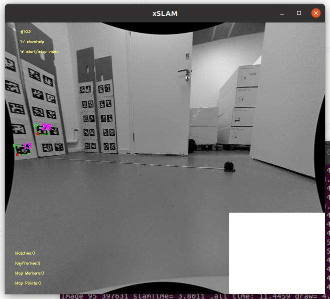

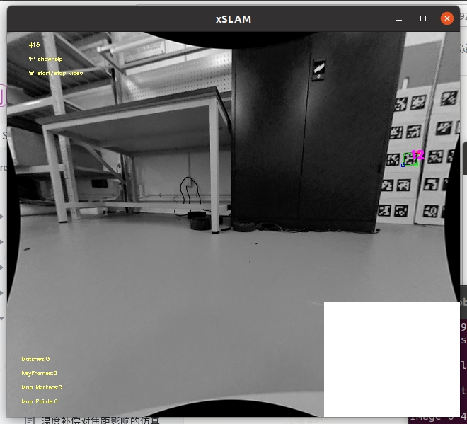

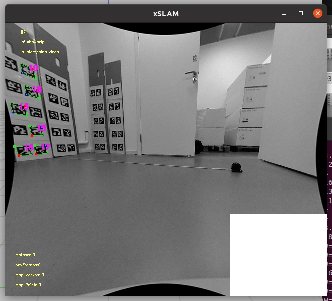

* 对角线1.5m处可以识别到大部分二维码，识别效果不好。

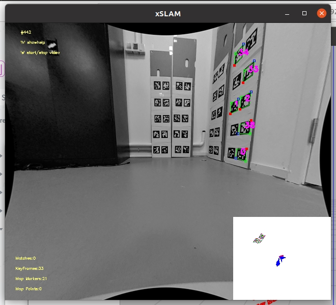

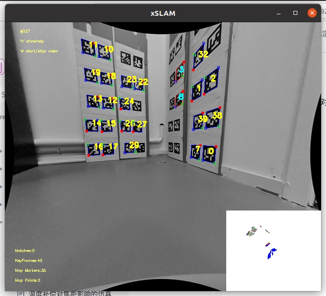

* 对角线1m处基本可以识别到所有无遮挡二维码，角点提取比较准确。

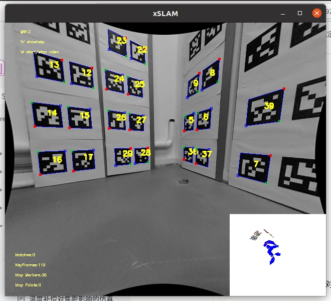

* 对角线0.5m处可以识别到所有无遮挡二维码，角点提取准确。

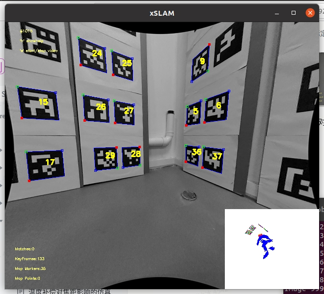

* 机器贴近二维码0.1m时，视野范围可以看到高0.4m，宽0.7m以内的二维码; 机器和二维码紧贴时，视野范围可以看到高0.3m，宽0.4m以内的二维码。

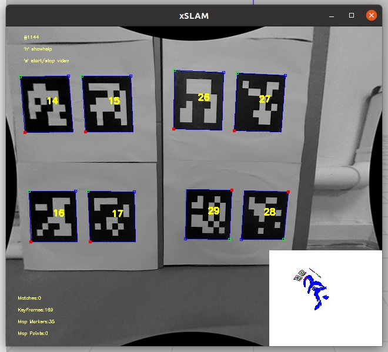

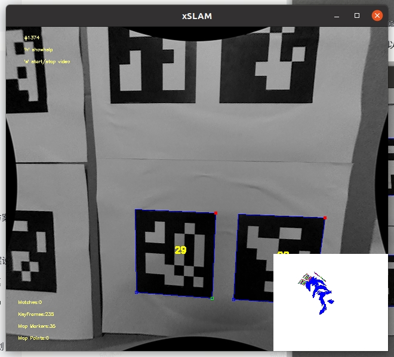

结论：如果使用0.1m\*0.1m的二维码，机器摄像头至少要在距离二维码对角线1.5m内接近1m处才能识别视野里所有二维码且提取准确角点。

**测试二：**&#x7528;0.15m\*0.15m的二维码在墙角贴高度1m的4行4列标定板，分别在对角线2m、1.5m、1m、0.5m附近和贴近二维码处做旋转动作，测试是否可以识别到二维码。

1. 对角线2m处可以识别特定视角的大部分二维码，但提取角点精度不高（二维码贴的不够平整也有影响）。

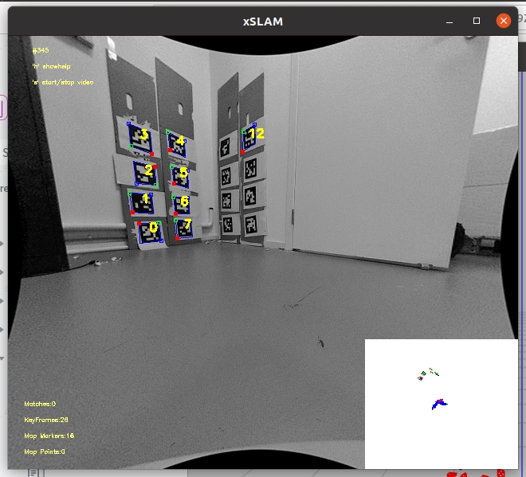

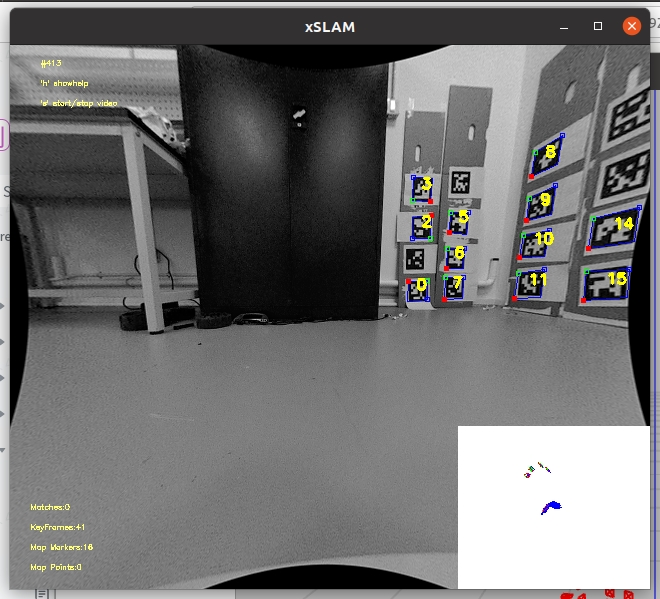

* 对角线1.5m处大部分视角可以识别到所有二维码，部分视角二维码识别效果不好。

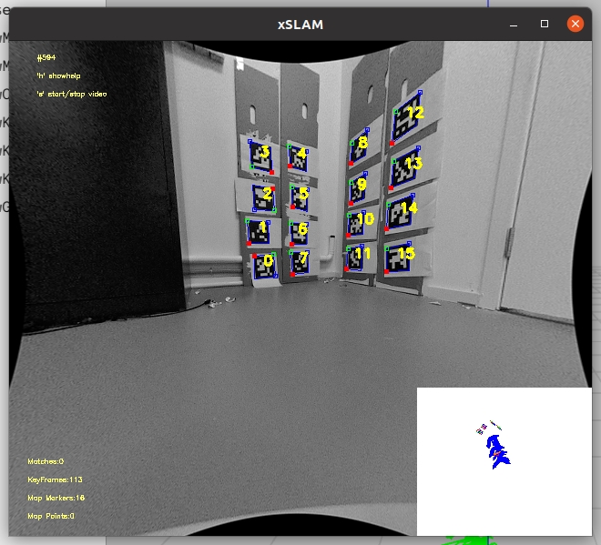

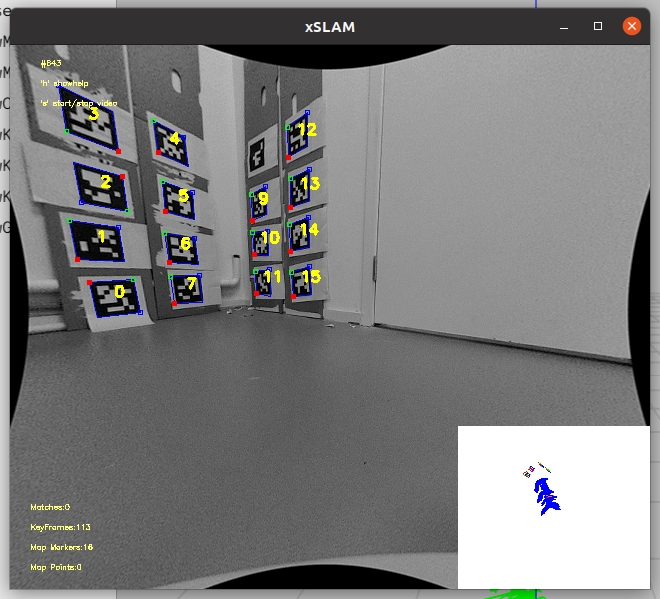

* 对角线1m处基本可以识别到所有二维码，部分视角二维码识别效果不好。

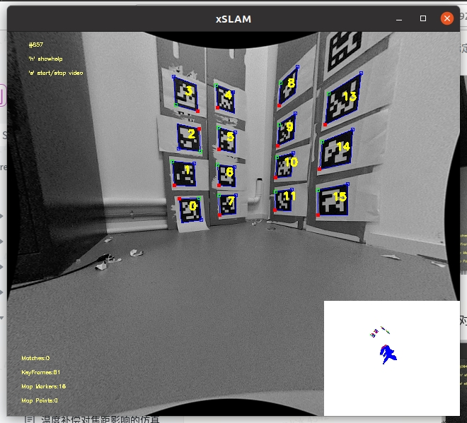

* 对角线0.5m处基本识别到所有无遮挡二维码，角点提取准确。

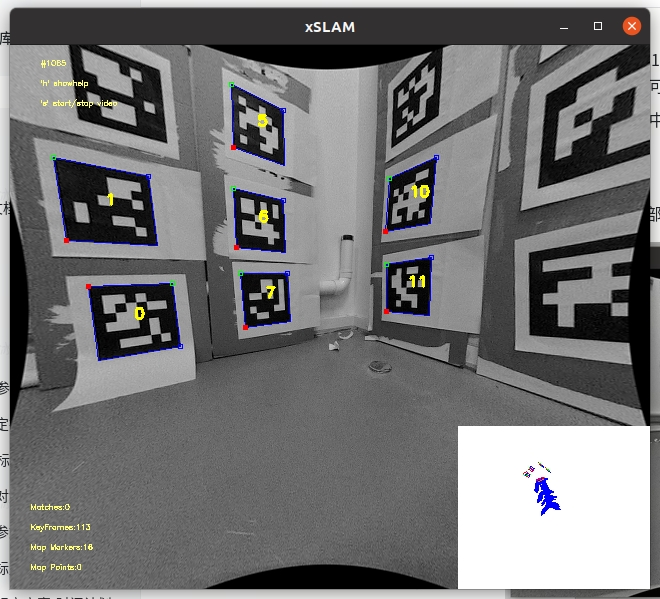

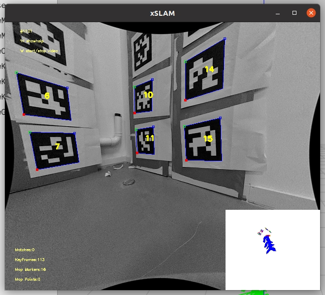

* 机器贴近二维码0.1m时，视野范围可以看到高0.4m，宽0.7m以内的二维码（15cm marker紧密排列约2行4列，共8个）; 机器和二维码紧贴时，视野范围可以看到高0.3m，宽0.4m以内的二维码（最多能看到2个15cm marker）。

结论：如果使用0.15m\*0.15m的二维码，机器摄像头在距离二维码对角线1.5m左右可识别视野里所有二维码且提取较准确角点。

