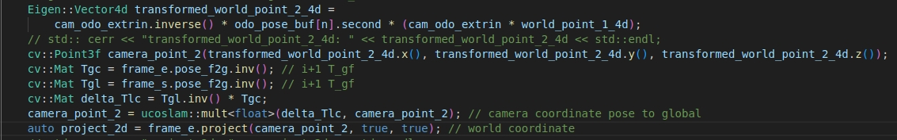
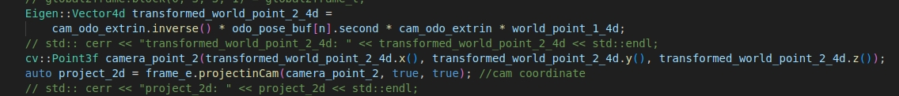

# 二驱标定算法检测重投影误差检测

目前实现了2个版本，基于源代码里面3d point-> 2d point 的投影：project函数具体如何使用做了调整：

~~一、原project函数是世界坐标系下的3d点投影到当前帧~~

第一帧观测到的世界坐标系下3d点（不变）投影到第2帧上的转换关系为：

Pw2 = Tlf.inverse \* Tcf \* （Tco \* Tdelta\_o \* （Toc\*Pw1））

Pw1：第一个世界坐标系下的点

Pw2：转换后的世界坐标系下的点

Tlf：上一帧图像的位姿

Tcf：当前帧图像的位姿

Tco：odo->cam外参

Tdelta\_o：odo运动量

每帧重投影标准差在0.3-7.5像素值波动，大部分在1个像素左右，图像的pose对重投影标准差影响较大。

**二、project函数改为相机坐标系下的3d点投影到当前帧（最终方案）**

第一帧观测到的相机坐标系下3d点（变动）投影到第2帧上的转换关系为：

Pc2 = Tco \* Tdelta\_o \* Toc \* Pc1

正常数据集：每帧重投影标准差在0.3-3.9像素值波动，大部分在1个像素左右，计算不涉及camera pose，方案一重投影误差大的那一帧用这个方案同样大。

轮子卡死数据集：每帧重投影标准差在2-9.5像素值波动，大部分在6个像素左右。

数据集测试

|            | Calib\_0057 | 侧边摄像头5号机/Test2                                                 | 侧边摄像头5号机/Test1                              | 侧边摄像头5号机/Test4                              | 侧边摄像头5号机/Test5                              | 0812/MK2-17-2/1/ | 0812/MK2-17-2/2/ | 7011004X153420012/Calib/ | 0909/noupload\_1/(打滑) | 0813/1\_S/ | 0813/2\_S/ | 0813/3\_U/ | 0813/4\_U/ | 0813/5\_L | 0813/6\_L/ |
| ---------- | ----------- | -------------------------------------------------------------- | ------------------------------------------- | ------------------------------------------- | ------------------------------------------- | ---------------- | ---------------- | ------------------------ | --------------------- | ---------- | ---------- | ---------- | ---------- | --------- | ---------- |
| 机器类型       | 二驱          | 四驱+侧目                                                          | 四驱+侧目                                       | 四驱+侧目                                       | 四驱+侧目                                       | 二驱               | 二驱               | 二驱                       | 二驱                    | 二驱         | 二驱         | 二驱         | 二驱         | 二驱        | 二驱         |
| 帧数         | 80          | Dual: 104Right: 61Left: 60                                     | Dual: 107Right: 65Left: 61                  | Dual: 105Right: 62Left: 61                  | Dual: 98Right: 64Left: 62                   | 93               | 98               | 94                       | 83                    | 24         | 41         | 22         | 21         | 15        | 15         |
| 重投影标准差最大值  | 3.86327     | Dual: 3.403888Right: 4.515097Left: 9.40428                     | Dual: 3.313557Right: 3.342403Left: 2.959816 | Dual: 3.713087Right: 2.852591Left: 3.413556 | Dual: 3.844433Right: 7.990210Left: 8.573770 | 2.96954          | 3.38555          | 2.31213                  | 25.8457               | 2.45783    | 3.27303    | 2.57814    | 4.88425    | 4.1856    | 3.27812    |
| 重投影标准差最小值  | 0.331367    | Dual: 0.315188Right: 0.593313Left: 0.467910                    | Dual: 0.409785Right: 0.388728Left: 0.256855 | Dual: 0.290766Right: 0.496814Left: 0.401690 | Dual: 0.298652Right: 0.455078Left: 0.425468 | 0.219381         | 0.243347         | 0.303058                 | 1.32259               | 0.396981   | 0.391833   | 0.355824   | 0.356948   | 0.412687  | 0.305334   |
| 数据集平均重投影误差 | 1.48226     | Dual: 1.503488Right: 1.541570Left: 3.411450                    | Dual: 1.647490Right: 1.513421Left: 1.393909 | Dual: 1.554088Right: 1.450536Left: 1.671573 | Dual: 1.540357Right: 1.749293Left: 3.229776 | 1.05777          | 1.12268          | 0.963261                 | 6.18065               | 1.30174    | 1.44294    | 1.08463    | 1.71726    | 1.70084   | 1.30469    |
| 数据集重投影标准差  | 0.754989    | Dual:0.672756Right:0.674422Left: 2.571897                      | Dual:0.761956Right:0.586988Left: 0.595847   | Dual:0.761878Right:0.598202Left: 0.704129   | Dual:0.715848Right:1.240653Left: 2.460851   | 0.528417         | 0.578812         | 0.439642                 | 4.27003               | 0.602446   | 0.703317   | 0.552325   | 1.10381    | 1.08925   | 0.787026   |
|            |             | 总结：目前只有1个打滑的数据，发现平均误差和标准差远大于正常数据，暂设平均误差和标准差阈值为2，超过提示轮子可能打滑或卡死。 |                                             |                                             |                                             |                  |                  |                          |                       |            |            |            |            |           |            |
|            |             |                                                                |                                             |                                             |                                             |                  |                  |                          |                       |            |            |            |            |           |            |

