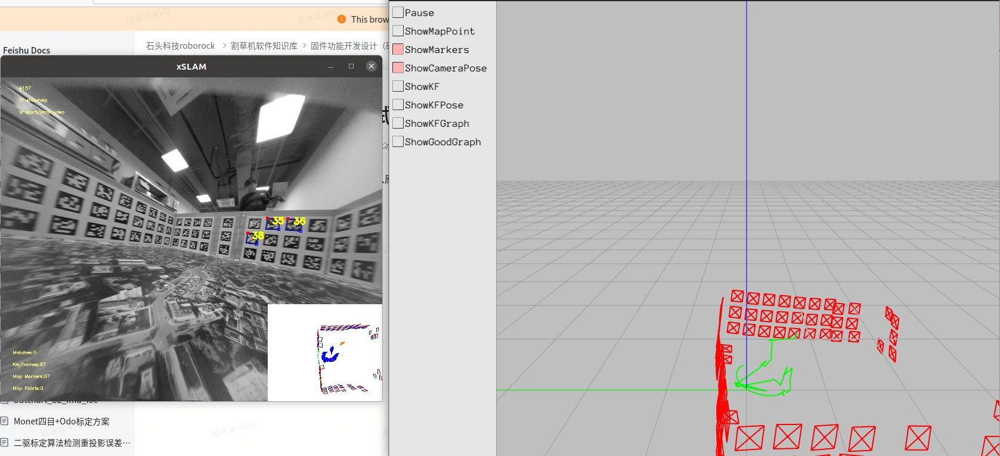
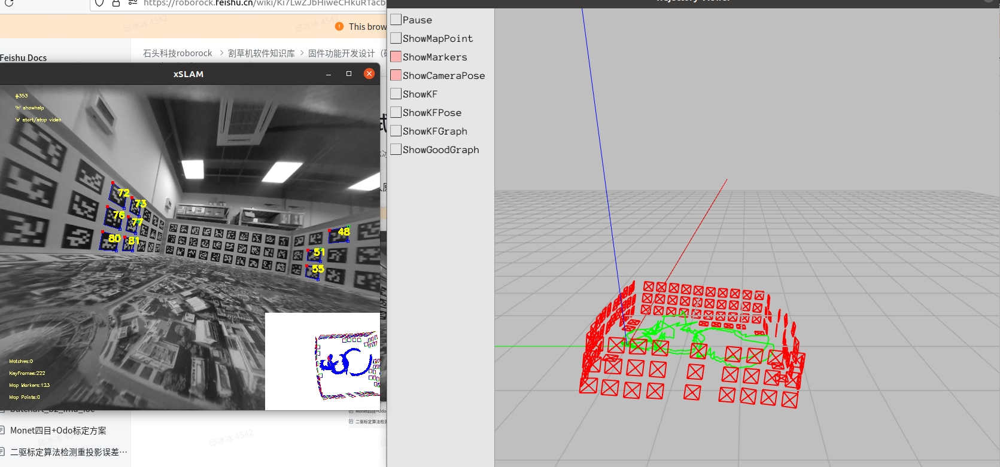
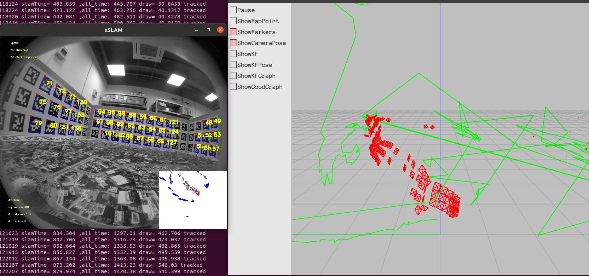
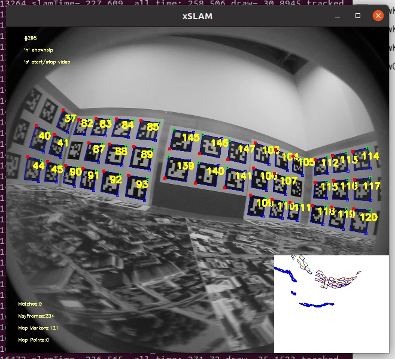
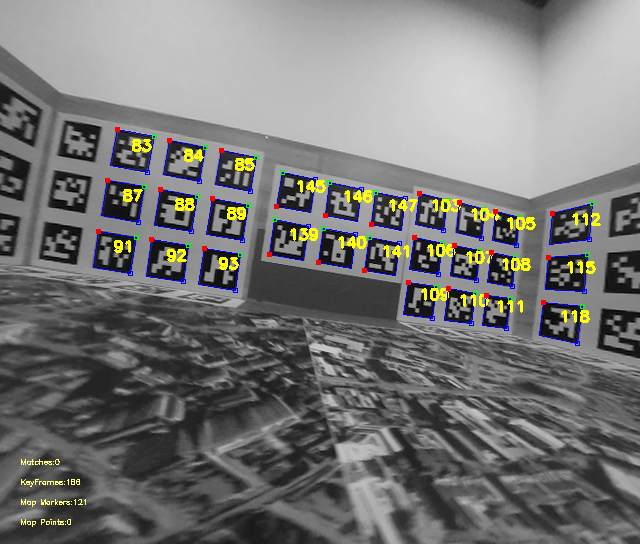
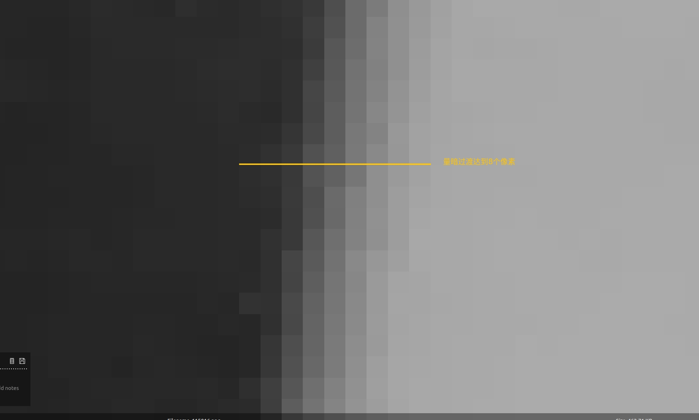
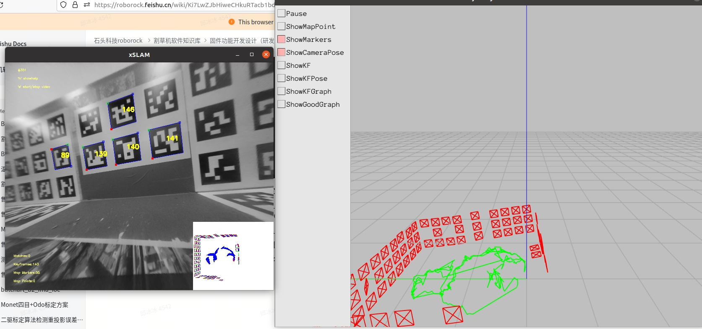

# 测试两侧加单目输入图像对标定结果的影响

1. 输入原640×544去畸变后的图像，slam效果：

标定结果：

&#x20;"result\_code": -1,

&#x20;"Monet Camera To Odom Calibration": 0.0,

&#x20;"Time\_offset\_oc": 0.035212980443351236,

&#x20;"CameraLeft\_yaw": 172.22116797810685,

&#x20;"CameraLeft\_pitch": -7.729844176325247,（有8度左右误差）

&#x20;"CameraLeft\_roll": -87.47931611668416,

&#x20;"CameraLeft\_x": 0.2399,

&#x20;"CameraLeft\_y": -0.1994,

&#x20;"CameraLeft\_z": 0.17989967389066286,

&#x20;"err\_roll": -79.47931611668416,

&#x20;"err\_pitch": -7.729844176325247,

&#x20;"err\_yaw": 172.22116797810685,

&#x20;"err\_x": 0.0,

&#x20;"err\_y": 0.0,

&#x20;"err\_z": -0.00020032610933715111,

* 输入原640×544图像（未去畸变），肉眼可见识别到的二维码数量增多。slam效果：

sidecam-calibration数据集侧左目117832帧：

* 输入去畸变图像后放大fov，肉眼可见识别到的二维码数量增多。slam效果：

* 重新标定内参后，去畸变和slam效果：

&#x20; distortion\_coeffs: \[-0.006820299518454961, 0.040369721702028905, -0.029334886741544365, 0.0052867060950015695]

&#x20; distortion\_model: equidistant

&#x20; intrinsics: \[238.6458060638796, 238.87251363417292, 318.56891715494123, 269.94870346328366]

&#x20; resolution: \[640, 544]

