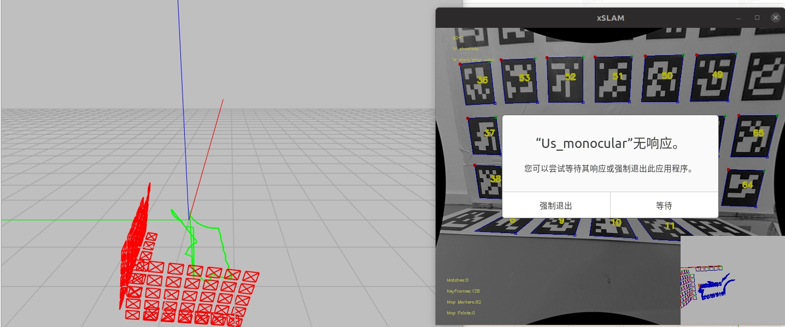

# 售后标定数据集测试

运动轨迹：[ 整机标定运动轨迹](https://roborock.feishu.cn/wiki/JzMCwMMqviJB9vksz2pcY4ncnWg)

| **测试路线** | **编号**                                       | **轨迹config**                                                             | **是否标定成功** | **左轮半径/m**           | **右轮半径/m**          | **轮轴距/m**           | **cam-odo-x/m** | **cam-odo-y/m** | **cam-odo-z/m** | **roll**                       | **pitch**                     | **yaw**                                                          | **时间同步/s**            | 轨迹图                                                                                 |
| -------- | -------------------------------------------- | ------------------------------------------------------------------------ | ---------- | -------------------- | ------------------- | ------------------- | --------------- | --------------- | --------------- | ------------------------------ | ----------------------------- | ---------------------------------------------------------------- | --------------------- | ----------------------------------------------------------------------------------- |
| S形       | 1                                            | max\_vel:0.2max\_ang:0.3c:0 1.745 0.0s:1.0c:1 50 0.1s:1.0c:0 10 0.1s:1.1 |            | 0.027947669929933666 | 0.02711645391092027 | 0.12851007888372507 | 0.4             | 0.0325          | 0.21            | -98.7451844216004              | -0.30953841440500196          | -89.71962025792024                                               | -0.009237359034488286 |  |
|          | 2                                            |                                                                          |            |                      |                     |                     |                 |                 |                 |                                |                               |                                                                  |                       |                                                                                     |
|          | 3                                            |                                                                          |            |                      |                     |                     |                 |                 |                 |                                |                               |                                                                  |                       |                                                                                     |
|          | 4                                            |                                                                          |            |                      |                     |                     |                 |                 |                 |                                |                               |                                                                  |                       |                                                                                     |
|          | 5                                            |                                                                          |            |                      |                     |                     |                 |                 |                 |                                |                               |                                                                  |                       |                                                                                     |
| 2        |                                              |                                                                          |            |                      |                     |                     |                 |                 |                 |                                |                               |                                                                  |                       |                                                                                     |
|          |                                              |                                                                          |            |                      |                     |                     |                 |                 |                 |                                |                               |                                                                  |                       |                                                                                     |
| 3        |                                              |                                                                          |            |                      |                     |                     |                 |                 |                 |                                |                               |                                                                  |                       |                                                                                     |
|          |                                              |                                                                          |            |                      |                     |                     |                 |                 |                 |                                |                               |                                                                  |                       |                                                                                     |
|          |                                              |                                                                          |            |                      |                     |                     |                 |                 |                 |                                |                               |                                                                  |                       |                                                                                     |
| 4        |                                              |                                                                          |            |                      |                     |                     |                 |                 |                 |                                |                               |                                                                  |                       |                                                                                     |
|          |                                              |                                                                          |            |                      |                     |                     |                 |                 |                 |                                |                               |                                                                  |                       |                                                                                     |
|          |                                              |                                                                          |            |                      |                     |                     |                 |                 |                 |                                |                               |                                                                  |                       |                                                                                     |
| 5        |                                              |                                                                          |            |                      |                     |                     |                 |                 |                 |                                |                               |                                                                  |                       |                                                                                     |
|          |                                              |                                                                          |            |                      |                     |                     |                 |                 |                 |                                |                               |                                                                  |                       |                                                                                     |
|          | 2025\_0813(取消时间延迟检测、固定左右轮半径和轮轴距)             | L形                                                                       | Y          | 0.120000             | 0.120000            | 0.361000            | 0.400000        | 0.032500        | -0.211404       | -1.724907  rad, -98.829898 deg | -0.001885  rad, -0.108003 deg | -1.551712  rad, -88.906530 deg(diff: −0.009204rad, −0.527326deg) | /                     |                                                                                     |
| 6        | 2025\_0813                                   | L形                                                                       | N          | 0.115912             | 0.115173            | 0.372216            | 0.400000        | 0.032500        | -0.208572       | -1.723485  rad, -98.748439 deg | -0.005047  rad, -0.289162 deg | -1.577123  rad, -90.362465 deg                                   | -0.055591             |                                                                                     |
|          | 2025\_0813(取消时间延迟检测、固定左右轮半径和轮轴距)             | L形                                                                       | N          | 0.115912             | 0.115173            | 0.372216            | 0.400000        | 0.032500        | -0.208572       | -1.723485  rad, -98.748439 deg | -0.005047  rad, -0.289162 deg | -1.577123  rad, -90.362465 deg(diff: 0rad, 0deg)                 | /                     |                                                                                     |
| 7        | 2025\_0815\_16\_18\_40                       | 伞形                                                                       | Y          | 0.113042             | 0.113468            | 0.367239            | 0.400000        | 0.032500        | -0.208940       | -1.722401  rad, -98.686291 deg | -0.003113  rad, -0.178340 deg | -1.570144  rad, -89.962596 deg                                   | -0.0193283            |                                                                                     |
|          | 2025\_0815\_16\_18\_40(取消时间延迟检测、固定左右轮半径和轮轴距) | 伞形                                                                       | Y          | 0.120000             | 0.120000            | 0.361000            | 0.400000        | 0.032500        | -0.208940       | -1.722401  rad, -98.686291 deg | -0.003113  rad, -0.178340 deg | -1.569328  rad, -89.915896 deg(diff: 0.000816rad, 0.0467deg)     | /                     |                                                                                     |
| 8        | 2025\_0815\_16\_20\_41                       | 伞形                                                                       | Y          | 0.120000             | 0.120000            | 0.361000            | 0.400000        | 0.032500        | -0.206823       | -1.721094  rad, -98.611451 deg | -0.001009  rad, -0.057796 deg | -1.557798  rad, -89.255240 deg                                   | -0.00610682           |                                                                                     |
|          | 2025\_0815\_16\_20\_41(取消时间延迟检测、固定左右轮半径和轮轴距) | 伞形                                                                       | Y          | 0.120000             | 0.120000            | 0.361000            | 0.400000        | 0.032500        | -0.206823       | -1.721094  rad, -98.611451 deg | -0.001009  rad, -0.057796 deg | -1.557796  rad, -89.255134 deg(diff: 0.000002rad, 0.000106deg)   | /                     |                                                                                     |
| 9        | 2025\_0815\_16\_22\_41                       | 伞形                                                                       | Y          | 0.108344             | 0.106189            | 0.342816            | 0.400000        | 0.032500        | -0.210618       | -1.722667  rad, -98.701530 deg | -0.004997  rad, -0.286321 deg | -1.557482  rad, -89.237135 deg                                   | -0.0171534            |                                                                                     |
|          | 2025\_0815\_16\_22\_41(取消时间延迟检测、固定左右轮半径和轮轴距) | 伞形                                                                       | Y          | 0.120000             | 0.120000            | 0.361000            | 0.400000        | 0.032500        | -0.210618       | -1.722667  rad, -98.701530 deg | -0.004997  rad, -0.286321 deg | -1.557176  rad, -89.219604 deg(diff: 0.000306rad, 0.017531deg)   | /                     |                                                                                     |
| 10       | 2025\_0815\_16\_24\_40                       | 伞形                                                                       | N          | 0.132242             | 0.129034            | 0.406029            | 0.400000        | 0.032500        | -0.209207       | -1.722948  rad, -98.717670 deg | -0.005551  rad, -0.318053 deg | -1.561012  rad, -89.439383 deg                                   | -0.0137616            |                                                                                     |
|          | 2025\_0815\_16\_24\_40(固定左右轮半径和轮轴距)          | 伞形                                                                       | Y          | 0.120000             | 0.120000            | 0.361000            | 0.400000        | 0.032500        | -0.209207       | -1.722948  rad, -98.717670 deg | -0.005551  rad, -0.318053 deg | -1.561795  rad, -89.484261 deg(diff: −0.000783rad, −0.044878deg) | -0.0137616            |                                                                                     |
|          | 2025\_0815\_16\_24\_40(取消时间延迟检测、固定左右轮半径和轮轴距) | 伞形                                                                       | Y          | 0.120000             | 0.120000            | 0.361000            | 0.400000        | 0.032500        | -0.209207       | -1.722948  rad, -98.717670 deg | -0.005551  rad, -0.318053 deg | -1.561787  rad, -89.483806 deg(diff: −0.000775rad, −0.044423deg) | /                     |                                                                                     |
| 11       | 2025\_0815\_16\_26\_42                       | 伞形                                                                       | Y          | 0.114630             | 0.116240            | 0.370848            | 0.400000        | 0.032500        | -0.209363       | -1.722052  rad, -98.666300 deg | -0.000888  rad, -0.050900 deg | -1.566156  rad, -89.734144 deg                                   | -0.026411             |                                                                                     |
|          | 2025\_0815\_16\_26\_42(取消时间延迟检测、固定左右轮半径和轮轴距) | 伞形                                                                       | Y          | 0.120000             | 0.120000            | 0.361000            | 0.400000        | 0.032500        | -0.209363       | -1.722052  rad, -98.666300 deg | -0.000888  rad, -0.050900 deg | -1.564198  rad, -89.621972 deg(diff: 0.001958rad, 0.112172deg)   | /                     |                                                                                     |
| 12       | 2025\_0815\_16\_33\_43                       | 工形                                                                       | N          | 0.125833             | 0.126200            | 0.399650            | 0.400000        | 0.032500        | -0.212146       | -1.724782  rad, -98.822741 deg | -0.001523  rad, -0.087238 deg | -1.564584  rad, -89.644075 deg                                   | -0.0200659            |                                                                                     |
|          | 2025\_0815\_16\_33\_43(固定左右轮半径和轮轴距)          | 工形                                                                       | Y          | 0.120000             | 0.120000            | 0.361000            | 0.400000        | 0.032500        | -0.212146       | -1.724782  rad, -98.822741 deg | -0.001523  rad, -0.087238 deg | -1.563881  rad, -89.603782 deg(diff: 0.000703rad, 0.040293deg)   | -0.0200659            |                                                                                     |
|          | 2025\_0815\_16\_33\_43(取消时间延迟检测、固定左右轮半径和轮轴距) | 工形                                                                       | Y          | 0.120000             | 0.120000            | 0.361000            | 0.400000        | 0.032500        | -0.212146       | -1.724782  rad, -98.822741 deg | -0.001523  rad, -0.087238 deg | -1.563884  rad, -89.603930 deg(diff: 0.0007rad, 0.040145deg)     | /                     |                                                                                     |
| 13       | 2025\_0815\_16\_36\_41                       | 工形                                                                       | Y          | 0.113734             | 0.111303            | 0.359593            | 0.400000        | 0.032500        | -0.212487       | -1.724363  rad, -98.798699 deg | -0.001929  rad, -0.110495 deg | -1.563939  rad, -89.607085 deg                                   | -0.0136609            |                                                                                     |
|          | 2025\_0815\_16\_36\_41(取消时间延迟检测、固定左右轮半径和轮轴距) | 工形                                                                       | Y          | 0.120000             | 0.120000            | 0.361000            | 0.400000        | 0.032500        | -0.212487       | -1.724363  rad, -98.798699 deg | -0.001929  rad, -0.110495 deg | -1.566405  rad, -89.748396 deg(diff: −0.002466rad, −0.141311deg) | /                     |                                                                                     |
| 14       | 2025\_0815\_16\_39\_43                       | 工形                                                                       | Y          | 0.119229             | 0.118558            | 0.372969            | 0.400000        | 0.032500        | -0.209765       | -1.724166  rad, -98.787460 deg | -0.005593  rad, -0.320468 deg | -1.558362  rad, -89.287587 deg                                   | -0.016068             |                                                                                     |
|          | 2025\_0815\_16\_39\_43(取消时间延迟检测、固定左右轮半径和轮轴距) | 工形                                                                       | Y          | 0.120000             | 0.120000            | 0.361000            | 0.400000        | 0.032500        | -0.209765       | -1.724166  rad, -98.787460 deg | -0.005593  rad, -0.320468 deg | -1.557923  rad, -89.262414 deg(diff: 0.000439rad, 0.025173deg)   | /                     |                                                                                     |
| 15       | 2025\_0815\_16\_42\_42                       | 工形                                                                       | N          | 0.119615             | 0.120384            | 0.385661            | 0.400000        | 0.032500        | -0.211106       | -1.725232  rad, -98.848486 deg | -0.003307  rad, -0.189489 deg | -1.568555  rad, -89.871558 deg                                   | -0.0199473            |                                                                                     |
|          | 2025\_0815\_16\_42\_42(固定左右轮半径和轮轴距)          | 工形                                                                       | Y          | 0.120000             | 0.120000            | 0.361000            | 0.400000        | 0.032500        | -0.211106       | -1.725232  rad, -98.848486 deg | -0.003307  rad, -0.189489 deg | -1.565538  rad, -89.698707 deg(diff: 0.003017rad, 0.172851deg)   | -0.0199473            |                                                                                     |
|          | 2025\_0815\_16\_42\_42(取消时间延迟检测、固定左右轮半径和轮轴距) | 工形                                                                       | Y          | 0.120000             | 0.120000            | 0.361000            | 0.400000        | 0.032500        | -0.211106       | -1.725232  rad, -98.848486 deg | -0.003307  rad, -0.189489 deg | -1.565536  rad, -89.698604 deg(diff: 0.003019rad, 0.172954deg)   | /                     |                                                                                     |
| 16       | 2025\_0815\_16\_45\_42                       | 工形                                                                       | Y          | 0.114153             | 0.112736            | 0.358987            | 0.400000        | 0.032500        | -0.209008       | -1.723481  rad, -98.748202 deg | -0.004365  rad, -0.250069 deg | -1.563578  rad, -89.586399 deg                                   | -0.0242536            |                                                                                     |
|          | 2025\_0815\_16\_45\_42(取消时间延迟检测、固定左右轮半径和轮轴距) | 工形                                                                       | Y          | 0.114153             | 0.112736            | 0.358987            | 0.400000        | 0.032500        | -0.209008       | -1.723481  rad, -98.748202 deg | -0.004365  rad, -0.250069 deg | -1.565263  rad, -89.682948 deg(diff: −0.001685rad, −0.096549deg) | /                     |                                                                                     |

| **测试路线**                                                              | **编号**                       | **轨迹config**                                                                                           | **是否标定成功** | **左轮半径/m** | **右轮半径/m** | **轮轴距/m** | **前视左目起始终止距离/m** | **pinhole-cam-odo-x/m** | **pinhole-cam-odo-y/m** | **pinhole-cam-odo-z/m** | **pinhole-roll** | **pinhole-pitch** | **pinhole-yaw** | **right-cam-odo-x/m** | **right-cam-odo-y/m** | **right-cam-odo-z/m** | **right-roll** | **right-pitch** | **right-yaw** | **left-cam-odo-x/m** | **left-cam-odo-y/m** | **left-cam-odo-z/m** | **left-roll** | **left-pitch** | **left-yaw** |
| --------------------------------------------------------------------- | ---------------------------- | ------------------------------------------------------------------------------------------------------ | ---------- | ---------- | ---------- | --------- | ---------------- | ----------------------- | ----------------------- | ----------------------- | ---------------- | ----------------- | --------------- | --------------------- | --------------------- | --------------------- | -------------- | --------------- | ------------- | -------------------- | -------------------- | -------------------- | ------------- | -------------- | ------------ |
| 工形（monet-1）                                                           | 1                            | max\_vel:0.2max\_ang:0.3c:1 3.1414 0.0c:0 -2.3561 0.0s:1.2c:0 -1.5707 0.0c:1 3.1414 0.0c:0 -3.1414 0.0 |            | 0.0951595  | 0.0959195  | 0.38228   | 0.943409         | 0.5                     | 0.0325                  | -0.203556               | -98.71           | 0.220589          | -89.1509        | 0.2399                | -0.1994               |                       | -99.1371       | 4.17918         | 132.015       | 0.2399               | 0.1994               |                      | -99.692       | 9.9941         | 3.11711      |
|                                                                       | 保留最下面两行+地面marker             |                                                                                                        |            | 0.0967352  | 0.0942473  | 0.38103   | 0.942972         | 0.5                     | 0.0325                  | -0.203216               | -98.6683         | 0.140328          | -89.0292        |                       |                       |                       |                |                 |               |                      |                      |                      |               |                |              |
|                                                                       | 固定轮轴距、左右轮半径，保留最下面两行+地面marker |                                                                                                        |            | 0.1        | 0.1        | 0.38      | 0.942972         | 0.5                     | 0.0325                  | -0.207401               | -98.8718         | 0.0580497         | -88.9154        |                       |                       |                       |                |                 |               |                      |                      |                      |               |                |              |
|                                                                       | 左右各去两列marker                 |                                                                                                        |            | 0.1        | 0.1        | 0.38      | 1.14639          | 0.5                     | 0.0325                  | -0.197467               | -98.3749         | -0.00466139       | -89.1082        |                       |                       |                       |                |                 |               |                      |                      |                      |               |                |              |
|                                                                       | 左右各去四列marker                 |                                                                                                        |            | 0.1        | 0.1        | 0.38      | 1.1495           | 0.5                     | 0.0325                  | -0.198157               | -98.4175         | -0.196095         | -88.9298        |                       |                       |                       |                |                 |               |                      |                      |                      |               |                |              |
|                                                                       | 2                            |                                                                                                        |            | 0.0925422  | 0.0917629  | 0.363862  | 0.919289         | 0.5                     | 0.0325                  | -0.208716               | -98.9612         | 0.203178          | -89.4129        |                       |                       |                       |                |                 |               |                      |                      |                      |               |                |              |
|                                                                       | 保留最下面两行+地面marker             |                                                                                                        |            | 0.0949069  | 0.0932183  | 0.371636  | 0.92213          | 0.5                     | 0.0325                  | -0.210046               | -99.0204         | 0.0671268         | -89.3396        |                       |                       |                       |                |                 |               |                      |                      |                      |               |                |              |
|                                                                       | 固定轮轴距、左右轮半径，保留最下面两行+地面marker |                                                                                                        |            | 0.1        | 0.1        | 0.38      | 0.92213          | 0.5                     | 0.0325                  | -0.209171               | -98.9917         | 0.35802           | -89.4126        |                       |                       |                       |                |                 |               |                      |                      |                      |               |                |              |
|                                                                       | 左右各去两列marker                 |                                                                                                        |            | 0.1        | 0.1        | 0.38      | 1.1439           | 0.5                     | 0.0325                  | -0.2034                 | -98.591          | 0.187892          | -88.8955        |                       |                       |                       |                |                 |               |                      |                      |                      |               |                |              |
|                                                                       | 左右各去四列marker                 |                                                                                                        |            | 0.1        | 0.1        | 0.38      | 1.15358          | 0.5                     | 0.0325                  | -0.203189               | -98.5812         | 0.785475          | -89.1727        |                       |                       |                       |                |                 |               |                      |                      |                      |               |                |              |
|                                                                       | 3                            |                                                                                                        |            | 0.0960958  | 0.0916869  | 0.375124  | 0.909915         | 0.5                     | 0.0325                  | -0.210437               | -98.9559         | -0.0259339        | -88.944         |                       |                       |                       |                |                 |               |                      |                      |                      |               |                |              |
|                                                                       | 保留最下面两行+地面marker             |                                                                                                        |            | 0.0761983  | 0.0688799  | 0.286836  | 0.910514         | 0.5                     | 0.0325                  | -0.209817               | -98.9552         | 0.273156          | -87.8262        |                       |                       |                       |                |                 |               |                      |                      |                      |               |                |              |
|                                                                       | 固定轮轴距、左右轮半径，保留最下面两行+地面marker |                                                                                                        |            | 0.1        | 0.1        | 0.38      | 0.910514         | 0.5                     | 0.0325                  | -0.208732               | -98.8792         | 0.163265          | -89.1363        |                       |                       |                       |                |                 |               |                      |                      |                      |               |                |              |
|                                                                       | 左右各去两列marker                 |                                                                                                        |            | 0.1        | 0.1        | 0.38      | 1.14926          | 0.5                     | 0.0325                  | -0.204562               | -98.5885         | -0.027176         | -89.2017        |                       |                       |                       |                |                 |               |                      |                      |                      |               |                |              |
|                                                                       | 左右各去四列marker                 |                                                                                                        |            | 0.1        | 0.1        | 0.38      | 1.14971          | 0.5                     | 0.0325                  | -0.207785               | -98.7112         | -0.365855         | -89.2216        |                       |                       |                       |                |                 |               |                      |                      |                      |               |                |              |
|                                                                       | 4                            |                                                                                                        |            | 0.0945645  | 0.0935502  | 0.373711  | 0.976626         | 0.5                     | 0.0325                  | -0.208225               | -98.9647         | 0.0629361         | -89.3756        |                       |                       |                       |                |                 |               |                      |                      |                      |               |                |              |
|                                                                       | 保留最下面两行+地面marker             |                                                                                                        |            | 0.0934867  | 0.0923832  | 0.370831  | 0.975255         | 0.5                     | 0.0325                  | -0.205739               | -98.8299         | 0.120429          | -89.452         |                       |                       |                       |                |                 |               |                      |                      |                      |               |                |              |
|                                                                       | 固定轮轴距、左右轮半径，保留最下面两行+地面marker |                                                                                                        |            | 0.1        | 0.1        | 0.38      | 0.975255         | 0.5                     | 0.0325                  | -0.204797               | -98.774          | 0.0975291         | -89.3885        |                       |                       |                       |                |                 |               |                      |                      |                      |               |                |              |
|                                                                       | 左右各去两列marker                 |                                                                                                        |            | 0.1        | 0.1        | 0.38      | 1.14923          | 0.5                     | 0.0325                  | -0.203579               | -98.6844         | 0.157931          | -89.3295        |                       |                       |                       |                |                 |               |                      |                      |                      |               |                |              |
|                                                                       | 左右各去四列marker                 |                                                                                                        |            | 0.1        | 0.1        | 0.38      | 1.15295          | 0.5                     | 0.0325                  | -0.205623               | -98.7421         | -0.100915         | -89.2674        |                       |                       |                       |                |                 |               |                      |                      |                      |               |                |              |
|                                                                       | 5                            |                                                                                                        |            | 0.0957417  | 0.0934625  | 0.375938  | 0.928485         | 0.5                     | 0.0325                  | -0.208587               | -98.9354         | 0.0984734         | -89.338         |                       |                       |                       |                |                 |               |                      |                      |                      |               |                |              |
|                                                                       | 保留最下面两行+地面marker             |                                                                                                        |            | 0.0938635  | 0.0770638  | 0.338414  | 0.927607         | 0.5                     | 0.0325                  | -0.211233               | -99.0978         | 0.183336          | -87.3143        |                       |                       |                       |                |                 |               |                      |                      |                      |               |                |              |
|                                                                       | 固定轮轴距、左右轮半径，保留最下面两行+地面marker |                                                                                                        |            | 0.1        | 0.1        | 0.38      | 0.927607         | 0.5                     | 0.0325                  | -0.20722                | -98.8821         | 0.275968          | -88.904         |                       |                       |                       |                |                 |               |                      |                      |                      |               |                |              |
|                                                                       | 左右各去两列marker                 |                                                                                                        |            | 0.1        | 0.1        | 0.38      | 1.15939          | 0.5                     | 0.0325                  | -0.203733               | -98.6027         | 0.588135          | -89.3359        |                       |                       |                       |                |                 |               |                      |                      |                      |               |                |              |
|                                                                       | 左右各去四列marker                 |                                                                                                        |            | 0.1        | 0.1        | 0.38      | 1.16333          | 0.5                     | 0.0325                  | -0.204568               | -98.6234         | 0.365039          | -88.2561        |                       |                       |                       |                |                 |               |                      |                      |                      |               |                |              |
| 工形（monet-2）                                                           | 1                            |                                                                                                        |            | 0.1        | 0.1        | 0.38      | 1.00195          | 0.5                     | 0.0325                  | -0.211178               | -99.8389         | 0.338179          | -89.9085        | 0.2399                | -0.1994               | 0.1801                | -89.3207       | -7.32648        | -179.891      | 0.2399               | 0.1994               | 0.1801               | -89.3804      | 8.03568        | 0.100084     |
|                                                                       | 2                            |                                                                                                        |            | 0.1        | 0.1        | 0.38      | 0.922296         | 0.5                     | 0.0325                  | -0.20793                | -99.5025         | 0.439859          | -89.7475        | 0.2399                | -0.1994               | 0.1801                | -89.7344       | -7.36079        | -179.301      | 0.2399               | 0.1994               | 0.1801               | -89.0397      | 8.12696        | 0.606595     |
|                                                                       | 3                            |                                                                                                        |            | 0.1        | 0.1        | 0.38      | 0.919047         | 0.5                     | 0.0325                  | -0.212445               | -99.922          | 0.480935          | -89.7125        | 0.2399                | -0.1994               | 0.1801                | -89.3004       | -7.48393        | -179.4        | 0.2399               | 0.1994               | 0.1801               | -89.3312      | 7.91709        | 1.06427      |
|                                                                       | 4                            |                                                                                                        |            | 0.1        | 0.1        | 0.38      | 1.22824          | 0.5                     | 0.0325                  | -0.204018               | -99.4591         | 0.441738          | -89.7997        | 0.2399                | -0.1994               | 0.1801                | -89.6972       | -7.42998        | -179.911      | 0.2399               | 0.1994               | 0.1801               | -89.1318      | 8.35364        | 0.633498     |
|                                                                       | 5                            |                                                                                                        |            | 0.1        | 0.1        | 0.38      | 0.960445         | 0.5                     | 0.0325                  | -0.20637                | -99.5065         | 0.593616          | -89.6318        | 0.2399                | -0.1994               | 0.1801                | -89.5844       | -7.5396         | -178.588      | 0.2399               | 0.1994               | 0.1801               | -88.8695      | 7.76824        | 0.392614     |
| 工形（monet-3）                                                           | 1                            |                                                                                                        |            | 0.1        | 0.1        | 0.38      | 0.937663         | 0.5                     | 0.0325                  | -0.2074                 | -99.1862         | 0.184663          | -89.7395        | 0.2399                | -0.1994               | 0.1801                | -90.0069       | -8.36183        | 179.723       | 0.2399               | 0.1994               | 0.1801               | -89.1875      | 8.34105        | 0.0966592    |
|                                                                       | 2                            |                                                                                                        |            | 0.1        | 0.1        | 0.38      | 0.951884         | 0.5                     | 0.0325                  | -0.206217               | -99.0859         | 0.10285           | -89.6399        | 0.2399                | -0.1994               | 0.1801                | -90.4334       | -7.74433        | 179.792       | 0.2399               | 0.1994               | 0.1801               | -89.5063      | 8.12349        | 0.17243      |
|                                                                       | 3                            |                                                                                                        |            | 0.1        | 0.1        | 0.38      | 0.927342         | 0.5                     | 0.0325                  | -0.205623               | -99.0564         | 0.342859          | -89.792         | 0.2399                | -0.1994               | 0.1801                | -90.3611       | -8.11839        | 178.604       | 0.2399               | 0.1994               | 0.1801               | -90.0223      | 8.13866        | 1.19609      |
|                                                                       | 4                            |                                                                                                        |            | 0.1        | 0.1        | 0.38      | 0.935346         | 0.5                     | 0.0325                  | -0.202389               | -98.9986         | 0.132772          | -89.6409        | 0.2399                | -0.1994               | 0.1801                | -90.0239       | -8.3849         | 179.549       | 0.2399               | 0.1994               | 0.1801               | -89.8736      | 7.86318        | 0.780902     |
|                                                                       | 5                            |                                                                                                        |            | 0.1        | 0.1        | 0.38      | 0.86496          | 0.5                     | 0.0325                  | -0.207574               | -99.187          | 0.223572          | -89.726         | 0.2399                | -0.1994               | 0.1801                | -90.4331       | -8.14279        | 177.839       | 0.2399               | 0.1994               | 0.1801               | -89.8902      | 7.91168        | 0.660023     |
| 工形（monet-4）                                                           | 1                            |                                                                                                        |            | 0.1        | 0.1        | 0.38      | 0.90784          | 0.5                     | 0.0325                  | -0.210367               | -98.9208         | 0.302107          | -89.246         | 0.2399                | -0.1994               | 0.1801                | -90.2242       | -6.8374         | 179.767       | 0.2399               | 0.1994               | 0.1801               | -89.8807      | 8.59163        | 1.16372      |
|                                                                       | 2                            |                                                                                                        |            | 0.1        | 0.1        | 0.38      | 0.92213          | 0.5                     | 0.0325                  | -0.207236               | -98.7293         | 0.479553          | -89.5897        | 0.2399                | -0.1994               | 0.1801                | -89.8749       | -6.86659        | -179.698      | 0.2399               | 0.1994               | 0.1801               | -89.6589      | 8.42589        | 0.847469     |
|                                                                       | 3                            |                                                                                                        |            | 0.1        | 0.1        | 0.38      | 0.941941         | 0.5                     | 0.0325                  | -0.207741               | -98.9026         | 0.239311          | -89.369         | 0.2399                | -0.1994               | 0.1801                | -89.7506       | -6.80781        | -178.807      | 0.2399               | 0.1994               | 0.1801               | -89.0521      | 8.80068        | 0.220974     |
|                                                                       | 4                            |                                                                                                        |            | 0.1        | 0.1        | 0.38      | 0.939056         | 0.5                     | 0.0325                  | -0.213098               | -99.099          | 0.23409           | -89.2368        | 0.2399                | -0.1994               | 0.1801                | -90.1801       | -7.12332        | -179.382      | 0.2399               | 0.1994               | 0.1801               | -89.8398      | 8.57518        | 0.958483     |
|                                                                       | 5                            |                                                                                                        |            | 0.1        | 0.1        | 0.38      | 1.01502          | 0.5                     | 0.0325                  | -0.203853               | -98.6938         | 0.471702          | -89.2983        | 0.2399                | -0.1994               | 0.1801                | -90.0622       | -7.12962        | -178.414      | 0.2399               | 0.1994               | 0.1801               | -89.6608      | 8.62748        | 1.18443      |
| 工形（monet-5）                                                           | 1                            |                                                                                                        |            | 0.1        | 0.1        | 0.38      | 0.923095         | 0.5                     | 0.0325                  | -0.204466               | -98.5808         | 0.13552           | -89.7238        | 0.2399                | -0.1994               | 0.1801                | -90.6136       | -6.71908        | 179.318       | 0.2399               | 0.1994               | 0.1801               | -89.4976      | 7.59441        | 0.47129      |
|                                                                       | 2                            |                                                                                                        |            | 0.1        | 0.1        | 0.38      | 0.878868         | 0.5                     | 0.0325                  | -0.204538               | -98.6645         | 0.315663          | -89.7254        | 0.2399                | -0.1994               | 0.1801                | -90.2874       | -6.76396        | -179.925      | 0.2399               | 0.1994               | 0.1801               | -89.8508      | 7.66707        | 1.01649      |
|                                                                       | 3                            |                                                                                                        |            | 0.1        | 0.1        | 0.38      | 1.22865          | 0.5                     | 0.0325                  | -0.205739               | -98.8218         | 0.331474          | -89.6262        | 0.2399                | -0.1994               | 0.1801                | -89.8447       | -6.76617        | -178.467      | 0.2399               | 0.1994               | 0.1801               | -89.3456      | 8.09609        | 0.694983     |
|                                                                       | 4                            |                                                                                                        |            | 0.1        | 0.1        | 0.38      | 0.917432         | 0.5                     | 0.0325                  | -0.20717                | -98.8041         | -0.146226         | -90.0848        | 0.2399                | -0.1994               | 0.1801                | -90.306        | -6.68077        | -179.435      | 0.2399               | 0.1994               | 0.1801               | -89.8379      | 7.54302        | 2.25079      |
|                                                                       | 5                            |                                                                                                        |            | 0.1        | 0.1        | 0.38      | 0.891872         | 0.5                     | 0.0325                  | -0.207413               | -98.8819         | 0.339891          | -89.808         | 0.2399                | -0.1994               | 0.1801                | -90.352        | -6.70619        | 179.025       | 0.2399               | 0.1994               | 0.1801               | -89.2501      | 7.65188        | 0.310048     |
| 工形（monet-6）                                                           | 1                            |                                                                                                        |            | 0.1        | 0.1        | 0.38      | 0.921341         | 0.5                     | 0.0325                  | -0.20726                | -98.9027         | -0.0739298        | -89.6595        | 0.2399                | -0.1994               | 0.1801                | -89.969        | -6.83259        | 179.509       | 0.2399               | 0.1994               | 0.1801               | -89.6066      | 7.9344         | 0.709858     |
|                                                                       | 2                            |                                                                                                        |            | 0.1        | 0.1        | 0.38      | 0.878166         | 0.5                     | 0.0325                  | -0.206585               | -98.869          | -0.0347737        | -89.265         | 0.2399                | -0.1994               | 0.1801                | -89.7895       | -6.89393        | -179.969      | 0.2399               | 0.1994               | 0.1801               | -90.0209      | 7.97821        | 0.625816     |
|                                                                       | 3                            |                                                                                                        |            | 0.1        | 0.1        | 0.38      | 0.898688         | 0.5                     | 0.0325                  | -0.203818               | -98.6711         | -0.0433608        | -89.6656        | 0.2399                | -0.1994               | 0.1801                | -89.8963       | -6.83006        | 179.214       | 0.2399               | 0.1994               | 0.1801               | -89.7256      | 7.54092        | 0.493069     |
|                                                                       | 4                            |                                                                                                        |            | 0.1        | 0.1        | 0.38      | 0.940071         | 0.5                     | 0.0325                  | -0.210367               | -99.0058         | 0.136029          | -89.5861        | 0.2399                | -0.1994               | 0.1801                | -89.7574       | -6.9706         | 179.825       | 0.2399               | 0.1994               | 0.1801               | -89.1752      | 7.50031        | 0.0482968    |
|                                                                       | 5                            |                                                                                                        |            | 0.1        | 0.1        | 0.38      | 0.943095         | 0.5                     | 0.0325                  | -0.200271               | -98.3598         | -0.114553         | -89.5533        | 0.2399                | -0.1994               | 0.1801                | -89.8461       | -6.89283        | 179.345       | 0.2399               | 0.1994               | 0.1801               | -89.7274      | 7.76819        | 0.660716     |
| ~~伞形~~（即使增加了旋转，边缘部分还是有一些marker没有识别到，路线太短，导致各数据尤其是yaw角误差大且不稳定，因此排除此方案） | 1                            | max\_vel:0.2max\_ang:0.3s:1.2c:1 3.1414 0.0c:0 -6.2828 0.0c:1 6.2828 0.0                               | -1         | 0.0567161  | 0.0312625  | 0.17228   |                  | 0.5                     | 0.0325                  | -0.208761               | -98.8512         | 0.161149          | -85.91          |                       |                       |                       |                |                 |               |                      |                      |                      |               |                |              |
|                                                                       | 2                            |                                                                                                        | -1         | 0.0807634  | 0.0505622  | 0.258402  |                  | 0.5                     | 0.0325                  | -0.211629               | -98.8863         | -0.0714038        | -85.5144        |                       |                       |                       |                |                 |               |                      |                      |                      |               |                |              |
|                                                                       | 3                            |                                                                                                        | -1         | 0.0379548  | 0.0234938  | 0.119009  |                  | 0.5                     | 0.0325                  | -0.211335               | -98.8999         | -0.0201172        | -87.1029        |                       |                       |                       |                |                 |               |                      |                      |                      |               |                |              |
|                                                                       | 4                            |                                                                                                        | -1         | 0.0484753  | 0.0326573  | 0.155525  |                  | 0.5                     | 0.0325                  | -0.210984               | -98.8476         | -0.00674175       | -86.798         |                       |                       |                       |                |                 |               |                      |                      |                      |               |                |              |
|                                                                       | 5                            |                                                                                                        | -1         | 0.0489542  | 0.0249031  | 0.1421    |                  | 0.5                     | 0.0325                  | -0.214149               | -99.1327         | 0.198456          | -85.8083        |                       |                       |                       |                |                 |               |                      |                      |                      |               |                |              |
| S形（目前机器旋转半径最小是0.35，如果需要比较小的旋转半径，每次都需要导航适配）                            | 1                            | max\_vel:0.2max\_ang:0.3c:0 1.745 0.0s:1.0c:1 50 0.1s:1.0c:0 10 0.1s:1.0                               |            | 0.0944785  | 0.0936257  | 0.382932  | 1.14367          | 0.5                     | 0.0325                  | -0.208861               | -98.9261         | 0.339626          | -89.1651        |                       |                       |                       |                |                 |               |                      |                      |                      |               |                |              |
|                                                                       | 保留最下面两行+地面marker             |                                                                                                        |            | 0.0950802  | 0.0936865  | 0.382407  | 1.1396           | 0.5                     | 0.0325                  | -0.20938                | -98.916          | 0.317007          | -89.0914        |                       |                       |                       |                |                 |               |                      |                      |                      |               |                |              |
|                                                                       | 左右各去两列marker                 |                                                                                                        |            | 0.0965256  | 0.0951259  | 0.392761  | 1.02488          | 0.5                     | 0.0325                  | -0.212818               | -99.1427         | 0.460005          | -89.4113        |                       |                       |                       |                |                 |               |                      |                      |                      |               |                |              |
|                                                                       | 左右各去四列marker                 |                                                                                                        |            | 0.100159   | 0.101163   | 0.411333  | 0.784523         | 0.5                     | 0.0325                  | -0.208887               | -98.9022         | 0.25257           | -89.3793        |                       |                       |                       |                |                 |               |                      |                      |                      |               |                |              |
|                                                                       | 2                            |                                                                                                        |            | 0.0947115  | 0.0938752  | 0.388461  | 1.25083          | 0.5                     | 0.0325                  | -0.210958               | -98.9792         | 0.304694          | -89.0866        |                       |                       |                       |                |                 |               |                      |                      |                      |               |                |              |
|                                                                       | 保留最下面两行+地面marker             |                                                                                                        |            | 0.0946335  | 0.0935097  | 0.388926  | 1.24908          | 0.5                     | 0.0325                  | -0.210883               | -99.0382         | 0.407574          | -89.0757        |                       |                       |                       |                |                 |               |                      |                      |                      |               |                |              |
|                                                                       | 左右各去两列marker                 |                                                                                                        |            | 0.0969711  | 0.0961261  | 0.398549  | 1.11694          | 0.5                     | 0.0325                  | -0.21059                | -98.9572         | 0.500317          | -89.1751        |                       |                       |                       |                |                 |               |                      |                      |                      |               |                |              |
|                                                                       | 左右各去四列marker                 |                                                                                                        |            | 0.0961724  | 0.0961196  | 0.39472   | 0.880455         | 0.5                     | 0.0325                  | -0.208544               | -98.7218         | 0.216734          | -89.2163        |                       |                       |                       |                |                 |               |                      |                      |                      |               |                |              |
|                                                                       | 3                            |                                                                                                        |            | 0.0965497  | 0.0939797  | 0.388658  | 1.15882          | 0.5                     | 0.0325                  | -0.211678               | -98.8704         | 0.0311386         | -89.0174        |                       |                       |                       |                |                 |               |                      |                      |                      |               |                |              |
|                                                                       | 保留最下面两行+地面marker             |                                                                                                        |            | 0.096365   | 0.0939488  | 0.389709  | 1.15688          | 0.5                     | 0.0325                  | -0.210403               | -98.8276         | 0.0943408         | -89.0588        |                       |                       |                       |                |                 |               |                      |                      |                      |               |                |              |
|                                                                       | 左右各去两列marker                 |                                                                                                        |            | 0.0979676  | 0.0950726  | 0.389378  | 1.07682          | 0.5                     | 0.0325                  | -0.209211               | -98.7468         | 0.229292          | -88.9676        |                       |                       |                       |                |                 |               |                      |                      |                      |               |                |              |
|                                                                       | 左右各去四列marker                 |                                                                                                        |            | 0.0923585  | 0.0941172  | 0.37756   | 0.880733         | 0.5                     | 0.0325                  | -0.211363               | -98.9563         | 0.373748          | -88.8463        |                       |                       |                       |                |                 |               |                      |                      |                      |               |                |              |
|                                                                       | 4                            |                                                                                                        |            | 0.0960022  | 0.0938774  | 0.387031  | 1.13891          | 0.5                     | 0.0325                  | -0.207751               | -98.73           | 0.125161          | -89.2137        |                       |                       |                       |                |                 |               |                      |                      |                      |               |                |              |
|                                                                       | 保留最下面两行+地面marker             |                                                                                                        |            | 0.096825   | 0.0949366  | 0.394201  | 1.13725          | 0.5                     | 0.0325                  | -0.205923               | -98.7272         | 0.417109          | -89.3375        |                       |                       |                       |                |                 |               |                      |                      |                      |               |                |              |
|                                                                       | 左右各去两列marker                 |                                                                                                        |            | 0.0965994  | 0.094512   | 0.391108  | 1.01938          | 0.5                     | 0.0325                  | -0.203448               | -98.5103         | 0.226426          | -89.6032        |                       |                       |                       |                |                 |               |                      |                      |                      |               |                |              |
|                                                                       | 左右各去四列marker                 |                                                                                                        |            | 0.0976243  | 0.0954771  | 0.395329  | 0.82354          | 0.5                     | 0.0325                  | -0.20288                | -98.4822         | 0.200593          | -89.4576        |                       |                       |                       |                |                 |               |                      |                      |                      |               |                |              |
|                                                                       | 5                            |                                                                                                        |            | 0.095773   | 0.0935945  | 0.383713  | 1.17289          | 0.5                     | 0.0325                  | -0.215954               | -99.0485         | -0.201825         | -89.4285        |                       |                       |                       |                |                 |               |                      |                      |                      |               |                |              |
|                                                                       | 保留最下面两行+地面marker             |                                                                                                        |            | 0.0962477  | 0.0934712  | 0.383445  | 1.1716           | 0.5                     | 0.0325                  | -0.213474               | -98.8749         | -0.209482         | -89.3293        |                       |                       |                       |                |                 |               |                      |                      |                      |               |                |              |
|                                                                       | 左右各去两列marker                 |                                                                                                        |            | 0.0956324  | 0.0935942  | 0.383869  | 1.01388          | 0.5                     | 0.0325                  | -0.212812               | -98.7722         | -0.26662          | -89.5843        |                       |                       |                       |                |                 |               |                      |                      |                      |               |                |              |
|                                                                       | 左右各去四列marker                 |                                                                                                        |            | 0.0975391  | 0.0954355  | 0.391502  | 0.73536          | 0.5                     | 0.0325                  | -0.209955               | -98.7869         | 0.248786          | -89.5039        |                       |                       |                       |                |                 |               |                      |                      |                      |               |                |              |

