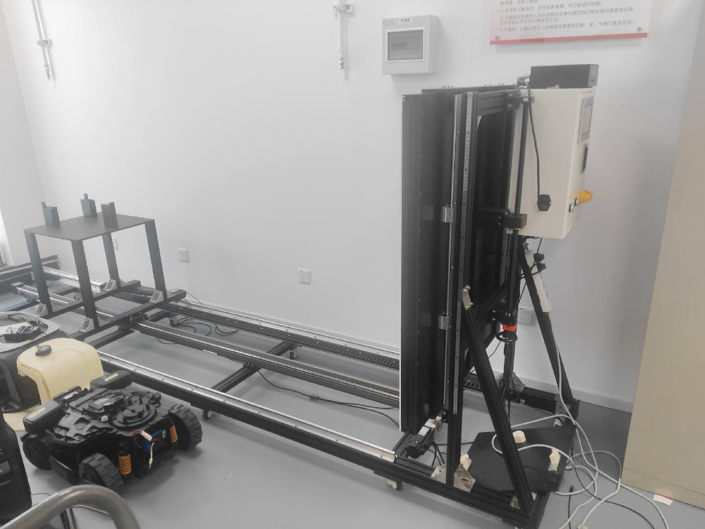
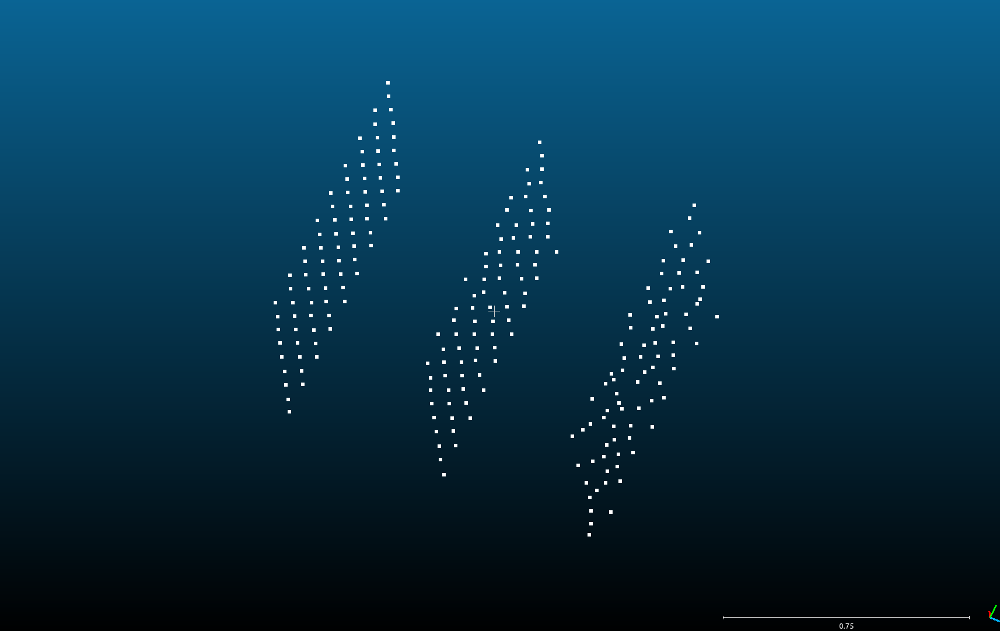
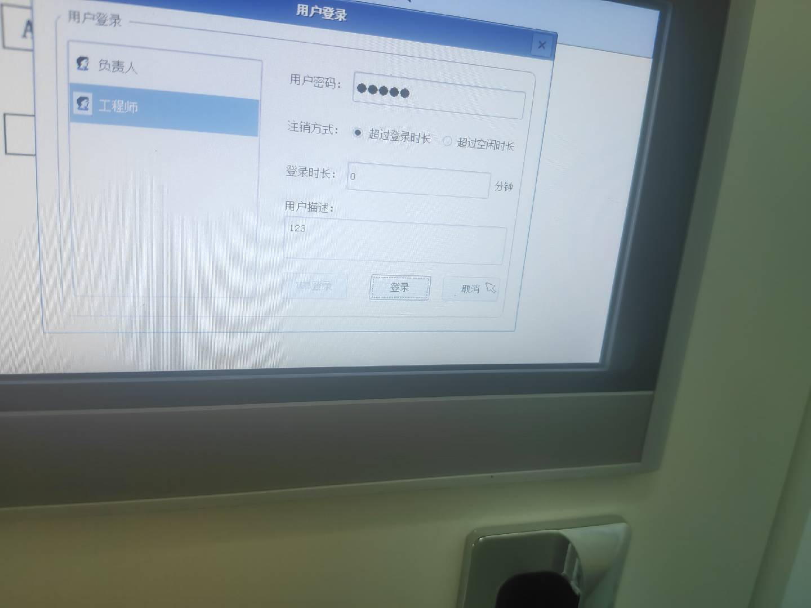
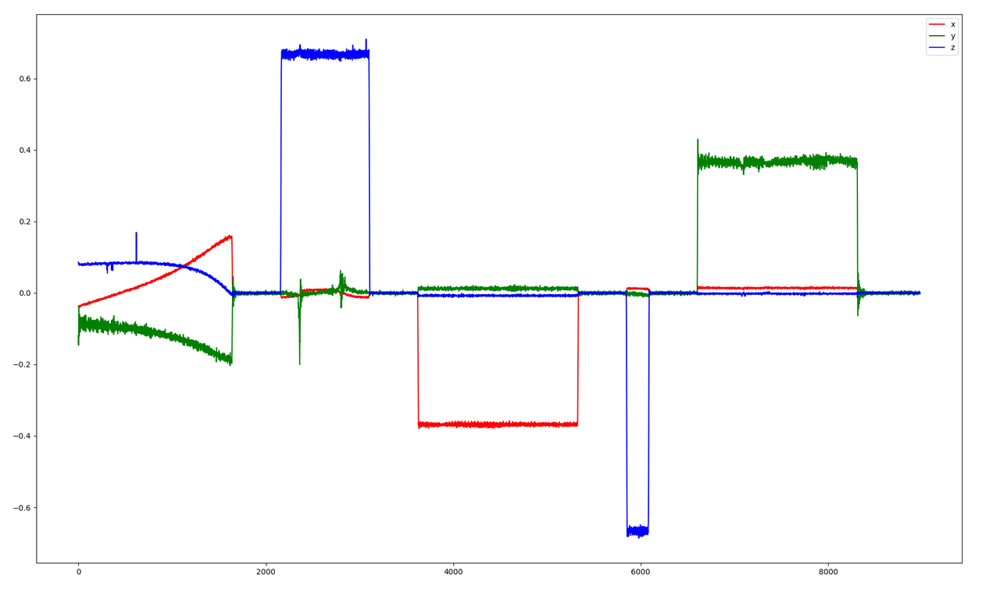

# IQC交接文档

# 一 总体情况

&#x20;  &#x20;

&#x20;   &#x20;

# 二滑轨工站

&#x20; 目的：检测双目相机的内参和双目直接基线是否符合实际；

&#x20; 输入：标定参数文件

&#x20;          分别在 100cm    150cm   200cm 三个距离 采集原始分辨率的图像

&#x20;         采集指令   uart\_test -t AT+CAMERA=2,YUV\_ORG%

&#x20;输出：result/result.json文件

&#x20;         dx\&dy：左右目的cx和像素中心的差（对于）

&#x20;         diff0 ：100cm平面和150cm平面的距离（前一个平面的zhi下平面的距离）

&#x20;         diff1 ：150cm平面和200cm平面的距离（前一个平面的zhi下平面的距离）

&#x20;         每一个距离都有的数据

&#x20;              1 平面度 ：最大值

&#x20;                              平均值

&#x20;              2 行差：

&#x20;              3 重投影误差

&#x20;        装备  ：三米滑轨，

&#x20;            &#x20;

&#x20;             &#x20;

&#x20;密码：123456

&#x20;              &#x20;

&#x20;               操作简单  ，需要哪个距离点哪个距离的按钮。 &#x20;

点云观察工具  cloudcompare&#x20;

&#x20;&#x20;

&#x20;            &#x20;

&#x20;注意事项：注意背光不能太亮，环境光越暗越好。不然识别不到棋盘格，或者角点识别不准确。

# 三机械臂工站

&#x20; 目的： 检测imu的外参是否正确，

&#x20;           检验imu的gyro是否符合实际

&#x20;输入：标定参数文件

&#x20;          IMULog.txt  //三轴imu的gyro积分的

&#x20;          vio文件夹  // imu 和图像数据

输出：result/result.json

&#x20;         imu的gyro三轴的角度积分&#x20;

&#x20;         机械臂标定的角度和厂家标定的角度 做对比 &#x20;

&#x20;         机械臂标定的平移量和结构尺寸做对比。

装备：机械臂

&#x20;         密码：12345

&#x20;        对应的imu的gryo积分的图表

# 四 部署 &#x20;

&#x20;      &#x20;

&#x20;    &#x20;

&#x20;     TODO：

&#x20;       1  昆山工厂3m滑轨会有无法生产  result.json的情况，1%，自己电脑无法复现，同一个模组多测一次也不一定复现。

&#x20;      2 机械臂工站，实时卡极限还没加上。

&#x20;         &#x20;

&#x20;        &#x20;

&#x20;    &#x20;
