# 售后标定流程文档

# 一、工站&要求

1. 如图所示，在一个1.5m x 1.5m x 1m（高）的墙角贴满二维码（材质、规格与工厂标定方案一致）可以提供。

2. 张贴牢固，不鼓包，不变形。

3. 场地地面要求平整，要摩擦力大的硬质地面避免打滑。

4. 墙角周边2mx2m的区域能够摆放机器。

5. 地面上也需要贴上如图所示的二维码。

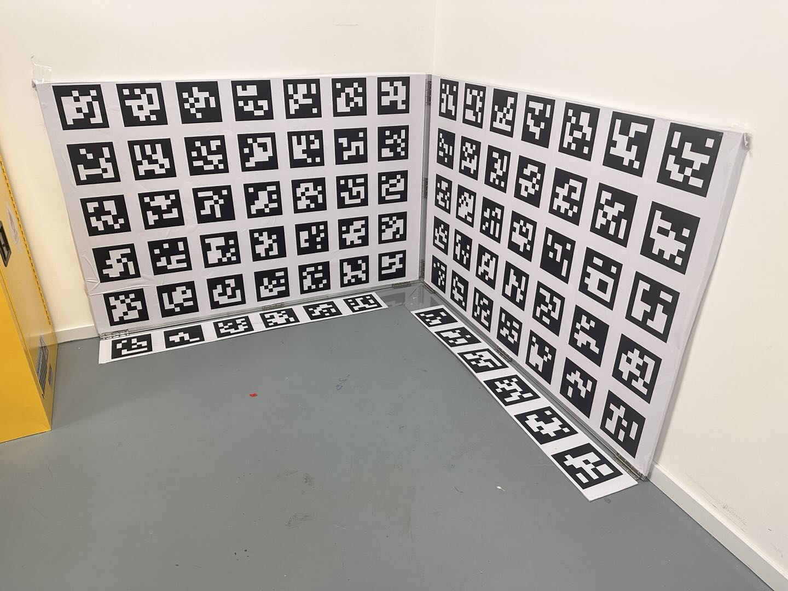

* 场地俯视示意图

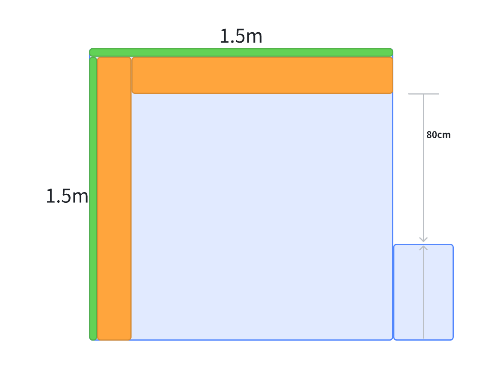

# 二、标定动作

> 在标定阶段，机器需要执行预设的动作，进行数据采集。
>
> * **Monet项目，机器动作**：轨迹工形
>
>   1. 机器从初始位置，先逆时针旋转180度，
>
>   2. 随后顺时针旋转135度，
>
>   3. 之后沿着对角线走1.2m，
>
>   4. 再顺时针旋转90度，
>
>   5. 逆时针旋转180度，
>
>   6. 顺时针旋转180度后静止，开始计算外参。
>
> * **Versa项目，机器动作**：
>
>   1. 机器逆时针旋转45度，
>
>   2. 前进0.9米，
>
>   3. 原地掉头后，前进1.0米，
>
>   4. 原地掉头，前进0.1米，
>
>   5. 机器逆时针旋转45度，机器回到初始位置，
>
>   6. 逆时针旋转180度，
>
>   7. 随后顺时针旋转135度，
>
>   8. 之后沿着对角线走1.2m，
>
>   9. 再顺时针旋转90度，
>
>   10. 逆时针旋转180度，
>
>   11. 顺时针旋转180度后静止，开始计算外参。

&#x20;

# 三、标定流程

1. 手机app和机器配网成功后，打开日志上传功能，如下图所示：

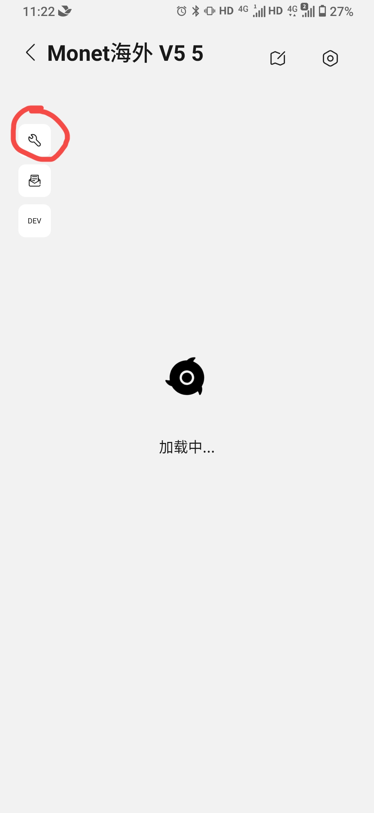

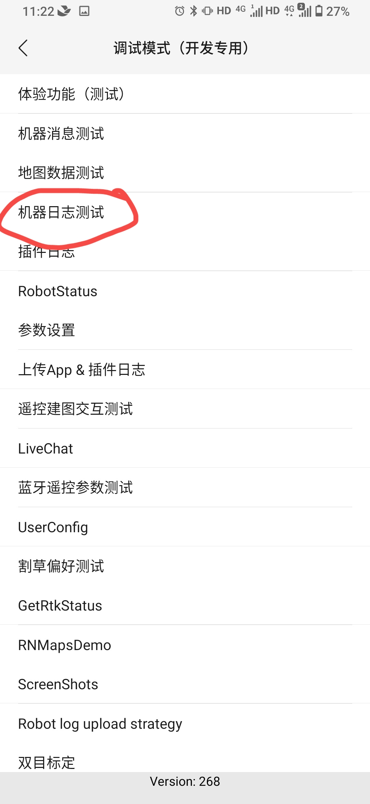

* 进入标定模式：在手机app端**售后模式**里选择**双目标定。**

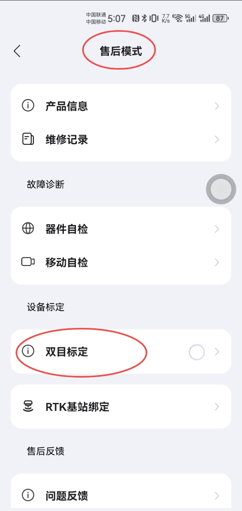

* 按照提示正确布置标定场景。

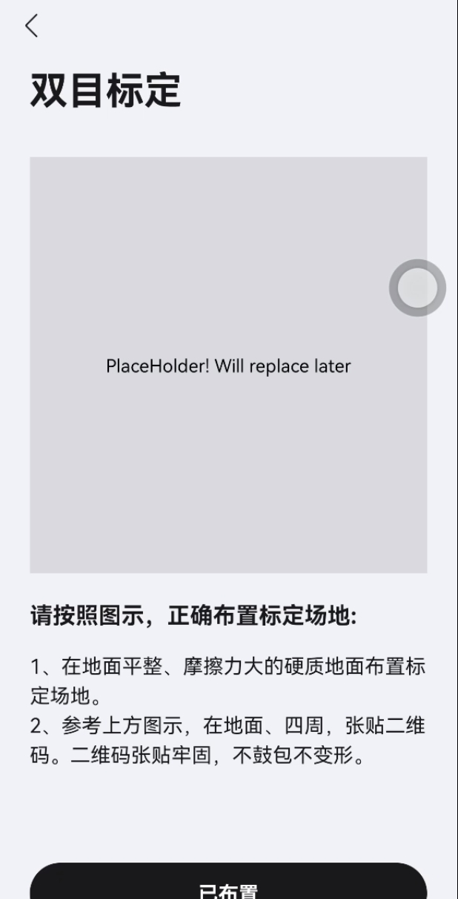

4. 按照提示正确摆放机器起始位置。如图所示头朝右、与右边墙面垂直，机器最前端位置距离底部二维码边缘向后0cm、向左约80cm（后轮对应标定场地最左侧边缘）。

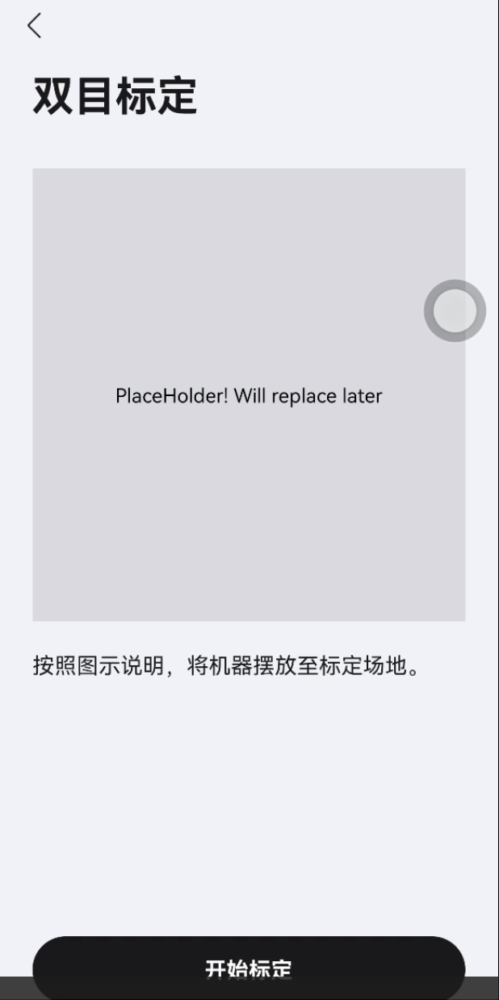

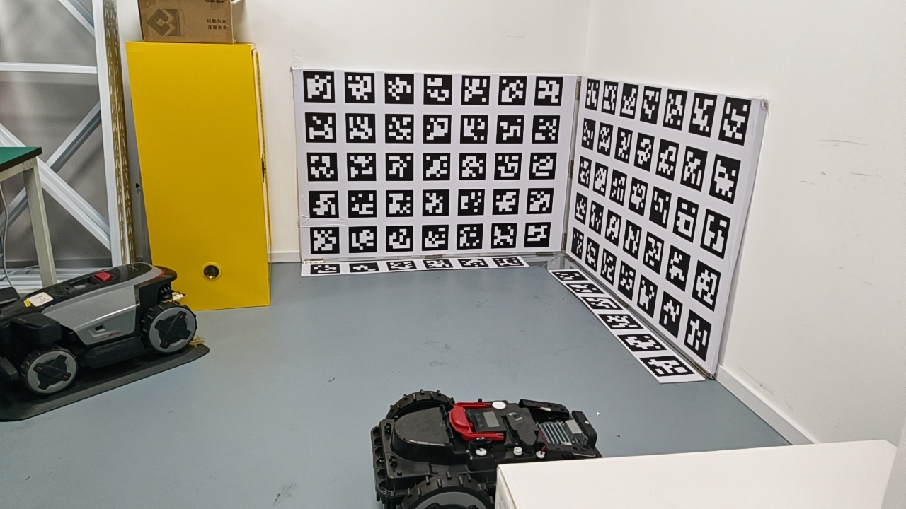

* 点击开始标定，机器开始运动，手机app显示售后模式如下图。

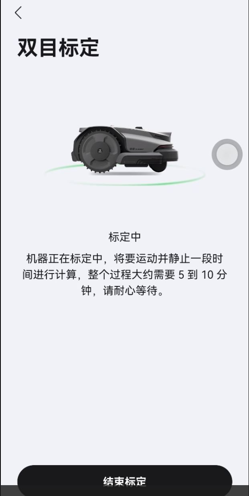

* 运动完成机器静止，等待3分钟左右，手机app上显示标定成功，标定结果会自动写入机器模组，点击**结束标定**退出标定模式; 如果失败，app上会报错误码。

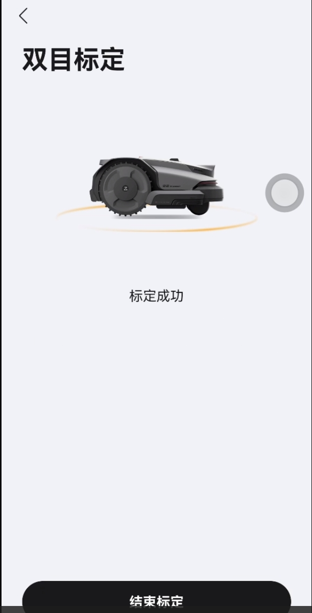

# 四、补充说明

## 1. 什么情况下需要重新标定

* 任何涉及到轮子、双目相机，激光雷达相对于整机位置的改动，都需要重新进行整机标定

* 比如

  * 更换\拆装双目模组

  * 更换\拆装激光雷达（不含雷达金属保护罩）

  * 更换\拆装轮组（前、后轮）

  * 机器开盖（带相机的结构被拆下、打开）

售后行差标定检测

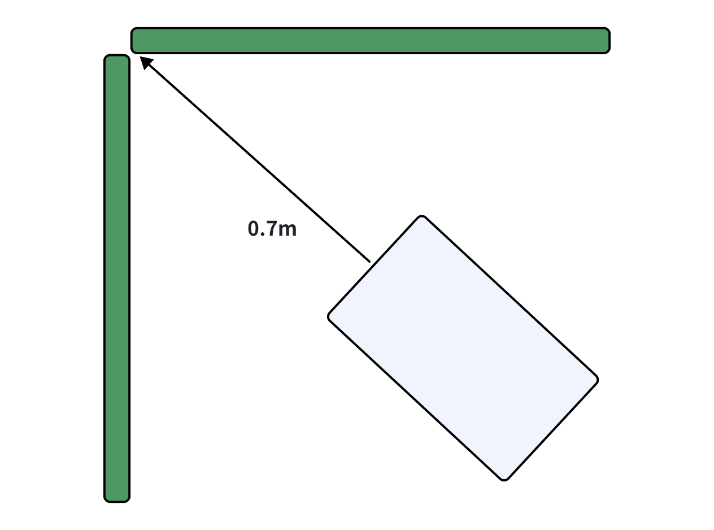

